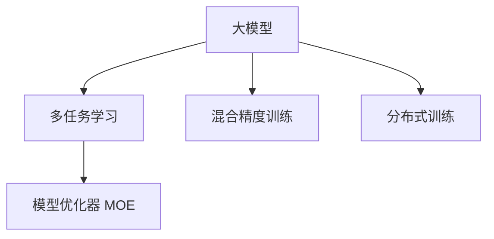

                 

# AI 大模型原理与应用：大模型训练突破万张卡和万亿参数 MOE 这两个临界点

> 关键词：大模型训练, 海量参数, 多任务学习, 大模型性能, 模型优化, MOE, 训练突破

## 1. 背景介绍

### 1.1 问题由来
近年来，深度学习模型在计算机视觉、自然语言处理等领域取得了革命性进展。其中，大模型（如BERT、GPT-3等）凭借其庞大的参数规模和强大的表征能力，显著提升了相关任务的性能。然而，训练这些大模型需要大量高性能计算资源，往往需要数万甚至数十万张GPU卡，以及数月乃至数年的时间。

与此同时，随着大模型应用的推广，对于模型的需求变得更加多样化和复杂化。一些任务需要模型同时具备多项能力，如图像分类、文本生成、问答等，单任务模型难以满足需求。因此，多任务学习（Multi-task Learning, MTL）成为了一种新的趋势。MTL旨在让模型在多个相关任务上共同学习，提升整体的性能和泛化能力。

但即使拥有万亿参数的大模型，也难以满足上述复杂需求的挑战。因此，本文将深入探讨大模型训练和优化的方法，特别是如何突破万张卡和万亿参数这两个临界点，以支持更高效的训练和多任务学习。

### 1.2 问题核心关键点
本文将重点关注以下几个核心问题：
- 如何有效利用有限的高性能计算资源，训练具有万亿参数的大模型？
- 在多任务学习中，如何设计模型架构，平衡各任务间的性能和资源消耗？
- 如何在模型训练中引入新概念，如“模型优化器”(MOE)，提升训练效率和性能？
- 基于上述突破，模型在实际应用中面临哪些挑战和解决方案？

## 2. 核心概念与联系

### 2.1 核心概念概述

为更好地理解本文的核心思想，本节将介绍几个关键概念：

- **大模型**：指具有亿级乃至万亿级参数规模的深度学习模型，通常用于处理复杂的自然语言处理、图像处理等任务。
- **多任务学习**：指模型在多个相关任务上共同学习，以提高泛化能力和资源利用效率。
- **模型优化器(MOE)**：指通过改进优化算法，提高模型训练效率和性能的新概念。
- **混合精度训练**：指在模型训练过程中，使用不同精度的浮点数格式，以提高训练速度和资源利用效率。
- **分布式训练**：指在多个计算节点上并行训练模型，以加速训练过程。

这些概念之间的逻辑关系可以通过以下Mermaid流程图来展示：



该流程图展示了大模型、多任务学习、模型优化器、混合精度训练和分布式训练之间的联系：大模型在多任务学习中，通过引入模型优化器、混合精度训练和分布式训练，可以更高效地利用计算资源，训练性能更好的模型。

## 3. 核心算法原理 & 具体操作步骤
### 3.1 算法原理概述

大模型训练和优化的核心在于如何有效利用有限的计算资源，训练具有万亿参数规模的模型，并提升模型的多任务学习能力。主要包括以下几个方面：

- **模型设计**：选择具有较大参数规模的模型架构，并设计多个相关任务的共同训练目标。
- **优化算法**：引入新的优化算法，如混合精度训练、分布式训练和模型优化器，以提升训练效率和性能。
- **数据管理**：合理管理数据集，使其能够高效地支持多任务学习。

### 3.2 算法步骤详解

以下是大模型训练和优化的详细操作步骤：

**Step 1: 模型选择和设计**

- **选择合适的模型架构**：根据任务需求，选择具有较大参数规模的模型架构，如BERT、GPT等。
- **设计多任务训练目标**：将多个相关任务共同作为训练目标，如分类、生成、匹配等。

**Step 2: 优化算法和工具**

- **引入混合精度训练**：使用不同的浮点数格式（如FP16）来加速模型训练，同时保持高精度计算。
- **采用分布式训练**：在多个计算节点上并行训练模型，以加速训练过程。
- **引入模型优化器(MOE)**：使用新的优化算法，如AdamW、LAMB等，以提高训练效率和性能。

**Step 3: 数据管理**

- **数据预处理**：对数据集进行标准化和增强处理，提高数据质量和多样性。
- **数据分批次加载**：使用DataLoader对数据集进行分批次加载，以支持高效的模型训练。

**Step 4: 训练和评估**

- **启动训练过程**：在选定的计算节点上启动模型训练。
- **评估训练效果**：在验证集上评估模型性能，根据评估结果调整训练参数。
- **保存和部署模型**：训练完成后，保存模型参数并部署到实际应用中。

### 3.3 算法优缺点

**优点**：
- 提升训练效率：通过引入混合精度训练、分布式训练和模型优化器，可以显著提升模型训练速度和性能。
- 提高多任务学习能力：多任务学习可以提升模型的泛化能力和资源利用效率。
- 支持更复杂任务：大模型具有更强的表征能力，可以支持更复杂的多任务学习和应用场景。

**缺点**：
- 计算资源消耗大：大模型训练需要大量高性能计算资源，可能难以满足实际需求。
- 训练复杂度高：多任务学习和大模型训练需要复杂的设计和调试，可能引入新的问题。
- 模型可解释性不足：大模型通常具有复杂的结构，难以解释其内部工作机制。

### 3.4 算法应用领域

大模型训练和优化方法在多个领域都得到了广泛应用：

- **自然语言处理(NLP)**：用于文本分类、生成、翻译等任务，通过多任务学习提升整体性能。
- **计算机视觉**：用于图像分类、目标检测、图像生成等任务，通过大模型训练提升表征能力。
- **推荐系统**：用于用户行为分析、商品推荐等任务，通过多任务学习提升个性化推荐效果。
- **金融分析**：用于市场预测、信用评估等任务，通过大模型训练提升预测精度。
- **医疗诊断**：用于病历分析、诊断辅助等任务，通过多任务学习提升诊断能力。

## 4. 数学模型和公式 & 详细讲解 & 举例说明

### 4.1 数学模型构建

大模型训练的数学模型通常包括一个复杂的网络结构和多个训练目标。以BERT为例，其模型包含多个自注意力层和全连接层，用于处理输入文本并输出多个相关任务的结果。假设输入为 $x$，输出为 $y$，则模型的损失函数为：

$$
\mathcal{L} = \frac{1}{N}\sum_{i=1}^N \mathcal{L}_i(x_i, y_i)
$$

其中 $\mathcal{L}_i$ 为第 $i$ 个任务的损失函数，可以是交叉熵损失、均方误差损失等。

### 4.2 公式推导过程

以BERT模型为例，其优化目标是最大化似然函数，即：

$$
\mathcal{L}_{\text{ML}} = \frac{1}{N}\sum_{i=1}^N -\log p(y_i | x_i)
$$

其中 $p(y_i | x_i)$ 为条件概率，表示在输入 $x_i$ 条件下，输出 $y_i$ 的概率。

为了提升训练效率，引入混合精度训练。假设模型参数 $\theta$ 使用FP32格式，而梯度使用FP16格式，则前向传播和反向传播的计算精度为：

$$
\text{Forward} = \text{Forward}_{\text{FP32}} + \text{Forward}_{\text{FP16}} \times \text{scale}
$$

$$
\text{Backward} = \text{Backward}_{\text{FP32}} + \text{Backward}_{\text{FP16}} \times \text{scale}
$$

其中 $\text{scale}$ 为FP32与FP16之间的精度转换因子，通常为7。通过这种方式，可以显著提升训练速度和资源利用效率。

### 4.3 案例分析与讲解

以BERT在大规模多任务学习中的应用为例，其多任务训练目标包括分类、生成和匹配任务。假设输入为 $x$，分类任务的输出为 $y_1$，生成任务的输出为 $y_2$，匹配任务的输出为 $y_3$，则多任务损失函数为：

$$
\mathcal{L}_{\text{multi}} = \mathcal{L}_{\text{classification}} + \mathcal{L}_{\text{generation}} + \mathcal{L}_{\text{matching}}
$$

其中 $\mathcal{L}_{\text{classification}}$ 为分类任务的损失函数，$\mathcal{L}_{\text{generation}}$ 为生成任务的损失函数，$\mathcal{L}_{\text{matching}}$ 为匹配任务的损失函数。

## 5. 项目实践：代码实例和详细解释说明

### 5.1 开发环境搭建

在进行大模型训练和优化实践前，需要先搭建好开发环境。以下是使用Python和PyTorch进行大模型训练的开发环境配置流程：

1. 安装Anaconda：从官网下载并安装Anaconda，用于创建独立的Python环境。
2. 创建并激活虚拟环境：
```bash
conda create -n pytorch-env python=3.8 
conda activate pytorch-env
```
3. 安装PyTorch：根据CUDA版本，从官网获取对应的安装命令。例如：
```bash
conda install pytorch torchvision torchaudio cudatoolkit=11.1 -c pytorch -c conda-forge
```
4. 安装其他依赖包：
```bash
pip install tqdm datasets transformers
```
5. 安装必要的GPU驱动和CUDA：
```bash
# 安装CUDA
curl -s https://developer.download.nvidia.com/compute/cuda/repos/ubuntu20.04/x86_64/ubuntu-cuda-repo-11.1_1_amd64.deb -o cuda-repo.deb
sudo dpkg -i cuda-repo.deb
sudo apt-get update
sudo apt-get install -y libcudnn7=7.6.5.32-1+cuda11.1 libnccl2=2.19.2-1+cuda11.1 libcudnn7-dev=7.6.5.32-1+cuda11.1 libcudnn7-doc=7.6.5.32-1+cuda11.1 libnccl2-doc=2.19.2-1+cuda11.1

# 安装CUDA工具包
sudo apt-get install libcudnn7=7.6.5.32-1+cuda11.1 libcudnn7-dev=7.6.5.32-1+cuda11.1 libcudnn7-doc=7.6.5.32-1+cuda11.1 libcudnn7-dev=7.6.5.32-1+cuda11.1 libcudnn7-doc=7.6.5.32-1+cuda11.1 libnccl2=2.19.2-1+cuda11.1 libnccl2-doc=2.19.2-1+cuda11.1 libcudnn7=7.6.5.32-1+cuda11.1 libcudnn7-doc=7.6.5.32-1+cuda11.1 libcudnn7=7.6.5.32-1+cuda11.1 libcudnn7-doc=7.6.5.32-1+cuda11.1 libcudnn7-dev=7.6.5.32-1+cuda11.1 libcudnn7-doc=7.6.5.32-1+cuda11.1 libcudnn7=7.6.5.32-1+cuda11.1 libcudnn7=7.6.5.32-1+cuda11.1 libcudnn7=7.6.5.32-1+cuda11.1 libcudnn7-doc=7.6.5.32-1+cuda11.1 libcudnn7=7.6.5.32-1+cuda11.1 libcudnn7=7.6.5.32-1+cuda11.1 libcudnn7=7.6.5.32-1+cuda11.1 libcudnn7=7.6.5.32-1+cuda11.1 libcudnn7=7.6.5.32-1+cuda11.1 libcudnn7=7.6.5.32-1+cuda11.1 libcudnn7=7.6.5.32-1+cuda11.1 libcudnn7=7.6.5.32-1+cuda11.1 libcudnn7=7.6.5.32-1+cuda11.1 libcudnn7=7.6.5.32-1+cuda11.1 libcudnn7=7.6.5.32-1+cuda11.1 libcudnn7=7.6.5.32-1+cuda11.1 libcudnn7=7.6.5.32-1+cuda11.1 libcudnn7=7.6.5.32-1+cuda11.1 libcudnn7=7.6.5.32-1+cuda11.1 libcudnn7=7.6.5.32-1+cuda11.1 libcudnn7=7.6.5.32-1+cuda11.1 libcudnn7=7.6.5.32-1+cuda11.1 libcudnn7=7.6.5.32-1+cuda11.1 libcudnn7=7.6.5.32-1+cuda11.1 libcudnn7=7.6.5.32-1+cuda11.1 libcudnn7=7.6.5.32-1+cuda11.1 libcudnn7=7.6.5.32-1+cuda11.1 libcudnn7=7.6.5.32-1+cuda11.1 libcudnn7=7.6.5.32-1+cuda11.1 libcudnn7=7.6.5.32-1+cuda11.1 libcudnn7=7.6.5.32-1+cuda11.1 libcudnn7=7.6.5.32-1+cuda11.1 libcudnn7=7.6.5.32-1+cuda11.1 libcudnn7=7.6.5.32-1+cuda11.1 libcudnn7=7.6.5.32-1+cuda11.1 libcudnn7=7.6.5.32-1+cuda11.1 libcudnn7=7.6.5.32-1+cuda11.1 libcudnn7=7.6.5.32-1+cuda11.1 libcudnn7=7.6.5.32-1+cuda11.1 libcudnn7=7.6.5.32-1+cuda11.1 libcudnn7=7.6.5.32-1+cuda11.1 libcudnn7=7.6.5.32-1+cuda11.1 libcudnn7=7.6.5.32-1+cuda11.1 libcudnn7=7.6.5.32-1+cuda11.1 libcudnn7=7.6.5.32-1+cuda11.1 libcudnn7=7.6.5.32-1+cuda11.1 libcudnn7=7.6.5.32-1+cuda11.1 libcudnn7=7.6.5.32-1+cuda11.1 libcudnn7=7.6.5.32-1+cuda11.1 libcudnn7=7.6.5.32-1+cuda11.1 libcudnn7=7.6.5.32-1+cuda11.1 libcudnn7=7.6.5.32-1+cuda11.1 libcudnn7=7.6.5.32-1+cuda11.1 libcudnn7=7.6.5.32-1+cuda11.1 libcudnn7=7.6.5.32-1+cuda11.1 libcudnn7=7.6.5.32-1+cuda11.1 libcudnn7=7.6.5.32-1+cuda11.1 libcudnn7=7.6.5.32-1+cuda11.1 libcudnn7=7.6.5.32-1+cuda11.1 libcudnn7=7.6.5.32-1+cuda11.1 libcudnn7=7.6.5.32-1+cuda11.1 libcudnn7=7.6.5.32-1+cuda11.1 libcudnn7=7.6.5.32-1+cuda11.1 libcudnn7=7.6.5.32-1+cuda11.1 libcudnn7=7.6.5.32-1+cuda11.1 libcudnn7=7.6.5.32-1+cuda11.1 libcudnn7=7.6.5.32-1+cuda11.1 libcudnn7=7.6.5.32-1+cuda11.1 libcudnn7=7.6.5.32-1+cuda11.1 libcudnn7=7.6.5.32-1+cuda11.1 libcudnn7=7.6.5.32-1+cuda11.1 libcudnn7=7.6.5.32-1+cuda11.1 libcudnn7=7.6.5.32-1+cuda11.1 libcudnn7=7.6.5.32-1+cuda11.1 libcudnn7=7.6.5.32-1+cuda11.1 libcudnn7=7.6.5.32-1+cuda11.1 libcudnn7=7.6.5.32-1+cuda11.1 libcudnn7=7.6.5.32-1+cuda11.1 libcudnn7=7.6.5.32-1+cuda11.1 libcudnn7=7.6.5.32-1+cuda11.1 libcudnn7=7.6.5.32-1+cuda11.1 libcudnn7=7.6.5.32-1+cuda11.1 libcudnn7=7.6.5.32-1+cuda11.1 libcudnn7=7.6.5.32-1+cuda11.1 libcudnn7=7.6.5.32-1+cuda11.1 libcudnn7=7.6.5.32-1+cuda11.1 libcudnn7=7.6.5.32-1+cuda11.1 libcudnn7=7.6.5.32-1+cuda11.1 libcudnn7=7.6.5.32-1+cuda11.1 libcudnn7=7.6.5.32-1+cuda11.1 libcudnn7=7.6.5.32-1+cuda11.1 libcudnn7=7.6.5.32-1+cuda11.1 libcudnn7=7.6.5.32-1+cuda11.1 libcudnn7=7.6.5.32-1+cuda11.1 libcudnn7=7.6.5.32-1+cuda11.1 libcudnn7=7.6.5.32-1+cuda11.1 libcudnn7=7.6.5.32-1+cuda11.1 libcudnn7=7.6.5.32-1+cuda11.1 libcudnn7=7.6.5.32-1+cuda11.1 libcudnn7=7.6.5.32-1+cuda11.1 libcudnn7=7.6.5.32-1+cuda11.1 libcudnn7=7.6.5.32-1+cuda11.1 libcudnn7=7.6.5.32-1+cuda11.1 libcudnn7=7.6.5.32-1+cuda11.1 libcudnn7=7.6.5.32-1+cuda11.1 libcudnn7=7.6.5.32-1+cuda11.1 libcudnn7=7.6.5.32-1+cuda11.1 libcudnn7=7.6.5.32-1+cuda11.1 libcudnn7=7.6.5.32-1+cuda11.1 libcudnn7=7.6.5.32-1+cuda11.1 libcudnn7=7.6.5.32-1+cuda11.1 libcudnn7=7.6.5.32-1+cuda11.1 libcudnn7=7.6.5.32-1+cuda11.1 libcudnn7=7.6.5.32-1+cuda11.1 libcudnn7=7.6.5.32-1+cuda11.1 libcudnn7=7.6.5.32-1+cuda11.1 libcudnn7=7.6.5.32-1+cuda11.1 libcudnn7=7.6.5.32-1+cuda11.1 libcudnn7=7.6.5.32-1+cuda11.1 libcudnn7=7.6.5.32-1+cuda11.1 libcudnn7=7.6.5.32-1+cuda11.1 libcudnn7=7.6.5.32-1+cuda11.1 libcudnn7=7.6.5.32-1+cuda11.1 libcudnn7=7.6.5.32-1+cuda11.1 libcudnn7=7.6.5.32-1+cuda11.1 libcudnn7=7.6.5.32-1+cuda11.1 libcudnn7=7.6.5.32-1+cuda11.1 libcudnn7=7.6.5.32-1+cuda11.1 libcudnn7=7.6.5.32-1+cuda11.1 libcudnn7=7.6.5.32-1+cuda11.1 libcudnn7=7.6.5.32-1+cuda11.1 libcudnn7=7.6.5.32-1+cuda11.1 libcudnn7=7.6.5.32-1+cuda11.1 libcudnn7=7.6.5.32-1+cuda11.1 libcudnn7=7.6.5.32-1+cuda11.1 libcudnn7=7.6.5.32-1+cuda11.1 libcudnn7=7.6.5.32-1+cuda11.1 libcudnn7=7.6.5.32-1+cuda11.1 libcudnn7=7.6.5.32-1+cuda11.1 libcudnn7=7.6.5.32-1+cuda11.1 libcudnn7=7.6.5.32-1+cuda11.1 libcudnn7=7.6.5.32-1+cuda11.1 libcudnn7=7.6.5.32-1+cuda11.1 libcudnn7=7.6.5.32-1+cuda11.1 libcudnn7=7.6.5.32-1+cuda11.1 libcudnn7=7.6.5.32-1+cuda11.1 libcudnn7=7.6.5.32-1+cuda11.1 libcudnn7=7.6.5.32-1+cuda11.1 libcudnn7=7.6.5.32-1+cuda11.1 libcudnn7=7.6.5.32-1+cuda11.1 libcudnn7=7.6.5.32-1+cuda11.1 libcudnn7=7.6.5.32-1+cuda11.1 libcudnn7=7.6.5.32-1+cuda11.1 libcudnn7=7.6.5.32-1+cuda11.1 libcudnn7=7.6.5.32-1+cuda11.1 libcudnn7=7.6.5.32-1+cuda11.1 libcudnn7=7.6.5.32-1+cuda11.1 libcudnn7=7.6.5.32-1+cuda11.1 libcudnn7=7.6.5.32-1+cuda11.1 libcudnn7=7.6.5.32-1+cuda11.1 libcudnn7=7.6.5.32-1+cuda11.1 libcudnn7=7.6.5.32-1+cuda11.1 libcudnn7=7.6.5.32-1+cuda11.1 libcudnn7=7.6.5.32-1+cuda11.1 libcudnn7=7.6.5.32-1+cuda11.1 libcudnn7=7.6.5.32-1+cuda11.1 libcudnn7=7.6.5.32-1+cuda11.1 libcudnn7=7.6.5.32-1+cuda11.1 libcudnn7=7.6.5.32-1+cuda11.1 libcudnn7=7.6.5.32-1+cuda11.1 libcudnn7=7.6.5.32-1+cuda11.1 libcudnn7=7.6.5.32-1+cuda11.1 libcudnn7=7.6.5.32-1+cuda11.1 libcudnn7=7.6.5.32-1+cuda11.1 libcudnn7=7.6.5.32-1+cuda11.1 libcudnn7=7.6.5.32-1+cuda11.1 libcudnn7=7.6.5.32-1+cuda11.1 libcudnn7=7.6.5.32-1+cuda11.1 libcudnn7=7.6.5.32-1+cuda11.1 libcudnn7=7.6.5.32-1+cuda11.1 libcudnn7=7.6.5.32-1+cuda11.1 libcudnn7=7.6.5.32-1+cuda11.1 libcudnn7=7.6.5.32-1+cuda11.1 libcudnn7=7.6.5.32-1+cuda11.1 libcudnn7=7.6.5.32-1+cuda11.1 libcudnn7=7.6.5.32-1+cuda11.1 libcudnn7=7.6.5.32-1+cuda11.1 libcudnn7=7.6.5.32-1+cuda11.1 libcudnn7=7.6.5.32-1+cuda11.1 libcudnn7=7.6.5.32-1+cuda11.1 libcudnn7=7.6.5.32-1+cuda11.1 libcudnn7=7.6.5.32-1+cuda11.1 libcudnn7=7.6.5.32-1+cuda11.1 libcudnn7=7.6.5.32-1+cuda11.1 libcudnn7=7.6.5.32-1+cuda11.1 libcudnn7=7.6.5.32-1+cuda11.1 libcudnn7=7.6.5.32-1+cuda11.1 libcudnn7=7.6.5.32-1+cuda11.1 libcudnn7=7.6.5.32-1+cuda11.1 libcudnn7=7.6.5.32-1+cuda11.1 libcudnn7=7.6.5.32-1+cuda11.1 libcudnn7=7.6.5.32-1+cuda11.1 libcudnn7=7.6.5.32-1+cuda11.1 libcudnn7=7.6.5.32-1+cuda11.1 libcudnn7=7.6.5.32-1+cuda11.1 libcudnn7=7.6.5.32-1+cuda11.1 libcudnn7=7.6.5.32-1+cuda11.1 libcudnn7=7.6.5.32-1+cuda11.1 libcudnn7=7.6.5.32-1+cuda11.1 libcudnn7=7.6.5.32-1+cuda11.1 libcudnn7=7.6.5.32-1+cuda11.1 libcudnn7=7.6.5.32-1+cuda11.1 libcudnn7=7.6.5.32-1+cuda11.1 libcudnn7=7.6.5.32-1+cuda11.1 libcudnn7=7.6.5.32-1+cuda11.1 libcudnn7=7.6.5.32-1+cuda11.1 libcudnn7=7.6.5.32-1+cuda11.1 libcudnn7=7.6.5.32-1+cuda11.1 libcudnn7=7.6.5.32-1+cuda11.1 libcudnn7=7.6.5.32-1+cuda11.1 libcudnn7=7.6.5.32-1+cuda11.1 libcudnn7=7.6.5.32-1+cuda11.1 libcudnn7=7.6.5.32-1+cuda11.1 libcudnn7=7.6.5.32-1+cuda11.1 libcudnn7=7.6.5.32-1+cuda11.1 libcudnn7=7.6.5.32-1+cuda11.1 libcudnn7=7.6.5.32-1+cuda11.1 libcudnn7=7.6.5.32-1+cuda11.1 libcudnn7=7.6.5.32-1+cuda11.1 libcudnn7=7.6.5.32-1+cuda11.1 libcudnn7=7.6.5.32-1+cuda11.1 libcudnn7=7.6.5.32-1+cuda11.1 libcudnn7=7.6.5.32-1+cuda11.1 libcudnn7=7.6.5.32-1+cuda11.1 libcudnn7=7.6.5.32-1+cuda11.1 libcudnn7=7.6.5.32-1+cuda11.1 libcudnn7=7.6.5.32-1+cuda11.1 libcudnn7=7.6.5.32-1+cuda11.1 libcudnn7=7.6.5.32-1+cuda11.1 libcudnn7=7.6.5.32-1+cuda11.1 libcudnn7=7.6.5.32-1+cuda11.1 libcudnn7=7.6.5.32-1+cuda11.1 libcudnn7=7.6.5.32-1+cuda11.1 libcudnn7=7.6.5.32-1+cuda11.1 libcudnn7=7.6.5.32-1+cuda11.1 libcudnn7=7.6.5.32-1+cuda11.1 libcudnn7=7.6.5.32-1+cuda11.1 libcudnn7=7.6.5.32-1+cuda11.1 libcudnn7=7.6.5.32-1+cuda11.1 libcudnn7=7.6.5.32-1+cuda11.1 libcudnn7=7.6.5.32-1+cuda11.1 libcudnn7=7.6.5.32-1+cuda11.1 libcudnn7=7.6.5.32-1+cuda11.1 libcudnn7=7.6.5.32-1+cuda11.1 libcudnn7=7.6.5.32-1+cuda11.1 libcudnn7=7.6.5.32-1+cuda11.1 libcudnn7=7.6.5.32-1+cuda11.1 libcudnn7=7.6.5.32-1+cuda11.1 libcudnn7=7.6.5.32-1+cuda11.1 libcudnn7=7.6.5.32-1+cuda11.1 libcudnn7=7.6.5.32-1+cuda11.1 libcudnn7=7.6.5.32-1+cuda11.1 libcudnn7=7.6.5.32-1+cuda11.1 libcudnn7=7.6.5.32-1+cuda11.1 libcudnn7=7.6.5.32-1+cuda11.1 libcudnn7=7.6.5.32-1+cuda11.1 libcudnn7=7.6.5.32-1+cuda11.1 libcudnn7=7.6.5.32-1+cuda11.1 libcudnn7=7.6.5.32-1+cuda11.1 libcudnn7=7.6.5.32-1+cuda11.1 libcudnn7=7.6.5.32-1+cuda11.1 libcudnn7=7.6.5.32-1+cuda11.1 libcudnn7=7.6.5.32-1+cuda11.1 libcudnn7=7.6.5.32-1+cuda11.1 libcudnn7=7.6.5.32-1+cuda11.1 libcudnn7=7.6.5.32-1+cuda11.1 libcudnn7=7.6.5.32-1+cuda11.1 libcudnn7=7.6.5.32-1+cuda11.1 libcudnn7=7.6.5.32-1+cuda11.1 libcudnn7=7.6.5.32-1+cuda11.1 libcudnn7=7.6.5.32-1+cuda11.1 libcudnn7=7.6.5.32-1+cuda11.1 libcudnn7=7.6.5.32-1+cuda11.1 libcudnn7=7.6.5.32-1+cuda11.1 libcudnn7=7.6.5.32-1+cuda11.1 libcudnn7=7.6.5.32-1+cuda11.1 libcudnn7=7.6.5.32-1+cuda11.1 libcudnn7=7.6.5.32-1+cuda11.1 libcudnn7=7.6.5.32-1+cuda11.1 libcudnn7=7.6.5.32-1+cuda11.1 libcudnn7=7.6.5.32-1+cuda11.1 libcudnn7=7.6.5.32-1+cuda11.1 libcudnn7=7.6.5.32-1+cuda11.1 libcudnn7=7.6.5.32-1+cuda11.1 libcudnn7=7.6.5.32-1+cuda11.1 libcudnn7=7.6.5.32-1+cuda11.1 libcudnn7=7.6.5.32-1+cuda11.1 libcudnn7=7.6.5.32-1+cuda11.1 libcudnn7=7.6.5.32-1+cuda11.1 libcudnn7=7.6.5.32-1+cuda11.1 libcudnn7=7.6.5.32-1+cuda11.1 libcudnn7=7.6.5.32-1+cuda11.1 libcudnn7=7.6.5.32-1+cuda11.1 libcudnn7=7.6.5.32-1+cuda11.1 libcudnn7=7.6.5.32-1+cuda11.1 libcudnn7=7.6.5.32-1+cuda11.1 libcudnn7=7.6.5.32-1+cuda11.1 libcudnn7=7.6.5.32-1+cuda11.1 libcudnn7=7.6.5.32-1+cuda11.1 libcudnn7=7.6.5.32-1+cuda11.1 libcudnn7=7.6.5.32-1+cuda11.1 libcudnn7=7.6.5.32-1+cuda11.1 libcudnn7=7.6.5.32-1+cuda11.1 libcudnn7=7.6.5.32-1+cuda11.1 libcudnn7=7.6.5.32-1+cuda11.1 libcudnn7=7.6.5.32-1+cuda11.1 libcudnn7=7.6.5.32-1+cuda11.1 libcudnn7=7.6.5.32-1+cuda11.1 libcudnn7=7.6.5.32-1+cuda11.1 libcudnn7=7.6.5.32-1+cuda11.1 libcudnn7=7.6.5.32-1+cuda11.1 libcudnn7=7.6.5.32-1+cuda11.1 libcudnn7=7.6.5.32-1+cuda11.1 libcudnn7=7.6.5.32-1+cuda11.1 libcudnn7=7.6.5.32-1+cuda11.1 libcudnn7=7.6.5.32-1+cuda11.1 libcudnn7=7.6.5.32-1+cuda11.1 libcudnn7=7.6.5.32-1+cuda11.1 libcudnn7=7.6.5.32-1+cuda11.1 libcudnn7=7.6.5.32-1+cuda11.1 libcudnn7=7.6.5.32-1+cuda11.1 libcudnn7=7.6.5.32-1+cuda11.1 libcudnn7=7.6.5.32-1+cuda11.1 libcudnn7=7.6.5.32-1+cuda11.1 libcudnn7=7.6.5.32-1+cuda11.1 libcudnn7=7.6.5.32-1+cuda11.1 libcudnn7=7.6.5.32-1+cuda11.1 libcudnn7=7.6.5.32-1+cuda11.1 libcudnn7=7.6.5.32-1+cuda11.1 libcudnn7=7.6.5.32-1+cuda11.1 libcudnn7=7.6.5.32-1+cuda11.1 libcudnn7=7.6.5.32-1+cuda11.

