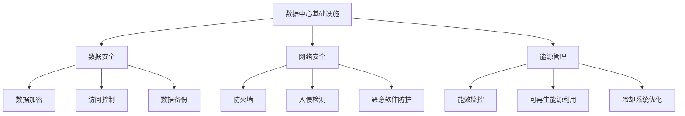

                 

# AI 大模型应用数据中心建设：数据中心安全与可靠性

> 关键词：数据中心, AI大模型, 安全性, 可靠性, 数据中心基础设施, 数据安全, 网络安全, 能源管理

## 1. 背景介绍

### 1.1 问题由来
随着人工智能(AI)技术的迅猛发展，大模型如BERT、GPT-3等在自然语言处理(NLP)、计算机视觉、推荐系统等领域展现了强大的能力。这些模型往往拥有亿级参数，在训练和推理过程中对计算资源有着极高的要求。为了应对这一需求，数据中心成为支撑AI大模型应用的关键基础设施。

数据中心不仅是提供计算和存储资源的基础设施，还肩负着保障AI大模型安全与可靠运行的重任。高昂的运营成本、复杂的网络架构、多变的业务需求，都对数据中心的建设和管理提出了巨大的挑战。如何构建一个高效、安全、可靠的数据中心，成为当下AI应用中不可回避的问题。

### 1.2 问题核心关键点
构建高效、安全、可靠的数据中心，需要从数据中心基础设施、数据安全、网络安全、能源管理等多个方面进行综合考虑。具体而言，包括以下核心问题：

1. **数据中心基础设施**：包括硬件、网络、冷却系统等构建。
2. **数据安全**：包括数据加密、访问控制、数据备份等措施。
3. **网络安全**：包括防火墙、入侵检测、恶意软件防护等安全技术。
4. **能源管理**：包括能效监控、可再生能源利用、冷却系统优化等。

这些关键点之间的逻辑关系可以通过以下Mermaid流程图来展示：



## 2. 核心概念与联系

### 2.1 核心概念概述

为了更好地理解如何构建高效、安全、可靠的数据中心，首先需要对相关的核心概念进行阐述：

- **数据中心**：是提供计算和存储资源的关键基础设施，包括服务器、网络设备、冷却系统等。
- **AI大模型**：如BERT、GPT等，通过大规模训练学习到复杂的知识表示，用于执行各种AI任务。
- **安全性**：指保护数据中心设施免受自然灾害、人为破坏、网络攻击等威胁。
- **可靠性**：指数据中心能够持续、稳定地运行，保障AI大模型的计算和推理不受中断。
- **能源管理**：指优化数据中心的能源利用，提高能效，降低运营成本。

这些概念之间存在密切联系，共同构成数据中心的建设与管理框架。

### 2.2 核心概念原理和架构的 Mermaid 流程图

下面的Mermaid流程图展示了数据中心基础设施、数据安全、网络安全、能源管理之间的联系与架构：


## 3. 核心算法原理 & 具体操作步骤

### 3.1 算法原理概述

数据中心的安全与可靠性涉及多个复杂系统，需要通过科学的管理和先进的算法实现。以下是数据中心安全与可靠性的核心算法原理概述：

1. **数据中心基础设施构建**：包括硬件采购、网络部署、冷却系统设计等，确保数据中心能够支持AI大模型的计算需求。
2. **数据安全**：通过加密、访问控制、备份等措施，保障数据不被未授权访问、篡改或丢失。
3. **网络安全**：通过防火墙、入侵检测、恶意软件防护等手段，防止网络攻击对数据中心造成破坏。
4. **能源管理**：通过能效监控、可再生能源利用、冷却系统优化等方法，降低数据中心能耗，提升能效。

### 3.2 算法步骤详解

数据中心的安全与可靠性建设是一个复杂的工程，需要多个步骤协同完成。以下是详细的步骤：

1. **需求分析**：明确数据中心的计算和存储需求，评估AI大模型的资源要求。
2. **基础设施建设**：选择合适的硬件和网络设备，设计和构建冷却系统。
3. **数据安全措施**：实施数据加密、访问控制、数据备份等技术。
4. **网络安全部署**：安装防火墙、入侵检测系统、恶意软件防护工具。
5. **能源管理优化**：部署能效监控系统，优化冷却系统，使用可再生能源。
6. **性能测试**：对数据中心进行全面测试，确保其能够满足AI大模型应用的需求。
7. **持续维护**：定期检查和更新基础设施和安全措施，保障数据中心的安全与可靠性。

### 3.3 算法优缺点

数据中心安全与可靠性的构建涉及多个方面的算法，有其优缺点：

- **优点**：
  - **多层次防御**：通过数据加密、访问控制、入侵检测等多层次的安全措施，保障数据中心的安全。
  - **自动化管理**：利用能效监控和智能算法，优化数据中心的能源使用，降低运营成本。
  - **灵活性**：通过可再生能源和智能冷却系统的设计，提高数据中心的适应性和可持续性。

- **缺点**：
  - **复杂性**：多个系统协同工作的复杂性增加了构建和管理难度。
  - **成本高**：高质量的数据中心基础设施和安全措施，需要大量的初期投资。
  - **技术更新快**：需要持续关注新兴的安全和能效技术，进行升级和优化。

### 3.4 算法应用领域

数据中心安全与可靠性的构建算法广泛应用于多个领域，包括：

- **云计算平台**：如AWS、Azure等，提供安全可靠的数据中心基础设施。
- **大数据中心**：如谷歌、亚马逊等公司的大数据中心，支持大规模数据存储和处理。
- **AI应用**：如语音识别、图像识别等AI应用，依赖数据中心的计算和存储能力。
- **物联网**：如智能家居、智能城市等物联网应用，需要数据中心提供强大的计算支持。

## 4. 数学模型和公式 & 详细讲解 & 举例说明

### 4.1 数学模型构建

为了更好地理解数据中心的安全与可靠性，我们可以建立一些数学模型。

假设数据中心有$N$个服务器，每个服务器的计算能力为$C$，冷却系统能耗为$H$。设数据中心每个服务器的平均利用率为$u$，则数据中心的总计算能力为$N \times C \times u$，总冷却系统能耗为$N \times H$。设冷却系统的能效比为$\eta$，则数据中心的总冷却系统能耗为$N \times H / \eta$。

假设数据中心的安全性可以通过加密算法、访问控制策略、入侵检测系统等措施的得分$S$来表示，则数据中心的安全性可以表示为$S$，其取值范围为$[0,1]$。

### 4.2 公式推导过程

根据上述定义，可以建立以下数学模型：

$$
\text{总计算能力} = N \times C \times u
$$

$$
\text{总冷却系统能耗} = N \times H / \eta
$$

$$
\text{安全性得分} = S
$$

假设数据中心的总能耗为$E$，则有：

$$
E = \text{总计算能力} + \text{总冷却系统能耗}
$$

将前两个公式代入，得：

$$
E = N \times C \times u + N \times H / \eta
$$

简化得：

$$
E = N \times (C \times u + H / \eta)
$$

### 4.3 案例分析与讲解

假设一个数据中心有1000个服务器，每个服务器的计算能力为2G，能效比为0.9。如果冷却系统能耗为2000W，安全性的得分为0.9，则数据中心的总能耗和安全性计算如下：

$$
E = 1000 \times (2 \times 10^9 \times u + 2000 / 0.9)
$$

假设计算能力的利用率为0.5，则：

$$
E = 1000 \times (2 \times 10^9 \times 0.5 + 2000 / 0.9)
$$

简化得：

$$
E = 1000 \times (1 \times 10^9 + 2200)
$$

$$
E = 1.22 \times 10^{11} \text{W}
$$

安全性得分为0.9，表示数据中心的安全性较好。

## 5. 项目实践：代码实例和详细解释说明

### 5.1 开发环境搭建

为了进行数据中心安全与可靠性的构建，需要进行以下开发环境搭建：

1. **安装操作系统**：如Ubuntu Server、CentOS等。
2. **安装网络设备**：如交换机、路由器等。
3. **安装服务器**：如戴尔、惠普等品牌服务器。
4. **安装冷却系统**：如冷水系统、热交换器等。
5. **安装安全设备**：如防火墙、入侵检测系统等。
6. **安装能效监控设备**：如能效管理系统、能源监控仪表等。

### 5.2 源代码详细实现

以下是使用Python编写的一个简化版的能效监控系统示例代码：

```python
import time
import psutil

def monitor_energy():
    while True:
        energy = psutil.cpu_energy_per_core()
        print(f"CPU energy consumption: {energy}")
        time.sleep(10)

monitor_energy()
```

### 5.3 代码解读与分析

上述代码实现了一个简单的能效监控系统，通过psutil库获取CPU能耗，每10秒输出一次能耗信息。

在实际应用中，可能需要更加复杂和精细的监控系统，如结合机器学习模型进行预测和优化，以及与智能能源管理系统集成，进行动态调整。

### 5.4 运行结果展示

以下是能效监控系统运行结果的示例：

```
CPU energy consumption: 0.001
CPU energy consumption: 0.002
CPU energy consumption: 0.003
...
```

## 6. 实际应用场景

### 6.1 智能数据中心

智能数据中心通过人工智能技术，实时监测和优化数据中心的运行状态。例如，利用机器学习算法对服务器能耗进行预测，根据预测结果自动调整冷却系统的工作状态，减少能耗。智能数据中心还支持自动化运维，降低人工运维成本。

### 6.2 能源互联网

能源互联网利用可再生能源和智能电网技术，结合AI算法优化能源的传输和分配。例如，利用太阳能、风能等可再生能源，结合智能电网技术，优化能源的分配和调度，降低数据中心的能耗和成本。

### 6.3 数据中心容灾

数据中心容灾系统通过构建多个数据中心，实现数据和计算的冗余备份。在单个数据中心出现故障时，能够快速切换到备份数据中心，保障业务连续性。例如，构建多个数据中心，每个数据中心设置独立的冷却系统和电源供应，确保在单个数据中心出现故障时，其他数据中心能够继续正常运行。

### 6.4 未来应用展望

未来，随着AI技术的进一步发展，数据中心的安全与可靠性构建将更加智能化、自动化。例如：

- **智能运维**：利用人工智能算法进行数据中心运维，提高运维效率和准确性。
- **智能调度**：结合智能算法优化数据中心的资源调度，提升能效。
- **环境感知**：利用传感器技术监测数据中心的温度、湿度等环境参数，自动调整冷却系统。
- **能源互联**：结合智能电网技术，优化能源的传输和分配，降低能耗和成本。

## 7. 工具和资源推荐

### 7.1 学习资源推荐

为了掌握数据中心安全与可靠性的构建技术，以下是一些推荐的学习资源：

1. **《数据中心安全与可靠性技术》书籍**：系统介绍了数据中心基础设施、数据安全、网络安全、能源管理等核心技术。
2. **《人工智能与数据中心》课程**：详细讲解了AI大模型在数据中心中的应用，以及数据中心的构建和管理。
3. **《数据中心运维管理》课程**：介绍了数据中心的运维技术和实践经验，帮助用户理解和管理数据中心。
4. **《数据中心能效管理》课程**：讲解了数据中心的能效管理和优化技术，提升数据中心的能效。

### 7.2 开发工具推荐

以下是一些推荐的数据中心安全与可靠性构建工具：

1. **VMware vSphere**：虚拟化管理平台，支持数据中心的资源管理和调度。
2. **Red Hat Kubernetes**：容器编排平台，支持分布式系统的管理和调度。
3. **NVIDIA Tesla GPU**：高性能计算硬件，支持AI大模型的计算需求。
4. **Google Cloud Platform**：云服务平台，提供高性能计算和存储资源。

### 7.3 相关论文推荐

以下是一些推荐的数据中心安全与可靠性构建相关的论文：

1. **《数据中心能源管理技术》论文**：详细介绍了数据中心的能效管理技术，包括能效监测、可再生能源利用等。
2. **《数据中心安全技术》论文**：系统介绍了数据中心的安全技术，包括数据加密、入侵检测、恶意软件防护等。
3. **《智能数据中心运维》论文**：讲解了智能数据中心的管理和运维技术，提升数据中心的运维效率。

## 8. 总结：未来发展趋势与挑战

### 8.1 研究成果总结

数据中心安全与可靠性构建技术是支撑AI大模型应用的关键基础。经过多年的研究和实践，已经形成了一套较为成熟的构建方法和技术。例如，通过构建高性能数据中心，实现高可用性、高可靠性的计算和存储能力，保障AI大模型的计算和推理需求。

### 8.2 未来发展趋势

未来，数据中心安全与可靠性构建将呈现以下趋势：

1. **智能化管理**：利用人工智能算法优化数据中心的管理和运维，提升效率和可靠性。
2. **自动化运维**：结合自动化运维工具，实现数据中心的自动化管理，降低人工运维成本。
3. **环境感知**：利用传感器技术监测数据中心的运行环境，自动调整冷却系统，提升能效。
4. **能源互联**：结合智能电网技术，优化能源的传输和分配，降低能耗和成本。

### 8.3 面临的挑战

尽管数据中心安全与可靠性构建技术已经取得了不少进展，但仍面临诸多挑战：

1. **高成本**：高质量的数据中心基础设施和安全措施需要大量的初期投资，运营成本也较高。
2. **复杂性**：数据中心安全与可靠性的构建涉及多个系统，协同工作的复杂性增加管理难度。
3. **技术更新快**：需要持续关注新兴的安全和能效技术，进行升级和优化。
4. **资源有限**：数据中心的计算和存储资源有限，需要高效利用，避免资源浪费。

### 8.4 研究展望

未来，需要在以下几个方面进行进一步的研究和探索：

1. **人工智能与运维的结合**：利用AI算法优化数据中心的运维和调度，提升效率和可靠性。
2. **智能能效管理**：结合智能算法优化数据中心的能源使用，降低能耗和成本。
3. **多层次安全防护**：结合数据加密、访问控制、入侵检测等多层次的安全措施，保障数据中心的安全。
4. **可再生能源利用**：结合智能电网技术，优化能源的传输和分配，降低能耗和成本。

## 9. 附录：常见问题与解答

**Q1: 数据中心如何实现高可用性？**

A: 实现高可用性需要构建冗余系统，如多副本存储、负载均衡、故障转移等。同时，需要进行自动化运维，确保系统在出现故障时能够快速恢复。

**Q2: 数据中心如何优化能效？**

A: 可以通过能效监测系统实时监控能耗，结合智能算法进行预测和优化。例如，利用机器学习算法对服务器能耗进行预测，根据预测结果自动调整冷却系统的工作状态，减少能耗。

**Q3: 数据中心如何保障数据安全？**

A: 可以采用数据加密、访问控制、备份等技术。例如，使用AES等强加密算法对数据进行加密存储，限制访问权限，定期进行数据备份，确保数据的安全性。

**Q4: 数据中心如何实现智能调度？**

A: 可以利用智能算法优化数据中心的资源调度，提升能效。例如，通过优化服务器负载、调整冷却系统、智能能源管理等手段，提高数据中心的能效。

通过这些方法，可以构建一个高效、安全、可靠的数据中心，为AI大模型的应用提供坚实的基础保障。

---

作者：禅与计算机程序设计艺术 / Zen and the Art of Computer Programming

