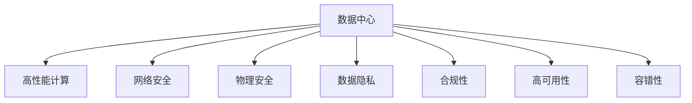

                 

# AI 大模型应用数据中心建设：数据中心安全与可靠性

> 关键词：大模型应用,数据中心建设,安全,可靠性,人工智能,高性能计算,电力系统,网络安全

## 1. 背景介绍

随着人工智能（AI）和大数据技术的飞速发展，大模型（如GPT、BERT等）在自然语言处理（NLP）、计算机视觉、推荐系统等众多领域取得了革命性的突破。然而，这些大模型的训练与部署涉及庞大的数据集和复杂的计算过程，需要构建大规模、高性能的数据中心作为支撑。数据中心的安全与可靠性问题成为大模型应用能否顺利落地的关键。

### 1.1 数据中心的重要性
数据中心是大模型应用的基石，负责存储训练数据、存储模型参数、进行模型计算、部署模型服务。数据中心的安全与可靠性直接影响到模型的训练质量和应用效果。例如，数据中心遭遇网络攻击可能导致模型训练数据泄露，模型参数被篡改，或者模型服务被中断，严重影响企业的商业利益和用户数据安全。

### 1.2 数据中心面临的主要问题
当前，数据中心面临的主要问题包括：
1. **网络安全威胁**：数据中心遭受DDoS攻击、SQL注入、漏洞利用等网络威胁。
2. **物理安全问题**：数据中心的物理设施（如电力、冷却系统、防火墙等）出现故障，导致系统停机。
3. **数据隐私与合规**：数据中心的存储数据可能涉及用户隐私，需要满足各种隐私保护和合规要求。
4. **高可用性与容错性**：数据中心的硬件和软件系统需要具备高可用性和容错能力，避免单点故障导致服务中断。

本文将深入探讨如何构建安全可靠的数据中心，确保大模型应用的正常运行，并针对这些关键问题提出具体的解决方案。

## 2. 核心概念与联系

### 2.1 核心概念概述

为更好地理解如何构建安全可靠的数据中心，本节将介绍几个关键概念：

- **数据中心**：指存放、维护和运行数据处理的物理设施。数据中心包括计算、存储、网络、电力等关键基础设施，是大模型训练和部署的基础。
- **高性能计算**：指使用专门硬件和算法，提升数据处理速度和效率，满足大规模计算需求的技术。
- **网络安全**：指保护数据中心网络和通信免受未经授权的访问、攻击和干扰的技术。
- **物理安全**：指保护数据中心的物理环境、设施和设备，避免自然灾害、物理攻击等威胁的技术。
- **数据隐私**：指保护数据中心存储数据的机密性、完整性和可用性，避免数据泄露和滥用的技术。
- **合规性**：指确保数据中心运营符合相关法律法规和技术标准的规范，如GDPR、HIPAA等。
- **高可用性**：指数据中心硬件和软件系统能够在故障情况下自动切换或恢复，保证服务不中断的能力。
- **容错性**：指数据中心能够在单点故障时，自动切换到备用系统或修复故障，恢复正常运行的能力。

这些核心概念之间的逻辑关系可以通过以下Mermaid流程图来展示：



这个流程图展示了大模型应用数据中心的关键组成，以及每个组成部分与其他组件之间的联系。

## 3. 核心算法原理 & 具体操作步骤

### 3.1 算法原理概述

数据中心的安全与可靠性，主要涉及以下几个方面的算法原理：

- **网络安全算法**：如防火墙、入侵检测系统（IDS）、入侵防御系统（IPS）等，用于检测和防御网络攻击。
- **物理安全算法**：如门禁系统、监控摄像头、环境监测器等，用于保护数据中心的物理环境和设备。
- **数据隐私算法**：如数据加密、差分隐私、联邦学习等，用于保护存储数据的隐私和安全。
- **高可用性与容错算法**：如负载均衡、冗余设计、自动恢复算法等，用于提高数据中心的可用性和容错性。

### 3.2 算法步骤详解

以下我们以网络安全为例，详细介绍基于监督学习的数据中心网络安全算法步骤：

**Step 1: 数据收集与预处理**
- 收集数据中心网络流量数据、日志数据、系统状态数据等，进行数据清洗和特征提取。

**Step 2: 模型训练**
- 选择适合的网络安全模型（如异常检测模型），并使用监督学习算法（如KNN、SVM、随机森林等）进行训练。
- 使用标注好的网络攻击数据进行模型训练，优化模型参数。

**Step 3: 模型评估与部署**
- 在验证集上评估模型的性能，选择最优模型。
- 将模型部署到数据中心的网络流量监控系统中，实时检测网络异常行为。

**Step 4: 模型更新与维护**
- 定期收集新的网络攻击数据，更新模型。
- 监控模型的性能，及时调整模型参数和算法，保持模型的高效性。

### 3.3 算法优缺点

基于监督学习的网络安全算法具有以下优点：
1. 效果显著：通过有标注的数据，训练出的模型可以准确检测和识别网络攻击。
2. 适应性强：模型的参数可以根据实际网络环境进行调整。
3. 易于维护：模型的训练和更新较为简单，维护成本较低。

同时，该算法也存在以下局限性：
1. 依赖标注数据：需要有足够多的标注数据，才能训练出高效的网络安全模型。
2. 过拟合风险：模型可能会对训练数据过拟合，导致泛化能力不足。
3. 算法复杂度高：一些高级的算法（如深度学习）可能需要大量的计算资源和复杂的网络结构。

### 3.4 算法应用领域

网络安全算法在大模型数据中心的应用非常广泛，主要包括以下几个方面：

- **防火墙策略制定**：基于网络流量数据分析，制定和调整防火墙规则，防止恶意访问。
- **入侵检测与防御**：实时监控网络流量，检测和防御各种入侵行为，保障网络安全。
- **漏洞扫描与修复**：定期扫描网络系统中的漏洞，及时修补，避免系统被攻击。
- **零信任架构**：在网络中实行最小权限原则，对每个请求进行严格审查，防止内外部攻击。

除了网络安全，物理安全、数据隐私、合规性、高可用性和容错性算法也在数据中心中得到广泛应用：

- **物理安全算法**：如门禁系统、监控摄像头、环境监测器等，用于保护数据中心的物理环境和设备。
- **数据隐私算法**：如数据加密、差分隐私、联邦学习等，用于保护存储数据的隐私和安全。
- **合规性算法**：如数据分类、访问控制、日志记录等，用于确保数据中心运营符合相关法律法规和技术标准。
- **高可用性算法**：如负载均衡、冗余设计、自动恢复算法等，用于提高数据中心的可用性和容错性。
- **容错性算法**：如故障转移、备份系统、数据冗余等，用于在单点故障时，自动切换到备用系统或修复故障，恢复正常运行。

这些算法在大模型数据中心中的应用，可以确保数据中心的安全与可靠性，保障大模型应用的正常运行。

## 4. 数学模型和公式 & 详细讲解 & 举例说明

### 4.1 数学模型构建

本节将使用数学语言对数据中心安全与可靠性的算法进行更加严格的刻画。

记数据中心网络流量为 $X=\{(x_1, y_1), (x_2, y_2), \ldots, (x_N, y_N)\}$，其中 $x_i$ 表示流量数据，$y_i$ 表示标签（正常或异常）。

定义网络安全模型 $M$，其输入为网络流量数据 $x$，输出为标签 $y$，即 $M: X \rightarrow Y$，其中 $Y=\{normal, anomaly\}$。

定义损失函数 $L$，用于衡量模型预测输出与真实标签之间的差异：

$$
L(M, X) = \frac{1}{N} \sum_{i=1}^N [\ell(y_i, M(x_i))]
$$

其中 $\ell$ 为损失函数，常用的有交叉熵损失、对数损失等。

网络安全模型的优化目标是最小化损失函数，即：

$$
\hat{M} = \mathop{\arg\min}_{M} L(M, X)
$$

在实践中，我们通常使用基于梯度的优化算法（如SGD、Adam等）来近似求解上述最优化问题。设 $\eta$ 为学习率，$\lambda$ 为正则化系数，则参数的更新公式为：

$$
M \leftarrow M - \eta \nabla_{M}L(M, X) - \eta\lambda M
$$

其中 $\nabla_{M}L(M, X)$ 为损失函数对模型 $M$ 的梯度，可通过反向传播算法高效计算。

### 4.2 公式推导过程

以下我们以异常检测为例，推导基于监督学习的网络安全模型的公式推导过程。

假设异常检测模型的输出 $M(x)$ 为 $[0, 1]$ 之间的值，表示样本属于异常的概率。定义二元分类交叉熵损失函数：

$$
\ell(M(x), y) = -[y\log M(x) + (1-y)\log(1-M(x))]
$$

将其代入经验风险公式，得：

$$
L(M) = -\frac{1}{N}\sum_{i=1}^N [y_i\log M(x_i)+(1-y_i)\log(1-M(x_i))]
$$

根据链式法则，损失函数对模型 $M$ 的梯度为：

$$
\frac{\partial L(M)}{\partial M(x)} = -\frac{1}{N}\sum_{i=1}^N (\frac{y_i}{M(x_i)}-\frac{1-y_i}{1-M(x_i)}) \frac{\partial M(x)}{\partial x}
$$

其中 $\frac{\partial M(x)}{\partial x}$ 可进一步递归展开，利用自动微分技术完成计算。

在得到损失函数的梯度后，即可带入参数更新公式，完成模型的迭代优化。重复上述过程直至收敛，最终得到适应网络安全任务的最优模型 $M$。

### 4.3 案例分析与讲解

以下是一个具体的案例分析，说明如何使用监督学习算法进行网络安全异常检测。

假设有一个银行的数据中心，存储了大量用户的交易记录和账户信息。为了检测和防御可能的钓鱼攻击，我们收集了过去一年的交易记录，并对其中的异常行为进行了标注。

使用监督学习算法（如随机森林、XGBoost等）对标注数据进行训练，得到异常检测模型 $M$。训练数据集分为训练集和验证集，用于模型参数的选择和调优。

在训练过程中，通过交叉验证选择最优的模型超参数。例如，对于随机森林模型，可以设置不同的树深度、样本大小等参数，使用网格搜索等方法寻找最优配置。

训练好的模型 $M$ 可以部署到数据中心的网络流量监控系统中，实时检测每笔交易的异常情况。模型会根据输入的交易记录，输出是否属于异常交易的概率。如果交易被标记为异常，系统将自动触发告警，通知安全团队进行处理。

## 5. 项目实践：代码实例和详细解释说明

### 5.1 开发环境搭建

在进行网络安全算法开发前，我们需要准备好开发环境。以下是使用Python进行Scikit-learn开发的环境配置流程：

1. 安装Anaconda：从官网下载并安装Anaconda，用于创建独立的Python环境。

2. 创建并激活虚拟环境：
```bash
conda create -n sklearn-env python=3.8 
conda activate sklearn-env
```

3. 安装Scikit-learn：
```bash
pip install scikit-learn
```

4. 安装必要的依赖库：
```bash
pip install pandas numpy matplotlib seaborn
```

完成上述步骤后，即可在`sklearn-env`环境中开始网络安全算法的开发。

### 5.2 源代码详细实现

下面我们以异常检测为例，给出使用Scikit-learn进行网络安全算法开发的PyTorch代码实现。

首先，定义异常检测模型的训练数据和测试数据：

```python
import pandas as pd
from sklearn.model_selection import train_test_split

# 加载训练数据
train_data = pd.read_csv('train.csv')
test_data = pd.read_csv('test.csv')

# 特征选择
features = ['features_1', 'features_2', 'features_3', 'features_4']
X_train, X_test, y_train, y_test = train_test_split(train_data[features], train_data['label'], test_size=0.2, random_state=42)

# 数据标准化
from sklearn.preprocessing import StandardScaler
scaler = StandardScaler()
X_train = scaler.fit_transform(X_train)
X_test = scaler.transform(X_test)
```

然后，定义异常检测模型的训练函数：

```python
from sklearn.ensemble import RandomForestClassifier
from sklearn.metrics import classification_report

# 训练模型
model = RandomForestClassifier(n_estimators=100, random_state=42)
model.fit(X_train, y_train)

# 评估模型
y_pred = model.predict(X_test)
print(classification_report(y_test, y_pred))
```

最后，将训练好的模型应用到实时数据中心的网络流量中进行检测：

```python
# 实时数据流量的异常检测
import numpy as np

# 加载实时数据
real_data = pd.read_csv('real_data.csv')
real_features = real_data[features]
real_labels = real_data['label']

# 数据标准化
real_features = scaler.transform(real_features)

# 实时检测
y_pred_real = model.predict(real_features)
print(classification_report(real_labels, y_pred_real))
```

以上就是使用Scikit-learn进行网络安全算法开发的完整代码实现。可以看到，Scikit-learn提供了丰富的机器学习算法，可以方便快捷地实现异常检测等任务。

### 5.3 代码解读与分析

让我们再详细解读一下关键代码的实现细节：

**特征选择**：
- 选择与异常检测相关的特征，如交易金额、交易时间等。特征选择对于异常检测模型的性能至关重要。

**数据标准化**：
- 对特征数据进行标准化，避免不同特征之间尺度的影响。

**模型训练**：
- 使用随机森林算法进行模型训练，设置适当的参数，如树深度、样本大小等。

**模型评估**：
- 在测试集上评估模型的性能，使用分类报告输出模型准确率、召回率等指标。

**实时检测**：
- 对实时数据进行检测，输出异常概率，根据阈值判断是否异常。

以上步骤是网络安全算法的核心实现流程，开发者可以根据具体需求，对特征选择、模型训练、评估指标等进行优化。

## 6. 实际应用场景

### 6.1 金融行业

金融行业是大模型应用的典型场景之一。银行、证券公司等金融机构需要处理大量的交易数据，防范欺诈、洗钱等风险。基于大模型微调的网络安全算法，可以实时监测交易行为，识别异常交易，避免金融风险。

例如，某银行可以收集过去一年的交易记录，并对其进行标注。使用监督学习算法（如随机森林、XGBoost等）训练异常检测模型。在实时交易过程中，系统根据输入的交易记录，输出是否属于异常交易的概率。如果交易被标记为异常，系统将自动触发告警，通知安全团队进行处理，避免损失。

### 6.2 政府部门

政府部门的数据中心存储了大量敏感数据，如政府文件、财务数据等。网络安全是政府数据中心的重要任务之一。基于大模型微调的网络安全算法，可以实时监测网络流量，检测和防御各种入侵行为，保障数据中心的安全。

例如，某政府部门可以收集过去一年的网络流量数据，并对其进行标注。使用监督学习算法（如KNN、SVM、随机森林等）训练网络安全模型。在实时网络流量监控过程中，系统根据输入的网络流量数据，输出是否属于异常流量。如果流量被标记为异常，系统将自动触发告警，通知安全团队进行处理，保障网络安全。

### 6.3 企业级应用

企业级应用中，数据中心存储了大量的业务数据和客户数据。网络安全和大数据结合，可以实时监控和分析企业数据中心的网络流量，防范数据泄露和网络攻击。

例如，某企业可以收集过去一年的网络流量数据，并对其进行标注。使用监督学习算法（如随机森林、XGBoost等）训练网络安全模型。在实时网络流量监控过程中，系统根据输入的网络流量数据，输出是否属于异常流量。如果流量被标记为异常，系统将自动触发告警，通知安全团队进行处理，保障企业数据的安全。

## 7. 工具和资源推荐

### 7.1 学习资源推荐

为了帮助开发者系统掌握数据中心安全与可靠性的理论基础和实践技巧，这里推荐一些优质的学习资源：

1. **《网络安全技术与实践》**：该书详细介绍了网络安全的基本概念、常见攻击和防御技术，是网络安全学习的入门级读物。
2. **《数据中心设计与运营》**：该书介绍了数据中心的关键基础设施、设计规范、运维管理等内容，是数据中心工程师的必备参考书。
3. **《人工智能安全与隐私》**：该书深入探讨了AI和大数据的安全与隐私问题，介绍了各种加密、差分隐私等技术。
4. **Google Cloud基础设施文档**：Google Cloud提供了大量的数据中心设计和运维文档，可供开发者参考。
5. **AWS数据中心文档**：AWS提供了详细的数据中心设计、运维和管理文档，可供开发者参考。

通过对这些资源的学习实践，相信你一定能够快速掌握数据中心安全与可靠性的精髓，并用于解决实际的网络安全问题。

### 7.2 开发工具推荐

高效的开发离不开优秀的工具支持。以下是几款用于数据中心安全与可靠性开发的常用工具：

1. **Anaconda**：提供了Python和科学计算包的管理工具，方便开发者创建和管理虚拟环境。
2. **PyTorch**：基于Python的开源深度学习框架，提供了丰富的机器学习算法，可用于训练网络安全模型。
3. **Scikit-learn**：基于Python的科学计算库，提供了丰富的机器学习算法，可用于训练网络安全模型。
4. **TensorBoard**：用于可视化模型训练过程，提供详细的性能指标和图表展示。
5. **AWS CloudFormation**：用于自动化部署和管理数据中心基础设施，提供灵活的资源管理能力。
6. **Google Cloud Platform**：提供了丰富的云服务，可用于数据中心的部署和管理，支持高性能计算和网络安全。

合理利用这些工具，可以显著提升数据中心安全与可靠性的开发效率，加快创新迭代的步伐。

### 7.3 相关论文推荐

数据中心安全与可靠性研究源于学界的持续研究。以下是几篇奠基性的相关论文，推荐阅读：

1. **《数据中心网络安全》**：介绍了数据中心网络安全的基本概念和常见攻击，如DDoS攻击、SQL注入等。
2. **《高可用性数据中心设计》**：介绍了数据中心高可用性和容错性的设计原则和实现方法。
3. **《差分隐私技术》**：介绍了差分隐私的基本概念和应用方法，可用于保护数据隐私。
4. **《云计算安全架构》**：介绍了云计算环境下的安全架构和关键技术，如身份认证、数据加密等。
5. **《联邦学习与数据隐私》**：介绍了联邦学习的基本概念和应用方法，可用于保护数据隐私。

这些论文代表了大模型数据中心安全与可靠性的发展脉络。通过学习这些前沿成果，可以帮助研究者把握学科前进方向，激发更多的创新灵感。

## 8. 总结：未来发展趋势与挑战

### 8.1 总结

本文对数据中心的安全与可靠性进行了全面系统的介绍。首先阐述了数据中心在大模型应用中的重要性，明确了网络安全、物理安全、数据隐私、合规性、高可用性和容错性在大模型数据中心中的关键作用。其次，从原理到实践，详细讲解了网络安全算法的数学模型和实现步骤，给出了网络安全算法开发的完整代码实例。同时，本文还广泛探讨了网络安全算法在金融行业、政府部门和企业级应用中的实际应用场景，展示了网络安全算法的巨大潜力。

通过本文的系统梳理，可以看到，网络安全算法在大模型数据中心中的应用，可以确保数据中心的安全与可靠性，保障大模型应用的正常运行。

### 8.2 未来发展趋势

展望未来，数据中心安全与可靠性技术将呈现以下几个发展趋势：

1. **人工智能与网络安全结合**：使用深度学习等技术，提升网络安全检测和防御能力，实现更智能化的网络安全管理。
2. **多层次安全防护体系**：结合网络安全、物理安全、数据隐私等多层次安全防护措施，构建全面的安全防护体系。
3. **自动化的安全运维**：使用自动化工具和算法，实现数据中心的安全运维和管理，提高安全运营效率。
4. **边缘计算与云安全结合**：结合边缘计算和云安全技术，实现更灵活、高效的安全防护方案。
5. **零信任架构**：采用零信任架构，对每个请求进行严格审查，提高安全防护水平。
6. **数据隐私保护**：使用差分隐私、联邦学习等技术，保护数据隐私，避免数据泄露。

以上趋势凸显了大模型数据中心安全与可靠性的广阔前景。这些方向的探索发展，必将进一步提升数据中心的安全性，保障大模型应用的正常运行。

### 8.3 面临的挑战

尽管数据中心安全与可靠性技术已经取得了瞩目成就，但在迈向更加智能化、普适化应用的过程中，它仍面临着诸多挑战：

1. **资源消耗大**：大模型数据中心需要处理大量数据，消耗大量计算资源和存储资源。如何优化资源利用，降低成本，是一个重要问题。
2. **复杂度高**：数据中心安全与可靠性技术涉及多个领域，如网络安全、物理安全、数据隐私等，复杂度高，难以整合。
3. **安全性不足**：数据中心可能遭受各种网络攻击、物理攻击等，安全性难以完全保障。
4. **兼容性问题**：不同厂商的设备、系统之间的兼容性问题，可能影响数据中心的整体性能和安全。
5. **法规合规问题**：不同国家和地区的法规标准不同，如何满足全球合规要求，也是一个重要问题。

这些挑战需要未来的研究者在数据中心设计、运维、管理等多个环节进行深入探讨，寻找解决方案。

### 8.4 研究展望

面对数据中心安全与可靠性的挑战，未来的研究需要在以下几个方面寻求新的突破：

1. **多模态安全检测**：结合网络安全、物理安全、数据隐私等多模态数据，提升安全检测的准确性和全面性。
2. **自适应安全策略**：使用机器学习等技术，根据实际数据中心环境动态调整安全策略，提高安全防护能力。
3. **跨平台安全管理**：设计跨平台、跨厂商的安全管理平台，提高数据中心的安全性。
4. **自动化安全运维**：使用自动化工具和算法，实现数据中心的安全运维和管理，提高安全运营效率。
5. **零信任架构的优化**：对零信任架构进行优化，提升安全防护水平，降低安全运维成本。
6. **合规性管理**：使用自动化工具和算法，实现数据中心的合规性管理，满足全球合规要求。

这些研究方向将进一步推动数据中心安全与可靠性的发展，为数据中心的安全与可靠性提供新的技术支持，助力大模型应用的落地和推广。总之，数据中心安全与可靠性技术还需要与其他人工智能技术进行更深入的融合，共同推动自然语言理解和智能交互系统的进步。只有勇于创新、敢于突破，才能不断拓展数据中心的安全边界，让数据中心的安全与可靠性技术在构建人机协同的智能时代中扮演越来越重要的角色。

## 9. 附录：常见问题与解答

**Q1：什么是数据中心？**

A: 数据中心指存放、维护和运行数据处理的物理设施，包括计算、存储、网络、电力等关键基础设施。数据中心是大模型训练和部署的基础。

**Q2：什么是高性能计算？**

A: 高性能计算指使用专门硬件和算法，提升数据处理速度和效率，满足大规模计算需求的技术。高性能计算是数据中心的核心技术之一。

**Q3：什么是网络安全？**

A: 网络安全指保护数据中心网络和通信免受未经授权的访问、攻击和干扰的技术。网络安全是大模型应用的重要保障。

**Q4：什么是物理安全？**

A: 物理安全指保护数据中心的物理环境和设备，避免自然灾害、物理攻击等威胁的技术。物理安全是数据中心的重要组成部分。

**Q5：什么是数据隐私？**

A: 数据隐私指保护数据中心存储数据的机密性、完整性和可用性，避免数据泄露和滥用的技术。数据隐私是大模型应用的重要保障。

**Q6：什么是合规性？**

A: 合规性指确保数据中心运营符合相关法律法规和技术标准的规范，如GDPR、HIPAA等。合规性是大模型应用的重要保障。

**Q7：什么是高可用性？**

A: 高可用性指数据中心硬件和软件系统能够在故障情况下自动切换或恢复，保证服务不中断的能力。高可用性是大模型应用的重要保障。

**Q8：什么是容错性？**

A: 容错性指数据中心能够在单点故障时，自动切换到备用系统或修复故障，恢复正常运行的能力。容错性是大模型应用的重要保障。

**Q9：网络安全算法有哪些？**

A: 常见的网络安全算法包括：
1. 防火墙策略制定：基于网络流量数据分析，制定和调整防火墙规则，防止恶意访问。
2. 入侵检测与防御：实时监控网络流量，检测和防御各种入侵行为，保障网络安全。
3. 漏洞扫描与修复：定期扫描网络系统中的漏洞，及时修补，避免系统被攻击。
4. 零信任架构：在网络中实行最小权限原则，对每个请求进行严格审查，防止内外部攻击。

**Q10：网络安全算法的实现流程有哪些？**

A: 网络安全算法的实现流程包括：
1. 数据收集与预处理：收集数据中心网络流量数据、日志数据、系统状态数据等，进行数据清洗和特征提取。
2. 模型训练：选择适合的网络安全模型（如异常检测模型），并使用监督学习算法（如KNN、SVM、随机森林等）进行训练。
3. 模型评估与部署：在验证集上评估模型的性能，选择最优模型。将模型部署到数据中心的网络流量监控系统中，实时检测网络异常行为。
4. 模型更新与维护：定期收集新的网络攻击数据，更新模型。监控模型的性能，及时调整模型参数和算法，保持模型的高效性。

**Q11：网络安全算法的优缺点有哪些？**

A: 网络安全算法的优缺点包括：
1. 优点：
   - 效果显著：通过有标注的数据，训练出的模型可以准确检测和识别网络攻击。
   - 适应性强：模型的参数可以根据实际网络环境进行调整。
   - 易于维护：模型的训练和更新较为简单，维护成本较低。
2. 缺点：
   - 依赖标注数据：需要有足够多的标注数据，才能训练出高效的网络安全模型。
   - 过拟合风险：模型可能会对训练数据过拟合，导致泛化能力不足。
   - 算法复杂度高：一些高级的算法（如深度学习）可能需要大量的计算资源和复杂的网络结构。

**Q12：数据中心安全与可靠性的实现流程有哪些？**

A: 数据中心安全与可靠性的实现流程包括：
1. 网络安全：部署网络安全设备和系统，如防火墙、入侵检测系统、入侵防御系统等，检测和防御网络攻击。
2. 物理安全：部署物理安全设施，如门禁系统、监控摄像头、环境监测器等，保护数据中心的物理环境和设备。
3. 数据隐私：使用数据加密、差分隐私、联邦学习等技术，保护存储数据的隐私和安全。
4. 合规性：使用数据分类、访问控制、日志记录等技术，确保数据中心运营符合相关法律法规和技术标准。
5. 高可用性：设计冗余系统、备份系统等，提高数据中心的可用性和容错性。
6. 容错性：使用故障转移、自动恢复算法等技术，在单点故障时，自动切换到备用系统或修复故障，恢复正常运行。

**Q13：网络安全算法在实际应用中的常见场景有哪些？**

A: 网络安全算法在实际应用中的常见场景包括：
1. 金融行业：实时监测交易行为，识别异常交易，避免金融风险。
2. 政府部门：实时监测网络流量，检测和防御各种入侵行为，保障数据中心的安全。
3. 企业级应用：实时监控和分析企业数据中心的网络流量，防范数据泄露和网络攻击。

**Q14：网络安全算法有哪些技术支持？**

A: 网络安全算法主要依赖以下技术支持：
1. 机器学习：使用监督学习、无监督学习、半监督学习等技术，训练网络安全模型。
2. 深度学习：使用深度神经网络等技术，提升网络安全检测和防御能力。
3. 自然语言处理：使用NLP技术，分析日志数据和文本数据，提取有价值的信息。
4. 大数据：使用大数据技术，存储和分析海量数据，发现异常行为。

**Q15：网络安全算法的未来发展方向有哪些？**

A: 网络安全算法的未来发展方向包括：
1. 人工智能与网络安全结合：使用深度学习等技术，提升网络安全检测和防御能力。
2. 多层次安全防护体系：结合网络安全、物理安全、数据隐私等多层次安全防护措施，构建全面的安全防护体系。
3. 自动化的安全运维：使用自动化工具和算法，实现数据中心的安全运维和管理，提高安全运营效率。
4. 边缘计算与云安全结合：结合边缘计算和云安全技术，实现更灵活、高效的安全防护方案。
5. 零信任架构：采用零信任架构，对每个请求进行严格审查，提高安全防护水平，降低安全运维成本。
6. 合规性管理：使用自动化工具和算法，实现数据中心的合规性管理，满足全球合规要求。

以上这些问题的答案，可以帮助你更好地理解数据中心安全与可靠性的核心概念和实现方法，为实际应用中的问题提供参考。

---

作者：禅与计算机程序设计艺术 / Zen and the Art of Computer Programming

