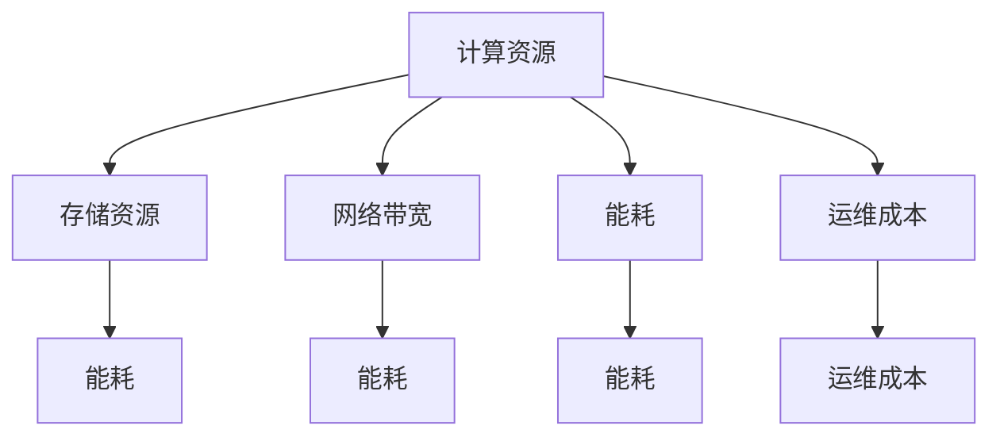

                 

# AI 大模型应用数据中心建设：数据中心成本优化

在大模型应用的过程中，数据中心的建设与运营是核心环节之一。数据中心不仅是存储和计算的物理空间，更承载了模型训练、推理、运维等重要功能。如何构建高效、安全、经济的数据中心，直接影响到AI大模型应用的全生命周期成本和最终性能。本文将从数据中心的成本优化出发，深入探讨其核心原理和操作步骤，为AI大模型应用的全面落地提供参考。

## 1. 背景介绍

### 1.1 问题由来

随着AI技术在各个行业的应用逐渐深入，大模型逐渐成为各类应用的核心支撑。然而，AI大模型的训练和推理对数据中心提出了极高的要求，例如需要大量的存储和计算资源。如何在有限的成本内，高效构建并运营数据中心，成为大模型应用的关键问题之一。

### 1.2 问题核心关键点

数据中心成本优化涉及的要素众多，主要包括计算资源、存储资源、网络带宽、能耗、运维成本等。优化这些要素，不仅能够降低初期投资和运营成本，还能提升数据中心的利用效率，保障模型的性能。

在具体实践中，常见的成本优化方法包括：
1. 合理配置硬件资源，减少资源浪费。
2. 采用高效的网络方案，降低网络带宽成本。
3. 优化电源配置和制冷方案，降低能耗支出。
4. 应用分布式存储和计算，提高资源利用率。
5. 建立高效的运维机制，降低运维成本。

这些方法不仅能够帮助企业节省大量资金，还能够在一定程度上提高数据中心的可靠性、稳定性和可扩展性。

## 2. 核心概念与联系

### 2.1 核心概念概述

在详细展开之前，我们首先需要梳理数据中心建设中的核心概念：

- **计算资源**：包括CPU、GPU、FPGA、ASIC等硬件资源，用于模型训练和推理。
- **存储资源**：包括HDD、SSD、NVMe等存储设备，用于数据存储和模型参数的存放。
- **网络带宽**：包括交换机、路由器等网络设备，用于模型间通信和数据传输。
- **能耗**：包括电源、散热设备、空调等，用于维持数据中心的正常运行。
- **运维成本**：包括人员成本、硬件维护成本、故障恢复成本等。

这些概念相互交织，共同构成了数据中心的基础架构，并直接影响其成本和性能。

### 2.2 核心概念原理和架构的 Mermaid 流程图



此图展示了计算资源与其他核心概念的联系，说明计算资源的配置与使用直接影响到存储资源、网络带宽、能耗和运维成本。

## 3. 核心算法原理 & 具体操作步骤

### 3.1 算法原理概述

数据中心的成本优化是一个多目标优化问题，涉及到资源配置、能耗控制、网络优化和运维管理等多个维度。算法原理主要包括以下几个方面：

1. **资源配置优化**：通过模型预测和模拟，评估不同硬件配置组合对计算、存储、网络等资源的影响，并从中找出最优解。

2. **能耗优化**：通过优化电源配置、制冷方案和网络带宽等，减少能耗支出。

3. **网络优化**：通过网络拓扑设计和流量控制，提升数据传输效率，降低带宽成本。

4. **运维管理**：通过建立高效的运维机制，减少故障和停机时间，降低运维成本。

### 3.2 算法步骤详解

#### 3.2.1 资源配置优化

1. **需求分析**：收集模型训练和推理所需资源需求，例如CPU/GPU数量、存储容量和网络带宽等。

2. **资源评估**：评估现有资源配置，包括物理硬件和软件平台，确定可用资源。

3. **方案设计**：设计多种硬件配置方案，并使用模拟工具预测每种方案的资源使用情况和成本。

4. **方案对比**：对多种方案进行对比，选择最优方案。

#### 3.2.2 能耗优化

1. **能耗分析**：分析数据中心能耗结构，包括电力、制冷和辅助设备等。

2. **优化策略**：采用节能服务器、混合制冷方案和高效能耗管理策略等。

3. **实施计划**：制定能耗优化实施计划，并进行部署和测试。

#### 3.2.3 网络优化

1. **网络设计**：设计高效的网络拓扑结构，确保数据传输效率。

2. **流量控制**：采用流量控制策略，降低网络带宽成本。

3. **优化测试**：对网络优化方案进行测试和调整。

#### 3.2.4 运维管理

1. **运维策略**：制定运维策略，包括监控、故障处理和备份等。

2. **人员培训**：对运维人员进行专业培训，提高其技术水平。

3. **系统优化**：使用自动化运维工具，提升运维效率。

### 3.3 算法优缺点

#### 3.3.1 优点

1. **成本控制**：通过优化硬件配置和能耗方案，有效降低初期投资和运营成本。

2. **效率提升**：优化网络拓扑和运维机制，提升数据中心的利用效率，减少故障和停机时间。

3. **灵活扩展**：建立灵活的资源配置和能耗管理方案，便于数据中心的扩展和升级。

#### 3.3.2 缺点

1. **复杂度高**：数据中心成本优化涉及多个维度和要素，优化过程复杂度较高。

2. **实施难度大**：优化策略的实施需要大量的技术和管理投入。

3. **效果评估难**：优化效果受多种因素影响，效果评估较困难。

## 4. 数学模型和公式 & 详细讲解 & 举例说明

### 4.1 数学模型构建

在数据中心成本优化中，可以构建一个多目标优化模型，定义多个优化目标和约束条件。假设优化目标为成本最小化和性能最大化，可用以下模型表示：

$$
\min_{x,y,z,w} C(x,y,z,w)
$$

其中，$x$表示计算资源配置，$y$表示存储资源配置，$z$表示网络带宽配置，$w$表示能耗管理策略，$C$为成本函数。

约束条件包括资源限制和性能要求，例如：

$$
A(x,y,z) \leq B
$$

$$
\delta(x,y,z) \geq \gamma
$$

其中，$A$为资源限制条件，$B$为资源上限，$\delta$为性能指标，$\gamma$为性能要求。

### 4.2 公式推导过程

以资源配置优化为例，可以构建一个简单的线性规划模型：

$$
\min_{x,y,z} \sum_{i=1}^n p_i x_i + \sum_{j=1}^m q_j y_j + \sum_{k=1}^z r_k z_k
$$

约束条件为：

$$
a_{ij} x_i + b_{jk} y_j \geq c_{ik} z_k
$$

$$
x_i \geq 0, y_j \geq 0, z_k \geq 0
$$

其中，$p_i$、$q_j$、$r_k$分别为计算、存储和网络资源的单位成本，$a_{ij}$、$b_{jk}$、$c_{ik}$为资源需求矩阵和限制矩阵。

通过求解上述线性规划问题，即可得到最优的资源配置方案。

### 4.3 案例分析与讲解

#### 4.3.1 案例背景

某公司计划构建一个数据中心，用于训练和推理大型深度学习模型。初步需求包括20个GPU、100个CPU核心、1TB内存和10Gbps网络带宽。公司要求数据中心在保证性能的前提下，尽量降低成本。

#### 4.3.2 优化过程

1. **需求分析**：通过分析模型需求，确定计算、存储和网络资源需求。

2. **资源评估**：评估现有资源和市场资源，确定可用资源。

3. **方案设计**：设计多种硬件配置方案，例如单GPU服务器、双GPU服务器等。

4. **方案对比**：使用模拟工具计算每种方案的成本和性能，选择最优方案。

5. **实施计划**：根据选择方案进行硬件采购和部署。

## 5. 项目实践：代码实例和详细解释说明

### 5.1 开发环境搭建

在项目实践中，我们需要搭建相应的开发环境，主要包括以下步骤：

1. **环境安装**：安装Python、NumPy、Pandas等库，并配置好依赖环境。

2. **数据收集**：收集模型资源需求、市场资源价格、性能指标等数据。

3. **模拟工具选择**：选择合适的模拟工具，例如Google OR-Tools、CPLEX等。

4. **模型构建**：使用Python编写优化模型，并集成模拟工具。

### 5.2 源代码详细实现

以下是一个使用Python和CPLEX构建的多目标优化模型示例：

```python
from cplex import CPLEX
import numpy as np

# 定义成本函数和资源限制条件
def cost_function(x):
    return np.dot(cost_matrix, x)

def resource_constraint(x):
    return np.dot(resource_matrix, x) - upper_limit

# 定义模型
model = CPLEX()
model.set_problem_type(CYPELPProblemType.MP)

# 定义变量
x = model.variables('x', len(cost_matrix))
model.set_objective(cost_function(x), direction=CXPptDirection.MINIMIZE)

# 定义约束条件
model.add_constraint(resource_constraint(x), less_equal)

# 求解模型
model.solve()

# 输出结果
print(model.solve_status())
print(model.solution.status)
print(model.solution.value(model.objective))
print([var.value for var in model.variables()])
```

### 5.3 代码解读与分析

在代码中，我们首先定义了成本函数和资源限制条件，分别表示计算、存储和网络资源的单位成本和需求。然后，使用CPLEX构建了多目标优化模型，并求解最优方案。

## 6. 实际应用场景

### 6.1 智慧医疗

在智慧医疗领域，AI大模型的应用场景包括医疗影像诊断、疾病预测、个性化治疗等。数据中心作为其核心支撑，必须具备高效、安全、经济的特点，才能确保模型性能。

### 6.2 智能制造

智能制造需要大量的数据存储和计算资源，以支持实时数据分析和预测。构建高效的数据中心，可以降低运营成本，提升决策效率。

### 6.3 智慧城市

智慧城市涉及交通、安防、能源等多个领域，需要大量计算资源和网络带宽。优化数据中心成本，能够为智慧城市提供更加高效、稳定的服务。

### 6.4 金融科技

金融科技领域需要实时处理海量交易数据，并快速响应市场变化。优化数据中心成本，能够降低运营成本，提升响应速度。

## 7. 工具和资源推荐

### 7.1 学习资源推荐

- **Google OR-Tools**：Google开发的优化工具包，提供多种优化算法和模拟工具。
- **CPLEX**：IBM开发的线性规划求解器，支持多种优化模型和数据类型。
- **Python编程**：Python语言简单易学，功能强大，适合数据中心成本优化的开发和实施。

### 7.2 开发工具推荐

- **Anaconda**：开源的Python发行版，提供虚拟环境管理，便于模块安装和依赖管理。
- **Jupyter Notebook**：免费的交互式编程环境，支持代码调试和展示。
- **TensorBoard**：TensorFlow配套的可视化工具，便于监控和调试模型训练和推理。

### 7.3 相关论文推荐

- **Multi-objective Optimization of Cloud Data Center Energy Consumption**：介绍如何通过多目标优化方法，降低云数据中心的能耗和运营成本。
- **Data Center Energy and Cost Management**：探讨数据中心能源管理和成本控制的方法和策略。
- **Optimization of Data Center Resource Allocation**：介绍如何通过优化算法，配置数据中心的计算、存储和网络资源。

## 8. 总结：未来发展趋势与挑战

### 8.1 研究成果总结

本文从数据中心成本优化出发，深入探讨了计算资源、存储资源、网络带宽、能耗和运维成本等多方面的优化方法。通过构建多目标优化模型，并使用模拟工具求解，能够找到最优的资源配置方案，降低数据中心的运营成本。

### 8.2 未来发展趋势

未来，数据中心成本优化将继续向以下几个方向发展：

1. **边缘计算**：在分布式数据中心架构中，边缘计算能够降低网络带宽成本和延迟，提升数据中心的服务质量和效率。

2. **绿色数据中心**：通过采用节能技术和绿色能源，降低数据中心的能耗和环境影响。

3. **自动化运维**：使用自动化运维工具，降低人工成本和故障率，提升数据中心的管理效率。

4. **云计算和弹性计算**：利用云计算平台和弹性计算资源，提高数据中心的可扩展性和灵活性。

5. **微服务架构**：通过微服务架构，降低数据中心的复杂度和运维成本，提升系统的可扩展性和可靠性。

### 8.3 面临的挑战

尽管数据中心成本优化已经取得了显著进展，但仍面临以下挑战：

1. **资源限制**：数据中心的物理空间和能耗限制，可能制约其扩展和升级。

2. **数据安全**：数据中心的存储和传输需要严格的数据安全和隐私保护措施。

3. **技术复杂度**：优化方案的实施需要高水平的技术和管理能力。

4. **成本与性能平衡**：如何在成本和性能之间找到最优平衡，是数据中心成本优化的一个难题。

5. **技术演进**：数据中心技术快速演进，需要不断更新和优化优化方案。

### 8.4 研究展望

未来，数据中心成本优化研究需要在以下几个方面继续探索：

1. **算法优化**：开发更加高效、稳定的优化算法，提高数据中心资源利用率和能耗效率。

2. **技术融合**：将大数据、人工智能等前沿技术引入数据中心成本优化，提升其智能化水平。

3. **标准制定**：制定数据中心成本优化标准和规范，推动行业健康发展。

4. **实践应用**：加强与实际应用场景的结合，解决实际问题，提升优化方案的实用性和可靠性。

5. **跨领域合作**：加强与不同领域的合作，推动跨领域数据中心成本优化技术的发展。

总之，数据中心成本优化是大模型应用中的重要环节，需要通过不断的技术创新和实践应用，推动其向更高效、更经济、更安全的方向发展。只有这样，才能真正实现AI大模型的全面落地和应用。

## 9. 附录：常见问题与解答

**Q1: 如何评估优化效果？**

A: 可以通过以下方法评估优化效果：
1. 对比优化前后的数据中心能耗和运营成本。
2. 评估优化后的资源利用率和性能指标，如CPU利用率、存储使用率等。
3. 使用模拟工具进行场景测试，验证优化方案的可靠性和鲁棒性。

**Q2: 数据中心能耗优化有哪些策略？**

A: 数据中心能耗优化策略包括：
1. 采用节能服务器和高效电源设备，减少能耗支出。
2. 使用混合制冷方案，如液冷和风冷结合，降低制冷成本。
3. 优化网络带宽，减少不必要的流量，降低带宽成本。
4. 实施能耗管理策略，如动态调节能耗、优化算法等。

**Q3: 数据中心成本优化的难点是什么？**

A: 数据中心成本优化的难点包括：
1. 数据中心资源复杂度高，优化过程复杂。
2. 实施成本高，需要大量的技术和管理投入。
3. 效果评估难，受多种因素影响。
4. 数据安全和隐私保护问题。

**Q4: 如何应对数据中心技术演进？**

A: 应对数据中心技术演进的方法包括：
1. 持续关注技术发展动态，及时更新优化方案。
2. 加强技术储备和人才培养，提升技术团队的水平。
3. 采用模块化设计，提高系统的可扩展性和升级性。
4. 与技术供应商和研发机构合作，共同推动技术进步。

**Q5: 数据中心如何保障数据安全？**

A: 数据中心保障数据安全的方法包括：
1. 采用加密存储和传输技术，确保数据安全。
2. 实施访问控制和身份认证，限制数据访问权限。
3. 建立数据备份和恢复机制，保障数据完整性。
4. 加强安全监控和审计，及时发现和处理安全事件。

---

作者：禅与计算机程序设计艺术 / Zen and the Art of Computer Programming

