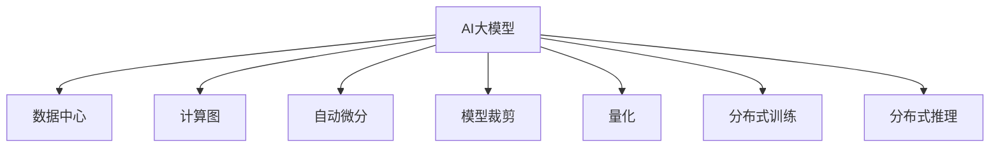

                 

## 1. 背景介绍

随着人工智能(AI)大模型的应用日益广泛，数据中心在AI应用中扮演着越来越重要的角色。数据中心不仅负责存储和处理AI模型所需的大量数据，还需支持模型的推理计算，确保AI系统的稳定和高效运行。因此，AI大模型应用的数据中心建设成为决定AI应用成功的关键因素之一。本文将从背景介绍、核心概念、技术原理、项目实践、应用场景、工具和资源推荐、总结与展望等方面，全面阐述AI大模型应用数据中心的技术创新。

## 2. 核心概念与联系

### 2.1 核心概念概述

在深入探讨AI大模型应用数据中心技术创新之前，我们需要理解几个核心概念：

- **AI大模型**：指基于深度学习的大规模神经网络模型，如GPT-3、BERT等。这些模型在图像、语音、自然语言处理等领域展现出强大的表现力和泛化能力。

- **数据中心**：指专门用于存储、处理和计算数据的设施。数据中心通常由服务器、存储设备、网络设备、电源、冷却系统等组成，具备高可用性和高性能。

- **计算图和自动微分**：计算图是一种用于描述计算过程的数据结构，自动微分技术可自动计算计算图的梯度，用于模型的优化和训练。

- **模型裁剪和量化**：模型裁剪是指去除模型中不必要的参数和层，降低计算复杂度，提高推理速度。量化则是指将模型从浮点数表示转换为定点数表示，进一步压缩模型大小，提高计算效率。

- **分布式训练和推理**：指将模型的训练和推理任务分布到多台计算设备上，通过并行计算和数据并行技术，提高计算性能和模型收敛速度。

### 2.2 核心概念联系的 Mermaid 流程图



这个流程图展示了AI大模型与数据中心以及相关技术之间的联系。AI大模型的运行依赖于数据中心，同时通过计算图、自动微分、模型裁剪、量化等技术进行优化，并通过分布式训练和推理提升计算性能。

## 3. 核心算法原理 & 具体操作步骤

### 3.1 算法原理概述

AI大模型应用的数据中心建设，涉及多个关键技术，包括分布式训练、模型裁剪、量化、自动微分等。本文将详细介绍这些技术的工作原理。

- **分布式训练**：指将大规模模型训练任务分布到多台计算设备上，通过并行计算和数据并行技术，提高训练速度。
- **模型裁剪**：去除模型中不必要的参数和层，降低计算复杂度，提高推理速度。
- **量化**：将模型从浮点数表示转换为定点数表示，进一步压缩模型大小，提高计算效率。
- **自动微分**：自动计算计算图的梯度，用于模型的优化和训练。

### 3.2 算法步骤详解

#### 3.2.1 分布式训练

分布式训练通过将大规模模型的训练任务分布在多台计算设备上，通过并行计算和数据并行技术，提高训练速度。以下是分布式训练的基本步骤：

1. **数据划分**：将训练数据划分为多个小批次，每个小批次适合单个计算设备处理。
2. **模型复制**：在每个计算设备上复制模型的不同部分，每个设备处理不同的子任务。
3. **参数更新**：每个设备更新自己的参数，同时通过通信协议（如AllReduce）将梯度信息汇总到中央服务器。
4. **模型聚合**：中央服务器将汇总后的梯度信息平均分配给各个设备，更新模型参数。
5. **重复迭代**：重复执行数据划分、模型复制、参数更新、模型聚合等步骤，直至模型收敛。

#### 3.2.2 模型裁剪

模型裁剪是通过去除模型中不必要的参数和层，降低计算复杂度，提高推理速度。以下是模型裁剪的基本步骤：

1. **重要度评估**：通过分析模型中的参数和层对输出的贡献度，评估哪些部分是重要的，哪些部分可以裁剪。
2. **裁剪操作**：将不重要或冗余的参数和层从模型中移除，保留核心部分。
3. **微调**：对裁剪后的模型进行微调，确保其在裁剪后的参数和层配置下仍然具有较好的性能。

#### 3.2.3 量化

量化是将模型从浮点数表示转换为定点数表示，进一步压缩模型大小，提高计算效率。以下是量化的基本步骤：

1. **参数量化**：将模型的权重参数和激活参数从浮点数转换为定点数，通常使用8位整数或16位整数。
2. **动态范围调整**：根据数据范围调整参数的量化范围，确保计算精度。
3. **计算图重构**：修改计算图，适应量化后的参数表示。

#### 3.2.4 自动微分

自动微分是自动计算计算图的梯度，用于模型的优化和训练。以下是自动微分的基本步骤：

1. **计算图构建**：将模型表示为计算图，每个节点表示一次计算操作。
2. **梯度计算**：从输出节点开始，反向传播计算每个节点的梯度。
3. **参数更新**：根据梯度信息，更新模型参数，通常使用梯度下降等优化算法。

### 3.3 算法优缺点

分布式训练、模型裁剪、量化、自动微分等技术具有以下优缺点：

#### 优点

- **加速训练和推理**：通过分布式训练和量化技术，可以显著提高训练和推理的速度。
- **降低计算成本**：模型裁剪和量化技术可以降低计算资源的需求和计算成本。
- **提高模型性能**：自动微分技术可以自动计算梯度，优化模型训练过程。

#### 缺点

- **复杂性增加**：分布式训练和自动微分技术增加了系统的复杂性，需要更多的管理和调试。
- **精度损失**：量化和模型裁剪技术可能会造成一定的精度损失。

### 3.4 算法应用领域

AI大模型应用的数据中心技术创新在多个领域具有广泛的应用前景，包括：

- **自然语言处理(NLP)**：如GPT系列模型、BERT等，在文本生成、机器翻译、情感分析等方面展现出强大的能力。
- **计算机视觉(CV)**：如ResNet、Inception等，在图像识别、目标检测、图像生成等方面具有出色表现。
- **语音识别和生成**：如Wav2Vec、Tacotron等，在语音转文本、文本转语音等方面有广泛应用。
- **推荐系统**：如矩阵分解、协同过滤等，在电商、社交网络、新闻推荐等领域有重要应用。

## 4. 数学模型和公式 & 详细讲解

### 4.1 数学模型构建

在AI大模型应用的数据中心建设中，计算图和自动微分是关键技术。计算图用于描述模型的计算过程，自动微分用于计算模型参数的梯度。

### 4.2 公式推导过程

假设有一个深度神经网络模型，其计算图表示为：

$$ G = (x_1, x_2, ..., x_n) \xrightarrow[]{\text{模型}} y $$

其中，$x_i$表示输入数据，$y$表示输出结果。模型的计算图可以表示为：

$$ G = \bigcup_{i=1}^n x_i \xrightarrow[]{\text{节点}} y $$

每个节点表示一次计算操作，节点之间的边表示数据流。模型的自动微分计算可以通过反向传播算法实现，具体步骤如下：

1. 初始化所有节点梯度为0。
2. 从输出节点开始，计算每个节点的梯度。
3. 将每个节点的梯度向后传递，计算上一节点的梯度。
4. 重复步骤2和3，直至计算出输入节点的梯度。

### 4.3 案例分析与讲解

以一个简单的深度神经网络为例，其计算图如下：

$$ G = (x_1, x_2) \xrightarrow[]{f_1} y_1 \xrightarrow[]{f_2} y $$

其中，$f_1$和$f_2$表示两个计算节点，$y_1$和$y$表示输出节点。使用反向传播算法计算模型的梯度如下：

1. 初始化所有节点梯度为0。
2. 从输出节点$y$开始，计算梯度$\frac{\partial L}{\partial y} = \frac{\partial L}{\partial f_2}$。
3. 将梯度$\frac{\partial L}{\partial f_2}$传递到$f_2$节点，计算梯度$\frac{\partial L}{\partial y_1} = \frac{\partial L}{\partial y} \cdot f_2'(y_1)$。
4. 将梯度$\frac{\partial L}{\partial y_1}$传递到$f_1$节点，计算梯度$\frac{\partial L}{\partial x_1} = \frac{\partial L}{\partial y_1} \cdot f_1'(x_1)$，$\frac{\partial L}{\partial x_2} = \frac{\partial L}{\partial y_1} \cdot f_1'(x_2)$。

## 5. 项目实践：代码实例和详细解释说明

### 5.1 开发环境搭建

在进行AI大模型应用的数据中心技术创新实践时，我们需要准备好开发环境。以下是使用Python进行TensorFlow和PyTorch开发的环境配置流程：

1. 安装Anaconda：从官网下载并安装Anaconda，用于创建独立的Python环境。

2. 创建并激活虚拟环境：
```bash
conda create -n tf-env python=3.8 
conda activate tf-env
```

3. 安装TensorFlow和PyTorch：根据CUDA版本，从官网获取对应的安装命令。例如：
```bash
conda install tensorflow==2.7 -c conda-forge
conda install pytorch torchvision torchaudio cudatoolkit=11.1 -c pytorch -c conda-forge
```

4. 安装各类工具包：
```bash
pip install numpy pandas scikit-learn matplotlib tqdm jupyter notebook ipython
```

完成上述步骤后，即可在`tf-env`环境中开始项目实践。

### 5.2 源代码详细实现

下面以一个简单的图像分类模型为例，给出使用TensorFlow进行分布式训练的PyTorch代码实现。

首先，定义模型和优化器：

```python
import torch
import tensorflow as tf
from tensorflow.keras import layers

model = tf.keras.Sequential([
    layers.Conv2D(32, (3, 3), activation='relu', input_shape=(28, 28, 1)),
    layers.MaxPooling2D((2, 2)),
    layers.Flatten(),
    layers.Dense(10, activation='softmax')
])

optimizer = tf.keras.optimizers.Adam(learning_rate=0.001)
```

然后，定义分布式训练函数：

```python
def distributed_train(model, train_dataset, epochs, batch_size, worker_count):
    strategy = tf.distribute.MirroredStrategy(devices=['CPU:0', 'CPU:1'])
    with strategy.scope():
        model = tf.keras.models.Sequential([
            tf.distribute.Strategy.extended.layers.Conv2D(32, (3, 3), activation='relu', input_shape=(28, 28, 1)),
            tf.distribute.Strategy.extended.layers.MaxPooling2D((2, 2)),
            tf.distribute.Strategy.extended.layers.Flatten(),
            tf.distribute.Strategy.extended.layers.Dense(10, activation='softmax')
        ])

        model.compile(optimizer=optimizer, loss=tf.keras.losses.SparseCategoricalCrossentropy(from_logits=True), metrics=['accuracy'])

        train_dataset = tf.data.Dataset.from_tensor_slices(train_dataset).batch(batch_size)

        model.fit(train_dataset, epochs=epochs, verbose=1)
```

最后，启动分布式训练流程：

```python
epochs = 10
batch_size = 32
worker_count = 2

distributed_train(model, train_dataset, epochs, batch_size, worker_count)
```

### 5.3 代码解读与分析

让我们再详细解读一下关键代码的实现细节：

**Sequential模型**：
- `Sequential`是Keras中的一个模型构建器，用于按照顺序添加模型层。
- `Conv2D`和`MaxPooling2D`用于图像卷积和池化操作，`Flatten`用于将二维特征图展平，`Dense`用于全连接层。

**优化器**：
- 使用Adam优化器，设置学习率为0.001。

**distributed_train函数**：
- 使用`MirroredStrategy`进行分布式训练，指定了两个CPU设备。
- 在策略作用域内重新定义模型，确保每个设备上的模型参数相同。
- 定义训练集，使用`Dataset.from_tensor_slices`方法将`train_dataset`转换为`tf.data.Dataset`对象，并设置批次大小。
- 使用`model.fit`方法进行分布式训练，设置训练轮数为10，打印详细信息。

**启动训练流程**：
- 指定训练轮数为10，批次大小为32，设备数量为2。
- 调用`distributed_train`函数进行分布式训练。

可以看到，使用TensorFlow进行分布式训练的代码实现相对简洁高效。开发者可以将更多精力放在模型设计和数据处理上，而不必过多关注底层的实现细节。

当然，工业级的系统实现还需考虑更多因素，如模型的保存和部署、超参数的自动搜索、更灵活的任务适配层等。但核心的分布式训练范式基本与此类似。

## 6. 实际应用场景

### 6.1 智慧医疗

AI大模型应用的数据中心技术创新在智慧医疗领域具有广泛的应用前景。AI大模型可以用于医学图像诊断、病历分析、药物研发等方面，提升医疗服务的智能化水平，辅助医生诊疗，加速新药开发进程。

在技术实现上，可以收集医院的医学影像数据、病历数据、药物研发数据等，将数据进行预处理后存储在数据中心，通过分布式训练和大模型微调，使模型在特定任务上达到最优性能。微调后的模型可以用于自动标注医学影像、提取病历中的关键信息、预测药物效果等，提高医疗服务的效率和准确性。

### 6.2 智能客服

AI大模型应用的数据中心技术创新在智能客服系统构建中也具有重要应用。传统客服往往需要配备大量人力，高峰期响应缓慢，且一致性和专业性难以保证。使用微调后的智能客服模型，可以7x24小时不间断服务，快速响应客户咨询，用自然流畅的语言解答各类常见问题。

在技术实现上，可以收集企业的历史客服对话记录，将问题和最佳答复构建成监督数据，在此基础上对预训练模型进行微调。微调后的对话模型能够自动理解用户意图，匹配最合适的答案模板进行回复。对于客户提出的新问题，还可以接入检索系统实时搜索相关内容，动态组织生成回答。

### 6.3 金融舆情监测

AI大模型应用的数据中心技术创新在金融舆情监测中也具有重要应用。金融机构需要实时监测市场舆论动向，以便及时应对负面信息传播，规避金融风险。

在技术实现上，可以收集金融领域相关的新闻、报道、评论等文本数据，并对其进行主题标注和情感标注。在此基础上对预训练语言模型进行微调，使其能够自动判断文本属于何种主题，情感倾向是正面、中性还是负面。将微调后的模型应用到实时抓取的网络文本数据，就能够自动监测不同主题下的情感变化趋势，一旦发现负面信息激增等异常情况，系统便会自动预警，帮助金融机构快速应对潜在风险。

## 7. 工具和资源推荐

### 7.1 学习资源推荐

为了帮助开发者系统掌握AI大模型应用的数据中心技术创新，这里推荐一些优质的学习资源：

1. TensorFlow官方文档：TensorFlow的官方文档，提供了详尽的API文档、教程和示例代码，是学习TensorFlow的必备资料。
2. PyTorch官方文档：PyTorch的官方文档，提供了丰富的教程和示例代码，是学习PyTorch的重要资源。
3. Keras官方文档：Keras的官方文档，提供了简单易用的API，适合快速开发和原型验证。
4. AI大模型论文集：包括AI大模型的理论和实践方面的论文，如《大规模深度学习模型构建》、《深度学习》等书籍，是理解AI大模型原理和应用的必备资料。

通过这些资源的学习实践，相信你一定能够快速掌握AI大模型应用的数据中心技术创新，并用于解决实际的AI应用问题。

### 7.2 开发工具推荐

高效的开发离不开优秀的工具支持。以下是几款用于AI大模型应用的数据中心技术创新的常用工具：

1. TensorFlow：由Google主导开发的开源深度学习框架，生产部署方便，适合大规模工程应用。
2. PyTorch：基于Python的开源深度学习框架，灵活动态的计算图，适合快速迭代研究。
3. Keras：Keras是一个高级神经网络API，可以运行在TensorFlow、Theano、CNTK等后端上，提供了简单易用的API。
4. Jupyter Notebook：Jupyter Notebook是一个交互式的Python开发环境，支持实时显示代码输出，方便调试和验证。
5. Weights & Biases：模型训练的实验跟踪工具，可以记录和可视化模型训练过程中的各项指标，方便对比和调优。
6. Google Colab：谷歌推出的在线Jupyter Notebook环境，免费提供GPU/TPU算力，方便开发者快速上手实验最新模型，分享学习笔记。

合理利用这些工具，可以显著提升AI大模型应用的数据中心技术创新开发效率，加快创新迭代的步伐。

### 7.3 相关论文推荐

AI大模型应用的数据中心技术创新源于学界的持续研究。以下是几篇奠基性的相关论文，推荐阅读：

1. DeepMind论文集：DeepMind公司发表的系列论文，涵盖了深度学习模型和算法的研究，如《ImageNet大规模视觉识别挑战》、《神经网络中的稀疏性》等。
2. OpenAI论文集：OpenAI公司发表的系列论文，涵盖了自然语言处理和计算机视觉的研究，如《Language Modeling with Transformers》、《GPT-3：语言模型的未来》等。
3. NVIDIA论文集：NVIDIA公司发表的系列论文，涵盖了计算图优化和自动微分的研究，如《Caffe2：一种高效的深度学习框架》、《PyTorch：一种灵活的深度学习框架》等。

这些论文代表了大模型应用的数据中心技术创新的发展脉络。通过学习这些前沿成果，可以帮助研究者把握学科前进方向，激发更多的创新灵感。

## 8. 总结：未来发展趋势与挑战

### 8.1 总结

本文对AI大模型应用的数据中心技术创新进行了全面系统的介绍。首先阐述了AI大模型和数据中心的核心概念，介绍了分布式训练、模型裁剪、量化、自动微分等关键技术的工作原理。其次，从原理到实践，详细讲解了AI大模型应用的数据中心技术创新开发流程，并给出了微调任务开发的完整代码实例。同时，本文还广泛探讨了AI大模型应用的数据中心技术创新在智慧医疗、智能客服、金融舆情监测等众多行业领域的应用前景，展示了AI大模型应用的数据中心技术创新的巨大潜力。最后，本文精选了AI大模型应用的数据中心技术创新的各类学习资源，力求为读者提供全方位的技术指引。

通过本文的系统梳理，可以看到，AI大模型应用的数据中心技术创新正在成为AI应用的重要范式，极大地拓展了AI应用的边界，催生了更多的落地场景。AI大模型应用的数据中心技术创新为AI技术在各个领域的应用提供了强大的计算基础设施和优化手段，未来将有望在更多领域大放异彩。

### 8.2 未来发展趋势

展望未来，AI大模型应用的数据中心技术创新将呈现以下几个发展趋势：

1. **计算能力持续增强**：随着算力成本的下降和硬件技术的进步，AI大模型的计算能力将不断提升，支持更大规模、更复杂的应用。
2. **模型压缩与优化**：模型压缩和量化技术将不断进步，进一步减小模型的存储空间和计算复杂度，提高推理效率。
3. **分布式计算的普及**：分布式计算技术将更加成熟和普及，支持更大规模的分布式训练和推理。
4. **边缘计算的应用**：边缘计算技术将使AI模型在边缘设备上进行推理计算，提高响应速度和数据隐私保护。
5. **跨平台和跨设备的协同**：未来的AI应用将越来越多地依赖于跨平台和跨设备的协同工作，实现更高效的数据处理和计算。

以上趋势凸显了AI大模型应用的数据中心技术创新的广阔前景。这些方向的探索发展，必将进一步提升AI应用系统的性能和应用范围，为经济社会发展注入新的动力。

### 8.3 面临的挑战

尽管AI大模型应用的数据中心技术创新已经取得了瞩目成就，但在迈向更加智能化、普适化应用的过程中，它仍面临着诸多挑战：

1. **计算资源瓶颈**：尽管硬件技术不断进步，但AI大模型仍需要大量的计算资源，如何高效利用计算资源仍是重要问题。
2. **数据隐私和安全**：AI大模型训练和推理涉及大量敏感数据，如何保障数据隐私和安全是一个重大挑战。
3. **模型的可解释性**：AI大模型的黑盒性质使得其决策过程难以解释，如何提高模型的可解释性是未来需要解决的问题。
4. **模型的鲁棒性**：AI大模型在面对不同类型的数据和场景时，可能会表现出鲁棒性不足的问题，如何提升模型的鲁棒性是重要研究方向。
5. **模型的泛化能力**：AI大模型在特定领域或特定数据上的表现可能不如通用模型，如何提升模型的泛化能力是重要挑战。

正视AI大模型应用的数据中心技术创新面临的这些挑战，积极应对并寻求突破，将是大模型应用走向成熟的必由之路。相信随着学界和产业界的共同努力，这些挑战终将一一被克服，AI大模型应用的数据中心技术创新必将在构建人机协同的智能时代中扮演越来越重要的角色。

### 8.4 未来突破

面对AI大模型应用的数据中心技术创新所面临的种种挑战，未来的研究需要在以下几个方面寻求新的突破：

1. **探索新的分布式计算范式**：引入新的分布式计算范式，如异步训练、联邦学习等，提高计算效率和系统可扩展性。
2. **研究新的模型压缩和量化方法**：开发更加高效的模型压缩和量化方法，如模型蒸馏、剪枝等，进一步减小模型大小和计算复杂度。
3. **引入新的优化和训练方法**：探索新的优化和训练方法，如自适应学习率、梯度累积等，提高模型训练的稳定性和收敛速度。
4. **提高模型的可解释性**：引入可解释性技术，如可视化、解释性AI等，提高模型的可解释性和透明度。
5. **加强模型的鲁棒性**：引入鲁棒性技术，如对抗训练、鲁棒特征学习等，提高模型的鲁棒性和泛化能力。

这些研究方向的探索，必将引领AI大模型应用的数据中心技术创新迈向更高的台阶，为构建安全、可靠、可解释、可控的智能系统铺平道路。面向未来，AI大模型应用的数据中心技术创新还需要与其他人工智能技术进行更深入的融合，如知识表示、因果推理、强化学习等，多路径协同发力，共同推动人工智能技术的发展。

## 9. 附录：常见问题与解答

**Q1：分布式训练如何降低计算资源的需求？**

A: 分布式训练通过将大规模模型的训练任务分布在多台计算设备上，通过并行计算和数据并行技术，可以显著降低计算资源的需求。具体而言，分布式训练可以将计算任务分割为多个小批次，每个批次适合单个计算设备处理，从而减少单台设备需要处理的计算量，提高整体计算效率。

**Q2：模型裁剪和量化技术如何提高推理速度？**

A: 模型裁剪和量化技术通过去除模型中不必要的参数和层，降低计算复杂度，提高推理速度。具体而言，模型裁剪可以去除模型中对输出贡献度较小的部分，只保留核心部分，减少计算量和存储需求。量化则将模型从浮点数表示转换为定点数表示，进一步压缩模型大小，提高计算效率。

**Q3：如何保证模型裁剪和量化后的精度？**

A: 模型裁剪和量化技术可能会造成一定的精度损失，但可以通过多种方法来减少这种损失。例如，使用剪枝技术去除模型中不重要的部分，使用量化技术将参数从高精度转换为低精度，使用知识蒸馏技术将小模型和大模型结合，利用大模型的知识来提升小模型的精度。

**Q4：如何在数据中心实现高效的模型推理？**

A: 在数据中心实现高效的模型推理需要考虑多个因素。首先，需要选择合适的推理框架，如TensorFlow、PyTorch等。其次，需要优化模型结构，通过剪枝、量化等技术减小模型大小，提高推理效率。最后，需要考虑数据传输和计算资源的分配，使用分布式计算和缓存技术提高推理速度。

**Q5：数据中心如何保障数据隐私和安全？**

A: 数据中心保障数据隐私和安全需要考虑多个方面。首先，需要使用加密技术对数据进行加密，防止数据泄露。其次，需要对数据访问进行严格的权限控制，确保只有授权人员才能访问数据。最后，需要对数据进行备份和恢复，防止数据丢失和损坏。

---

作者：禅与计算机程序设计艺术 / Zen and the Art of Computer Programming

