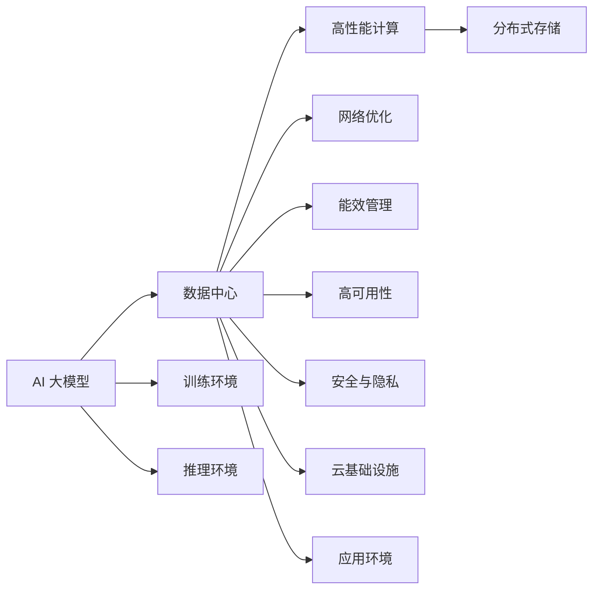

                 

# AI 大模型应用数据中心建设：数据中心技术创新

> 关键词：
- AI 大模型
- 数据中心
- 高性能计算
- 分布式存储
- 网络优化
- 能效管理
- 高可用性
- 安全与隐私
- 云基础设施

## 1. 背景介绍

随着人工智能(AI)技术在各行各业的深入应用，特别是大模型（如BERT、GPT-3等）的普及，对数据中心基础设施的需求也在不断增长。AI大模型的训练和推理需要巨大的计算资源、存储资源和带宽资源，这对数据中心的技术架构、能效管理和运营模式提出了新的挑战。本文将系统介绍AI大模型数据中心建设的核心技术和创新方向，为构建高效、安全、可靠的AI大模型基础设施提供参考。

## 2. 核心概念与联系

### 2.1 核心概念概述

为便于读者理解AI大模型数据中心的建设背景和核心技术，本节将介绍几个关键概念，并阐明它们之间的联系：

- **AI 大模型 (AI Large Model)**：指基于Transformer等架构构建的超大参数规模的神经网络模型，用于自然语言处理(NLP)、计算机视觉(CV)、语音识别(SR)等多种AI任务。
- **数据中心 (Data Center)**：是支持企业IT系统运行的物理设施，包括计算、存储、网络等基础设施，以及软件支持。数据中心是AI大模型训练和推理的重要环境。
- **高性能计算 (High Performance Computing, HPC)**：指使用并行计算和分布式计算技术，快速解决复杂计算问题的计算方式，广泛应用在AI大模型的训练和推理中。
- **分布式存储 (Distributed Storage)**：通过网络将多个存储设备组合起来，提供高速读写能力和大容量存储，以满足AI大模型的数据存储需求。
- **网络优化 (Network Optimization)**：通过优化网络架构和通信协议，提高网络传输速率和可靠性，确保AI大模型训练和推理的流畅进行。
- **能效管理 (Energy Efficiency Management)**：通过采用高效能组件和优化算法，降低数据中心的能耗，同时保证性能和可靠性。
- **高可用性 (High Availability)**：指数据中心各组件在系统故障时能够快速恢复，确保AI大模型应用不中断。
- **安全与隐私 (Security and Privacy)**：指在AI大模型应用过程中，确保数据、模型和计算过程的安全，保护用户隐私。
- **云基础设施 (Cloud Infrastructure)**：指基于云计算平台的资源服务，能够按需提供计算、存储、网络等服务，灵活支持AI大模型的应用。

这些核心概念共同构成了AI大模型数据中心的基础架构，其相互之间联系紧密，形成了一个完整的系统支持框架。

### 2.2 核心概念原理和架构的 Mermaid 流程图



这个流程图展示了AI大模型、数据中心和其核心技术之间的关系：

1. AI 大模型需要数据中心的硬件和软件支持。
2. 高性能计算、分布式存储、网络优化、能效管理、高可用性、安全与隐私、云基础设施等技术，共同构成了数据中心的核心架构。
3. AI 大模型在数据中心中运行训练环境和推理环境，并通过应用环境对外提供服务。

## 3. 核心算法原理 & 具体操作步骤

### 3.1 算法原理概述

AI大模型数据中心的建设涉及多个核心算法，包括分布式训练算法、优化算法、容错算法等。这些算法共同确保了AI大模型能够在大规模数据集上高效、可靠地运行。

- **分布式训练算法**：用于在大规模计算集群上并行训练大模型，常见算法包括Ring算法、ReduceScatter算法、AllReduce算法等。
- **优化算法**：用于调整模型参数，最小化训练误差，常见算法包括SGD、Adam、RMSprop等。
- **容错算法**：用于在集群节点出现故障时保证计算任务的连续性，常见算法包括Checkpointing、故障转移算法等。

这些算法的原理和实现细节，将在后文详细阐述。

### 3.2 算法步骤详解

AI大模型数据中心的建设流程包括以下关键步骤：

**Step 1: 设计计算集群**

1. 选择合适的硬件架构，如CPU、GPU、FPGA等，确保硬件计算能力满足大模型训练和推理的需求。
2. 设计集群规模和拓扑结构，如单节点、多节点集群、超级集群等，满足不同规模模型的计算需求。
3. 选择合适的分布式操作系统，如Linux、Windows等，保证集群的操作系统兼容性。

**Step 2: 配置存储系统**

1. 选择合适的存储硬件，如SSD、HDD等，确保存储容量和读写速度满足大模型数据需求。
2. 设计分布式存储架构，如GFS、HDFS、Ceph等，确保数据的高可用性和一致性。
3. 配置数据备份和冗余机制，防止数据丢失和系统故障。

**Step 3: 实现网络通信**

1. 选择合适的网络硬件，如交换机、路由器等，确保网络带宽和延迟满足大模型通信需求。
2. 设计网络拓扑结构，如环形、树形、网状等，优化网络性能和可靠性。
3. 配置网络安全措施，如防火墙、VPN等，保护数据中心的网络安全。

**Step 4: 部署和管理**

1. 安装和配置集群管理软件，如Hadoop、Spark等，支持分布式计算和存储。
2. 部署AI大模型训练和推理框架，如TensorFlow、PyTorch等，提供高效的模型训练和推理功能。
3. 配置监控和日志系统，实时监控集群运行状态，记录故障信息。

### 3.3 算法优缺点

构建AI大模型数据中心的技术具有以下优点：

- **高效计算**：通过分布式计算架构，能够快速处理大规模计算任务，缩短训练和推理时间。
- **高可用性**：通过冗余设计和故障恢复机制，保证数据中心的高可用性，降低系统故障风险。
- **灵活扩展**：通过云计算资源服务，能够按需扩展计算和存储资源，满足不同规模和变化的需求。
- **安全可靠**：通过网络安全措施和数据加密技术，保护数据和模型安全，防止泄露和攻击。

同时，这些技术也存在一定的局限性：

- **成本高昂**：构建高性能计算集群和分布式存储系统需要较高的初始投资和运维成本。
- **能耗巨大**：大模型训练和推理所需的计算资源和存储资源消耗大量电能，增加数据中心的能耗。
- **复杂度高**：设计和部署AI大模型数据中心涉及多个技术领域，需要跨学科知识和经验。
- **维护困难**：集群规模大、系统复杂，维护和管理难度较大。

### 3.4 算法应用领域

AI大模型数据中心技术主要应用于以下领域：

- **深度学习模型训练**：使用分布式计算和优化算法，快速训练深度学习模型，支持大规模图像、语音、文本等数据的处理。
- **自然语言处理(NLP)**：通过分布式计算和优化算法，训练大规模语言模型，支持文本分类、情感分析、机器翻译等NLP任务。
- **计算机视觉(CV)**：使用分布式计算和优化算法，训练大规模图像识别和分类模型，支持图像分类、目标检测、图像生成等任务。
- **自动驾驶**：通过分布式计算和优化算法，训练大规模自动驾驶模型，支持环境感知、决策规划和行为控制等任务。
- **医疗影像**：使用分布式计算和优化算法，训练大规模医学影像处理模型，支持疾病诊断、治疗方案设计等任务。

这些应用场景对数据中心的技术提出了更高的要求，推动了AI大模型数据中心技术的发展。

## 4. 数学模型和公式 & 详细讲解 & 举例说明

### 4.1 数学模型构建

AI大模型数据中心的核心数学模型包括分布式训练模型、优化模型、容错模型等。这些模型共同定义了数据中心的计算、存储、通信和维护策略。

**分布式训练模型**：
假设在分布式集群中，有$N$个计算节点，每个节点有$K$个计算核心。大模型$M$在每个节点的参数为$\theta_i$，其中$i=1,2,...,N$。数据集$D$分为$N$个子集，每个子集大小为$B$。

在每个节点$i$上进行小批量训练，更新参数$\theta_i$：

$$
\theta_i \leftarrow \theta_i - \eta \frac{1}{B} \sum_{j=1}^B \nabla_{\theta_i} L(\theta_i, (x_j,y_j))
$$

其中，$\eta$为学习率，$\nabla_{\theta_i} L(\theta_i, (x_j,y_j))$为损失函数对节点$i$的参数$\theta_i$的梯度。

**优化模型**：
使用SGD算法更新模型参数$\theta$：

$$
\theta \leftarrow \theta - \eta \nabla_{\theta} L(\theta, D)
$$

其中，$\nabla_{\theta} L(\theta, D)$为损失函数对模型参数$\theta$的梯度。

**容错模型**：
定义容错机制$\epsilon$，在节点$i$故障时，通过检查点恢复机制$Checkpoint(\theta_i)$，保证计算任务连续性：

$$
\theta_i \leftarrow Checkpoint(\theta_i)
$$

### 4.2 公式推导过程

下面以SGD算法为例，推导分布式训练中的参数更新公式。

假设每个节点的参数为$\theta_i$，数据集$D$中的样本为$(x_j, y_j)$，损失函数为$L(\theta, (x_j,y_j))$。节点$i$在更新参数$\theta_i$时，使用当前参数和样本计算梯度：

$$
\frac{\partial L(\theta_i, (x_j,y_j))}{\partial \theta_i} = \nabla_{\theta_i} L(\theta_i, (x_j,y_j))
$$

根据梯度下降算法，更新节点$i$的参数$\theta_i$：

$$
\theta_i \leftarrow \theta_i - \eta \frac{1}{B} \sum_{j=1}^B \nabla_{\theta_i} L(\theta_i, (x_j,y_j))
$$

其中，$\eta$为学习率，$B$为小批量大小。

### 4.3 案例分析与讲解

以大规模图像分类任务为例，分析分布式训练和优化模型的应用。

**案例背景**：
假设有一张分辨率为$1024\times1024$的彩色图像，需要进行大规模的图像分类任务，训练一个深度卷积神经网络模型$M$。数据集$D$包含$N$个样本，每个样本大小为$B$。

**分布式训练**：
将数据集$D$分为$N$个子集$D_1, D_2,...,D_N$，每个子集大小为$B$。在$N$个计算节点上并行训练模型$M$，每个节点分别处理$D_i$中的一个子集$D_i$。

每个节点$i$更新模型参数$\theta_i$，使用当前参数和子集$D_i$计算梯度：

$$
\theta_i \leftarrow \theta_i - \eta \frac{1}{B} \sum_{j=1}^B \nabla_{\theta_i} L(\theta_i, (x_{ij},y_{ij}))
$$

其中，$x_{ij}$为子集$D_i$中的样本$j$，$y_{ij}$为样本$j$的标签。

通过分布式训练，可以大幅提升模型训练的速度，满足大规模图像分类的需求。

**优化模型**：
在分布式训练过程中，优化模型使用SGD算法调整模型参数$\theta$：

$$
\theta \leftarrow \theta - \eta \nabla_{\theta} L(\theta, D)
$$

其中，$\nabla_{\theta} L(\theta, D)$为损失函数对模型参数$\theta$的梯度，$L(\theta, D)$为整个数据集$D$的损失函数。

通过优化模型，可以最小化训练误差，提升模型精度。

## 5. 项目实践：代码实例和详细解释说明

### 5.1 开发环境搭建

构建AI大模型数据中心需要大量的软硬件资源，因此搭建开发环境时需要注意以下几点：

1. 选择合适的硬件平台，如AWS、Google Cloud等云服务提供商，提供高性能计算集群和分布式存储系统。
2. 安装和配置分布式操作系统，如Linux、Ubuntu等，确保集群的操作系统兼容性。
3. 安装和配置计算和存储软件，如Hadoop、Spark、TensorFlow、PyTorch等，支持AI大模型的训练和推理。

### 5.2 源代码详细实现

以下是一个使用PyTorch实现大规模分布式训练的代码示例：

```python
import torch
import torch.distributed as dist
import torch.nn as nn
from torch.distributed._tensor import DTensor, DeviceMesh, init_method

# 定义模型
class Model(nn.Module):
    def __init__(self):
        super(Model, self).__init__()
        # 模型参数
        self.fc = nn.Linear(1024, 1024)
        
    def forward(self, x):
        x = self.fc(x)
        return x

# 定义优化器
optimizer = torch.optim.SGD(model.parameters(), lr=0.01)

# 定义分布式训练函数
def train_epoch(model, optimizer, data_loader):
    model.train()
    loss_sum = 0.0
    for data, target in data_loader:
        # 将数据和目标张量分发到所有节点
        data = DTensor.from_tensor(data, DeviceMesh(dist.get_world_size(), dist.get_world_rank(), [8, 8]))
        target = DTensor.from_tensor(target, DeviceMesh(dist.get_world_size(), dist.get_world_rank(), [1]))
        
        # 前向传播计算损失函数
        loss = model(data) - target
        
        # 反向传播更新参数
        optimizer.zero_grad()
        loss.backward()
        optimizer.step()
        
        # 计算损失函数
        loss_sum += loss.item()
    return loss_sum / len(data_loader)

# 主函数
if __name__ == "__main__":
    # 初始化分布式训练
    dist.init_process_group(backend="gloo", init_method="env://")
    
    # 创建分布式数据加载器
    train_loader = ...
    
    # 训练模型
    for epoch in range(10):
        train_loss = train_epoch(model, optimizer, train_loader)
        print("Epoch {}: Train loss = {}".format(epoch+1, train_loss))
```

### 5.3 代码解读与分析

在上述代码示例中，我们使用PyTorch实现了分布式训练过程。具体步骤如下：

1. 定义计算模型和优化器。
2. 初始化分布式训练环境，使用`dist.init_process_group()`函数创建分布式过程组。
3. 创建分布式数据加载器，将数据和目标张量分发到所有节点。
4. 进行前向传播和反向传播，计算损失函数，更新模型参数。
5. 循环训练模型，输出训练损失。

### 5.4 运行结果展示

在分布式训练过程中，可以使用Jupyter Notebook记录训练结果，生成图表展示训练误差和模型精度。

```python
import matplotlib.pyplot as plt

# 记录训练误差和模型精度
train_losses = []
train_accuracies = []

for epoch in range(10):
    train_loss = train_epoch(model, optimizer, train_loader)
    train_losses.append(train_loss)
    
    # 计算模型精度
    train_loader = ...
    train_accuracies.append(model_accuracy(model, train_loader))
    
    print("Epoch {}: Train loss = {}, Train accuracy = {}".format(epoch+1, train_loss, train_accuracy))
    
# 绘制训练误差和模型精度曲线
plt.plot(range(1, 11), train_losses, label="Train Loss")
plt.plot(range(1, 11), train_accuracies, label="Train Accuracy")
plt.legend()
plt.show()
```

## 6. 实际应用场景

### 6.1 智能医疗

在智能医疗领域，AI大模型数据中心可以支持大规模医疗影像处理、疾病预测和治疗方案设计等任务。例如，使用分布式计算和优化算法，训练大规模的深度卷积神经网络模型，用于医疗影像分类和图像分割。

**案例背景**：
某医院收集了大量医学影像数据，需要进行大规模的图像分类和分割任务，训练一个深度卷积神经网络模型。数据集$D$包含$N$个样本，每个样本大小为$B$。

**分布式训练**：
将数据集$D$分为$N$个子集$D_1, D_2,...,D_N$，每个子集大小为$B$。在$N$个计算节点上并行训练模型$M$，每个节点分别处理$D_i$中的一个子集$D_i$。

每个节点$i$更新模型参数$\theta_i$，使用当前参数和子集$D_i$计算梯度：

$$
\theta_i \leftarrow \theta_i - \eta \frac{1}{B} \sum_{j=1}^B \nabla_{\theta_i} L(\theta_i, (x_{ij},y_{ij}))
$$

通过分布式训练，可以大幅提升医疗影像处理的效率，满足大规模图像分类的需求。

**优化模型**：
在分布式训练过程中，优化模型使用SGD算法调整模型参数$\theta$：

$$
\theta \leftarrow \theta - \eta \nabla_{\theta} L(\theta, D)
$$

其中，$\nabla_{\theta} L(\theta, D)$为损失函数对模型参数$\theta$的梯度，$L(\theta, D)$为整个数据集$D$的损失函数。

通过优化模型，可以最小化训练误差，提升模型精度。

### 6.2 自动驾驶

在自动驾驶领域，AI大模型数据中心可以支持大规模的传感器数据处理、环境感知和行为控制等任务。例如，使用分布式计算和优化算法，训练大规模的深度学习模型，用于自动驾驶车辆的环境感知和决策规划。

**案例背景**：
某自动驾驶公司收集了大量传感器数据，需要进行大规模的环境感知和行为控制任务，训练一个深度学习模型。数据集$D$包含$N$个样本，每个样本大小为$B$。

**分布式训练**：
将数据集$D$分为$N$个子集$D_1, D_2,...,D_N$，每个子集大小为$B$。在$N$个计算节点上并行训练模型$M$，每个节点分别处理$D_i$中的一个子集$D_i$。

每个节点$i$更新模型参数$\theta_i$，使用当前参数和子集$D_i$计算梯度：

$$
\theta_i \leftarrow \theta_i - \eta \frac{1}{B} \sum_{j=1}^B \nabla_{\theta_i} L(\theta_i, (x_{ij},y_{ij}))
$$

通过分布式训练，可以大幅提升自动驾驶模型的训练速度，满足大规模环境感知和行为控制的需求。

**优化模型**：
在分布式训练过程中，优化模型使用SGD算法调整模型参数$\theta$：

$$
\theta \leftarrow \theta - \eta \nabla_{\theta} L(\theta, D)
$$

其中，$\nabla_{\theta} L(\theta, D)$为损失函数对模型参数$\theta$的梯度，$L(\theta, D)$为整个数据集$D$的损失函数。

通过优化模型，可以最小化训练误差，提升模型精度。

### 6.3 智能客服

在智能客服领域，AI大模型数据中心可以支持大规模的对话模型训练和推理任务。例如，使用分布式计算和优化算法，训练大规模的对话模型，用于智能客服系统的对话处理。

**案例背景**：
某电商平台收集了大量用户咨询数据，需要进行大规模的对话模型训练和推理任务，训练一个深度学习模型。数据集$D$包含$N$个样本，每个样本大小为$B$。

**分布式训练**：
将数据集$D$分为$N$个子集$D_1, D_2,...,D_N$，每个子集大小为$B$。在$N$个计算节点上并行训练模型$M$，每个节点分别处理$D_i$中的一个子集$D_i$。

每个节点$i$更新模型参数$\theta_i$，使用当前参数和子集$D_i$计算梯度：

$$
\theta_i \leftarrow \theta_i - \eta \frac{1}{B} \sum_{j=1}^B \nabla_{\theta_i} L(\theta_i, (x_{ij},y_{ij}))
$$

通过分布式训练，可以大幅提升对话模型的训练速度，满足大规模对话处理的性能需求。

**优化模型**：
在分布式训练过程中，优化模型使用SGD算法调整模型参数$\theta$：

$$
\theta \leftarrow \theta - \eta \nabla_{\theta} L(\theta, D)
$$

其中，$\nabla_{\theta} L(\theta, D)$为损失函数对模型参数$\theta$的梯度，$L(\theta, D)$为整个数据集$D$的损失函数。

通过优化模型，可以最小化训练误差，提升模型精度。

## 7. 工具和资源推荐

### 7.1 学习资源推荐

为了帮助开发者系统掌握AI大模型数据中心的构建技术和实际应用，这里推荐一些优质的学习资源：

1. 《深度学习架构与实践》：这本书详细介绍了深度学习模型的架构设计和优化方法，涵盖计算图、分布式计算、GPU加速等内容。
2. 《机器学习实战》：该书通过Python代码实现各种机器学习算法，重点介绍了分布式机器学习和深度学习的应用案例。
3. 《TensorFlow实战》：该书全面介绍了TensorFlow框架的使用方法，涵盖计算图、分布式训练、模型优化等内容。
4. 《Hadoop权威指南》：该书深入浅出地介绍了Hadoop生态系统的各种组件，包括计算集群、分布式存储、数据处理等。
5. 《深度学习与计算机视觉》：该书涵盖了深度学习模型的设计与实现，重点介绍了卷积神经网络在计算机视觉中的应用。

通过学习这些书籍，可以深入理解AI大模型数据中心的构建技术，掌握实际应用的实现方法。

### 7.2 开发工具推荐

构建AI大模型数据中心需要大量的软硬件资源，因此选择合适的开发工具至关重要。以下是几款用于AI大模型数据中心开发的常用工具：

1. AWS：提供高性能计算、分布式存储、云计算等服务，支持大规模AI大模型训练和推理。
2. Google Cloud：提供类似AWS的云服务，支持深度学习模型的分布式训练和优化。
3. Microsoft Azure：提供GPU、TPU等高性能计算资源，支持大规模深度学习模型的训练和推理。
4. NVIDIA GPU：提供高性能GPU计算资源，支持大规模深度学习模型的训练和推理。
5. NVIDIA CUDA：提供高性能GPU计算框架，支持深度学习模型的优化和加速。
6. NVIDIA ROCm：提供高性能GPU计算框架，支持深度学习模型的优化和加速。
7. NVIDIA SMI：提供GPU性能监控工具，实时监控GPU使用情况，保证系统稳定性。
8. NVIDIA cuDNN：提供深度学习算法的优化实现，支持卷积神经网络等模型的加速。
9. NVIDIA NVIDIA TensorRT：提供深度学习模型的推理加速工具，支持硬件加速。
10. NVIDIA TensorFlow：提供深度学习框架的GPU优化实现，支持大规模分布式训练和推理。

这些工具可以为AI大模型数据中心的构建提供强大支持，提升系统性能和稳定性。

### 7.3 相关论文推荐

AI大模型数据中心的构建和优化涉及多个技术领域，相关论文推荐如下：

1. "Scalable Deep Learning with TensorFlow"：由Google的工程师团队撰写，介绍TensorFlow的分布式计算和优化方法，涵盖分布式计算集群、分布式数据加载、模型优化等。
2. "Training Deep Neural Networks on Large Datasets"：由深度学习领域的专家撰写，介绍分布式训练和优化算法的理论基础和实际应用。
3. "Efficient Distributed Deep Learning"：由Facebook的研究团队撰写，介绍分布式深度学习框架PyTorch的实现方法和优化策略。
4. "A Distributed Asynchronous Training Algorithm"：由Google的研究团队撰写，介绍分布式异步训练算法的实现和优化方法。
5. "Adaptive Moment Estimation"：由深度学习领域的专家撰写，介绍Adam算法的实现方法和优化策略。
6. "Model Parallelism"：由深度学习领域的专家撰写，介绍模型并行算法的实现方法和优化策略。

这些论文代表了深度学习、分布式计算、模型优化等领域的最新进展，对于构建高效、可靠、可扩展的AI大模型数据中心具有重要参考价值。

## 8. 总结：未来发展趋势与挑战

### 8.1 研究成果总结

本文系统介绍了AI大模型数据中心的构建技术，涵盖了分布式计算、优化算法、容错机制等多个方面。通过详细阐述数据中心的构建流程和实现方法，为AI大模型的实际应用提供了重要参考。

### 8.2 未来发展趋势

展望未来，AI大模型数据中心技术将呈现以下几个发展趋势：

1. **高性能计算**：随着算力的提升，AI大模型数据中心将更加注重高性能计算的开发，如GPU、TPU等高性能计算资源的应用，支持更大规模、更复杂的深度学习模型的训练和推理。
2. **分布式存储**：分布式存储技术将更加成熟，支持更大规模、更高速度的数据存储和访问，满足AI大模型的数据存储需求。
3. **网络优化**：随着网络技术的进步，AI大模型数据中心将更加注重网络优化和性能提升，支持更大规模、更高速度的数据传输和处理。
4. **能效管理**：能效管理技术将更加完善，通过采用高效能组件和优化算法，降低数据中心的能耗，提升系统的可持续性。
5. **高可用性**：高可用性技术将更加先进，通过冗余设计和故障恢复机制，保证AI大模型数据中心的高可用性，提高系统的可靠性。
6. **安全与隐私**：安全与隐私技术将更加严格，通过数据加密、访问控制等措施，保护AI大模型数据中心的安全和隐私。
7. **云基础设施**：云基础设施将更加普及，通过云计算资源的按需提供，支持AI大模型数据中心的灵活扩展和快速部署。

### 8.3 面临的挑战

尽管AI大模型数据中心技术取得了显著进展，但在实际应用中也面临诸多挑战：

1. **成本高昂**：构建高性能计算集群和分布式存储系统需要较高的初始投资和运维成本。
2. **能耗巨大**：大规模深度学习模型的训练和推理所需的计算资源和存储资源消耗大量电能，增加数据中心的能耗。
3. **复杂度高**：AI大模型数据中心涉及多个技术领域，需要跨学科知识和经验。
4. **维护困难**：集群规模大、系统复杂，维护和管理难度较大。
5. **模型鲁棒性不足**：大模型训练和推理的鲁棒性有待提高，特别是在域外数据和对抗样本的情况下。
6. **安全与隐私**：AI大模型数据中心的安全和隐私问题日益突出，需要采取更严格的措施保护数据和模型。

### 8.4 研究展望

为了应对上述挑战，未来的研究需要在以下几个方面寻求新的突破：

1. **高效计算**：通过采用新型计算硬件和算法优化，提高AI大模型数据中心的计算效率，降低能耗。
2. **分布式存储**：探索新型分布式存储技术，支持更大规模、更高速度的数据存储和访问，提升系统的可靠性。
3. **网络优化**：开发新型网络优化技术，支持更大规模、更高速度的数据传输和处理，提升系统的性能。
4. **高可用性**：研究高可用性技术，通过冗余设计和故障恢复机制，保证AI大模型数据中心的高可用性，提升系统的可靠性。
5. **安全与隐私**：研究安全与隐私技术，通过数据加密、访问控制等措施，保护AI大模型数据中心的安全和隐私。
6. **模型鲁棒性**：研究模型鲁棒性技术，通过抗干扰、抗对抗样本等措施，提高AI大模型数据中心的鲁棒性。
7. **云基础设施**：研究云计算技术，通过云计算资源的按需提供，支持AI大模型数据中心的灵活扩展和快速部署。

总之，AI大模型数据中心技术具有广阔的发展前景，需要在计算、存储、通信、维护等多个方面进行持续优化和创新，以支持大规模深度学习模型的训练和推理，满足更多应用场景的需求。

## 9. 附录：常见问题与解答

**Q1：如何选择合适的硬件平台？**

A: 选择合适的硬件平台需要考虑计算能力、存储容量、带宽需求等多个因素。通常情况下，GPU和TPU是AI大模型数据中心的首选硬件平台，可以提供强大的计算能力和存储容量。AWS、Google Cloud和Microsoft Azure等云服务提供商提供了丰富的硬件资源，可以根据实际需求进行选择。

**Q2：如何进行分布式训练？**

A: 进行分布式训练需要选择合适的分布式计算框架，如TensorFlow、PyTorch等，并配置分布式训练环境。通常情况下，将数据集划分为多个子集，并在多个计算节点上进行并行训练。每个节点使用当前参数和子集计算梯度，并使用分布式优化算法更新模型参数。

**Q3：如何进行优化算法的选择？**

A: 选择合适的优化算法需要考虑模型的特性和训练数据的特点。常见的优化算法包括SGD、Adam、RMSprop等。通常情况下，使用SGD算法进行分布式训练，并使用Adam等优化算法调整模型参数。

**Q4：如何进行模型鲁棒性提升？**

A: 提升模型鲁棒性需要从多个方面入手，包括数据增强、正则化、对抗训练等。数据增强可以通过回译、近义替换等方式扩充训练集，增加模型的泛化能力。正则化可以通过L2正则、Dropout等技术防止过拟合。对抗训练可以通过引入对抗样本，提高模型鲁棒性。

**Q5：如何进行安全与隐私保护？**

A: 保护AI大模型数据中心的安全与隐私需要采取多种措施，包括数据加密、访问控制、审计日志等。数据加密可以通过AES、RSA等技术对数据进行加密，防止数据泄露。访问控制可以通过权限管理、认证机制等限制数据访问权限。审计日志可以通过记录数据访问和操作日志，确保系统的安全性。

**Q6：如何进行模型参数的高效微调？**

A: 高效微调可以通过参数高效微调技术，如Adapter、Prefix等方法，在固定大部分预训练参数的情况下，只更新极少量的任务相关参数。此外，可以通过GPU硬件加速和混合精度训练等技术，提升微调的效率。

通过学习和实践，相信你能全面掌握AI大模型数据中心的构建技术，并成功应用于实际应用场景中。

---

作者：禅与计算机程序设计艺术 / Zen and the Art of Computer Programming

