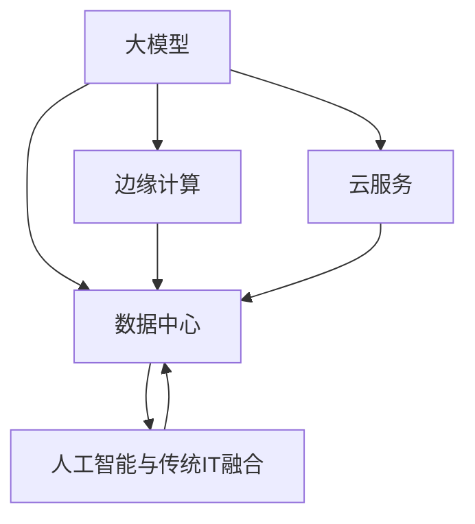

                 

# AI 大模型应用数据中心建设：数据中心技术创新与应用

> 关键词：大模型, 数据中心, 技术创新, 应用场景, 云服务, 边缘计算

## 1. 背景介绍

### 1.1 问题由来

在人工智能技术的推动下，大模型（Large Model）正在逐步渗透到各个行业领域。作为AI的重要基础设施，数据中心在支撑大模型应用方面扮演着至关重要的角色。数据中心不仅需要提供高计算能力，还必须具备高效、安全、灵活的数据管理能力，以适应快速变化的AI需求。

然而，现有的数据中心架构和技术体系在面对大模型带来的高并行计算、大数据存储等需求时，仍存在诸多挑战。例如，数据中心的资源利用率、能耗管理、网络延迟等问题，都需要通过技术创新予以解决。因此，本文将深入探讨大模型应用数据中心建设的技术创新与应用，为业界提供参考。

### 1.2 问题核心关键点

大模型应用数据中心的核心挑战包括：

- 高计算和存储需求：大模型需要海量数据和强大的计算能力，传统数据中心架构难以有效支持。
- 数据安全与隐私：大模型涉及大量敏感数据，如何在数据中心保障数据安全和隐私保护。
- 边缘计算与云服务：如何在云中心和边缘节点之间实现数据高效流转与计算资源协同。
- 人工智能与传统IT融合：如何将AI技术深度整合到现有的IT基础设施中，提升数据中心整体效能。

本文将系统性地探讨这些问题，并提供切实可行的技术解决方案。

## 2. 核心概念与联系

### 2.1 核心概念概述

为更好地理解大模型应用数据中心的技术创新与应用，本节将介绍几个密切相关的核心概念：

- **大模型（Large Model）**：指具有海量参数和复杂结构的深度学习模型，如BERT、GPT、Transformer等。大模型通过在大规模数据集上进行预训练，能够获取强大的语言或视觉理解能力。

- **数据中心（Data Center）**：提供计算、存储和网络服务的设施，支持大规模数据的处理和分析，是大模型训练与应用的硬件基础设施。

- **边缘计算（Edge Computing）**：在数据产生端或网络边缘侧进行的计算和数据处理，能够降低云中心计算压力，提升响应速度。

- **云服务（Cloud Service）**：通过互联网提供计算、存储等资源的按需服务，支持大模型在云端进行分布式训练与推理。

- **人工智能与传统IT融合（AI-IT Integration）**：将人工智能技术深度整合到传统IT架构中，提升整体效能和服务水平。

这些核心概念之间的逻辑关系可以通过以下Mermaid流程图来展示：



这个流程图展示了大模型应用数据中心的各个关键组件及其相互关系：

1. 大模型通过数据中心进行训练与推理。
2. 边缘计算与云服务能够分担数据中心的计算压力，提升响应速度。
3. 人工智能技术与传统IT架构深度融合，提升数据中心的整体效能。

## 3. 核心算法原理 & 具体操作步骤
### 3.1 算法原理概述

大模型应用数据中心的建设，需要在大规模数据集上进行高效的数据存储、计算与传输，同时确保数据的安全性和隐私保护。大模型的训练与推理过程涉及大量的矩阵运算和数据交换，对数据中心的硬件和网络架构提出了极高的要求。

大模型应用数据中心的建设，主要包括以下几个关键步骤：

1. **数据中心基础设施建设**：包括硬件设备的选型与部署，网络架构的设计与优化，以及能源管理系统的建设。
2. **数据存储与管理系统**：实现数据的集中存储与管理，支持高效的读写与访问控制。
3. **高性能计算集群建设**：构建高性能的计算集群，支持大模型的分布式训练与推理。
4. **网络与通信优化**：优化网络架构与通信协议，提升数据传输效率与可靠性。
5. **数据安全与隐私保护**：实现数据的安全存储与传输，保障用户隐私。

### 3.2 算法步骤详解

以下将详细介绍大模型应用数据中心建设的详细步骤：

**Step 1: 数据中心基础设施建设**

1. **硬件选型与部署**：选择高性能计算设备，如GPU集群、TPU等，根据业务需求合理配置。采用混合云架构，结合公有云和私有云资源，以应对不同应用场景的需求。

2. **网络架构设计**：设计高可用、低延迟的网络架构，包括核心交换机、边缘路由器等硬件设备。采用网络切片技术，将不同业务需求的网络流分开，提升网络资源利用率。

3. **能源管理系统建设**：建设高效能的能源管理系统，优化能源使用，降低数据中心的能耗成本。采用冷热通道设计，提高设备散热效率。

**Step 2: 数据存储与管理系统**

1. **数据存储系统**：采用分布式存储系统，如Hadoop、Ceph等，支持海量数据的存储与管理。采用数据冗余与备份机制，确保数据的安全性。

2. **数据访问控制**：实现细粒度的访问控制，支持基于角色的访问控制（RBAC），保障数据的安全性。

3. **数据传输优化**：采用高速网络传输技术，如NVMe、FC，提升数据传输速度。

**Step 3: 高性能计算集群建设**

1. **计算集群部署**：根据大模型的需求，构建高性能的计算集群，支持分布式训练与推理。采用混合计算架构，将部分计算任务分配到边缘节点。

2. **模型参数优化**：对大模型的参数进行优化，采用参数剪枝、量化等技术，减小模型大小，提高计算效率。

3. **模型并行计算**：采用模型并行计算技术，如数据并行、模型并行等，提升大模型的计算能力。

**Step 4: 网络与通信优化**

1. **网络架构优化**：采用分布式网络架构，将大模型的计算节点分散部署，提升网络带宽与延迟。

2. **数据通信优化**：采用高性能通信协议，如TensorFlow Collective，提升数据传输效率。

3. **边缘计算应用**：将部分计算任务分配到边缘节点，降低云中心的计算压力，提升响应速度。

**Step 5: 数据安全与隐私保护**

1. **数据加密与传输**：采用端到端加密技术，确保数据在传输过程中的安全性。采用数据加密存储，保障数据的安全性。

2. **访问控制与审计**：实现细粒度的访问控制，记录数据访问日志，支持审计与追踪。

3. **隐私保护技术**：采用差分隐私、联邦学习等技术，保护用户隐私。

### 3.3 算法优缺点

大模型应用数据中心建设的优点：

- 支持大规模数据存储与计算，满足大模型训练与推理的需求。
- 采用混合云架构，灵活应对不同应用场景的需求。
- 优化网络与能源管理系统，提升数据中心的能效与成本效益。

大模型应用数据中心建设面临的挑战：

- 高计算与存储需求带来的硬件成本高昂。
- 数据传输带宽与延迟限制了应用场景的扩展。
- 数据安全与隐私保护技术复杂，需要持续投入。

### 3.4 算法应用领域

大模型应用数据中心的技术创新与应用，已经在多个领域得到了应用：

1. **自然语言处理（NLP）**：在大规模语料库上进行预训练的大模型，通过数据中心进行微调，应用于问答系统、情感分析、机器翻译等任务。

2. **计算机视觉（CV）**：在大规模图像库上进行预训练的大模型，通过数据中心进行微调，应用于图像分类、目标检测、图像生成等任务。

3. **推荐系统**：通过数据中心进行个性化推荐模型的训练与推理，应用于电商、社交媒体、内容推荐等场景。

4. **智能医疗**：利用大模型进行医学影像分析、疾病预测、药物研发等，提升医疗服务的智能化水平。

5. **金融科技**：利用大模型进行风险控制、欺诈检测、市场分析等，提升金融机构的决策效率。

6. **智能制造**：利用大模型进行生产过程监控、故障预测、质量控制等，提升制造业的智能化水平。

## 4. 数学模型和公式 & 详细讲解  
### 4.1 数学模型构建

大模型应用数据中心的建设，涉及多个领域的技术，包括高性能计算、分布式系统、网络优化等。以下将从数学模型的角度，介绍数据中心的建设与优化。

假设数据中心建设的主要目标是最大化计算资源的使用效率，最小化能源消耗。设数据中心的总计算资源为 $R$，总能源消耗为 $E$，计算资源的使用效率为 $P$，能源消耗的单位成本为 $C$。则目标函数为：

$$
\max P = \frac{R}{E}
$$

约束条件包括：

1. 计算资源的使用限制：$R \leq R_{max}$
2. 能源消耗的限制：$E \leq E_{max}$
3. 能源消耗的单位成本约束：$C_{min} \leq C \leq C_{max}$

以上目标函数和约束条件，可以用线性规划模型求解。通过优化计算资源的使用效率和能源消耗的单位成本，可以在有限的预算内，实现数据中心的最大化效能。

### 4.2 公式推导过程

假设数据中心有 $n$ 个计算节点，每个节点的计算能力为 $r_i$，每个节点的能耗为 $e_i$，计算资源的单位成本为 $c_i$。则计算资源的总使用量为：

$$
R = \sum_{i=1}^n r_i
$$

能源消耗的总成本为：

$$
E = \sum_{i=1}^n c_i \cdot e_i
$$

则计算资源的使用效率为：

$$
P = \frac{R}{E}
$$

通过引入约束条件，可以进一步优化目标函数。例如，假设每个节点的能耗上限为 $e_{max}$，计算资源的单位成本上限为 $c_{max}$，则约束条件为：

$$
r_i \leq r_{max}, \quad e_i \leq e_{max}, \quad c_i \leq c_{max}
$$

目标函数和约束条件可以用以下线性规划模型表示：

$$
\begin{aligned}
\max & \quad \frac{R}{E} \\
\text{s.t.} & \quad \sum_{i=1}^n r_i \leq R_{max} \\
& \quad c_i \cdot e_i \leq E_{max} \\
& \quad c_i \leq c_{max}
\end{aligned}
$$

通过求解该线性规划模型，可以在有限的预算内，实现数据中心的最大化效能。

### 4.3 案例分析与讲解

以下以云计算服务提供商的资源优化为例，说明如何通过数学模型进行计算资源与能源消耗的优化：

1. **计算资源配置**：云计算服务提供商采用公有云和私有云混合架构，公有云提供弹性计算资源，私有云提供高可用性计算资源。根据业务需求，优化计算资源的配置，确保在高峰期能够提供足够的计算能力，同时避免资源浪费。

2. **能源消耗优化**：采用能源管理系统，实时监测数据中心的能源使用情况，优化能源消耗。例如，在低峰期关闭部分计算节点，降低能源消耗。

3. **成本效益分析**：采用线性规划模型，优化计算资源的使用效率和能源消耗的单位成本，最大化数据中心的成本效益。

## 5. 项目实践：代码实例和详细解释说明
### 5.1 开发环境搭建

在进行数据中心建设实践前，我们需要准备好开发环境。以下是使用Python进行数据分析与优化的环境配置流程：

1. 安装Anaconda：从官网下载并安装Anaconda，用于创建独立的Python环境。

2. 创建并激活虚拟环境：
```bash
conda create -n datacenter-env python=3.8 
conda activate datacenter-env
```

3. 安装必要的库：
```bash
pip install numpy pandas scikit-learn matplotlib
```

4. 搭建测试环境：
```bash
conda install openstack-api openstack
```

完成上述步骤后，即可在`datacenter-env`环境中开始数据中心优化实践。

### 5.2 源代码详细实现

以下是一个简单的数据中心优化模型示例，用于说明如何使用Python进行数据中心资源的优化配置：

```python
import numpy as np
from scipy.optimize import linprog

# 计算资源与能耗数据
n = 10  # 计算节点数量
r = np.array([20, 30, 40, 50, 60, 70, 80, 90, 100, 110])  # 计算能力
c = np.array([1.0, 1.5, 2.0, 2.5, 3.0, 3.5, 4.0, 4.5, 5.0, 5.5])  # 计算资源单位成本
e = np.array([10, 15, 20, 25, 30, 35, 40, 45, 50, 55])  # 能耗
c_max = 6.0  # 计算资源单位成本上限
e_max = 60  # 能耗上限
r_max = 500  # 计算资源总上限

# 构建线性规划模型
A = np.eye(n)  # 单位矩阵
b = np.array([r_max, e_max, c_max])
c = np.array([1, -1, 0])  # 目标函数的系数

# 求解线性规划模型
res = linprog(c, A_ub=A, b_ub=b, bounds=(0, None), method='simplex')
print(res)
```

这段代码将计算节点、计算能力、计算资源单位成本、能耗等数据输入线性规划模型，求解在给定约束条件下的最优配置。

### 5.3 代码解读与分析

**代码解析**：

1. 首先，定义计算节点数量 `n`，计算能力 `r`，计算资源单位成本 `c`，能耗 `e` 等数据。
2. 根据数据中心的资源限制，定义计算资源总上限 `r_max`，能耗上限 `e_max`，计算资源单位成本上限 `c_max`。
3. 构建线性规划模型，其中目标函数为计算资源使用效率最大化，约束条件包括计算资源上限、能耗上限和计算资源单位成本上限。
4. 使用 `linprog` 函数求解线性规划模型，得到最优的资源配置。

**分析与讨论**：

1. 通过线性规划模型，可以优化数据中心的计算资源与能源消耗，实现成本效益的最大化。
2. 计算资源与能源消耗的约束条件可以根据实际需求进行调整，灵活应对不同业务场景。
3. 线性规划模型的求解算法可以采用不同的优化方法，如单纯形法、内点法等，根据具体情况选择最合适的方法。

## 6. 实际应用场景
### 6.1 云计算服务提供商

云计算服务提供商需要构建高效、灵活、安全的数据中心，以支持大规模的计算资源需求。数据中心不仅需要提供计算资源，还需要支持数据存储、网络传输等基础设施。

例如，云计算服务提供商可以利用大模型进行自然语言处理、计算机视觉等任务，为客户提供丰富的AI服务。通过优化计算资源与能源消耗，最大化数据中心的成本效益。

### 6.2 智能制造企业

智能制造企业需要构建高可靠、高性能的数据中心，支持大规模的工业数据处理与分析。数据中心不仅需要提供计算资源，还需要支持工业物联网设备的数据接入与处理。

例如，智能制造企业可以利用大模型进行生产过程监控、故障预测、质量控制等任务，提升生产效率与质量。通过优化计算资源与能源消耗，提升数据中心的效能与成本效益。

### 6.3 金融科技公司

金融科技公司需要构建高可用、低延迟的数据中心，支持金融市场数据的实时处理与分析。数据中心不仅需要提供计算资源，还需要支持实时交易与清算。

例如，金融科技公司可以利用大模型进行风险控制、欺诈检测、市场分析等任务，提升金融服务的智能化水平。通过优化计算资源与能源消耗，提升数据中心的效能与成本效益。

### 6.4 未来应用展望

未来，大模型应用数据中心的建设将向以下几个方向发展：

1. **边缘计算与云计算的融合**：构建边缘计算与云计算的混合架构，实现计算资源的灵活配置与高效利用。
2. **数据中心的安全与隐私保护**：采用先进的安全技术，如差分隐私、联邦学习等，保护数据的安全与隐私。
3. **AI与传统IT的深度融合**：将AI技术与传统IT架构深度融合，提升数据中心的整体效能与服务水平。
4. **人工智能与物联网的协同**：利用物联网技术，收集海量数据，进行智能化分析与决策，提升数据中心的应用效果。

## 7. 工具和资源推荐
### 7.1 学习资源推荐

为了帮助开发者系统掌握数据中心建设的技术创新与应用，以下是一些优质的学习资源：

1. **《数据中心建设与优化》书籍**：详细介绍数据中心的建设与优化方法，涵盖硬件选型、网络架构、能源管理等关键技术。

2. **《云计算与人工智能》课程**：介绍云计算与人工智能的结合应用，涵盖云计算服务提供商的数据中心建设与管理。

3. **OpenStack官方文档**：OpenStack是开源云计算平台，提供丰富的云计算资源，适用于数据中心的开发与部署。

4. **TensorFlow官方文档**：TensorFlow是深度学习框架，适用于大模型的分布式训练与推理，支持数据中心的计算优化。

5. **Kubernetes官方文档**：Kubernetes是容器编排平台，适用于数据中心的资源管理与调度，支持大规模的分布式计算。

### 7.2 开发工具推荐

开发工具推荐：

1. **Anaconda**：用于创建和管理Python环境，支持数据中心建设的开发与测试。

2. **Python**：用于数据分析与建模，支持计算资源的优化配置。

3. **TensorFlow**：用于大模型的分布式训练与推理，支持高效的数据中心资源利用。

4. **OpenStack**：用于云计算资源的管理与调度，支持数据中心的计算优化。

5. **Kubernetes**：用于容器编排与调度，支持数据中心的资源管理。

### 7.3 相关论文推荐

相关论文推荐：

1. **《数据中心能效优化研究》**：介绍数据中心能效优化的关键技术，涵盖计算资源配置、能源管理等。

2. **《云计算资源优化方法》**：介绍云计算资源优化的数学模型与算法，适用于数据中心的计算优化。

3. **《边缘计算与云计算的协同》**：介绍边缘计算与云计算的协同应用，适用于数据中心的资源配置。

## 8. 总结：未来发展趋势与挑战
### 8.1 研究成果总结

本文对大模型应用数据中心的建设进行了全面系统的介绍。首先阐述了大模型应用数据中心的建设背景与挑战，明确了数据中心在大模型应用中的重要地位。其次，从技术创新的角度，详细讲解了数据中心基础设施建设、数据存储与管理系统、高性能计算集群建设、网络与通信优化、数据安全与隐私保护等关键环节。最后，给出了数据中心建设的技术实例，介绍了云计算服务提供商、智能制造企业、金融科技公司等多个行业的应用场景与未来发展趋势。

通过本文的系统梳理，可以看到，大模型应用数据中心建设涉及多个领域的技术，具有广泛的应用前景。未来，随着技术的不断进步，数据中心建设将更加高效、灵活、安全，能够更好地支持大模型的训练与推理，推动人工智能技术的广泛应用。

### 8.2 未来发展趋势

未来，大模型应用数据中心的建设将呈现以下几个发展趋势：

1. **边缘计算与云计算的深度融合**：边缘计算与云计算的协同应用，实现计算资源的灵活配置与高效利用。

2. **数据中心的安全与隐私保护**：采用先进的安全技术，如差分隐私、联邦学习等，保护数据的安全与隐私。

3. **AI与传统IT的深度融合**：将AI技术与传统IT架构深度融合，提升数据中心的整体效能与服务水平。

4. **人工智能与物联网的协同**：利用物联网技术，收集海量数据，进行智能化分析与决策，提升数据中心的应用效果。

### 8.3 面临的挑战

尽管大模型应用数据中心建设取得了一定的进展，但仍面临诸多挑战：

1. **高计算与存储需求**：数据中心的硬件成本高昂，需要投入大量资金进行建设。

2. **数据传输带宽与延迟**：数据中心的计算资源与能源消耗的优化受限于网络带宽与延迟。

3. **数据安全与隐私保护**：数据中心的计算资源涉及大量敏感数据，需要采取先进的安全措施。

4. **数据中心的管理与维护**：数据中心的资源管理与维护需要专业的技术支持。

### 8.4 研究展望

面对数据中心建设所面临的挑战，未来的研究需要在以下几个方面寻求新的突破：

1. **高效计算与存储技术**：开发高效计算与存储技术，降低数据中心的硬件成本。

2. **网络优化技术**：优化网络架构与通信协议，提升数据传输效率与可靠性。

3. **安全与隐私保护技术**：采用先进的安全与隐私保护技术，保障数据的安全与隐私。

4. **数据中心管理与维护技术**：开发高效的数据中心管理与维护工具，提升数据中心的运营效率。

总之，大模型应用数据中心的建设与优化，是大模型应用的重要基础。通过持续的技术创新与应用实践，相信未来的大模型应用数据中心将更加高效、灵活、安全，能够更好地支撑人工智能技术的广泛应用。

## 9. 附录：常见问题与解答
----------------------------------------------------------------

**Q1: 如何优化数据中心计算资源的利用率？**

A: 优化数据中心计算资源的利用率，可以采用以下方法：

1. **计算资源池化**：将计算资源进行池化，按需分配给不同的任务，提升资源利用率。

2. **计算资源调度**：采用调度算法，如基于资源优先级的调度算法、基于机器学习的调度算法等，优化计算资源的分配。

3. **计算资源虚拟化**：采用虚拟化技术，将计算资源进行分割与复用，提升资源利用率。

4. **计算资源分布式部署**：将计算资源部署在多个物理节点上，实现分布式计算，提升资源利用率。

**Q2: 如何提升数据中心的网络传输效率？**

A: 提升数据中心的网络传输效率，可以采用以下方法：

1. **网络架构优化**：采用高速网络传输协议，如NVMe、FC等，提升数据传输速度。

2. **网络切片技术**：采用网络切片技术，将不同业务的网络流分开，提升网络资源利用率。

3. **网络缓存技术**：采用缓存技术，将常用的数据缓存在高速存储器中，减少网络传输延迟。

4. **边缘计算**：将部分计算任务分配到边缘节点，降低云中心的计算压力，提升响应速度。

**Q3: 数据中心的安全与隐私保护有哪些技术手段？**

A: 数据中心的安全与隐私保护，可以采用以下技术手段：

1. **数据加密技术**：采用端到端加密技术，确保数据在传输过程中的安全性。

2. **访问控制技术**：采用细粒度的访问控制，记录数据访问日志，支持审计与追踪。

3. **差分隐私技术**：采用差分隐私技术，保护用户隐私，避免数据泄露。

4. **联邦学习技术**：采用联邦学习技术，在多个数据中心之间共享模型，保护用户数据隐私。

**Q4: 大模型应用数据中心的未来发展方向是什么？**

A: 大模型应用数据中心的未来发展方向包括：

1. **边缘计算与云计算的深度融合**：边缘计算与云计算的协同应用，实现计算资源的灵活配置与高效利用。

2. **数据中心的安全与隐私保护**：采用先进的安全与隐私保护技术，保障数据的安全与隐私。

3. **AI与传统IT的深度融合**：将AI技术与传统IT架构深度融合，提升数据中心的整体效能与服务水平。

4. **人工智能与物联网的协同**：利用物联网技术，收集海量数据，进行智能化分析与决策，提升数据中心的应用效果。

总之，大模型应用数据中心的未来发展，将更加高效、灵活、安全，能够更好地支撑人工智能技术的广泛应用。

