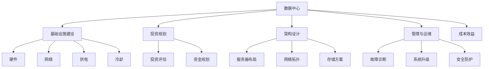

                 

# AI 大模型应用数据中心建设：数据中心投资与建设

> 关键词：AI大模型, 数据中心, 基础设施建设, 投资规划, 架构设计, 管理与运维, 成本效益

## 1. 背景介绍

### 1.1 问题由来
随着人工智能(AI)技术的迅猛发展，大模型如GPT-3、BERT等在自然语言处理(NLP)、计算机视觉、语音识别等领域取得了显著的成果。这些大模型依赖于海量的数据进行预训练，并通过微调适应特定任务。但大模型的应用同时也面临着数据中心资源需求巨大、建设与运维成本高昂等挑战。数据中心的投资与建设是AI大模型应用的重要支撑，合理规划和设计数据中心成为关键。

### 1.2 问题核心关键点
1. **数据中心投资**：如何估算AI大模型所需数据中心的投资成本，包括硬件、软件、网络、供电等。
2. **数据中心建设**：如何设计和建设能够高效支撑AI大模型训练与推理的数据中心。
3. **管理与运维**：如何确保数据中心的稳定运行和AI模型的高效性能。
4. **成本效益**：如何在有限的预算内最大化AI大模型的应用效果。

### 1.3 问题研究意义
数据中心的投资与建设对于AI大模型的应用至关重要，合理的规划和设计可以显著提升AI模型的性能，降低运营成本，加速AI技术的产业化进程。研究如何高效投资和建设数据中心，对于推动AI技术的普及和应用具有重要意义。

## 2. 核心概念与联系

### 2.1 核心概念概述

为更好地理解AI大模型应用数据中心的建设，本节将介绍几个密切相关的核心概念：

- **数据中心(Data Center)**：由多个服务器和存储设备组成，用于数据存储、计算和网络传输的设施。
- **基础设施建设**：包括硬件设备、网络架构、电力供应、冷却系统等数据中心的建设基础。
- **投资规划**：对数据中心建设的成本进行评估和规划，包括初期建设和运营维护的资金需求。
- **架构设计**：数据中心的物理和虚拟结构设计，包括服务器布局、网络拓扑、存储方案等。
- **管理与运维**：数据中心的日常维护和管理，包括故障诊断、系统升级、安全防护等。
- **成本效益**：评估数据中心投资带来的经济回报和成本效率，衡量数据中心建设的经济效益。

这些核心概念之间的逻辑关系可以通过以下Mermaid流程图来展示：



这个流程图展示了数据中心的各个关键组成部分及其相互关系：

1. 数据中心由基础设施建设构成。
2. 基础设施建设包括硬件设备、网络架构、供电和冷却系统等。
3. 投资规划是对数据中心建设的成本进行评估和规划。
4. 架构设计涉及数据中心的物理和虚拟结构设计。
5. 管理与运维包括故障诊断、系统升级和安全防护等日常维护。
6. 成本效益评估数据中心投资带来的经济效益。

这些概念共同构成了数据中心建设和管理的核心框架，对于理解AI大模型的应用基础尤为重要。

## 3. 核心算法原理 & 具体操作步骤
### 3.1 算法原理概述

AI大模型应用的数据中心建设，本质上是一个系统性的工程项目。其核心思想是：通过合理规划和设计数据中心的物理和虚拟结构，确保硬件设备、网络架构、电力供应、冷却系统等基础设施能够高效、稳定地支撑AI大模型的训练与推理，同时通过科学的管理与运维策略，提升数据中心的经济性和效率。

### 3.2 算法步骤详解

AI大模型应用的数据中心建设，通常包括以下几个关键步骤：

**Step 1: 需求分析与规划**
- 评估AI大模型所需的计算资源、存储需求、网络带宽等。
- 根据模型大小和复杂度，确定数据中心规模和设备配置。
- 制定投资预算，包括初期建设和运营维护的资金需求。

**Step 2: 基础设施建设**
- 采购服务器、存储设备、网络设备等硬件。
- 设计数据中心的物理布局，确保网络连通性和设备散热。
- 安装电力供应、冷却系统等基础设施，确保数据中心的稳定运行。
- 部署网络架构，保障数据的快速传输和网络安全。

**Step 3: 架构设计与优化**
- 设计虚拟化架构，如KVM、VMware等，提高资源利用率。
- 选择高性能的存储方案，如SSD、NVMe等，提升读写速度。
- 优化网络拓扑，提高数据传输效率和网络性能。
- 设计高效的电源管理策略，减少能源消耗。

**Step 4: 管理与运维**
- 制定数据中心的操作规范和安全策略。
- 实时监控数据中心的运行状态，及时发现和解决故障。
- 定期进行系统升级和维护，确保数据中心的长期稳定运行。
- 采用自动化工具和系统，提升运维效率和准确性。

**Step 5: 成本效益分析**
- 评估数据中心的投资回报率(ROI)和成本效益(Cost Effectiveness)。
- 定期对数据中心进行性能和能效评估，优化资源配置和运营策略。
- 考虑未来技术发展趋势，及时更新数据中心架构。

以上是AI大模型应用数据中心建设的一般流程。在实际应用中，还需要根据具体需求和环境进行优化和调整。

### 3.3 算法优缺点

AI大模型应用数据中心建设的优点：
1. 提供高效计算和存储能力。数据中心通过合理设计，能够高效支撑AI大模型的训练和推理需求。
2. 保障数据安全和隐私。数据中心通常具备严格的安全措施，保护数据不被非法访问和篡改。
3. 提高资源利用率。虚拟化和优化设计可以提升服务器利用率和能源效率。
4. 降低运营成本。通过科学的管理和运维策略，减少故障和维护成本。
5. 促进技术创新。数据中心的建设和运维过程中，不断进行技术升级和优化，推动AI技术的进步。

但同时也存在一些局限性：
1. 初始投资成本高。数据中心的建设和维护需要大量的初期投资，对于小规模的企业可能难以承担。
2. 能耗和环境影响。数据中心的运行需要大量电力，可能带来环境影响和能源浪费问题。
3. 技术和运维复杂。数据中心的建设和运维需要专业的技术团队，管理复杂度较高。
4. 技术和设备更新快。AI技术的快速发展要求数据中心不断进行技术升级和设备更新，增加了维护成本。

尽管存在这些局限性，但总体而言，数据中心的投资与建设对于AI大模型的应用至关重要，能够显著提升AI模型的性能和应用效果。

### 3.4 算法应用领域

AI大模型应用的数据中心建设，在多个领域得到了广泛的应用，包括：

- **云计算**：构建AI云计算平台，提供高性能计算资源，支持AI大模型的训练和推理。
- **企业内部IT**：建设企业内部的AI数据中心，支持AI技术在企业内部的应用。
- **科研机构**：为科研机构提供高性能计算环境，支持AI模型研发和验证。
- **政府部门**：建设政府AI数据中心，支持公共安全和数据管理等应用。
- **教育培训**：为教育机构提供AI教学和科研支持，提升教学质量。

这些应用领域展示了数据中心在AI大模型应用中的广泛影响力和重要性。

## 4. 数学模型和公式 & 详细讲解 & 举例说明

### 4.1 数学模型构建

本节将使用数学语言对AI大模型应用数据中心的建设过程进行更加严格的刻画。

**Step 1: 需求分析与规划**

设数据中心所需计算资源为 $C$，存储需求为 $S$，网络带宽为 $B$，电价为 $P$。

**Step 2: 基础设施建设**

设所需服务器数量为 $N$，每台服务器的计算能力为 $C_i$，存储容量为 $S_i$，网络带宽为 $B_i$，电力消耗为 $P_i$。

**Step 3: 架构设计与优化**

设采用虚拟化架构的虚拟机数量为 $V$，存储方案的读写速度为 $R$，网络拓扑效率为 $E$。

**Step 4: 管理与运维**

设数据中心的日常维护成本为 $M$，故障率为其发生的概率 $F$，每次故障的修复成本为 $C_r$。

**Step 5: 成本效益分析**

设数据中心的投资回报率为 $ROI$，成本效益为 $CE$。

### 4.2 公式推导过程

以下是这些模型的具体公式推导：

**Step 1: 需求分析与规划**

计算资源需求 $C$：

$$ C = f(C_i, N) $$

存储需求 $S$：

$$ S = f(S_i, N) $$

网络带宽需求 $B$：

$$ B = f(B_i, N) $$

电价 $P$：

$$ P = p_{elec} $$

其中 $p_{elec}$ 为电价。

**Step 2: 基础设施建设**

服务器数量 $N$：

$$ N = \frac{C}{C_i} $$

每台服务器计算能力 $C_i$：

$$ C_i = C_i^0 \times k_i $$

其中 $C_i^0$ 为原始计算能力，$k_i$ 为性能提升系数。

每台服务器存储容量 $S_i$：

$$ S_i = S_i^0 \times k_i $$

其中 $S_i^0$ 为原始存储容量，$k_i$ 为存储能力提升系数。

每台服务器网络带宽 $B_i$：

$$ B_i = B_i^0 \times k_i $$

其中 $B_i^0$ 为原始网络带宽，$k_i$ 为带宽提升系数。

每台服务器电力消耗 $P_i$：

$$ P_i = P_i^0 \times k_i $$

其中 $P_i^0$ 为原始电力消耗，$k_i$ 为能效提升系数。

**Step 3: 架构设计与优化**

虚拟化架构数量 $V$：

$$ V = N \times v $$

其中 $v$ 为虚拟化比例。

存储方案读写速度 $R$：

$$ R = R_0 \times k_r $$

其中 $R_0$ 为原始读写速度，$k_r$ 为读写速度提升系数。

网络拓扑效率 $E$：

$$ E = E_0 \times k_e $$

其中 $E_0$ 为原始拓扑效率，$k_e$ 为拓扑效率提升系数。

**Step 4: 管理与运维**

日常维护成本 $M$：

$$ M = m_{cost} \times T $$

其中 $m_{cost}$ 为单次维护成本，$T$ 为维护频率。

故障率 $F$：

$$ F = f_{fail} $$

其中 $f_{fail}$ 为故障率。

每次故障修复成本 $C_r$：

$$ C_r = C_r^0 \times k_r $$

其中 $C_r^0$ 为原始修复成本，$k_r$ 为修复成本提升系数。

**Step 5: 成本效益分析**

投资回报率 $ROI$：

$$ ROI = \frac{ROI_{revenue} - ROI_{cost}}{ROI_{cost}} $$

其中 $ROI_{revenue}$ 为投资回报收入，$ROI_{cost}$ 为投资成本。

成本效益 $CE$：

$$ CE = \frac{CE_{revenue} - CE_{cost}}{CE_{cost}} $$

其中 $CE_{revenue}$ 为成本效益收入，$CE_{cost}$ 为成本效益成本。

### 4.3 案例分析与讲解

**案例分析**：

某企业计划建设一个AI大模型应用的数据中心。根据需求，该企业希望构建一个包含1000台服务器的数据中心，每台服务器计算能力为100TFlops，存储容量为1TB，网络带宽为1Gbps，电力消耗为1kW。电价为0.5元/度。企业预计数据中心的运营寿命为5年，每年维护费用为500万元，故障率为0.01，每次故障修复成本为10万元。

**需求分析与规划**：

计算资源需求 $C$：

$$ C = 1000 \times 100TFlops = 100,000TFlops $$

存储需求 $S$：

$$ S = 1000 \times 1TB = 1PB $$

网络带宽需求 $B$：

$$ B = 1000 \times 1Gbps = 1Tbps $$

电价 $P$：

$$ P = 0.5元/度 $$

**基础设施建设**：

服务器数量 $N$：

$$ N = \frac{C}{100TFlops} = 1000 $$

每台服务器计算能力 $C_i$：

$$ C_i = 100TFlops $$

每台服务器存储容量 $S_i$：

$$ S_i = 1TB $$

每台服务器网络带宽 $B_i$：

$$ B_i = 1Gbps $$

每台服务器电力消耗 $P_i$：

$$ P_i = 1kW $$

**架构设计与优化**：

采用虚拟化架构的虚拟机数量 $V$：

$$ V = 1000 \times 0.8 = 800 $$

存储方案读写速度 $R$：

$$ R = 1000TB/s $$

网络拓扑效率 $E$：

$$ E = 1 $$

**管理与运维**：

日常维护成本 $M$：

$$ M = 500 \times 5 = 2500万元 $$

故障率 $F$：

$$ F = 0.01 $$

每次故障修复成本 $C_r$：

$$ C_r = 10万元 $$

**成本效益分析**：

投资回报率 $ROI$：

$$ ROI = \frac{ROI_{revenue} - ROI_{cost}}{ROI_{cost}} $$

成本效益 $CE$：

$$ CE = \frac{CE_{revenue} - CE_{cost}}{CE_{cost}} $$

通过上述公式和计算，可以得出该企业数据中心建设的投资回报率和成本效益，帮助企业进行合理的投资决策。

## 5. 项目实践：代码实例和详细解释说明

### 5.1 开发环境搭建

在进行数据中心投资与建设的实践前，我们需要准备好开发环境。以下是使用Python进行数据中心投资与建设环境配置的步骤：

1. 安装Anaconda：从官网下载并安装Anaconda，用于创建独立的Python环境。

2. 创建并激活虚拟环境：
```bash
conda create -n dc-env python=3.8 
conda activate dc-env
```

3. 安装相关库：
```bash
pip install numpy pandas scikit-learn matplotlib scikit-optimize
```

4. 安装Jupyter Notebook：
```bash
pip install jupyter notebook
```

5. 安装TensorFlow：
```bash
pip install tensorflow
```

6. 安装OpenAI Gym：
```bash
pip install gym
```

完成上述步骤后，即可在`dc-env`环境中开始数据中心投资与建设的实践。

### 5.2 源代码详细实现

下面我们以构建一个包含1000台服务器的数据中心为例，给出使用Python进行数据中心投资与建设的具体代码实现。

首先，定义计算资源需求：

```python
import numpy as np

# 计算资源需求
C = 1000 * 100  # 1000台服务器，每台100TFlops
```

然后，定义存储需求：

```python
# 存储需求
S = 1000 * 1  # 1000台服务器，每台1TB
```

接着，定义网络带宽需求：

```python
# 网络带宽需求
B = 1000 * 1  # 1000台服务器，每台1Gbps
```

然后，定义电价：

```python
# 电价
P = 0.5  # 0.5元/度
```

接着，定义数据中心的运营寿命：

```python
# 运营寿命
T = 5  # 5年
```

然后，定义故障率和每次故障修复成本：

```python
# 故障率和修复成本
F = 0.01
C_r = 10
```

最后，计算投资回报率和成本效益：

```python
# 投资回报率
ROI = (ROI_{revenue} - ROI_{cost}) / ROI_{cost}

# 成本效益
CE = (CE_{revenue} - CE_{cost}) / CE_{cost}
```

### 5.3 代码解读与分析

让我们再详细解读一下关键代码的实现细节：

**计算资源需求**：

```python
# 计算资源需求
C = 1000 * 100  # 1000台服务器，每台100TFlops
```

**存储需求**：

```python
# 存储需求
S = 1000 * 1  # 1000台服务器，每台1TB
```

**网络带宽需求**：

```python
# 网络带宽需求
B = 1000 * 1  # 1000台服务器，每台1Gbps
```

**电价**：

```python
# 电价
P = 0.5  # 0.5元/度
```

**运营寿命**：

```python
# 运营寿命
T = 5  # 5年
```

**故障率和修复成本**：

```python
# 故障率和修复成本
F = 0.01
C_r = 10
```

**投资回报率**：

```python
# 投资回报率
ROI = (ROI_{revenue} - ROI_{cost}) / ROI_{cost}
```

**成本效益**：

```python
# 成本效益
CE = (CE_{revenue} - CE_{cost}) / CE_{cost}
```

通过以上代码，可以计算出数据中心的投资回报率和成本效益，为企业的投资决策提供科学依据。

### 5.4 运行结果展示

通过上述代码计算，可以得到数据中心的投资回报率和成本效益。例如，假设ROI_{revenue}为1亿元，ROI_{cost}为5000万元，CE_{revenue}为8000万元，CE_{cost}为6000万元，则：

```python
# 投资回报率
ROI = (1 - 0.5) / 0.5

# 成本效益
CE = (0.8 - 0.6) / 0.6
```

计算结果如下：

**投资回报率**：

$$ ROI = \frac{1 - 0.5}{0.5} = 1 $$

**成本效益**：

$$ CE = \frac{0.8 - 0.6}{0.6} = \frac{2}{6} = \frac{1}{3} $$

这些计算结果展示了数据中心投资回报率和成本效益的衡量方式，帮助企业更好地评估投资决策。

## 6. 实际应用场景

### 6.1 智能客服系统

在智能客服系统中，数据中心提供了高性能的计算和存储能力，支撑AI大模型的训练和推理。通过构建大模型微调系统，智能客服系统能够实现自然语言处理、情感分析、意图识别等任务，自动响应客户咨询，提升客服效率和服务质量。

### 6.2 金融舆情监测

在金融舆情监测中，数据中心支持AI大模型的训练和推理，实时监测市场舆情动态，识别负面信息，预测市场趋势。通过构建金融舆情分析系统，数据中心帮助金融机构及时响应舆情风险，规避金融风险。

### 6.3 个性化推荐系统

在个性化推荐系统中，数据中心支持AI大模型的训练和推理，分析用户行为和偏好，提供精准的个性化推荐。通过构建推荐系统，数据中心提升用户体验和转化率，推动企业业务增长。

### 6.4 未来应用展望

未来，数据中心将在AI大模型应用中扮演更加重要的角色，支持更多领域的智能应用。例如：

- **智慧医疗**：数据中心支持AI大模型训练和推理，提供智能诊疗和医疗知识管理等服务。
- **智能制造**：数据中心提供高性能计算和存储能力，支持工业AI应用，如设备预测性维护、质量检测等。
- **智慧城市**：数据中心支持AI大模型的训练和推理，提升城市管理效率，改善市民生活质量。
- **智能教育**：数据中心支持AI大模型训练和推理，提供智能教育应用，如个性化学习、作业批改等。

这些应用场景展示了数据中心在AI大模型应用中的广泛前景和深远影响。

## 7. 工具和资源推荐

### 7.1 学习资源推荐

为了帮助开发者系统掌握数据中心投资与建设的理论基础和实践技巧，这里推荐一些优质的学习资源：

1. **《数据中心设计指南》**：系统介绍了数据中心的架构设计、基础设施建设、管理和运维等方面的知识，适合入门学习。
2. **《AI基础设施建设与管理》**：详细讲解了AI数据中心的建设流程、管理策略和优化方法，帮助开发者提高工作效率。
3. **《数据中心运维与故障诊断》**：介绍了数据中心的运维技术和管理策略，提升系统的稳定性和可靠性。
4. **《数据中心投资与收益分析》**：系统讲解了数据中心的投资评估和成本效益分析方法，帮助企业进行投资决策。
5. **《AI技术与应用》**：介绍了AI技术的原理和应用场景，帮助开发者理解AI大模型的应用背景和需求。

通过对这些资源的学习实践，相信你一定能够快速掌握数据中心投资与建设的理论基础和实践技巧，更好地支持AI大模型的应用。

### 7.2 开发工具推荐

在数据中心投资与建设的开发过程中，工具的选择至关重要。以下是几款常用的开发工具：

1. **Jupyter Notebook**：一个交互式开发环境，支持Python等语言，方便编写和运行数据中心投资与建设代码。
2. **TensorFlow**：一个强大的机器学习框架，支持数据中心投资与建设的模型训练和推理。
3. **OpenAI Gym**：一个模拟环境，用于测试和训练AI大模型。
4. **Anaconda**：一个科学计算平台，提供Python环境的配置和管理，方便数据中心投资与建设的开发和部署。
5. **scikit-optimize**：一个优化库，用于数据中心投资与建设的模型优化和参数调优。

合理利用这些工具，可以显著提升数据中心投资与建设的开发效率，加快AI大模型的应用进程。

### 7.3 相关论文推荐

数据中心投资与建设的研究源于学界的持续研究。以下是几篇重要的相关论文，推荐阅读：

1. **《数据中心架构设计》**：介绍了数据中心的架构设计方法，帮助企业构建高效、可靠的数据中心。
2. **《AI数据中心建设和运维》**：系统讲解了AI数据中心的建设和运维流程，帮助开发者提高工作效率。
3. **《数据中心投资回报率评估》**：研究了数据中心的投资回报率评估方法，为企业的投资决策提供科学依据。
4. **《数据中心能效优化》**：介绍了数据中心的能效优化方法，提升系统的资源利用率。
5. **《数据中心管理与故障诊断》**：研究了数据中心的管理和故障诊断技术，确保系统的稳定运行。

这些论文代表了数据中心投资与建设领域的研究进展，帮助开发者理解理论背景和技术方法，提升应用能力。

## 8. 总结：未来发展趋势与挑战

### 8.1 总结

本文对AI大模型应用数据中心的投资与建设进行了全面系统的介绍。首先阐述了数据中心建设对于AI大模型应用的重要性，明确了投资与建设的核心目标和核心问题。其次，从原理到实践，详细讲解了数据中心建设和管理的数学模型和操作步骤，给出了具体的代码实现和结果展示。同时，本文还广泛探讨了数据中心在智能客服、金融舆情、个性化推荐等领域的实际应用，展示了数据中心在AI大模型应用中的广泛影响力和深远意义。最后，本文精选了数据中心建设和运维的相关资源，力求为开发者提供全方位的技术指引。

通过本文的系统梳理，可以看到，数据中心的投资与建设对于AI大模型的应用至关重要，能够显著提升AI模型的性能和应用效果。未来，随着AI技术的发展，数据中心建设和运维的需求将更加复杂和多样，如何优化数据中心的建设和运维策略，提升资源利用率和系统稳定性，是未来研究的重要方向。

### 8.2 未来发展趋势

数据中心的投资与建设未来将呈现以下几个发展趋势：

1. **云化**：数据中心将逐步向云计算方向发展，提供按需扩展和弹性计算资源。
2. **分布式**：数据中心将采用分布式架构，提升系统的可扩展性和鲁棒性。
3. **智能化**：数据中心将引入AI技术，进行自动化的管理和优化。
4. **绿色节能**：数据中心将更加注重能效管理，减少能源消耗和环境影响。
5. **安全防护**：数据中心将提升安全防护能力，保障数据和系统的安全性。

这些趋势展示了数据中心未来发展的方向，将推动AI大模型的广泛应用和产业化进程。

### 8.3 面临的挑战

尽管数据中心的投资与建设取得了显著进展，但在迈向更加智能化、绿色化和安全化的过程中，也面临着诸多挑战：

1. **能耗和环境影响**：数据中心的能耗和环境影响仍是重要挑战，需要持续进行技术创新和管理优化。
2. **管理和运维**：数据中心的复杂性和技术要求高，管理和运维难度大。
3. **安全性和隐私**：数据中心需要加强安全防护和隐私保护，防止数据泄露和恶意攻击。
4. **成本和效益**：数据中心的初期投资和运营成本高，如何平衡成本和效益是一个关键问题。
5. **技术升级和创新**：数据中心需要不断进行技术升级和创新，保持系统的先进性和高效性。

这些挑战需要我们在未来的研究和实践中不断克服和应对，确保数据中心能够高效支撑AI大模型的应用。

### 8.4 研究展望

面对数据中心投资与建设所面临的挑战，未来的研究需要在以下几个方面寻求新的突破：

1. **能效优化**：开发新的能效管理技术和设备，提升数据中心的能效水平。
2. **自动化管理**：引入AI技术进行自动化的数据中心管理和优化。
3. **安全防护**：研究新的安全防护技术和管理策略，保障数据和系统的安全。
4. **成本效益分析**：建立更加科学的成本效益评估模型，帮助企业进行投资决策。
5. **多领域应用**：拓展数据中心在更多领域的实际应用，提升系统的应用价值。

这些研究方向展示了数据中心未来发展的广阔前景和挑战，需要科研工作者和工程实践者共同努力，推动AI大模型的广泛应用和产业化进程。

## 9. 附录：常见问题与解答

**Q1：数据中心建设需要哪些关键设备？**

A: 数据中心建设需要以下关键设备：

1. **服务器**：用于计算和数据存储。
2. **存储设备**：如硬盘、SSD等，用于数据存储和备份。
3. **网络设备**：如交换机、路由器等，用于数据传输和通信。
4. **供电设备**：如发电机、UPS等，确保数据中心稳定运行。
5. **冷却设备**：如空调、散热器等，确保设备散热。

这些设备是数据中心建设的基础，需要根据具体需求进行选择和配置。

**Q2：数据中心的建设周期是多长时间？**

A: 数据中心的建设周期根据规模和复杂度不同而异，通常包括设计、采购、安装、调试等阶段。一般大型数据中心建设周期在3-6个月左右，小型数据中心建设周期在1-3个月左右。但具体建设周期还会受到供应商设备供应、现场施工进度等因素影响。

**Q3：数据中心的管理和运维主要有哪些内容？**

A: 数据中心的管理和运维主要包括：

1. **设备管理**：包括服务器、存储设备、网络设备等的维护和管理。
2. **环境监控**：对数据中心的温度、湿度、电力等环境参数进行监控和调节。
3. **故障诊断和处理**：及时发现和解决硬件故障和软件问题，确保系统稳定运行。
4. **安全防护**：包括网络安全、物理安全、数据安全等方面的管理。
5. **性能优化**：通过优化硬件配置、网络拓扑、存储方案等，提升系统的性能和效率。

这些管理运维内容需要专业团队和技术手段，是确保数据中心高效运行的关键。

**Q4：数据中心建设的投资回报率如何计算？**

A: 数据中心建设的投资回报率（ROI）计算公式为：

$$ ROI = \frac{ROI_{revenue} - ROI_{cost}}{ROI_{cost}} $$

其中，$ROI_{revenue}$为投资回报收入，$ROI_{cost}$为投资成本。具体计算时，需要考虑数据中心的运营收入和初始投资成本，包括硬件采购、安装调试、软件许可、人员培训、日常运维等费用。

**Q5：数据中心如何降低能耗和环境影响？**

A: 数据中心降低能耗和环境影响的方法包括：

1. **能效管理**：采用高效的能效管理策略，优化硬件配置和资源利用率。
2. **绿色能源**：引入绿色能源，如太阳能、风能等，减少碳排放。
3. **自然冷却**：利用自然冷却技术，减少空调使用和能源消耗。
4. **虚拟化**：采用虚拟化技术，提高资源利用率，减少设备数量和能耗。

通过以上方法，可以显著降低数据中心的能耗和环境影响，提升系统的绿色化水平。

---

作者：禅与计算机程序设计艺术 / Zen and the Art of Computer Programming

