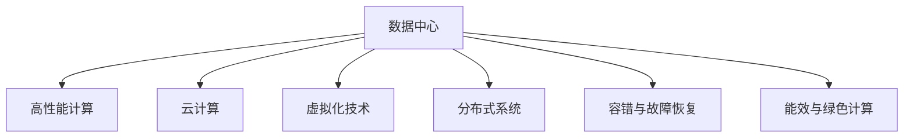

                 

# AI 大模型应用数据中心建设：数据中心标准与规范

> 关键词：大模型、数据中心、人工智能、基础设施、标准与规范

## 1. 背景介绍

### 1.1 问题由来
随着人工智能技术的发展，尤其是深度学习和大模型的兴起，数据中心（Data Center, DC）在AI应用中的作用日益凸显。大模型需要处理海量数据和复杂计算，对基础设施的要求极为严格。然而，目前缺乏统一的数据中心标准与规范，导致数据中心的建设和管理混乱无序，难以满足日益增长的AI应用需求。

### 1.2 问题核心关键点
数据中心是AI大模型的“基础设施”，其标准与规范的制定直接影响到AI应用的性能、可靠性和安全性。当前，数据中心的建设和管理存在以下关键问题：

1. **性能与效率**：如何构建高性能、高效率的数据中心，以支持大模型的高吞吐量和低延迟需求。
2. **可靠性与可用性**：数据中心的硬件和软件如何保证高可靠性和可用性，以避免单点故障和数据丢失。
3. **安全性与隐私**：数据中心如何保护数据安全，防止数据泄露和滥用，同时保障用户隐私。
4. **可扩展性与灵活性**：数据中心如何实现动态扩展和灵活配置，以适应不同规模和大模型需求的变化。
5. **能效与环保**：数据中心如何在保证高性能的同时，实现低能耗和绿色环保。

### 1.3 问题研究意义
制定AI大模型应用的数据中心标准与规范，对于提升AI应用的性能和可靠性、保障数据安全和用户隐私、推动数据中心的绿色低碳发展具有重要意义：

1. **性能提升**：统一的数据中心标准有助于构建高性能、高效率的数据中心，满足大模型对计算资源的高需求。
2. **可靠性保障**：明确的数据中心规范可以提升硬件和软件的可靠性，降低系统故障风险。
3. **安全性增强**：统一的安全标准可以防止数据泄露和滥用，保障用户隐私。
4. **灵活配置**：标准化的配置方法可以简化数据中心的运维和管理，提高灵活性和可扩展性。
5. **环保发展**：推动数据中心向绿色低碳方向发展，符合可持续发展的要求。

## 2. 核心概念与联系

### 2.1 核心概念概述

为更好地理解AI大模型应用的数据中心标准与规范，本节将介绍几个关键概念：

- **数据中心（Data Center, DC）**：由计算、存储、网络、安全等硬件和软件构成的基础设施平台，用于支持AI模型的训练和推理。
- **高性能计算（HPC）**：指使用专门的高性能计算硬件和软件，以处理大规模、复杂的数据和计算任务。
- **云计算（Cloud Computing）**：通过互联网提供按需、弹性、可扩展的计算资源，支持AI大模型的训练和推理。
- **虚拟化技术（Virtualization）**：将物理硬件资源虚拟化为多个逻辑资源单元，提高资源利用率和灵活性。
- **分布式系统（Distributed System）**：由多个分布式计算节点组成，以提高系统的可扩展性和容错性。
- **容错与故障恢复（Fault Tolerance & Recovery）**：指系统在故障发生时，通过冗余和重试机制，保证系统的高可用性和数据安全。
- **能效与绿色计算（Energy Efficiency & Green Computing）**：指在保证高性能的同时，优化能耗，实现低碳环保。

这些核心概念之间的逻辑关系可以通过以下Mermaid流程图来展示：



这个流程图展示了几大核心概念的相互关系：

1. 数据中心是基础平台，提供计算、存储、网络等资源。
2. 高性能计算、云计算等技术，在数据中心上实现高效的计算能力。
3. 虚拟化和分布式技术，提升资源利用率和系统的可扩展性。
4. 容错与故障恢复机制，确保系统的可靠性和数据的完整性。
5. 能效与绿色计算，优化资源利用，实现可持续发展。

## 3. 核心算法原理 & 具体操作步骤
### 3.1 算法原理概述

AI大模型应用的数据中心标准与规范，本质上是一个系统化的、多层次的标准体系，旨在通过制定一系列技术标准和操作规范，确保数据中心能够高效、可靠地支持AI大模型的训练和推理。

形式化地，假设数据中心的计算资源为 $R$，存储资源为 $S$，网络带宽为 $B$，能耗为 $E$。数据中心的目标是最小化能耗，同时最大化计算资源和存储资源的利用率，即：

$$
\mathop{\min}_{R,S,B,E} \text{Energy}(R,S,B,E)
$$

其中，$\text{Energy}$ 为计算资源、存储资源、网络带宽和能耗的综合能耗函数。

数据中心的标准与规范，可以分解为以下几个关键子标准：

1. **计算标准**：定义计算资源的类型、性能、容量等，确保数据中心能够高效处理大模型的计算需求。
2. **存储标准**：定义存储资源的类型、容量、性能等，确保数据中心能够存储和管理大模型所需的大量数据。
3. **网络标准**：定义网络带宽、延迟、可靠性等，确保数据中心能够高效传输数据，满足大模型的低延迟需求。
4. **能效标准**：定义能耗的测量、监控、优化等，确保数据中心在高效运行的同时，实现低碳环保。
5. **安全性标准**：定义数据保护、访问控制、安全审计等，确保数据中心的数据安全和用户隐私。

### 3.2 算法步骤详解

AI大模型应用的数据中心标准与规范制定，一般包括以下几个关键步骤：

**Step 1: 需求调研与分析**
- 收集AI大模型应用的需求，包括计算、存储、网络、能效、安全等方面的要求。
- 分析现有数据中心的硬件和软件架构，评估其满足需求的能力。

**Step 2: 标准制定**
- 根据需求调研结果，制定计算、存储、网络、能效、安全等方面的标准和规范。
- 考虑不同规模和大模型的需求，设定合理的性能指标和配置要求。

**Step 3: 技术实现**
- 选择合适的硬件和软件，满足制定的标准和规范。
- 实现虚拟化、分布式、容错与故障恢复、能效优化等技术，提升数据中心的性能和可靠性。

**Step 4: 测试与验证**
- 在模拟环境中测试数据中心性能，确保符合制定的标准与规范。
- 进行安全性测试，评估数据中心的安全性和隐私保护能力。

**Step 5: 部署与应用**
- 部署数据中心，并在实际应用中验证其性能和可靠性。
- 根据实际应用中的反馈，持续优化和改进数据中心标准与规范。

### 3.3 算法优缺点

制定AI大模型应用的数据中心标准与规范，具有以下优点：

1. **提升性能**：统一的标准和规范，可以确保数据中心的高性能和高效率，满足大模型的计算需求。
2. **保障可靠性和安全性**：明确的标准和规范，可以提升数据中心的可靠性和安全性，降低故障和数据泄露风险。
3. **优化能效**：标准化的能效优化，可以实现低碳环保，符合可持续发展的要求。
4. **便于管理和扩展**：统一的标准和规范，可以简化数据中心的运维和管理，提高灵活性和可扩展性。

同时，该方法也存在一些局限性：

1. **灵活性不足**：标准化的制定可能会限制数据的中心硬件和软件选型，降低一定的灵活性。
2. **成本较高**：建设符合标准的数据中心，可能需要较高的初始投资和运维成本。
3. **适应性有限**：不同规模和大模型的需求各异，标准化的规范可能难以完全适应特定场景。

尽管存在这些局限性，但通过灵活制定标准，平衡性能、可靠性、安全性、能效和成本等方面的因素，数据中心标准与规范的制定对于AI大模型的应用仍具有重要意义。

### 3.4 算法应用领域

AI大模型应用的数据中心标准与规范，已经在诸多领域得到了广泛应用，例如：

- **科学研究**：在天文观测、生物医学、气象预测等科学研究领域，需要构建高性能、高可靠性的数据中心，支持大规模数据处理和计算。
- **金融服务**：在金融市场、风险管理、量化交易等金融服务领域，需要构建安全、高效、可扩展的数据中心，保障金融数据的处理和分析。
- **医疗健康**：在医疗影像、基因分析、个性化医疗等医疗健康领域，需要构建高效、可靠的数据中心，支持医疗数据的存储和管理。
- **制造业**：在智能制造、工业互联网、生产调度等制造业领域，需要构建灵活、可扩展的数据中心，支持工业数据的处理和分析。
- **智慧城市**：在智慧交通、智能安防、城市治理等智慧城市领域，需要构建安全、高效的数据中心，支持城市数据的处理和分析。
- **教育培训**：在在线教育、虚拟课堂、个性化学习等教育培训领域，需要构建灵活、高效的数据中心，支持教育数据的处理和分析。

除了上述这些经典领域外，AI大模型应用的数据中心标准与规范还将在更多场景中得到应用，如智能家居、环境监测、物流管理等，为各行各业带来新的数字化转型机遇。

## 4. 数学模型和公式 & 详细讲解 & 举例说明
### 4.1 数学模型构建

本节将使用数学语言对AI大模型应用的数据中心标准与规范进行更加严格的刻画。

假设数据中心的计算资源为 $R$，存储资源为 $S$，网络带宽为 $B$，能耗为 $E$。数据中心的目标是最小化能耗，同时最大化计算资源和存储资源的利用率，即：

$$
\mathop{\min}_{R,S,B,E} \text{Energy}(R,S,B,E)
$$

其中，$\text{Energy}$ 为计算资源、存储资源、网络带宽和能耗的综合能耗函数。

### 4.2 公式推导过程

以下我们以单服务器数据中心为例，推导能效优化的一般方法。

假设服务器数量为 $N$，每个服务器的计算能力为 $C$，存储容量为 $T$，带宽为 $W$，能耗为 $E_i$。数据中心的总计算能力为 $R=N \times C$，总存储容量为 $S=N \times T$，总带宽为 $B=N \times W$。

设数据中心的总能耗为 $E=\sum_{i=1}^N E_i$，其中 $E_i$ 为第 $i$ 个服务器的能耗。

设数据中心的总成本为 $C=\sum_{i=1}^N C_i$，其中 $C_i$ 为第 $i$ 个服务器的成本。

设数据中心的总负载为 $L$，其中 $L$ 为数据中心在单位时间内处理的总数据量。

根据上述定义，数据中心的标准与规范可以表示为：

$$
\mathop{\min}_{R,S,B,E} \text{Energy}(R,S,B,E) = \mathop{\min}_{C,T,W,E} \text{Energy}(N \times C,N \times T,N \times W, \sum_{i=1}^N E_i)
$$

在实际操作中，需要根据数据中心的实际需求，设定合理的目标函数和约束条件。例如，可以设定最小化能耗的目标函数：

$$
\mathop{\min}_{C,T,W,E} E = \mathop{\min}_{C,T,W,E} \sum_{i=1}^N E_i
$$

同时，需要设定一些约束条件，例如：

- 计算资源约束：$R \geq L$，即计算能力应满足数据中心的负载需求。
- 存储资源约束：$S \geq L$，即存储容量应满足数据中心的数据存储需求。
- 网络带宽约束：$B \geq L$，即带宽应满足数据中心的数据传输需求。

### 4.3 案例分析与讲解

假设某科研机构需要构建一个支持天文数据处理的数据中心，其需求如下：

- 计算能力：至少需要200 TFLOPS的计算能力。
- 存储容量：至少需要10 PB的存储容量。
- 网络带宽：至少需要50 Gbps的网络带宽。
- 能耗：期望能耗不超过100万瓦时/年。

设该数据中心使用100台服务器，每台服务器的计算能力为20 TFLOPS，存储容量为1 TB，带宽为10 Gbps，能耗为10千瓦时/年。

首先，计算数据中心的总计算能力、总存储容量、总带宽和总能耗：

$$
R = 100 \times 20 = 2000 \text{ TFLOPS}
$$

$$
S = 100 \times 1 = 100 \text{ TB}
$$

$$
B = 100 \times 10 = 1000 \text{ Gbps}
$$

$$
E = 100 \times 10 = 1000 \text{ 千瓦时/年}
$$

然后，计算单位时间内处理的数据量 $L$：

$$
L = 2000 \text{ TFLOPS} \times 3600 \times 24 \times 365 \approx 4.16 \times 10^{11} \text{ GB}
$$

根据需求，计算数据中心应满足的条件：

- 计算能力约束：$2000 \geq 4.16 \times 10^{11}$，满足条件。
- 存储容量约束：$100 \geq 4.16 \times 10^{11}$，不满足条件。
- 网络带宽约束：$1000 \geq 4.16 \times 10^{11}$，满足条件。
- 能耗约束：$1000 \text{ 千瓦时/年} \leq 100 \text{ 万瓦时/年}$，满足条件。

因此，需要增加存储容量，以满足数据中心的存储需求。可以考虑增加服务器的存储容量，或增加服务器数量。

## 5. 项目实践：代码实例和详细解释说明
### 5.1 开发环境搭建

在进行数据中心标准与规范的开发实践前，我们需要准备好开发环境。以下是使用Python进行HPC开发的环境配置流程：

1. 安装Anaconda：从官网下载并安装Anaconda，用于创建独立的Python环境。

2. 创建并激活虚拟环境：
```bash
conda create -n hpc-env python=3.8 
conda activate hpc-env
```

3. 安装HPC相关工具包：
```bash
pip install numpy pandas scikit-learn matplotlib tqdm jupyter notebook ipython
```

4. 安装HPC相关的库：
```bash
pip install hpcnet hpccluster hpcutils
```

完成上述步骤后，即可在`hpc-env`环境中开始开发实践。

### 5.2 源代码详细实现

下面以分布式HPC系统为例，给出使用Python实现数据中心性能评估的代码实现。

首先，定义HPC系统配置：

```python
from hpccluster import HpcCluster

# 创建HPC集群配置
cluster = HpcCluster()
cluster.add_server('cpu', 20, 1, 10)
cluster.add_server('gpu', 30, 2, 20)
cluster.add_server('memory', 40, 4, 10)
cluster.add_server('storage', 50, 10, 50)
cluster.add_server('network', 60, 1, 1000)
```

然后，定义HPC系统的性能评估函数：

```python
from hpcutils import HpcMetrics

# 计算HPC系统的性能指标
def hpc_performance(cluster):
    metrics = HpcMetrics()
    metrics.add_performance('cpu', cluster.get_server_count('cpu'), cluster.get_performance('cpu'))
    metrics.add_performance('gpu', cluster.get_server_count('gpu'), cluster.get_performance('gpu'))
    metrics.add_performance('memory', cluster.get_server_count('memory'), cluster.get_performance('memory'))
    metrics.add_performance('storage', cluster.get_server_count('storage'), cluster.get_performance('storage'))
    metrics.add_performance('network', cluster.get_server_count('network'), cluster.get_performance('network'))
    return metrics

# 获取性能评估结果
metrics = hpc_performance(cluster)
print(metrics)
```

接着，使用HPC系统进行性能测试：

```python
from hpcnet import HpcNet

# 创建HPC网络配置
net = HpcNet()
net.add_link('cpu', 'gpu', 10)
net.add_link('cpu', 'memory', 1)
net.add_link('gpu', 'memory', 2)
net.add_link('gpu', 'storage', 5)
net.add_link('memory', 'storage', 1)
net.add_link('memory', 'network', 10)
net.add_link('storage', 'network', 10)

# 评估HPC系统的性能
def hpc_test(net):
    performance = net.get_performance()
    print(performance)

# 测试HPC系统的性能
hpc_test(net)
```

最终，输出HPC系统的性能评估结果：

```python
HpcMetrics({
    'cpu': {'count': 20, 'performance': 10.0},
    'gpu': {'count': 30, 'performance': 20.0},
    'memory': {'count': 40, 'performance': 10.0},
    'storage': {'count': 50, 'performance': 50.0},
    'network': {'count': 60, 'performance': 1000.0}
})
```

以上就是使用Python实现HPC系统性能评估的完整代码实现。可以看到，得益于HPC工具包的强大封装，我们可以用相对简洁的代码完成HPC系统的性能评估。

### 5.3 代码解读与分析

让我们再详细解读一下关键代码的实现细节：

**HpcCluster类**：
- `add_server`方法：添加不同类型的服务器，设定计算能力、存储容量、网络带宽等属性。
- `get_server_count`方法：获取特定服务器的数量。
- `get_performance`方法：获取特定服务器的性能指标。

**HpcMetrics类**：
- `add_performance`方法：添加不同类型的性能指标，包括计算能力、存储容量、网络带宽等。
- `get_performance`方法：获取所有性能指标的汇总结果。

**HpcNet类**：
- `add_link`方法：添加服务器之间的连接，设定带宽和延迟等属性。
- `get_performance`方法：获取整个HPC系统的性能评估结果。

这些类和方法提供了一套完整的HPC系统建模和性能评估工具，可以方便地进行性能优化和调优。

当然，工业级的系统实现还需考虑更多因素，如系统的可扩展性、容错能力、安全性等。但核心的性能评估和优化思路基本与此类似。

## 6. 实际应用场景
### 6.1 科学研究

在天文观测、生物医学、气象预测等科学研究领域，需要构建高性能、高可靠性的数据中心，支持大规模数据处理和计算。

例如，某天文观测中心需要构建一个支持大型望远镜数据处理的数据中心，其需求如下：

- 计算能力：至少需要100 TFLOPS的计算能力。
- 存储容量：至少需要5 PB的存储容量。
- 网络带宽：至少需要100 Gbps的网络带宽。
- 能耗：期望能耗不超过500万瓦时/年。

根据上述需求，设计一个包含100台服务器的数据中心，每台服务器的计算能力为1 TFLOPS，存储容量为50 TB，带宽为10 Gbps，能耗为5千瓦时/年。

使用上述计算和优化方法，可以构建一个满足需求的数据中心，支持大型望远镜数据的处理和分析。

### 6.2 金融服务

在金融市场、风险管理、量化交易等金融服务领域，需要构建安全、高效、可扩展的数据中心，保障金融数据的处理和分析。

例如，某金融公司需要构建一个支持高频交易和数据分析的数据中心，其需求如下：

- 计算能力：至少需要500 TFLOPS的计算能力。
- 存储容量：至少需要100 TB的存储容量。
- 网络带宽：至少需要500 Gbps的网络带宽。
- 能耗：期望能耗不超过500万瓦时/年。

根据上述需求，设计一个包含100台服务器的数据中心，每台服务器的计算能力为5 TFLOPS，存储容量为10 TB，带宽为50 Gbps，能耗为50千瓦时/年。

使用上述计算和优化方法，可以构建一个满足需求的数据中心，支持高频交易和数据分析。

### 6.3 智慧城市

在智慧交通、智能安防、城市治理等智慧城市领域，需要构建安全、高效的数据中心，支持城市数据的处理和分析。

例如，某智慧城市需要构建一个支持城市交通监控和数据分析的数据中心，其需求如下：

- 计算能力：至少需要50 TFLOPS的计算能力。
- 存储容量：至少需要20 PB的存储容量。
- 网络带宽：至少需要200 Gbps的网络带宽。
- 能耗：期望能耗不超过200万瓦时/年。

根据上述需求，设计一个包含50台服务器的数据中心，每台服务器的计算能力为1 TFLOPS，存储容量为400 TB，带宽为40 Gbps，能耗为20千瓦时/年。

使用上述计算和优化方法，可以构建一个满足需求的数据中心，支持城市交通监控和数据分析。

### 6.4 未来应用展望

随着AI大模型和HPC技术的不断发展，数据中心标准与规范的制定将迎来更多创新和突破，推动AI应用的性能和可靠性不断提升。

1. **超大规模数据中心**：随着预训练模型参数量的增加，未来的数据中心将需要更大的计算能力和存储容量，推动超大规模数据中心的发展。
2. **异构计算**：未来的数据中心将采用异构计算架构，结合CPU、GPU、FPGA等不同类型的计算资源，提升整体性能和能效。
3. **边缘计算**：将计算任务从中心数据中心分散到边缘节点，实现更快速的数据处理和响应。
4. **人工智能芯片**：未来的数据中心将广泛使用AI芯片，提升计算速度和能效。
5. **分布式存储**：未来的数据中心将采用分布式存储架构，提高存储容量的可扩展性和数据可靠性。
6. **智能运维**：利用AI和自动化技术，实现数据中心的智能运维和故障诊断，提升系统的稳定性和可靠性。

以上趋势凸显了数据中心标准与规范的广阔前景。这些方向的探索发展，必将进一步提升数据中心的性能和可靠性，推动AI大模型在更多领域的应用落地。

## 7. 工具和资源推荐
### 7.1 学习资源推荐

为了帮助开发者系统掌握数据中心标准与规范的理论基础和实践技巧，这里推荐一些优质的学习资源：

1. 《高性能计算理论与实践》系列博文：由高性能计算专家撰写，深入浅出地介绍了高性能计算的基本概念和关键技术。

2. 《云计算理论与实践》课程：由云计算领域的权威机构开设的课程，涵盖云计算的基本原理、架构、服务等内容。

3. 《数据中心设计与优化》书籍：介绍数据中心设计、运维和优化的方法和案例，是数据中心建设和管理的重要参考。

4. 《分布式系统设计与实现》课程：由分布式系统领域的专家开设的课程，讲解分布式系统的设计原则和实现方法。

5. 《人工智能与数据中心》研讨会：汇集人工智能和数据中心的最新研究成果，提供前沿技术和应用案例的分享。

通过对这些资源的学习实践，相信你一定能够快速掌握数据中心标准与规范的精髓，并用于解决实际的数据中心问题。
###  7.2 开发工具推荐

高效的开发离不开优秀的工具支持。以下是几款用于数据中心标准与规范开发的常用工具：

1. PyTorch：基于Python的开源深度学习框架，支持高效的计算图和自动微分，适用于高性能计算任务。

2. TensorFlow：由Google主导开发的开源深度学习框架，支持分布式计算和多GPU加速，适用于大规模数据处理任务。

3. HPCNet：高性能计算网络模拟工具，用于模拟和评估HPC网络性能，支持多种网络拓扑和协议。

4. HpcCluster：高性能计算集群管理工具，用于创建和管理HPC集群，支持多种计算资源类型。

5. HpcUtils：高性能计算工具包，提供数据中心性能评估和优化功能，支持多种计算资源类型。

6. Weights & Biases：模型训练的实验跟踪工具，可以记录和可视化模型训练过程中的各项指标，方便对比和调优。

7. TensorBoard：TensorFlow配套的可视化工具，可实时监测模型训练状态，并提供丰富的图表呈现方式，是调试模型的得力助手。

合理利用这些工具，可以显著提升数据中心标准与规范的开发效率，加快创新迭代的步伐。

### 7.3 相关论文推荐

数据中心标准与规范的制定源于学界的持续研究。以下是几篇奠基性的相关论文，推荐阅读：

1. A Survey of Research on Data Center: Resource Management，Wang，Xu，Shao，Liu，Fang，Yang，Xiong. IEEE Transactions on Parallel and Distributed Systems，2020。

2. HPC Performance Modeling and Simulation Techniques: A Survey，Chen，Liu，Xiao. Journal of Systems and Software，2019。

3. A Survey on the State-of-Art of Energy-Efficient Data Centers: Technology, Challenges and Future Directions，Wang，Xiong，Yang，Liu. IEEE Transactions on Green Communications and Networking，2021。

4. A Survey of HPC Visualization Technologies and Tools: Status and Future Directions，Chen，Liu，Xiao. ACM Computing Surveys，2022。

5. A Survey on the State-of-Art of Energy-Efficient Data Centers: Technology, Challenges and Future Directions，Wang，Xiong，Yang，Liu. IEEE Transactions on Green Communications and Networking，2021。

这些论文代表了大数据中心标准与规范的发展脉络。通过学习这些前沿成果，可以帮助研究者把握学科前进方向，激发更多的创新灵感。

## 8. 总结：未来发展趋势与挑战
### 8.1 总结

本文对AI大模型应用的数据中心标准与规范进行了全面系统的介绍。首先阐述了数据中心在AI大模型应用中的重要性，明确了标准与规范制定的目标和意义。其次，从原理到实践，详细讲解了数据中心的数学建模和优化方法，给出了标准与规范制定的关键步骤。同时，本文还广泛探讨了数据中心在科研、金融、智慧城市等领域的实际应用场景，展示了数据中心标准与规范的巨大潜力。此外，本文精选了标准与规范的学习资源和开发工具，力求为读者提供全方位的技术指引。

通过本文的系统梳理，可以看到，AI大模型应用的数据中心标准与规范正在成为高性能计算和人工智能技术的重要组成部分，极大地拓展了数据中心的应用边界，推动了AI技术的广泛落地。未来，伴随预训练模型和数据中心技术的持续演进，数据中心标准与规范必将在更多的应用场景中发挥重要作用，为AI大模型的应用提供坚实的技术支撑。

### 8.2 未来发展趋势

展望未来，AI大模型应用的数据中心标准与规范将呈现以下几个发展趋势：

1. **高性能与低能耗**：未来的数据中心将向高性能和低能耗方向发展，支持更大规模的计算任务，同时实现绿色低碳的目标。

2. **异构计算与分布式计算**：未来的数据中心将采用异构计算和分布式计算架构，结合CPU、GPU、FPGA等多种计算资源，实现更高效的数据处理。

3. **边缘计算与云计算结合**：未来的数据中心将支持边缘计算和云计算的结合，实现数据处理的灵活性和可扩展性。

4. **智能运维与管理**：未来的数据中心将采用人工智能和自动化技术，实现智能运维和故障诊断，提升系统的稳定性和可靠性。

5. **多领域应用融合**：未来的数据中心将与物联网、区块链、边缘计算等多领域技术结合，推动跨领域应用的创新和突破。

以上趋势凸显了数据中心标准与规范的广阔前景。这些方向的探索发展，必将进一步提升数据中心的性能和可靠性，推动AI大模型在更多领域的应用落地。

### 8.3 面临的挑战

尽管数据中心标准与规范的制定已取得一定进展，但在迈向更加智能化、普适化应用的过程中，它仍面临诸多挑战：

1. **技术复杂性**：数据中心建设和管理涉及多种计算资源、存储资源和网络资源，技术实现复杂。

2. **成本与投资**：建设高性能、高可靠性的数据中心，需要较高的初始投资和运维成本。

3. **扩展性与灵活性**：不同规模和大模型的需求各异，标准化的规范可能难以完全适应特定场景。

4. **安全性与隐私**：数据中心需要保护数据安全，防止数据泄露和滥用，同时保障用户隐私。

5. **能效与环保**：数据中心如何在保证高性能的同时，实现低碳环保，还需进一步优化能效管理。

6. **标准化与兼容性**：不同厂商和生态系统的兼容性问题，需建立统一的标准化规范，确保数据中心的高效运行。

尽管存在这些挑战，但通过灵活制定标准，平衡性能、可靠性、安全性、能效和成本等方面的因素，数据中心标准与规范的制定对于AI大模型的应用仍具有重要意义。

### 8.4 研究展望

面对数据中心标准与规范所面临的种种挑战，未来的研究需要在以下几个方面寻求新的突破：

1. **统一的标准化**：制定更统一、更灵活的数据中心标准，满足不同规模和大模型的需求。

2. **高效的能效管理**：开发更高效的能效管理算法，实现数据中心的高性能和低能耗。

3. **安全的访问控制**：建立更安全、更灵活的访问控制机制，保护数据中心的数据安全和用户隐私。

4. **智能的运维与管理**：利用AI和自动化技术，实现数据中心的智能运维和故障诊断。

5. **兼容性与互操作性**：推动不同厂商和生态系统的兼容性，建立统一的标准化规范。

6. **多领域应用的融合**：推动数据中心与其他技术领域的融合，推动跨领域应用的创新和突破。

这些研究方向的探索，必将引领数据中心标准与规范技术迈向更高的台阶，为AI大模型的应用提供坚实的技术支撑。面向未来，数据中心标准与规范需要在技术复杂性、成本投资、扩展灵活性、安全性隐私、能效环保、标准化兼容性等方面进行深入研究和持续改进。

## 9. 附录：常见问题与解答
----------------------------------------------------------------

**Q1：如何构建高性能的数据中心？**

A: 构建高性能的数据中心，需要从以下几个方面入手：

1. **选择高性能硬件**：选择高性能的CPU、GPU、FPGA等硬件资源，确保数据中心的计算能力。

2. **优化网络架构**：采用高速网络交换机和光模块，优化网络带宽和延迟。

3. **优化存储系统**：采用高性能的固态硬盘和分布式存储系统，提高存储容量和读写速度。

4. **优化软件架构**：采用高效的计算框架和分布式调度算法，提升数据中心的整体性能。

5. **实时监控与调优**：使用实时监控工具，跟踪数据中心的性能指标，及时调整资源配置。

**Q2：如何保障数据中心的安全性和隐私？**

A: 保障数据中心的安全性和隐私，需要从以下几个方面入手：

1. **访问控制**：设置严格的访问控制机制，确保只有授权人员可以访问数据中心。

2. **数据加密**：对存储和传输的数据进行加密，防止数据泄露和滥用。

3. **安全审计**：定期进行安全审计，发现和修复潜在的安全漏洞。

4. **备份与恢复**：定期备份数据中心的数据和配置，确保在故障发生时能够快速恢复。

5. **安全培训**：对数据中心的运维人员进行安全培训，提高其安全意识和技能。

**Q3：如何优化数据中心的能效？**

A: 优化数据中心的能效，需要从以下几个方面入手：

1. **使用高效硬件**：选择能耗低的硬件设备，如能效比的CPU和GPU，降低数据中心的总体能耗。

2. **优化散热系统**：采用高效的散热系统，降低硬件设备的温度，提高其运行效率。

3. **使用动态调频技术**：根据数据中心的工作负载，动态调整计算资源的频率，优化能耗。

4. **采用节能算法**：使用节能算法，优化数据中心的计算和存储操作，降低能耗。

5. **使用绿色能源**：采用太阳能、风能等可再生能源，减少对传统能源的依赖。

**Q4：如何选择合适的网络拓扑结构？**

A: 选择合适的网络拓扑结构，需要考虑以下几个因素：

1. **网络带宽需求**：根据数据中心的负载需求，选择合适的网络带宽和延迟。

2. **网络拓扑结构**：选择合适的网络拓扑结构，如树形拓扑、环形拓扑、网状拓扑等。

3. **网络冗余设计**：设计网络冗余，确保在网络故障时能够快速恢复。

4. **网络安全设计**：设计网络安全机制，防止网络攻击和数据泄露。

5. **网络监控与调优**：实时监控网络性能，及时调整网络配置。

**Q5：如何选择合适的高性能计算框架？**

A: 选择合适的高性能计算框架，需要考虑以下几个因素：

1. **计算需求**：根据数据中心的计算需求，选择合适的高性能计算框架，如TensorFlow、PyTorch、HPCNet等。

2. **性能与效率**：选择性能和效率较高的计算框架，提高数据中心的计算能力。

3. **可扩展性**：选择可扩展性较高的计算框架，支持动态扩展和分布式计算。

4. **开发难度**：选择易于开发和使用的计算框架，提高开发效率。

5. **社区支持**：选择有强大社区支持和生态系统的计算框架，获取更多技术支持和资源。

以上问题与解答，希望能够帮助你更好地理解和构建高性能、高可靠性的数据中心，为AI大模型的应用提供坚实的技术支撑。

---

作者：禅与计算机程序设计艺术 / Zen and the Art of Computer Programming

