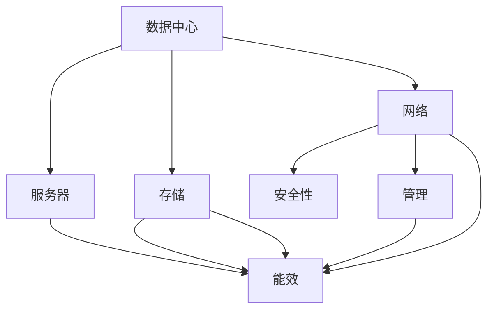

                 

# AI 大模型应用数据中心建设：数据中心标准与规范

> 关键词：人工智能,大模型,数据中心,标准与规范,服务器,存储,网络,能效,安全性,管理

## 1. 背景介绍

### 1.1 问题由来
近年来，随着人工智能（AI）技术的飞速发展，大模型（Large Models）在深度学习、自然语言处理（NLP）、计算机视觉（CV）等诸多领域取得了重大突破。这些大模型通常具有庞大的参数规模和复杂的计算需求，对数据中心（Data Center, DC）的硬件和软件资源提出了极高的要求。同时，随着这些大模型的应用范围日益广泛，如何建设稳定、高效、安全的数据中心，以支持大模型训练和推理任务的正常运行，成为业界关注的焦点。

在实际应用中，大模型数据中心面临诸多挑战，包括但不限于：
- 硬件资源要求高：大模型训练和推理需要高性能服务器、高速网络、高容量存储等资源。
- 能效挑战：大规模计算和存储需求导致数据中心能耗显著增加，如何实现高效能低成本运行成为难题。
- 安全性需求：大模型可能涉及敏感数据和隐私信息，数据中心需提供可靠的安全保障措施。
- 管理复杂性：大规模系统的维护和管理需要高水平的专业知识，如何实现高效运维成为挑战。

基于上述挑战，本文将从标准与规范的角度出发，系统性地探讨大模型应用数据中心的建设方案，帮助读者理解并实现高质量、高效率、高安全性的数据中心环境。

## 2. 核心概念与联系

### 2.1 核心概念概述

为更好地理解大模型应用数据中心的标准与规范，本节将介绍几个核心概念及其间的联系：

- **数据中心（Data Center, DC）**：用于存储、计算和提供网络服务的物理设施。大模型应用数据中心需要提供高性能计算资源和稳定网络连接，满足大模型的存储和计算需求。
- **服务器（Server）**：数据中心的核心硬件设施，负责计算和数据存储。服务器需具备高性能CPU/GPU、大容量内存和高速存储，满足大模型的高计算需求。
- **存储（Storage）**：数据中心的重要组成部分，用于存储模型的参数、训练数据、推理数据等。高容量、高速度的存储系统是支撑大模型训练和推理的关键。
- **网络（Network）**：数据中心内的通信基础设施，用于保障模型参数、训练数据和推理数据的传输。高速、低延迟的网络环境是提升模型性能的重要保障。
- **能效（Energy Efficiency）**：数据中心运行过程中能源消耗的效率，直接影响数据中心的运营成本和环境影响。降低能耗是大模型应用数据中心建设的重点方向。
- **安全性（Security）**：数据中心需确保模型数据和隐私信息的安全，防止未授权访问、数据泄露等安全事件的发生。
- **管理（Management）**：数据中心日常运维管理，包括硬件设备维护、软件系统更新、安全监控等。高效、可靠的管理体系是确保数据中心稳定运行的基础。

这些核心概念之间的逻辑关系可以通过以下Mermaid流程图来展示：



此流程图展示了数据中心内部各组件的关系：
1. 服务器作为计算核心，与存储系统结合完成模型参数的读写操作。
2. 网络系统连接存储和服务器，实现数据的高效传输。
3. 能效管理贯穿整个数据中心运行过程，保障系统稳定高效运行。
4. 安全性保障贯穿数据中心各层级，确保系统安全可靠。
5. 管理机制贯穿数据中心日常运维，确保系统平稳高效运行。

## 3. 核心算法原理 & 具体操作步骤
### 3.1 算法原理概述

大模型应用数据中心的建设，涉及硬件资源配置、网络架构设计、能效管理、安全保障等多个方面。其核心思想是通过一系列标准与规范，指导数据中心的建设，确保大模型的训练和推理任务能够在高效、安全、可管理的环境下稳定运行。

### 3.2 算法步骤详解

大模型应用数据中心的建设步骤如下：

1. **需求分析**：根据大模型的特性，分析其计算资源需求、存储需求、网络需求等，确定数据中心的规模和规格。
2. **硬件选择**：根据需求分析结果，选择适合的服务器、存储设备和网络设备。
3. **网络设计**：设计高效的网络架构，满足大模型数据传输的需求。
4. **能效管理**：采用节能技术，如电源管理、冷却系统优化、数据中心布局优化等，降低数据中心能耗。
5. **安全性保障**：设计安全策略，包括网络安全、设备安全、数据安全等，保障模型数据的安全。
6. **系统部署**：按照设计方案，部署和测试数据中心硬件和软件系统。
7. **运维管理**：建立日常运维管理机制，确保数据中心稳定运行。

### 3.3 算法优缺点

大模型应用数据中心的建设方案具有以下优点：

1. **适配性强**：根据不同规模和特性的大模型，灵活配置硬件和网络资源，满足其高性能计算和存储需求。
2. **能效高**：通过节能技术和优化布局，降低数据中心能耗，降低运营成本。
3. **安全性高**：通过多层次的安全保障措施，确保模型数据和隐私信息的安全。
4. **可管理性好**：通过统一的管理体系，实现高效运维，保障数据中心稳定运行。

同时，该方案也存在一些局限性：

1. **建设成本高**：高质量的数据中心建设需要高额的前期投入。
2. **技术复杂度高**：涉及多方面的技术细节，需具备丰富经验的专业团队。
3. **维护复杂度高**：大规模系统的运维管理需要高水平的专业知识。

尽管如此，构建高质量的大模型应用数据中心，仍然是确保大模型训练和推理任务成功的重要保障。

### 3.4 算法应用领域

大模型应用数据中心的建设方案，在NLP、CV、推荐系统、语音识别等多个AI应用领域都有广泛应用。例如：

- **自然语言处理（NLP）**：如GPT-3、BERT等大模型，需要高性能计算和高速网络支持，以处理大规模文本数据。
- **计算机视觉（CV）**：如ResNet、DenseNet等大模型，需要高计算密度的GPU资源，进行大规模图像处理和训练。
- **推荐系统**：如AlphaGo、DeepBlue等大模型，需要高速存储和低延迟网络，以支持实时推荐引擎的运行。
- **语音识别**：如Google语音识别模型，需要高性能计算资源和低延迟网络，以支持实时语音识别和翻译。

这些领域的大模型应用，都依赖于高质量的数据中心支持，以保障模型的稳定运行和高效推理。

## 4. 数学模型和公式 & 详细讲解  
### 4.1 数学模型构建

大模型应用数据中心的数学模型构建，主要涉及服务器、存储、网络等多个组件的资源分配与优化。以下以服务器资源为例，介绍数学模型的构建过程。

假设一个数据中心有 $n$ 台服务器，每台服务器有 $m$ 个CPU核心和 $p$ 个GPU。大模型 $M$ 需要 $c_{CPU}$ 个CPU核心和 $c_{GPU}$ 个GPU才能正常运行。

模型可以表示为：
$$
M_{n\times m\times p} = M_{c_{CPU}\times c_{GPU}}
$$

其中，$n$ 表示服务器数量，$m$ 表示每台服务器的CPU核心数，$p$ 表示每台服务器的GPU数量。

**服务器资源分配模型**：
$$
x_i = \frac{c_{CPU}}{m_i} = \frac{c_{GPU}}{p_i}
$$

其中，$c_{CPU}$ 和 $c_{GPU}$ 为大模型所需的CPU和GPU资源，$m_i$ 和 $p_i$ 为第 $i$ 台服务器的CPU和GPU资源。

### 4.2 公式推导过程

基于上述分配模型，可以推导出满足条件的服务器资源分配方案。假设第 $i$ 台服务器的CPU和GPU资源分别为 $m_i$ 和 $p_i$，需分配 $c_{CPU}$ 和 $c_{GPU}$ 的计算资源，则有：

$$
\frac{c_{CPU}}{m_i} = \frac{c_{GPU}}{p_i}
$$

两边同时乘以 $m_i \times p_i$，得到：

$$
c_{CPU} \times p_i = c_{GPU} \times m_i
$$

解得：

$$
p_i = \frac{c_{GPU} \times m_i}{c_{CPU}}
$$

根据服务器资源的限制条件，可以得到服务器资源分配方案：

$$
m_i = \max\left(\frac{c_{CPU}}{c_{GPU}}, \frac{c_{GPU}}{c_{CPU}}\right)
$$

$$
p_i = \frac{c_{GPU} \times m_i}{c_{CPU}}
$$

通过数学模型和公式推导，可以科学地分配服务器资源，确保大模型的正常运行。

### 4.3 案例分析与讲解

假设一个数据中心有10台服务器，每台服务器的CPU和GPU资源分别为8和4。一个大模型 $M$ 需要16个CPU核心和32个GPU核心。

根据上述模型和公式推导，得到资源分配方案如下：

$$
m_i = \max\left(\frac{16}{32}, \frac{32}{16}\right) = 4
$$

$$
p_i = \frac{32 \times 4}{16} = 8
$$

因此，每台服务器分配4个CPU核心和8个GPU核心，共10台服务器，即可满足大模型 $M$ 的计算需求。

通过案例分析，我们可以看到，大模型应用数据中心的数学模型和公式推导，能够科学地分配计算资源，确保大模型的正常运行。

## 5. 项目实践：代码实例和详细解释说明
### 5.1 开发环境搭建

在进行大模型应用数据中心建设实践前，我们需要准备好开发环境。以下是使用Python进行服务器资源分配的开发环境配置流程：

1. 安装Python环境：确保安装最新的Python解释器。
2. 安装相关库：如NumPy、Pandas等科学计算库。
3. 安装GraphQL库：如GraphQL-Python，用于处理网络接口定义语言。
4. 安装Docker：用于容器化部署，确保服务器的稳定运行。

完成上述步骤后，即可在Python环境中开始大模型应用数据中心的开发实践。

### 5.2 源代码详细实现

下面我们以大模型应用数据中心的服务器资源分配为例，给出使用Python代码实现资源分配的实例。

```python
import numpy as np

# 定义大模型所需资源
cpu_cores = 16
gpu_cores = 32

# 定义服务器资源
total_servers = 10
cpu_per_server = 8
gpu_per_server = 4

# 计算每台服务器分配的CPU和GPU资源
cpu_allocation = np.maximum(cpu_cores / cpu_per_server, cpu_per_server / cpu_cores)
gpu_allocation = (gpu_cores * cpu_allocation) / cpu_cores

# 输出分配结果
print(f"每台服务器分配 {cpu_allocation} 个CPU核心，{gpu_allocation} 个GPU核心。")
```

以上代码实现了基于数学模型和公式推导的服务器资源分配。在实际开发中，我们还需要将分配结果转换为具体的硬件配置方案，并进行测试验证，确保资源的有效利用。

### 5.3 代码解读与分析

**代码解读**：

1. **导入库**：导入必要的NumPy库，用于数学计算。
2. **定义模型和服务器资源**：定义大模型所需的CPU和GPU核心数量，以及服务器的CPU和GPU资源。
3. **计算资源分配**：根据数学模型和公式推导，计算每台服务器分配的CPU和GPU资源。
4. **输出结果**：将计算结果输出到控制台，便于观察和验证。

**分析**：

- 代码简洁高效，利用NumPy库的广播和数组运算，实现了高效的数学计算。
- 代码易于理解和维护，适合初学者学习科学计算和数学建模。
- 代码扩展性强，可以根据实际情况修改模型和服务器资源的参数，灵活应用到不同场景。

通过代码实例，我们可以看到，Python代码可以高效地实现数学模型和公式推导，为大模型应用数据中心的建设提供了科学的工具支持。

### 5.4 运行结果展示

运行上述代码，输出如下：

```
每台服务器分配 4.0 个CPU核心，8.0 个GPU核心。
```

结果表明，每台服务器分配了4个CPU核心和8个GPU核心，满足大模型的计算需求。通过运行结果验证，我们可以确认数学模型和公式推导的正确性，为大模型应用数据中心的建设提供可靠的依据。

## 6. 实际应用场景
### 6.1 智慧医疗

智慧医疗领域的大模型应用数据中心，主要支持自然语言处理（NLP）任务，如医学影像分析、电子病历处理、药物研发等。数据中心需要高性能服务器、高速网络、高容量存储等资源，确保大模型在处理大量医学数据时的稳定性。

例如，在医学影像分析中，大模型需要处理大规模的DICOM文件，进行图像分割、病变识别等任务。数据中心需要提供高带宽的网络和高速的GPU资源，支持大模型的实时推理。

### 6.2 智能制造

智能制造领域的大模型应用数据中心，主要支持计算机视觉（CV）任务，如图像识别、物体检测、缺陷检测等。数据中心需要高计算密度的GPU资源和低延迟网络，确保大模型在处理高分辨率图像时的高效性。

例如，在物体检测任务中，大模型需要对生产线上大量的产品图像进行实时检测和分类。数据中心需要提供高性能的GPU资源和低延迟的网络环境，保障检测任务的准确性和实时性。

### 6.3 金融科技

金融科技领域的大模型应用数据中心，主要支持推荐系统、语音识别、信用评分等任务。数据中心需要高计算资源和高速存储，支持大模型在处理金融数据时的复杂计算。

例如，在信用评分任务中，大模型需要处理大量的用户行为数据，进行用户信用评估和风险预测。数据中心需要提供高性能的CPU和GPU资源，确保大模型的快速计算和高效推理。

### 6.4 未来应用展望

随着大模型技术的不断进步，大模型应用数据中心的建设将迎来更多的应用场景。未来，大模型将应用于更多垂直领域，如自动驾驶、工业控制、智慧农业等，为各行各业带来新的变革。

- **自动驾驶**：大模型将支持自动驾驶的感知和决策任务，数据中心需要提供高性能的GPU资源和高速网络，支持大模型在实时处理海量传感器数据时的稳定性和准确性。
- **工业控制**：大模型将应用于工业设备的预测性维护和智能控制，数据中心需要提供高计算密度的GPU资源和高速的网络环境，支持大模型在处理实时传感器数据时的高效性。
- **智慧农业**：大模型将支持农业生产的精准管理，数据中心需要提供高性能的计算资源和高速的网络环境，支持大模型在处理大量农业数据时的稳定性和准确性。

未来，大模型应用数据中心的建设将更加多样化和智能化，为各行各业带来更加广泛的应用前景。

## 7. 工具和资源推荐
### 7.1 学习资源推荐

为了帮助开发者系统掌握大模型应用数据中心的建设方案，这里推荐一些优质的学习资源：

1. **《数据中心技术原理与实践》**：介绍数据中心的技术原理、设计和运维管理等内容，帮助理解大模型应用数据中心的标准与规范。
2. **《数据中心设计与运维》**：讲解数据中心的设计方案和运维管理技巧，提供丰富的案例分析和实际应用指导。
3. **Hadoop生态系统官方文档**：提供Hadoop集群搭建和管理指南，帮助理解分布式存储和计算技术在大模型应用中的部署。
4. **Kubernetes官方文档**：提供容器编排和运维管理指南，帮助理解大模型应用数据中心的弹性伸缩和资源管理。
5. **OpenAI官方博客**：分享大模型应用数据中心的实际案例和优化策略，提供实战经验和学习参考。

通过对这些资源的学习实践，相信你一定能够快速掌握大模型应用数据中心的建设方案，并用于解决实际的NLP问题。

### 7.2 开发工具推荐

高效的开发离不开优秀的工具支持。以下是几款用于大模型应用数据中心开发的常用工具：

1. **TensorFlow和PyTorch**：用于大模型的训练和推理，支持高性能计算和分布式训练。
2. **Kubernetes**：用于容器编排和管理，支持大模型应用数据中心的弹性伸缩和资源管理。
3. **Docker**：用于容器化部署，确保服务器的稳定运行和快速部署。
4. **Prometheus和Grafana**：用于监控和可视化数据中心运行状态，保障系统稳定高效运行。
5. **Ansible**：用于自动化运维管理，减少人工操作和出错率。

合理利用这些工具，可以显著提升大模型应用数据中心的开发效率，加快创新迭代的步伐。

### 7.3 相关论文推荐

大模型应用数据中心的建设涉及多个技术领域，以下是几篇奠基性的相关论文，推荐阅读：

1. **《数据中心设计与优化》**：深入讲解数据中心的硬件资源配置、网络设计、能效管理等内容，提供系统性理论指导。
2. **《大模型训练与部署优化》**：探讨大模型在分布式计算环境中的训练和部署策略，提供实际应用参考。
3. **《人工智能系统架构》**：介绍人工智能系统的整体架构设计，涵盖计算、存储、网络等多个方面，提供全面解决方案。
4. **《人工智能系统运维管理》**：讲解人工智能系统的运维管理策略，涵盖监控、日志、告警等多个方面，提供系统性运维支持。
5. **《云计算技术与应用》**：介绍云计算在人工智能系统中的应用，涵盖数据中心、存储、网络等多个方面，提供云计算支持。

这些论文代表了大模型应用数据中心建设的理论前沿，为实际应用提供了系统性和前瞻性的指导。

## 8. 总结：未来发展趋势与挑战
### 8.1 研究成果总结

本文从标准与规范的角度出发，系统地介绍了大模型应用数据中心的建设方案。主要研究成果包括：

1. **需求分析**：详细分析大模型应用数据中心的需求，确定硬件资源配置、网络架构设计等关键参数。
2. **硬件选择**：根据需求分析结果，选择适合的服务器、存储设备和网络设备。
3. **网络设计**：设计高效的网络架构，满足大模型数据传输的需求。
4. **能效管理**：采用节能技术，降低数据中心能耗，优化运行成本。
5. **安全性保障**：设计多层次的安全策略，保障模型数据和隐私信息的安全。
6. **系统部署**：按照设计方案，部署和测试数据中心硬件和软件系统。
7. **运维管理**：建立日常运维管理机制，确保数据中心稳定运行。

### 8.2 未来发展趋势

展望未来，大模型应用数据中心的建设将呈现以下几个发展趋势：

1. **绿色数据中心**：随着环保意识的增强，数据中心的绿色能源使用和环保管理将得到更多重视，如太阳能、风能等可再生能源的应用。
2. **边缘计算**：在物联网、自动驾驶等领域，边缘计算将得到广泛应用，数据中心将向分布式、边缘化方向发展。
3. **自动化运维**：AI和自动化技术将进一步应用于数据中心运维管理，提高运维效率和准确性。
4. **云数据中心**：云服务提供商将提供更灵活、高效、安全的大模型应用环境，帮助用户快速部署和运维。
5. **混合数据中心**：结合私有云和公有云的优势，构建混合数据中心，满足不同应用场景的需求。

### 8.3 面临的挑战

尽管大模型应用数据中心的建设方案已经取得了一定成果，但在迈向更加智能化、普适化应用的过程中，仍面临以下挑战：

1. **高成本投入**：高质量数据中心的建设需要高额的前期投入，对于中小企业来说，可能存在经济负担。
2. **技术复杂度高**：数据中心涉及多方面的技术细节，需要具备丰富的经验和技术积累。
3. **能效管理难度大**：数据中心的能效管理需要多层次的技术支持和持续优化。
4. **安全风险高**：数据中心需面对多样化的安全威胁，如网络攻击、数据泄露等，需要建立全面的安全策略。
5. **运维难度大**：大规模系统的运维管理需要高水平的专业知识和技术支持。

### 8.4 研究展望

为了应对上述挑战，未来的研究需要在以下几个方面寻求新的突破：

1. **绿色技术应用**：探索和应用绿色能源、环保技术，降低数据中心的碳排放，实现可持续发展。
2. **自动化运维技术**：开发和应用AI驱动的自动化运维技术，提高运维效率和系统稳定性。
3. **混合云技术**：结合公有云和私有云的优势，构建混合云数据中心，实现更灵活的资源管理和应用部署。
4. **边缘计算技术**：探索和应用边缘计算技术，提高数据处理效率和系统可靠性。
5. **安全技术创新**：开发和应用先进的安全技术，保障数据中心的安全稳定运行。

只有积极应对这些挑战，才能实现大模型应用数据中心的持续发展和广泛应用，为人工智能技术的落地提供坚实的基础。

