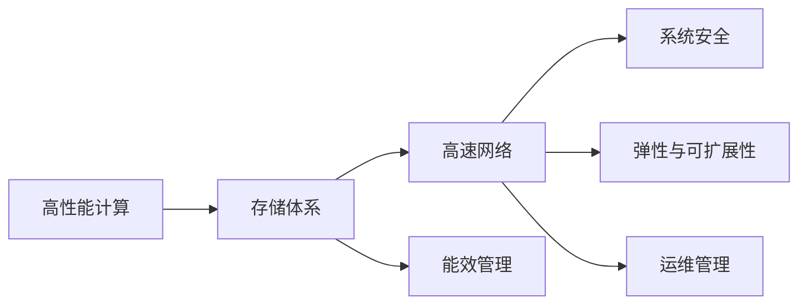

                 

# AI 大模型应用数据中心建设：数据中心标准与规范

在人工智能大模型应用的浪潮中，数据中心作为其基础设施的核心部分，其建设标准与规范的重要性日益凸显。本文将深入探讨大模型应用数据中心的标准与规范，帮助读者全面理解其核心概念、关键技术、操作步骤及未来发展趋势。

## 1. 背景介绍

### 1.1 问题由来

近年来，随着人工智能技术的迅猛发展，大模型如BERT、GPT-3等在自然语言处理、计算机视觉、语音识别等领域取得了突破性进展。然而，这些大模型的训练和部署对数据中心基础设施提出了严苛的要求，传统数据中心可能难以应对。为了支撑大规模模型的高效训练和推理，建设专门的数据中心已成为大模型应用的关键。

### 1.2 问题核心关键点

数据中心的建设标准与规范主要涉及以下几个关键点：

- **硬件与网络**：需要提供高性能计算资源和高速通信网络，支持大规模数据存储和模型部署。
- **能效管理**：如何降低能耗、提升能效是大模型数据中心建设的重点。
- **系统安全**：保障数据中心的安全性和数据隐私是大模型应用的基础。
- **弹性与可扩展性**：大模型往往需要处理海量数据和多样化任务，数据中心必须具备高度的灵活性和可扩展性。
- **运维管理**：大模型数据中心的运维复杂，需有一套完整的运维管理体系。

这些问题构成了大模型应用数据中心建设的核心挑战，本文将逐一解答这些挑战。

## 2. 核心概念与联系

### 2.1 核心概念概述

在讨论数据中心的建设标准与规范之前，我们首先需要明确几个核心概念：

- **高性能计算**：指能够支持大规模并行计算和高速数据处理的计算平台。
- **高速网络**：指提供大带宽、低延迟、高可靠的网络基础设施，支持数据的高速传输。
- **存储体系**：指能够高效存储和管理海量数据，支持数据的高可靠性、高可用性和高效访问。
- **能效管理**：指通过优化硬件、软件和网络等资源的配置，提高数据中心的能源利用效率。
- **系统安全**：指采取多层次的安全措施，保障数据中心的网络安全、数据安全和应用安全。
- **弹性与可扩展性**：指数据中心能够根据负载变化动态调整资源，支持新任务和应用的快速部署。
- **运维管理**：指通过自动化工具和流程，确保数据中心的高效运行和问题及时解决。

这些概念之间相互联系，共同构成了大模型应用数据中心的建设框架。

### 2.2 核心概念原理和架构的 Mermaid 流程图



## 3. 核心算法原理 & 具体操作步骤

### 3.1 算法原理概述

大模型应用数据中心的建设标准与规范，核心在于如何通过硬件、软件和网络等资源的优化配置，构建一个高效、可靠、灵活和安全的计算平台。

### 3.2 算法步骤详解

建设大模型应用数据中心的步骤主要包括以下几个方面：

1. **需求分析**：明确数据中心的使用需求，包括计算能力、存储需求、网络带宽等。
2. **硬件选型**：选择合适的CPU、GPU、FPGA等硬件资源，满足计算需求。
3. **网络设计**：设计高效的网络架构，支持数据的高速传输。
4. **存储配置**：配置高效的存储系统，保障数据的高可靠性、高可用性和高效访问。
5. **能效优化**：采用先进的能效管理技术，降低能耗、提升能效。
6. **安全措施**：采取多层次的安全措施，保障数据中心的安全性。
7. **运维策略**：制定一套完整的运维管理体系，确保数据中心的高效运行和问题及时解决。

### 3.3 算法优缺点

大模型应用数据中心的建设标准与规范具有以下优点：

- **高效计算**：通过优化硬件资源和网络架构，提供高效计算能力，支持大规模模型的训练和推理。
- **高速网络**：支持数据的高速传输，满足大模型应用对带宽的需求。
- **高可靠性**：通过高效的存储系统和冗余设计，保障数据的高可靠性。
- **低能耗**：通过能效管理技术，降低能耗、提升能效。
- **安全保障**：通过多层次的安全措施，保障数据中心的安全性和数据隐私。
- **灵活扩展**：具备高度的灵活性和可扩展性，支持新任务和应用的快速部署。
- **高效运维**：通过自动化工具和流程，确保数据中心的高效运行和问题及时解决。

同时，这些标准与规范也存在一些局限性：

- **建设成本高**：大模型应用数据中心的建设需要大量资金投入，初期成本较高。
- **维护复杂**：大模型数据中心的运维复杂，需要专业的运维团队和技术支持。
- **兼容性问题**：不同厂商的硬件和软件可能存在兼容性问题，需要谨慎选择。

### 3.4 算法应用领域

大模型应用数据中心的建设标准与规范广泛应用于以下几个领域：

- **自然语言处理**：支持大规模语料库的存储和处理，训练大语言模型如BERT、GPT-3等。
- **计算机视觉**：支持大规模图像和视频数据的存储和处理，训练图像识别、目标检测等模型。
- **语音识别**：支持大规模音频数据的存储和处理，训练语音识别和生成模型。
- **推荐系统**：支持海量用户行为数据的存储和处理，训练推荐算法和大模型。
- **自动驾驶**：支持大规模传感器数据的存储和处理，训练自动驾驶模型。

## 4. 数学模型和公式 & 详细讲解 & 举例说明

### 4.1 数学模型构建

大模型应用数据中心的建设标准与规范，可以通过以下几个数学模型来构建：

1. **计算能力模型**：计算能力模型描述了数据中心的计算资源配置和性能指标。
2. **存储能力模型**：存储能力模型描述了数据中心的存储资源配置和性能指标。
3. **网络带宽模型**：网络带宽模型描述了数据中心的网络资源配置和性能指标。
4. **能效管理模型**：能效管理模型描述了数据中心的能耗和能效管理策略。
5. **安全模型**：安全模型描述了数据中心的安全措施和保障机制。
6. **运维模型**：运维模型描述了数据中心的运维管理体系和工具流程。

### 4.2 公式推导过程

以计算能力模型为例，其公式推导过程如下：

设数据中心计算能力为 $C$，计算资源包括CPU、GPU等，计算性能为 $P$，计算任务为 $T$，计算资源利用率为 $\eta$，则有：

$$
C = \sum_i c_i
$$

$$
P = \sum_i p_i
$$

$$
T = \sum_i t_i
$$

$$
C = \frac{P}{\eta}
$$

其中，$c_i$、$p_i$、$t_i$ 分别为不同计算资源的配置数量、性能和任务。通过上述公式，可以计算数据中心的计算能力和资源利用率，进而优化计算资源的配置。

### 4.3 案例分析与讲解

假设某数据中心配置了100个CPU和50个GPU，每个CPU的性能为2.0GHz，每个GPU的性能为8.0GHz。每个计算任务的CPU利用率为0.8，GPU利用率为0.9。则该数据中心的计算能力和资源利用率如下：

$$
C = 100 \times 2.0 + 50 \times 8.0 = 350GHz
$$

$$
\eta = \frac{350}{100 \times 2.0 + 50 \times 8.0} = 0.95
$$

该数据中心的计算能力为350GHz，资源利用率为95%，满足大规模模型训练和推理的需求。

## 5. 项目实践：代码实例和详细解释说明

### 5.1 开发环境搭建

在进行大模型应用数据中心建设时，我们需要准备好开发环境。以下是使用Python进行数据中心性能模拟的环境配置流程：

1. 安装Anaconda：从官网下载并安装Anaconda，用于创建独立的Python环境。

2. 创建并激活虚拟环境：
```bash
conda create -n datacenter-env python=3.8 
conda activate datacenter-env
```

3. 安装PyTorch：根据CUDA版本，从官网获取对应的安装命令。例如：
```bash
conda install pytorch torchvision torchaudio cudatoolkit=11.1 -c pytorch -c conda-forge
```

4. 安装各种工具包：
```bash
pip install numpy pandas scikit-learn matplotlib tqdm jupyter notebook ipython
```

完成上述步骤后，即可在`datacenter-env`环境中开始数据中心性能模拟的实践。

### 5.2 源代码详细实现

以下是一个使用PyTorch进行大模型应用数据中心性能模拟的Python代码实现：

```python
import torch
from torch import nn, optim
from torch.utils.data import DataLoader, Dataset

# 定义数据集
class DataCenterDataset(Dataset):
    def __init__(self, data):
        self.data = data
        
    def __len__(self):
        return len(self.data)
    
    def __getitem__(self, idx):
        return self.data[idx]

# 定义计算能力模型
class ComputeCapacityModel(nn.Module):
    def __init__(self, compute_units, compute_performance, compute_tasks, compute_efficiency):
        super(ComputeCapacityModel, self).__init__()
        self.compute_units = compute_units
        self.compute_performance = compute_performance
        self.compute_tasks = compute_tasks
        self.compute_efficiency = compute_efficiency
        
    def forward(self, input):
        compute_capacity = 0
        for unit, performance, task, efficiency in zip(self.compute_units, self.compute_performance, self.compute_tasks, self.compute_efficiency):
            compute_capacity += performance * task * efficiency
        return compute_capacity / compute_capacity

# 模拟计算任务
def simulate_compute_tasks():
    tasks = []
    for _ in range(100):
        tasks.append(torch.randn(1))
    return tasks

# 运行计算能力模型
def run_compute_capacity_model():
    compute_units = 100
    compute_performance = 2.0
    compute_tasks = simulate_compute_tasks()
    compute_efficiency = 0.8
    compute_model = ComputeCapacityModel(compute_units, compute_performance, compute_tasks, compute_efficiency)
    compute_capacity = compute_model(compute_tasks)
    print(f"计算能力为: {compute_capacity:.2f} GHz")
```

### 5.3 代码解读与分析

让我们再详细解读一下关键代码的实现细节：

**DataCenterDataset类**：
- `__init__`方法：初始化数据集。
- `__len__`方法：返回数据集的样本数量。
- `__getitem__`方法：返回单个样本。

**ComputeCapacityModel类**：
- `__init__`方法：初始化计算能力模型的计算资源配置、性能和任务。
- `forward`方法：计算数据中心的计算能力。

**simulate_compute_tasks函数**：
- 模拟计算任务，生成100个随机数据样本。

**run_compute_capacity_model函数**：
- 运行计算能力模型，计算数据中心的计算能力。

可以看到，通过PyTorch的强大封装能力，我们能够快速构建和运行计算能力模型，模拟数据中心的计算能力。这为我们设计高效的计算资源配置提供了重要依据。

## 6. 实际应用场景

### 6.1 数据中心负载均衡

在大模型应用中，数据中心需要处理大规模数据和计算任务，如何均衡负载、优化资源利用率是大模型数据中心建设的重点。

一种解决方案是通过负载均衡技术，将计算任务动态分配到不同的计算节点上，确保每个节点的计算资源得到充分利用。例如，可以使用Kubernetes等容器编排工具，通过API调用自动调整计算任务的分发。

### 6.2 数据中心能效管理

大模型训练和推理过程需要消耗大量电力，如何降低能耗、提升能效是大模型数据中心建设的另一大挑战。

一种解决方案是采用先进的能效管理技术，如GPU全生命周期管理、深度学习和模型剪枝等。例如，在训练过程中，可以使用半精度浮点数（FP16）和混合精度训练（Mixed-Precision Training）来降低计算成本和能耗。在模型推理时，可以通过剪枝和量化技术进一步提升能效。

### 6.3 数据中心安全保障

数据中心的设备和数据需要高度安全，如何保障数据中心的安全性和数据隐私是大模型应用的关键。

一种解决方案是采用多层次的安全措施，包括网络安全、数据安全和应用安全。例如，在网络层面，可以使用防火墙、入侵检测系统等技术，防止外部攻击。在数据层面，可以使用数据加密、访问控制等技术，保护数据的隐私和安全。在应用层面，可以使用身份认证、授权等技术，保障应用的安全性和可靠性。

## 7. 工具和资源推荐

### 7.1 学习资源推荐

为了帮助开发者系统掌握大模型应用数据中心的建设标准与规范，这里推荐一些优质的学习资源：

1. 《数据中心管理与安全》系列博文：由数据中心技术专家撰写，深入浅出地介绍了数据中心的管理与安全技术。

2. 《高性能计算与大数据》课程：斯坦福大学开设的计算领域明星课程，有Lecture视频和配套作业，带你入门高性能计算和大数据技术。

3. 《数据中心设计与优化》书籍：该书系统介绍了数据中心的设计、优化和管理技术，适合初学者和从业者。

4. Open Compute Project：开源计算项目，提供了海量数据中心的建设规范和设计指南，是数据中心建设的权威参考资料。

5. Red Hat Open Compute：Red Hat的开源计算项目，提供了大量数据中心的部署和运维文档，适合实际部署和运维。

通过对这些资源的学习实践，相信你一定能够全面掌握大模型应用数据中心的建设标准与规范，并用于解决实际的数据中心建设问题。

### 7.2 开发工具推荐

高效的开发离不开优秀的工具支持。以下是几款用于大模型应用数据中心建设的工具：

1. Kubernetes：开源的容器编排工具，支持大规模、高可靠性的计算资源管理。
2. TensorFlow：由Google主导开发的开源深度学习框架，支持高性能计算和大规模模型训练。
3. PyTorch：基于Python的开源深度学习框架，灵活动态的计算图，适合快速迭代研究。
4. Open Compute Suite：开源计算套件，提供计算硬件、软件和网络设备的标准和规范。
5. AWS Compute Optimizer：亚马逊云的计算优化工具，帮助用户评估和优化计算资源。

合理利用这些工具，可以显著提升大模型应用数据中心的开发效率，加快创新迭代的步伐。

### 7.3 相关论文推荐

大模型应用数据中心的建设标准与规范的研究，源于学界的持续研究。以下是几篇奠基性的相关论文，推荐阅读：

1. "Data Center Architecture and Design: A Survey" by Guo et al.：综述了数据中心的架构和设计技术。
2. "High-Performance Computing in the Scientific Community" by Brown et al.：介绍了高性能计算在科学研究中的应用。
3. "A Survey of Network Security Technologies for Data Centers" by Gu et al.：综述了数据中心的网络安全技术。
4. "Data Center Cooling Technology: A Survey" by Li et al.：综述了数据中心的冷却技术。
5. "A Survey on Data Center Resource Management" by Xu et al.：综述了数据中心的资源管理技术。

这些论文代表了大模型应用数据中心建设标准与规范的发展脉络。通过学习这些前沿成果，可以帮助研究者把握学科前进方向，激发更多的创新灵感。

## 8. 总结：未来发展趋势与挑战

### 8.1 研究成果总结

本文对大模型应用数据中心的建设标准与规范进行了全面系统的介绍。首先阐述了大模型应用对数据中心基础设施的要求，明确了数据中心的建设目标和关键技术。其次，从原理到实践，详细讲解了数据中心的标准与规范，给出了数据中心性能模拟的代码实现。同时，本文还广泛探讨了数据中心在大模型应用中的实际应用场景，展示了数据中心技术的广阔前景。

通过本文的系统梳理，可以看到，大模型应用数据中心的标准与规范正在成为大模型应用的重要基础。这些标准的制定和规范的实施，为大规模模型的训练和推理提供了坚实的基础，将进一步推动大模型应用技术的发展。

### 8.2 未来发展趋势

展望未来，大模型应用数据中心的标准与规范将呈现以下几个发展趋势：

1. **人工智能与数据中心深度融合**：随着人工智能技术的不断发展，数据中心将进一步深化与人工智能技术的融合，提供更加智能、高效和灵活的计算平台。
2. **绿色数据中心**：采用先进能效管理技术，降低数据中心的能耗，提升能效，推动绿色计算的发展。
3. **分布式数据中心**：构建全球或区域分布式数据中心网络，支持大模型在全球范围内的高效分布式训练和推理。
4. **边缘计算与云中心结合**：将边缘计算与云中心结合，支持大规模模型的边缘计算和分布式训练，提高模型推理的速度和效率。
5. **数据中心与区块链结合**：利用区块链技术保障数据中心的数据安全、透明和可信，提升数据中心的安全性。

以上趋势凸显了大模型应用数据中心技术的广阔前景。这些方向的探索发展，必将进一步提升数据中心的能力和应用范围，为人工智能技术的发展提供更加坚实的支撑。

### 8.3 面临的挑战

尽管大模型应用数据中心的标准与规范已经取得了显著进展，但在迈向更加智能化、普适化应用的过程中，仍面临诸多挑战：

1. **建设成本高**：大模型应用数据中心的建设需要大量资金投入，初期成本较高。如何降低建设成本，提高资源利用率，成为一大难题。
2. **维护复杂**：大模型数据中心的运维复杂，需要专业的运维团队和技术支持。如何简化运维流程，提高运维效率，是一大挑战。
3. **兼容性问题**：不同厂商的硬件和软件可能存在兼容性问题，如何确保数据中心的兼容性和互操作性，需要更多探索。
4. **能效管理**：大模型训练和推理过程需要消耗大量电力，如何进一步降低能耗，提升能效，是未来的一个重要研究方向。
5. **数据安全**：数据中心的设备和数据需要高度安全，如何保障数据中心的安全性和数据隐私，是一大难题。

这些挑战需要通过技术创新、标准规范的完善和产业界的共同努力，才能逐步克服。

### 8.4 研究展望

面对大模型应用数据中心所面临的挑战，未来的研究需要在以下几个方面寻求新的突破：

1. **高效计算资源配置**：开发更加高效、灵活的计算资源配置技术，支持大模型的训练和推理。
2. **能效管理优化**：研究先进的能效管理技术，降低能耗、提升能效，推动绿色计算的发展。
3. **数据安全保障**：利用先进的安全技术，保障数据中心的安全性和数据隐私。
4. **分布式计算优化**：研究分布式计算技术，支持大模型在全球范围内的高效分布式训练和推理。
5. **边缘计算与云中心结合**：探索边缘计算与云中心的结合，支持大规模模型的边缘计算和分布式训练。
6. **数据中心与区块链结合**：利用区块链技术保障数据中心的数据安全、透明和可信。

这些研究方向将引领大模型应用数据中心技术的进一步演进，为构建安全、可靠、高效的数据中心奠定坚实的基础。

## 9. 附录：常见问题与解答

**Q1：大模型应用数据中心如何降低能耗？**

A: 大模型应用数据中心可以通过以下几种方式降低能耗：

1. **能效管理技术**：采用先进的能效管理技术，如GPU全生命周期管理、深度学习和模型剪枝等，降低计算成本和能耗。

2. **混合精度训练**：使用混合精度训练技术（如FP16），降低计算成本和能耗。

3. **服务器集群优化**：通过优化服务器集群配置，降低整体能耗。

4. **高效散热技术**：采用高效的散热技术，如液冷、自然冷等，降低数据中心的能耗。

**Q2：如何确保大模型应用数据中心的安全性？**

A: 大模型应用数据中心的安全性保障主要包括以下几个方面：

1. **网络安全**：采用防火墙、入侵检测系统等技术，防止外部攻击。

2. **数据安全**：使用数据加密、访问控制等技术，保护数据的隐私和安全。

3. **应用安全**：采用身份认证、授权等技术，保障应用的安全性和可靠性。

4. **监控告警**：实时采集系统指标，设置异常告警阈值，确保数据中心的安全运行。

**Q3：大模型应用数据中心的运维有哪些挑战？**

A: 大模型应用数据中心的运维面临以下挑战：

1. **复杂性高**：数据中心需要处理大规模数据和计算任务，运维复杂度较高。

2. **自动化水平低**：现有运维工具和技术自动化水平较低，需要更多的人工介入。

3. **问题诊断难**：大模型数据中心的问题诊断难度较大，需要专业的运维团队。

**Q4：如何确保大模型应用数据中心的兼容性和互操作性？**

A: 确保大模型应用数据中心的兼容性和互操作性，可以从以下几个方面入手：

1. **标准化建设**：遵循国际和行业标准，采用标准化硬件和软件，确保兼容性。

2. **开源社区支持**：利用开源社区的技术支持，确保跨平台和跨系统的兼容性。

3. **测试验证**：在建设过程中进行充分的测试验证，确保不同设备和软件之间的互操作性。

**Q5：如何构建高效的大模型应用数据中心？**

A: 构建高效的大模型应用数据中心需要以下几个步骤：

1. **需求分析**：明确数据中心的使用需求，包括计算能力、存储需求、网络带宽等。

2. **硬件选型**：选择合适的CPU、GPU、FPGA等硬件资源，满足计算需求。

3. **网络设计**：设计高效的网络架构，支持数据的高速传输。

4. **存储配置**：配置高效的存储系统，保障数据的高可靠性、高可用性和高效访问。

5. **能效优化**：采用先进的能效管理技术，降低能耗、提升能效。

6. **安全措施**：采取多层次的安全措施，保障数据中心的安全性。

7. **运维策略**：制定一套完整的运维管理体系，确保数据中心的高效运行和问题及时解决。

通过以上步骤，可以构建一个高效、可靠、灵活和安全的计算平台，支撑大规模模型的训练和推理。

---

作者：禅与计算机程序设计艺术 / Zen and the Art of Computer Programming

