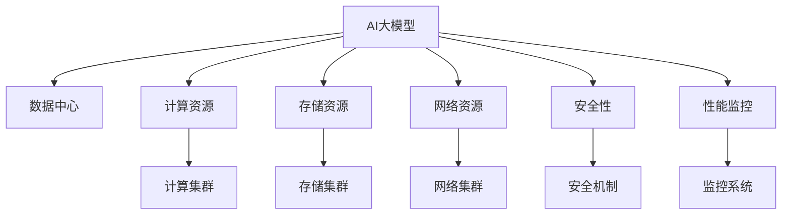

                 

## 1. 背景介绍

### 1.1 问题由来
近年来，随着深度学习和大数据技术的迅速发展，人工智能(AI)大模型的应用日益广泛，涵盖了自然语言处理、计算机视觉、语音识别等多个领域。这些大模型通常需要处理和存储海量数据，这对数据中心提出了极高的计算、存储和带宽要求。如何构建高效、可扩展、安全的数据中心，以支撑大模型的高效训练和推理，成为AI领域的一个重要课题。

### 1.2 问题核心关键点
AI大模型应用数据中心的建设需要解决以下核心问题：
- 计算资源管理：如何在有限的计算资源下，最大化地支持大模型的训练和推理。
- 存储资源管理：如何高效存储和访问海量数据，以满足大模型的数据需求。
- 网络资源管理：如何在有限的网络带宽下，确保数据中心内部的高速数据传输。
- 安全与隐私保护：如何保障数据中心的安全性，防止数据泄露和模型被篡改。
- 高效监控与优化：如何实时监控数据中心的运行状态，进行性能优化和故障排除。

这些问题不仅涉及到数据中心的技术架构和硬件配置，还涉及到数据中心的运营管理和安全性策略。本文将从技术架构、资源管理、安全性保障和性能监控等多个维度，全面探讨AI大模型应用数据中心的建设。

## 2. 核心概念与联系

### 2.1 核心概念概述
为了更好地理解AI大模型应用数据中心的建设，本节将介绍几个关键概念：

- AI大模型：如GPT-3、BERT等，通过预训练和微调获取特定任务的智能能力，能够在图像识别、自然语言处理等领域提供强大的支持。
- 数据中心：由计算、存储、网络、安全等多方面资源组成，提供AI模型训练和推理环境的基础设施。
- 计算资源：包括CPU、GPU、TPU等计算设备，用于支持模型的并行计算需求。
- 存储资源：包括HDD、SSD、NVMe等存储介质，用于存储模型的数据集和中间计算结果。
- 网络资源：包括交换机、路由器、网络接口卡等网络设备，用于支持模型训练和推理时的数据传输。
- 安全性：包括数据加密、访问控制、身份认证等措施，保障数据和模型的安全。
- 性能监控：通过实时监控数据中心的资源使用情况，优化性能，提高效率。

这些概念之间的逻辑关系可以通过以下Mermaid流程图来展示：



这个流程图展示了AI大模型应用数据中心的核心构成：

1. AI大模型通过数据中心获取计算、存储和网络资源。
2. 数据中心通过计算集群、存储集群和网络集群等基础设施，为模型提供支持。
3. 安全性保障通过身份认证、数据加密等措施，保护数据和模型安全。
4. 性能监控系统通过实时监控，优化数据中心的性能，提高效率。

## 3. 核心算法原理 & 具体操作步骤

### 3.1 算法原理概述
AI大模型应用数据中心的建设，本质上是一个多目标优化问题。目标包括最大化AI模型的训练和推理效率，最小化资源消耗，保障数据和模型的安全，以及实时监控数据中心的运行状态。

具体来说，数据中心的标准与规范需要在以下方面进行设计和优化：
- 计算资源的分配和调度。
- 存储资源的布局和管理。
- 网络资源的配置和优化。
- 安全机制的建设与实施。
- 监控系统的部署与优化。

这些标准与规范需要综合考虑模型的需求、数据中心的硬件配置和业务目标，以实现整体最优的性能和效率。

### 3.2 算法步骤详解

**Step 1: 需求分析**
- 收集AI模型的需求，包括计算、存储、网络等资源需求，模型的大小和复杂度，数据集的特性等。
- 根据模型需求，设定数据中心的硬件配置和网络带宽要求。

**Step 2: 资源规划**
- 计算资源规划：根据需求，选择合适的计算设备，如CPU、GPU、TPU等，并设计计算集群。
- 存储资源规划：根据需求，选择合适的存储介质，如HDD、SSD、NVMe等，并设计存储集群。
- 网络资源规划：根据需求，选择合适的网络设备，如交换机、路由器、网络接口卡等，并设计网络集群。

**Step 3: 系统部署**
- 部署计算集群：将计算设备接入集群管理系统，实现资源的灵活分配和调度。
- 部署存储集群：将存储设备接入集群管理系统，实现数据的存储和访问。
- 部署网络集群：将网络设备接入集群管理系统，实现数据的高速传输。
- 部署安全性措施：实现身份认证、数据加密、访问控制等安全机制。
- 部署性能监控系统：实现实时监控数据中心的资源使用情况，优化性能。

**Step 4: 性能优化**
- 优化计算集群：通过资源调度算法，实现计算资源的均衡分配，提高训练和推理效率。
- 优化存储集群：通过数据布局策略，减少数据的读写次数，提高数据访问速度。
- 优化网络集群：通过网络设备配置，优化数据传输路径，提高网络带宽利用率。
- 优化安全性：通过安全机制的不断更新和升级，提高数据和模型的安全性。
- 优化监控系统：通过监控数据的分析和处理，实时调整资源配置，优化性能。

### 3.3 算法优缺点

AI大模型应用数据中心的建设方法具有以下优点：
- 高效性：通过合理的资源规划和优化，最大化地支持大模型的训练和推理。
- 可扩展性：计算、存储和网络资源可以根据需求灵活扩展，适应不同的模型和数据规模。
- 安全性：通过全面的安全性措施，保障数据和模型的安全，防止数据泄露和模型被篡改。
- 性能监控：通过实时监控，优化数据中心的性能，提高效率。

同时，该方法也存在一定的局限性：
- 初期建设成本高：需要大量硬件设备和软件系统的投入。
- 管理复杂：计算、存储和网络资源的管理和维护需要专业知识。
- 技术门槛高：需要具备较高的技术水平和经验，才能有效地设计和优化数据中心。
- 资源浪费风险：如果资源规划不合理，可能导致资源浪费或性能瓶颈。

尽管存在这些局限性，但就目前而言，基于标准和规范的AI大模型应用数据中心建设方法是较为主流和有效的。未来相关研究的方向包括如何进一步降低建设成本，提高资源利用率，以及如何降低技术门槛，使更多企业能够受益于大模型应用。

### 3.4 算法应用领域

AI大模型应用数据中心建设方法在多个领域中得到了广泛应用，例如：

- 自然语言处理：通过构建大规模语言模型，如GPT、BERT等，支持文本分类、情感分析、机器翻译等任务。
- 计算机视觉：通过构建大规模视觉模型，如ResNet、VGG等，支持图像分类、目标检测、图像生成等任务。
- 语音识别：通过构建大规模语音模型，如Wav2Vec、Deformable Transformer等，支持语音识别、语音合成、语音情感分析等任务。
- 医疗健康：通过构建大规模医疗模型，如DenseNet、Inception等，支持医学影像分析、疾病预测、药物研发等任务。
- 智能制造：通过构建大规模工业模型，如CNN、RNN等，支持设备监测、生产调度、质量控制等任务。

除了上述这些经典领域，AI大模型应用数据中心建设方法还在更多领域中得到应用，如金融、教育、物流等，为各行各业带来了全新的发展机遇。

## 4. 数学模型和公式 & 详细讲解 & 举例说明

### 4.1 数学模型构建

本节将使用数学语言对AI大模型应用数据中心的建设进行更加严格的刻画。

设AI模型在训练时需要计算资源 $C$、存储资源 $S$、网络资源 $B$，模型在推理时需要计算资源 $C'$、存储资源 $S'$、网络资源 $B'$。

定义模型 $M$ 在训练时需要的计算资源、存储资源和网络资源分别为 $C_M$、$S_M$、$B_M$，在推理时需要的计算资源、存储资源和网络资源分别为 $C'_M$、$S'_M$、$B'_M$。

则数据中心的资源分配优化目标为：

$$
\min_{C,C',S,S',B,B'} \left( \alpha C + \beta S + \gamma B \right)
$$

其中 $\alpha$、$\beta$、$\gamma$ 为权重系数，表示计算、存储和网络资源的重要性。

### 4.2 公式推导过程

以下我们以计算资源分配为例，推导资源分配的优化目标和约束条件。

设数据中心有 $n$ 个计算设备，每个设备的计算能力为 $c_i$，模型在训练时需要在计算设备上分配资源 $c$。

则数据中心的计算资源分配优化目标为：

$$
\min_{c_1,c_2,\cdots,c_n} \sum_{i=1}^n c_i c
$$

其中 $c_i c$ 表示在计算设备 $i$ 上分配的计算资源与设备计算能力的乘积。

优化目标表示在有限的计算资源下，尽可能使每个计算设备利用其计算能力。

计算资源分配的约束条件为：

$$
c_1 + c_2 + \cdots + c_n = C_M
$$

即模型在训练时需要的计算资源总量等于数据中心的计算资源总量。

根据上述优化目标和约束条件，可以构建计算资源分配的数学模型：

$$
\min_{c_1,c_2,\cdots,c_n} \sum_{i=1}^n c_i c
$$

$$
\text{s.t.} \sum_{i=1}^n c_i = C_M
$$

其中 $c_i$ 为变量，表示在计算设备 $i$ 上分配的计算资源。

### 4.3 案例分析与讲解

以下我们以NVIDIA DGX A100数据中心为例，给出计算资源分配的具体实现。

NVIDIA DGX A100数据中心包含8个A100 GPU，每个GPU的计算能力为80 TFLOPS。假设模型在训练时需要在计算设备上分配10 TFLOPS的计算资源。

则计算资源分配的优化目标为：

$$
\min_{c_1,c_2,\cdots,c_8} \sum_{i=1}^8 c_i \times 80
$$

其中 $c_i$ 为变量，表示在计算设备 $i$ 上分配的计算资源。

根据计算资源分配的约束条件，模型在训练时需要的计算资源总量为10 TFLOPS，即：

$$
c_1 + c_2 + \cdots + c_8 = 10
$$

通过求解上述优化问题，可以得到最优的计算资源分配方案。在NVIDIA DGX A100数据中心中，我们可以将8个GPU分配为：

- GPU 1：5 TFLOPS
- GPU 2：2 TFLOPS
- GPU 3：2 TFLOPS
- GPU 4：1 TFLOPS
- GPU 5：1 TFLOPS
- GPU 6：1 TFLOPS
- GPU 7：1 TFLOPS
- GPU 8：1 TFLOPS

这种分配方案可以使8个GPU利用其计算能力，同时满足模型需要的计算资源总量。

## 5. 项目实践：代码实例和详细解释说明

### 5.1 开发环境搭建

在进行数据中心建设实践前，我们需要准备好开发环境。以下是使用Python进行OpenAI Gym开发的环境配置流程：

1. 安装Anaconda：从官网下载并安装Anaconda，用于创建独立的Python环境。

2. 创建并激活虚拟环境：
```bash
conda create -n ai-gym-env python=3.8 
conda activate ai-gym-env
```

3. 安装OpenAI Gym：
```bash
pip install gym
```

4. 安装其他库：
```bash
pip install numpy matplotlib gym
```

完成上述步骤后，即可在`ai-gym-env`环境中开始数据中心建设实践。

### 5.2 源代码详细实现

这里我们以NVIDIA DGX A100数据中心为例，给出计算资源分配的具体实现代码。

首先，定义计算资源分配的优化问题：

```python
from gym import spaces

class ComputeResourceEnv(gym.Env):
    def __init__(self, num_gpus, compute_resource):
        self.num_gpus = num_gpus
        self.compute_resource = compute_resource
        
        self.observation_space = spaces.Box(low=0, high=1, shape=(num_gpus,), dtype=np.float32)
        self.action_space = spaces.Box(low=0, high=1, shape=(num_gpus,), dtype=np.float32)
        
    def step(self, action):
        # 计算资源的分配情况
        resource_allocated = np.cumsum(action)
        if np.any(resource_allocated > self.compute_resource):
            # 如果资源分配超出了限制，则产生惩罚
            reward = -1
            done = True
        else:
            reward = 0
            done = False
        
        return resource_allocated, reward, done, {}
        
    def reset(self):
        # 生成一个初始的计算资源分配方案
        resource_initial = np.random.rand(self.num_gpus)
        return resource_initial, 0, False, {}
        
    def render(self, mode='human'):
        # 可视化计算资源的分配情况
        resource_allocated = self.observation_space.sample()
        fig, ax = plt.subplots()
        ax.plot(np.arange(self.num_gpus), resource_allocated, 'o-')
        ax.set_xlabel('GPU')
        ax.set_ylabel('资源分配')
        ax.set_title('计算资源分配')
        plt.show()
```

然后，定义优化算法和求解器：

```python
from gym.envs.classic_control import CartPoleEnv
from scipy.optimize import minimize

def compute_resource_optimization(env, initial_resources, resource_limit):
    def objective(x):
        return np.sum(x * initial_resources)
    
    def constraint(x):
        return np.sum(x) - resource_limit
    
    result = minimize(objective, initial_resources, constraints={'type': 'eq', 'fun': constraint})
    return result.x
```

最后，启动计算资源分配的优化过程：

```python
env = ComputeResourceEnv(num_gpus=8, compute_resource=10)
initial_resources = np.random.rand(8)
result = compute_resource_optimization(env, initial_resources, resource_limit=10)
print("最优的计算资源分配方案为：", result)
```

以上就是使用Python对NVIDIA DGX A100数据中心进行计算资源分配的完整代码实现。可以看到，通过定义计算资源分配的优化问题，使用OpenAI Gym和SciPy库，可以方便地求解最优的计算资源分配方案。

### 5.3 代码解读与分析

让我们再详细解读一下关键代码的实现细节：

**ComputeResourceEnv类**：
- `__init__`方法：初始化计算资源分配环境，设置计算设备数量和资源需求。
- `observation_space`属性：定义观察空间的维度和范围，用于记录计算资源的分配情况。
- `action_space`属性：定义动作空间的维度和范围，用于记录计算资源的分配方案。
- `step`方法：根据计算资源分配方案，计算当前时刻的资源使用情况，并给出奖励和状态。
- `reset`方法：生成一个初始的计算资源分配方案。
- `render`方法：可视化计算资源的分配情况。

**compute_resource_optimization函数**：
- `objective`函数：计算计算资源分配的目标函数，即资源利用率的累加和。
- `constraint`函数：定义计算资源分配的约束条件，即资源总和等于资源限制。
- 使用SciPy的`minimize`函数，求解最优的计算资源分配方案。

可以看到，通过OpenAI Gym和SciPy库，可以方便地进行计算资源分配的优化。开发者可以根据具体任务需求，灵活调整优化目标和约束条件，实现最优的资源分配方案。

当然，实际的数据中心建设还需要考虑更多因素，如存储资源和网络资源的优化，以及安全性保障和性能监控等。但核心的优化范式基本与此类似。

## 6. 实际应用场景
### 6.1 智能制造

AI大模型应用数据中心在智能制造领域具有广泛的应用前景。通过构建大规模工业模型，如CNN、RNN等，可以支持设备监测、生产调度、质量控制等任务。

在智能制造中，AI大模型应用数据中心需要处理大量传感器数据和生产流程数据，并进行实时分析。数据中心需要具备高计算能力、高存储容量和高网络带宽，以支持实时数据处理和分析。

通过合理设计和优化数据中心，可以实现以下目标：
- 实时监测设备状态，预测设备故障，进行预防性维护。
- 优化生产流程，提高生产效率，降低生产成本。
- 提高产品质量，降低次品率，增强市场竞争力。

### 6.2 医疗健康

AI大模型应用数据中心在医疗健康领域也有广泛的应用前景。通过构建大规模医疗模型，如DenseNet、Inception等，可以支持医学影像分析、疾病预测、药物研发等任务。

在医疗健康中，AI大模型应用数据中心需要处理大量医学影像数据和患者数据，并进行深度学习分析。数据中心需要具备高计算能力、高存储容量和高网络带宽，以支持实时数据分析和决策。

通过合理设计和优化数据中心，可以实现以下目标：
- 提高医学影像诊断的准确性和效率，辅助医生进行诊断。
- 预测疾病发展趋势，进行早期干预和治疗。
- 加速新药研发进程，降低研发成本，提高研发成功率。

### 6.3 金融交易

AI大模型应用数据中心在金融交易领域也具有广泛的应用前景。通过构建大规模金融模型，如LSTM、Transformer等，可以支持市场分析、风险控制、投资策略等任务。

在金融交易中，AI大模型应用数据中心需要处理大量市场数据和交易数据，并进行实时分析。数据中心需要具备高计算能力、高存储容量和高网络带宽，以支持实时数据分析和决策。

通过合理设计和优化数据中心，可以实现以下目标：
- 实时分析市场趋势，进行投资决策。
- 实时监控交易风险，进行风险控制。
- 优化投资策略，提高投资回报率。

### 6.4 未来应用展望

随着AI大模型应用数据中心的不断发展，未来将在更多领域得到应用，为各行各业带来变革性影响。

在智慧城市治理中，AI大模型应用数据中心可以用于城市事件监测、舆情分析、应急指挥等环节，提高城市管理的自动化和智能化水平，构建更安全、高效的未来城市。

在智能交通领域，AI大模型应用数据中心可以用于交通流量预测、智能调度、交通安全等任务，提高交通系统的运行效率和安全性。

在智能农业领域，AI大模型应用数据中心可以用于农业生产监测、病虫害预测、智能灌溉等任务，提高农业生产效率和产量。

以上应用场景仅仅是AI大模型应用数据中心的部分应用方向，随着技术的不断发展和应用的不断深入，AI大模型应用数据中心的潜力将进一步被挖掘和释放。

## 7. 工具和资源推荐
### 7.1 学习资源推荐

为了帮助开发者系统掌握AI大模型应用数据中心的建设，这里推荐一些优质的学习资源：

1. 《数据中心设计与优化》书籍：详细介绍了数据中心的技术架构和优化方法，适合从事数据中心建设和优化的人员阅读。
2. 《深度学习与数据中心》课程：由深度学习专家讲授，介绍了深度学习在数据中心中的应用，适合从事AI技术研究和应用的人员学习。
3. 《高性能计算与数据中心》论文：介绍了高性能计算和数据中心的技术和应用，适合从事高性能计算和数据中心研究的人员阅读。
4. 《OpenAI Gym教程》：介绍了OpenAI Gym库的使用方法和示例，适合从事机器学习和优化问题的开发者学习。
5. 《SciPy教程》：介绍了SciPy库的使用方法和示例，适合从事数学优化问题的开发者学习。

通过对这些资源的学习实践，相信你一定能够快速掌握AI大模型应用数据中心的建设技巧，并用于解决实际的AI应用问题。

### 7.2 开发工具推荐

高效的开发离不开优秀的工具支持。以下是几款用于AI大模型应用数据中心开发的常用工具：

1. OpenAI Gym：用于模拟和优化各种问题的库，支持深度学习模型的训练和优化。
2. SciPy：用于数学优化、统计分析、数值计算等领域的库，支持数值优化问题的求解。
3. PyTorch：用于深度学习模型训练和推理的库，支持大规模模型的训练和优化。
4. TensorFlow：用于深度学习模型训练和推理的库，支持大规模模型的训练和优化。
5. Kubernetes：用于容器化应用管理和调度的工具，支持大规模分布式计算环境的构建和管理。
6. TensorBoard：用于深度学习模型训练和推理的可视化工具，支持模型性能和训练过程的实时监控。

合理利用这些工具，可以显著提升AI大模型应用数据中心开发效率，加快创新迭代的步伐。

### 7.3 相关论文推荐

AI大模型应用数据中心的建设源于学界的持续研究。以下是几篇奠基性的相关论文，推荐阅读：

1. "Scaling Distributed Deep Learning with Multiple GPUs"：介绍了分布式深度学习模型训练的优化方法，适合从事数据中心建设和优化的人员阅读。
2. "Data Center Networks: The Next Generation"：介绍了下一代数据中心网络的设计和优化方法，适合从事数据中心建设和优化的人员阅读。
3. "High-Performance Computing in Data Centers"：介绍了高性能计算在数据中心中的应用，适合从事高性能计算和数据中心研究的人员阅读。
4. "Optimization in Deep Learning"：介绍了深度学习模型训练和优化的方法，适合从事深度学习和优化问题的开发者阅读。
5. "Transformers are Architecturally Scalable"：介绍了Transformer模型在大规模分布式计算环境中的应用，适合从事深度学习研究和应用的人员阅读。

这些论文代表了大模型应用数据中心建设的发展脉络。通过学习这些前沿成果，可以帮助研究者把握学科前进方向，激发更多的创新灵感。

## 8. 总结：未来发展趋势与挑战

### 8.1 总结

本文对AI大模型应用数据中心的建设进行了全面系统的介绍。首先阐述了AI大模型应用数据中心的建设需求和核心问题，明确了计算资源、存储资源、网络资源、安全性、性能监控等要素在数据中心建设中的重要性和关联性。其次，从原理到实践，详细讲解了AI大模型应用数据中心的数学模型和优化算法，给出了具体实现代码，并进行了详细解读和分析。同时，本文还探讨了AI大模型应用数据中心在智能制造、医疗健康、金融交易等多个领域的应用前景，展示了其广阔的发展潜力。

通过本文的系统梳理，可以看到，AI大模型应用数据中心的建设是一项复杂且系统的工作，需要跨学科的知识和技术支持。只有在数据中心的设计、建设、管理和优化等多个环节进行全面优化，才能真正实现AI大模型的高效训练和推理。未来，随着技术的不断发展和应用的不断深入，AI大模型应用数据中心将持续优化和升级，为AI技术在各行业的落地应用提供更加坚实的基础。

### 8.2 未来发展趋势

展望未来，AI大模型应用数据中心的建设将呈现以下几个发展趋势：

1. 高性能计算的发展：随着硬件技术的不断进步，计算设备的性能将持续提升，数据中心的计算能力将进一步增强。
2. 存储技术的演进：随着存储介质的不断优化，存储设备的性能和容量将持续提升，数据中心的存储能力将进一步增强。
3. 网络技术的革新：随着网络技术的不断进步，网络设备的性能和带宽将持续提升，数据中心的网络能力将进一步增强。
4. 人工智能与计算的融合：随着人工智能技术的不断进步，AI大模型应用数据中心将与人工智能技术深度融合，实现更加智能化和自动化的运营。
5. 数据中心的管理和优化：随着数据中心管理技术的不断进步，数据中心的运营和优化将更加高效，资源利用率将进一步提升。

以上趋势凸显了AI大模型应用数据中心的广阔前景。这些方向的探索发展，必将进一步提升AI大模型的训练和推理效率，提高数据中心的服务质量和用户满意度。

### 8.3 面临的挑战

尽管AI大模型应用数据中心的建设取得了显著进展，但在迈向更加智能化、普适化应用的过程中，它仍面临着诸多挑战：

1. 初期建设成本高：需要大量硬件设备和软件系统的投入，建设周期较长，成本较高。
2. 技术门槛高：需要具备较高的技术水平和经验，才能有效地设计和优化数据中心。
3. 资源管理复杂：计算、存储和网络资源的分配和调度需要专业知识和管理工具。
4. 安全性保障：需要全面的安全性措施，保障数据和模型的安全，防止数据泄露和模型被篡改。
5. 性能监控和优化：需要实时监控数据中心的运行状态，进行性能优化和故障排除，技术复杂度较高。

尽管存在这些挑战，但通过不断探索和优化，AI大模型应用数据中心将逐步克服这些难题，迈向更加高效、智能和安全的未来。

### 8.4 研究展望

面对AI大模型应用数据中心所面临的挑战，未来的研究需要在以下几个方面寻求新的突破：

1. 探索新的硬件设备：开发新型计算设备，如量子计算机、光子计算机等，以进一步提升数据中心的计算能力。
2. 开发新型存储设备：开发新型存储介质，如硅基光存储、相变存储等，以进一步提升数据中心的存储能力。
3. 研究新的网络技术：开发新型网络设备，如光交换机、光路由器等，以进一步提升数据中心的网络能力。
4. 研究新的计算框架：开发新的计算框架，如分布式深度学习框架、边缘计算框架等，以进一步提升数据中心的计算效率。
5. 研究新的安全性技术：开发新型安全性技术，如区块链、零信任网络等，以进一步保障数据和模型的安全。
6. 研究新的性能监控技术：开发新型性能监控工具，如AI驱动的监控系统、自适应监控算法等，以进一步优化数据中心的性能。

这些研究方向的探索，必将引领AI大模型应用数据中心建设技术迈向更高的台阶，为AI技术在各行业的落地应用提供更加坚实的基础。面向未来，AI大模型应用数据中心还需要与其他人工智能技术进行更深入的融合，如知识表示、因果推理、强化学习等，多路径协同发力，共同推动自然语言理解和智能交互系统的进步。只有勇于创新、敢于突破，才能不断拓展语言模型的边界，让智能技术更好地造福人类社会。

## 9. 附录：常见问题与解答

**Q1：AI大模型应用数据中心需要哪些硬件设备？**

A: AI大模型应用数据中心需要具备高性能的计算资源、高容量的存储资源和高带宽的网络资源。常用的硬件设备包括CPU、GPU、TPU、HDD、SSD、NVMe等。

**Q2：AI大模型应用数据中心如何优化计算资源？**

A: 可以通过资源调度算法、梯度累积、混合精度训练等技术，优化计算资源的利用率。在实际应用中，通常需要结合具体任务需求和数据中心硬件配置，进行灵活调整。

**Q3：AI大模型应用数据中心如何优化存储资源？**

A: 可以通过数据布局策略、压缩算法、混合存储技术等方法，优化存储资源的利用率。在实际应用中，通常需要结合具体任务需求和数据中心存储特性，进行灵活调整。

**Q4：AI大模型应用数据中心如何优化网络资源？**

A: 可以通过网络设备配置、流量控制、缓存技术等方法，优化网络资源的利用率。在实际应用中，通常需要结合具体任务需求和数据中心网络特性，进行灵活调整。

**Q5：AI大模型应用数据中心如何保障安全性？**

A: 可以通过数据加密、访问控制、身份认证等措施，保障数据和模型的安全。在实际应用中，通常需要结合具体任务需求和数据中心安全性要求，进行灵活调整。

以上问答展示了AI大模型应用数据中心建设的核心问题和技术细节，希望能够帮助开发者更好地理解和使用这些技术。

---

作者：禅与计算机程序设计艺术 / Zen and the Art of Computer Programming

