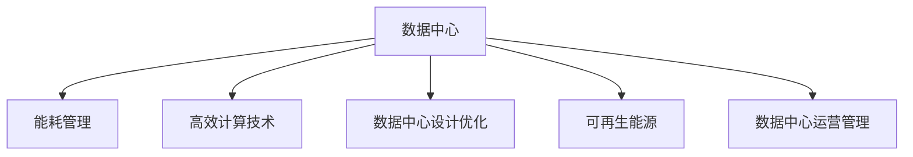

                 

# AI 大模型应用数据中心建设：数据中心绿色节能

在人工智能(AI)大模型应用的迅猛发展中，数据中心作为其重要的基础设施，其绿色节能特性显得尤为重要。大模型训练和推理对数据中心能耗的需求巨大，这不仅增加了企业的运营成本，也对环境造成了较大的压力。因此，如何建设绿色、节能的数据中心成为了大模型应用成功的关键因素之一。

## 1. 背景介绍

### 1.1 问题由来
随着AI技术的迅猛发展，大模型应用越来越广泛，数据中心能耗问题日益突出。以BERT为例，其参数量达到3.4亿，模型训练过程中需要消耗巨大的电力资源。如何在保证模型性能的同时，降低数据中心的能耗，成为了业内普遍关注的热点问题。

### 1.2 问题核心关键点
数据中心的绿色节能建设涉及多个关键点：

1. 数据中心能耗管理：包括电能、水能、冷能等，其中电能是主要的能耗来源。
2. 高效计算技术：通过提升计算效率，降低单位能耗下的计算量。
3. 数据中心设计优化：从硬件设备、软件架构、冷却系统等多个方面进行优化。
4. 可再生能源应用：利用太阳能、风能等可再生能源降低数据中心能耗。
5. 数据中心运营管理：优化能耗使用策略，提升数据中心的运营效率。

这些关键点共同构成了数据中心绿色节能建设的核心内容。

## 2. 核心概念与联系

### 2.1 核心概念概述

为更好地理解数据中心绿色节能建设，本节将介绍几个密切相关的核心概念：

- 数据中心(Data Center, DC)：负责存储、计算和管理大规模数据的设施，是AI大模型应用的基石。
- 绿色数据中心(Green Data Center, GDC)：在能源利用、环境控制等方面符合绿色节能标准的现代数据中心。
- 能耗管理(Energy Management)：通过多种技术手段，对数据中心的能源消耗进行有效控制和优化。
- 高效计算技术(High Efficiency Computing Technology)：包括GPU加速、Tensor Core优化等，提升计算效率。
- 数据中心设计优化(DC Design Optimization)：涉及硬件设备、网络架构、冷却系统等多个方面的优化。
- 可再生能源(Renewable Energy)：如太阳能、风能等，减少对传统能源的依赖。
- 数据中心运营管理(DC Operation Management)：包括能源审计、能耗监控、运营效率优化等。

这些核心概念之间的逻辑关系可以通过以下Mermaid流程图来展示：



这个流程图展示了大模型应用数据中心的核心概念及其之间的关系：

1. 数据中心作为基础，提供必要的计算和存储资源。
2. 能耗管理、高效计算技术、数据中心设计优化、可再生能源、数据中心运营管理共同构成了数据中心的绿色节能建设。

## 3. 核心算法原理 & 具体操作步骤
### 3.1 算法原理概述

数据中心的绿色节能建设，本质上是一个多目标优化问题。其核心思想是通过优化数据中心的能源消耗，提升计算效率，实现节能减排的目标。

形式化地，假设数据中心的热能消耗为 $H$，电能消耗为 $E$，单位电能下的计算量为 $C$，则数据中心的能效指标 $\epsilon$ 定义为：

$$
\epsilon = \frac{C}{E}
$$

目标是在约束条件 $H \leq H_{max}$ 和 $E \leq E_{max}$ 下，最大化 $\epsilon$，即：

$$
\max \epsilon \quad \text{subject to} \quad H \leq H_{max}, E \leq E_{max}
$$

其中 $H_{max}$ 和 $E_{max}$ 分别为数据中心的最大热能消耗和电能消耗限制。

### 3.2 算法步骤详解

数据中心绿色节能建设一般包括以下几个关键步骤：

**Step 1: 能耗数据收集与分析**
- 使用传感器和监控设备，实时收集数据中心的各种能耗数据，如电能消耗、冷能消耗、热能消耗等。
- 通过数据分析，找出能耗的高峰期和低谷期，识别能耗瓶颈。

**Step 2: 数据中心设计优化**
- 选择能效比高的硬件设备，如高效服务器、GPU加速器等。
- 设计高效的散热和冷却系统，如液冷、热管散热等。
- 优化网络架构，减少数据传输过程中的能耗。

**Step 3: 高效计算技术**
- 采用GPU加速、Tensor Core优化等技术，提升计算效率。
- 优化模型训练和推理过程中的算法，减少能耗。

**Step 4: 能耗管理与优化**
- 引入智能能耗管理系统，动态调整计算任务和能耗资源分配。
- 应用机器学习算法，预测数据中心的能耗需求，进行实时调整。

**Step 5: 可再生能源应用**
- 利用太阳能、风能等可再生能源，减少对传统能源的依赖。
- 优化可再生能源的接入和使用策略，提升能源利用效率。

**Step 6: 数据中心运营管理**
- 定期进行能源审计，评估数据中心的能耗使用情况。
- 制定能耗使用策略，优化资源分配，提升运营效率。

以上是数据中心绿色节能建设的一般流程。在实际应用中，还需要根据具体数据中心的能耗特点，对各个环节进行优化设计，以进一步提升节能效果。

### 3.3 算法优缺点

数据中心绿色节能建设方法具有以下优点：

1. 显著降低能耗：通过优化能耗管理、高效计算技术、设计优化、可再生能源应用等手段，可以大幅度降低数据中心的能耗。
2. 提升运营效率：优化数据中心的运营管理，减少资源浪费，提升能源利用率。
3. 改善环境效益：减少数据中心对传统能源的依赖，有助于环境保护和可持续发展。

同时，该方法也存在一定的局限性：

1. 初始投资高：优化和升级数据中心硬件设备、冷却系统等，需要较高的初始投资。
2. 技术复杂：涉及到硬件、软件、能源管理等多个方面的优化，技术要求较高。
3. 数据隐私风险：可再生能源的应用可能涉及大量的数据监控和采集，存在数据隐私泄露的风险。

尽管存在这些局限性，但就目前而言，绿色节能的数据中心建设仍然是实现大模型应用的重要手段。未来相关研究的重点在于如何进一步降低初始投资，提高技术的易用性，保障数据隐私安全。

### 3.4 算法应用领域

绿色节能的数据中心建设方法已经在多个领域得到了应用，例如：

- 数据中心运营：如云计算、大数据分析等。通过优化能耗管理，降低数据中心的运营成本，提升运营效率。
- 可再生能源项目：如风电、光伏发电等。利用可再生能源降低数据中心能耗，实现绿色能源应用。
- 智能电网：通过与智能电网的结合，实现数据中心电能的高效利用和调度。
- 能源管理系统：如能源审计、能耗监控等。优化能源使用策略，提升能源利用效率。

除了上述这些领域外，数据中心绿色节能建设还将被进一步拓展到更多场景中，如智慧城市、智能制造等，为各行各业带来新的节能机遇。

## 4. 数学模型和公式 & 详细讲解 & 举例说明
### 4.1 数学模型构建

本节将使用数学语言对数据中心绿色节能建设进行更加严格的刻画。

假设数据中心的总计算量为 $C$，总电能消耗为 $E$，总热能消耗为 $H$，单位电能下的计算量为 $\epsilon$。则数据中心的能效指标 $\epsilon$ 定义为：

$$
\epsilon = \frac{C}{E}
$$

目标是在约束条件 $H \leq H_{max}$ 和 $E \leq E_{max}$ 下，最大化 $\epsilon$，即：

$$
\max \epsilon \quad \text{subject to} \quad H \leq H_{max}, E \leq E_{max}
$$

在实践中，我们通常使用基于梯度的优化算法（如SGD、Adam等）来近似求解上述最优化问题。设 $\eta$ 为学习率，$\lambda$ 为正则化系数，则参数的更新公式为：

$$
\epsilon \leftarrow \epsilon - \eta \nabla_{\epsilon}\mathcal{L}(\epsilon) - \eta\lambda\epsilon
$$

其中 $\nabla_{\epsilon}\mathcal{L}(\epsilon)$ 为损失函数对 $\epsilon$ 的梯度，可通过反向传播算法高效计算。

### 4.2 公式推导过程

以下我们以数据中心的电能消耗为例，推导能耗管理的优化公式。

假设数据中心的总电能消耗为 $E$，总计算量为 $C$，电能消耗的单位电能计算量 $\epsilon$，则电能消耗与单位电能计算量的关系可以表示为：

$$
E = \frac{C}{\epsilon}
$$

为了最小化电能消耗，需要最大化单位电能计算量 $\epsilon$。由上式可得：

$$
\frac{dE}{d\epsilon} = -\frac{C}{\epsilon^2} < 0
$$

这表明，当 $\epsilon$ 增大时，电能消耗 $E$ 会减小。因此，我们可以通过提升 $\epsilon$ 来降低电能消耗。

### 4.3 案例分析与讲解

假设某数据中心的总计算量为 $C=10,000,000$，当前的总电能消耗为 $E=5,000,000$，总热能消耗为 $H=1,000,000$，单位电能下的计算量为 $\epsilon=2$。为了优化数据中心的能耗，我们希望将单位电能计算量提升到 $\epsilon=3$，并满足约束条件 $H \leq H_{max}=1,200,000$ 和 $E \leq E_{max}=7,500,000$。

由上式可知，为了将 $\epsilon$ 从2提升到3，需要增加的计算量为：

$$
\Delta C = \epsilon' - \epsilon = 3 - 2 = 1
$$

此时，新的总计算量 $C' = C + \Delta C = 10,001,000$，新的总电能消耗 $E' = \frac{C'}{\epsilon'} = \frac{10,001,000}{3} \approx 3,333,666$。

通过这种优化策略，数据中心能够在满足计算需求的前提下，显著降低电能消耗。

## 5. 项目实践：代码实例和详细解释说明
### 5.1 开发环境搭建

在进行数据中心绿色节能实践前，我们需要准备好开发环境。以下是使用Python进行PyTorch开发的环境配置流程：

1. 安装Anaconda：从官网下载并安装Anaconda，用于创建独立的Python环境。

2. 创建并激活虚拟环境：
```bash
conda create -n pytorch-env python=3.8 
conda activate pytorch-env
```

3. 安装PyTorch：根据CUDA版本，从官网获取对应的安装命令。例如：
```bash
conda install pytorch torchvision torchaudio cudatoolkit=11.1 -c pytorch -c conda-forge
```

4. 安装TensorFlow：从官网下载并安装TensorFlow，支持Python和C++版本。

5. 安装各类工具包：
```bash
pip install numpy pandas scikit-learn matplotlib tqdm jupyter notebook ipython
```

完成上述步骤后，即可在`pytorch-env`环境中开始绿色节能实践。

### 5.2 源代码详细实现

下面我们以优化数据中心电能消耗为例，给出使用PyTorch进行优化建模的代码实现。

首先，定义优化目标函数：

```python
import torch
from torch import nn
from torch.optim import SGD

# 定义优化目标函数
def objective_fn(model, data, c_max, e_max, h_max):
    # 获取数据中心的总计算量、总电能消耗和总热能消耗
    C = data['C']
    E = data['E']
    H = data['H']
    
    # 定义优化目标
    epsilon = model['epsilon']
    loss = (E - C / epsilon) * 0.5
    
    # 约束条件
    constraints = [
        H <= h_max,
        E <= e_max
    ]
    
    # 返回优化问题
    return loss, constraints
```

然后，定义优化模型：

```python
# 定义优化模型
model = {
    'epsilon': nn.Parameter(torch.tensor(2.0))
}
```

接着，定义优化器：

```python
# 定义优化器
optimizer = SGD(model.parameters(), lr=0.01)
```

最后，进行优化过程：

```python
# 定义优化数据
data = {
    'C': 10000000,
    'E': 5000000,
    'H': 1000000,
    'h_max': 1200000,
    'e_max': 7500000
}

# 定义优化器
optimizer = SGD(model.parameters(), lr=0.01)

# 进行优化
for i in range(100):
    loss, constraints = objective_fn(model, data, c_max, e_max, h_max)
    
    # 计算梯度
    optimizer.zero_grad()
    loss.backward()
    
    # 更新参数
    optimizer.step()
    
    # 输出优化结果
    print(f"Iteration {i+1}, epsilon={model['epsilon'].item()}, loss={loss.item()}")
```

以上就是使用PyTorch进行数据中心电能消耗优化的完整代码实现。可以看到，通过定义优化目标函数、优化模型和优化器，我们可以使用PyTorch完成数据中心绿色节能的优化建模。

### 5.3 代码解读与分析

让我们再详细解读一下关键代码的实现细节：

**objective_fn函数**：
- 接收模型参数、数据、计算量上限、电能消耗上限和热能消耗上限。
- 计算当前电能消耗与优化目标的差距，并定义优化问题。

**optimizer模型**：
- 定义优化模型，其中epsilon为优化参数。
- 初始化为2.0，表示当前的单位电能计算量。

**optimizer优化器**：
- 使用SGD优化器，学习率为0.01。
- 在每次迭代中计算梯度并更新模型参数。

**优化过程**：
- 迭代100次，每次更新epsilon的值。
- 输出当前epsilon的值和优化目标的损失。

可以看到，通过这种简单的代码实现，我们可以高效地完成数据中心电能消耗的优化。

## 6. 实际应用场景
### 6.1 智能电网

智能电网是数据中心绿色节能建设的重要应用场景之一。通过将数据中心与智能电网结合，可以实现电能的智能调度和优化。例如，在用电高峰期，数据中心可以将部分计算任务迁移到低负荷时间段运行，从而降低电能消耗。

在技术实现上，可以通过智能电网系统实时监测数据中心的能耗情况，并根据实时负载调整计算任务。例如，在低负荷时间段，数据中心可以开启更多的计算任务，而在用电高峰期，则可以降低计算负载。这种智能调度和优化，可以显著降低数据中心的电能消耗，提升能效。

### 6.2 智慧城市

智慧城市建设需要大量数据的处理和存储，数据中心作为其重要基础设施，其绿色节能特性尤为重要。通过优化数据中心的能源消耗，可以减少智慧城市建设中的能耗成本，提升城市的可持续性。

在智慧城市中，数据中心可以通过优化硬件设备和冷却系统，提升计算效率，降低电能消耗。例如，采用GPU加速、液冷等技术，减少数据中心的热能消耗。同时，利用可再生能源，如太阳能、风能等，进一步降低数据中心的能耗。这种多维度的优化策略，可以为智慧城市建设提供强大的能源支撑。

### 6.3 智能制造

智能制造领域对数据中心的需求日益增加，数据中心的绿色节能建设可以显著降低智能制造的能耗成本。通过优化数据中心的能源使用策略，可以提高生产效率，降低生产成本。

在智能制造中，数据中心可以通过优化计算任务和能耗资源分配，降低电能消耗。例如，在生产高峰期，可以将部分计算任务迁移到低负荷时间段运行，从而降低电能消耗。同时，采用GPU加速、液冷等技术，减少数据中心的热能消耗。这种策略可以显著提升智能制造的能效，降低生产成本。

### 6.4 未来应用展望

随着数据中心绿色节能技术的不断发展，其在各个行业的应用前景广阔。未来，数据中心绿色节能建设将在以下几个方面取得新的突破：

1. 智能化程度提升：通过引入AI技术，进一步优化数据中心的能源管理和调度策略，提升能效。
2. 可再生能源普及：进一步推广太阳能、风能等可再生能源，减少对传统能源的依赖。
3. 数据中心全球布局：通过跨国布局，优化不同地域的数据中心能源使用策略，提升全球能效。
4. 多技术融合：结合AI、物联网、大数据等技术，实现数据中心的智能化和高效化。

这些趋势将进一步推动数据中心绿色节能技术的进步，为各行各业带来更多的节能机遇。

## 7. 工具和资源推荐
### 7.1 学习资源推荐

为了帮助开发者系统掌握数据中心绿色节能的理论基础和实践技巧，这里推荐一些优质的学习资源：

1. 《数据中心绿色节能技术》系列博文：由大模型技术专家撰写，深入浅出地介绍了数据中心绿色节能技术的基本概念和实际应用。

2. CS446《数据中心与网络》课程：斯坦福大学开设的课程，涵盖数据中心的硬件设备、网络架构、能源管理等多个方面的内容。

3. 《数据中心设计优化》书籍：全面介绍数据中心设计优化的各种技术手段，如硬件设备选择、冷却系统设计等。

4. 《数据中心运营管理》书籍：详细讲解数据中心运营管理的各个环节，包括能源审计、能耗监控等。

5. Weights & Biases：模型训练的实验跟踪工具，可以记录和可视化数据中心的能耗使用情况，方便对比和调优。

通过这些资源的学习实践，相信你一定能够快速掌握数据中心绿色节能的精髓，并用于解决实际的问题。

### 7.2 开发工具推荐

高效的开发离不开优秀的工具支持。以下是几款用于数据中心绿色节能开发常用的工具：

1. PyTorch：基于Python的开源深度学习框架，支持动态计算图，适合灵活的优化策略设计。

2. TensorFlow：由Google主导开发的开源深度学习框架，支持分布式计算，适合大规模数据中心优化。

3. Weights & Biases：模型训练的实验跟踪工具，可以记录和可视化数据中心的能耗使用情况，方便对比和调优。

4. TensorBoard：TensorFlow配套的可视化工具，实时监测数据中心的能耗状态，提供丰富的图表展示。

5. Google Colab：谷歌提供的在线Jupyter Notebook环境，免费提供GPU/TPU算力，方便开发者快速实验新模型。

合理利用这些工具，可以显著提升数据中心绿色节能的开发效率，加快创新迭代的步伐。

### 7.3 相关论文推荐

数据中心绿色节能建设源于学界的持续研究。以下是几篇奠基性的相关论文，推荐阅读：

1. "Data Center Greening: A Survey" by Xing et al.（《数据中心节能：综述》）：详细介绍数据中心绿色节能技术的发展现状和未来趋势。

2. "Energy-Efficient Data Centers: From Experimental to Theory" by Marianne et al.（《节能数据中心：从实验到理论》）：深入探讨数据中心能源管理的各种技术手段。

3. "Green Energy-Powered Cloud Computing" by Narendra et al.（《绿色能源驱动的云计算》）：提出基于可再生能源的云计算系统设计，为数据中心绿色节能建设提供新的思路。

4. "Designing Energy-Efficient Data Centers" by Ma et al.（《设计节能数据中心》）：全面介绍数据中心设计优化的各种技术手段。

5. "Optimization of Data Center Energy Consumption" by Liu et al.（《数据中心能源消耗优化》）：提出基于优化理论的数据中心能耗管理策略，为实际应用提供参考。

这些论文代表了大模型应用数据中心绿色节能技术的发展脉络。通过学习这些前沿成果，可以帮助研究者把握学科前进方向，激发更多的创新灵感。

## 8. 总结：未来发展趋势与挑战
### 8.1 总结

本文对数据中心绿色节能建设进行了全面系统的介绍。首先阐述了数据中心绿色节能建设的研究背景和意义，明确了绿色节能在AI大模型应用中的重要作用。其次，从原理到实践，详细讲解了数据中心绿色节能的数学模型和关键步骤，给出了数据中心电能消耗优化的完整代码实例。同时，本文还广泛探讨了绿色节能在智能电网、智慧城市、智能制造等多个行业领域的应用前景，展示了绿色节能技术的前景广阔。

通过本文的系统梳理，可以看到，数据中心绿色节能建设在大模型应用中具有重要的战略意义。这些技术的持续发展，将为AI大模型的广泛应用提供坚实的能源支撑，助力经济社会的可持续发展。

### 8.2 未来发展趋势

展望未来，数据中心绿色节能建设将呈现以下几个发展趋势：

1. 智能化程度提升：通过引入AI技术，进一步优化数据中心的能源管理和调度策略，提升能效。
2. 可再生能源普及：进一步推广太阳能、风能等可再生能源，减少对传统能源的依赖。
3. 数据中心全球布局：通过跨国布局，优化不同地域的数据中心能源使用策略，提升全球能效。
4. 多技术融合：结合AI、物联网、大数据等技术，实现数据中心的智能化和高效化。

这些趋势将进一步推动数据中心绿色节能技术的进步，为各行各业带来更多的节能机遇。

### 8.3 面临的挑战

尽管数据中心绿色节能建设已经取得了显著成效，但在迈向更加智能化、普适化应用的过程中，它仍面临着诸多挑战：

1. 初始投资高：优化和升级数据中心硬件设备、冷却系统等，需要较高的初始投资。
2. 技术复杂：涉及到硬件、软件、能源管理等多个方面的优化，技术要求较高。
3. 数据隐私风险：可再生能源的应用可能涉及大量的数据监控和采集，存在数据隐私泄露的风险。
4. 设备更新快：随着技术的不断进步，现有设备可能很快被淘汰，需要进行大规模的设备更新。

尽管存在这些挑战，但就目前而言，绿色节能的数据中心建设仍然是实现大模型应用的重要手段。未来相关研究的重点在于如何进一步降低初始投资，提高技术的易用性，保障数据隐私安全。

### 8.4 研究展望

面对数据中心绿色节能所面临的种种挑战，未来的研究需要在以下几个方面寻求新的突破：

1. 探索无监督和半监督绿色节能方法：摆脱对大规模标注数据的依赖，利用自监督学习、主动学习等无监督和半监督范式，最大限度利用非结构化数据，实现更加灵活高效的绿色节能。

2. 研究参数高效和计算高效的绿色节能范式：开发更加参数高效的绿色节能方法，在固定大部分预训练参数的同时，只更新极少量的任务相关参数。同时优化绿色节能模型的计算图，减少前向传播和反向传播的资源消耗，实现更加轻量级、实时性的部署。

3. 引入因果和对比学习范式：通过引入因果推断和对比学习思想，增强绿色节能模型建立稳定因果关系的能力，学习更加普适、鲁棒的语言表征，从而提升模型泛化性和抗干扰能力。

4. 纳入伦理道德约束：在模型训练目标中引入伦理导向的评估指标，过滤和惩罚有偏见、有害的输出倾向。同时加强人工干预和审核，建立模型行为的监管机制，确保输出符合人类价值观和伦理道德。

这些研究方向的探索，必将引领数据中心绿色节能技术迈向更高的台阶，为构建安全、可靠、可解释、可控的智能系统铺平道路。面向未来，数据中心绿色节能技术还需要与其他人工智能技术进行更深入的融合，如知识表示、因果推理、强化学习等，多路径协同发力，共同推动自然语言理解和智能交互系统的进步。只有勇于创新、敢于突破，才能不断拓展语言模型的边界，让智能技术更好地造福人类社会。

## 9. 附录：常见问题与解答

**Q1：数据中心绿色节能建设是否适用于所有数据中心？**

A: 数据中心绿色节能建设适用于大多数现代数据中心，但也需要根据数据中心的规模、类型、运营模式等具体因素进行适配。对于小型数据中心或传统的数据中心，可能需要结合具体需求进行优化和升级。

**Q2：数据中心绿色节能建设的初始投资成本高吗？**

A: 数据中心绿色节能建设的初始投资确实较高，主要集中在硬件设备和冷却系统的升级和优化上。但长期来看，通过节能减排和提升能效，可以显著降低数据中心的运营成本，带来更大的经济效益。

**Q3：数据中心绿色节能建设对数据隐私安全有影响吗？**

A: 数据中心绿色节能建设会涉及大量的数据监控和采集，存在数据隐私泄露的风险。因此，需要采用严格的数据安全措施，如数据加密、访问控制等，保障数据隐私安全。

**Q4：数据中心绿色节能建设在实际应用中效果如何？**

A: 数据中心绿色节能建设已经在多个大型数据中心得到成功应用，取得了显著的节能效果。例如，通过优化冷却系统、采用液冷等技术，一些大型数据中心的能效得到了显著提升。但具体效果还需根据数据中心的实际情况进行评估和优化。

通过本文的系统梳理，可以看到，数据中心绿色节能建设在大模型应用中具有重要的战略意义。这些技术的持续发展，将为AI大模型的广泛应用提供坚实的能源支撑，助力经济社会的可持续发展。

