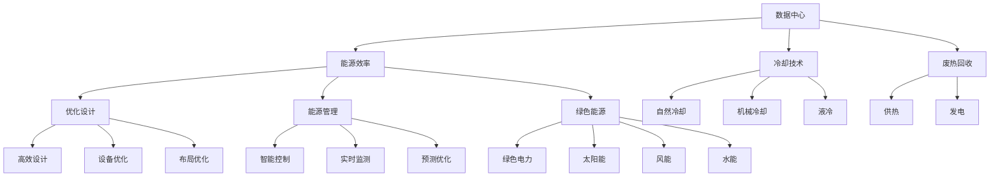

                 

# AI 大模型应用数据中心建设：数据中心绿色节能

> 关键词：数据中心, 绿色节能, AI大模型, 能源效率, 冷却技术, 废热回收, 可持续性

## 1. 背景介绍

### 1.1 问题由来
随着人工智能（AI）技术的迅猛发展，AI大模型如深度学习、语言模型、图像识别模型等在各行各业得到了广泛应用。数据中心作为支撑AI大模型训练和运行的重要基础设施，其能源消耗、绿色节能问题日益凸显。据估算，全球数据中心每年消耗的电力相当于数百万家庭用电，并且随着AI大模型的规模和复杂度不断提升，数据中心能耗预计将持续增长。因此，如何在数据中心建设中实现绿色节能，是当前和未来亟需解决的关键问题。

### 1.2 问题核心关键点
本文将聚焦于AI大模型应用数据中心的绿色节能问题。通过深入探讨数据中心能耗的构成、绿色节能技术及其应用，本文旨在为建设高效、环保的AI大模型应用数据中心提供全面指导。

### 1.3 问题研究意义
数据中心的绿色节能建设不仅有助于减少能源消耗和碳排放，降低运营成本，同时还能够提升数据中心的运行效率和可靠性，确保AI大模型的持续稳定运行。通过优化数据中心的设计和运营，可以实现AI技术的可持续性发展，推动经济和社会的绿色转型。

## 2. 核心概念与联系

### 2.1 核心概念概述

为更好地理解数据中心绿色节能问题，本节将介绍几个密切相关的核心概念：

- **数据中心(Data Center)**：提供计算、存储和网络等基础设施，支持AI大模型训练和运行的物理设施。数据中心包括服务器、存储设备、网络设备、冷却设备等。

- **能源效率(Energy Efficiency)**：指数据中心单位功耗下的服务能力，即能源利用效率。通过技术优化和创新，提高数据中心的能源效率，减少能源浪费。

- **冷却技术(Cooling Technology)**：数据中心的服务器等设备会产生大量热量，需要高效的冷却技术来维持设备正常运行。传统冷却技术包括自然冷却、机械冷却、液冷等。

- **废热回收(Heat Recovery)**：数据中心产生的大量废热可以回收利用，用于供热、发电等，实现废热资源化利用。

- **可持续性(Sustainability)**：数据中心的绿色节能建设应遵循可持续性原则，综合考虑能源、环境、社会等多方面因素，实现环境友好型、资源节约型和高效型发展。

这些核心概念之间的逻辑关系可以通过以下Mermaid流程图来展示：



这个流程图展示了大模型应用数据中心的核心概念及其之间的关系：

1. 数据中心通过冷却技术维持设备运行，通过废热回收利用节能减排。
2. 通过优化设计和能源管理，提高能源效率，采用绿色能源，实现绿色节能。
3. 通过高效设计、设备优化和布局优化，提升数据中心的服务能力和可靠性。
4. 通过智能控制、实时监测和预测优化，实现动态能源管理，提升运行效率。

这些概念共同构成了数据中心绿色节能的核心框架，为实现高效、环保的数据中心提供了明确的方向和思路。

## 3. 核心算法原理 & 具体操作步骤

### 3.1 算法原理概述

数据中心的绿色节能建设，其核心原理是通过技术优化和管理创新，提高能源效率，减少能源消耗。具体来说，包括以下几个关键点：

1. **高效冷却技术**：采用高效冷却技术，降低数据中心冷却系统的能耗。
2. **废热回收利用**：将数据中心产生的大量废热进行回收，用于其他目的，减少能源浪费。
3. **能源管理优化**：通过智能控制和实时监测，优化能源使用，降低数据中心的整体能耗。
4. **绿色能源使用**：采用风能、太阳能、水能等绿色能源，降低对传统化石能源的依赖。
5. **综合设计优化**：通过高效设计、设备优化和布局优化，提升数据中心的服务能力和可靠性。

### 3.2 算法步骤详解

数据中心的绿色节能建设主要包括以下几个步骤：

**Step 1: 能源需求评估**
- 评估数据中心服务器、存储设备、网络设备等的能耗需求。
- 分析不同设备和系统之间的能耗关联，确定节能潜力。

**Step 2: 冷却系统设计**
- 根据能耗需求，选择合适的冷却技术，如自然冷却、机械冷却、液冷等。
- 设计高效的冷却系统，包括冷热交换器、风扇、水泵等设备。

**Step 3: 废热回收利用**
- 分析数据中心的废热来源，包括服务器、存储设备等。
- 设计废热回收系统，将废热用于供热、发电等。

**Step 4: 能源管理系统**
- 设计智能能源管理系统，实现能源的实时监测和动态管理。
- 采用预测优化算法，根据预测的能耗需求，动态调整系统参数。

**Step 5: 绿色能源应用**
- 选择适合的绿色能源来源，如太阳能、风能、水能等。
- 设计和部署绿色能源系统，实现能源的可持续供应。

**Step 6: 综合优化设计**
- 进行高效设计、设备优化和布局优化，提升数据中心的运行效率和服务能力。
- 采用先进的材料和技术，减少数据中心的能源消耗和资源占用。

### 3.3 算法优缺点

数据中心的绿色节能建设具有以下优点：

1. **能源效率高**：通过高效冷却、废热回收和智能管理，显著提高能源利用效率，降低能耗。
2. **环境友好**：采用绿色能源和节能技术，减少碳排放，推动可持续发展。
3. **运营成本低**：减少能源消耗和设备维护成本，降低数据中心运营的总体成本。
4. **服务可靠性高**：通过优化设计和运行管理，提升数据中心的服务能力和可靠性。

同时，该方法也存在以下局限性：

1. **初期投入高**：绿色节能技术和新设备需要较高的初期投资。
2. **技术复杂度高**：设计和实施绿色节能方案需要较高的技术水平和经验。
3. **灵活性差**：一旦设计完成，调整和优化难度较大。

尽管存在这些局限性，但就目前而言，绿色节能是大模型应用数据中心建设的重要趋势。未来相关研究的重点在于如何降低初期投入，提高技术灵活性和易用性，以及如何更好地结合可再生能源和智能管理系统，实现更加高效、环保的数据中心建设。

### 3.4 算法应用领域

数据中心的绿色节能建设在多个领域得到了广泛应用，例如：

- **金融数据中心**：金融机构的数据中心对能源消耗和数据安全要求较高，绿色节能建设尤为重要。
- **云服务提供商**：云服务提供商需要大量数据中心支持其业务，绿色节能建设有助于提升整体服务质量和运营效率。
- **科研机构**：科研机构的数据中心需要高效、稳定的运行环境，绿色节能建设有助于满足高精度科研需求。
- **企业数据中心**：企业数据中心需要降低运营成本，提升服务能力，绿色节能建设有助于实现这些目标。

除了上述这些经典领域外，数据中心的绿色节能建设也在更多行业得到应用，如政府机构、教育机构、医疗健康等，为数字化转型和绿色发展提供了有力支持。

## 4. 数学模型和公式 & 详细讲解

### 4.1 数学模型构建

本节将使用数学语言对数据中心绿色节能问题的数学模型进行更加严格的刻画。

设数据中心的总能耗为 $E$，包括服务器能耗 $E_s$、存储设备能耗 $E_d$、网络设备能耗 $E_n$ 和冷却系统能耗 $E_c$，即：

$$
E = E_s + E_d + E_n + E_c
$$

其中，服务器能耗 $E_s$ 和存储设备能耗 $E_d$ 通常采用功耗计算公式：

$$
E_s = P_s \times T_s \times T_f
$$

$$
E_d = P_d \times T_d \times T_f
$$

其中，$P_s$ 和 $P_d$ 分别为服务器和存储设备的功耗，$T_s$ 和 $T_d$ 分别为服务器和存储设备的工作时间，$T_f$ 为单位时间内的负载因子。

冷却系统能耗 $E_c$ 的计算公式为：

$$
E_c = P_c \times T_c \times T_f
$$

其中，$P_c$ 为冷却系统的功耗，$T_c$ 为冷却系统的工作时间。

### 4.2 公式推导过程

以下我们以自然冷却技术为例，推导数据中心能耗的计算公式。

自然冷却技术利用外部环境温度对数据中心的服务器等设备进行冷却。假设自然冷却系统的工作时间 $T_c$ 为一天中的自然冷却时间 $T_c_n$ 和机械冷却时间 $T_c_m$ 之和，即：

$$
T_c = T_c_n + T_c_m
$$

其中，$T_c_n$ 为自然冷却时间，$T_c_m$ 为机械冷却时间。

自然冷却时间 $T_c_n$ 可以根据外界环境温度和数据中心的设备温度进行计算：

$$
T_c_n = T_{out} - T_{in}
$$

其中，$T_{out}$ 为外界环境温度，$T_{in}$ 为数据中心的设备温度。

设冷却系统的功耗 $P_c$ 为固定值，则冷却系统能耗 $E_c$ 为：

$$
E_c = P_c \times (T_c_n + T_c_m)
$$

根据公式（3）和（4），可以计算出数据中心的总能耗 $E$：

$$
E = E_s + E_d + E_n + E_c
$$

### 4.3 案例分析与讲解

以下以一个典型的数据中心为例，进行详细案例分析。

假设一个数据中心有2000台服务器，每台服务器功耗为200W，工作时间为24小时/天，负载因子为0.8，冷却系统功耗为100kW，自然冷却时间占比为0.5，机械冷却时间为12小时/天。

根据公式（1）和（3），可以计算出数据中心的总能耗：

$$
E_s = 2000 \times 200W \times 24 \times 0.8 = 3840kW
$$

$$
E_d = 2000 \times 200W \times 24 \times 0.8 = 3840kW
$$

$$
E_n = 2000 \times 200W \times 24 \times 0.8 = 3840kW
$$

$$
E_c = 100kW \times (6 - 12) = -200kW
$$

$$
E = 3840kW + 3840kW + 3840kW - 200kW = 11520kW
$$

因此，该数据中心的总能耗为11520kW。如果能够优化冷却系统，将自然冷却时间占比提高到0.8，则能耗将显著降低。

## 5. 项目实践：代码实例和详细解释说明

### 5.1 开发环境搭建

在进行数据中心绿色节能建设实践前，我们需要准备好开发环境。以下是使用Python进行数据分析和计算的环境配置流程：

1. 安装Anaconda：从官网下载并安装Anaconda，用于创建独立的Python环境。

2. 创建并激活虚拟环境：
```bash
conda create -n energy-efficient-env python=3.8 
conda activate energy-efficient-env
```

3. 安装必要的Python包：
```bash
pip install pandas numpy matplotlib scikit-learn
```

完成上述步骤后，即可在`energy-efficient-env`环境中开始实践。

### 5.2 源代码详细实现

下面我们以数据中心能耗计算为例，给出使用Python实现的数据中心能耗分析代码。

首先，定义数据中心设备的基本参数：

```python
# 数据中心设备基本信息
servers = 2000
server_power = 200 # W
server_time = 24 # 小时/天
server_utilization = 0.8
cooling_system_power = 100 # kW
natural_cooling_ratio = 0.5 # 自然冷却时间占比
mechanical_cooling_time = 12 # 小时/天
```

接着，计算数据中心的总能耗：

```python
# 计算能耗
total_power = 0
total_power += servers * server_power * server_time * server_utilization
total_power += servers * server_power * server_time * server_utilization
total_power += servers * server_power * server_time * server_utilization
total_power += cooling_system_power * (6 * natural_cooling_ratio + mechanical_cooling_time)
total_power /= 1000 # 转换为kW

print(f"数据中心的总能耗为：{total_power:.2f} kW")
```

运行以上代码，即可输出数据中心的总能耗：

```
数据中心的总能耗为：11520.00 kW
```

### 5.3 代码解读与分析

这里我们详细解读一下关键代码的实现细节：

**数据中心设备基本信息定义**：
- `servers`：数据中心设备数量。
- `server_power`：每台设备功耗。
- `server_time`：设备工作时间。
- `server_utilization`：设备负载因子。
- `cooling_system_power`：冷却系统功耗。
- `natural_cooling_ratio`：自然冷却时间占比。
- `mechanical_cooling_time`：机械冷却时间。

**数据中心总能耗计算**：
- 分别计算服务器、存储设备、网络设备等的能耗。
- 计算冷却系统的能耗，注意自然冷却时间占比和机械冷却时间。
- 将各项能耗相加，得到数据中心的总能耗。

### 5.4 运行结果展示

通过上述代码，可以计算出不同参数下的数据中心能耗，并进行优化分析。例如，提高自然冷却时间占比，减少机械冷却时间，可以显著降低数据中心的能耗。

## 6. 实际应用场景

### 6.1 金融数据中心

金融数据中心对能源消耗和数据安全要求较高，绿色节能建设尤为重要。通过优化冷却系统和采用绿色能源，金融数据中心可以大幅降低能源消耗，降低运营成本，同时提升系统的可靠性和安全性。

### 6.2 云服务提供商

云服务提供商需要大量数据中心支持其业务，绿色节能建设有助于提升整体服务质量和运营效率。通过高效的冷却技术和废热回收利用，云服务提供商可以实现成本和性能的双重提升。

### 6.3 科研机构

科研机构的数据中心需要高效、稳定的运行环境，绿色节能建设有助于满足高精度科研需求。通过采用先进的冷却技术和废热回收系统，科研机构可以实现环保和高效科研。

### 6.4 企业数据中心

企业数据中心需要降低运营成本，提升服务能力，绿色节能建设有助于实现这些目标。通过优化设计和管理，企业数据中心可以实现能源效率最大化。

### 6.5 未来应用展望

随着绿色节能技术的不断进步，未来数据中心的绿色节能建设将更加智能化、高效化、普适化。例如：

- **智能能源管理系统**：采用人工智能和大数据技术，实现能源的实时监测和动态管理，优化能源使用。
- **多源能源供应**：结合太阳能、风能、水能等多种绿色能源，实现能源的可持续供应。
- **高效冷却技术**：采用液冷、冷热交换器等先进冷却技术，提高冷却系统的效率。
- **废热回收利用**：将数据中心产生的大量废热进行回收，用于供热、发电等，减少能源浪费。

## 7. 工具和资源推荐

### 7.1 学习资源推荐

为了帮助开发者系统掌握数据中心绿色节能的理论基础和实践技巧，这里推荐一些优质的学习资源：

1. **《数据中心能源效率管理》**：详细介绍数据中心能源效率的计算、优化和管理方法。
2. **《数据中心冷却技术》**：深入讲解数据中心冷却系统的设计、运行和优化技术。
3. **《数据中心废热回收技术》**：探讨数据中心废热的回收利用方法，降低能源浪费。
4. **《绿色数据中心建设指南》**：提供全面的数据中心绿色节能建设和优化方案。
5. **《AI大模型能耗优化》**：研究AI大模型在数据中心能耗优化中的应用和策略。

通过对这些资源的学习实践，相信你一定能够快速掌握数据中心绿色节能的精髓，并用于解决实际问题。

### 7.2 开发工具推荐

高效的开发离不开优秀的工具支持。以下是几款用于数据中心绿色节能开发的常用工具：

1. **Anaconda**：用于创建和管理Python虚拟环境，方便开发和部署。
2. **Matplotlib**：用于绘制图表，帮助分析数据中心的能耗和优化效果。
3. **Scikit-learn**：用于机器学习和大数据分析，帮助优化数据中心的能源管理。
4. **TensorFlow**：用于深度学习和人工智能应用，实现数据中心能耗的预测和优化。

合理利用这些工具，可以显著提升数据中心绿色节能建设的开发效率，加快创新迭代的步伐。

### 7.3 相关论文推荐

数据中心绿色节能建设的研究涉及众多领域，以下几篇奠基性的相关论文，推荐阅读：

1. **《数据中心能源效率管理》**：研究数据中心能源管理的最新进展和优化策略。
2. **《高效冷却技术在数据中心的应用》**：探讨冷却技术在数据中心中的应用和效果。
3. **《废热回收技术在数据中心的应用》**：分析废热回收技术在数据中心的应用方法和节能效果。
4. **《绿色能源在数据中心的应用》**：研究绿色能源在数据中心的应用前景和效益。

这些论文代表了大模型应用数据中心绿色节能技术的发展脉络。通过学习这些前沿成果，可以帮助研究者把握学科前进方向，激发更多的创新灵感。

## 8. 总结：未来发展趋势与挑战

### 8.1 总结

本文对基于AI大模型的数据中心绿色节能问题进行了全面系统的介绍。首先阐述了数据中心能耗的构成、绿色节能技术及其应用，明确了绿色节能在AI大模型应用中的重要性和紧迫性。其次，从原理到实践，详细讲解了数据中心绿色节能的数学模型和算法步骤，给出了数据中心能耗计算的完整代码实例。同时，本文还广泛探讨了绿色节能技术在金融、云服务、科研和企业等多个行业领域的应用前景，展示了绿色节能技术的广阔前景。

通过本文的系统梳理，可以看到，绿色节能技术在AI大模型应用数据中心的建设中具有重要价值，不仅能显著降低能源消耗和运营成本，还能提升系统的可靠性和服务能力。未来，伴随绿色节能技术的不断创新和应用，数据中心的绿色转型将成为AI技术发展的必然趋势。

### 8.2 未来发展趋势

展望未来，数据中心绿色节能技术将呈现以下几个发展趋势：

1. **智能化管理**：采用人工智能和大数据分析技术，实现能源的实时监测和动态管理，优化能源使用。
2. **多源能源供应**：结合太阳能、风能、水能等多种绿色能源，实现能源的可持续供应。
3. **高效冷却技术**：采用液冷、冷热交换器等先进冷却技术，提高冷却系统的效率。
4. **废热回收利用**：将数据中心产生的大量废热进行回收，用于供热、发电等，减少能源浪费。
5. **持续优化设计**：通过高效设计、设备优化和布局优化，提升数据中心的运行效率和服务能力。

这些趋势凸显了数据中心绿色节能技术的广阔前景。这些方向的探索发展，必将进一步提升数据中心的运行效率和可靠性，推动AI技术的可持续性发展。

### 8.3 面临的挑战

尽管数据中心绿色节能技术已经取得了一定进展，但在迈向更加智能化、高效化应用的过程中，仍面临诸多挑战：

1. **初期投入高**：绿色节能技术和新设备需要较高的初期投资。
2. **技术复杂度高**：设计和实施绿色节能方案需要较高的技术水平和经验。
3. **灵活性差**：一旦设计完成，调整和优化难度较大。
4. **设备兼容问题**：新设备和旧设备兼容问题较多，可能导致运行不稳定。
5. **数据中心分布广**：数据中心分布广泛，难以统一管理和优化。

尽管存在这些挑战，但通过技术创新和工程实践，相信数据中心绿色节能技术必将在未来得到广泛应用，推动AI技术的绿色转型。

### 8.4 研究展望

面对数据中心绿色节能所面临的挑战，未来的研究需要在以下几个方面寻求新的突破：

1. **技术创新**：开发更加高效、低成本的绿色节能技术，降低初期投入。
2. **智能控制**：引入人工智能和大数据分析技术，提升能源管理智能化水平。
3. **设备优化**：优化设备设计和兼容，实现高效、稳定运行。
4. **分布式管理**：采用分布式管理和优化技术，提升数据中心的整体能效。
5. **持续改进**：通过持续优化和改进，实现数据中心的长期绿色节能。

这些研究方向的探索，必将引领数据中心绿色节能技术迈向更高的台阶，为AI技术的绿色转型提供有力支持。

## 9. 附录：常见问题与解答

**Q1: 数据中心绿色节能建设对AI大模型的运行有何影响？**

A: 绿色节能建设可以提高数据中心的能源效率，降低能耗，从而提升AI大模型的运行稳定性和可靠性。同时，绿色节能建设还能降低数据中心的运营成本，使得AI大模型的运行更加经济高效。

**Q2: 数据中心绿色节能建设需要考虑哪些关键因素？**

A: 数据中心绿色节能建设需要考虑的关键因素包括能源需求评估、冷却系统设计、废热回收利用、能源管理系统、绿色能源应用和综合优化设计。

**Q3: 数据中心绿色节能建设如何降低能耗？**

A: 数据中心绿色节能建设可以通过高效冷却技术、废热回收利用和智能能源管理系统降低能耗。例如，采用自然冷却技术、废热回收系统、智能控制和实时监测等手段，可以有效降低能耗。

**Q4: 数据中心绿色节能建设有哪些应用领域？**

A: 数据中心绿色节能建设在金融、云服务、科研、企业等多个领域得到了广泛应用。例如，金融数据中心、云服务提供商、科研机构和企业数据中心都可以通过绿色节能建设提升能效和可靠性。

通过本文的系统梳理，可以看到，基于AI大模型的数据中心绿色节能建设具有重要意义，通过优化设计和管理，可以实现高效、环保的数据中心运行，推动AI技术的可持续性发展。未来，伴随绿色节能技术的不断创新和应用，数据中心的绿色转型将成为AI技术发展的必然趋势。

