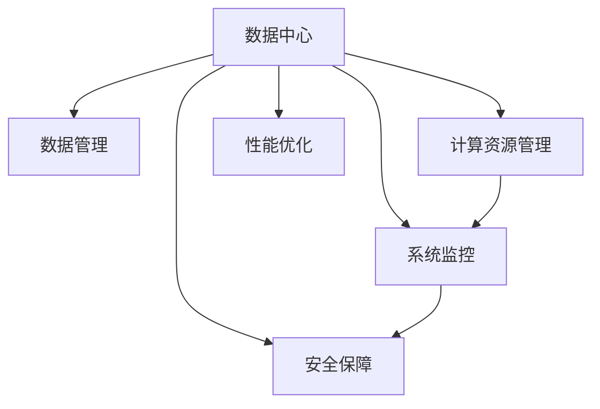

                 

# AI 大模型应用数据中心建设：数据中心运维与管理

> 关键词：人工智能大模型, 数据中心运维, 数据管理, AI基础设施, 智能运维, 数据安全

## 1. 背景介绍

### 1.1 问题由来
随着人工智能(AI)技术的不断进步，特别是深度学习模型的发展，大模型应用变得越来越普遍。AI大模型需要处理大规模数据和进行复杂计算，数据中心（Data Center, DC）成为其重要基础设施。然而，传统的数据中心运维方式已无法满足大模型应用的挑战，数据中心的运维与管理问题日益凸显。

大模型应用面临的主要问题包括：
- **数据管理**：AI大模型需要大量的数据进行训练和推理，如何高效管理、存储和传输数据成为关键。
- **计算资源管理**：大模型训练和推理需要巨大的计算资源，如何有效管理和调度资源是另一个重要问题。
- **系统可靠性和安全性**：AI大模型的训练和推理过程对系统的可靠性要求极高，任何一个小错误都可能导致训练或推理的失败。
- **性能优化**：如何在大规模数据和计算资源下，优化AI大模型的训练和推理性能，提升系统效率。

### 1.2 问题核心关键点
数据中心运维与管理的问题主要集中在以下几个方面：
- **数据管理**：数据的存储、检索、传输和管理。
- **资源调度**：计算资源的分配、调度与优化。
- **系统监控**：实时监控数据中心的状态和运行情况，确保系统的稳定运行。
- **安全保障**：保护数据和系统的安全，防止数据泄露和系统攻击。
- **性能优化**：提高数据中心的整体性能和效率。

## 2. 核心概念与联系

### 2.1 核心概念概述

为更好地理解AI大模型应用数据中心的运维与管理方法，本节将介绍几个密切相关的核心概念：

- **数据中心（Data Center, DC）**：大模型应用的物理基础设施，包括服务器、存储设备、网络设备等。
- **数据管理（Data Management）**：对大模型训练和推理所需的数据进行管理，包括数据存储、备份、恢复等。
- **计算资源管理（Compute Resource Management）**：对数据中心中的计算资源（如GPU、CPU等）进行管理和调度，确保资源的充分利用。
- **系统监控（System Monitoring）**：对数据中心系统的状态进行实时监控，及时发现和解决问题。
- **安全保障（Security Assurance）**：对数据中心的安全进行保障，防止数据泄露和系统攻击。
- **性能优化（Performance Optimization）**：通过各种技术手段，提升数据中心的整体性能和效率。

这些核心概念之间的逻辑关系可以通过以下Mermaid流程图来展示：



这个流程图展示了大模型应用数据中心的几个关键组件及其之间的联系：

1. 数据中心是所有其他组件的基础设施。
2. 数据管理对大模型所需的数据进行管理和维护。
3. 计算资源管理负责计算资源的分配和调度。
4. 系统监控实时监控数据中心的状态。
5. 安全保障保障数据中心的安全性。
6. 性能优化提升数据中心的整体性能。

## 3. 核心算法原理 & 具体操作步骤
### 3.1 算法原理概述

AI大模型应用数据中心的运维与管理，本质上是一个复杂的多目标优化问题。其核心思想是：通过合理的算法和工具，对数据中心进行全面管理和优化，确保AI大模型的训练和推理过程能够高效、可靠、安全地进行。

形式化地，假设数据中心为目标系统，需优化的目标包括数据管理、资源调度、系统监控、安全保障和性能优化。设 $O_i$ 为第 $i$ 个优化目标，则优化的总目标函数为：

$$
\min \sum_{i=1}^n w_i O_i
$$

其中 $w_i$ 为第 $i$ 个优化目标的权重，通过权衡各个目标的重要程度来确定。

数据中心运维与管理的算法和步骤一般包括：

1. 收集数据中心的状态信息，包括CPU使用率、内存使用率、网络带宽、磁盘I/O等。
2. 根据收集到的状态信息，计算各个优化目标的度量指标，如计算资源利用率、数据中心能耗、系统可用性等。
3. 通过优化算法（如线性规划、整数规划、遗传算法等），找到满足目标函数的最优解，制定相应的策略。
4. 根据制定的策略，自动调整和优化数据中心各组件的设置，如计算资源的分配、数据传输路径的选择等。
5. 持续监控数据中心的状态，实时更新优化目标，保证系统的长期稳定运行。

### 3.2 算法步骤详解

AI大模型应用数据中心的运维与管理一般包括以下几个关键步骤：

**Step 1: 数据中心的状态监测**
- 部署监控系统，收集数据中心各组件的状态信息。
- 根据预定义的监控指标（如CPU使用率、内存使用率、网络带宽、磁盘I/O等），计算各组件的运行状态。
- 对于异常状态，进行告警和记录，并分析原因。

**Step 2: 数据中心的资源调度**
- 根据当前数据中心的状态，确定各计算资源（如GPU、CPU）的利用率。
- 根据任务需求，动态调整资源的分配策略。
- 使用资源调度算法（如Spotify算法、Load Balancing算法等），优化资源的使用效率。

**Step 3: 数据中心的安全保障**
- 部署安全系统，对数据中心进行实时监控和防护。
- 使用入侵检测系统(IDS)和入侵防御系统(IPS)，防止非法访问和攻击。
- 定期进行安全漏洞扫描和修复，确保系统的安全性。

**Step 4: 数据中心的数据管理**
- 设计数据存储架构，确保数据的高效存储和检索。
- 使用分布式文件系统（如HDFS、Ceph等），进行数据的高可用性管理和容错处理。
- 实施数据备份和恢复策略，保证数据的安全性和可靠性。

**Step 5: 数据中心的性能优化**
- 通过负载均衡、缓存机制、硬件升级等方式，提升数据中心的整体性能。
- 使用机器学习算法，预测数据中心的未来负载，进行动态调整。
- 使用智能运维工具（如Ansible、Puppet等），自动化管理和优化数据中心。

### 3.3 算法优缺点

AI大模型应用数据中心的运维与管理方法具有以下优点：
1. 提高效率：通过自动化和优化算法，可以显著提高数据中心的效率和资源利用率。
2. 降低成本：优化资源使用，减少能源消耗，降低数据中心的运营成本。
3. 提升可靠性：实时监控和快速响应，确保数据中心的高可用性和稳定性。
4. 增强安全性：全面的安全保障措施，保护数据和系统的安全。

同时，该方法也存在一定的局限性：
1. 复杂度高：数据中心的运维和管理需要综合考虑多个目标，算法复杂度较高。
2. 数据依赖强：数据中心的优化需要大量的实时数据，数据采集和处理成本较高。
3. 算法局限：不同的优化目标之间可能存在冲突，优化算法需要不断调整和优化。
4. 技术门槛高：需要具备高级运维和管理技能，对技术要求较高。

尽管存在这些局限性，但就目前而言，基于算法和工具的AI大模型应用数据中心运维与管理方法仍是大模型应用的重要手段。未来相关研究的重点在于如何进一步降低运维成本，提高系统可靠性，并结合人工智能技术进行更智能化的运维和管理。

### 3.4 算法应用领域

AI大模型应用数据中心的运维与管理方法，已经在多个领域得到广泛应用，例如：

- **云计算**：通过数据中心管理工具（如VMware、OpenStack等），对云资源进行高效管理和调度。
- **大数据**：使用Hadoop、Spark等大数据平台，进行数据的高效存储和处理。
- **金融领域**：对交易数据进行实时监控和分析，提升金融系统的稳定性和安全性。
- **医疗行业**：对医疗影像和数据进行高效存储和管理，提升医疗诊断的效率和准确性。
- **自动驾驶**：对自动驾驶数据进行实时分析和处理，确保车辆的安全行驶。

除了上述这些经典领域外，AI大模型应用数据中心的运维与管理方法还将继续拓展到更多领域，如智慧城市、智能制造等，为各行各业带来更多的智能化解决方案。

## 4. 数学模型和公式 & 详细讲解 & 举例说明
### 4.1 数学模型构建

本节将使用数学语言对AI大模型应用数据中心的运维与管理方法进行更加严格的刻画。

设数据中心的目标系统为 $S=\{S_1, S_2, \ldots, S_n\}$，其中 $S_i$ 表示第 $i$ 个组件（如服务器、存储设备等）。设数据中心的优化目标包括数据管理、资源调度、系统监控、安全保障和性能优化，分别记为 $O_1$、$O_2$、$O_3$、$O_4$ 和 $O_5$。设第 $i$ 个优化目标的度量指标为 $x_i$，则目标函数为：

$$
\min \sum_{i=1}^5 w_i x_i
$$

其中 $w_i$ 为第 $i$ 个优化目标的权重。设第 $i$ 个组件的运行状态为 $y_i$，则数据中心的状态监测目标为：

$$
\min \sum_{i=1}^n w_i y_i
$$

其中 $w_i$ 为第 $i$ 个组件的权重。目标函数的约束条件包括：

1. 各组件的运行状态 $y_i$ 必须在允许的范围内，即 $y_i \in [0, 1]$。
2. 各优化目标 $x_i$ 必须在允许的范围内，即 $x_i \in [0, \infty)$。
3. 各组件的资源分配 $a_i$ 必须在允许的范围内，即 $a_i \in [0, \infty)$。

### 4.2 公式推导过程

以下我们以数据中心的安全保障为例，推导入侵检测系统(IDS)的数学模型及其优化算法。

假设数据中心中存在 $N$ 个可能被攻击的服务器，每个服务器被攻击的概率为 $p$。设数据中心的安全保障目标是检测到 $k$ 个被攻击的服务器。则IDS的目标函数为：

$$
\min \sum_{i=1}^N p_i
$$

其中 $p_i$ 为第 $i$ 个服务器的入侵概率。约束条件为：

1. 检测到的被攻击服务器数 $k \geq k_{min}$。
2. 检测到的被攻击服务器数 $k \leq k_{max}$。
3. 检测到的被攻击服务器数 $k \in \mathbb{N}$。

假设IDS使用贝叶斯网络模型进行攻击检测，其概率模型为：

$$
p_i = \prod_{j=1}^M p_j
$$

其中 $p_j$ 为第 $j$ 个特征（如IP地址、流量异常等）被攻击的概率。则IDS的优化目标为：

$$
\min \sum_{i=1}^N \prod_{j=1}^M p_j
$$

其中 $p_j$ 为第 $j$ 个特征被攻击的概率。根据不等式变换，可以将目标函数转换为：

$$
\min \sum_{j=1}^M \log p_j
$$

其中 $p_j$ 为第 $j$ 个特征被攻击的概率。使用遗传算法对目标函数进行优化，可以求得最优解。

### 4.3 案例分析与讲解

以下我们以智能运维工具Ansible为例，展示其在大模型应用数据中心运维与管理中的应用。

智能运维工具Ansible是一种基于SSH协议的自动化运维工具，能够自动化执行各种任务，如部署、配置、监控等。在AI大模型应用数据中心中，可以使用Ansible进行以下任务：

1. **自动部署**：使用Ansible自动部署AI大模型所需的软件和依赖库。
2. **配置管理**：使用Ansible管理数据中心的配置文件和环境变量，确保系统的稳定运行。
3. **监控和报警**：使用Ansible实时监控数据中心的状态，并在出现异常时发送报警信息。

以部署AI大模型为例，以下是Ansible的Python代码实现：

```python
# 定义 Ansible 任务
tasks = [
    {
        "hosts": "all",
        "become": True,
        "tasks": [
            {
                "name": "install packages",
                "apt": {
                    "package": ["numpy", "scikit-learn", "tensorflow", "transformers"]
                }
            },
            {
                "name": "git clone",
                "command": "git clone https://github.com/huggingface/transformers.git"
            },
            {
                "name": "pip install transformers",
                "pip": {
                    "no_user": True,
                    "upgrade_strategy": "use-dist-info"
                }
            },
            {
                "name": "git clone",
                "command": "git clone https://github.com/tensorflow/tensorboard.git"
            },
            {
                "name": "pip install tensorboard",
                "pip": {
                    "no_user": True,
                    "upgrade_strategy": "use-dist-info"
                }
            },
            {
                "name": "download model",
                "command": "wget https://example.com/path/to/model.tar.gz",
                "register": "download",
                "ignore_errors": True
            },
            {
                "name": "unzip model",
                "command": "tar xzf {{ download }}",
                "environment": {
                    "PATH": "/usr/local/bin:/usr/bin:/usr/sbin:/sbin"
                }
            }
        ]
    }
]
```

这个任务定义了在所有节点上执行的具体任务，包括安装必要的软件包、克隆必要的代码仓库、下载和解压预训练模型等。通过Ansible，可以确保这些任务的可靠执行，并实时记录执行日志。

## 5. 项目实践：代码实例和详细解释说明
### 5.1 开发环境搭建

在进行数据中心运维与管理实践前，我们需要准备好开发环境。以下是使用Python进行Ansible开发的环境配置流程：

1. 安装Ansible：从官网下载并安装Ansible，确保版本与PyTorch等库兼容。

2. 创建并激活虚拟环境：
```bash
conda create -n ansible-env python=3.8 
conda activate ansible-env
```

3. 安装Pysc Wirch、Paramiko等依赖包：
```bash
pip install pysc-witch paramiko
```

4. 安装Python Dev-Packages和其它相关工具：
```bash
pip install pip-dev virtualenv wrapt
```

完成上述步骤后，即可在`ansible-env`环境中开始数据中心运维与管理实践。

### 5.2 源代码详细实现

下面我们以智能运维工具Ansible为例，给出使用Ansible对AI大模型进行自动部署的PyTorch代码实现。

首先，定义Ansible任务：

```python
tasks = [
    {
        "hosts": "all",
        "become": True,
        "tasks": [
            {
                "name": "install packages",
                "apt": {
                    "package": ["numpy", "scikit-learn", "tensorflow", "transformers"]
                }
            },
            {
                "name": "git clone",
                "command": "git clone https://github.com/huggingface/transformers.git"
            },
            {
                "name": "pip install transformers",
                "pip": {
                    "no_user": True,
                    "upgrade_strategy": "use-dist-info"
                }
            },
            {
                "name": "git clone",
                "command": "git clone https://github.com/tensorflow/tensorboard.git"
            },
            {
                "name": "pip install tensorboard",
                "pip": {
                    "no_user": True,
                    "upgrade_strategy": "use-dist-info"
                }
            },
            {
                "name": "download model",
                "command": "wget https://example.com/path/to/model.tar.gz",
                "register": "download",
                "ignore_errors": True
            },
            {
                "name": "unzip model",
                "command": "tar xzf {{ download }}",
                "environment": {
                    "PATH": "/usr/local/bin:/usr/bin:/usr/sbin:/sbin"
                }
            }
        ]
    }
]
```

然后，使用Ansible Playbook运行任务：

```bash
ansible-playbook -i hosts.txt deploy.yml
```

其中，`hosts.txt`为Ansible主机列表文件，`deploy.yml`为Ansible Playbook配置文件。

### 5.3 代码解读与分析

让我们再详细解读一下关键代码的实现细节：

**Ansible任务定义**：
- `hosts`：指定Ansible任务执行的主机列表。
- `become`：以root用户身份执行任务。
- `tasks`：定义具体的任务步骤。

**任务步骤**：
- `apt`：安装必要的软件包。
- `git clone`：克隆必要的代码仓库。
- `pip install`：安装必要的依赖库。
- `download`：下载预训练模型。
- `tar xzf`：解压预训练模型。

使用Ansible，可以方便地自动化执行这些任务，并记录执行日志，确保任务执行的可靠性和透明性。

当然，工业级的系统实现还需考虑更多因素，如任务调度和并发控制、任务失败重试等。但核心的自动化运维思想基本与此类似。

## 6. 实际应用场景
### 6.1 智能运维系统

在AI大模型应用数据中心中，智能运维系统扮演着重要角色。通过智能运维，可以实现对数据中心各组件的实时监控、故障分析和自动恢复，提升系统的稳定性和可靠性。

智能运维系统一般包括以下组件：

- **监控模块**：实时收集数据中心的状态信息，包括CPU使用率、内存使用率、网络带宽、磁盘I/O等。
- **告警模块**：根据预定义的告警阈值，对异常状态进行告警和记录。
- **恢复模块**：在出现故障时，自动进行系统恢复和修复。
- **自动化部署**：使用智能运维工具（如Ansible、Puppet等），自动化执行部署和配置任务。

在实际应用中，智能运维系统能够实时监测数据中心的状态，及时发现和解决问题。例如，当某个服务器的CPU使用率过高时，系统能够自动重启该服务器或将其迁移到更空闲的节点上，避免系统崩溃。

### 6.2 数据备份与恢复

在AI大模型应用数据中心中，数据备份与恢复是不可或缺的环节。通过数据备份，可以在系统出现故障或数据丢失时，快速恢复系统，确保数据的完整性和可用性。

数据备份与恢复系统一般包括以下组件：

- **备份模块**：定期备份数据中心中的关键数据，如模型参数、训练数据等。
- **恢复模块**：在数据丢失或损坏时，从备份中恢复数据。
- **加密模块**：对备份数据进行加密，防止数据泄露。

在实际应用中，数据备份与恢复系统能够保证AI大模型应用数据中心的长期稳定运行。例如，当某个存储设备出现故障时，系统能够从备份中快速恢复数据，确保模型的持续可用性。

### 6.3 性能优化与调优

在AI大模型应用数据中心中，性能优化与调优是提升系统效率和资源利用率的关键。通过优化算法和工具，可以显著提高数据中心的性能。

性能优化与调优系统一般包括以下组件：

- **负载均衡**：对数据中心中的计算资源进行合理分配，避免资源浪费。
- **缓存机制**：对常用数据和模型进行缓存，提高访问速度。
- **硬件升级**：定期进行硬件升级，提升系统的计算能力和存储能力。

在实际应用中，性能优化与调优系统能够显著提升AI大模型应用数据中心的整体性能。例如，当系统负载过高时，负载均衡模块能够自动将任务迁移到更空闲的节点上，避免系统瓶颈。

### 6.4 未来应用展望

展望未来，AI大模型应用数据中心的运维与管理技术将呈现以下几个发展趋势：

1. **智能化运维**：使用人工智能技术进行故障预测和异常检测，提升运维效率和可靠性。
2. **自动化运维**：通过智能运维工具（如Ansible、Puppet等），自动化执行运维任务，减少人工干预。
3. **微服务架构**：将数据中心拆分成多个微服务，提升系统的可扩展性和灵活性。
4. **混合云架构**：将AI大模型应用部署在多个云平台，提升系统的容错性和可用性。
5. **实时监控与分析**：使用实时监控工具（如Prometheus、Grafana等），对数据中心进行全面监控和分析。
6. **持续集成与持续部署（CI/CD）**：将AI大模型应用部署过程自动化，提高部署效率和可靠性。

这些趋势凸显了AI大模型应用数据中心运维与管理技术的广阔前景。未来，伴随技术不断进步，数据中心的运维与管理将更加智能化、自动化和高效化，为AI大模型应用提供更好的支撑。

## 7. 工具和资源推荐
### 7.1 学习资源推荐

为了帮助开发者系统掌握AI大模型应用数据中心的运维与管理技术，这里推荐一些优质的学习资源：

1. **《数据中心运维与管理》课程**：介绍数据中心的基础知识和运维方法，适合初学者入门。
2. **《Python网络编程》书籍**：讲解Python在网络编程中的应用，包括数据中心的部署和监控。
3. **《Ansible实战指南》书籍**：详细讲解Ansible的使用方法，适合运维工程师学习。
4. **《云计算基础》课程**：介绍云计算的基本概念和应用，包括数据中心的部署和管理。
5. **《数据中心运维与安全》书籍**：涵盖数据中心运维与管理的技术和实践，包括安全保障和优化策略。

通过对这些资源的学习实践，相信你一定能够全面掌握AI大模型应用数据中心的运维与管理技术，并用于解决实际问题。

### 7.2 开发工具推荐

高效的开发离不开优秀的工具支持。以下是几款用于AI大模型应用数据中心运维与管理的常用工具：

1. **Ansible**：一种基于SSH协议的自动化运维工具，可以自动化执行各种任务，如部署、配置、监控等。
2. **Puppet**：一种配置管理系统，可以自动化配置和管理数据中心的各项设置。
3. **Prometheus**：一种实时监控工具，可以实时收集和分析数据中心的状态信息。
4. **Grafana**：一种数据可视化工具，可以将Prometheus收集的数据进行可视化展示，方便监控和分析。
5. **Jenkins**：一种持续集成和持续部署工具，可以自动化部署和更新AI大模型应用。
6. **TensorBoard**：一种TensorFlow的工具，可以可视化模型的训练和推理过程，方便监控和分析。

合理利用这些工具，可以显著提升AI大模型应用数据中心的运维与管理效率，加快创新迭代的步伐。

### 7.3 相关论文推荐

AI大模型应用数据中心的运维与管理技术不断发展，以下是几篇代表性的相关论文，推荐阅读：

1. **《大数据中心运维管理研究》**：详细介绍了大数据中心运维管理的各种技术和方法。
2. **《云计算数据中心运维管理》**：介绍云计算数据中心的运维和管理方法，涵盖监控、自动化部署等。
3. **《智能运维系统的设计与实现》**：详细讲解智能运维系统的设计和实现，包括监控、告警、恢复等。
4. **《数据中心性能优化与调优技术》**：介绍数据中心性能优化和调优的方法和工具，涵盖负载均衡、缓存机制等。
5. **《数据中心安全性设计与实现》**：介绍数据中心安全保障的方法和工具，涵盖入侵检测、加密等。

这些论文代表了大数据中心运维与管理技术的发展脉络。通过学习这些前沿成果，可以帮助研究者把握学科前进方向，激发更多的创新灵感。

## 8. 总结：未来发展趋势与挑战
### 8.1 研究成果总结

AI大模型应用数据中心的运维与管理技术，已经在多个领域得到广泛应用，取得了显著的成果。其主要成果包括：

1. **智能化运维**：使用人工智能技术进行故障预测和异常检测，提升运维效率和可靠性。
2. **自动化运维**：通过智能运维工具（如Ansible、Puppet等），自动化执行运维任务，减少人工干预。
3. **混合云架构**：将AI大模型应用部署在多个云平台，提升系统的容错性和可用性。
4. **实时监控与分析**：使用实时监控工具（如Prometheus、Grafana等），对数据中心进行全面监控和分析。
5. **持续集成与持续部署（CI/CD）**：将AI大模型应用部署过程自动化，提高部署效率和可靠性。

### 8.2 未来发展趋势

展望未来，AI大模型应用数据中心的运维与管理技术将呈现以下几个发展趋势：

1. **智能化运维**：使用人工智能技术进行故障预测和异常检测，提升运维效率和可靠性。
2. **自动化运维**：通过智能运维工具（如Ansible、Puppet等），自动化执行运维任务，减少人工干预。
3. **混合云架构**：将AI大模型应用部署在多个云平台，提升系统的容错性和可用性。
4. **实时监控与分析**：使用实时监控工具（如Prometheus、Grafana等），对数据中心进行全面监控和分析。
5. **持续集成与持续部署（CI/CD）**：将AI大模型应用部署过程自动化，提高部署效率和可靠性。

### 8.3 面临的挑战

尽管AI大模型应用数据中心的运维与管理技术已经取得了一定的成果，但在迈向更加智能化、自动化和高效化的过程中，仍面临一些挑战：

1. **复杂度高**：数据中心的运维和管理需要综合考虑多个目标，算法复杂度较高。
2. **数据依赖强**：数据中心的优化需要大量的实时数据，数据采集和处理成本较高。
3. **算法局限**：不同的优化目标之间可能存在冲突，优化算法需要不断调整和优化。
4. **技术门槛高**：需要具备高级运维和管理技能，对技术要求较高。
5. **资源限制**：数据中心硬件资源的限制，可能无法满足大模型应用的计算和存储需求。

尽管存在这些挑战，但伴随技术的不断进步和创新，相信AI大模型应用数据中心的运维与管理技术将会不断突破，为AI大模型应用的全面落地提供坚实保障。

### 8.4 研究展望

未来，AI大模型应用数据中心的运维与管理技术需要不断创新和优化，以下是一些值得探索的方向：

1. **智能化运维**：结合人工智能技术，进行更加智能化和自动化的运维管理。
2. **自动化运维**：使用智能运维工具（如Ansible、Puppet等），自动化执行运维任务。
3. **混合云架构**：将AI大模型应用部署在多个云平台，提升系统的容错性和可用性。
4. **实时监控与分析**：使用实时监控工具（如Prometheus、Grafana等），对数据中心进行全面监控和分析。
5. **持续集成与持续部署（CI/CD）**：将AI大模型应用部署过程自动化，提高部署效率和可靠性。

通过持续探索和创新，相信AI大模型应用数据中心的运维与管理技术将会更加智能化、自动化和高效化，为AI大模型应用的全面落地提供坚实保障。

## 9. 附录：常见问题与解答

**Q1：AI大模型应用数据中心如何实现自动化运维？**

A: AI大模型应用数据中心的自动化运维可以通过智能运维工具（如Ansible、Puppet等）实现。这些工具能够自动化执行部署、配置、监控等任务，减少人工干预。

**Q2：AI大模型应用数据中心如何实现智能化运维？**

A: AI大模型应用数据中心的智能化运维可以通过人工智能技术实现。例如，可以使用机器学习算法进行故障预测和异常检测，提升运维效率和可靠性。

**Q3：AI大模型应用数据中心如何实现混合云架构？**

A: AI大模型应用数据中心的混合云架构可以通过将数据中心部署在多个云平台实现。各云平台之间的数据和计算资源可以相互调度，提升系统的容错性和可用性。

**Q4：AI大模型应用数据中心如何实现实时监控与分析？**

A: AI大模型应用数据中心的实时监控与分析可以通过实时监控工具（如Prometheus、Grafana等）实现。这些工具能够实时收集和分析数据中心的状态信息，帮助运维人员及时发现和解决问题。

**Q5：AI大模型应用数据中心如何实现持续集成与持续部署（CI/CD）？**

A: AI大模型应用数据中心的持续集成与持续部署（CI/CD）可以通过自动化部署工具（如Jenkins等）实现。这些工具能够自动化执行模型训练、部署等任务，提高部署效率和可靠性。

通过以上问答，相信你对AI大模型应用数据中心的运维与管理有了更全面的了解。在未来的实际应用中，可以结合具体需求，灵活应用这些技术和方法，实现更高效、可靠、安全的AI大模型应用。

---

作者：禅与计算机程序设计艺术 / Zen and the Art of Computer Programming

