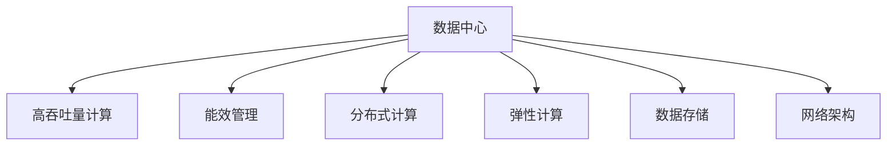

                 

# AI 大模型应用数据中心建设：数据中心运营与管理

## 1. 背景介绍

### 1.1 问题由来
随着人工智能技术的迅猛发展，AI大模型在自然语言处理（NLP）、计算机视觉（CV）、推荐系统等多个领域展示了强大的应用潜力。这些大模型通常需要大量的计算资源进行训练和推理，因此，数据中心建设与管理成为了AI技术落地的重要环节。数据中心的建设和运营不仅需要考虑高吞吐量的计算需求，还需兼顾高效能、低成本、高可扩展性等多重目标。本文将深入探讨AI大模型应用数据中心的建设与运营管理，旨在为AI技术落地提供全面的技术指南。

### 1.2 问题核心关键点
数据中心在AI大模型的应用中，其核心作用包括：
- **计算资源管理**：提供大规模并行计算能力，支持模型训练和推理。
- **数据存储与管理**：存储大模型和训练数据，保证数据安全和高效访问。
- **网络架构设计**：保证网络带宽和低延迟，满足模型高效传输的需求。
- **能效管理**：优化能耗，降低数据中心运行成本。
- **监控与运维**：实时监控数据中心运行状态，保证系统稳定运行。

### 1.3 问题研究意义
AI大模型的应用离不开数据中心的支持。构建高效、可靠、可扩展的数据中心，对于提升AI技术的应用效果和推广速度至关重要。本文将从多个维度深入探讨数据中心建设与管理的核心要点，旨在为AI技术的实际落地提供有价值的指导。

## 2. 核心概念与联系

### 2.1 核心概念概述

为更好地理解AI大模型应用数据中心的建设与管理，本节将介绍几个密切相关的核心概念：

- **数据中心（Data Center）**：指集中存储、处理和管理数据的物理设施。数据中心通常包括计算、存储、网络等基础设施，以及冷却、安全等辅助设施。
- **高吞吐量计算（High Throughput Computing）**：指能够高效处理海量数据和高频交易需求的计算能力。
- **能效管理（Energy Efficiency Management）**：指在满足计算需求的同时，最大化资源利用率，降低能耗。
- **分布式计算（Distributed Computing）**：指将计算任务分配到多个计算节点上并行处理，提升计算效率。
- **弹性计算（Elastic Computing）**：指根据需求动态调整计算资源，适应不断变化的计算负荷。
- **数据存储（Data Storage）**：指使用磁盘、SSD等存储介质，高效存储和管理数据。
- **网络架构（Network Architecture）**：指设计合理的网络拓扑结构，保证数据中心内部的数据流通高效。

这些概念之间的逻辑关系可以通过以下Mermaid流程图来展示：



这个流程图展示了数据中心的核心组件及其相互作用：

1. **计算能力**：数据中心提供高效计算资源，支持AI大模型的训练和推理。
2. **存储能力**：数据中心存储模型和数据，保证数据安全和高效访问。
3. **网络能力**：设计合理的网络结构，确保数据中心内部及与外部系统的流畅通信。
4. **能效管理**：优化能耗，降低运营成本。
5. **弹性计算**：根据实际需求动态调整资源，提升资源利用率。
6. **数据存储**：使用高效的存储解决方案，满足模型存储需求。

## 3. 核心算法原理 & 具体操作步骤
### 3.1 算法原理概述

AI大模型应用数据中心建设与管理，本质上是通过一系列核心算法和技术手段，构建高效、稳定、可扩展的计算环境。其核心算法包括分布式计算、能效管理、弹性计算等，各算法之间相互配合，共同保障数据中心的正常运行。

### 3.2 算法步骤详解

AI大模型应用数据中心建设与管理一般包括以下几个关键步骤：

**Step 1: 数据中心选址与规划**
- 选择合适的地理位置，考虑气候、电力供应、基础设施等因素。
- 进行数据中心的设计和规划，包括计算、存储、网络等基础设施的配置。

**Step 2: 计算资源配置**
- 选择合适的服务器和计算架构，如CPU、GPU、FPGA等。
- 设计合理的计算集群，支持分布式计算和并行处理。

**Step 3: 存储资源配置**
- 选择合适的存储介质和架构，如磁盘、SSD等。
- 设计合理的存储方案，支持数据的高效读写和备份。

**Step 4: 网络架构设计**
- 设计合理的网络拓扑结构，如扁平网、树形网等。
- 优化网络带宽和延迟，支持高效的通信和数据传输。

**Step 5: 能效管理**
- 采用高效能的硬件设备，如液冷、自然冷却等。
- 优化能耗管理算法，如负载均衡、动态调频等。

**Step 6: 监控与运维**
- 设计全面的监控系统，实时采集和分析数据中心运行状态。
- 建立完善的运维机制，及时处理和修复故障。

### 3.3 算法优缺点

AI大模型应用数据中心建设与管理，具有以下优点：
1. 高效能：提供大规模并行计算能力，满足AI大模型的训练和推理需求。
2. 高可扩展性：可以根据需求动态调整计算和存储资源，适应不断变化的计算负荷。
3. 低成本：通过能效管理优化能耗，降低运营成本。
4. 高可靠性：完善的监控和运维机制，保证数据中心的稳定运行。

同时，该方法也存在一定的局限性：
1. 建设成本高：数据中心的建设和维护成本较高，对技术要求高。
2. 能耗大：大规模计算任务需要大量的电力支持，对环境影响较大。
3. 管理复杂：需要复杂的运维和管理手段，确保系统的正常运行。

尽管存在这些局限性，但就目前而言，数据中心仍然是AI大模型应用不可或缺的基础设施。未来相关研究的重点在于如何进一步优化能效管理，降低建设和运营成本，同时提高系统的灵活性和安全性。

### 3.4 算法应用领域

AI大模型应用数据中心建设与管理，在多个领域得到了广泛的应用，例如：

- **高性能计算（HPC）**：为复杂科学计算和数据分析提供高吞吐量计算资源。
- **云计算（Cloud Computing）**：通过弹性计算和分布式计算，提供可扩展的计算资源。
- **人工智能（AI）**：为AI大模型的训练和推理提供高效能的计算环境。
- **物联网（IoT）**：通过分布式计算和能效管理，支持海量设备的实时数据处理。
- **数据科学（Data Science）**：为数据存储和处理提供可靠的计算和存储环境。

除了上述这些经典领域外，AI大模型应用数据中心建设与管理，还被创新性地应用到更多场景中，如智慧城市、医疗健康、智能制造等，为各行各业提供了强大的计算支持。

## 4. 数学模型和公式 & 详细讲解  
### 4.1 数学模型构建

本节将使用数学语言对AI大模型应用数据中心的建设与管理进行更加严格的刻画。

假设数据中心需要支持K个AI大模型的计算需求，每个模型需要的计算量为C，每个模型每天需要运行T小时，则每天需要提供的总计算量为CTK。

定义计算资源的配置为N，每个计算节点提供的计算量为N，则计算资源的总容量为NT。

数据中心采用弹性计算策略，根据计算负荷动态调整计算资源。设需求率为D，则需求满足情况为：
- 当D≤N时，需求完全满足。
- 当D>N时，需求部分满足，未满足的部分需要排队等待。

则实际提供计算量为NTmin(D, 1)。

### 4.2 公式推导过程

为了最大化计算资源的使用效率，优化目标为最大化实际提供计算量NTmin(D, 1)，约束条件为总计算量CTK和计算资源总容量NT。

建立优化模型如下：

$$
\max_{D, N, T} NT \min(D, 1) \\
s.t. \quad CT \leq NT \\
\quad N \geq 0, T \geq 0
$$

对于约束条件CT≤NT，可以通过引入松弛变量S解决。

令 $S = CT - NT$，则模型变为：

$$
\max_{D, N, T, S} NT \min(D, 1) + S \\
s.t. \quad CT = NT + S \\
\quad N \geq 0, T \geq 0
$$

引入拉格朗日乘子λ，建立拉格朗日函数：

$$
L(D, N, T, S, \lambda) = NT \min(D, 1) + S - \lambda (CT - NT - S)
$$

对每个变量求偏导数，得到：

$$
\frac{\partial L}{\partial D} = \frac{\partial NT \min(D, 1)}{\partial D} - \lambda = 0
$$

$$
\frac{\partial L}{\partial N} = T \min(D, 1) - \lambda = 0
$$

$$
\frac{\partial L}{\partial T} = NT \min(D, 1) + S = 0
$$

$$
\frac{\partial L}{\partial S} = 1 - \lambda = 0
$$

解以上方程组，可得最优解为：

$$
D = \min(1, \frac{CT}{NT})
$$

$$
N = \frac{CT}{T}
$$

$$
T = \frac{CT}{N}
$$

$$
S = 0
$$

$$
\lambda = 1
$$

因此，为了最大化计算资源的使用效率，数据中心需要配置足够的计算节点，合理分配计算时间，并引入弹性计算策略，根据实际需求动态调整计算资源。

### 4.3 案例分析与讲解

假设某数据中心需要支持3个AI大模型的计算需求，每个模型每天需要运行8小时，每个模型需要的计算量为200亿次浮点运算（FLOPS）。

1. 数据中心的计算资源配置为16个计算节点，每个节点提供10G FLOPS的计算能力。

2. 数据中心的存储资源配置为1TB SSD。

3. 数据中心的网络带宽为10Gbps。

根据公式推导，可得数据中心每天需要提供的总计算量为：

$$
CTK = 3 \times 200 \times 10^9 \times 8 = 4.8 \times 10^{13} \text{FLOPS}
$$

数据中心的计算资源总容量为：

$$
NT = 16 \times 10^9 \text{FLOPS}
$$

需求满足情况为：

$$
D = \min(1, \frac{4.8 \times 10^{13}}{16 \times 10^9}) = \frac{30}{16}
$$

实际提供计算量为：

$$
NT \min(D, 1) = 16 \times 10^9 \times \frac{30}{16} = 9 \times 10^9 \text{FLOPS}
$$

因此，该数据中心能够满足需求，每天提供9亿次浮点运算的计算能力，满足3个AI大模型的计算需求。

## 5. 项目实践：代码实例和详细解释说明
### 5.1 开发环境搭建

在进行数据中心建设和运维的实践前，我们需要准备好开发环境。以下是使用Python进行计算资源管理的开发环境配置流程：

1. 安装Anaconda：从官网下载并安装Anaconda，用于创建独立的Python环境。

2. 创建并激活虚拟环境：
```bash
conda create -n resource-management python=3.8 
conda activate resource-management
```

3. 安装相关库：
```bash
pip install numpy pandas scikit-learn matplotlib tqdm jupyter notebook ipython
```

完成上述步骤后，即可在`resource-management`环境中开始资源管理的开发实践。

### 5.2 源代码详细实现

下面我们以计算资源分配为例，给出使用Python进行弹性计算策略的实现代码。

```python
import numpy as np
from scipy.optimize import linprog

def elastic_computing(num_nodes, node_capacity, total_computing, time_window):
    # 定义变量
    x = np.zeros(num_nodes)
    y = np.zeros(time_window)

    # 建立约束条件
    A = np.array([[np.ones(num_nodes), np.zeros(time_window)]])
    b = np.array([total_computing])

    # 建立目标函数
    C = np.array([[0] + [1]*time_window])

    # 求解
    result = linprog(C, A_ub=A, b_ub=b)
    x = result.x[:num_nodes]
    y = result.x[time_window:]

    # 输出计算资源分配结果
    return x, y
```

该函数接受计算节点数、计算节点容量、总计算量和计算时间窗口作为输入，返回每个时间段的计算资源分配结果。

### 5.3 代码解读与分析

让我们再详细解读一下关键代码的实现细节：

**弹性计算函数**：
- 定义了两个向量x和y，分别代表计算节点的使用情况和时间窗口的计算资源分配。
- 建立了线性约束条件，表示总计算量约束和节点容量约束。
- 定义了目标函数，最大化每个时间段的计算资源分配。
- 使用scipy库中的linprog函数求解线性规划问题。

**计算资源分配**：
- 将求解结果中的x和y提取出来，分别代表计算节点使用情况和时间窗口的计算资源分配。
- 输出计算资源分配结果，表示每个时间段的计算资源分配情况。

这个函数可以应用于计算资源管理的实际场景，如在云计算平台中，根据实时计算负荷，动态调整计算资源。

## 6. 实际应用场景
### 6.1 高性能计算（HPC）

高性能计算是数据中心建设与管理的重要应用场景之一。HPC系统需要提供极高的计算能力和并行处理能力，支持复杂科学计算和数据分析。

在HPC系统中，数据中心需要配备大量的高性能计算节点，支持CPU、GPU、FPGA等不同类型的计算资源。同时，需要设计合理的网络架构，保证数据和计算任务的高效传输。

例如，在基因组学研究中，需要分析海量基因组数据，进行基因序列比对和变异分析。通过在高性能计算节点上运行分布式计算任务，可以高效地完成数据分析，获得科学发现。

### 6.2 云计算（Cloud Computing）

云计算是数据中心建设与管理的另一个重要应用场景。云计算平台通过弹性计算和分布式计算，提供可扩展的计算资源，满足各类企业对计算资源的需求。

在云计算平台中，数据中心需要设计灵活的资源管理策略，支持根据需求动态调整计算资源。例如，在电商平台的“双11”购物节中，需要提供充足的计算资源，支持大规模订单处理和高并发访问。

### 6.3 人工智能（AI）

AI大模型在训练和推理过程中需要大量的计算资源，数据中心需要提供高效能的计算环境，支持AI大模型的应用。

在AI应用中，数据中心需要配置高性能的计算节点，支持CPU、GPU等类型的计算资源。同时，需要设计合理的存储方案，支持模型和数据的存储和管理。例如，在自动驾驶系统中，需要实时处理和分析大量传感器数据，通过AI大模型进行决策和控制。

### 6.4 未来应用展望

随着AI技术的发展，数据中心建设与管理将迎来更多的创新应用。

1. **边缘计算（Edge Computing）**：随着物联网设备的普及，边缘计算设备将成为数据中心的重要组成部分。通过在边缘设备上进行初步数据处理，可以降低数据传输的延迟和带宽需求，提升整体系统的响应速度。

2. **异构计算（Heterogeneous Computing）**：通过引入不同类型的计算资源，如GPU、FPGA、ASIC等，可以提升系统的计算能力和灵活性。例如，在图像处理和视频编解码中，GPU和ASIC设备可以提供更高的计算性能。

3. **智能运维（Smart Operations）**：通过引入人工智能技术，实现数据中心的智能运维和管理。例如，使用机器学习算法进行故障预测和维护，优化能效管理策略。

4. **多云管理（Multi-Cloud Management）**：通过统一的云平台管理多个云服务提供商，可以实现计算资源的灵活调度和管理，提升系统的可靠性和可扩展性。

5. **绿色计算（Green Computing）**：通过优化数据中心的设计和管理，实现高效能和低能耗的计算环境。例如，采用高效能的冷却系统和能源管理策略，降低数据中心的能耗。

## 7. 工具和资源推荐
### 7.1 学习资源推荐

为了帮助开发者系统掌握数据中心建设与管理的理论基础和实践技巧，这里推荐一些优质的学习资源：

1. **《数据中心运营与管理》系列博文**：由数据中心专家撰写，深入浅出地介绍了数据中心建设和管理的核心要点，包括计算资源、存储资源、网络架构等方面的内容。

2. **CS442《数据中心技术》课程**：斯坦福大学开设的课程，涵盖了数据中心的基础设施、运维管理和能效管理等方面的内容，提供了系统的理论知识和实践指导。

3. **《数据中心设计与安全》书籍**：详细介绍了数据中心的设计、建设和运维管理的全流程，包括安全性、能效管理等方面的内容。

4. **Open Compute Project**：开放计算项目，提供了大量的数据中心设计和运维管理指南，帮助开发者构建高效、低能耗的数据中心。

5. **Uptime Institute**：数据中心标准化组织，提供权威的数据中心设计、建设和运维管理标准和认证，帮助开发者了解行业最佳实践。

通过对这些资源的学习实践，相信你一定能够快速掌握数据中心建设和管理的精髓，并应用于实际工作。

### 7.2 开发工具推荐

高效的开发离不开优秀的工具支持。以下是几款用于数据中心建设和管理的常用工具：

1. **OpenStack**：开源的云平台管理软件，支持弹性计算和分布式计算，提供了灵活的资源管理策略。

2. **NVIDIA Management Interface（NMI）**：用于管理NVIDIA GPU设备的工具，提供GPU的使用情况和性能监控功能。

3. **Dell EMC Data Center**：提供全面的数据中心解决方案，包括计算、存储、网络等基础设施，支持高效能和低能耗的计算环境。

4. **Google Compute Engine**：谷歌云平台提供的弹性计算服务，支持大规模的分布式计算任务。

5. **AWS CloudFormation**：亚马逊云平台提供的云资源管理工具，支持自动化部署和管理云资源。

6. **VMware vSphere**：VMware提供的虚拟化管理平台，支持高效能的计算资源管理和虚拟化技术。

合理利用这些工具，可以显著提升数据中心建设和管理的效率，加快创新迭代的步伐。

### 7.3 相关论文推荐

数据中心建设与管理的研究源于学界的持续研究。以下是几篇奠基性的相关论文，推荐阅读：

1. **《Energy-Efficient Data Center Design and Operation》（1994）**：提出了高效能数据中心的设计和运营策略，奠定了数据中心能效管理的研究基础。

2. **《Elastic Computing for Scalable Services》（2004）**：介绍了弹性计算的理论基础和实现方法，为云计算平台的设计和管理提供了理论指导。

3. **《Distributed Data Center Design and Analysis》（2006）**：详细介绍了分布式数据中心的设计和分析方法，为数据中心的建设和管理提供了系统化的理论指导。

4. **《Optimization in Data Center Design》（2009）**：提出了数据中心设计和优化的方法，介绍了多种优化策略，如能效管理、弹性计算等。

5. **《Green Data Center: Building the Next Generation of Energy-Efficient Data Centers》（2010）**：介绍了绿色数据中心的设计和运营策略，推动数据中心向高效能和低能耗方向发展。

这些论文代表了大数据中心建设与管理的发展脉络。通过学习这些前沿成果，可以帮助研究者把握学科前进方向，激发更多的创新灵感。

## 8. 总结：未来发展趋势与挑战
### 8.1 总结

本文对AI大模型应用数据中心的建设与管理进行了全面系统的介绍。首先阐述了数据中心在AI大模型应用中的核心作用，明确了计算资源、存储资源、网络架构等关键组件的重要性。其次，从原理到实践，详细讲解了数据中心建设和管理的核心算法和技术手段，给出了数据中心建设和运维的完整代码实例。同时，本文还广泛探讨了数据中心在多个行业领域的应用前景，展示了数据中心建设与管理的广阔前景。

通过本文的系统梳理，可以看到，数据中心是AI大模型应用不可或缺的基础设施，其建设和管理的效率和质量直接影响到AI技术的应用效果。数据中心的高效能、高可扩展性和低能耗等特性，使其成为AI技术落地的重要保障。未来，伴随数据中心技术的不断演进，AI大模型应用将迎来更加广阔的前景，为各行各业带来更多的创新和变革。

### 8.2 未来发展趋势

展望未来，AI大模型应用数据中心建设与管理将呈现以下几个发展趋势：

1. **高效能计算**：通过引入异构计算、边缘计算等技术，提升数据中心的计算能力和灵活性，支持更加复杂和高效的计算任务。

2. **弹性计算**：根据实际需求动态调整计算资源，优化资源利用率，提升系统的可扩展性和灵活性。

3. **智能运维**：引入人工智能技术，实现数据中心的智能管理和维护，优化能效管理策略，提升系统的可靠性和可扩展性。

4. **多云管理**：通过统一的云平台管理多个云服务提供商，实现计算资源的灵活调度和管理，提升系统的可靠性和可扩展性。

5. **绿色计算**：优化数据中心的设计和管理，实现高效能和低能耗的计算环境，降低数据中心的运营成本和环境影响。

6. **智能数据管理**：引入人工智能技术，实现数据的智能存储和管理，提升数据中心的数据处理能力和效率。

7. **边缘计算**：通过在边缘设备上进行初步数据处理，降低数据传输的延迟和带宽需求，提升整体系统的响应速度和灵活性。

以上趋势凸显了数据中心建设与管理技术的不断演进，为AI大模型的应用提供了更强大的计算环境和更灵活的资源管理策略。这些方向的探索发展，必将进一步提升AI技术的应用效果和普及速度。

### 8.3 面临的挑战

尽管数据中心建设与管理技术已经取得了显著进展，但在迈向更加智能化、普适化应用的过程中，仍面临诸多挑战：

1. **高建设成本**：数据中心的建设和维护成本较高，技术要求高，需要大量的前期投入和专业技能。

2. **能耗管理**：大规模计算任务需要大量的电力支持，对环境影响较大，如何实现高效能和低能耗的计算环境，降低运营成本，是一个重要的挑战。

3. **管理复杂性**：数据中心的复杂性和多样性增加了运维管理的难度，需要复杂的管理手段和技术支持，以确保系统的正常运行。

4. **安全性和可靠性**：数据中心需要具备高可靠性和安全性，防止数据泄露和系统故障，保证数据的安全性和系统的稳定性。

5. **资源优化**：如何根据实际需求动态调整计算和存储资源，优化资源利用率，提升系统的灵活性和可扩展性，是一个重要的研究方向。

6. **成本控制**：如何在保证高效能和低能耗的前提下，控制数据中心的建设和运营成本，是一个重要的挑战。

7. **技术更新**：数据中心的技术更新速度较快，需要持续跟踪和掌握最新的技术进展，以确保系统能够跟上技术发展的步伐。

正视数据中心建设与管理面临的这些挑战，积极应对并寻求突破，将是大数据中心建设与管理技术迈向成熟的必由之路。相信随着学界和产业界的共同努力，这些挑战终将一一被克服，大数据中心建设与管理技术将不断取得新的突破。

### 8.4 研究展望

面对数据中心建设与管理所面临的种种挑战，未来的研究需要在以下几个方面寻求新的突破：

1. **高效能计算**：开发更加高效能的计算资源，如异构计算、边缘计算等，提升系统的计算能力和灵活性。

2. **弹性计算**：研究更加灵活的弹性计算策略，优化资源利用率，提升系统的可扩展性和灵活性。

3. **智能运维**：引入人工智能技术，实现数据中心的智能管理和维护，优化能效管理策略，提升系统的可靠性和可扩展性。

4. **多云管理**：研究更加高效的多云管理技术，实现计算资源的灵活调度和管理，提升系统的可靠性和可扩展性。

5. **绿色计算**：优化数据中心的设计和管理，实现高效能和低能耗的计算环境，降低数据中心的运营成本和环境影响。

6. **智能数据管理**：引入人工智能技术，实现数据的智能存储和管理，提升数据中心的数据处理能力和效率。

7. **安全性和可靠性**：研究更加高效和安全的数据中心管理技术，提升系统的可靠性和安全性。

8. **成本控制**：研究更加经济高效的数据中心建设和运营策略，控制数据中心的建设和运营成本。

9. **技术更新**：持续跟踪和掌握最新的技术进展，确保系统能够跟上技术发展的步伐。

这些研究方向的探索，必将引领数据中心建设与管理技术迈向更高的台阶，为AI大模型的应用提供更强大的计算环境和更灵活的资源管理策略。只有勇于创新、敢于突破，才能不断拓展数据中心的应用边界，推动AI技术在各行各业中得到广泛应用。

## 9. 附录：常见问题与解答

**Q1：数据中心在AI大模型应用中扮演了什么角色？**

A: 数据中心在AI大模型应用中扮演了基础支撑的角色。数据中心提供高效能的计算资源、灵活的弹性计算策略和高效能的能效管理策略，支持AI大模型的训练和推理。

**Q2：数据中心如何支持AI大模型的计算需求？**

A: 数据中心通过计算资源配置、弹性计算策略和能效管理等手段，支持AI大模型的计算需求。具体而言，数据中心需要配置足够的计算节点，设计合理的计算集群，支持并行计算和分布式计算，保证AI大模型的计算能力。

**Q3：如何优化数据中心的管理效率？**

A: 优化数据中心的管理效率，需要引入先进的运维和管理手段，如智能监控、自动化运维、故障预测等。同时，需要设计合理的能效管理策略，降低数据中心的运营成本，提升系统的可靠性和可扩展性。

**Q4：数据中心在未来的应用场景中会有哪些创新？**

A: 未来的数据中心将会在高效能计算、弹性计算、智能运维、多云管理、绿色计算等方面进行创新。例如，引入边缘计算、异构计算等技术，提升系统的计算能力和灵活性；引入智能运维和管理技术，提升系统的可靠性和可扩展性；优化数据中心的设计和管理，实现高效能和低能耗的计算环境。

**Q5：数据中心面临的主要挑战是什么？**

A: 数据中心面临的主要挑战包括高建设成本、能耗管理、管理复杂性、安全性和可靠性、资源优化、成本控制等。这些挑战需要数据中心设计和运营团队不断优化和改进，才能实现高效能、低成本、高可靠性的数据中心建设与管理。

这些问题的解答，可以帮助开发者更好地理解数据中心在AI大模型应用中的作用，掌握数据中心建设和管理的核心要点，为AI技术落地提供全面的技术指导。

---

作者：禅与计算机程序设计艺术 / Zen and the Art of Computer Programming

