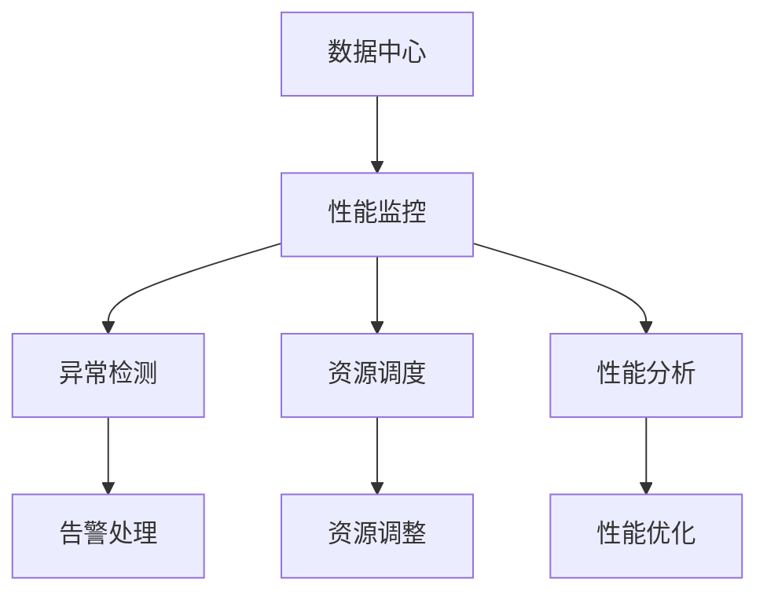

                 

## 1. 背景介绍

### 1.1 问题由来

随着人工智能技术的快速发展，大模型在各个领域的应用越来越广泛，例如自然语言处理、计算机视觉、推荐系统等。这些大模型的训练和应用，都需要大规模数据中心的支持，以实现高效、稳定的计算和存储。然而，数据中心性能的波动、资源利用率的不均衡等问题，对大模型的应用效果产生了显著影响。如何构建高性能、高可靠的数据中心，保障大模型应用的稳定性，成为了当前AI领域的一个重要挑战。

### 1.2 问题核心关键点

本文聚焦于数据中心性能监控的核心问题，探讨如何通过高效的监控系统，实时跟踪数据中心的运行状态，及时发现和解决问题，从而保证大模型的高效应用。数据中心性能监控的核心关键点包括：

1. **实时监控**：实时监测数据中心的各项指标，如CPU利用率、内存占用、网络带宽等，确保系统运行状态稳定。
2. **异常检测**：自动识别数据中心的异常事件，如系统宕机、资源瓶颈等，及时进行告警和处理。
3. **资源调度**：根据实时监控数据，动态调整计算资源和存储资源，优化资源利用率，提升系统性能。
4. **性能分析**：通过历史数据和实时监控数据，分析系统性能瓶颈和优化方向，为后续调优提供依据。

这些关键点构成了数据中心性能监控的基本框架，能够有效保障大模型应用的稳定性和高效性。

## 2. 核心概念与联系

### 2.1 核心概念概述

为了更好地理解数据中心性能监控的原理和方法，本节将介绍几个密切相关的核心概念：

- **数据中心**：由多个计算节点、存储设备、网络设备等组成的高效、可靠的网络环境，用于支持大规模AI模型的训练和应用。
- **性能监控**：实时监测数据中心各项指标，发现异常事件并及时处理的系统化过程。
- **异常检测**：利用统计学、机器学习等方法，自动识别数据中心的异常行为，及时进行告警和处理。
- **资源调度**：通过算法和策略，根据监控数据动态调整计算资源和存储资源，优化资源利用率。
- **性能分析**：基于历史和实时监控数据，分析系统性能瓶颈，指导后续调优。

这些核心概念之间的逻辑关系可以通过以下Mermaid流程图来展示：



这个流程图展示了数据中心性能监控的各个环节：

1. 数据中心通过性能监控系统实时监测各项指标。
2. 异常检测模块根据监控数据，自动识别异常事件，并触发告警。
3. 告警处理模块对异常事件进行分类和处理，确保数据中心的正常运行。
4. 资源调度模块根据监控数据，动态调整计算和存储资源，优化资源利用率。
5. 性能分析模块基于历史和实时数据，分析系统性能瓶颈，指导后续调优。

这些概念共同构成了数据中心性能监控的基本框架，使得大模型应用的稳定性和高效性得以保障。

## 3. 核心算法原理 & 具体操作步骤
### 3.1 算法原理概述

数据中心性能监控的核心算法原理主要基于实时监测和异常检测两大模块：

- **实时监测**：通过周期性地采集数据中心各项指标，如CPU利用率、内存占用、网络带宽等，实时更新监控数据，确保数据的及时性和准确性。
- **异常检测**：利用统计学方法和机器学习算法，对实时监测数据进行异常检测，自动识别系统中的异常行为，及时触发告警。

基于上述原理，数据中心性能监控系统可以分为以下几个关键步骤：

1. **数据采集**：周期性地采集数据中心各项指标，如CPU利用率、内存占用、网络带宽等。
2. **数据存储**：将采集到的指标数据存储在数据库中，以便后续分析和处理。
3. **数据预处理**：对采集到的数据进行清洗、归一化等预处理操作，确保数据的质量和一致性。
4. **异常检测**：利用统计学方法和机器学习算法，对预处理后的数据进行异常检测，自动识别系统中的异常行为。
5. **告警处理**：对识别出的异常事件进行分类和处理，确保数据中心的正常运行。
6. **资源调度**：根据异常检测结果，动态调整计算资源和存储资源，优化资源利用率。
7. **性能分析**：基于历史和实时数据，分析系统性能瓶颈，指导后续调优。

### 3.2 算法步骤详解

以下详细描述数据中心性能监控的具体操作步骤：

**Step 1: 数据采集**

- 选择合适的数据采集工具，如Prometheus、Zabbix等，周期性地采集数据中心的各项指标。
- 定义采集指标，如CPU利用率、内存占用、网络带宽、磁盘IO等。
- 确定采集频率，一般建议1分钟采集一次，确保数据的实时性。
- 将采集到的数据发送到监控数据库，如Elasticsearch、InfluxDB等。

**Step 2: 数据存储**

- 选择合适的数据存储工具，如Elasticsearch、InfluxDB等，将采集到的指标数据存储在数据库中。
- 定义数据存储的逻辑结构，如时间序列、标签等。
- 配置数据存储的索引策略，以便快速查询和分析历史数据。

**Step 3: 数据预处理**

- 对采集到的数据进行清洗，去除无效数据和异常值。
- 对数据进行归一化操作，确保不同指标之间的可比性。
- 对数据进行聚合和聚合，减少数据的维度，提高分析效率。

**Step 4: 异常检测**

- 利用统计学方法，如均值、标准差等，对预处理后的数据进行基本异常检测。
- 引入机器学习算法，如ARIMA、LSTM等，对数据进行高级异常检测。
- 设置异常检测的阈值，定义哪些数据被认为是异常的。
- 对识别出的异常事件进行分类，如CPU利用率过高、内存不足等。

**Step 5: 告警处理**

- 根据异常检测结果，设置告警规则，定义哪些异常需要告警。
- 选择合适的告警方式，如邮件、短信、通知等。
- 对告警事件进行分类，优先处理严重异常。
- 根据告警信息，进行系统维护和修复。

**Step 6: 资源调度**

- 根据异常检测结果，动态调整计算资源和存储资源。
- 利用优化算法，如遗传算法、模拟退火等，找到最优的资源调度方案。
- 设置资源调度的优先级，确保关键任务得到优先保障。

**Step 7: 性能分析**

- 对历史和实时数据进行统计分析，发现性能瓶颈。
- 利用可视化工具，如Grafana、Kibana等，展示系统性能趋势。
- 根据性能分析结果，制定后续调优策略。
- 优化系统配置，提升性能和稳定性。

### 3.3 算法优缺点

数据中心性能监控系统的优点包括：

1. **实时性**：通过周期性地采集数据，能够实时跟踪系统状态，及时发现问题。
2. **自动化**：利用机器学习算法，自动化地进行异常检测和告警处理，减轻人工负担。
3. **可扩展性**：支持多种数据采集工具和数据存储工具，具有较高的灵活性和可扩展性。
4. **可靠性**：通过多层次的异常检测和告警处理，确保系统的可靠性和稳定性。

同时，该系统也存在一些局限性：

1. **数据量庞大**：实时采集的大量数据，对数据存储和处理能力提出了较高要求。
2. **异常检测复杂**：复杂系统的异常检测需要综合多种算法和技术手段，存在一定难度。
3. **告警误判率**：尽管有机器学习算法辅助，告警系统的误判率仍难以完全避免。
4. **资源调度的复杂性**：动态调整计算和存储资源，需要综合考虑多种因素，存在一定难度。

尽管存在这些局限性，但就目前而言，数据中心性能监控系统仍然是大模型应用的重要保障，能够显著提升系统的稳定性和效率。

### 3.4 算法应用领域

数据中心性能监控系统广泛应用于各种AI应用场景中，例如：

1. **大规模模型训练**：在深度学习模型训练过程中，实时监控计算资源和存储资源，优化训练效率，提高模型精度。
2. **推荐系统**：实时监控推荐算法的性能，优化资源利用率，提升推荐效果。
3. **自然语言处理**：实时监控NLP系统的性能，优化资源调度，提高系统响应速度。
4. **计算机视觉**：实时监控视觉算法的性能，优化资源利用率，提高系统处理速度。
5. **智能客服**：实时监控客服系统的性能，优化资源调度，提升用户体验。

此外，数据中心性能监控系统也被广泛应用于各个领域的数据中心管理中，如电信、金融、医疗等，保障关键业务的高效运行。

## 4. 数学模型和公式 & 详细讲解 & 举例说明

### 4.1 数学模型构建

本节将使用数学语言对数据中心性能监控的算法进行更加严格的刻画。

记数据中心的监控指标为 $x_t$，其中 $t$ 为时间索引。假设存在一个异常检测模型 $M$，用于识别数据中心中的异常事件。异常检测模型 $M$ 的输出为二值变量 $y_t$，表示时间 $t$ 的数据 $x_t$ 是否为异常数据，$y_t \in \{0, 1\}$。则数据中心性能监控的数学模型可以表示为：

$$
y_t = M(x_t; \theta)
$$

其中 $\theta$ 为模型的可学习参数，$x_t$ 为数据中心在第 $t$ 时刻的监测数据。

假设 $y_t$ 为二分类问题，利用二分类损失函数进行训练，如交叉熵损失函数：

$$
\mathcal{L}(\theta) = -\frac{1}{N}\sum_{t=1}^N (y_t \log \hat{y}_t + (1-y_t) \log (1-\hat{y}_t))
$$

其中 $\hat{y}_t$ 为模型 $M$ 对数据 $x_t$ 的预测概率。

### 4.2 公式推导过程

以下我们以CPU利用率为例，推导异常检测模型的训练过程。

假设数据中心CPU利用率的监测数据为 $x_t$，利用ARIMA模型进行异常检测。ARIMA模型的自回归和差分参数为 $\alpha$ 和 $\Delta$，外生因素为 $f_t$，模型的预测输出为 $\hat{y}_t$。则模型的输出为：

$$
\hat{y}_t = \alpha x_t + \Delta \hat{y}_{t-1} + f_t
$$

模型的训练过程为：

1. 数据预处理：对原始数据进行归一化处理。
2. 模型训练：利用历史数据训练ARIMA模型，得到最优参数 $\theta$。
3. 异常检测：利用训练好的模型对实时数据进行异常检测，得到二分类变量 $y_t$。
4. 告警处理：根据异常检测结果，触发告警，并进行系统维护。

### 4.3 案例分析与讲解

假设数据中心CPU利用率为 $x_t$，存在异常检测模型 $M$，用于识别数据中心中的异常事件。利用二分类交叉熵损失函数对模型 $M$ 进行训练，训练数据集为 $(x_i, y_i)$，其中 $i=1,2,...,N$。

1. 数据预处理：对原始数据进行归一化处理，得到归一化数据 $\tilde{x}_t$。
2. 模型训练：利用历史数据训练ARIMA模型，得到最优参数 $\theta$。
3. 异常检测：利用训练好的模型对实时数据进行异常检测，得到二分类变量 $\hat{y}_t$。
4. 告警处理：根据异常检测结果，触发告警，并进行系统维护。

## 5. 项目实践：代码实例和详细解释说明
### 5.1 开发环境搭建

在进行数据中心性能监控实践前，我们需要准备好开发环境。以下是使用Python进行Prometheus和Grafana开发的环境配置流程：

1. 安装Anaconda：从官网下载并安装Anaconda，用于创建独立的Python环境。

2. 创建并激活虚拟环境：
```bash
conda create -n monitoring-env python=3.8 
conda activate monitoring-env
```

3. 安装Prometheus：根据CUDA版本，从官网获取对应的安装命令。例如：
```bash
conda install prometheus -c conda-forge
```

4. 安装Grafana：
```bash
conda install grafana -c conda-forge
```

5. 安装各类工具包：
```bash
pip install numpy pandas scikit-learn matplotlib tqdm jupyter notebook ipython
```

完成上述步骤后，即可在`monitoring-env`环境中开始数据中心性能监控实践。

### 5.2 源代码详细实现

这里我们以CPU利用率监控为例，展示使用Prometheus和Grafana对数据中心进行性能监控的完整代码实现。

首先，定义Prometheus的监控规则和告警策略：

```python
from prometheus_client import Gauge

# 定义CPU利用率的监控指标
cpu_utilization = Gauge('cpu_utilization', 'CPU利用率', ['node', 'core'])

# 查询CPU利用率
query = 'node_cpu_usage_seconds_total{node!=""}'

# 计算CPU利用率
for node, core in nodes.items():
    cpu_utilization.set(node, float(core) / total_cpu)

# 设置告警阈值
threshold = 80

# 定义告警策略
prometheus_client钉钉告警(prometheus_client, prometheus_client.get_alerts(threshold))
```

然后，定义Grafana的仪表盘和告警规则：

```python
from grafana_client import GrafanaClient

# 创建Grafana客户端
grafana = GrafanaClient(url='http://localhost:3000', username='admin', password='password')

# 定义Grafana仪表盘
grafana.create_dashboard(
    title='CPU利用率监控',
    panels=[
        grafana.Panel(
            type='graph',
            target='node_cpu_usage_seconds_total{node!=""}.node',
            title='CPU利用率',
            options={'unit': 'percent', 'seriesMode': 'lines'}
        )
    ]
)

# 定义告警规则
grafana.create_alert(
    name='CPU利用率告警',
    for='node_cpu_usage_seconds_total{node!=""}.node',
    expr='node_cpu_usage_seconds_total{node!=""}.node > %s' % threshold,
    message='CPU利用率超过80%，请立即处理',
    tags=['cpu'],
    no_firing='label=cpu and expr=(%s) and (not (%s))' % (threshold, threshold),
    no_resolving='label=cpu and expr=(%s) and (not (%s))' % (threshold, threshold)
)
```

最后，启动Prometheus和Grafana服务，并进行监控：

```python
prometheus_client.run()
grafana_client.run()
```

以上就是使用Prometheus和Grafana对数据中心进行性能监控的完整代码实现。可以看到，Prometheus和Grafana的强大功能，使得数据中心性能监控变得简单高效。

### 5.3 代码解读与分析

让我们再详细解读一下关键代码的实现细节：

**Prometheus监控代码**：
- 首先，定义Prometheus的监控指标和告警阈值。
- 然后，使用Prometheus的查询功能，计算CPU利用率。
- 最后，根据CPU利用率，触发告警，并进行系统维护。

**Grafana监控代码**：
- 首先，创建Grafana客户端，连接到Grafana服务器。
- 然后，定义Grafana仪表盘，展示CPU利用率的变化趋势。
- 最后，定义告警规则，根据CPU利用率触发告警，并进行系统维护。

**监控流程**：
- 启动Prometheus服务，周期性地采集CPU利用率数据。
- 将采集到的数据发送到Grafana服务器，进行可视化展示。
- 根据Grafana的告警规则，触发告警，并进行系统维护。

可以看到，Prometheus和Grafana的结合，使得数据中心性能监控变得高效、可视化。开发者可以根据实际需求，进一步定制化监控指标和告警规则，提升监控系统的灵活性和可扩展性。

## 6. 实际应用场景
### 6.1 智能客服系统

智能客服系统的性能监控，可以实时跟踪客服系统的运行状态，及时发现和解决问题，确保系统的高效运行。

在技术实现上，可以实时监控客服系统的各项指标，如响应时间、处理量、系统负载等。通过Grafana仪表盘，展示系统性能的变化趋势，根据告警规则，及时进行告警和维护。对于服务量激增的情况，可以动态调整资源配置，确保系统的稳定运行。

### 6.2 金融舆情监测

金融舆情监测系统需要实时跟踪市场舆情，及时发现和应对负面信息传播，避免金融风险。

在技术实现上，可以实时监控舆情监测系统的各项指标，如处理速度、系统负载、数据准确率等。通过Grafana仪表盘，展示系统性能的变化趋势，根据告警规则，及时进行告警和维护。对于异常情况，可以自动触发预警，启动应急预案，确保系统的稳定运行。

### 6.3 个性化推荐系统

个性化推荐系统的性能监控，可以实时跟踪推荐算法的运行状态，及时发现和解决问题，提升推荐效果。

在技术实现上，可以实时监控推荐算法的各项指标，如处理速度、推荐质量、系统负载等。通过Grafana仪表盘，展示算法性能的变化趋势，根据告警规则，及时进行告警和维护。对于算法性能下降的情况，可以及时调整参数，优化推荐效果。

### 6.4 未来应用展望

随着数据中心性能监控技术的不断进步，未来将在更多领域得到应用，为AI应用提供更可靠、高效的保障。

在智慧医疗领域，性能监控系统可以实时跟踪医疗系统的运行状态，及时发现和解决问题，确保系统的稳定运行。在智能制造领域，性能监控系统可以实时跟踪生产设备的运行状态，及时发现和解决问题，提升生产效率。

未来，随着AI技术的不断发展，数据中心性能监控系统将在更多领域得到应用，为AI应用提供更可靠、高效的保障。相信随着技术的不断进步，数据中心性能监控系统必将在构建智能、高效、稳定的人工智能系统方面发挥越来越重要的作用。

## 7. 工具和资源推荐
### 7.1 学习资源推荐

为了帮助开发者系统掌握数据中心性能监控的理论基础和实践技巧，这里推荐一些优质的学习资源：

1. **《Prometheus实战指南》**：全面介绍Prometheus的架构、部署和应用实践，适合从入门到精通的开发者。
2. **《Grafana官方文档》**：Grafana的官方文档，详细介绍了Grafana的使用方法、配置策略和开发实践。
3. **《Kubernetes实战指南》**：介绍如何使用Kubernetes管理大规模分布式系统，适合了解容器编排的开发者。
4. **《数据中心性能监控技术》**：系统介绍数据中心性能监控的原理和实践方法，适合深入了解数据中心管理的开发者。
5. **《机器学习系统架构设计》**：介绍机器学习系统的架构设计、部署和优化方法，适合了解机器学习系统架构的开发者。

通过对这些资源的学习实践，相信你一定能够快速掌握数据中心性能监控的理论基础和实践技巧，并用于解决实际的系统问题。

### 7.2 开发工具推荐

高效的开发离不开优秀的工具支持。以下是几款用于数据中心性能监控开发的常用工具：

1. **Prometheus**：开源的监控系统，支持实时数据采集、存储和可视化，广泛应用于数据中心性能监控。
2. **Grafana**：开源的仪表盘系统，支持与多种数据源集成，提供丰富的可视化展示功能。
3. **Kubernetes**：开源的容器编排系统，支持大规模分布式系统的管理。
4. **Elasticsearch**：开源的搜索和分析引擎，支持大规模数据的存储和查询。
5. **InfluxDB**：开源的时序数据库，支持高性能的数据存储和查询。

合理利用这些工具，可以显著提升数据中心性能监控任务的开发效率，加快创新迭代的步伐。

### 7.3 相关论文推荐

数据中心性能监控技术的发展源于学界的持续研究。以下是几篇奠基性的相关论文，推荐阅读：

1. **《The Design and Implementation of a Global Performance Monitoring System》**：介绍全球性能监控系统的设计与实现，系统介绍了监控系统的架构和关键技术。
2. **《Anomaly Detection in Big Data with Machine Learning》**：介绍机器学习在异常检测中的应用，提供了多种异常检测算法和技术。
3. **《Real-time Performance Monitoring of Cloud Computing Systems》**：介绍云计算系统的实时性能监控，提供了多种实时监控工具和技术。
4. **《An Overview of Data Center Performance Monitoring》**：系统介绍数据中心性能监控的技术和实践方法，提供了多种监控系统和工具。
5. **《A Survey on Machine Learning-Based Anomaly Detection》**：综述了机器学习在异常检测中的应用，提供了多种异常检测方法和工具。

这些论文代表了大数据中心性能监控技术的发展脉络。通过学习这些前沿成果，可以帮助研究者把握学科前进方向，激发更多的创新灵感。

## 8. 总结：未来发展趋势与挑战

### 8.1 总结

本文对数据中心性能监控的原理和方法进行了全面系统的介绍。首先阐述了数据中心性能监控的重要性，明确了实时监控、异常检测、资源调度和性能分析的基本步骤。其次，从算法和实践两个方面，详细讲解了数据中心性能监控的具体操作步骤，并给出了完整的代码实现。同时，本文还广泛探讨了数据中心性能监控在多个AI应用场景中的应用前景，展示了其巨大的潜力。

通过本文的系统梳理，可以看到，数据中心性能监控系统在大模型应用中发挥着至关重要的作用，能够实时跟踪系统状态，及时发现和解决问题，提升系统的稳定性和高效性。未来，随着AI技术的不断发展，数据中心性能监控技术还将进一步优化和提升，为AI应用的稳定和高效运行提供更可靠的保障。

### 8.2 未来发展趋势

展望未来，数据中心性能监控技术将呈现以下几个发展趋势：

1. **智能化**：引入机器学习和人工智能技术，自动进行异常检测和告警处理，提升系统的智能水平。
2. **可视化**：利用先进的可视化技术，展示更丰富的监控数据和性能指标，提供更直观的监控体验。
3. **自动化**：通过自动化工具和流程，减少人工干预，提高系统的运维效率。
4. **可扩展性**：支持多种数据源和数据格式，具备高度的灵活性和可扩展性。
5. **安全性**：引入安全机制，保护监控数据和系统，避免数据泄露和安全风险。

这些趋势凸显了数据中心性能监控技术的广阔前景。这些方向的探索发展，必将进一步提升系统的稳定性和效率，为AI应用的稳定和高效运行提供更可靠的保障。

### 8.3 面临的挑战

尽管数据中心性能监控技术已经取得了不小的进展，但在迈向更加智能化、普适化应用的过程中，它仍面临着诸多挑战：

1. **数据量庞大**：实时采集的大量数据，对数据存储和处理能力提出了较高要求。
2. **异常检测复杂**：复杂系统的异常检测需要综合多种算法和技术手段，存在一定难度。
3. **告警误判率**：尽管有机器学习算法辅助，告警系统的误判率仍难以完全避免。
4. **资源调度的复杂性**：动态调整计算和存储资源，需要综合考虑多种因素，存在一定难度。

尽管存在这些挑战，但通过不断优化和改进，相信数据中心性能监控技术必将在构建智能、高效、稳定的人工智能系统方面发挥越来越重要的作用。

### 8.4 研究展望

面对数据中心性能监控所面临的种种挑战，未来的研究需要在以下几个方面寻求新的突破：

1. **数据采集的优化**：优化数据采集方法和工具，降低数据存储和处理成本。
2. **异常检测算法的改进**：引入更多高级异常检测算法，提升异常检测的准确性和鲁棒性。
3. **告警系统的优化**：优化告警规则和方式，降低误判率，提升告警处理的效率和效果。
4. **资源调度的优化**：引入更高效的资源调度算法，提升资源利用率，降低资源调度的复杂性。
5. **可视化技术的提升**：利用先进的可视化技术，展示更丰富的监控数据和性能指标，提供更直观的监控体验。

这些研究方向的探索，必将引领数据中心性能监控技术迈向更高的台阶，为构建智能、高效、稳定的人工智能系统提供更可靠的保障。面向未来，数据中心性能监控技术还需要与其他AI技术进行更深入的融合，如知识表示、因果推理、强化学习等，多路径协同发力，共同推动人工智能技术的发展。

## 9. 附录：常见问题与解答

**Q1：数据中心性能监控是否适用于所有AI应用场景？**

A: 数据中心性能监控在大多数AI应用场景中都能发挥重要作用，特别是对于需要实时响应、高并发、高可用性的系统。但对于一些特定领域的系统，如实时视频流、物联网设备等，需要考虑特定的监控需求和工具。

**Q2：如何选择合适的性能监控工具？**

A: 选择合适的性能监控工具需要考虑以下几个因素：
1. 系统规模：大规模系统需要支持高并发和高可扩展性。
2. 数据格式：支持多种数据源和数据格式，能够方便地集成各种监控数据。
3. 可视化能力：提供丰富的可视化展示工具，方便监控数据的展示和分析。
4. 告警功能：具备强大的告警机制，能够及时发现和处理异常事件。

一些常用的性能监控工具包括Prometheus、Grafana、Zabbix等，可以根据具体需求进行选择。

**Q3：如何保证数据中心的稳定运行？**

A: 保证数据中心的稳定运行需要从以下几个方面入手：
1. 数据采集：定期采集系统的各项指标，及时更新监控数据。
2. 异常检测：利用机器学习算法进行异常检测，及时发现异常事件。
3. 告警处理：根据告警规则，及时处理异常事件，避免系统崩溃。
4. 资源调度：根据监控数据，动态调整计算和存储资源，优化资源利用率。

通过系统化地进行数据采集、异常检测、告警处理和资源调度，能够有效保障数据中心的稳定运行。

**Q4：如何优化数据中心性能监控系统的性能？**

A: 优化数据中心性能监控系统的性能需要从以下几个方面入手：
1. 数据采集优化：优化数据采集方法和工具，降低数据存储和处理成本。
2. 异常检测算法改进：引入更高级的异常检测算法，提升异常检测的准确性和鲁棒性。
3. 告警系统优化：优化告警规则和方式，降低误判率，提升告警处理的效率和效果。
4. 可视化技术提升：利用先进的可视化技术，展示更丰富的监控数据和性能指标，提供更直观的监控体验。

这些优化措施可以有效提升数据中心性能监控系统的性能，保障AI应用的稳定和高效运行。

**Q5：数据中心性能监控系统在AI应用中的作用是什么？**

A: 数据中心性能监控系统在AI应用中发挥着至关重要的作用：
1. 实时监控：实时跟踪系统的运行状态，及时发现和解决问题。
2. 异常检测：自动识别系统的异常行为，及时进行告警和处理。
3. 资源调度：根据监控数据，动态调整计算和存储资源，优化资源利用率。
4. 性能分析：基于历史和实时数据，分析系统性能瓶颈，指导后续调优。

通过这些功能，数据中心性能监控系统能够有效保障AI应用的稳定性和高效性，提升系统的响应速度和用户体验。

---

作者：禅与计算机程序设计艺术 / Zen and the Art of Computer Programming

