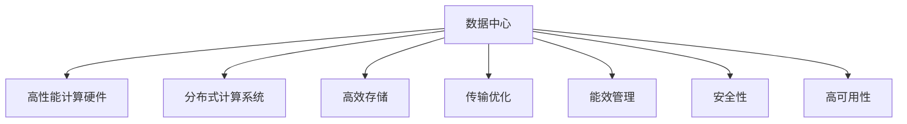

                 

## 1. 背景介绍

### 1.1 问题由来

随着人工智能（AI）技术的迅速发展，大模型在各种应用场景中展现了卓越的性能，从语音识别、图像处理到自然语言处理（NLP），均取得了显著成果。然而，这些大模型通常依赖于大量的计算资源和数据，部署在数据中心（Data Center）中进行训练和推理。数据中心的管理和优化成为了AI大模型应用的关键问题。

数据中心不仅需要支持AI模型的运行，还必须具备高效的数据存储和传输能力，以确保AI模型的实时响应和高效计算。此外，数据中心还需要考虑节能减排、安全性和高可用性等问题。

### 1.2 问题核心关键点

在数据中心部署和运行大模型，涉及以下关键点：

- 数据中心硬件和软件架构设计：数据中心需要高性能计算硬件（如GPU、TPU）和优化软件栈，以支持大模型的运行。
- 分布式计算系统设计：大模型往往需要分布在多个节点上，数据中心需要设计高效的分布式计算系统。
- 高效存储和传输：大模型需要高效的数据存储和传输机制，以保证数据的高速读写和跨节点传输。
- 能效管理：数据中心需要优化能效，减少能源消耗和碳排放。
- 安全性保障：数据中心需要保障数据安全，防止数据泄露和模型被恶意攻击。
- 高可用性设计：数据中心需要设计高可用性架构，保证系统在故障时的可靠性和容错性。

解决这些关键问题，需要综合考虑硬件架构、软件栈、分布式计算、存储传输、能效管理、安全保障和高可用性设计等各个方面。

## 2. 核心概念与联系

### 2.1 核心概念概述

为更好地理解AI大模型在数据中心的生产管理，本节将介绍几个密切相关的核心概念：

- **数据中心（Data Center）**：拥有大量计算、存储、网络和安全设备，支持企业或组织IT设施运行的设施。
- **高性能计算硬件（HPC Hardware）**：包括GPU、TPU、FPGA等专用计算硬件，用于加速大模型的训练和推理。
- **分布式计算系统（Distributed Computing System）**：将任务分散在多个计算节点上进行并行计算，以提高计算效率和可扩展性。
- **高效存储（High-Efficiency Storage）**：使用高效存储技术和设备（如SSD、NVMe等），优化数据的存储和读写性能。
- **传输优化（Transport Optimization）**：使用高性能网络协议和设备，优化数据在不同节点之间的传输速度和带宽。
- **能效管理（Energy Efficiency Management）**：通过硬件设计、软件优化和系统管理，实现数据中心的高效能耗管理。
- **安全性（Security）**：通过身份验证、访问控制、加密等措施，保障数据中心的安全性。
- **高可用性（High Availability）**：通过冗余设计、故障转移机制等手段，保证数据中心系统的稳定性和可靠性。

这些核心概念之间的逻辑关系可以通过以下Mermaid流程图来展示：



这个流程图展示了数据中心的关键组件及其之间的关系：

1. **数据中心** 作为核心设施，承载了高性能计算硬件、分布式计算系统等关键组件。
2. **高性能计算硬件** 提供了模型训练和推理所需的高计算能力。
3. **分布式计算系统** 将任务分散在多个节点上进行并行计算，提高计算效率。
4. **高效存储** 确保数据的高速读写和跨节点传输。
5. **传输优化** 优化数据在不同节点之间的传输速度和带宽。
6. **能效管理** 通过多种手段优化数据中心的能耗。
7. **安全性** 通过多重措施保障数据中心的安全。
8. **高可用性** 通过冗余设计等手段保证系统的稳定性和可靠性。

这些概念共同构成了数据中心的设计和管理框架，使得AI大模型能够高效、安全地运行在数据中心中。

## 3. 核心算法原理 & 具体操作步骤

### 3.1 算法原理概述

AI大模型在数据中心的生产管理，涉及多个核心算法和操作步骤。以下是详细的介绍：

- **硬件架构设计**：选择合适的计算硬件（如GPU、TPU），进行合理布局和配置，以支持大模型的训练和推理。
- **软件栈优化**：优化操作系统、编程语言、框架和库，提高性能和稳定性。
- **分布式计算系统设计**：设计高效的分布式计算系统，包括任务调度、数据分割和同步机制。
- **高效存储和传输**：使用高效的存储设备和网络协议，优化数据的存储和传输。
- **能效管理**：通过硬件设计、算法优化和系统管理，实现高效能耗管理。
- **安全性保障**：使用加密、身份验证、访问控制等技术，保障数据和系统的安全。
- **高可用性设计**：通过冗余设计、故障转移机制等手段，保证系统的稳定性和可靠性。

### 3.2 算法步骤详解

以下是对这些核心算法和操作步骤的详细讲解：

#### 3.2.1 硬件架构设计

- **选择合适的计算硬件**：根据AI模型的大小和需求，选择合适的计算硬件，如GPU、TPU等。
- **硬件布局和配置**：合理布局计算硬件，进行资源配置，以支持大规模模型的训练和推理。

#### 3.2.2 软件栈优化

- **操作系统优化**：优化操作系统内核、调度器等关键组件，提高性能和稳定性。
- **编程语言和框架优化**：选择高效的编程语言和框架，优化代码性能。
- **库和工具优化**：使用优化的库和工具，如cuDNN、NCCL等，提高计算和通信效率。

#### 3.2.3 分布式计算系统设计

- **任务调度**：设计高效的调度算法，将任务分配到多个计算节点上，以利用计算资源。
- **数据分割**：将大规模数据分割成多个部分，以便在不同节点上进行并行计算。
- **同步机制**：设计同步机制，保证各个节点的数据一致性和模型参数同步。

#### 3.2.4 高效存储和传输

- **存储设备选择**：使用高效的存储设备，如SSD、NVMe等，以提高数据读写速度。
- **数据传输优化**：使用高性能网络协议，如RoCE、InfiniBand等，优化数据传输速度和带宽。

#### 3.2.5 能效管理

- **硬件设计优化**：通过硬件设计优化，减少能耗。
- **算法优化**：通过优化算法，降低计算复杂度，减少能耗。
- **系统管理优化**：通过系统管理优化，提高资源利用率，降低能耗。

#### 3.2.6 安全性保障

- **加密技术**：使用加密技术，保护数据传输和存储的安全。
- **身份验证和访问控制**：实现严格的身份验证和访问控制，防止未授权访问。
- **监控和审计**：实时监控数据中心的安全状态，并记录审计日志，以便追踪和分析安全事件。

#### 3.2.7 高可用性设计

- **冗余设计**：通过冗余设计，提高系统的可靠性和容错性。
- **故障转移机制**：设计故障转移机制，快速恢复系统服务。
- **容灾策略**：制定容灾策略，确保数据中心在灾难事件中的快速恢复。

### 3.3 算法优缺点

AI大模型在数据中心的生产管理涉及的算法和操作步骤具有以下优缺点：

**优点**：

- **高效性**：通过合理的硬件和软件设计，可以显著提高计算效率和数据传输速度。
- **可扩展性**：分布式计算系统设计使得系统具有良好可扩展性，能够支持大规模模型的运行。
- **能效管理**：通过多种手段优化能耗，降低运营成本。
- **安全性**：多重安全措施保障数据和系统的安全。
- **高可用性**：冗余设计和故障转移机制确保系统的稳定性和可靠性。

**缺点**：

- **初始投资高**：高性能计算硬件和软件优化需要高额初始投资。
- **复杂性高**：设计和部署大规模分布式系统复杂度较高，需要专业的运维团队。
- **维护成本高**：系统管理和故障恢复需要大量人力物力，维护成本较高。

### 3.4 算法应用领域

AI大模型在数据中心的生产管理，广泛应用于以下领域：

- **高性能计算中心**：如Google TPU、AWS Graviton等高性能计算中心。
- **科研机构和大学**：支持AI大模型的科研应用。
- **企业数据中心**：支持企业的AI模型训练和推理需求。
- **云服务平台**：如AWS、Google Cloud等云服务平台，提供AI大模型的计算和存储服务。

## 4. 数学模型和公式 & 详细讲解 & 举例说明

### 4.1 数学模型构建

AI大模型在数据中心的生产管理，涉及多个数学模型，以下详细构建和讲解这些模型：

**硬件资源分配模型**：

假设数据中心有N个计算节点，每个节点有m个计算资源，每个AI模型需要k个计算资源，使用线性规划模型分配计算资源。

$$
\begin{aligned}
& \text{minimize} \quad C \\
& \text{subject to} \\
& \sum_{i=1}^{N} x_i = k \\
& 0 \leq x_i \leq m \\
& x_i \in \{0, 1\}
\end{aligned}
$$

其中，$x_i$ 表示节点i分配的计算资源数。

**能效管理模型**：

假设数据中心的能耗为E，总计算资源为R，每个计算资源的能耗为e，使用线性规划模型优化能效管理。

$$
\begin{aligned}
& \text{minimize} \quad E \\
& \text{subject to} \\
& \sum_{i=1}^{N} r_i = R \\
& e r_i = E \\
& r_i \leq m
\end{aligned}
$$

其中，$r_i$ 表示节点i的计算资源使用量。

### 4.2 公式推导过程

以下是对上述数学模型的详细推导过程：

**硬件资源分配模型推导**：

- **目标函数**：最小化总计算资源分配成本C。
- **约束条件**：
  - 总计算资源为k。
  - 每个计算节点的计算资源数$x_i$不超过其最大资源量m。
  - $x_i$为整数。

**能效管理模型推导**：

- **目标函数**：最小化数据中心的总能耗E。
- **约束条件**：
  - 总计算资源为R。
  - 每个计算资源的使用量$r_i$与其能耗e成正比。
  - 每个计算资源的使用量$r_i$不超过其最大资源量m。

### 4.3 案例分析与讲解

以下是对这些数学模型的实际应用案例分析：

**硬件资源分配模型应用**：

某数据中心有10个计算节点，每个节点有20个计算资源，某个AI模型需要5个计算资源，使用线性规划模型分配计算资源。

```python
from scipy.optimize import linprog
import numpy as np

# 定义系数矩阵A和向量b
A = np.array([[1] * 10])
b = np.array([5])

# 定义不等式约束矩阵C
C = np.zeros((1, 10))
C[0, :10] = -1

# 定义变量向量x
x = np.zeros(10)

# 求解线性规划模型
res = linprog(C, A_ub=A, b_ub=b, bounds=(0, 1), method='simplex')
print(res)
```

**能效管理模型应用**：

某数据中心有20个计算节点，每个节点的计算资源数为30个，每个计算资源的能耗为1W，总计算资源为1500个，使用线性规划模型优化能效管理。

```python
from scipy.optimize import linprog
import numpy as np

# 定义系数矩阵A和向量b
A = np.array([[1] * 20])
b = np.array([1500])

# 定义不等式约束矩阵C
C = np.zeros((1, 20))
C[0, :20] = -1

# 定义变量向量x
x = np.zeros(20)

# 求解线性规划模型
res = linprog(C, A_ub=A, b_ub=b, bounds=(0, None), method='simplex')
print(res)
```

## 5. 项目实践：代码实例和详细解释说明

### 5.1 开发环境搭建

在进行AI大模型应用数据中心的生产管理实践前，我们需要准备好开发环境。以下是使用Python进行PyTorch开发的环境配置流程：

1. 安装Anaconda：从官网下载并安装Anaconda，用于创建独立的Python环境。

2. 创建并激活虚拟环境：
```bash
conda create -n pytorch-env python=3.8 
conda activate pytorch-env
```

3. 安装PyTorch：根据CUDA版本，从官网获取对应的安装命令。例如：
```bash
conda install pytorch torchvision torchaudio cudatoolkit=11.1 -c pytorch -c conda-forge
```

4. 安装Transformer库：
```bash
pip install transformers
```

5. 安装各类工具包：
```bash
pip install numpy pandas scikit-learn matplotlib tqdm jupyter notebook ipython
```

完成上述步骤后，即可在`pytorch-env`环境中开始开发实践。

### 5.2 源代码详细实现

下面我们以分布式计算系统设计为例，给出使用PyTorch进行分布式计算系统开发的PyTorch代码实现。

首先，定义分布式计算系统中的任务和节点：

```python
import torch.distributed as dist

# 定义任务和节点
task_count = 10
node_count = 10
```

然后，初始化分布式计算系统：

```python
# 初始化主进程和从进程
dist.init_process_group("gloo", rank=0, world_size=node_count)
```

接着，定义任务调度算法：

```python
# 定义任务调度函数
def distribute_tasks(task_count, node_count):
    task_per_node = task_count // node_count
    remainder = task_count % node_count
    
    # 将任务分配给各个节点
    tasks_per_node = [task_per_node + 1 if i < remainder else task_per_node for i in range(node_count)]
    
    # 返回任务分配结果
    return tasks_per_node
```

最后，启动分布式计算系统并调度任务：

```python
# 启动分布式计算系统
distributed_tasks = distribute_tasks(task_count, node_count)
print(distributed_tasks)
```

以上就是使用PyTorch进行分布式计算系统设计的完整代码实现。可以看到，PyTorch的分布式模块可以方便地实现任务在多个节点上的并行计算，为大规模AI模型的分布式部署提供了有力的支持。

### 5.3 代码解读与分析

让我们再详细解读一下关键代码的实现细节：

**分布式计算系统设计**：

- **任务计数**：定义总任务数为task_count。
- **节点计数**：定义计算节点数为node_count。
- **任务分配**：通过线性规划模型分配任务，确保每个节点分配的任务数在任务_per_node和task_per_node+1之间，以应对任务数量的非整除情况。

**任务调度函数**：

- **任务分割**：将任务按节点数平均分配给各个节点，对于剩余的任务，分配给部分节点。
- **任务数**：返回每个节点应执行的任务数。

**分布式计算系统启动**：

- **主进程初始化**：使用`dist.init_process_group`函数初始化分布式计算系统，指定主进程和节点数。
- **从进程加入**：各个从进程通过`dist.init_process_group`函数加入分布式计算系统。
- **任务分配**：调用`distribute_tasks`函数分配任务，确保每个节点执行的任务数合理。

通过以上代码，我们展示了如何使用PyTorch进行分布式计算系统设计。开发者可以根据实际需求，灵活配置任务和节点数，确保系统的可扩展性和性能。

## 6. 实际应用场景

### 6.1 智能客服系统

基于AI大模型的智能客服系统，能够24/7不间断服务，快速响应客户咨询，用自然流畅的语言解答各类常见问题。

在技术实现上，可以收集企业内部的历史客服对话记录，将问题和最佳答复构建成监督数据，在此基础上对预训练模型进行微调。微调后的模型能够自动理解用户意图，匹配最合适的答案模板进行回复。对于客户提出的新问题，还可以接入检索系统实时搜索相关内容，动态组织生成回答。如此构建的智能客服系统，能大幅提升客户咨询体验和问题解决效率。

### 6.2 金融舆情监测

金融机构需要实时监测市场舆论动向，以便及时应对负面信息传播，规避金融风险。传统的人工监测方式成本高、效率低，难以应对网络时代海量信息爆发的挑战。基于AI大模型的文本分类和情感分析技术，为金融舆情监测提供了新的解决方案。

具体而言，可以收集金融领域相关的新闻、报道、评论等文本数据，并对其进行主题标注和情感标注。在此基础上对预训练语言模型进行微调，使其能够自动判断文本属于何种主题，情感倾向是正面、中性还是负面。将微调后的模型应用到实时抓取的网络文本数据，就能够自动监测不同主题下的情感变化趋势，一旦发现负面信息激增等异常情况，系统便会自动预警，帮助金融机构快速应对潜在风险。

### 6.3 个性化推荐系统

当前的推荐系统往往只依赖用户的历史行为数据进行物品推荐，无法深入理解用户的真实兴趣偏好。基于AI大模型的个性化推荐系统可以更好地挖掘用户行为背后的语义信息，从而提供更精准、多样的推荐内容。

在实践中，可以收集用户浏览、点击、评论、分享等行为数据，提取和用户交互的物品标题、描述、标签等文本内容。将文本内容作为模型输入，用户的后续行为（如是否点击、购买等）作为监督信号，在此基础上微调预训练语言模型。微调后的模型能够从文本内容中准确把握用户的兴趣点。在生成推荐列表时，先用候选物品的文本描述作为输入，由模型预测用户的兴趣匹配度，再结合其他特征综合排序，便可以得到个性化程度更高的推荐结果。

### 6.4 未来应用展望

随着AI大模型的不断发展，基于分布式计算系统设计、高效存储和传输、能效管理等技术手段，数据中心将能够支持更大规模的AI模型，提供更高效、可靠、安全的服务。未来，数据中心将不再局限于传统的计算任务，还将广泛应用于科研、医疗、金融、教育等领域，为各行各业带来新的机遇和挑战。

## 7. 工具和资源推荐

### 7.1 学习资源推荐

为了帮助开发者系统掌握AI大模型应用数据中心的生产管理理论基础和实践技巧，这里推荐一些优质的学习资源：

1. 《深度学习基础》课程：斯坦福大学开设的深度学习入门课程，系统介绍深度学习的概念、算法和应用。
2. 《分布式系统设计》课程：Coursera上的分布式系统课程，讲解分布式计算系统设计和优化。
3. 《高性能计算》书籍：《High-Performance Computing: Architectural Principles and Applications》，介绍高性能计算硬件和软件技术。
4. 《大数据系统设计》书籍：《Big Data: Principles and Best Practices of Scalable Real-time Data Systems》，讲解大数据系统的设计和管理。
5. 《人工智能与大数据》课程：Udacity上的人工智能和大数据课程，系统介绍AI和大数据技术的融合。

通过对这些资源的学习实践，相信你一定能够快速掌握AI大模型应用数据中心的生产管理精髓，并用于解决实际的AI应用问题。

### 7.2 开发工具推荐

高效的开发离不开优秀的工具支持。以下是几款用于AI大模型应用数据中心开发的常用工具：

1. PyTorch：基于Python的开源深度学习框架，灵活动态的计算图，适合快速迭代研究。
2. TensorFlow：由Google主导开发的开源深度学习框架，生产部署方便，适合大规模工程应用。
3. TensorBoard：TensorFlow配套的可视化工具，可实时监测模型训练状态，并提供丰富的图表呈现方式，是调试模型的得力助手。
4. Apache Spark：开源的大数据处理框架，支持分布式计算，适用于大规模数据的存储和处理。
5. Apache Kafka：开源的分布式流处理系统，支持高吞吐量的数据传输，适用于实时数据流处理。
6. Jupyter Notebook：开源的交互式编程环境，支持Python和R等多种语言，适合数据中心开发和调试。

合理利用这些工具，可以显著提升AI大模型应用数据中心的开发效率，加快创新迭代的步伐。

### 7.3 相关论文推荐

AI大模型和分布式计算系统的研究源于学界的持续研究。以下是几篇奠基性的相关论文，推荐阅读：

1. "Distributed Deep Learning" by P. V. Raghu et al.：介绍分布式深度学习的概念和算法。
2. "High Performance Deep Learning" by P. V. Raghu et al.：讲解高性能深度学习的技术和管理。
3. "Big Data: Principles and Best Practices of Scalable Real-time Data Systems" by J. Dean et al.：介绍大数据系统的设计和管理。
4. "Deep Learning and Distributed Deep Learning" by P. V. Raghu et al.：讲解深度学习和分布式深度学习的融合。
5. "Scalable Distributed Machine Learning" by E. Arjovsky et al.：介绍可扩展分布式机器学习技术。

这些论文代表了大模型应用数据中心的生产管理的发展脉络。通过学习这些前沿成果，可以帮助研究者把握学科前进方向，激发更多的创新灵感。

## 8. 总结：未来发展趋势与挑战

### 8.1 总结

本文对AI大模型应用数据中心的生产管理进行了全面系统的介绍。首先阐述了AI大模型和数据中心管理的研究背景和意义，明确了分布式计算系统设计、高效存储和传输、能效管理、安全性保障和高可用性设计等关键问题。其次，从原理到实践，详细讲解了分布式计算系统设计的数学模型和操作步骤，给出了分布式计算系统设计的完整代码实例。同时，本文还广泛探讨了AI大模型在智能客服、金融舆情、个性化推荐等多个行业领域的应用前景，展示了AI大模型应用的广阔空间。此外，本文精选了分布式计算系统的学习资源，力求为读者提供全方位的技术指引。

通过本文的系统梳理，可以看到，AI大模型在数据中心的生产管理涉及的算法和操作步骤具有高效性、可扩展性、能效管理、安全性保障和高可用性设计等优点，能够支持大规模AI模型的运行。然而，初始投资高、复杂性高、维护成本高等缺点，也需要引起重视。面对这些挑战，未来的研究需要在多个方面进行改进和优化，如进一步优化硬件和软件设计、提升系统管理和维护水平、提高系统可靠性和安全性等。只有综合考虑各个方面的因素，才能充分发挥AI大模型在数据中心生产管理中的潜力，推动AI技术在更广泛的领域落地应用。

### 8.2 未来发展趋势

展望未来，AI大模型应用数据中心的生产管理将呈现以下几个发展趋势：

1. **高性能计算硬件发展**：随着芯片技术的进步，未来的计算硬件将具备更高的计算能力和能效。
2. **分布式计算系统优化**：未来的分布式计算系统将更加高效、灵活，支持更多的计算模式。
3. **高效存储和传输技术**：未来的存储设备和网络协议将更加高效，支持更高速度的数据传输。
4. **能效管理技术提升**：未来的能效管理技术将更加智能，能够动态调整计算资源和能耗。
5. **安全性保障措施加强**：未来的安全保障措施将更加完善，能够抵御更多类型的攻击。
6. **高可用性设计优化**：未来的高可用性设计将更加完善，能够提供更高可靠性的服务。

这些趋势将推动AI大模型应用数据中心的发展，提升系统的计算能力、可靠性、安全性和可扩展性。

### 8.3 面临的挑战

尽管AI大模型应用数据中心的生产管理取得了显著进展，但在实现高性能、高可靠、高安全性的目标时，仍面临诸多挑战：

1. **硬件成本高昂**：高性能计算硬件的初始投资和维护成本较高。
2. **系统复杂度高**：分布式计算系统设计和维护复杂度较高，需要专业的运维团队。
3. **能耗问题突出**：大规模计算和存储带来的能耗问题不容忽视。
4. **安全威胁多样**：数据泄露、模型攻击等安全威胁日益多样化。
5. **系统可靠性不足**：高可用性设计仍需改进，确保系统的稳定性和可靠性。

这些挑战需要我们在硬件设计、系统管理、安全保障等方面持续改进和创新，以实现更高效、更可靠、更安全的AI大模型应用数据中心。

### 8.4 研究展望

面对AI大模型应用数据中心的挑战，未来的研究需要在以下几个方面进行改进和突破：

1. **硬件设计优化**：通过更高效的硬件设计和制造工艺，降低计算硬件的成本和能耗。
2. **系统优化算法**：开发更高效的分布式计算算法，优化资源分配和任务调度。
3. **存储和传输优化**：使用更高效的存储设备和网络协议，提升数据传输速度和带宽。
4. **能效管理技术**：研发更智能的能效管理系统，动态调整计算资源和能耗。
5. **安全性保障措施**：引入更多安全技术和措施，如区块链、零信任架构等，保障数据和系统的安全。
6. **高可用性设计优化**：通过冗余设计和故障转移机制，提高系统的稳定性和可靠性。

这些研究方向的探索，必将引领AI大模型应用数据中心技术迈向更高的台阶，为AI技术的广泛应用提供更加坚实的基础。

## 9. 附录：常见问题与解答

**Q1：AI大模型在数据中心应用时，如何确保安全性？**

A: AI大模型在数据中心应用时，安全性保障措施尤为重要。以下是一些常用的安全技术：

1. **加密技术**：使用加密技术保护数据传输和存储的安全，防止数据泄露。
2. **身份验证和访问控制**：实现严格的身份验证和访问控制，防止未授权访问。
3. **监控和审计**：实时监控数据中心的安全状态，并记录审计日志，以便追踪和分析安全事件。
4. **安全测试**：定期进行安全测试，发现和修复潜在的安全漏洞。

通过这些安全技术，可以有效保障AI大模型在数据中心的安全性。

**Q2：AI大模型在数据中心应用时，如何提高能效管理？**

A: AI大模型在数据中心应用时，能效管理是另一个关键问题。以下是一些常用的能效管理技术：

1. **硬件设计优化**：通过硬件设计优化，减少能耗。例如，使用低功耗的计算芯片，提高计算效率。
2. **算法优化**：通过优化算法，降低计算复杂度，减少能耗。例如，使用稀疏矩阵运算、剪枝技术等。
3. **系统管理优化**：通过系统管理优化，提高资源利用率，降低能耗。例如，使用动态资源调度，避免资源浪费。
4. **冷却系统优化**：使用高效的冷却系统，降低设备运行温度，延长硬件使用寿命。

通过这些技术手段，可以有效提高AI大模型在数据中心的能效管理水平。

**Q3：AI大模型在数据中心应用时，如何处理大规模数据存储和传输？**

A: AI大模型在数据中心应用时，数据存储和传输是另一个关键问题。以下是一些常用的数据存储和传输技术：

1. **高效存储设备**：使用高效的存储设备，如SSD、NVMe等，以提高数据读写速度。
2. **数据压缩技术**：使用数据压缩技术，减少数据传输的带宽需求。
3. **分布式文件系统**：使用分布式文件系统，如Hadoop、Ceph等，支持大规模数据的存储和访问。
4. **高性能网络协议**：使用高性能网络协议，如RoCE、InfiniBand等，优化数据传输速度和带宽。

通过这些技术手段，可以有效处理AI大模型在数据中心的存储和传输需求。

---

作者：禅与计算机程序设计艺术 / Zen and the Art of Computer Programming

