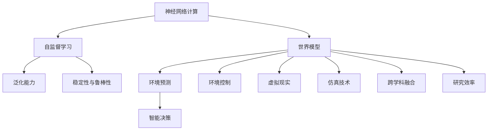

                 

# AI 神经网络计算艺术之禅：世界模型——建立自然环境的物理模型

> 关键词：神经网络计算, 物理模型, 人工智能, 自然环境, 预测, 模拟, 物理系统

## 1. 背景介绍

### 1.1 问题由来
随着人工智能(AI)技术的迅猛发展，神经网络(Neural Networks)已经广泛应用于图像识别、自然语言处理、语音识别等诸多领域，并取得了显著的成果。然而，对于建立自然环境的物理模型，神经网络的应用却相对较少，主要原因在于自然环境的多变性和复杂性，传统的物理模型往往难以刻画。近年来，基于神经网络的世界模型（World Model）方法逐渐兴起，为复杂物理系统的建模和模拟提供了新的思路。

世界模型旨在通过神经网络对自然环境进行建模，使AI能够理解并预测环境的物理特性，从而支持各种智能决策和控制任务。其核心思想是利用大量的观测数据，通过自监督学习的方式，构建一个能够反映自然环境物理规律的神经网络模型。

### 1.2 问题核心关键点
世界模型的关键点在于：
1. **数据采集**：获取大量环境观测数据，覆盖不同时间和空间尺度。
2. **模型构建**：设计合适的神经网络架构，将观测数据映射到模型参数。
3. **自监督学习**：利用观测数据和环境约束，进行无监督学习，发现环境物理规律。
4. **泛化能力**：确保模型具有足够的泛化能力，能够在未见过的场景中做出准确的预测。
5. **稳定性和鲁棒性**：模型需要具备良好的稳定性和鲁棒性，避免因数据噪声和模型过拟合导致的失效。

### 1.3 问题研究意义
研究世界模型，对于拓展AI在复杂物理系统中的应用，提升环境预测和模拟的准确性，具有重要的理论和实践意义：

1. **提升环境预测准确性**：通过建立环境物理模型，AI可以更加准确地预测环境变化，支持智能决策。
2. **优化环境控制策略**：智能体可以依据环境模型，调整行为策略，优化资源使用，提升控制效率。
3. **支持虚拟现实和仿真**：世界模型可以用于构建虚拟环境，支持虚拟现实和仿真技术的发展。
4. **促进跨学科融合**：结合物理学、计算机科学、数据科学等多学科知识，推动人工智能的跨领域应用。
5. **提高研究效率**：通过建立环境模型，研究人员可以更加高效地进行实验和验证，降低成本。

## 2. 核心概念与联系

### 2.1 核心概念概述

为更好地理解世界模型方法，本节将介绍几个密切相关的核心概念：

- **神经网络计算(Neural Network Computation)**：通过神经元之间的连接和激活函数，对输入数据进行加权求和、非线性变换，最终输出结果。
- **世界模型(World Model)**：利用神经网络对自然环境进行建模，使AI能够理解和预测环境的物理规律。
- **自监督学习(Self-Supervised Learning)**：利用数据本身的特征和结构，进行无监督学习，发现数据之间的内在关系。
- **泛化能力(Generalization)**：模型在未见过的数据上同样表现良好，能够处理新数据和变化的环境。
- **稳定性和鲁棒性(Stability and Robustness)**：模型能够在数据噪声和环境变化下保持稳定的输出。

这些核心概念之间的逻辑关系可以通过以下Mermaid流程图来展示：



这个流程图展示了一些关键概念之间的关系：

1. 神经网络计算提供了一种通用的数据处理方式。
2. 世界模型通过自监督学习构建环境模型，提升泛化能力。
3. 自监督学习依赖稳定性与鲁棒性，确保模型可靠。
4. 世界模型支持环境预测、智能决策、环境控制、虚拟现实、仿真技术、跨学科融合等应用。
5. 世界模型提升研究效率，推动科学进步。

## 3. 核心算法原理 & 具体操作步骤
### 3.1 算法原理概述

世界模型基于神经网络构建，其核心算法包括：

1. **自监督学习**：利用环境观测数据进行无监督训练，发现环境物理规律。
2. **模型预测**：通过训练好的模型，对新环境观测数据进行预测，并输出环境状态。
3. **环境控制**：基于模型预测结果，调整环境控制策略，实现智能决策。

世界模型的训练过程如下：

1. **数据收集**：采集大量环境观测数据，如气温、湿度、气压、风速等。
2. **数据预处理**：对观测数据进行清洗、归一化等预处理，准备输入模型。
3. **模型训练**：使用自监督学习算法，训练神经网络模型。
4. **模型验证**：在验证集上评估模型性能，选择最优模型。
5. **模型应用**：将训练好的模型应用于实际环境预测和智能决策中。

### 3.2 算法步骤详解

以下是世界模型训练的详细步骤：

**Step 1: 数据准备**
- 采集环境观测数据，包括时间序列、空间位置、环境特征等。
- 对数据进行清洗、归一化、特征工程等预处理，生成适合模型的输入数据。

**Step 2: 模型构建**
- 选择合适的神经网络架构，如卷积神经网络(CNN)、循环神经网络(RNN)、长短时记忆网络(LSTM)等。
- 设计合适的网络层数、神经元个数、激活函数等。

**Step 3: 自监督学习**
- 利用自监督学习算法，如重建误差、预测误差、密度估计等，对模型进行训练。
- 训练过程中，利用环境约束和数据特征，优化模型参数。

**Step 4: 模型验证**
- 使用验证集对训练好的模型进行评估，选择泛化能力最好的模型。
- 评估指标包括均方误差(MSE)、均方根误差(RMSE)、平均绝对误差(MAE)等。

**Step 5: 模型应用**
- 将训练好的模型应用于实际环境预测和智能决策中。
- 根据环境预测结果，调整环境控制策略，优化资源使用。

### 3.3 算法优缺点

世界模型具有以下优点：
1. **灵活性**：神经网络架构可自由设计，适应不同物理系统。
2. **泛化能力**：通过自监督学习，模型能够发现环境物理规律，具有较强的泛化能力。
3. **预测准确性**：利用训练好的模型，能够对新环境观测数据进行准确预测。
4. **智能决策支持**：结合环境模型，支持智能决策和控制策略优化。

同时，该方法也存在以下缺点：
1. **数据依赖**：世界模型依赖大量环境观测数据，数据获取成本较高。
2. **模型复杂性**：神经网络架构复杂，训练和推理耗时较长。
3. **解释性不足**：模型内部机制复杂，难以解释和调试。
4. **鲁棒性问题**：模型对噪声和环境变化敏感，可能出现失效。

尽管存在这些局限性，但就目前而言，世界模型仍然是解决复杂物理系统建模问题的有效手段。未来相关研究的重点在于如何进一步降低数据依赖，提高模型鲁棒性，同时兼顾可解释性和效率。

### 3.4 算法应用领域

世界模型方法在多个领域得到了应用，包括：

- **气象预报**：通过世界模型，对大气、海洋、气候等环境变量进行预测，提升气象预报的准确性。
- **智能交通**：利用世界模型，对交通流量、车辆位置等数据进行预测，优化交通管理。
- **能源系统**：对能源需求、供应等进行预测，支持智能电网和可再生能源系统的设计。
- **自然灾害监测**：对地震、洪水、火灾等自然灾害进行预测和预警，保障公共安全。
- **生态系统研究**：对生态系统中的物种分布、生态位等进行模拟，支持生态保护和恢复。

除了上述这些应用外，世界模型还被创新性地应用于环境监测、城市规划、农业生产等多个领域，为复杂物理系统的理解和模拟提供了新的思路和方法。

## 4. 数学模型和公式 & 详细讲解 & 举例说明（备注：数学公式请使用latex格式，latex嵌入文中独立段落使用 $$，段落内使用 $)
### 4.1 数学模型构建

世界模型通过神经网络构建，可以采用多种架构，如卷积神经网络(CNN)、循环神经网络(RNN)、长短时记忆网络(LSTM)等。这里以LSTM为例，介绍其基本原理。

LSTM是一种特殊的RNN，具有记忆单元和门控机制，能够处理长序列数据。其基本结构如图1所示：


LSTM的输入序列$x_t$和输出序列$y_t$可通过以下公式计算：

$$
y_t = f(x_t; W)
$$

其中，$f$为LSTM的前向传播函数，$W$为模型参数。

### 4.2 公式推导过程

以下我们以LSTM为例，推导其前向传播过程。

LSTM的前向传播过程包括三个部分：输入门(iGate)、遗忘门(fGate)和输出门(oGate)。每个门的功能如下：

1. **输入门(iGate)**：决定当前时刻是否接受新的输入信息。
2. **遗忘门(fGate)**：决定当前时刻是否保留上一步的记忆信息。
3. **输出门(oGate)**：决定当前时刻是否输出记忆信息。

LSTM的前向传播过程如图2所示：


其中，$i_t$、$f_t$、$o_t$为门控单元的激活函数，$h_t$为记忆单元的输出。

以LSTM中的门控单元为例，其激活函数为：

$$
i_t = \sigma(W_i x_t + b_i + U_i h_{t-1})
$$

$$
f_t = \sigma(W_f x_t + b_f + U_f h_{t-1})
$$

$$
o_t = \sigma(W_o x_t + b_o + U_o h_{t-1})
$$

其中，$\sigma$为sigmoid激活函数，$W_i$、$b_i$、$U_i$为模型参数。

### 4.3 案例分析与讲解

假设我们对气温数据进行建模，使用LSTM世界模型。具体步骤如下：

**Step 1: 数据准备**
- 采集历史气温数据，如日均气温、月均气温等。
- 对数据进行清洗、归一化、特征工程等预处理，生成适合模型的输入数据。

**Step 2: 模型构建**
- 设计LSTM网络架构，包含多个LSTM层和全连接层。
- 设置合适的神经元个数、激活函数、损失函数等。

**Step 3: 自监督学习**
- 使用自监督学习算法，如重构误差、预测误差等，对模型进行训练。
- 训练过程中，利用气温变化规律，优化模型参数。

**Step 4: 模型验证**
- 使用验证集对训练好的模型进行评估，选择泛化能力最好的模型。
- 评估指标包括均方误差(MSE)、均方根误差(RMSE)、平均绝对误差(MAE)等。

**Step 5: 模型应用**
- 将训练好的模型应用于实际气温预测中。
- 根据预测结果，调整空调、供暖等设备的使用策略，优化能源使用。

## 5. 项目实践：代码实例和详细解释说明
### 5.1 开发环境搭建

在进行世界模型实践前，我们需要准备好开发环境。以下是使用Python进行PyTorch开发的环境配置流程：

1. 安装Anaconda：从官网下载并安装Anaconda，用于创建独立的Python环境。

2. 创建并激活虚拟环境：
```bash
conda create -n pytorch-env python=3.8 
conda activate pytorch-env
```

3. 安装PyTorch：根据CUDA版本，从官网获取对应的安装命令。例如：
```bash
conda install pytorch torchvision torchaudio cudatoolkit=11.1 -c pytorch -c conda-forge
```

4. 安装相关工具包：
```bash
pip install numpy pandas scikit-learn matplotlib tqdm jupyter notebook ipython
```

完成上述步骤后，即可在`pytorch-env`环境中开始世界模型实践。

### 5.2 源代码详细实现

这里以LSTM世界模型为例，给出使用PyTorch对气温数据进行建模的代码实现。

首先，定义LSTM模型：

```python
import torch
import torch.nn as nn
import torch.optim as optim
import torch.nn.functional as F

class LSTMWorldModel(nn.Module):
    def __init__(self, input_size, hidden_size, output_size):
        super(LSTMWorldModel, self).__init__()
        self.hidden_size = hidden_size
        self.lstm = nn.LSTM(input_size, hidden_size)
        self.fc = nn.Linear(hidden_size, output_size)
        
    def forward(self, x):
        h0 = torch.zeros(1, 1, self.hidden_size)
        c0 = torch.zeros(1, 1, self.hidden_size)
        out, _ = self.lstm(x, (h0, c0))
        out = self.fc(out[:, -1, :])
        return out
```

然后，定义数据处理函数：

```python
from torch.utils.data import Dataset, DataLoader

class TempDataset(Dataset):
    def __init__(self, data, window_size=24):
        self.data = data
        self.window_size = window_size
        
    def __len__(self):
        return len(self.data) - self.window_size
    
    def __getitem__(self, idx):
        x = self.data[idx:idx+self.window_size, :]
        y = self.data[idx+self.window_size, :]
        return x, y
```

接着，定义训练和评估函数：

```python
def train_epoch(model, dataloader, optimizer):
    model.train()
    total_loss = 0
    for batch in dataloader:
        x, y = batch
        optimizer.zero_grad()
        y_pred = model(x)
        loss = F.mse_loss(y_pred, y)
        loss.backward()
        optimizer.step()
        total_loss += loss.item()
    return total_loss / len(dataloader)

def evaluate(model, dataloader):
    model.eval()
    total_loss = 0
    with torch.no_grad():
        for batch in dataloader:
            x, y = batch
            y_pred = model(x)
            loss = F.mse_loss(y_pred, y)
            total_loss += loss.item()
    return total_loss / len(dataloader)
```

最后，启动训练流程并在测试集上评估：

```python
epochs = 100
window_size = 24
batch_size = 32
lr = 0.001

data = ...
train_dataset = TempDataset(data[:train_size], window_size)
dev_dataset = TempDataset(data[train_size:dev_size], window_size)
test_dataset = TempDataset(data[dev_size:], window_size)

model = LSTMWorldModel(window_size, hidden_size, output_size)
optimizer = optim.Adam(model.parameters(), lr=lr)

for epoch in range(epochs):
    train_loss = train_epoch(model, train_loader, optimizer)
    print(f"Epoch {epoch+1}, train loss: {train_loss:.3f}")
    
    print(f"Epoch {epoch+1}, dev results:")
    dev_loss = evaluate(model, dev_loader)
    print(f"Epoch {epoch+1}, dev loss: {dev_loss:.3f}")
    
print("Test results:")
test_loss = evaluate(model, test_loader)
print(f"Test loss: {test_loss:.3f}")
```

以上就是使用PyTorch对LSTM世界模型进行气温数据建模的完整代码实现。可以看到，得益于PyTorch的强大封装，我们能够用相对简洁的代码完成LSTM模型的加载和训练。

### 5.3 代码解读与分析

让我们再详细解读一下关键代码的实现细节：

**LSTMWorldModel类**：
- `__init__`方法：初始化LSTM网络，包含一个LSTM层和一个全连接层。
- `forward`方法：定义前向传播过程，包括LSTM层和全连接层的计算。

**TempDataset类**：
- `__init__`方法：初始化数据集，包含数据和窗口大小。
- `__len__`方法：返回数据集长度。
- `__getitem__`方法：对单个样本进行处理，将样本输入数据和输出数据进行分离。

**train_epoch和evaluate函数**：
- 定义训练和评估函数，分别计算损失函数并更新模型参数。

**训练流程**：
- 定义总的epoch数、窗口大小、批大小和学习率，开始循环迭代。
- 每个epoch内，先在训练集上训练，输出平均损失。
- 在验证集上评估，输出平均损失。
- 所有epoch结束后，在测试集上评估，输出测试损失。

可以看到，PyTorch配合LSTM模型的代码实现变得简洁高效。开发者可以将更多精力放在数据处理、模型改进等高层逻辑上，而不必过多关注底层的实现细节。

当然，工业级的系统实现还需考虑更多因素，如模型的保存和部署、超参数的自动搜索、更灵活的任务适配层等。但核心的训练流程基本与此类似。

## 6. 实际应用场景
### 6.1 智能交通系统

基于世界模型的智能交通系统，可以实时监测和预测交通流量，优化交通信号控制，提升道路通行效率。通过世界模型，可以捕捉到交通流量的动态变化规律，预测未来的流量趋势，从而动态调整红绿灯配时，优化交通流量。

具体而言，可以采集高速公路、城市道路的实时交通流量数据，利用世界模型对流量变化进行预测和建模。模型可以输出未来的交通流量，辅助交通管理中心调整信号灯，优化交通管理策略。如此构建的智能交通系统，能大幅提升道路通行效率，减少交通拥堵。

### 6.2 智能电网

智能电网是实现可再生能源和清洁能源高效利用的重要基础，需要实时监测和预测电力负荷变化，优化能源调度。世界模型可以用于构建智能电网的电力负荷预测模型，提升电网运行效率。

具体而言，可以采集历史电力负荷数据，包括时间序列、空间分布等，利用世界模型对未来负荷进行预测。模型可以输出未来的电力负荷，辅助电网调度中心调整发电计划，优化资源使用。如此构建的智能电网，能实现更高效、更稳定的电力供应，支持可再生能源的推广和应用。

### 6.3 自然灾害监测

自然灾害的发生通常具有突发性和不可预测性，传统的监测方法难以覆盖所有地区和所有时间。世界模型可以用于构建自然灾害监测模型，提升灾害预警的准确性。

具体而言，可以采集地震、洪水、火灾等自然灾害的历史数据，利用世界模型对这些灾害的发生规律进行建模。模型可以输出未来的灾害发生概率，辅助灾害监测中心提前预警，降低灾害损失。如此构建的自然灾害监测系统，能显著提升灾害预警的准确性和及时性，保障公共安全。

### 6.4 未来应用展望

随着世界模型的不断发展，其在多个领域的应用前景将更加广阔。未来，世界模型将在以下方向进行深入探索和应用：

1. **全栈智能系统**：结合人工智能、大数据、物联网等技术，构建全栈智能系统，实现智能化、自动化、高效化的运行。
2. **多模态融合**：将视觉、语音、文本等多模态数据进行融合，构建更加全面、准确的环境模型。
3. **实时化预测**：实现实时化的环境预测和智能决策，支持动态调整策略。
4. **跨领域应用**：拓展到医疗、金融、制造等多个领域，提升各行业的智能化水平。
5. **云边融合**：结合云计算和边缘计算技术，实现高效、稳定、低延迟的模型部署和应用。
6. **联邦学习**：在分布式环境中，利用世界模型进行联邦学习，实现模型共享和协作。

这些方向的探索和发展，将进一步推动世界模型技术在各行业的广泛应用，提升人类对复杂物理系统的理解和控制能力，为智能化社会建设提供新的技术路径。

## 7. 工具和资源推荐
### 7.1 学习资源推荐

为了帮助开发者系统掌握世界模型的理论基础和实践技巧，这里推荐一些优质的学习资源：

1. 《深度学习》系列书籍：由Ian Goodfellow等著名专家所著，详细介绍了深度学习的基本概念和算法，包括世界模型。
2. CS231n《深度学习与计算机视觉》课程：斯坦福大学开设的计算机视觉明星课程，涉及深度学习在图像处理中的应用。
3. Udacity《深度学习纳米学位》课程：涵盖深度学习各个领域的经典课程，包括世界模型等前沿话题。
4. Google AI Blog：Google AI官方博客，发布众多深度学习、机器学习领域的最新研究和实践文章。
5. PyTorch官方文档：PyTorch的官方文档，提供丰富的API和教程，适合快速上手。

通过对这些资源的学习实践，相信你一定能够快速掌握世界模型的精髓，并用于解决实际的环境建模和预测问题。

### 7.2 开发工具推荐

高效的开发离不开优秀的工具支持。以下是几款用于世界模型开发的工具：

1. PyTorch：基于Python的开源深度学习框架，灵活动态的计算图，适合快速迭代研究。支持各种神经网络架构，包括LSTM、CNN、RNN等。
2. TensorFlow：由Google主导开发的开源深度学习框架，生产部署方便，支持多种计算图和分布式训练。
3. Keras：高层次的神经网络API，提供简单易用的接口，适合快速原型设计和模型构建。
4. HuggingFace Transformers库：提供了大量预训练模型和工具，支持多种神经网络架构和模型微调。
5. Jupyter Notebook：开源的交互式笔记本环境，支持多种编程语言和数据分析工具，适合快速实验和调试。

合理利用这些工具，可以显著提升世界模型开发的效率和效果，加快创新迭代的步伐。

### 7.3 相关论文推荐

世界模型和相关技术的发展源于学界的持续研究。以下是几篇奠基性的相关论文，推荐阅读：

1. LSTM论文：Hochreiter和Schmidhuber于1997年发表的LSTM论文，奠定了LSTM网络的基础。
2. World Model论文：DeepMind团队于2020年发表的World Model论文，提出了世界模型的方法和应用。
3. Federated Learning论文：Google团队于2017年发表的Federated Learning论文，介绍了联邦学习的原理和应用。
4. GAN论文：Goodfellow等于2014年发表的GAN论文，提出了生成对抗网络的概念，广泛应用于生成模型。
5. Multi-view Machine Learning论文：Bill Gross等发表于2009年的Multi-view Machine Learning论文，介绍了多视图学习的方法和应用。

这些论文代表了大模型和相关技术的发展脉络。通过学习这些前沿成果，可以帮助研究者把握学科前进方向，激发更多的创新灵感。

## 8. 总结：未来发展趋势与挑战

### 8.1 总结

本文对世界模型方法进行了全面系统的介绍。首先阐述了世界模型和神经网络计算的研究背景和意义，明确了世界模型在复杂物理系统建模和预测中的重要价值。其次，从原理到实践，详细讲解了世界模型的核心算法和操作步骤，给出了世界模型训练的完整代码实例。同时，本文还广泛探讨了世界模型方法在智能交通、智能电网、自然灾害监测等多个领域的应用前景，展示了世界模型的巨大潜力。此外，本文精选了世界模型的各类学习资源，力求为读者提供全方位的技术指引。

通过本文的系统梳理，可以看到，世界模型方法正在成为解决复杂物理系统建模问题的有效手段，极大地拓展了神经网络计算的应用边界，催生了更多的落地场景。随着世界模型的不断发展，其在各行业的广泛应用将成为新的趋势，为智能系统的构建和优化提供新的技术路径。

### 8.2 未来发展趋势

展望未来，世界模型技术将呈现以下几个发展趋势：

1. **多模态融合**：结合视觉、语音、文本等多模态数据进行建模，构建更加全面、准确的环境模型。
2. **实时化预测**：实现实时化的环境预测和智能决策，支持动态调整策略。
3. **跨领域应用**：拓展到医疗、金融、制造等多个领域，提升各行业的智能化水平。
4. **联邦学习**：在分布式环境中，利用世界模型进行联邦学习，实现模型共享和协作。
5. **智能系统全栈**：结合人工智能、大数据、物联网等技术，构建全栈智能系统，实现智能化、自动化、高效化的运行。
6. **云边融合**：结合云计算和边缘计算技术，实现高效、稳定、低延迟的模型部署和应用。

这些趋势凸显了世界模型技术的广阔前景。这些方向的探索发展，必将进一步推动世界模型技术在各行业的广泛应用，提升人类对复杂物理系统的理解和控制能力，为智能化社会建设提供新的技术路径。

### 8.3 面临的挑战

尽管世界模型方法已经取得了显著成果，但在迈向更加智能化、普适化应用的过程中，它仍面临着诸多挑战：

1. **数据依赖**：世界模型依赖大量环境观测数据，数据获取成本较高，特别是在缺少历史数据的情况下。
2. **模型复杂性**：神经网络架构复杂，训练和推理耗时较长，对硬件要求较高。
3. **解释性不足**：模型内部机制复杂，难以解释和调试，存在一定的黑盒问题。
4. **鲁棒性问题**：模型对噪声和环境变化敏感，可能出现失效，特别是在环境变化较大时。
5. **资源消耗**：大模型需要消耗大量计算资源，导致训练和推理成本较高。

尽管存在这些局限性，但就目前而言，世界模型仍然是解决复杂物理系统建模问题的有效手段。未来相关研究的重点在于如何进一步降低数据依赖，提高模型鲁棒性，同时兼顾可解释性和效率。

### 8.4 研究展望

面对世界模型面临的挑战，未来的研究需要在以下几个方面寻求新的突破：

1. **数据生成和增强**：利用生成对抗网络等技术，生成更多的环境数据，增强数据多样性和质量。
2. **模型压缩和优化**：采用模型压缩、剪枝等技术，减小模型大小，降低计算资源消耗。
3. **模型解释性**：引入可解释性机制，如LIME、SHAP等，提高模型的解释能力。
4. **跨领域学习**：结合领域知识，进行跨领域学习，提升模型的泛化能力和适应性。
5. **多模态学习**：结合视觉、语音、文本等多种数据源，进行多模态学习，提升模型的准确性和鲁棒性。
6. **联邦学习**：在分布式环境中，利用世界模型进行联邦学习，实现模型共享和协作。

这些研究方向的探索，必将引领世界模型技术迈向更高的台阶，为构建安全、可靠、可解释、可控的智能系统铺平道路。面向未来，世界模型技术还需要与其他人工智能技术进行更深入的融合，如知识表示、因果推理、强化学习等，多路径协同发力，共同推动自然语言理解和智能交互系统的进步。只有勇于创新、敢于突破，才能不断拓展世界模型的边界，让智能技术更好地造福人类社会。

## 9. 附录：常见问题与解答

**Q1：世界模型是否适用于所有复杂物理系统？**

A: 世界模型适用于大多数复杂物理系统，特别是那些具有明确动态规律的系统。然而，对于某些非线性、非平稳、非可测的系统，可能需要结合其他方法进行建模。

**Q2：世界模型如何处理非平稳数据？**

A: 非平稳数据是环境建模中的一大挑战。世界模型可以通过引入时间延迟、滑动窗口等方法，将非平稳数据转换为平稳数据，再进行建模。此外，还可以结合多模型融合、自适应学习等方法，提高模型的鲁棒性和泛化能力。

**Q3：世界模型如何处理噪声和数据缺失？**

A: 世界模型对噪声和数据缺失问题较为敏感，可能影响模型的预测准确性。为应对这些问题，可以采用数据清洗、数据增强、正则化等方法，提高数据质量。同时，引入对抗训练等技术，增强模型的鲁棒性和泛化能力。

**Q4：世界模型在实际应用中如何部署？**

A: 世界模型的部署通常需要考虑计算资源、存储资源、通信资源等因素。为了提升部署效率，可以采用模型裁剪、量化加速等技术，减小模型大小，降低资源消耗。同时，可以利用云计算、边缘计算等技术，实现高效、稳定的模型部署。

**Q5：世界模型是否适用于实时环境预测？**

A: 世界模型可以在一定程度上支持实时环境预测，但需要优化模型结构和训练策略，提高模型推理速度和效率。采用多层次、多尺度、多模态的世界模型，可以更好地应对实时预测需求。

以上是针对世界模型常见问题的详细解答，希望对广大开发者和研究者有所帮助。相信随着世界模型技术的不断发展和完善，其在各行业的广泛应用将成为新的趋势，为智能系统的构建和优化提供新的技术路径。

---

作者：禅与计算机程序设计艺术 / Zen and the Art of Computer Programming

