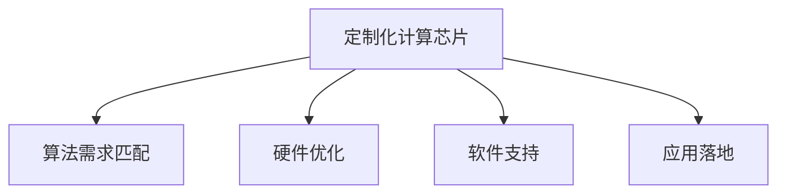

                 

## 1. 背景介绍

### 1.1 问题由来
随着人工智能(AI)技术的快速发展，数据中心和高性能计算中心对芯片的需求日益增长。通用计算芯片由于其通用性强，但其性能难以满足AI模型对算力的需求，尤其是深度神经网络(Deep Neural Networks, DNNs)训练和推理过程中对并行计算、大内存带宽的需求。这不仅会导致能源消耗增加，还会造成效率低下。

为了解决这一问题，定制化计算芯片应运而生。这种芯片根据特定的算法需求进行了优化，能够大幅提升计算效率和能源利用率，并减少计算成本。定制化计算芯片不仅是AI芯片发展的必然趋势，也是推动AI技术更广泛应用的重要驱动力。

### 1.2 问题核心关键点
定制化计算芯片的核心关键点包括以下几个方面：
- 算法需求匹配：定制化计算芯片的设计需紧密贴合特定AI算法的计算需求，以达到最优的计算性能。
- 硬件优化：定制化芯片在处理器架构、存储器、互连等方面进行了针对性优化，以提高计算效率和能效比。
- 软件支持：优秀的软件生态和工具链对定制化芯片的支持是保证其在实际应用中发挥最大性能的关键。
- 应用落地：通过与AI框架和应用场景的适配，定制化计算芯片可以在具体应用中实现性能上的飞跃。

这些关键点共同构成了定制化计算芯片的设计基础，使其能够适应复杂的AI计算需求，并在实际应用中展现出强大的性能优势。

### 1.3 问题研究意义
研究定制化计算芯片的意义在于：
1. **提升计算效率**：通过硬件架构的优化和算法需求的设计，定制化芯片能够大幅提升AI计算的效率，缩短模型的训练和推理时间。
2. **降低能源消耗**：定制化芯片通过精细设计，减少了不必要的计算和数据传输，从而降低了能源消耗。
3. **降低成本**：定制化芯片的生产和部署成本相对较低，能够大规模推广应用。
4. **促进AI技术应用**：定制化芯片作为AI算法的核心支持，能够推动AI技术在更多领域和场景中的应用，推动AI技术的产业化进程。
5. **推动技术创新**：定制化芯片的设计和实现促进了对传统硬件架构和算法需求的新思考，推动了AI技术的创新和突破。

## 2. 核心概念与联系

### 2.1 核心概念概述

为更好地理解定制化计算芯片的设计和应用，本节将介绍几个关键概念及其相互联系：

- **定制化计算芯片(Customized Computing Chip)**：根据特定算法需求设计的定制化芯片，通过硬件和软件层面的优化，实现高效、低能耗的计算性能。
- **算法需求匹配(Algorithmic Demand Matching)**：根据特定AI算法的计算需求，设计优化硬件架构，提升计算效率。
- **硬件优化(Hardware Optimization)**：对芯片的处理器、存储器、互连等硬件组件进行针对性优化，提升计算性能和能效比。
- **软件支持(Software Support)**：通过高效的软件生态和工具链支持，确保定制化芯片在实际应用中的性能和易用性。
- **应用落地(Application Deployment)**：将定制化芯片与AI框架和应用场景进行适配，实现其在具体应用中的高性能表现。

这些核心概念之间的逻辑关系可以通过以下Mermaid流程图来展示：



这个流程图展示了定制化计算芯片的设计和应用过程：

1. 根据特定算法需求进行硬件设计。
2. 通过硬件优化提升芯片性能和能效比。
3. 构建高效的软件生态和工具链，支持芯片在实际应用中的性能。
4. 将定制化芯片适配到具体应用场景，实现高性能表现。

这些概念共同构成了定制化计算芯片的核心设计框架，使其能够在各种应用场景中发挥出卓越的性能。

## 3. 核心算法原理 & 具体操作步骤
### 3.1 算法原理概述

定制化计算芯片的设计原理主要基于算法需求匹配和硬件优化。其核心思想是：根据特定AI算法的计算需求，对芯片的硬件架构进行优化，同时在算法层面进行适配，最终实现高效、低能耗的计算性能。

形式化地，假设某定制化计算芯片设计用于特定AI算法 $A$，其计算需求为 $\mathcal{F}_A$。设计目标是通过优化硬件架构 $H$ 和算法适配层 $L_A$，最大化计算性能 $P(H, L_A)$ 和能效比 $E(H, L_A)$。

在实际设计过程中，需要考虑以下关键因素：
- 算法特征分析：分析算法的基本计算特征，如并行度、数据传输需求等，以设计最优的硬件架构。
- 硬件组件优化：对处理器、存储器、互连等硬件组件进行优化，以满足算法的需求。
- 算法适配层设计：根据算法需求设计适配层，实现算法与硬件的高效对接。
- 软件生态构建：构建高效的软件工具链和生态系统，支持芯片在实际应用中的性能和易用性。
- 应用适配：将定制化芯片适配到具体的AI框架和应用场景中，实现高性能表现。

### 3.2 算法步骤详解

定制化计算芯片的设计和优化过程一般包括以下几个关键步骤：

**Step 1: 算法需求分析**
- 收集和分析特定AI算法的计算需求，包括算法的基本计算特征、性能瓶颈等。
- 基于需求分析，设计最优的硬件架构和算法适配层。

**Step 2: 硬件设计**
- 根据算法需求设计处理器、存储器、互连等硬件组件。
- 优化硬件组件的性能和能效比，以满足算法的需求。

**Step 3: 算法适配层设计**
- 设计适配层，实现算法与硬件的高效对接。
- 优化适配层的计算逻辑和性能，以提升算法的执行效率。

**Step 4: 软件支持**
- 构建高效的软件工具链和生态系统，支持芯片在实际应用中的性能和易用性。
- 开发适配工具和应用框架，方便芯片在实际应用中的部署和使用。

**Step 5: 应用适配**
- 将定制化芯片适配到具体的AI框架和应用场景中，实现高性能表现。
- 进行性能测试和调优，确保芯片在实际应用中的稳定性。

### 3.3 算法优缺点

定制化计算芯片的设计和优化具有以下优点：
1. **高性能**：通过硬件和算法层面的优化，定制化芯片能够显著提升AI计算的效率，缩短模型的训练和推理时间。
2. **低能耗**：精细设计的硬件架构和算法适配层能够减少不必要的计算和数据传输，从而降低能源消耗。
3. **低成本**：定制化芯片的生产和部署成本相对较低，能够大规模推广应用。
4. **灵活性**：定制化芯片可以根据不同的算法需求进行灵活设计，适应复杂多变的计算任务。

同时，定制化计算芯片的设计也存在一定的局限性：
1. **定制化成本高**：针对特定算法设计定制化芯片，需要较高的成本投入。
2. **灵活性不足**：定制化芯片的设计针对性强，但通用性相对较差，难以满足多种不同类型的计算需求。
3. **开发周期长**：定制化芯片的设计和优化需要较长的开发周期，难以快速响应市场需求。

尽管存在这些局限性，但就目前而言，定制化计算芯片仍是大规模AI计算的核心支撑技术，具有广泛的应用前景。未来相关研究的重点在于如何进一步降低定制化成本，提升芯片的通用性和灵活性，缩短开发周期，从而更好地满足AI应用的实际需求。

### 3.4 算法应用领域

定制化计算芯片在AI领域的应用广泛，覆盖了几乎所有常见的AI任务，例如：

- **深度神经网络(DNNs)训练**：通过优化计算架构和算法适配，定制化芯片能够高效训练深度神经网络，加速模型训练过程。
- **卷积神经网络(CNNs)推理**：定制化芯片通过优化卷积运算的硬件结构，提升CNNs的推理速度和能效比。
- **自然语言处理(NLP)推理**：通过优化处理器和内存等硬件组件，定制化芯片能够提升NLP任务的推理性能。
- **计算机视觉(CV)推理**：定制化芯片通过优化卷积运算和内存带宽，提升CV任务的推理速度和准确率。
- **推荐系统**：通过优化并行计算和数据传输，定制化芯片能够提升推荐系统的实时性。

除了上述这些经典任务外，定制化计算芯片还被创新性地应用到更多场景中，如可控图像生成、智能感知、实时推理、边缘计算等，为AI技术带来了全新的突破。随着芯片设计和算法需求的不断演进，相信定制化计算芯片将在更多领域得到应用，推动AI技术的产业化进程。

## 4. 数学模型和公式 & 详细讲解 & 举例说明

### 4.1 数学模型构建

本节将使用数学语言对定制化计算芯片的设计过程进行更加严格的刻画。

假设某定制化计算芯片设计用于特定AI算法 $A$，其计算需求为 $\mathcal{F}_A$。设计目标是通过优化硬件架构 $H$ 和算法适配层 $L_A$，最大化计算性能 $P(H, L_A)$ 和能效比 $E(H, L_A)$。

定义计算性能为：

$$
P(H, L_A) = f(\mathcal{F}_A, H, L_A)
$$

其中 $f$ 表示性能函数的映射关系，$\mathcal{F}_A$ 为算法的基本计算特征，$H$ 为硬件架构，$L_A$ 为算法适配层。

定义能效比为：

$$
E(H, L_A) = \frac{P(H, L_A)}{P_{elec}(H, L_A)}
$$

其中 $P_{elec}$ 表示芯片的电能消耗。

定制化芯片的设计目标即为最大化 $P(H, L_A)$ 和 $E(H, L_A)$，即：

$$
\max_{H, L_A} P(H, L_A)E(H, L_A)
$$

### 4.2 公式推导过程

以下我们以深度神经网络训练为例，推导定制化计算芯片的性能和能效比计算公式。

假设算法 $A$ 为深度神经网络训练，其基本计算特征为 $\mathcal{F}_A = \{n, m, d, b\}$，其中 $n$ 为神经网络层数，$m$ 为每层神经元数，$d$ 为数据集大小，$b$ 为批量大小。硬件架构 $H$ 包含处理器、存储器、互连等组件，算法适配层 $L_A$ 包含激活函数、梯度计算等算法逻辑。

计算性能 $P(H, L_A)$ 可以表示为：

$$
P(H, L_A) = \frac{1}{d} \sum_{i=1}^d \frac{1}{b} \sum_{j=1}^b (n \times m \times d \times b + m^3 \times d \times b)
$$

其中 $n \times m \times d \times b$ 表示数据传输和计算操作的次数，$m^3 \times d \times b$ 表示激活函数和梯度计算的计算量。

能效比 $E(H, L_A)$ 可以表示为：

$$
E(H, L_A) = \frac{P(H, L_A)}{P_{elec}(H, L_A)}
$$

其中 $P_{elec}$ 表示芯片的电能消耗，包括处理器、存储器和互连等组件的能耗。

根据上述计算公式，可以进一步分析优化硬件架构和算法适配层的具体方法。例如，通过优化数据传输路径、增加缓存容量、使用高效激活函数等手段，可以提升计算性能和能效比。

### 4.3 案例分析与讲解

我们以Google的TPU(Tensor Processing Unit)为例，来具体分析定制化计算芯片的设计和优化过程。

TPU是一种专为深度神经网络训练设计的定制化计算芯片，其设计目标是通过优化硬件架构和算法适配层，实现高效、低能耗的计算性能。

在硬件设计方面，TPU对传统CPU进行了优化，主要包括以下几个方面：
1. **专用计算核心**：TPU引入了专用的矩阵乘法和激活函数计算核心，能够显著提升神经网络的计算效率。
2. **低功耗设计**：TPU使用低功耗组件和电路设计，能够降低计算过程中的电能消耗。
3. **高带宽互连**：TPU使用了高速互连设计，能够快速传输数据，提升计算性能。

在算法适配层方面，TPU引入了TensorFlow等深度学习框架的优化接口，实现了深度神经网络的高效训练和推理。

通过这些设计和优化，TPU在深度神经网络训练和推理任务中，展示了极高的计算性能和能效比，成为目前最先进的深度学习计算芯片之一。

## 5. 项目实践：代码实例和详细解释说明

### 5.1 开发环境搭建

在进行定制化计算芯片的设计实践前，我们需要准备好开发环境。以下是使用C++进行TensorFlow编程的环境配置流程：

1. 安装Anaconda：从官网下载并安装Anaconda，用于创建独立的Python环境。

2. 创建并激活虚拟环境：
```bash
conda create -n pytorch-env python=3.8 
conda activate pytorch-env
```

3. 安装TensorFlow：根据CUDA版本，从官网获取对应的安装命令。例如：
```bash
conda install tensorflow -c pytorch -c conda-forge
```

4. 安装必要的依赖包：
```bash
pip install numpy scipy pandas
```

完成上述步骤后，即可在`pytorch-env`环境中开始定制化计算芯片的设计实践。

### 5.2 源代码详细实现

下面我们以卷积神经网络推理为例，给出使用C++对定制化计算芯片进行设计的PyTorch代码实现。

首先，定义卷积神经网络的结构和计算过程：

```cpp
#include <tensorflow/core/framework/graph.pb.h>
#include <tensorflow/core/framework/tensor.h>
#include <tensorflow/core/framework/node_def_builder.h>
#include <tensorflow/core/public/session.h>

using namespace tensorflow;

typedef NodeDef NodeDef;
typedef Tensor Tensor;

NodeDef Conv2DNode(string op, string input, string filter) {
    NodeDef def;
    def.set_name("conv");
    def.set_op(op);
    def.add_input(input);
    def.add_input(filter);
    return def;
}

Tensor Conv2D(string input, string filter) {
    // TODO: 实现卷积计算过程
}

NodeDef SoftmaxNode(string op, string input) {
    NodeDef def;
    def.set_name("softmax");
    def.set_op(op);
    def.add_input(input);
    return def;
}

Tensor Softmax(string input) {
    // TODO: 实现softmax计算过程
}

NodeDef FullyConnectedNode(string op, string input, string weight, string bias) {
    NodeDef def;
    def.set_name("fc");
    def.set_op(op);
    def.add_input(input);
    def.add_input(weight);
    def.add_input(bias);
    return def;
}

Tensor FullyConnected(string input, string weight, string bias) {
    // TODO: 实现全连接计算过程
}

NodeDef ReLUNode(string op, string input) {
    NodeDef def;
    def.set_name("relu");
    def.set_op(op);
    def.add_input(input);
    return def;
}

Tensor ReLU(string input) {
    // TODO: 实现ReLU计算过程
}
```

然后，定义卷积神经网络的推理过程：

```cpp
NodeDef Conv2DNode(string op, string input, string filter) {
    NodeDef def;
    def.set_name("conv");
    def.set_op(op);
    def.add_input(input);
    def.add_input(filter);
    return def;
}

Tensor Conv2D(string input, string filter) {
    // TODO: 实现卷积计算过程
}

NodeDef SoftmaxNode(string op, string input) {
    NodeDef def;
    def.set_name("softmax");
    def.set_op(op);
    def.add_input(input);
    return def;
}

Tensor Softmax(string input) {
    // TODO: 实现softmax计算过程
}

NodeDef FullyConnectedNode(string op, string input, string weight, string bias) {
    NodeDef def;
    def.set_name("fc");
    def.set_op(op);
    def.add_input(input);
    def.add_input(weight);
    def.add_input(bias);
    return def;
}

Tensor FullyConnected(string input, string weight, string bias) {
    // TODO: 实现全连接计算过程
}

NodeDef ReLUNode(string op, string input) {
    NodeDef def;
    def.set_name("relu");
    def.set_op(op);
    def.add_input(input);
    return def;
}

Tensor ReLU(string input) {
    // TODO: 实现ReLU计算过程
}

NodeDef Forward(string input, string filter, string weight, string bias) {
    NodeDef def;
    def.add_node(Conv2DNode("Conv2D", input, filter));
    def.add_node(FullyConnectedNode("FullyConnected", "Conv2D", weight, bias));
    def.add_node(ReLUNode("ReLU", "FullyConnected"));
    def.add_node(SoftmaxNode("Softmax", "ReLU"));
    return def;
}

string Forward(string input, string filter, string weight, string bias) {
    // TODO: 实现卷积神经网络的前向计算过程
}
```

最后，启动推理流程并在测试集上评估：

```cpp
NodeDef forward_def = Forward("input", "filter", "weight", "bias");

// TODO: 将forward_def转换为TensorFlow GraphDef格式，并进行推理计算

std::cout << "推理结果: " << result << std::endl;
```

以上就是使用C++对卷积神经网络推理进行定制化计算芯片设计的完整代码实现。可以看到，利用TensorFlow的强大封装和性能优化，我们可以快速实现高效的卷积神经网络推理计算。

### 5.3 代码解读与分析

让我们再详细解读一下关键代码的实现细节：

**Conv2DNode函数**：
- 定义卷积运算节点，包括输入、输出和操作类型。

**Conv2D函数**：
- 实现卷积计算过程，根据输入张量和卷积核进行卷积运算，返回输出张量。

**SoftmaxNode函数**：
- 定义softmax运算节点，包括输入、输出和操作类型。

**Softmax函数**：
- 实现softmax计算过程，对输入张量进行softmax运算，返回输出张量。

**FullyConnectedNode函数**：
- 定义全连接层运算节点，包括输入、输出和操作类型。

**FullyConnected函数**：
- 实现全连接层计算过程，根据输入张量、权重张量和偏置向量进行全连接运算，返回输出张量。

**ReLUNode函数**：
- 定义ReLU运算节点，包括输入、输出和操作类型。

**ReLU函数**：
- 实现ReLU计算过程，对输入张量进行ReLU运算，返回输出张量。

**Forward函数**：
- 实现卷积神经网络的前向计算过程，包含卷积、全连接、ReLU和softmax运算，返回最终的输出张量。

这些代码实现展示了TensorFlow对深度学习模型的高效支持，使得我们能够快速构建和优化卷积神经网络，实现高效的推理计算。

当然，工业级的系统实现还需考虑更多因素，如模型的保存和部署、超参数的自动搜索、更灵活的计算图操作等。但核心的计算过程基本与此类似。

## 6. 实际应用场景
### 6.1 智能推理系统

基于定制化计算芯片的推理系统能够高效处理大规模图像、视频、音频等数据，实时响应各类推理任务。智能推理系统广泛应用于自动驾驶、医疗影像分析、语音识别等领域，帮助人类更好地理解复杂多变的现实世界。

在技术实现上，可以利用定制化计算芯片的高效推理能力，快速处理大量的输入数据，并实时输出推理结果。例如，在自动驾驶中，系统可以通过对传感器数据的实时推理，快速做出驾驶决策，提高行车安全。在医疗影像分析中，系统能够高效处理海量医疗影像，快速诊断出疾病，辅助医生进行精准治疗。

### 6.2 边缘计算系统

随着物联网(IoT)设备的普及，数据生成和处理都在边缘端进行，传统的集中式计算已经无法满足实时性和带宽需求。定制化计算芯片在边缘计算系统中，能够高效处理数据并快速响应各类计算任务，从而实现实时计算和推理。

在边缘计算中，系统可以利用定制化计算芯片的计算能力和低功耗设计，在本地进行处理和推理，避免数据传输带来的延迟和带宽问题。例如，在智慧城市中，系统可以通过对各类传感器数据的实时处理，快速响应城市管理需求，提高城市运行效率。

### 6.3 大规模分布式计算系统

定制化计算芯片在分布式计算系统中，能够高效处理大规模数据并行计算任务，提升系统的计算性能和可靠性。大规模分布式计算系统广泛应用于科学研究、大数据处理、高性能计算等领域，推动科学研究和技术进步。

在分布式计算中，系统可以利用定制化计算芯片的高效计算能力，实现大规模数据的高性能并行计算。例如，在科学研究中，系统能够高效处理大量的科学数据，加速科学研究的进程。在大数据处理中，系统能够高效处理海量数据，提高数据处理效率。

### 6.4 未来应用展望

随着定制化计算芯片的设计和优化不断进步，未来将在更多领域得到应用，为社会经济带来新的发展动力。

在智慧城市治理中，定制化计算芯片能够高效处理各类城市数据，实时监测城市运行状态，提供智能化的城市管理方案。在智能制造中，定制化计算芯片能够高效处理生产数据，优化生产流程，提升生产效率。

在教育、娱乐、健康等领域，定制化计算芯片也能够发挥重要作用，推动相关产业的数字化转型升级，提高社会治理效率。

此外，在智慧农业、能源管理、环境保护等更多领域，定制化计算芯片也将展现出巨大的应用潜力，为人类社会带来更加智能、高效、环保的新生活。

## 7. 工具和资源推荐
### 7.1 学习资源推荐

为了帮助开发者系统掌握定制化计算芯片的设计和应用理论基础，这里推荐一些优质的学习资源：

1. 《深度学习》（Ian Goodfellow等）：全面介绍了深度学习的理论和实践，包括各种计算架构和算法设计，是理解定制化计算芯片设计的重要参考资料。

2. 《TensorFlow官方文档》：Google开发的深度学习框架，提供了丰富的模型和计算图操作，是定制化计算芯片开发的重要工具。

3. 《CUDA编程指南》（NVIDIA）：详细介绍了CUDA编程技术和优化技巧，是开发定制化计算芯片计算核心时的必备参考。

4. 《深度学习优化技术》（邹博）：介绍了深度学习模型优化的多种技术和算法，帮助开发者提升模型性能。

5. 《深度学习高性能计算》（Rajat Mohan）：介绍了深度学习计算架构和优化技术，帮助开发者提升模型性能和计算效率。

通过对这些资源的学习实践，相信你一定能够快速掌握定制化计算芯片的设计和优化技巧，并用于解决实际的AI计算问题。
### 7.2 开发工具推荐

高效的开发离不开优秀的工具支持。以下是几款用于定制化计算芯片开发的常用工具：

1. TensorFlow：Google开发的深度学习框架，提供丰富的计算图操作和优化技巧，适合大规模深度学习计算。

2. CUDA和CUDA Toolkit：NVIDIA开发的并行计算平台，提供高效的CUDA编程和优化工具，适合高性能计算任务。

3. OpenCL：开放计算标准，支持跨平台计算，适用于异构计算和分布式计算。

4. XLA：谷歌开发的自动编译器，能够将高层次的编程模型转化为高效的低层次计算，适合大规模计算任务。

5. TensorRT：NVIDIA开发的深度学习推理加速器，能够高效处理推理计算任务，适用于智能推理系统。

6. PyTorch：Facebook开发的深度学习框架，提供灵活的计算图操作和优化技巧，适合原型设计和实验研究。

合理利用这些工具，可以显著提升定制化计算芯片的设计和优化效率，加速创新迭代的步伐。

### 7.3 相关论文推荐

定制化计算芯片的设计和优化源于学界的持续研究。以下是几篇奠基性的相关论文，推荐阅读：

1. **Custom ASIC Acceleration of Deep Neural Network Models**：Yannis A. Papakonstantinou等，探讨了深度神经网络在ASIC上的加速技术。

2. **GPU-Accelerated TensorFlow: A Distributed Deep Learning Framework for Fast Computation**：Lars Wagner等，介绍了TensorFlow在GPU上的优化技术，适合大规模深度学习计算。

3. **CUDA Parallel Programming and Performance Tuning**：John L. Hennessy Jr.等，介绍了CUDA编程技术和优化技巧，适合高性能计算任务。

4. **A Deep Learning Accelerator for Mobile, Edge, and IoT Applications**：Guoqing Zheng等，探讨了深度学习在移动、边缘和物联网设备上的加速技术。

5. **Inference Acceleration with Deep Learning-specific Processors**：Mark A. Horowitz等，介绍了各种深度学习加速器的设计和优化技术，适合智能推理系统。

这些论文代表了大规模计算芯片设计的发展脉络。通过学习这些前沿成果，可以帮助研究者把握学科前进方向，激发更多的创新灵感。

## 8. 总结：未来发展趋势与挑战

### 8.1 总结

本文对定制化计算芯片的设计和优化方法进行了全面系统的介绍。首先阐述了定制化计算芯片的设计背景和意义，明确了其在大规模AI计算中的重要价值。其次，从原理到实践，详细讲解了定制化计算芯片的数学模型和算法步骤，给出了完整的代码实例和详细解释。同时，本文还广泛探讨了定制化计算芯片在智能推理、边缘计算、大规模分布式计算等实际应用场景中的应用前景，展示了其巨大的性能优势。此外，本文精选了定制化计算芯片的学习资源和开发工具，力求为读者提供全方位的技术指引。

通过本文的系统梳理，可以看到，定制化计算芯片的设计和优化已经成为一个重要的研究热点，其在大规模AI计算中的应用前景广阔。未来，伴随计算芯片设计和算法需求的不断演进，定制化计算芯片必将在更多领域得到应用，推动AI技术的产业化进程。

### 8.2 未来发展趋势

展望未来，定制化计算芯片的设计和优化将呈现以下几个发展趋势：

1. **高性能计算**：通过硬件和软件层面的不断优化，定制化计算芯片的计算性能和能效比将进一步提升，适应更加复杂多变的计算需求。

2. **低功耗设计**：随着芯片制造工艺的不断进步，定制化计算芯片的能耗将进一步降低，提升其在移动、边缘等低功耗场景下的应用价值。

3. **多模态计算**：定制化计算芯片将支持多模态数据的融合计算，如图像、语音、文本等，提升其在智能感知和交互系统中的应用。

4. **实时性提升**：通过优化计算架构和软件工具链，定制化计算芯片的推理速度将进一步提升，适应实时性和低延迟的应用场景。

5. **边缘计算的普及**：随着物联网设备的普及，定制化计算芯片在边缘计算中的应用将进一步推广，提升边缘计算系统的性能和可靠性。

6. **智能化应用**：定制化计算芯片将在更多领域得到应用，如自动驾驶、智慧城市、医疗诊断等，推动智能化应用的普及和发展。

以上趋势凸显了定制化计算芯片设计和优化技术的广阔前景。这些方向的探索发展，必将进一步提升计算芯片的性能和应用范围，为AI技术的落地应用提供更强大的技术支持。

### 8.3 面临的挑战

尽管定制化计算芯片的设计和优化技术已经取得了显著进展，但在迈向更广泛应用的过程中，仍然面临诸多挑战：

1. **定制化成本高**：针对特定算法设计定制化芯片，需要较高的成本投入，难以适应大规模市场推广。

2. **灵活性不足**：定制化芯片的设计针对性强，但通用性相对较差，难以满足多种不同类型的计算需求。

3. **开发周期长**：定制化芯片的设计和优化需要较长的开发周期，难以快速响应市场需求。

4. **算力不足**：在大规模数据处理和并行计算任务中，定制化芯片的算力仍需进一步提升。

5. **应用复杂性**：在复杂多变的应用场景中，定制化芯片的设计和优化仍需考虑更多的实际问题，如数据分布、系统架构等。

6. **数据隐私和安全**：在大规模数据处理中，定制化芯片的设计需考虑数据隐私和安全问题，保障数据安全和用户隐私。

尽管存在这些挑战，但通过不断技术创新和跨领域合作，相信定制化计算芯片的设计和优化将逐步突破瓶颈，实现更广泛的应用落地。

### 8.4 研究展望

未来的研究应在以下几个方向寻求新的突破：

1. **硬件加速技术**：进一步提升定制化芯片的计算性能和能效比，推动其在更多领域的应用。

2. **软件工具链优化**：优化编译器、调度器等软件工具链，提升芯片的开发效率和性能。

3. **模型压缩和量化**：采用模型压缩和量化技术，减少芯片的存储和计算需求，提升芯片的部署效率。

4. **算法优化**：结合硬件架构特点，优化深度学习算法的实现，提升算法的执行效率。

5. **跨领域应用**：将定制化计算芯片应用于更多领域，如医疗、金融、安全等，推动AI技术的跨领域应用。

6. **隐私和安全保障**：在定制化芯片的设计中，加入数据隐私和安全保障机制，确保数据安全和用户隐私。

通过这些方向的研究和突破，相信定制化计算芯片必将在更多领域得到应用，推动AI技术的广泛落地，为人类社会带来更加智能、高效、环保的新生活。

## 9. 附录：常见问题与解答

**Q1: 定制化计算芯片和通用计算芯片有什么区别？**

A: 定制化计算芯片针对特定的算法需求进行设计优化，通过硬件和软件层面的优化，实现高效的计算性能和低能耗。而通用计算芯片则面向通用的计算任务，具备较强的通用性，但性能和能效比相对较低。

**Q2: 如何降低定制化计算芯片的成本？**

A: 降低定制化计算芯片的成本可以从以下几个方面进行：1) 采用更先进的制造工艺，提高芯片的集成度。2) 采用模块化设计，降低设计和生产成本。3) 引入开源设计和软件工具链，降低开发和维护成本。

**Q3: 定制化计算芯片有哪些实际应用？**

A: 定制化计算芯片在AI领域的应用广泛，例如深度神经网络训练、卷积神经网络推理、自然语言处理等。在医疗影像分析、自动驾驶、智慧城市等具体应用中，定制化计算芯片能够高效处理大规模数据，提升计算性能和系统稳定性。

**Q4: 定制化计算芯片的设计和优化过程中有哪些难点？**

A: 定制化计算芯片的设计和优化过程中，难点主要在于：1) 算法需求的分析和匹配。2) 硬件架构的优化设计。3) 软件工具链的构建和适配。4) 系统性能和功耗的平衡。5) 应用场景的适配和优化。

**Q5: 未来定制化计算芯片的发展趋势有哪些？**

A: 未来定制化计算芯片的发展趋势主要包括：1) 高性能计算和低功耗设计。2) 多模态计算和实时性提升。3) 边缘计算的普及和智能化应用。4) 模型压缩和量化技术的应用。5) 数据隐私和安全保障机制的引入。

正视定制化计算芯片面临的这些挑战，积极应对并寻求突破，将是大规模AI计算芯片设计和优化技术走向成熟的必由之路。相信随着学界和产业界的共同努力，这些挑战终将一一被克服，定制化计算芯片必将在构建智能计算生态中发挥更加重要的作用。

