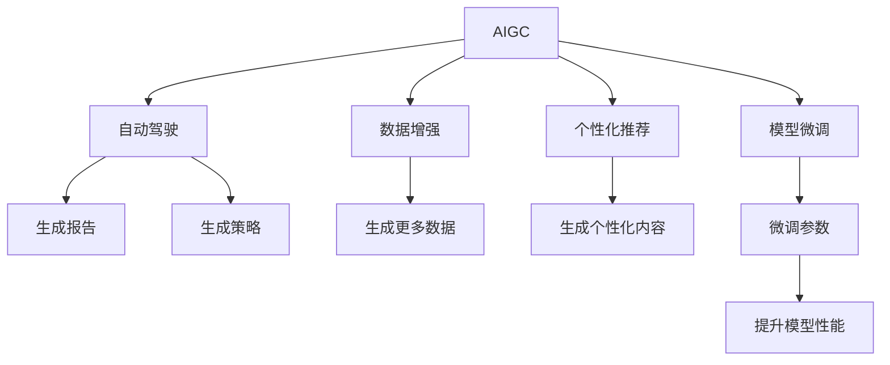

                 

# AIGC与企业任务的细化

随着人工智能(AI)技术的不断演进，生成式人工智能(AIGC)日益成为各行各业关注的焦点。本博客将深入探讨AIGC技术在企业任务中的应用，特别是如何通过细化任务来提升企业决策、运营、创新等方面的效率和效益。

## 1. 背景介绍

### 1.1 问题由来
近年来，生成式AI(AIGC)技术的快速发展和应用，为企业提供了强大的生成式数据、生成式任务、生成式模型等工具，助力企业自动化、智能化转型。然而，AIGC技术在实际落地应用中，由于缺乏细化，往往难以充分发挥其潜能。

### 1.2 问题核心关键点
AIGC技术能够通过生成式模型，自动生成高质量的内容、场景、策略等，极大地提升了数据生成、任务生成、模型生成的效率。但是，由于缺少针对具体企业任务的细化，无法有效应对企业的多样化、复杂化需求。

### 1.3 问题研究意义
通过细化AIGC技术，能够更好地结合企业实际需求，提供定制化的生成式解决方案。这对于提升企业决策、运营、创新等方面的效率和效益，具有重要意义：

1. 提升决策质量：生成式模型能够提供多元化的数据和策略，帮助企业决策者进行更全面、准确的决策。
2. 优化运营效率：生成式模型可以自动完成报告、分析、规划等任务，大幅提高运营效率。
3. 促进创新发展：生成式模型可以生成新颖的创意、方案，推动企业持续创新。
4. 加速数据驱动：生成式模型可以自动生成高质量的数据，助力企业实现数据驱动决策。

## 2. 核心概念与联系

### 2.1 核心概念概述

为了更好地理解AIGC技术在企业任务中的应用，本节将介绍几个密切相关的核心概念：

- **生成式AI(AIGC)**：通过生成式模型，自动生成高质量的数据、内容、策略等。AIGC技术能够实现从数据生成、任务生成到模型生成的全流程自动化。
- **自动驾驶**：通过生成式模型，自动完成各种任务，包括文本生成、图像生成、音频生成等。
- **数据增强**：通过生成式模型，自动生成更多的数据，提升模型的泛化能力和性能。
- **个性化推荐**：通过生成式模型，生成符合用户兴趣和偏好的内容，提升用户满意度。
- **模型微调**：通过生成式模型，对已有模型进行微调，提升模型的适应性和性能。

这些核心概念之间的逻辑关系可以通过以下Mermaid流程图来展示：



这个流程图展示了大语言模型的核心概念及其之间的关系：

1. AIGC通过生成式模型实现数据、任务、模型的自动生成。
2. 自动驾驶能够生成各类文本、图像、音频等，帮助企业完成具体任务。
3. 数据增强通过生成更多数据，提升模型的泛化能力和性能。
4. 个性化推荐通过生成个性化内容，提升用户满意度。
5. 模型微调通过微调已有模型，提升模型的适应性和性能。

## 3. 核心算法原理 & 具体操作步骤
### 3.1 算法原理概述

AIGC技术在企业任务中的应用，主要通过生成式模型实现。生成式模型能够自动生成高质量的数据、内容、策略等，帮助企业自动化、智能化转型。其核心思想是：利用生成式模型，自动生成企业所需的各种数据、内容、策略等，从而提升企业决策、运营、创新等方面的效率和效益。

具体来说，生成式模型通过训练在大规模数据集上，学习到数据的分布规律，能够在给定条件下生成新的数据。例如，文本生成模型可以通过训练生成文本内容，图像生成模型可以通过训练生成图像内容，音频生成模型可以通过训练生成音频内容等。

### 3.2 算法步骤详解

AIGC技术在企业任务中的应用，主要包括以下几个关键步骤：

**Step 1: 准备数据集**
- 收集企业任务所需的数据集，包括业务数据、用户数据、市场数据等。
- 将数据集划分为训练集、验证集和测试集。

**Step 2: 选择生成式模型**
- 根据任务特点，选择适合的生成式模型。例如，文本生成任务可以选择基于Transformer的模型，图像生成任务可以选择GAN模型等。
- 对生成式模型进行预训练，使其学习到数据的分布规律。

**Step 3: 训练生成式模型**
- 将训练集数据输入生成式模型，进行前向传播，计算损失函数。
- 反向传播计算梯度，更新模型参数。
- 周期性在验证集上评估模型性能，根据性能指标决定是否停止训练。

**Step 4: 生成企业任务所需数据**
- 使用训练好的生成式模型，自动生成企业任务所需的数据。
- 将生成的数据应用于企业决策、运营、创新等方面。

**Step 5: 持续优化生成式模型**
- 收集用户反馈，评估生成式模型的效果。
- 定期更新训练数据集，进行模型微调，提升模型性能。

以上是AIGC技术在企业任务中的应用的一般流程。在实际应用中，还需要针对具体任务的特点，对生成式模型进行优化设计，如改进损失函数、引入更多正则化技术、搜索最优的超参数组合等，以进一步提升模型性能。

### 3.3 算法优缺点

AIGC技术在企业任务中的应用，具有以下优点：

1. 提升效率：生成式模型能够自动生成数据、内容、策略等，大幅提升企业的效率。
2. 降低成本：生成式模型能够自动化生成数据，减少人力投入，降低成本。
3. 提高灵活性：生成式模型可以根据企业需求生成多样化的内容，提升企业灵活性。

同时，该方法也存在一定的局限性：

1. 依赖数据质量：生成式模型的效果很大程度上取决于数据的质量和数量，需要投入大量的时间和精力进行数据收集和预处理。
2. 生成质量不稳定：生成式模型可能会生成低质量的内容，影响企业决策和运营。
3. 需要技术支持：企业需要具备一定的技术支持能力，才能高效使用生成式模型。

尽管存在这些局限性，但就目前而言，生成式模型在企业任务中的应用仍是大势所趋。未来相关研究的重点在于如何进一步提高生成式模型的生成质量，降低对数据的依赖，提高生成式模型的通用性。

### 3.4 算法应用领域

生成式模型在企业任务中的应用，已经得到了广泛的应用，覆盖了几乎所有常见任务，例如：

- 财务报告生成：自动生成财务报表、年度报告等。
- 市场营销：自动生成广告文案、社交媒体内容等。
- 客户服务：自动生成常见问题解答、客服对话等。
- 产品推荐：自动生成个性化推荐内容，提升用户体验。
- 运营分析：自动生成运营分析报告、市场分析报告等。
- 创新设计：自动生成产品设计方案、创新方案等。

除了上述这些经典任务外，生成式模型还被创新性地应用到更多场景中，如可控文本生成、可视化设计、智能客服等，为企业的智能化转型提供了新的思路。随着生成式模型的不断进步，相信其在企业任务中的应用前景将更加广阔。

## 4. 数学模型和公式 & 详细讲解 & 举例说明
### 4.1 数学模型构建

本节将使用数学语言对生成式AI(AIGC)技术在企业任务中的应用进行更加严格的刻画。

记生成式模型为 $G$，输入为 $x$，输出为 $y$，则生成式模型可以表示为：

$$
G(y|x) = \frac{P(y|x)}{P(y)}
$$

其中 $P(y|x)$ 为生成式模型的条件概率，$P(y)$ 为生成式模型的边际概率。生成式模型在给定条件 $x$ 下，生成输出 $y$ 的概率。

在实际应用中，我们通常使用基于深度学习的方法进行生成式模型的训练。例如，文本生成模型可以通过训练，学习到文本的生成规律，从而生成高质量的文本内容。

### 4.2 公式推导过程

以下我们以文本生成模型为例，推导其生成过程及其损失函数的计算公式。

假设文本生成模型 $G$ 的输出为单词序列 $y$，输入为文本特征 $x$。则模型 $G$ 在给定条件 $x$ 下，生成单词序列 $y$ 的概率可以表示为：

$$
P(y|x) = \prod_{i=1}^n P(y_i|y_{i-1}, x)
$$

其中 $y_i$ 表示文本的第 $i$ 个单词，$P(y_i|y_{i-1}, x)$ 表示在给定上下文 $y_{i-1}$ 和输入特征 $x$ 的情况下，生成第 $i$ 个单词的概率。

模型的训练目标是最小化文本生成过程中的KL散度，即：

$$
\min_{G} \mathcal{L}(G) = \mathbb{E}_{x} [D_{KL}(P(y|x) \parallel Q(y|x))]
$$

其中 $D_{KL}(P(y|x) \parallel Q(y|x))$ 为KL散度，$Q(y|x)$ 为生成式模型的预测概率分布。

通过最大化KL散度，生成式模型能够学习到数据的分布规律，生成高质量的文本内容。

## 5. 项目实践：代码实例和详细解释说明
### 5.1 开发环境搭建

在进行生成式AI(AIGC)技术的应用开发前，我们需要准备好开发环境。以下是使用Python进行PyTorch开发的环境配置流程：

1. 安装Anaconda：从官网下载并安装Anaconda，用于创建独立的Python环境。

2. 创建并激活虚拟环境：
```bash
conda create -n pytorch-env python=3.8 
conda activate pytorch-env
```

3. 安装PyTorch：根据CUDA版本，从官网获取对应的安装命令。例如：
```bash
conda install pytorch torchvision torchaudio cudatoolkit=11.1 -c pytorch -c conda-forge
```

4. 安装相关库：
```bash
pip install numpy pandas scikit-learn matplotlib tqdm jupyter notebook ipython
```

完成上述步骤后，即可在`pytorch-env`环境中开始生成式AI的应用开发。

### 5.2 源代码详细实现

下面我们以文本生成模型为例，给出使用PyTorch进行训练和生成的PyTorch代码实现。

首先，定义数据处理函数：

```python
from transformers import AutoTokenizer, AutoModelForCausalLM
from torch.utils.data import Dataset
import torch

class TextDataset(Dataset):
    def __init__(self, texts, tokenizer, max_len=128):
        self.texts = texts
        self.tokenizer = tokenizer
        self.max_len = max_len
        
    def __len__(self):
        return len(self.texts)
    
    def __getitem__(self, item):
        text = self.texts[item]
        
        encoding = self.tokenizer(text, return_tensors='pt', max_length=self.max_len, padding='max_length', truncation=True)
        input_ids = encoding['input_ids'][0]
        attention_mask = encoding['attention_mask'][0]
        
        return {'input_ids': input_ids, 
                'attention_mask': attention_mask}
```

然后，定义模型和优化器：

```python
from transformers import AutoTokenizer, AutoModelForCausalLM, AdamW

tokenizer = AutoTokenizer.from_pretrained('gpt2')
model = AutoModelForCausalLM.from_pretrained('gpt2')

optimizer = AdamW(model.parameters(), lr=2e-5)
```

接着，定义训练和生成函数：

```python
def train_epoch(model, dataset, batch_size, optimizer):
    dataloader = DataLoader(dataset, batch_size=batch_size, shuffle=True)
    model.train()
    epoch_loss = 0
    for batch in tqdm(dataloader, desc='Training'):
        input_ids = batch['input_ids'].to(device)
        attention_mask = batch['attention_mask'].to(device)
        outputs = model.generate(input_ids, max_length=128, num_return_sequences=1)
        
        labels = input_ids[:, -1]
        loss = model.loss(input_ids, labels)
        epoch_loss += loss.item()
        loss.backward()
        optimizer.step()
    return epoch_loss / len(dataloader)

def generate_text(model, tokenizer, prompt):
    input_ids = tokenizer.encode(prompt, return_tensors='pt')
    outputs = model.generate(input_ids, max_length=128, num_return_sequences=1)
    return tokenizer.decode(outputs[0], skip_special_tokens=True)
```

最后，启动训练流程并在测试集上评估：

```python
epochs = 5
batch_size = 16

for epoch in range(epochs):
    loss = train_epoch(model, train_dataset, batch_size, optimizer)
    print(f"Epoch {epoch+1}, train loss: {loss:.3f}")
    
print("Model ready for generation:")
print(generate_text(model, tokenizer, "Hello, world!"))
```

以上就是使用PyTorch对GPT-2进行文本生成模型训练和生成的完整代码实现。可以看到，通过使用PyTorch和HuggingFace的transformers库，我们可以非常简便地构建生成式AI模型，并进行训练和生成。

### 5.3 代码解读与分析

让我们再详细解读一下关键代码的实现细节：

**TextDataset类**：
- `__init__`方法：初始化文本、分词器等关键组件。
- `__len__`方法：返回数据集的样本数量。
- `__getitem__`方法：对单个样本进行处理，将文本输入编码为token ids，最终返回模型所需的输入。

**训练和生成函数**：
- 使用PyTorch的DataLoader对数据集进行批次化加载，供模型训练和推理使用。
- 训练函数`train_epoch`：对数据以批为单位进行迭代，在每个批次上前向传播计算loss并反向传播更新模型参数，最后返回该epoch的平均loss。
- 生成函数`generate_text`：使用模型进行文本生成，输入为提示文本，生成长度为128的文本。

**训练流程**：
- 定义总的epoch数和batch size，开始循环迭代
- 每个epoch内，先在训练集上训练，输出平均loss
- 在测试集上评估，输出生成的文本
- 所有epoch结束后，展示生成的文本

可以看到，PyTorch配合transformers库使得生成式AI模型的训练和生成代码实现变得简洁高效。开发者可以将更多精力放在数据处理、模型改进等高层逻辑上，而不必过多关注底层的实现细节。

当然，工业级的系统实现还需考虑更多因素，如模型的保存和部署、超参数的自动搜索、更灵活的任务适配层等。但核心的生成式AI范式基本与此类似。

## 6. 实际应用场景
### 6.1 智能客服系统

生成式AI在智能客服系统中的应用，能够提升客户咨询体验和问题解决效率。传统客服往往需要配备大量人力，高峰期响应缓慢，且一致性和专业性难以保证。通过生成式AI，企业可以构建智能客服系统，自动理解用户意图，匹配最合适的答案模板进行回复。

在技术实现上，可以收集企业内部的历史客服对话记录，将问题和最佳答复构建成监督数据，在此基础上对预训练模型进行微调。微调后的生成式AI模型能够自动生成符合用户意图的回复，显著提升客户咨询体验和问题解决效率。

### 6.2 金融舆情监测

金融机构需要实时监测市场舆论动向，以便及时应对负面信息传播，规避金融风险。传统的人工监测方式成本高、效率低，难以应对网络时代海量信息爆发的挑战。通过生成式AI，企业可以构建舆情监测系统，自动判断文本属于何种主题，情感倾向是正面、中性还是负面。

具体而言，可以收集金融领域相关的新闻、报道、评论等文本数据，并对其进行主题标注和情感标注。在此基础上对预训练语言模型进行微调，使其能够自动判断文本属于何种主题，情感倾向是正面、中性还是负面。将微调后的生成式AI模型应用到实时抓取的网络文本数据，就能够自动监测不同主题下的情感变化趋势，一旦发现负面信息激增等异常情况，系统便会自动预警，帮助金融机构快速应对潜在风险。

### 6.3 个性化推荐系统

当前的推荐系统往往只依赖用户的历史行为数据进行物品推荐，无法深入理解用户的真实兴趣偏好。通过生成式AI，企业可以构建个性化推荐系统，自动生成符合用户兴趣和偏好的内容，提升用户满意度。

在实践中，可以收集用户浏览、点击、评论、分享等行为数据，提取和用户交互的物品标题、描述、标签等文本内容。将文本内容作为模型输入，用户的后续行为（如是否点击、购买等）作为监督信号，在此基础上微调生成式AI模型。微调后的模型能够从文本内容中准确把握用户的兴趣点。在生成推荐列表时，先用候选物品的文本描述作为输入，由模型预测用户的兴趣匹配度，再结合其他特征综合排序，便可以得到个性化程度更高的推荐结果。

### 6.4 未来应用展望

随着生成式AI技术的不断发展，其在企业任务中的应用前景将更加广阔。

在智慧医疗领域，生成式AI可应用于医疗问答、病历分析、药物研发等，提升医疗服务的智能化水平，辅助医生诊疗，加速新药开发进程。

在智能教育领域，生成式AI可应用于作业批改、学情分析、知识推荐等方面，因材施教，促进教育公平，提高教学质量。

在智慧城市治理中，生成式AI可应用于城市事件监测、舆情分析、应急指挥等环节，提高城市管理的自动化和智能化水平，构建更安全、高效的未来城市。

此外，在企业生产、社会治理、文娱传媒等众多领域，生成式AI的应用也将不断涌现，为传统行业数字化转型升级提供新的技术路径。相信随着技术的日益成熟，生成式AI必将在更广阔的应用领域大放异彩。

## 7. 工具和资源推荐
### 7.1 学习资源推荐

为了帮助开发者系统掌握生成式AI的理论基础和实践技巧，这里推荐一些优质的学习资源：

1. 《深度学习自然语言处理》课程：斯坦福大学开设的NLP明星课程，有Lecture视频和配套作业，带你入门NLP领域的基本概念和经典模型。
2. 《Natural Language Processing with Transformers》书籍：Transformer库的作者所著，全面介绍了如何使用Transformers库进行NLP任务开发，包括生成式AI在内的诸多范式。
3. 《Transformers from Principles to Practice》系列博文：由大模型技术专家撰写，深入浅出地介绍了Transformer原理、BERT模型、生成式AI等前沿话题。
4. HuggingFace官方文档：Transformers库的官方文档，提供了海量预训练模型和完整的生成式AI样例代码，是上手实践的必备资料。
5. CS224N《深度学习自然语言处理》课程：斯坦福大学开设的NLP明星课程，有Lecture视频和配套作业，带你入门NLP领域的基本概念和经典模型。

通过对这些资源的学习实践，相信你一定能够快速掌握生成式AI的精髓，并用于解决实际的NLP问题。

### 7.2 开发工具推荐

高效的开发离不开优秀的工具支持。以下是几款用于生成式AI开发常用的工具：

1. PyTorch：基于Python的开源深度学习框架，灵活动态的计算图，适合快速迭代研究。大部分预训练语言模型都有PyTorch版本的实现。
2. TensorFlow：由Google主导开发的开源深度学习框架，生产部署方便，适合大规模工程应用。同样有丰富的预训练语言模型资源。
3. Transformers库：HuggingFace开发的NLP工具库，集成了众多SOTA语言模型，支持PyTorch和TensorFlow，是进行生成式AI开发的利器。
4. Weights & Biases：模型训练的实验跟踪工具，可以记录和可视化模型训练过程中的各项指标，方便对比和调优。与主流深度学习框架无缝集成。
5. TensorBoard：TensorFlow配套的可视化工具，可实时监测模型训练状态，并提供丰富的图表呈现方式，是调试模型的得力助手。

合理利用这些工具，可以显著提升生成式AI任务的开发效率，加快创新迭代的步伐。

### 7.3 相关论文推荐

生成式AI技术的发展源于学界的持续研究。以下是几篇奠基性的相关论文，推荐阅读：

1. Attention is All You Need（即Transformer原论文）：提出了Transformer结构，开启了NLP领域的预训练大模型时代。
2. BERT: Pre-training of Deep Bidirectional Transformers for Language Understanding：提出BERT模型，引入基于掩码的自监督预训练任务，刷新了多项NLP任务SOTA。
3. Generative Adversarial Networks: An Overview：Ganin等人提出的GAN模型，为生成式AI提供了重要的理论和算法基础。
4. Generating Sequences with Recurrent Neural Networks：Hochreiter等人提出的RNN模型，为序列生成提供了重要算法基础。
5. Language Models are Unsupervised Multitask Learners（GPT-2论文）：展示了大规模语言模型的强大zero-shot学习能力，引发了对于生成式AI的思考。

这些论文代表了大语言模型生成式AI的发展脉络。通过学习这些前沿成果，可以帮助研究者把握学科前进方向，激发更多的创新灵感。

## 8. 总结：未来发展趋势与挑战

### 8.1 总结

本文对生成式AI技术在企业任务中的应用进行了全面系统的介绍。首先阐述了生成式AI技术的背景和意义，明确了生成式AI在提升企业决策、运营、创新等方面的独特价值。其次，从原理到实践，详细讲解了生成式AI的数学原理和关键步骤，给出了生成式AI任务开发的完整代码实例。同时，本文还广泛探讨了生成式AI技术在智能客服、金融舆情、个性化推荐等多个行业领域的应用前景，展示了生成式AI技术的巨大潜力。此外，本文精选了生成式AI技术的各类学习资源，力求为读者提供全方位的技术指引。

通过本文的系统梳理，可以看到，生成式AI技术正在成为企业任务中的重要工具，极大地提升了企业决策、运营、创新等方面的效率和效益。未来，伴随生成式AI技术的不断发展，其在企业任务中的应用前景将更加广阔，为企业的智能化转型提供新的动力。

### 8.2 未来发展趋势

展望未来，生成式AI技术在企业任务中的应用将呈现以下几个发展趋势：

1. 模型规模持续增大。随着算力成本的下降和数据规模的扩张，生成式AI模型的参数量还将持续增长。超大模型的生成能力，有望支撑更加复杂多变的企业任务。
2. 生成质量不断提升。随着生成式AI模型的不断优化，生成内容的质量将逐步提升，生成式AI在企业任务中的应用将更加广泛。
3. 生成式模型更加普适。未来将涌现更多适用于不同领域和任务的生成式模型，生成式AI技术将更加灵活高效。
4. 跨模态生成能力增强。未来的生成式AI模型将具备更强的跨模态生成能力，能够生成包含文本、图像、音频等多模态信息的内容，提升企业任务的智能化水平。
5. 更加关注模型鲁棒性。生成式AI模型将更加注重鲁棒性，应对不同领域和任务的多样化需求。

以上趋势凸显了生成式AI技术在企业任务中的广阔前景。这些方向的探索发展，必将进一步提升企业任务的智能化水平，推动企业持续创新发展。

### 8.3 面临的挑战

尽管生成式AI技术已经取得了瞩目成就，但在迈向更加智能化、普适化应用的过程中，它仍面临诸多挑战：

1. 数据质量瓶颈。生成式AI的效果很大程度上取决于数据的质量和数量，需要投入大量的时间和精力进行数据收集和预处理。
2. 生成内容质量不稳定。生成式AI模型可能会生成低质量的内容，影响企业决策和运营。
3. 需要技术支持。企业需要具备一定的技术支持能力，才能高效使用生成式AI模型。
4. 生成内容可能有害。生成式AI模型可能会生成有害或误导性的内容，给企业带来风险。
5. 需要持续优化。生成式AI模型需要不断优化，才能应对不同领域和任务的多样化需求。

尽管存在这些挑战，但生成式AI技术的不断进步，使得其在企业任务中的应用前景更加广阔。未来相关研究的重点在于如何进一步提高生成式AI模型的生成质量，降低对数据的依赖，提高生成式AI模型的通用性。

### 8.4 研究展望

面对生成式AI技术所面临的挑战，未来的研究需要在以下几个方面寻求新的突破：

1. 探索无监督和半监督生成模型。摆脱对大规模标注数据的依赖，利用自监督学习、主动学习等无监督和半监督范式，最大限度利用非结构化数据，实现更加灵活高效的生成式AI。
2. 研究更加普适的生成模型。开发适用于不同领域和任务的生成式模型，提高生成式AI技术的普适性和灵活性。
3. 引入更多先验知识。将符号化的先验知识，如知识图谱、逻辑规则等，与神经网络模型进行巧妙融合，引导生成式AI模型的生成过程。
4. 实现跨模态生成。未来的生成式AI模型将具备更强的跨模态生成能力，能够生成包含文本、图像、音频等多模态信息的内容。
5. 引入伦理和道德约束。在生成式AI模型训练目标中引入伦理导向的评估指标，过滤和惩罚有害或误导性的生成内容，确保生成式AI的道德和伦理安全性。

这些研究方向的探索，必将引领生成式AI技术迈向更高的台阶，为企业的智能化转型提供新的动力。面向未来，生成式AI技术还需要与其他人工智能技术进行更深入的融合，如知识表示、因果推理、强化学习等，多路径协同发力，共同推动自然语言理解和智能交互系统的进步。只有勇于创新、敢于突破，才能不断拓展生成式AI技术的边界，让智能技术更好地造福人类社会。

## 9. 附录：常见问题与解答

**Q1：生成式AI技术是否适用于所有企业任务？**

A: 生成式AI技术在大多数企业任务上都能取得不错的效果，特别是对于数据量较小的任务。但对于一些特定领域的任务，如医学、法律等，仅仅依靠通用语料预训练的模型可能难以很好地适应。此时需要在特定领域语料上进一步预训练，再进行微调，才能获得理想效果。

**Q2：生成式AI模型如何保证生成的内容质量？**

A: 生成式AI模型的效果很大程度上取决于数据的质量和数量，需要投入大量的时间和精力进行数据收集和预处理。在数据质量较低的情况下，可以通过数据增强、对抗生成等方法提升生成内容的可信度。同时，引入先验知识、多模型集成等方法，也能提升生成内容的可靠性。

**Q3：生成式AI模型如何适应不同企业需求？**

A: 生成式AI模型的生成内容需要根据企业需求进行调整。可以通过微调生成式AI模型，调整生成内容的格式、风格、长度等，适应不同企业的业务需求。同时，引入领域知识、任务目标等约束条件，指导生成式AI模型生成符合企业需求的内容。

**Q4：生成式AI模型如何提高生成内容的可解释性？**

A: 生成式AI模型的生成内容往往缺乏可解释性，难以解释其内部工作机制和决策逻辑。为了提高生成内容的可解释性，可以引入因果分析方法、对抗生成等方法，指导生成式AI模型生成符合企业需求的内容。同时，引入人类专家的监督和反馈，对生成内容进行审核和优化，确保生成内容的合理性和可信度。

**Q5：生成式AI模型如何应对不同的企业任务？**

A: 生成式AI模型需要根据不同企业任务的特点进行调整。可以通过微调生成式AI模型，调整生成内容的格式、风格、长度等，适应不同企业的业务需求。同时，引入领域知识、任务目标等约束条件，指导生成式AI模型生成符合企业需求的内容。

这些研究方向的探索，必将引领生成式AI技术迈向更高的台阶，为企业的智能化转型提供新的动力。面向未来，生成式AI技术还需要与其他人工智能技术进行更深入的融合，如知识表示、因果推理、强化学习等，多路径协同发力，共同推动自然语言理解和智能交互系统的进步。只有勇于创新、敢于突破，才能不断拓展生成式AI技术的边界，让智能技术更好地造福人类社会。

---

作者：禅与计算机程序设计艺术 / Zen and the Art of Computer Programming

