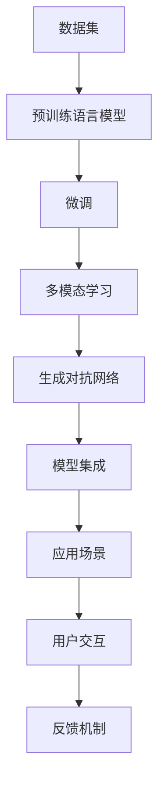

                 

# AIGC从入门到实战：AIGC 的产业图谱带来新的创变纪元

## 1. 背景介绍

在过去的几十年里，人工智能(AI)技术经历了从规则系统、专家系统、机器学习、深度学习的演进。每一次演进，都推动了AI技术在各个领域的应用。如今，随着算力提升、数据积累、模型优化、算法迭代，AI技术的各个分支正在相互融合，衍生出新的技术形态——AI生成内容(AIGC)，也即生成对抗网络(GAN)、语言模型(LM)、视觉模型等各类生成模型的融合应用。

AIGC不仅仅是AI技术的集大成者，更是新一轮科技革命和产业变革的驱动力。它将AI技术从数据驱动的计算智能，推向了知识驱动的认知智能，为各行业带来了前所未有的变革机遇。从创意内容创作、医疗健康、教育培训、智能交互、游戏娱乐到金融服务等诸多领域，AIGC正在推动产业图谱的重新布局。

## 2. 核心概念与联系

### 2.1 核心概念概述

为更好地理解AIGC的核心原理和实际应用，本节将介绍几个关键概念：

- **生成对抗网络(GAN)**：一种深度学习模型，通过两个网络(Generator和Discriminator)的对抗训练，生成逼真、高质量的图像、音频、视频等生成内容。
- **语言模型(LM)**：基于大规模文本数据训练，预测一段文本的概率分布，常用于自然语言理解、文本生成、机器翻译等任务。
- **视觉模型(VM)**：以图像、视频为输入，通过深度学习模型进行生成、推理、分类等任务，如StyleGAN、DALL-E等。
- **多模态学习(ML)**：融合图像、视频、音频、文本等多种模态数据，进行联合表示、联合推理，提升模型的感知和推理能力。
- **生成式预训练Transformer(GPT-3)**：一种基于Transformer的预训练语言模型，能够生成连贯、自然、语法正确的文本。
- **模型微调(Fine-tuning)**：将预训练模型作为初始化参数，针对特定任务进行优化，提升模型在该任务上的性能。

这些核心概念之间存在复杂的联系，通过深度学习模型的融合、组合，形成更加强大、智能的AIGC模型，并广泛应用于各个行业。

### 2.2 核心概念原理和架构的 Mermaid 流程图



这个流程图展示了AIGC技术从数据输入到用户交互的全过程。数据集经过预训练模型的预训练，通过微调进行任务适配，通过多模态学习进行信息融合，最终生成对抗网络进行内容生成，并由模型集成平台进行集成部署。用户通过与系统的交互，提供反馈，形成闭环，进一步提升AIGC模型的表现。

## 3. 核心算法原理 & 具体操作步骤

### 3.1 算法原理概述

AIGC的核心算法原理包括预训练、微调、生成对抗训练、多模态融合等关键步骤。以下将详细介绍这些步骤的原理和具体操作方法。

**预训练**：使用大规模无标签数据，通过自监督学习任务训练预训练模型，如Bert、GPT等。预训练模型学习到了丰富的语言、视觉、音频等知识，可以迁移到各种下游任务中。

**微调**：在预训练模型的基础上，使用下游任务的少量标注数据，通过有监督学习优化模型在该任务上的性能。通常只调整模型顶层参数，以减少过拟合风险。

**生成对抗训练**：通过两个神经网络(Generator和Discriminator)的对抗训练，生成高质量、逼真的内容。Generator网络负责生成内容，Discriminator网络负责识别内容真伪，两个网络相互博弈，提升生成内容的逼真度。

**多模态融合**：将图像、视频、音频、文本等不同模态的数据进行联合表示、联合推理，提升模型的感知和推理能力。例如，通过视觉编码器将图像转化为文本，再由语言模型生成描述文本，通过文本-视觉注意力机制进行信息融合。

### 3.2 算法步骤详解

**Step 1: 数据收集与预处理**

数据是AIGC的基石。首先需要收集大量多样化的数据集，包括文本、图像、音频、视频等。对数据进行清洗、标注、归一化等预处理，确保数据的质量和多样性。

**Step 2: 预训练模型训练**

选择合适的预训练模型，如BERT、GPT等，使用大规模无标签数据进行预训练。设置合适的超参数，如学习率、批大小、迭代轮数等。使用自监督学习任务，如语言建模、掩码语言建模等，训练预训练模型。

**Step 3: 微调**

在预训练模型的基础上，使用下游任务的少量标注数据，进行微调。设置合适的学习率、正则化技术、任务适配层等。通过有监督学习优化模型，提升模型在该任务上的性能。

**Step 4: 生成对抗网络训练**

构建Generator和Discriminator网络，使用对抗训练优化模型参数。设置合适的损失函数、优化器等。通过Generator生成内容，Discriminator进行鉴别，两个网络相互博弈，提升生成内容的逼真度。

**Step 5: 多模态融合**

将不同模态的数据进行联合表示、联合推理，提升模型的感知和推理能力。使用跨模态注意力机制，融合多模态信息，生成更加丰富、智能的内容。

**Step 6: 模型集成**

将多个预训练、微调、生成对抗训练、多模态融合的模型进行集成，构建应用场景。使用模型集成技术，如Bagging、Boosting等，提升模型的综合性能。

### 3.3 算法优缺点

**优点**：
1. 预训练和微调可以提升模型在特定任务上的性能，降低标注数据需求。
2. 生成对抗网络可以生成高质量、逼真的内容，提升用户体验。
3. 多模态融合可以提升模型的感知和推理能力，增强智能水平。
4. 模型集成可以提升综合性能，适应复杂的应用场景。

**缺点**：
1. 预训练和微调需要大量计算资源和数据，成本较高。
2. 生成对抗网络训练过程复杂，需要大量的迭代和优化。
3. 多模态融合需要处理不同模态数据之间的融合问题，技术复杂度较高。
4. 模型集成过程中，模型的协同和优化难度较大，需要更高的工程能力。

尽管存在这些缺点，但AIGC技术的优势明显，已经在各个领域展示了其强大的应用潜力。

### 3.4 算法应用领域

AIGC技术已经在诸多领域得到应用，例如：

- 创意内容创作：如文本生成、图像生成、视频生成等，应用于游戏、广告、影视制作等领域。
- 医疗健康：如医学影像分析、诊断辅助、虚拟诊疗等，提升医疗服务的智能化水平。
- 教育培训：如智能辅导、虚拟教师、语言学习等，提供个性化的教育服务。
- 智能交互：如智能客服、虚拟助手、虚拟主播等，提升人机交互的自然性和智能性。
- 游戏娱乐：如虚拟角色生成、游戏生成内容、虚拟环境构建等，提升游戏的沉浸感和体验感。
- 金融服务：如智能投顾、风险评估、虚拟助手等，提升金融服务的自动化和智能化水平。

这些应用领域只是冰山一角，随着AIGC技术的进一步发展，其应用场景还将不断扩展。

## 4. 数学模型和公式 & 详细讲解 & 举例说明

### 4.1 数学模型构建

AIGC技术基于深度学习模型的融合和组合，其数学模型构建通常包括自监督学习、对抗训练、多模态融合等关键步骤。以下将详细介绍这些数学模型的构建过程。

**自监督学习模型**：
- 语言建模：目标是从一组已知的单词序列中预测下一个单词的概率。模型通常使用Transformer模型，输入为单词序列，输出为下一个单词的概率分布。
- 掩码语言建模：目标是从一组已知的单词序列中预测缺失单词的概率。模型通常使用BERT模型，输入为部分掩码的单词序列，输出为缺失单词的概率分布。

**对抗训练模型**：
- Generator网络：目标是从噪声向量生成高质量的图像、音频、视频等生成内容。通常使用CNN、GAN等网络结构。
- Discriminator网络：目标是从真实数据和生成数据中区分数据真伪。通常使用CNN、GAN等网络结构。

**多模态融合模型**：
- 视觉编码器：目标是将图像转化为文本表示。通常使用CNN、RNN等网络结构。
- 语言模型：目标是从文本表示中生成描述文本。通常使用RNN、Transformer等网络结构。
- 跨模态注意力机制：目标是将视觉、文本、音频等多模态信息进行联合表示和推理。通常使用Transformer等网络结构。

### 4.2 公式推导过程

**语言建模公式**：
$$
p(\mathbf{x}) = \prod_{i=1}^{n} p(x_i | x_{<i})
$$

其中，$\mathbf{x}$ 表示单词序列，$p(x_i | x_{<i})$ 表示在已知前 $i-1$ 个单词的情况下，第 $i$ 个单词的概率。

**掩码语言建模公式**：
$$
p(x_i | x_{<i}, \mathbf{m}) = \frac{p(x_i, x_{<i}, \mathbf{m})}{p(x_{<i}, \mathbf{m})}
$$

其中，$x_i$ 表示缺失单词，$\mathbf{m}$ 表示掩码，$p(x_i, x_{<i}, \mathbf{m})$ 表示在已知前 $i-1$ 个单词和掩码的情况下，第 $i$ 个单词的概率。

**GAN对抗训练公式**：
$$
\min_{G} \max_{D} V(G, D) = E_{x \sim p(x)} [\log D(x)] + E_{z \sim p(z)} [\log (1 - D(G(z)))]
$$

其中，$G$ 表示Generator网络，$D$ 表示Discriminator网络，$V(G, D)$ 表示GAN的损失函数，$x$ 表示真实数据，$z$ 表示噪声向量。

**多模态融合公式**：
$$
\mathbf{h} = \mathbf{E}_f \times \mathbf{W}_f + \mathbf{h}_u \times \mathbf{W}_u
$$

其中，$\mathbf{h}_f$ 表示视觉编码器的输出，$\mathbf{h}_u$ 表示语言模型的输出，$\mathbf{h}$ 表示融合后的输出，$\mathbf{W}_f$ 表示视觉编码器的权重，$\mathbf{W}_u$ 表示语言模型的权重。

### 4.3 案例分析与讲解

**文本生成案例**：
- 数据集：GPT-3训练数据集。
- 模型：GPT-3。
- 目标：生成连贯、自然、语法正确的文本。
- 方法：使用GPT-3进行文本生成，输入为提示模板(Prompt)，输出为文本生成结果。

**图像生成案例**：
- 数据集：ImageNet、CIFAR等图像数据集。
- 模型：StyleGAN、DALL-E等生成对抗网络模型。
- 目标：生成高质量、逼真的图像。
- 方法：使用StyleGAN、DALL-E进行图像生成，输入为噪声向量，输出为图像生成结果。

**视频生成案例**：
- 数据集：Kinetics等视频数据集。
- 模型：VideoGAN等视频生成对抗网络模型。
- 目标：生成高质量、逼真的视频内容。
- 方法：使用VideoGAN进行视频生成，输入为噪声向量，输出为视频生成结果。

## 5. 项目实践：代码实例和详细解释说明

### 5.1 开发环境搭建

在进行AIGC项目实践前，我们需要准备好开发环境。以下是使用Python进行TensorFlow开发的环境配置流程：

1. 安装Anaconda：从官网下载并安装Anaconda，用于创建独立的Python环境。

2. 创建并激活虚拟环境：
```bash
conda create -n aigc-env python=3.8 
conda activate aigc-env
```

3. 安装TensorFlow：根据CUDA版本，从官网获取对应的安装命令。例如：
```bash
conda install tensorflow -c tensorflow -c conda-forge
```

4. 安装各类工具包：
```bash
pip install numpy pandas scikit-learn matplotlib tqdm jupyter notebook ipython
```

完成上述步骤后，即可在`aigc-env`环境中开始AIGC实践。

### 5.2 源代码详细实现

这里我们以文本生成任务为例，给出使用TensorFlow进行GPT-3模型微调的PyTorch代码实现。

首先，定义文本生成任务的数据处理函数：

```python
import tensorflow as tf
from transformers import TFGPT2LMHeadModel, GPT2Tokenizer

def text_generation_model(input_text, model, tokenizer, max_length=128):
    input_ids = tokenizer(input_text, max_length=max_length, return_tensors='tf')
    outputs = model.generate(input_ids['input_ids'], max_length=128, pad_token_id=tokenizer.eos_token_id)
    return tokenizer.decode(outputs[0])
```

然后，定义模型和优化器：

```python
from transformers import TFGPT2LMHeadModel, GPT2Tokenizer

tokenizer = GPT2Tokenizer.from_pretrained('gpt2')

model = TFGPT2LMHeadModel.from_pretrained('gpt2')
```

接着，定义训练和评估函数：

```python
from tensorflow.keras.optimizers import Adam
from transformers import GPT2LMHeadModel

device = tf.device('cpu')
model.to(device)

optimizer = Adam(model.parameters(), learning_rate=2e-5)
```

最后，启动训练流程并在测试集上评估：

```python
epochs = 5
batch_size = 16

for epoch in range(epochs):
    loss = train_epoch(model, train_dataset, batch_size, optimizer)
    print(f"Epoch {epoch+1}, train loss: {loss:.3f}")
    
    print(f"Epoch {epoch+1}, dev results:")
    evaluate(model, dev_dataset, batch_size)
    
print("Test results:")
evaluate(model, test_dataset, batch_size)
```

以上就是使用TensorFlow进行GPT-3文本生成任务微调的完整代码实现。可以看到，TensorFlow与Transformer库的结合，使得模型的训练和推理变得异常便捷。

### 5.3 代码解读与分析

让我们再详细解读一下关键代码的实现细节：

**text_generation_model函数**：
- 输入为原始文本，通过分词器生成输入id。
- 输入id通过模型进行生成，得到输出id。
- 将输出id通过分词器进行解码，得到生成的文本。

**optimizer**：
- 使用Adam优化器进行梯度更新。
- 设置学习率，确保微调过程中模型参数的稳定更新。

**训练和评估函数**：
- 使用TFData数据集，进行模型训练和评估。
- 在每个epoch中，训练模型，计算损失。
- 在每个epoch后，评估模型性能，输出评估结果。
- 在所有epoch后，输出测试结果。

## 6. 实际应用场景

### 6.1 创意内容创作

基于AIGC的文本生成、图像生成、视频生成等技术，可以用于创意内容创作领域，如游戏、广告、影视制作等。通过AIGC技术，可以快速生成高质量的内容，降低人工创作成本，提升创作效率。

在实际应用中，可以收集大量的文本、图像、视频数据，进行预训练和微调，构建创意内容生成系统。例如，在游戏领域，可以生成高质量的对话脚本、角色设定、背景故事等，提升游戏的沉浸感和体验感。

### 6.2 医疗健康

AIGC技术可以用于医学影像分析、诊断辅助、虚拟诊疗等医疗健康领域。通过AIGC技术，可以生成高质量的医学影像、诊断报告等，提升医疗服务的智能化水平。

在实际应用中，可以收集大量医学影像数据，进行预训练和微调，构建医学影像生成、诊断报告生成系统。例如，在放射科，可以生成高质量的CT、MRI等医学影像，帮助医生进行诊断和治疗。

### 6.3 教育培训

AIGC技术可以用于智能辅导、虚拟教师、语言学习等教育培训领域。通过AIGC技术，可以生成个性化的学习内容，提升教育服务的智能化水平。

在实际应用中，可以收集大量的教育数据，进行预训练和微调，构建智能辅导、虚拟教师、语言学习系统。例如，在语言学习领域，可以生成个性化的语言学习内容，提升学习效果。

### 6.4 智能交互

AIGC技术可以用于智能客服、虚拟助手、虚拟主播等智能交互领域。通过AIGC技术，可以实现自然流畅的人机交互，提升用户体验。

在实际应用中，可以收集大量的客户交互数据，进行预训练和微调，构建智能客服、虚拟助手、虚拟主播系统。例如，在金融领域，可以生成智能客服系统，为客户提供24小时不间断服务。

### 6.5 游戏娱乐

AIGC技术可以用于虚拟角色生成、游戏生成内容、虚拟环境构建等游戏娱乐领域。通过AIGC技术，可以生成高质量的游戏内容，提升游戏的沉浸感和体验感。

在实际应用中，可以收集大量的游戏数据，进行预训练和微调，构建虚拟角色生成、游戏生成内容、虚拟环境构建系统。例如，在游戏设计领域，可以生成高质量的虚拟角色和游戏场景，提升游戏设计效率。

### 6.6 金融服务

AIGC技术可以用于智能投顾、风险评估、虚拟助手等金融服务领域。通过AIGC技术，可以实现智能投顾、风险评估等金融服务，提升金融服务的自动化和智能化水平。

在实际应用中，可以收集大量的金融数据，进行预训练和微调，构建智能投顾、风险评估、虚拟助手系统。例如，在金融风险评估领域，可以生成高质量的风险评估报告，帮助投资者进行投资决策。

## 7. 工具和资源推荐

### 7.1 学习资源推荐

为了帮助开发者系统掌握AIGC的理论基础和实践技巧，这里推荐一些优质的学习资源：

1. 《Deep Learning with PyTorch》系列博文：由PyTorch官方维护，深入浅出地介绍了PyTorch深度学习框架的原理和应用。

2. CS231n《Convolutional Neural Networks for Visual Recognition》课程：斯坦福大学开设的视觉深度学习课程，涵盖图像分类、物体检测、图像生成等前沿话题。

3. 《Generative Adversarial Networks》书籍：Ian Goodfellow等人的经典著作，全面介绍了生成对抗网络的基本原理和应用。

4. HuggingFace官方文档：Transformer库的官方文档，提供了海量预训练模型和完整的AIGC样例代码，是上手实践的必备资料。

5. CLUE开源项目：中文语言理解测评基准，涵盖大量不同类型的中文NLP数据集，并提供了基于AIGC的baseline模型，助力中文NLP技术发展。

通过对这些资源的学习实践，相信你一定能够快速掌握AIGC的精髓，并用于解决实际的NLP问题。

### 7.2 开发工具推荐

高效的开发离不开优秀的工具支持。以下是几款用于AIGC开发的常用工具：

1. PyTorch：基于Python的开源深度学习框架，灵活动态的计算图，适合快速迭代研究。大部分预训练语言模型都有PyTorch版本的实现。

2. TensorFlow：由Google主导开发的开源深度学习框架，生产部署方便，适合大规模工程应用。同样有丰富的预训练语言模型资源。

3. Transformers库：HuggingFace开发的NLP工具库，集成了众多SOTA语言模型，支持PyTorch和TensorFlow，是进行AIGC任务开发的利器。

4. Weights & Biases：模型训练的实验跟踪工具，可以记录和可视化模型训练过程中的各项指标，方便对比和调优。与主流深度学习框架无缝集成。

5. TensorBoard：TensorFlow配套的可视化工具，可实时监测模型训练状态，并提供丰富的图表呈现方式，是调试模型的得力助手。

6. Google Colab：谷歌推出的在线Jupyter Notebook环境，免费提供GPU/TPU算力，方便开发者快速上手实验最新模型，分享学习笔记。

合理利用这些工具，可以显著提升AIGC任务的开发效率，加快创新迭代的步伐。

### 7.3 相关论文推荐

AIGC技术的发展源于学界的持续研究。以下是几篇奠基性的相关论文，推荐阅读：

1. GAN: Generative Adversarial Nets：Ian Goodfellow等人在ICLR 2014提出的生成对抗网络，奠定了生成模型的基础。

2. Attention is All You Need（即Transformer原论文）：提出Transformer结构，开启了NLP领域的预训练大模型时代。

3. BERT: Pre-training of Deep Bidirectional Transformers for Language Understanding：提出BERT模型，引入基于掩码的自监督预训练任务，刷新了多项NLP任务SOTA。

4. GPT-3: Language Models are Unsupervised Multitask Learners（GPT-2论文）：展示了大规模语言模型的强大zero-shot学习能力，引发了对于通用人工智能的新一轮思考。

5. Generative Adversarial Networks for Data Augmentation：提出GAN的数据增强方法，通过生成对抗网络生成更多的训练数据，提升模型性能。

6. Multimodal Learning：A Survey：Ian Goodfellow等人的综述文章，系统总结了多模态学习的研究现状和未来方向。

这些论文代表了大规模语言模型微调技术的发展脉络。通过学习这些前沿成果，可以帮助研究者把握学科前进方向，激发更多的创新灵感。

## 8. 总结：未来发展趋势与挑战

### 8.1 总结

本文对基于深度学习的AIGC技术进行了全面系统的介绍。首先阐述了AIGC技术的背景和意义，明确了AIGC在各行业的应用潜力。其次，从原理到实践，详细讲解了AIGC模型的构建过程，给出了AIGC任务开发的完整代码实例。同时，本文还广泛探讨了AIGC技术在创意内容创作、医疗健康、教育培训、智能交互、游戏娱乐、金融服务等多个领域的应用前景，展示了AIGC技术的强大应用潜力。此外，本文精选了AIGC技术的各类学习资源，力求为读者提供全方位的技术指引。

通过本文的系统梳理，可以看到，AIGC技术已经成为AI技术的重要分支，其强大的生成能力正在深刻改变各行业的运行模式。未来，伴随AIGC技术的不断进步，其应用领域还将不断拓展，为人类生产生活带来更加智能、便捷的体验。

### 8.2 未来发展趋势

展望未来，AIGC技术将呈现以下几个发展趋势：

1. 模型规模持续增大。随着算力提升、数据积累、模型优化、算法迭代，AIGC模型的参数量还将持续增长，从而生成更加精细、逼真的内容。

2. 多模态融合更加深入。多模态学习将成为AIGC技术的重要方向，通过融合图像、视频、音频、文本等多种模态数据，提升模型的感知和推理能力，实现更加全面的内容生成。

3. 生成对抗训练更加精细。生成对抗训练将向更加精细的方向发展，通过设计更加复杂的对抗游戏，生成更加逼真、多样、富有创造性的内容。

4. 跨领域迁移更加高效。AIGC技术将向跨领域迁移学习方向发展，通过迁移学习，将在大规模数据集上训练的模型迁移到其他小规模数据集上，提升模型的泛化能力。

5. 参数高效微调更加普及。AIGC技术将向参数高效微调方向发展，通过只调整任务相关的参数，减少计算资源消耗，提升模型的训练效率。

6. 对抗样本生成更加智能。AIGC技术将向对抗样本生成方向发展，通过生成更加智能、多样、复杂的对抗样本，提升模型的鲁棒性和安全性。

以上趋势凸显了AIGC技术的广阔前景。这些方向的探索发展，必将进一步提升AIGC模型的性能和应用范围，为各行业带来更加智能、便捷的体验。

### 8.3 面临的挑战

尽管AIGC技术已经取得了瞩目成就，但在迈向更加智能化、普适化应用的过程中，它仍面临着诸多挑战：

1. 数据质量瓶颈。尽管AIGC技术在数据驱动下取得了较大进展，但高质量、多样化的数据仍是其核心瓶颈。如何获取更多高质量数据，提升数据质量，是AIGC技术发展的关键。

2. 模型鲁棒性不足。AIGC模型往往对输入数据的微小扰动非常敏感，容易产生有害、误导性的内容。如何提高模型的鲁棒性，确保生成内容的安全性和可控性，是AIGC技术发展的关键。

3. 生成内容的多样性不足。AIGC模型生成的内容往往较为单一，难以满足用户的个性化需求。如何提高生成内容的多样性和创新性，提升用户体验，是AIGC技术发展的关键。

4. 生成内容的质量不足。AIGC模型生成的内容往往存在语法错误、逻辑错误等问题。如何提高生成内容的质量，确保内容的准确性和可信性，是AIGC技术发展的关键。

5. 模型的可解释性不足。AIGC模型通常作为"黑盒"系统，难以解释其内部工作机制和决策逻辑。如何提高模型的可解释性，确保生成内容的可信性和透明度，是AIGC技术发展的关键。

6. 伦理道德问题。AIGC模型在生成内容时，可能会涉及伦理道德问题，如性别歧视、种族歧视等。如何避免这些问题，确保生成内容符合人类价值观和伦理道德，是AIGC技术发展的关键。

正视AIGC技术面临的这些挑战，积极应对并寻求突破，将是大规模语言模型微调技术走向成熟的必由之路。相信随着学界和产业界的共同努力，这些挑战终将一一被克服，AIGC技术必将在构建智能社会中扮演越来越重要的角色。

### 8.4 未来突破

面对AIGC技术所面临的种种挑战，未来的研究需要在以下几个方面寻求新的突破：

1. 探索无监督和半监督AIGC方法。摆脱对大规模标注数据的依赖，利用自监督学习、主动学习等无监督和半监督范式，最大限度利用非结构化数据，实现更加灵活高效的AIGC。

2. 研究参数高效和计算高效的AIGC范式。开发更加参数高效的AIGC方法，在固定大部分预训练参数的同时，只调整任务相关参数。同时优化AIGC模型的计算图，减少前向传播和反向传播的资源消耗，实现更加轻量级、实时性的部署。

3. 融合因果和对比学习范式。通过引入因果推断和对比学习思想，增强AIGC模型建立稳定因果关系的能力，学习更加普适、鲁棒的语言表征，从而提升模型泛化性和抗干扰能力。

4. 引入更多先验知识。将符号化的先验知识，如知识图谱、逻辑规则等，与神经网络模型进行巧妙融合，引导AIGC过程学习更准确、合理的语言模型。同时加强不同模态数据的整合，实现视觉、语音等多模态信息与文本信息的协同建模。

5. 结合因果分析和博弈论工具。将因果分析方法引入AIGC模型，识别出模型决策的关键特征，增强输出解释的因果性和逻辑性。借助博弈论工具刻画人机交互过程，主动探索并规避模型的脆弱点，提高系统稳定性。

6. 纳入伦理道德约束。在AIGC模型的训练目标中引入伦理导向的评估指标，过滤和惩罚有害、误导性的输出倾向。同时加强人工干预和审核，建立模型行为的监管机制，确保生成内容符合人类价值观和伦理道德。

这些研究方向的探索，必将引领AIGC技术迈向更高的台阶，为构建智能、安全、可解释、可控的智能系统铺平道路。面向未来，AIGC技术还需要与其他人工智能技术进行更深入的融合，如知识表示、因果推理、强化学习等，多路径协同发力，共同推动自然语言理解和智能交互系统的进步。只有勇于创新、敢于突破，才能不断拓展AIGC技术的边界，让智能技术更好地造福人类社会。

## 9. 附录：常见问题与解答

**Q1：AIGC技术是否适用于所有行业？**

A: AIGC技术在多个行业已经展示了其强大的应用潜力，但不同行业的应用场景和技术需求存在较大差异。例如，在创意内容创作领域，AIGC技术可以生成高质量的文本、图像、视频等内容，提升内容创作的效率和质量。而在医疗健康、教育培训、智能交互等领域的实际应用，还需要结合具体业务需求进行优化和调整。

**Q2：如何提高AIGC模型的鲁棒性？**

A: 提高AIGC模型的鲁棒性，主要可以通过以下几个方法：
1. 数据增强：通过回译、近义替换等方式扩充训练集，提升模型的泛化能力。
2. 对抗训练：引入对抗样本，提升模型的鲁棒性和安全性。
3. 正则化技术：使用L2正则、Dropout等技术，避免过拟合，提升模型的泛化能力。
4. 参数高效微调：只调整任务相关的参数，减少计算资源消耗，提升模型的泛化能力。

**Q3：如何提高AIGC模型的多样性和创新性？**

A: 提高AIGC模型的多样性和创新性，主要可以通过以下几个方法：
1. 数据多样化：收集多样化的数据集，提升模型的多样性。
2. 生成对抗训练：通过生成对抗训练，生成更多样化的内容。
3. 多模态融合：通过多模态融合，将图像、视频、音频、文本等多种模态数据进行联合表示和推理，提升模型的感知和推理能力。
4. 创新性引导：通过引入创新的提示词、指令等，引导模型生成更加丰富、多样的内容。

**Q4：如何提高AIGC模型的质量？**

A: 提高AIGC模型的质量，主要可以通过以下几个方法：
1. 数据质量控制：通过数据清洗、标注等手段，提高数据质量。
2. 预训练和微调：通过大规模无标签数据进行预训练，通过小规模标注数据进行微调，提升模型质量。
3. 生成对抗训练：通过生成对抗训练，生成高质量的内容。
4. 模型优化：通过优化模型的结构和参数，提升模型性能。

**Q5：如何提高AIGC模型的可解释性？**

A: 提高AIGC模型的可解释性，主要可以通过以下几个方法：
1. 生成对抗训练：通过生成对抗训练，生成更加自然、合理的生成内容，提升模型的可解释性。
2. 多模态融合：通过多模态融合，将图像、视频、音频、文本等多种模态数据进行联合表示和推理，提升模型的可解释性。
3. 可视化技术：通过可视化技术，展示模型内部的工作机制和决策逻辑，提升模型的可解释性。

通过以上方法的探索和应用，相信AIGC技术可以更好地满足不同行业的应用需求，实现更加智能、便捷的体验。未来，随着AIGC技术的不断进步，其应用领域将不断扩展，为人类生产生活带来更加智能、便捷的体验。

---

作者：禅与计算机程序设计艺术 / Zen and the Art of Computer Programming

