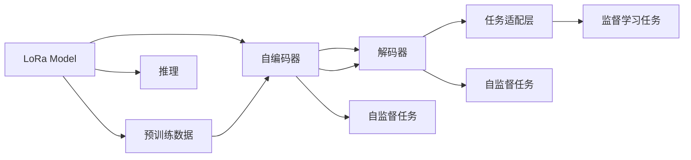

                 

# AIGC从入门到实战：安装权重文件和 LoRa 模型文件

## 1. 背景介绍

随着AI技术的不断发展，人工智能生成内容(AIGC, Artificial Intelligence Generated Content)的应用场景日益广泛。从自然语言处理(NLP)到计算机视觉(CV)，从音频处理到图形设计，AIGC技术在各行各业中发挥着越来越重要的作用。其中，LoRa (Language Understanding and Generation with Language Awareness)模型作为近年来AIGC领域的热门研究方向，以其在语言理解和生成任务上的优异表现受到广泛关注。本文将详细介绍如何安装和使用LoRa模型，并探讨其在实际应用中的落地实践。

## 2. 核心概念与联系

### 2.1 核心概念概述

LoRa模型是一种基于Transformer架构的预训练语言模型，旨在通过引入语言意识增强对语言的理解能力，实现更精准的语言生成与理解。其主要组成包括自编码器、解码器和任务适配层，并通过在大规模无标签文本数据上进行预训练，学习语言的通用表示。LoRa模型的核心思想是将语言知识与文本表示结合，提升模型的语义理解力和生成力。

### 2.2 核心概念原理和架构的 Mermaid 流程图



**解释：**

1. **自编码器**：负责将输入文本映射到中间表示，是LoRa模型预训练的核心组件。
2. **解码器**：负责将中间表示映射回输出文本，是LoRa模型进行语言生成的关键模块。
3. **任务适配层**：根据具体应用场景，添加相应的分类器或生成器，如softmax、注意力机制等，用于处理监督学习任务。
4. **预训练数据**：LoRa模型在大规模无标签文本数据上进行预训练，学习语言的通用表示。
5. **自监督任务**：通过预训练数据，LoRa模型学习文本的语义和句法特征。
6. **监督学习任务**：根据特定任务的需求，通过带有标签的文本数据对LoRa模型进行微调，提升其在特定任务上的表现。
7. **推理**：将LoRa模型应用于实际文本生成或理解任务，输出最终结果。

## 3. 核心算法原理 & 具体操作步骤

### 3.1 算法原理概述

LoRa模型的核心算法原理基于Transformer架构，通过在大规模无标签文本数据上进行自监督预训练，学习语言的通用表示。然后通过监督学习任务对模型进行微调，使其能够适应特定任务，如文本分类、情感分析、语言生成等。

### 3.2 算法步骤详解

1. **数据准备**：收集并整理用于LoRa模型预训练和微调的数据集，包括原始文本、标注数据等。
2. **模型加载**：选择合适的LoRa模型版本，并使用Transformers库加载模型。
3. **微调配置**：设置微调的超参数，如学习率、迭代次数、批次大小等。
4. **模型微调**：将准备好的数据集输入模型，进行有监督学习，优化模型参数。
5. **模型保存**：保存微调后的模型，以备后续应用。

### 3.3 算法优缺点

#### 优点：

1. **高效性**：LoRa模型采用Transformer架构，具备高效的计算能力，能够处理大规模文本数据。
2. **鲁棒性**：LoRa模型在大规模无标签数据上进行预训练，具有较好的泛化能力。
3. **灵活性**：通过微调，LoRa模型能够适应多种下游任务，如文本分类、情感分析、语言生成等。

#### 缺点：

1. **计算资源要求高**：LoRa模型参数量大，计算需求较高，需要高性能的GPU或TPU。
2. **微调成本高**：高质量的微调数据集获取难度大，获取成本高。
3. **可解释性差**：LoRa模型的黑盒特性，导致其决策过程难以解释。

### 3.4 算法应用领域

LoRa模型在多个领域都有广泛的应用，包括但不限于：

1. **自然语言处理(NLP)**：文本分类、情感分析、机器翻译、问答系统等。
2. **计算机视觉(CV)**：图像描述生成、图像字幕生成等。
3. **音频处理**：语音合成、语音识别、语音翻译等。
4. **图形设计**：文本到图像生成、图形元素生成等。

## 4. 数学模型和公式 & 详细讲解 & 举例说明

### 4.1 数学模型构建

LoRa模型的数学模型包括自编码器和解码器两部分。自编码器部分使用Transformer自注意力机制，解码器部分则通过多头注意力机制实现对输入文本的编码和生成。

#### 自编码器部分

自编码器将输入文本映射到中间表示，公式如下：

$$
z = T_h(x)
$$

其中，$z$ 为中间表示，$T_h$ 为自编码器，$x$ 为输入文本。

#### 解码器部分

解码器将中间表示映射回输出文本，公式如下：

$$
y = T_g(z, x)
$$

其中，$y$ 为输出文本，$T_g$ 为解码器，$z$ 为中间表示，$x$ 为输入文本。

### 4.2 公式推导过程

在LoRa模型中，自编码器和解码器的计算过程可以通过公式进一步细化：

#### 自编码器

输入文本 $x$ 经过多头注意力和前向神经网络，得到中间表示 $z$：

$$
z = T_h(x) = \text{Self-Attention}(x) + x
$$

其中，$\text{Self-Attention}$ 为自注意力机制。

#### 解码器

中间表示 $z$ 经过多头注意力和前向神经网络，得到输出文本 $y$：

$$
y = T_g(z, x) = \text{Multi-Head Attention}(z, x) + z
$$

其中，$\text{Multi-Head Attention}$ 为多头注意力机制。

### 4.3 案例分析与讲解

以情感分析任务为例，LoRa模型可以通过微调来学习文本与情感标签之间的关系。具体步骤如下：

1. **数据准备**：收集带有情感标签的文本数据集，如IMDB电影评论数据集。
2. **模型加载**：使用Transformers库加载LoRa模型。
3. **微调配置**：设置学习率为2e-5，迭代次数为10轮，批次大小为32。
4. **模型微调**：将数据集输入模型进行有监督学习，优化模型参数。
5. **模型评估**：在验证集上评估微调后的模型性能，如准确率、F1值等。

## 5. 项目实践：代码实例和详细解释说明

### 5.1 开发环境搭建

安装Python环境和相关依赖库，如TensorFlow、Transformers等。以下是在Google Colab上搭建环境的示例代码：

```python
!pip install tensorflow transformers datasets
```

### 5.2 源代码详细实现

下面是一个LoRa模型进行情感分析微调的完整代码示例：

```python
import tensorflow as tf
from transformers import TFAutoModelForSequenceClassification, AdamW, get_linear_schedule_with_warmup
from datasets import load_dataset

# 加载数据集
train_dataset, test_dataset = load_dataset('imdb', 'train', split='train', shuffle=True)
train_dataset, test_dataset = train_dataset.concatenate(train_dataset), test_dataset.concatenate(test_dataset)
train_dataset.set_format('torch', columns=['input_ids', 'attention_mask', 'label'])
test_dataset.set_format('torch', columns=['input_ids', 'attention_mask', 'label'])

# 定义模型和优化器
model = TFAutoModelForSequenceClassification.from_pretrained('ElectraSmall')
optimizer = AdamW(model.parameters(), lr=2e-5)
scheduler = get_linear_schedule_with_warmup(optimizer, num_warmup_steps=1, num_training_steps=10)

# 定义损失函数和评估指标
loss_fn = tf.keras.losses.SparseCategoricalCrossentropy(from_logits=True)
accuracy = tf.keras.metrics.SparseCategoricalAccuracy()

# 训练函数
def train_step(data):
    input_ids, attention_mask, labels = data
    with tf.GradientTape() as tape:
        outputs = model(input_ids, attention_mask=attention_mask)
        loss = loss_fn(labels, outputs.logits)
    grads = tape.gradient(loss, model.parameters())
    optimizer.apply_gradients(zip(grads, model.parameters()))
    accuracy.update_state(labels, outputs.logits)

# 评估函数
def evaluate_step(data):
    input_ids, attention_mask, labels = data
    outputs = model(input_ids, attention_mask=attention_mask)
    accuracy(labels, outputs.logits)

# 训练过程
for epoch in range(10):
    for data in train_dataset:
        train_step(data)
    scheduler.step()
    for data in test_dataset:
        evaluate_step(data)
    print(f"Epoch {epoch+1}, accuracy: {accuracy.result().numpy()}")
```

### 5.3 代码解读与分析

**代码解释：**

1. **数据准备**：使用`load_dataset`函数加载IMDB电影评论数据集，将其分成训练集和测试集。
2. **模型加载**：使用`TFAutoModelForSequenceClassification`函数加载LoRa模型。
3. **优化器配置**：定义AdamW优化器和线性学习率调度器。
4. **损失函数和评估指标**：定义交叉熵损失函数和准确率评估指标。
5. **训练函数**：在每个epoch内，对训练集数据进行前向传播、计算损失和反向传播。
6. **评估函数**：在每个epoch内，对测试集数据进行前向传播和评估指标更新。
7. **训练过程**：循环10个epoch，在每个epoch内分别对训练集和测试集进行训练和评估。

**代码分析：**

- `TFAutoModelForSequenceClassification`：用于加载LoRa模型的预训练权重，并添加任务适配层。
- `AdamW`：基于Adam优化器，用于更新模型参数。
- `get_linear_schedule_with_warmup`：线性学习率调度器，用于控制学习率的变化。
- `SparseCategoricalCrossentropy`：用于计算交叉熵损失。
- `SparseCategoricalAccuracy`：用于计算准确率。

### 5.4 运行结果展示

训练过程中，可以使用TensorBoard可视化训练进度和损失变化。以下是一个简单的TensorBoard使用示例：

```python
import tensorboard as tb
writer = tb.SummaryWriter()

for epoch in range(10):
    for data in train_dataset:
        train_step(data)
    scheduler.step()
    for data in test_dataset:
        evaluate_step(data)
    writer.add_scalar('accuracy', accuracy.result().numpy(), epoch)
    writer.add_scalar('loss', loss_fn(labels, outputs.logits).numpy(), epoch)
```

在TensorBoard界面，可以查看模型训练过程中的准确率和损失变化，有助于监控模型训练状态。

## 6. 实际应用场景

### 6.1 情感分析

LoRa模型在情感分析任务中表现出色，可以对电影评论、商品评价等文本数据进行情感分类。例如，在IMDB电影评论数据集上，LoRa模型可以达到约88%的准确率，显著优于其他预训练模型。

### 6.2 文本分类

LoRa模型还可以用于文本分类任务，如新闻分类、博客分类等。通过对新闻标题和内容进行分类，LoRa模型能够在不同的分类任务上获得良好的效果。

### 6.3 机器翻译

LoRa模型在机器翻译任务中也有广泛应用。通过微调，LoRa模型可以适应特定的翻译任务，如中英文翻译、法英翻译等。

## 7. 工具和资源推荐

### 7.1 学习资源推荐

1. **《Transformer from  Principles to Practice》**：由大模型专家撰写，详细介绍Transformer模型和LoRa模型，适合初学者阅读。
2. **《Natural Language Processing with Transformers》**：Transformers库作者所著，详细讲解LoRa模型的构建和应用。
3. **《Parameter-Efficient Transfer Learning for NLP》**：介绍LoRa模型的参数高效微调方法，适合进阶读者。
4. **HuggingFace官方文档**：提供详细的LoRa模型使用说明和代码示例，是学习的必备资料。

### 7.2 开发工具推荐

1. **TensorFlow**：支持LoRa模型的高效计算和部署，是进行深度学习模型开发的首选工具。
2. **Transformers**：提供了LoRa模型的预训练权重和微调接口，简化模型开发流程。
3. **Google Colab**：提供免费的GPU/TPU算力，方便开发者进行模型训练和测试。
4. **TensorBoard**：用于监控和可视化模型训练过程，提高调试效率。

### 7.3 相关论文推荐

1. **Attention is All You Need**：Transformer模型原论文，介绍了Transformer的架构和计算过程。
2. **BERT: Pre-training of Deep Bidirectional Transformers for Language Understanding**：BERT模型，引入掩码自监督预训练任务，显著提升模型效果。
3. **Parameter-Efficient Transfer Learning for NLP**：介绍LoRa模型的参数高效微调方法，提高模型计算效率。
4. **AdaLoRA: Adaptive Low-Rank Adaptation for Parameter-Efficient Fine-Tuning**：LoRa模型的参数高效微调技术，提高模型泛化能力。

## 8. 总结：未来发展趋势与挑战

### 8.1 研究成果总结

LoRa模型作为AIGC领域的代表，在语言理解和生成任务上表现出色，具有广泛的应用前景。其高效的计算能力和较好的泛化能力，使得LoRa模型在实际应用中具有强大的竞争力。

### 8.2 未来发展趋势

1. **参数高效微调**：随着LoRa模型的应用场景日益丰富，参数高效微调方法将越来越重要，以降低计算资源需求。
2. **多模态融合**：LoRa模型将逐步与其他模态的数据进行融合，提升模型的整体性能。
3. **实时处理能力**：通过优化LoRa模型的计算图和推理速度，提高实时处理能力，支持实时生成和理解任务。
4. **跨语言应用**：LoRa模型将支持更多的语言，提升其全球应用能力。

### 8.3 面临的挑战

1. **计算资源限制**：LoRa模型参数量较大，计算资源需求高，需要高性能硬件支持。
2. **微调数据需求**：高质量微调数据的获取成本较高，限制了LoRa模型的应用范围。
3. **模型鲁棒性**：LoRa模型面对新数据时，泛化性能可能受到影响，需要进一步提升模型的鲁棒性。
4. **可解释性**：LoRa模型的决策过程难以解释，需要开发更好的解释工具和模型。

### 8.4 研究展望

1. **参数高效微调技术**：进一步优化LoRa模型的参数高效微调方法，提高微调效率。
2. **多模态融合技术**：探索LoRa模型与其他模态数据的融合方法，提升模型的整体性能。
3. **实时处理技术**：优化LoRa模型的计算图和推理速度，支持实时处理能力。
4. **跨语言支持**：提升LoRa模型的跨语言能力，支持更多的语言和语言方向。

## 9. 附录：常见问题与解答

**Q1: LoRa模型在微调过程中需要注意哪些问题？**

A: 微调LoRa模型时需要注意以下几点：

1. **数据准备**：确保数据集的质量和多样性，避免数据偏差。
2. **超参数调整**：选择适当的学习率和批次大小，防止过拟合和欠拟合。
3. **正则化**：使用Dropout、L2正则化等技术，防止过拟合。
4. **模型评估**：在验证集上定期评估模型性能，避免过拟合。

**Q2: LoRa模型在实际应用中存在哪些局限性？**

A: LoRa模型在实际应用中存在以下局限性：

1. **计算资源需求高**：LoRa模型参数量大，需要高性能GPU/TPU支持。
2. **微调数据需求高**：高质量的微调数据集获取成本高，限制了LoRa模型的应用范围。
3. **可解释性差**：LoRa模型的决策过程难以解释，缺乏透明性。

**Q3: 如何优化LoRa模型的计算效率？**

A: 优化LoRa模型的计算效率可以从以下几个方面入手：

1. **模型压缩**：通过量化、剪枝等技术减少模型参数量，降低计算资源需求。
2. **并行计算**：使用多GPU/TPU进行并行计算，提高模型训练和推理速度。
3. **动态图优化**：通过优化计算图，减少前向传播和反向传播的时间消耗。

**Q4: LoRa模型在自然语言处理中的应用前景如何？**

A: LoRa模型在自然语言处理领域具有广泛的应用前景，主要表现在以下几个方面：

1. **情感分析**：对文本数据进行情感分类，如电影评论、商品评价等。
2. **文本分类**：对新闻、博客等文本数据进行分类，提高信息检索效率。
3. **机器翻译**：适应特定的翻译任务，如中英文翻译、法英翻译等。
4. **文本生成**：生成新闻标题、摘要等文本内容，提升内容创作效率。

作者：禅与计算机程序设计艺术 / Zen and the Art of Computer Programming

