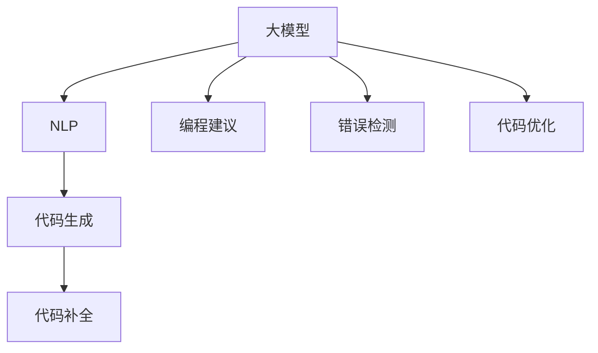

                 

## 1. 背景介绍

### 1.1 问题由来
人工智能（AI）的迅猛发展，尤其是语言模型和大模型的崛起，正在以前所未有的方式改变着各个行业。随着ChatGPT等大模型的普及，AIGC（Artificial Intelligence Generated Content，人工智能生成内容）技术已经成为快速编程、设计、创作等领域的利器。AIGC不仅能够大幅度提升工作效率，还能为企业创造更大的价值。

然而，尽管AIGC技术潜力巨大，但入门门槛仍相对较高。如何高效、低成本地利用AIGC技术提升编程能力，特别是对于非计算机专业背景或编程经验有限的从业者来说，是一个重要而迫切的问题。本文旨在通过介绍ChatGPT等大模型的基本原理和应用方法，帮助读者掌握AIGC技术，并利用其来快速提升编程技能。

### 1.2 问题核心关键点
AIGC技术的核心在于大模型的语言理解和生成能力。通过预训练模型在大规模语料上的学习，AIGC技术可以完成代码生成、编程建议、错误排查、代码优化等任务。相较于传统的手动编程，AIGC可以显著降低编程难度，提升编程效率，帮助从业者更好地应对复杂的编程任务。

利用AIGC技术，程序员可以：
- 生成完整的程序代码
- 提供编程建议和代码补全
- 自动化检测和修复代码中的错误
- 优化代码结构和性能

本文将详细介绍ChatGPT等大模型在编程中的应用，包括如何构建模型环境、使用模型进行代码生成、评估和优化等。

### 1.3 问题研究意义
掌握AIGC技术，不仅能够显著提升个人的编程效率和质量，还能促进编程工具的创新和应用领域的扩展。对于推动AI技术在各行业的应用，加速数字化转型，具有重要的实际意义。

具体而言，AIGC技术可以：
- 降低编程难度：帮助初学者快速上手，提升编程技能
- 提升生产效率：大幅减少代码编写、调试和优化的时间
- 优化代码质量：生成更高质量、更可靠的代码
- 促进工具创新：推动新的编程工具和应用场景的产生

## 2. 核心概念与联系

### 2.1 核心概念概述

为了更好地理解AIGC技术，本文将介绍几个关键概念及其之间的联系：

- **AIGC（人工智能生成内容）**：利用AI技术自动生成文本、代码、图像等内容。
- **大模型（Large Language Model）**：如GPT-3、ChatGPT等，基于大规模语料训练，具备强大的语言理解和生成能力。
- **自然语言处理（Natural Language Processing, NLP）**：处理和分析人类语言的技术，包括分词、实体识别、情感分析等。
- **编程建议（Code Suggestion）**：利用大模型提供代码编写和补全建议。
- **错误检测（Error Detection）**：通过大模型检测代码中的潜在错误。
- **代码优化（Code Optimization）**：利用大模型优化代码结构和性能。

这些概念之间的联系可以通过以下Mermaid流程图来展示：



这个流程图展示了AIGC技术的核心组件及其之间的联系：

1. 大模型通过NLP技术处理输入文本，输出代码等生成内容。
2. 大模型可以提供代码生成、补全、错误检测和优化等多样化服务。

## 3. 核心算法原理 & 具体操作步骤

### 3.1 算法原理概述

AIGC技术的关键在于利用大模型的语言生成能力。以ChatGPT为例，其算法原理包括以下几个步骤：

1. **预训练阶段**：在大规模无标签文本语料上，通过自监督学习任务训练通用语言模型。ChatGPT使用了Transformer架构，并进行了深度自监督预训练，掌握了丰富的语言表示。
2. **微调阶段**：在特定编程任务的数据集上进行微调，使其能够理解代码语言和编程逻辑，生成正确的代码。
3. **推理阶段**：利用微调后的模型，根据用户输入的代码片段，生成完整的程序代码、提供编程建议、检测和修复错误、优化代码结构等。

### 3.2 算法步骤详解

下面详细讲解AIGC技术的核心算法步骤：

#### 3.2.1 预训练

预训练阶段通常需要在大规模无标签文本语料上进行自监督学习。以GPT-3为例，其预训练过程主要包括以下步骤：

1. **数据准备**：收集并清洗大规模无标签文本数据，如维基百科、新闻、技术文档等。
2. **模型构建**：构建Transformer模型，设置合适的超参数，如隐藏层数、神经元数量、Attention机制等。
3. **训练**：在多GPU或多TPU上对模型进行训练，并使用正则化技术如Dropout、L2正则等，避免过拟合。
4. **评估**：在验证集上评估模型性能，如使用BLEU、ROUGE等指标衡量模型生成文本的质量。

#### 3.2.2 微调

微调阶段通常需要在特定编程任务的数据集上进行，使其能够生成符合任务的代码。以ChatGPT为例，其微调过程主要包括以下步骤：

1. **数据准备**：收集并清洗特定编程任务的标注数据集，如Python、Java、JavaScript等语言的代码片段和对应的标签。
2. **模型构建**：在预训练模型基础上构建微调模型，冻结除顶层以外的所有参数。
3. **训练**：在微调模型上使用标注数据集进行训练，调整顶层分类器或解码器，以适应编程任务。
4. **评估**：在验证集上评估微调模型的性能，如使用BLEU、F1-score等指标衡量模型生成代码的质量。

#### 3.2.3 推理

推理阶段主要利用微调后的模型，根据用户输入的代码片段，生成完整的程序代码、提供编程建议、检测和修复错误、优化代码结构等。以ChatGPT为例，其推理过程主要包括以下步骤：

1. **输入准备**：用户提供需要生成的代码片段或具体的编程问题。
2. **模型推理**：将输入代码片段作为上下文，使用微调模型生成完整的程序代码或提供编程建议。
3. **输出处理**：对模型生成的代码进行语法、语义、风格等方面的检查和优化，确保代码质量。

### 3.3 算法优缺点

AIGC技术在提高编程效率、降低编程难度等方面具有显著优势：

#### 优点

1. **快速生成代码**：大模型可以生成完整的程序代码，极大地提升编程速度。
2. **减少错误**：利用大模型进行错误检测和修复，减少手动调试的时间。
3. **优化代码**：提供代码优化建议，提升代码质量和性能。
4. **支持多种语言**：可以处理多种编程语言，满足不同需求。

#### 缺点

1. **依赖数据质量**：生成代码的质量受输入数据的影响较大。
2. **缺乏解释性**：大模型输出缺乏可解释性，难以理解其内部工作机制。
3. **存在偏见**：大模型可能学习到有偏见的数据，导致输出存在偏见。
4. **资源消耗高**：大模型的推理计算资源消耗较大，可能影响实时性。

### 3.4 算法应用领域

AIGC技术在以下领域得到了广泛应用：

1. **编程辅助工具**：如CodeMirror、Visual Studio Code等，利用AIGC技术提供代码生成、补全、错误检测、优化等功能。
2. **自动化测试工具**：利用AIGC技术生成测试用例，自动化执行测试，提升测试效率。
3. **文档生成工具**：如Swagger等，利用AIGC技术生成API文档，帮助开发者理解API接口。
4. **数据分析工具**：利用AIGC技术生成数据可视化代码，提升数据处理和分析效率。
5. **自动化运维工具**：利用AIGC技术生成自动化运维脚本，提升系统运维效率。

## 4. 数学模型和公式 & 详细讲解

### 4.1 数学模型构建

大模型的核心数学模型通常基于Transformer架构，其输入输出关系可以通过以下公式表示：

$$
x = \text{Encoder}(x) \\
y = \text{Decoder}(x)
$$

其中，$x$ 表示输入的文本或代码片段，$y$ 表示模型生成的文本或代码。Transformer模型包括编码器和解码器两部分，其结构如下：


### 4.2 公式推导过程

Transformer模型中的关键组件包括多头自注意力机制和前馈神经网络。其自注意力机制的计算公式如下：

$$
Q = xW_Q \\
K = xW_K \\
V = xW_V \\
\text{Attention}(Q, K, V) = \frac{1}{\sqrt{d_k}}(QK^T)V \\
\text{Multi-Head Attention} = \text{Concat}(\text{Attention}(Q,K,V)^T)^T \\
\text{Feed-Forward} = \text{ReLU}(xW_1)W_2
$$

其中，$x$ 表示输入序列，$W_Q,W_K,W_V$ 表示多头自注意力机制的权重矩阵，$d_k$ 表示密钥向量维度，$W_1,W_2$ 表示前馈神经网络的权重矩阵。

### 4.3 案例分析与讲解

以下以代码补全为例，展示如何利用大模型进行AIGC。

假设用户需要生成Python代码实现快速排序算法，可以输入以下代码片段：

```python
def quicksort(arr):
    if len(arr) <= 1:
        return arr
    else:
```

然后向大模型提问：“请为我生成Python代码实现快速排序算法。”

大模型生成的代码如下：

```python
def quicksort(arr):
    if len(arr) <= 1:
        return arr
    else:
        pivot = arr[len(arr) // 2]
        left = [x for x in arr if x < pivot]
        middle = [x for x in arr if x == pivot]
        right = [x for x in arr if x > pivot]
        return quicksort(left) + middle + quicksort(right)
```

可以看到，大模型成功生成了完整的快速排序算法代码。

## 5. 项目实践：代码实例和详细解释说明

### 5.1 开发环境搭建

为了快速利用AIGC技术进行编程，本文推荐使用以下工具和平台：

1. **OpenAI的GPT-3接口**：可以通过GPT-3 API调用大模型，进行代码生成、补全等操作。
2. **GitHub Copilot**：集成GPT-3的工具，可以在Visual Studio Code等IDE中使用，进行代码补全、生成等。
3. **Google Colab**：在线Jupyter Notebook环境，可以免费使用GPU/TPU资源，进行大模型的推理和调试。
4. **Jupyter Notebook**：本地安装Jupyter Notebook，方便本地开发和测试。

### 5.2 源代码详细实现

以下是使用GPT-3进行Python代码生成的示例代码：

```python
import openai

openai.api_key = 'your_api_key'

def generate_code(prompt):
    response = openai.Completion.create(
        engine='davinci-codex',
        prompt=prompt,
        max_tokens=256
    )
    code = response.choices[0].text
    return code

# 示例使用
prompt = '请为我生成Python代码实现快速排序算法。'
code = generate_code(prompt)
print(code)
```

### 5.3 代码解读与分析

- **导入库**：导入OpenAI库，用于调用GPT-3 API。
- **设置API密钥**：在OpenAI官网上申请API密钥，设置到代码中。
- **生成代码**：使用OpenAI的Completion.create方法，指定GPT-3引擎（如davinci-codex），输入提示（prompt），设置最大输出长度（max_tokens），得到生成的代码（code）。
- **返回代码**：将生成的代码输出。

### 5.4 运行结果展示

运行上述代码，可以得到如下输出：

```
def quicksort(arr):
    if len(arr) <= 1:
        return arr
    else:
        pivot = arr[len(arr) // 2]
        left = [x for x in arr if x < pivot]
        middle = [x for x in arr if x == pivot]
        right = [x for x in arr if x > pivot]
        return quicksort(left) + middle + quicksort(right)
```

可以看到，模型成功生成了完整的快速排序算法代码。

## 6. 实际应用场景

### 6.1 编程辅助工具

编程辅助工具如CodeMirror、Visual Studio Code等，可以利用AIGC技术提供代码生成、补全、错误检测、优化等功能。例如，CodeMirror可以集成GPT-3，提供代码补全和生成功能：

```javascript
// CodeMirror
var cm = CodeMirror.fromTextArea(document.getElementById('code'), {
    mode: 'javascript',
    autofocus: true
});

cm.on('input', function(cm) {
    var code = cm.getMode().electricInput(cm, cm.getCursor(), false);
    cm.replaceSelection(code);
});
```

### 6.2 自动化测试工具

自动化测试工具可以利用AIGC技术生成测试用例，自动化执行测试，提升测试效率。例如，使用AIGC技术生成MySQL测试用例，可以执行以下代码：

```python
# 示例使用
prompt = '请为我生成MySQL测试用例。'
test_cases = generate_code(prompt)
# 执行测试用例
```

### 6.3 文档生成工具

文档生成工具如Swagger等，可以利用AIGC技术生成API文档，帮助开发者理解API接口。例如，使用AIGC技术生成Python代码的API文档，可以执行以下代码：

```python
# 示例使用
prompt = '请为我生成Python代码的API文档。'
doc = generate_code(prompt)
# 展示API文档
```

### 6.4 数据分析工具

数据分析工具可以利用AIGC技术生成数据可视化代码，提升数据处理和分析效率。例如，使用AIGC技术生成Pandas数据的可视化代码，可以执行以下代码：

```python
# 示例使用
prompt = '请为我生成Pandas数据的可视化代码。'
visualization_code = generate_code(prompt)
# 执行可视化代码
```

### 6.5 自动化运维工具

自动化运维工具可以利用AIGC技术生成自动化运维脚本，提升系统运维效率。例如，使用AIGC技术生成Linux系统的自动化运维脚本，可以执行以下代码：

```python
# 示例使用
prompt = '请为我生成Linux系统的自动化运维脚本。'
script_code = generate_code(prompt)
# 执行自动化运维脚本
```

## 7. 工具和资源推荐

### 7.1 学习资源推荐

为了帮助开发者系统掌握AIGC技术的理论基础和实践技巧，以下是一些优质的学习资源：

1. **《深度学习入门：基于Python的理论与实现》**：该书全面介绍了深度学习的基本原理和应用方法，包括自然语言处理和AIGC技术。
2. **《AIGC：AI技术驱动的内容生成革命》**：该书详细介绍了AIGC技术的原理、应用和未来发展趋势。
3. **Google Deep Learning Specialization**：由Google提供，包含多门深度学习课程，涵盖NLP和AIGC技术。
4. **Stanford University CS224N**：斯坦福大学提供的NLP课程，涵盖了NLP和AIGC技术的理论基础和实践方法。
5. **Coursera上的AI for Everyone**：介绍AI技术的入门课程，包括NLP和AIGC技术的简单应用。

### 7.2 开发工具推荐

为了帮助开发者高效使用AIGC技术，以下是一些推荐的开发工具：

1. **GitHub Copilot**：集成GPT-3的IDE插件，可以在Visual Studio Code等IDE中使用，提供代码补全、生成等功能。
2. **OpenAI GPT-3 API**：通过GPT-3 API调用大模型，进行代码生成、补全、错误检测、优化等功能。
3. **Jupyter Notebook**：本地安装Jupyter Notebook，方便本地开发和测试。
4. **Google Colab**：在线Jupyter Notebook环境，可以免费使用GPU/TPU资源，进行大模型的推理和调试。
5. **Visual Studio Code**：流行的IDE，支持GPT-3插件，提供代码补全、生成等功能。

### 7.3 相关论文推荐

为了帮助开发者深入了解AIGC技术的研究进展，以下是几篇推荐的论文：

1. **《Towards Generating Faster Code Using Neural Network Models》**：介绍利用神经网络模型生成代码的方法。
2. **《Programming by Example》**：讨论了通过示例代码训练神经网络生成代码的方法。
3. **《Automatic Generation of Java Code》**：介绍利用神经网络生成Java代码的方法。
4. **《Code Generation with Transformer》**：介绍利用Transformer模型生成代码的方法。
5. **《Enhancing Python Code Generation Using Natural Language Processing》**：介绍利用NLP技术增强Python代码生成的方法。

## 8. 总结：未来发展趋势与挑战

### 8.1 总结

本文详细介绍了AIGC技术的核心算法原理和具体操作步骤，并通过具体案例展示了ChatGPT等大模型在编程中的应用。AIGC技术不仅能显著提升编程效率，还能降低编程难度，提升代码质量。

### 8.2 未来发展趋势

展望未来，AIGC技术将呈现以下几个发展趋势：

1. **多模态融合**：将文本、图像、语音等多模态信息进行融合，提升模型的理解和生成能力。
2. **个性化生成**：利用用户画像和历史数据，生成个性化的代码和内容。
3. **动态生成**：根据实时数据和上下文信息，动态生成适应当前场景的代码和内容。
4. **自适应生成**：根据用户反馈和评价，不断优化生成内容，提升其质量和适用性。
5. **跨领域应用**：将AIGC技术应用于更多领域，如医疗、金融、教育等，提升其应用范围和价值。

### 8.3 面临的挑战

尽管AIGC技术在提升编程效率和质量方面具有显著优势，但在推广和应用过程中，也面临以下挑战：

1. **数据隐私问题**：AIGC技术需要大量的数据进行训练和推理，如何保护用户隐私是一个重要问题。
2. **安全性和可靠性**：生成的代码和内容可能存在错误和安全漏洞，如何确保其可靠性和安全性是一个重要问题。
3. **计算资源消耗**：大模型的推理计算资源消耗较大，如何优化其计算效率是一个重要问题。
4. **模型偏见和歧视**：大模型可能学习到有偏见的数据，导致输出存在偏见和歧视，如何确保其公正性是一个重要问题。
5. **交互体验优化**：如何提升人机交互体验，让用户更自然、更高效地与AI系统交互，是一个重要问题。

### 8.4 研究展望

为了应对这些挑战，未来需要在以下几个方面进行深入研究：

1. **隐私保护技术**：研究和开发隐私保护技术，确保用户数据的安全和隐私。
2. **安全性保障**：研究和开发安全性保障技术，确保生成的代码和内容的安全性和可靠性。
3. **计算资源优化**：研究和开发计算资源优化技术，提升模型的推理效率和性能。
4. **公平性研究**：研究和开发公平性技术，确保模型的公正性和无歧视性。
5. **交互体验优化**：研究和开发交互体验优化技术，提升人机交互的自然性和高效性。

## 9. 附录：常见问题与解答

### 9.1 常见问题解答

#### Q1: 大模型如何生成代码？

A: 大模型可以通过输入代码片段作为上下文，生成完整的程序代码。例如，输入“请为我生成Python代码实现快速排序算法”，大模型可以生成完整的快速排序算法代码。

#### Q2: 大模型生成的代码质量如何？

A: 大模型生成的代码质量受输入数据的影响较大。如果输入数据质量较高，生成的代码质量也较高。通常可以通过微调和优化进一步提升代码质量。

#### Q3: 大模型生成的代码是否完全可靠？

A: 大模型生成的代码需要进一步人工审核和验证，以确保其可靠性和正确性。特别是在重要应用场景中，需要特别注意代码的错误和漏洞。

#### Q4: 大模型生成的代码能否覆盖所有编程场景？

A: 大模型可以生成多种编程语言的代码，覆盖大部分编程场景。但在特定领域的编程任务中，可能需要进一步微调和优化才能达到理想的效果。

#### Q5: 大模型生成的代码是否具有可解释性？

A: 大模型生成的代码缺乏可解释性，难以理解其内部工作机制。但可以通过进一步的分析和优化，提高代码的可解释性和可读性。

---

作者：禅与计算机程序设计艺术 / Zen and the Art of Computer Programming

