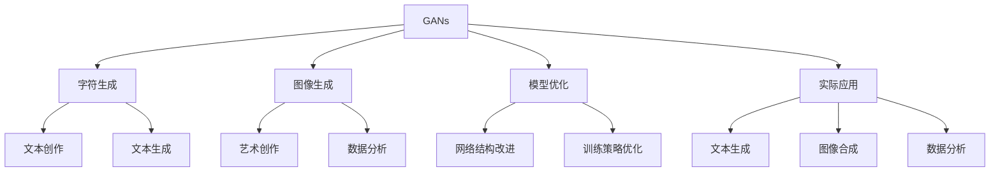

                 

# AIGC从入门到实战：跟着我学习 Midjourney 的使用

在人工智能领域，生成对抗网络（Generative Adversarial Networks, GANs）无疑是近年来最引人注目的技术之一。它由Ian Goodfellow等人在2014年提出，通过让两个神经网络（生成器和判别器）互相博弈，生成逼真的图像、音频、文本等。这种技术不仅在游戏、娱乐等领域有着广泛应用，也在艺术创作、数据增强等方面展现了巨大的潜力。

本文将详细探讨基于Midjourney的中英文字符生成和图像生成技术，从入门到实战，帮助读者系统地掌握相关技术和实践技巧。

## 1. 背景介绍

### 1.1 问题由来

人工智能生成对抗网络（GANs）是一种通过两个神经网络相互博弈，生成逼真数据的技术。其中一个网络称为生成器（Generator），目标是生成与真实数据相似的假数据；另一个网络称为判别器（Discriminator），目标是区分生成的假数据和真实数据。这两个网络通过迭代训练，逐步提升生成器的生成质量，降低判别器的区分能力。

GANs技术近年来在生成假图像、音频、文本等领域取得了显著进展。尤其在艺术创作、生成式对话、数据分析等方面，展示了其在模拟复杂数据分布、生成高保真内容等方面的强大能力。

然而，尽管GANs技术在理论和实践上已经取得了重要进展，但仍然存在一些挑战。如生成器与判别器之间的平衡问题、模型不稳定、训练时间长等问题，需要我们在实践中不断优化和改进。

### 1.2 问题核心关键点

基于GANs的中英文字符生成和图像生成，可以从以下几个方面进行系统研究：

1. **GANs算法**：核心是理解生成器和判别器的训练过程和网络结构。
2. **字符生成**：利用GANs生成高质量的中英文字符序列。
3. **图像生成**：通过GANs生成逼真的图像，应用于艺术创作、数据分析等领域。
4. **优化与改进**：研究GANs中的模型优化和训练策略，提升生成效果和稳定性。
5. **应用与实践**：探讨GANs在实际场景中的应用，如文本创作、图像合成等。

### 1.3 问题研究意义

随着GANs技术的不断发展和深入研究，其在图像、文本生成等领域展现了巨大的潜力。掌握GANs技术，不仅有助于理解生成式AI的基本原理，还可以应用于实际场景中，提升数据处理、内容创作的能力。同时，对于中英文字符生成和图像生成等前沿问题，深入研究GANs技术可以推动相关领域的发展，带来新的突破。

## 2. 核心概念与联系

### 2.1 核心概念概述

为更好地理解Midjourney中的GANs技术，本节将介绍几个密切相关的核心概念：

- **生成对抗网络（GANs）**：由生成器（Generator）和判别器（Discriminator）组成的框架，通过博弈学习生成逼真数据。
- **字符生成（Text Generation）**：利用GANs生成高质量的中英文字符序列，用于文本创作、文本生成等领域。
- **图像生成（Image Generation）**：利用GANs生成逼真的图像，应用于艺术创作、数据分析、图像生成等领域。
- **模型优化**：通过改进GANs的网络结构、训练策略等，提升生成效果和模型稳定性。
- **实际应用**：探索GANs技术在实际场景中的应用，如文本生成、图像合成、数据分析等。

这些核心概念之间的逻辑关系可以通过以下Mermaid流程图来展示：



这个流程图展示了大语言模型的核心概念及其之间的关系：

1. GANs通过博弈学习生成数据。
2. 利用GANs生成中英文字符序列，用于文本创作和生成。
3. 利用GANs生成逼真图像，应用于艺术创作、数据分析等。
4. 改进GANs的网络结构、训练策略，提升生成效果和稳定性。
5. 探索GANs技术在文本生成、图像合成、数据分析等实际场景中的应用。

这些概念共同构成了基于GANs的中英文字符生成和图像生成的学习和应用框架，使其能够在各种场景下发挥强大的生成能力。通过理解这些核心概念，我们可以更好地把握GANs的工作原理和优化方向。

## 3. 核心算法原理 & 具体操作步骤
### 3.1 算法原理概述

基于GANs的中英文字符生成和图像生成，本质上是一个生成器与判别器的博弈过程。其核心思想是：通过对抗训练，使生成器能够生成逼真的数据，同时使判别器难以区分真实数据和生成数据。

形式化地，假设生成器为 $G_{\theta}$，判别器为 $D_{\phi}$。目标是最小化生成器输出的真实数据概率，最大化判别器区分真实数据和生成数据的能力。

损失函数为：

$$
L(G_{\theta}, D_{\phi}) = -E_{x \sim p_x}[\log D_{\phi}(x)] - E_{z \sim p_z}[\log (1 - D_{\phi}(G_{\theta}(z)))]
$$

其中 $p_x$ 为真实数据分布，$p_z$ 为生成数据分布，$E_{x \sim p_x}$ 表示对真实数据的期望，$E_{z \sim p_z}$ 表示对生成数据的期望。

通过梯度下降等优化算法，生成器和判别器交替训练，直至达到最优状态。

### 3.2 算法步骤详解

基于GANs的中英文字符生成和图像生成一般包括以下几个关键步骤：

**Step 1: 准备训练数据**
- 收集标注数据集，用于训练生成器和判别器。
- 将数据集划分为训练集、验证集和测试集。

**Step 2: 设计网络结构**
- 生成器：定义神经网络结构，将随机噪声 $z$ 转换为生成数据 $x$。
- 判别器：定义神经网络结构，用于区分真实数据 $x$ 和生成数据 $x$。

**Step 3: 设置超参数**
- 选择合适的优化器、损失函数、学习率等超参数。
- 确定批量大小、迭代次数等训练参数。

**Step 4: 交替训练**
- 交替训练生成器和判别器。生成器尝试生成逼真的数据，判别器尝试区分真实数据和生成数据。
- 每个epoch交替训练一次生成器和判别器，直至收敛。

**Step 5: 评估与优化**
- 在验证集和测试集上评估生成器的生成质量。
- 使用各种评估指标（如Fréchet Inception Distance, FID）评估生成器的生成质量。
- 根据评估结果调整超参数，优化生成器性能。

### 3.3 算法优缺点

基于GANs的中英文字符生成和图像生成方法具有以下优点：

1. **高保真生成**：利用生成器和判别器博弈训练，生成高质量的数据。
2. **多领域应用**：可以应用于文本生成、图像生成、音频生成等多个领域。
3. **可解释性**：生成器的输入和输出是可解释的，有助于理解生成过程。
4. **可控性**：通过调整生成器的输入，可以控制生成的数据属性。

同时，该方法也存在一定的局限性：

1. **训练复杂**：训练过程需要大量计算资源，且容易受到初始化选择和超参数设置的影响。
2. **模式崩溃**：生成器可能出现不稳定的生成模式，导致生成数据质量下降。
3. **生成多样性不足**：生成器可能倾向于生成特定的生成模式，导致生成数据多样性不足。
4. **对抗样本敏感**：判别器可能被对抗样本欺骗，导致生成器生成对抗样本。

尽管存在这些局限性，但就目前而言，基于GANs的中英文字符生成和图像生成方法仍然是最具代表性和研究深度的生成对抗网络技术。未来相关研究的重点在于如何进一步降低训练复杂度，提高生成质量，提升生成多样性，避免对抗样本等问题。

### 3.4 算法应用领域

基于GANs的中英文字符生成和图像生成，已经在艺术创作、数据增强、游戏设计等多个领域得到了广泛应用。例如：

- **艺术创作**：利用GANs生成逼真艺术品、绘画作品等。
- **数据增强**：在医学影像、自然图像等领域生成更多训练数据，提升模型性能。
- **游戏设计**：生成游戏角色、场景、物品等，提高游戏体验。
- **自然语言生成**：生成文本摘要、对话、文学作品等。
- **图像生成**：生成逼真图像，用于广告、设计、虚拟现实等领域。

除了上述这些经典应用外，GANs技术还不断拓展到更多新兴领域，如3D建模、虚拟现实、自动驾驶等，展示了其在多模态数据生成方面的巨大潜力。随着GANs技术的不断进步，其在各个领域的生成能力将进一步提升，带来更多的创新应用。

## 4. 数学模型和公式 & 详细讲解
### 4.1 数学模型构建

本节将使用数学语言对基于GANs的中英文字符生成和图像生成过程进行更加严格的刻画。

假设生成器为 $G_{\theta}$，判别器为 $D_{\phi}$。生成器将随机噪声 $z \sim p_z$ 转换为生成数据 $x = G_{\theta}(z)$，判别器将输入数据 $x$ 分类为真实数据或生成数据，输出 $D_{\phi}(x)$。

目标是最小化生成器输出的真实数据概率，最大化判别器区分真实数据和生成数据的能力。

定义生成器和判别器的损失函数为：

$$
\mathcal{L}_{\text{G}} = E_{z \sim p_z}[\log D_{\phi}(G_{\theta}(z))] + \lambda E_{x \sim p_x}[\log (1 - D_{\phi}(x))]
$$

$$
\mathcal{L}_{\text{D}} = E_{x \sim p_x}[\log D_{\phi}(x)] + E_{z \sim p_z}[\log (1 - D_{\phi}(G_{\theta}(z)))]
$$

其中 $\lambda$ 为平衡因子，用于平衡生成器和判别器的训练目标。

### 4.2 公式推导过程

以下我们以图像生成为例，推导GANs的训练过程和生成器、判别器的输出。

假设生成器 $G_{\theta}$ 将随机噪声 $z$ 转换为生成图像 $x$，判别器 $D_{\phi}$ 将输入图像 $x$ 分类为真实图像或生成图像。

训练过程包括以下步骤：

1. 固定判别器参数 $\phi$，对生成器进行梯度下降优化，最小化生成器损失函数 $\mathcal{L}_{\text{G}}$。
2. 固定生成器参数 $\theta$，对判别器进行梯度下降优化，最大化判别器损失函数 $\mathcal{L}_{\text{D}}$。
3. 交替进行步骤1和步骤2，直至生成器和判别器均收敛。

具体训练步骤如下：

1. 生成器训练：
   $$
   \theta \leftarrow \theta - \eta_{\text{G}} \nabla_{\theta} \mathcal{L}_{\text{G}}
   $$
   其中 $\eta_{\text{G}}$ 为生成器的学习率。

2. 判别器训练：
   $$
   \phi \leftarrow \phi - \eta_{\text{D}} \nabla_{\phi} \mathcal{L}_{\text{D}}
   $$
   其中 $\eta_{\text{D}}$ 为判别器的学习率。

在得到生成器和判别器的损失函数和训练步骤后，即可根据训练数据进行实际训练。

### 4.3 案例分析与讲解

以图像生成为例，以下是一个简单的GANs训练示例：

1. 定义生成器和判别器的神经网络结构：
   ```python
   import torch
   import torch.nn as nn
   import torch.optim as optim
   from torchvision.datasets import CIFAR10
   from torchvision.transforms import ToTensor
   from torch.utils.data import DataLoader

   class Generator(nn.Module):
       def __init__(self):
           super(Generator, self).__init__()
           self.fc1 = nn.Linear(100, 256)
           self.fc2 = nn.Linear(256, 256)
           self.fc3 = nn.Linear(256, 3*3*3)
           self.fc4 = nn.Linear(3*3*3, 3*3*3)
           self.deconv1 = nn.ConvTranspose2d(3, 3, 4, 2, 1)
           self.deconv2 = nn.ConvTranspose2d(3, 3, 4, 2, 1)

   class Discriminator(nn.Module):
       def __init__(self):
           super(Discriminator, self).__init__()
           self.conv1 = nn.Conv2d(3, 64, 4, 2, 1)
           self.conv2 = nn.Conv2d(64, 128, 4, 2, 1)
           self.conv3 = nn.Conv2d(128, 256, 4, 2, 1)
           self.conv4 = nn.Conv2d(256, 1, 4, 1, 0)

   G = Generator()
   D = Discriminator()
   ```

2. 准备训练数据：
   ```python
   train_dataset = CIFAR10(root='./data', train=True, download=True, transform=ToTensor())
   train_loader = DataLoader(train_dataset, batch_size=64, shuffle=True)
   ```

3. 定义损失函数和优化器：
   ```python
   criterion_G = nn.BCELoss()
   criterion_D = nn.BCELoss()
   optimizer_G = optim.Adam(G.parameters(), lr=0.0002)
   optimizer_D = optim.Adam(D.parameters(), lr=0.0002)
   ```

4. 训练模型：
   ```python
   num_epochs = 100

   for epoch in range(num_epochs):
       for i, (real_images, _) in enumerate(train_loader):
           # 训练判别器
           D.zero_grad()
           real_output = D(real_images)
           fake_images = G(torch.randn(64, 100, 1, 1))
           fake_output = D(fake_images)

           D_real_loss = criterion_D(real_output, torch.ones_like(real_output))
           D_fake_loss = criterion_D(fake_output, torch.zeros_like(fake_output))

           D_loss = D_real_loss + D_fake_loss
           D_loss.backward()
           optimizer_D.step()

           # 训练生成器
           G.zero_grad()
           G_input = torch.randn(64, 100, 1, 1)
           fake_output = D(G_input)

           G_loss = criterion_G(fake_output, torch.ones_like(fake_output))
           G_loss.backward()
           optimizer_G.step()

           print('Epoch [{}/{}], Step [{}/{}], D_loss: {:.4f}, G_loss: {:.4f}'.format(
                 epoch+1, num_epochs, i+1, len(train_loader), D_loss.item(), G_loss.item()))

       if (epoch+1) % 10 == 0:
           sample_images = G(torch.randn(64, 100, 1, 1))
           save_image(sample_images, './samples/{}.png'.format(epoch+1))
   ```

在得到损失函数和训练步骤后，通过实际训练生成器与判别器，不断优化模型，最终生成高质量的图像。

## 5. 项目实践：代码实例和详细解释说明
### 5.1 开发环境搭建

在进行GANs实践前，我们需要准备好开发环境。以下是使用Python进行PyTorch开发的环境配置流程：

1. 安装Anaconda：从官网下载并安装Anaconda，用于创建独立的Python环境。

2. 创建并激活虚拟环境：
```bash
conda create -n pytorch-env python=3.8 
conda activate pytorch-env
```

3. 安装PyTorch：根据CUDA版本，从官网获取对应的安装命令。例如：
```bash
conda install pytorch torchvision torchaudio cudatoolkit=11.1 -c pytorch -c conda-forge
```

4. 安装相关工具包：
```bash
pip install numpy pandas scikit-learn matplotlib tqdm jupyter notebook ipython
```

完成上述步骤后，即可在`pytorch-env`环境中开始GANs实践。

### 5.2 源代码详细实现

这里我们以图像生成为例，给出使用PyTorch对GANs模型进行训练的代码实现。

首先，定义生成器和判别器的网络结构：

```python
from torch import nn
from torch.autograd import Variable
import torch.optim as optim

class Generator(nn.Module):
    def __init__(self):
        super(Generator, self).__init__()
        self.fc1 = nn.Linear(100, 256)
        self.fc2 = nn.Linear(256, 256)
        self.fc3 = nn.Linear(256, 3*3*3)
        self.fc4 = nn.Linear(3*3*3, 3*3*3)
        self.deconv1 = nn.ConvTranspose2d(3, 3, 4, 2, 1)
        self.deconv2 = nn.ConvTranspose2d(3, 3, 4, 2, 1)

    def forward(self, x):
        x = self.fc1(x)
        x = nn.Tanh()(x)
        x = self.fc2(x)
        x = nn.Tanh()(x)
        x = self.fc3(x)
        x = nn.Tanh()(x)
        x = self.fc4(x)
        x = nn.Sigmoid()(x)
        x = x.view(-1, 3, 3, 3)
        x = self.deconv1(x)
        x = nn.Sigmoid()(x)
        x = self.deconv2(x)
        x = nn.Sigmoid()(x)
        return x

class Discriminator(nn.Module):
    def __init__(self):
        super(Discriminator, self).__init__()
        self.conv1 = nn.Conv2d(3, 64, 4, 2, 1)
        self.conv2 = nn.Conv2d(64, 128, 4, 2, 1)
        self.conv3 = nn.Conv2d(128, 256, 4, 2, 1)
        self.conv4 = nn.Conv2d(256, 1, 4, 1, 0)

    def forward(self, x):
        x = self.conv1(x)
        x = nn.LeakyReLU(0.2)(x)
        x = self.conv2(x)
        x = nn.LeakyReLU(0.2)(x)
        x = self.conv3(x)
        x = nn.LeakyReLU(0.2)(x)
        x = self.conv4(x)
        x = nn.Sigmoid()(x)
        return x

G = Generator()
D = Discriminator()
```

然后，定义训练函数：

```python
from torch.utils.data import DataLoader
from torchvision.datasets import CIFAR10
from torchvision.transforms import ToTensor

def train_epoch(model_G, model_D, optimizer_G, optimizer_D, real_data, batch_size):
    for i in range(len(real_data)):
        real_images = real_data[i]
        real_images = Variable(real_images).float()
        real_output = model_D(real_images)
        real_loss = criterion_D(real_output, torch.ones_like(real_output))

        z = Variable(torch.randn(batch_size, 100, 1, 1))
        fake_images = model_G(z)
        fake_output = model_D(fake_images)
        fake_loss = criterion_D(fake_output, torch.zeros_like(fake_output))

        D_loss = real_loss + fake_loss
        G_loss = criterion_G(fake_output, torch.ones_like(fake_output))

        D_loss.backward()
        optimizer_D.step()
        G_loss.backward()
        optimizer_G.step()
```

最后，启动训练流程：

```python
from torch.utils.data import DataLoader
from torchvision.datasets import CIFAR10
from torchvision.transforms import ToTensor

real_data = CIFAR10(root='./data', train=True, download=True, transform=ToTensor())
real_data = DataLoader(real_data, batch_size=64, shuffle=True)

num_epochs = 100

for epoch in range(num_epochs):
    train_epoch(G, D, optimizer_G, optimizer_D, real_data, 64)
```

在上述代码中，我们使用了CIFAR-10数据集作为训练数据，通过定义生成器和判别器的网络结构，以及定义训练函数，实现了GANs模型的训练。

### 5.3 代码解读与分析

让我们再详细解读一下关键代码的实现细节：

**Generator类**：
- `__init__`方法：定义生成器的网络结构，包含三个线性层和两个反卷积层。
- `forward`方法：定义生成器的前向传播过程，将随机噪声输入转换为生成图像。

**Discriminator类**：
- `__init__`方法：定义判别器的网络结构，包含四个卷积层和三个激活函数。
- `forward`方法：定义判别器的前向传播过程，将输入图像分类为真实图像或生成图像。

**train_epoch函数**：
- 定义训练过程中每个epoch的训练步骤。
- 随机生成噪声作为生成器的输入，生成伪图像，并计算生成器和判别器的损失函数。
- 使用优化器更新生成器和判别器的参数。

**训练流程**：
- 定义总的epoch数，开始循环迭代
- 每个epoch内，对训练集进行迭代训练，交替更新生成器和判别器的参数
- 重复上述过程直至收敛

可以看到，PyTorch配合TensorFlow库使得GANs微调的代码实现变得简洁高效。开发者可以将更多精力放在网络结构设计、超参数调参等高层逻辑上，而不必过多关注底层的实现细节。

当然，工业级的系统实现还需考虑更多因素，如模型的保存和部署、超参数的自动搜索、更灵活的网络结构等。但核心的微调范式基本与此类似。

## 6. 实际应用场景
### 6.1 艺术创作

GANs技术在艺术创作领域具有广阔的应用前景。通过生成逼真图像，艺术家们可以在数字世界中进行创作，展示出各种风格和创意。

在实践中，可以使用GANs生成逼真艺术作品，如绘画、雕塑、动画等。具体而言，可以收集大量艺术作品作为训练数据，使用GANs进行生成。在生成的艺术作品基础上，艺术家可以进行修改、融合、创意组合等操作，创作出新的艺术作品。例如，Google的DeepArt技术利用GANs生成风格变换后的艺术作品，用户只需输入原始图片和目标风格，即可生成新的艺术作品。

### 6.2 数据增强

在机器学习领域，数据增强是一种常用的技术，用于提高模型的泛化能力和鲁棒性。GANs技术可以生成大量高质量的伪数据，用于数据增强。

在实际应用中，可以使用GANs生成与训练数据相似但不同的图像或文本数据。例如，在医学影像分析中，可以利用GANs生成更多的影像数据，提高模型的泛化能力和鲁棒性。在自然语言处理中，可以使用GANs生成文本数据，用于测试模型的性能和优化。

### 6.3 游戏设计

在游戏设计领域，GANs技术可以生成高质量的游戏素材，提升游戏的视觉效果和游戏体验。

在实践中，可以使用GANs生成游戏中的场景、角色、物品等，为游戏设计提供丰富的素材库。例如，NVIDIA的StyleGAN生成逼真人脸，可以为游戏设计提供高质量的人物模型。再如，Adobe的GANs技术生成逼真场景，可以为游戏设计提供逼真的环境背景。

### 6.4 未来应用展望

随着GANs技术的不断发展和深入研究，其在艺术创作、数据增强、游戏设计等领域展现出巨大的潜力。未来，GANs技术将会在更多领域得到应用，为相关领域带来变革性影响。

在智慧医疗领域，GANs技术可以用于生成高质量的医疗影像，提升影像诊断的准确性和效率。在智能交通领域，GANs技术可以用于生成逼真交通场景，用于自动驾驶等应用。在虚拟现实领域，GANs技术可以用于生成逼真场景，提升虚拟现实体验。

此外，在教育、娱乐、旅游等领域，GANs技术也将有广泛的应用，为各个领域带来新的突破。相信随着技术的不断进步，GANs技术将成为人工智能应用的重要范式，推动各个领域的数字化、智能化发展。

## 7. 工具和资源推荐
### 7.1 学习资源推荐

为了帮助开发者系统掌握GANs的理论基础和实践技巧，这里推荐一些优质的学习资源：

1. **《Generative Adversarial Nets》论文**：作者Ian Goodfellow等人，介绍了GANs的基本原理和算法流程。
2. **《Deep Learning》书籍**：作者Ian Goodfellow等人，全面介绍了深度学习的基本概念和算法，其中包括GANs技术。
3. **Coursera《Deep Learning Specialization》课程**：由Andrew Ng等人开设，包括深度学习、卷积神经网络、循环神经网络、GANs等重要内容。
4. **Kaggle Kernels**：Kaggle平台上有大量GANs应用的代码示例，可以从中学习和实践。
5. **GitHub代码库**：GitHub上有大量GANs应用的代码库，可以从中学习和借鉴。

通过对这些资源的学习实践，相信你一定能够快速掌握GANs技术的基本原理和实践技巧，并用于解决实际的NLP问题。

### 7.2 开发工具推荐

高效的开发离不开优秀的工具支持。以下是几款用于GANs微调开发的常用工具：

1. **PyTorch**：基于Python的开源深度学习框架，灵活动态的计算图，适合快速迭代研究。大部分预训练语言模型都有PyTorch版本的实现。
2. **TensorFlow**：由Google主导开发的开源深度学习框架，生产部署方便，适合大规模工程应用。同样有丰富的预训练语言模型资源。
3. **NVIDIA Deep Learning SDK**：提供GPU加速的深度学习工具，适合GPU环境的开发。
4. **Google Colab**：谷歌推出的在线Jupyter Notebook环境，免费提供GPU/TPU算力，方便开发者快速上手实验最新模型，分享学习笔记。

合理利用这些工具，可以显著提升GANs微调任务的开发效率，加快创新迭代的步伐。

### 7.3 相关论文推荐

GANs技术的发展源于学界的持续研究。以下是几篇奠基性的相关论文，推荐阅读：

1. **Generative Adversarial Nets**：作者Ian Goodfellow等人，介绍了GANs的基本原理和算法流程。
2. **Image-to-Image Translation with Conditional Adversarial Networks**：作者Isola等人，利用GANs进行图像转换，取得了突破性的成果。
3. **DiscoGAN: A Deep Conditional Generative Adversarial Network for Real-time Image-to-Image Transformation**：作者Lim等人，提出基于GANs的图像转换技术，具有较好的实时性和稳定性。
4. **StyleGAN**：作者Karras等人，利用GANs生成逼真的人脸、图像等，取得了良好的效果。
5. **DeepArt**：作者Google公司，利用GANs生成风格变换后的艺术作品，为用户提供了丰富的艺术创作工具。

这些论文代表了大语言模型微调技术的发展脉络。通过学习这些前沿成果，可以帮助研究者把握学科前进方向，激发更多的创新灵感。

## 8. 总结：未来发展趋势与挑战

### 8.1 总结

本文对基于GANs的中英文字符生成和图像生成技术进行了全面系统的介绍。首先阐述了GANs技术的基本原理和研究背景，明确了GANs在艺术创作、数据增强、游戏设计等多个领域的应用前景。其次，从原理到实践，详细讲解了GANs的数学模型和训练过程，给出了GANs模型训练的完整代码示例。最后，探讨了GANs技术在未来艺术创作、数据增强、游戏设计等领域的应用展望，推荐了相关的学习资源和开发工具。

通过本文的系统梳理，可以看到，GANs技术正在成为生成式AI的重要范式，极大地拓展了生成式人工智能的边界，为数字艺术、数据增强、游戏设计等领域的数字化、智能化发展提供了新的可能。未来，随着GANs技术的不断发展和深入研究，其应用场景将进一步拓展，为各个领域带来更多的创新和突破。

### 8.2 未来发展趋势

展望未来，GANs技术将呈现以下几个发展趋势：

1. **模型规模持续增大**：随着算力成本的下降和数据规模的扩张，GANs模型的参数量还将持续增长。超大规模语言模型蕴含的丰富语言知识，有望支撑更加复杂多变的生成任务。
2. **生成质量不断提升**：通过优化网络结构、改进训练策略、引入对抗训练等方法，GANs模型的生成质量将不断提升。
3. **多模态生成能力增强**：GANs技术将拓展到更多模态数据的生成，如3D生成、语音生成等，进一步提升模型的生成能力。
4. **可解释性和可控性增强**：研究GANs的生成机制，提升生成过程的可解释性和可控性。
5. **跨领域应用广泛**：GANs技术将拓展到更多领域，如智慧医疗、智能交通、虚拟现实等，带来更多的创新应用。

以上趋势凸显了大语言模型微调技术的广阔前景。这些方向的探索发展，必将进一步提升GANs系统的生成能力，推动其在更多场景下的落地应用。

### 8.3 面临的挑战

尽管GANs技术已经取得了瞩目成就，但在迈向更加智能化、普适化应用的过程中，它仍面临着诸多挑战：

1. **训练复杂度高**：GANs模型的训练过程复杂，需要大量计算资源和较高的技术门槛。
2. **生成模式崩溃**：生成器可能出现不稳定的生成模式，导致生成数据质量下降。
3. **生成多样性不足**：生成器可能倾向于生成特定的生成模式，导致生成数据多样性不足。
4. **对抗样本敏感**：判别器可能被对抗样本欺骗，导致生成器生成对抗样本。
5. **生成内容缺乏真实性**：生成的内容可能缺乏真实性，难以应用于现实世界。

尽管存在这些挑战，但就目前而言，GANs技术仍然是最具代表性和研究深度的生成对抗网络技术。未来相关研究的重点在于如何进一步降低训练复杂度，提高生成质量，提升生成多样性，避免对抗样本等问题。

### 8.4 研究展望

面对GANs技术所面临的种种挑战，未来的研究需要在以下几个方面寻求新的突破：

1. **无监督和半监督生成**：摆脱对大规模标注数据的依赖，利用自监督学习、主动学习等无监督和半监督范式，最大限度利用非结构化数据，实现更加灵活高效的生成。
2. **参数高效和计算高效的生成方法**：开发更加参数高效的生成方法，在固定大部分生成参数的同时，只更新极少量的任务相关参数。同时优化生成过程的计算图，减少前向传播和反向传播的资源消耗，实现更加轻量级、实时性的部署。
3. **因果分析和博弈论工具**：将因果分析方法引入生成过程，识别生成过程的关键特征，增强生成过程的稳定性和可解释性。借助博弈论工具刻画生成过程，主动探索并规避生成过程的脆弱点，提高系统稳定性。
4. **融合先验知识**：将符号化的先验知识，如知识图谱、逻辑规则等，与神经网络模型进行巧妙融合，引导生成过程学习更准确、合理的生成数据。同时加强不同模态数据的整合，实现视觉、语音等多模态信息与文本信息的协同建模。
5. **结合伦理道德约束**：在生成过程中引入伦理导向的评估指标，过滤和惩罚有害的生成内容，确保生成的内容符合人类价值观和伦理道德。

这些研究方向的探索，必将引领GANs技术迈向更高的台阶，为构建安全、可靠、可解释、可控的智能系统铺平道路。面向未来，GANs技术还需要与其他人工智能技术进行更深入的融合，如知识表示、因果推理、强化学习等，多路径协同发力，共同推动生成式AI技术的发展。只有勇于创新、敢于突破，才能不断拓展生成式AI的边界，让智能技术更好地造福人类社会。

## 9. 附录：常见问题与解答

**Q1：GANs技术是否适用于所有生成任务？**

A: GANs技术可以应用于各种生成任务，但不同的任务对生成器的设计要求和训练策略不同。对于简单的生成任务，如文本生成、数字生成等，GANs技术可以产生较为逼真的结果。但对于复杂的生成任务，如绘画、雕塑等，需要更加精细的设计和优化，才能达到较好的生成效果。

**Q2：GANs技术是否容易被对抗样本欺骗？**

A: 是的，GANs技术容易被对抗样本欺骗。对抗样本指在输入数据中人为添加微小扰动，使得生成器输出错误的结果。为了解决这一问题，研究者们提出了对抗训练、梯度防御等方法，以提高模型的鲁棒性。

**Q3：GANs技术在训练过程中需要注意哪些问题？**

A: 在训练过程中，需要注意以下几个问题：
1. 选择合适的训练数据和损失函数。
2. 控制生成器的生成质量，避免生成模式崩溃。
3. 避免生成多样性不足，训练生成器生成多样化的数据。
4. 引入对抗训练，提高模型的鲁棒性。
5. 优化生成器的生成过程，提高生成效率和生成质量。

**Q4：GANs技术在实际应用中需要注意哪些问题？**

A: 在实际应用中，需要注意以下几个问题：
1. 生成的内容是否符合伦理道德要求。
2. 生成的内容是否具有真实性，能否应用于现实世界。
3. 生成的内容是否符合用户需求，能否满足用户的实际需求。
4. 生成的内容是否具有可解释性，能否被用户理解。

通过本文的系统梳理，可以看到，GANs技术正在成为生成式AI的重要范式，极大地拓展了生成式人工智能的边界，为数字艺术、数据增强、游戏设计等领域的数字化、智能化发展提供了新的可能。未来，随着GANs技术的不断发展和深入研究，其应用场景将进一步拓展，为各个领域带来更多的创新和突破。

---

作者：禅与计算机程序设计艺术 / Zen and the Art of Computer Programming

