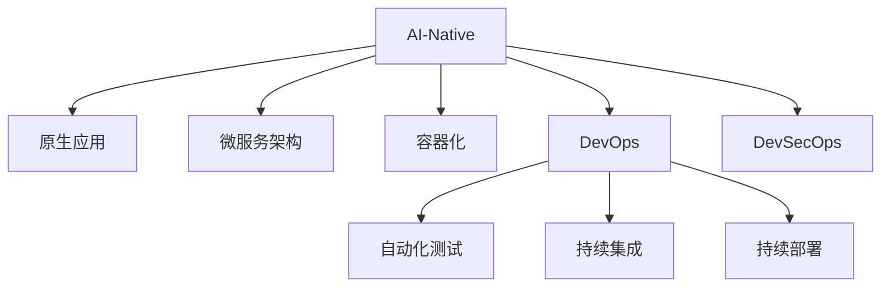

                 

# AI-Native应用开发的最佳实践

> 关键词：AI-Native, 原生应用, 最佳实践, 软件开发, 云计算, 微服务架构, 容器化, DevOps, 安全开发, 性能优化

## 1. 背景介绍

### 1.1 问题由来
随着人工智能技术的迅猛发展，越来越多的企业开始探索如何在现有的IT架构中引入AI，提升业务智能化水平。然而，传统应用架构难以直接兼容AI技术，导致其在部署和集成上存在诸多挑战。如何构建一个高效、易用、安全、可持续发展的AI-Native应用开发环境，成为当前IT界热议的话题。

### 1.2 问题核心关键点
本文旨在探讨AI-Native应用开发的各个关键点，从概念到实践，提供一套系统化的指导方案。重点在于如何通过构建原生AI架构、优化DevOps流程、加强安全与性能保障，实现高效、稳定、可扩展的AI系统部署。

## 2. 核心概念与联系

### 2.1 核心概念概述

为更好地理解AI-Native应用开发的各个环节，本节将介绍几个密切相关的核心概念：

- AI-Native：指专为AI构建的应用架构，结合了机器学习、深度学习等AI技术的原生支持。
- 原生应用：指能够直接与AI模型进行交互的应用程序，无需额外中间件或适配层。
- DevOps：一种集成软件开发与运维的方法，强调自动化和持续交付，以提高软件开发的效率和质量。
- 容器化：通过将应用打包在容器中，实现跨平台、易于管理和部署的技术。
- 微服务架构：将应用拆分为多个独立运行的微服务，每个服务负责独立功能，便于扩展和维护。
- DevSecOps：将安全集成到DevOps流程中，通过自动化手段提升软件的安全性。

这些概念之间的逻辑关系可以通过以下Mermaid流程图来展示：



这个流程图展示了几大关键概念及其之间的关系：

1. AI-Native作为底层架构，支持原生应用的设计和部署。
2. 原生应用依托微服务架构，实现模块化、独立化开发。
3. 容器化技术帮助原生应用跨平台部署，简化运维。
4. DevOps流程通过自动化测试、持续集成、持续部署等手段，提升开发效率和软件质量。
5. DevSecOps则结合安全自动化，提升应用的安全性。

这些概念共同构成了AI-Native应用开发的框架，使其能够在高效、安全和稳定中实现AI技术与业务的无缝集成。

## 3. 核心算法原理 & 具体操作步骤
### 3.1 算法原理概述

AI-Native应用开发的核心算法原理基于微服务架构和容器化技术，结合DevOps实践，实现快速、安全、可扩展的AI系统部署。其核心思想是：

1. 通过微服务架构，将AI模型封装成多个独立服务，便于管理和扩展。
2. 使用容器化技术，实现应用在不同环境下的统一部署和运行。
3. 采用DevOps流程，通过自动化工具提升开发、测试、部署的效率。
4. 引入DevSecOps安全保障，确保应用在开发、部署和运行中的安全性。

### 3.2 算法步骤详解

AI-Native应用开发的典型步骤包括：

**Step 1: 设计微服务架构**
- 分析业务需求，划分不同功能模块，每个模块独立设计并实现微服务。
- 选择适合的技术栈和框架，如Python+TensorFlow、Go+ONNX等。
- 设计微服务之间的通信协议，如REST、gRPC等。

**Step 2: 构建原生应用**
- 将AI模型集成到微服务中，使用框架如TensorFlow Serving、ONNX Runtime等。
- 开发API接口，使应用能够接受输入、处理请求并返回结果。
- 实现模型训练、推理、评估等功能的代码。

**Step 3: 实现容器化**
- 使用Docker等容器技术，将微服务和原生应用打包成镜像。
- 使用Kubernetes等容器编排工具，管理容器的部署和调度。
- 设置自动扩缩容策略，根据流量动态调整容器数量。

**Step 4: 引入DevOps流程**
- 设计自动化测试脚本，包括单元测试、集成测试、系统测试等。
- 使用Jenkins、GitLab CI等工具，实现持续集成和持续部署。
- 实施自动化部署，将应用代码自动部署到生产环境。

**Step 5: 加强DevSecOps安全**
- 设计自动化安全检测流程，如代码审计、漏洞扫描等。
- 实施持续安全保障，确保应用在开发、部署和运行中的安全性。
- 结合自动化日志和监控，实时检测并处理异常情况。

### 3.3 算法优缺点

AI-Native应用开发具有以下优点：

1. 高效性：通过微服务架构和容器化技术，可以灵活扩展和部署应用，提升开发效率。
2. 可维护性：微服务设计使应用具备更好的模块化和独立性，便于维护和升级。
3. 稳定性：DevOps和DevSecOps保障应用在开发、部署和运行中的稳定性和安全性。
4. 兼容性：原生应用可以直接与AI模型进行交互，无需额外适配，提升兼容性和易用性。

同时，该方法也存在一些局限性：

1. 学习成本：DevOps和容器化技术需要一定的学习成本，初期实现较为复杂。
2. 技术栈选择：不同业务可能需要不同的技术栈和框架，增加了选择和集成的难度。
3. 资源消耗：容器化技术在运行时可能占用较多资源，需合理配置。
4. 依赖性：应用的各个部分高度依赖于容器和编排工具，一旦出现问题，调试和修复难度较大。

尽管存在这些局限性，但就目前而言，AI-Native应用开发方法已成为构建高效、稳定、可扩展AI系统的首选范式。未来相关研究的重点在于如何进一步简化DevOps流程，优化容器化技术，提升应用的易用性和资源利用效率。

### 3.4 算法应用领域

AI-Native应用开发已经在多个领域得到了广泛应用，如金融、医疗、制造、零售等。具体应用包括：

- 金融风控：构建基于深度学习的风控模型，实时分析交易数据，预防欺诈行为。
- 医疗影像诊断：使用卷积神经网络(CNN)模型，分析医学影像，辅助医生进行疾病诊断。
- 智能制造：通过机器学习技术，优化生产流程，提升产品质量和生产效率。
- 零售推荐系统：利用协同过滤和推荐算法，提升商品推荐准确率，增加用户购买意愿。
- 智慧城市：集成多模态数据，构建智能交通、环保、能源等应用，提升城市管理水平。

除了上述这些经典应用外，AI-Native技术还在更多场景中得到创新性应用，为各行各业带来了新的变革。未来，随着技术不断进步和应用场景的拓展，AI-Native应用开发的潜力将进一步被激发。

## 4. 数学模型和公式 & 详细讲解 & 举例说明（备注：数学公式请使用latex格式，latex嵌入文中独立段落使用 $$，段落内使用 $)
### 4.1 数学模型构建

在AI-Native应用开发中，涉及大量数学模型和算法。本节将通过数学语言对核心模型进行讲解。

- 假设我们有一个二分类任务，输入为特征向量 $x$，输出为标签 $y$。目标是通过微服务架构，构建一个能够处理输入、调用AI模型并返回输出的应用。

- 引入AI模型 $M_{\theta}$，其中 $\theta$ 为模型参数。通过反向传播算法，计算损失函数 $L(y, M_{\theta}(x))$，并使用梯度下降法更新模型参数。

- 定义微服务 $S_i$，其中 $i$ 表示服务编号。微服务通过API接口与AI模型进行交互，调用模型进行推理。

- 设计微服务之间的通信协议，如RESTful API。使用Kubernetes等容器编排工具，管理微服务的部署和调度。

### 4.2 公式推导过程

以二分类任务为例，假设我们有一个微服务 $S_1$，通过API接口调用AI模型 $M_{\theta}$ 进行推理，返回预测结果 $y^{\hat{}_i}$。使用正则化损失函数 $L(y, y^{\hat{}_i})$，目标是最小化预测结果与真实标签之间的差异。

设损失函数为交叉熵损失，则公式为：

$$
L(y, y^{\hat{}_i}) = -\frac{1}{N}\sum_{i=1}^N [y_i \log y^{\hat{}_i} + (1-y_i) \log (1-y^{\hat{}_i})]
$$

其中 $y_i$ 为真实标签，$y^{\hat{}_i}$ 为预测结果。通过梯度下降法，计算梯度并更新模型参数 $\theta$：

$$
\theta \leftarrow \theta - \eta \nabla_{\theta} L(y, y^{\hat{}_i}) - \eta \lambda \theta
$$

其中 $\eta$ 为学习率，$\lambda$ 为正则化系数。

### 4.3 案例分析与讲解

假设我们要构建一个基于深度学习模型的风控应用，将用户行为数据作为输入，输出为风险评估结果。具体步骤如下：

1. 数据准备：收集用户行为数据，标注为高风险和低风险两个标签。
2. 模型选择：选择适合的深度学习模型，如卷积神经网络(CNN)或循环神经网络(RNN)。
3. 模型训练：使用标注数据对模型进行训练，获取最优参数。
4. 模型封装：将训练好的模型封装到微服务中，暴露API接口供应用调用。
5. 应用开发：使用微服务架构和DevOps流程，开发风控应用，调用微服务进行风险评估。
6. 测试与部署：在测试环境进行自动化测试和部署，确保应用稳定运行。

通过这个案例可以看出，AI-Native应用开发将AI模型集成到微服务中，使应用能够灵活调用AI模型，提升业务智能化水平。

## 5. 项目实践：代码实例和详细解释说明
### 5.1 开发环境搭建

在进行AI-Native应用开发前，我们需要准备好开发环境。以下是使用Python进行Django开发的环境配置流程：

1. 安装Anaconda：从官网下载并安装Anaconda，用于创建独立的Python环境。

2. 创建并激活虚拟环境：
```bash
conda create -n django-env python=3.8 
conda activate django-env
```

3. 安装Django：
```bash
pip install django
```

4. 安装所需的库：
```bash
pip install numpy pandas scikit-learn matplotlib tqdm jupyter notebook ipython
```

完成上述步骤后，即可在`django-env`环境中开始AI-Native应用开发。

### 5.2 源代码详细实现

这里我们以一个简单的AI-Native应用为例，给出使用Django进行开发的PyTorch代码实现。

首先，定义一个Django应用，并创建一个微服务：

```python
from django.http import JsonResponse
from django.views.decorators.csrf import csrf_exempt
import torch
import torch.nn as nn
import torch.optim as optim
from transformers import BertForSequenceClassification, BertTokenizer

@csrf_exempt
def predict(request):
    model = BertForSequenceClassification.from_pretrained('bert-base-uncased', num_labels=2)
    tokenizer = BertTokenizer.from_pretrained('bert-base-uncased')
    device = torch.device('cuda') if torch.cuda.is_available() else torch.device('cpu')
    model.to(device)
    
    if request.method == 'POST':
        data = request.POST.get('data')
        inputs = tokenizer(data, return_tensors='pt', padding=True, truncation=True)
        inputs = inputs.to(device)
        outputs = model(**inputs)
        _, preds = torch.max(outputs, dim=1)
        result = {'prediction': preds.item()}
        return JsonResponse(result)
```

然后，定义微服务的入口：

```python
from django.urls import path
from .views import predict

urlpatterns = [
    path('predict', predict, name='predict'),
]
```

接着，配置Django应用的启动脚本：

```python
from django.core.wsgi import get_wsgi_application
from django.conf import settings

if __name__ == '__main__':
    application = get_wsgi_application()
    application.run()
```

最后，启动Django应用，即可通过浏览器访问微服务：

```bash
python manage.py runserver 127.0.0.1:8000
```

### 5.3 代码解读与分析

让我们再详细解读一下关键代码的实现细节：

**定义微服务**：
- 使用Django框架，定义一个名为`predict`的微服务，接收POST请求，并返回预测结果。
- 使用`BertForSequenceClassification`和`BertTokenizer`从预训练模型中加载模型和分词器。
- 将模型和分词器封装到微服务中，供应用调用。

**API接口**：
- 使用`@csrf_exempt`装饰器，确保API接口不受CSRF攻击的保护。
- 通过`request.POST.get`方法获取用户输入的数据。
- 使用`tokenizer`将文本数据转化为模型所需的输入格式。
- 将模型输入数据转化为GPU或CPU的Tensor格式。
- 通过模型推理，获取预测结果。
- 将预测结果转化为JSON格式，并返回给客户端。

**Django配置**：
- 使用`urlpatterns`定义应用的路由规则，将`predict`微服务映射到`/predict`地址。
- 在`settings`文件中配置Django应用的环境和端口。
- 使用`get_wsgi_application`函数创建Wsgi应用对象。
- 通过`runserver`命令启动应用，监听本地8000端口。

以上代码展示了如何使用Django构建一个简单的AI-Native应用，将AI模型集成到微服务中，实现预测功能的自动化调用。

## 6. 实际应用场景
### 6.1 金融风控系统

AI-Native应用开发在金融风控领域有广泛应用。传统的风控系统依赖于人工规则和专家经验，难以适应复杂多变的市场环境。而通过AI-Native应用开发，我们可以构建一个高效、智能的风控系统，实时分析用户行为数据，预测并预防欺诈行为。

具体而言，可以构建一个基于深度学习模型的风控应用，集成到现有的金融系统中。应用将用户行为数据作为输入，调用AI模型进行风险评估，输出高风险或低风险标签。通过持续学习，模型能够不断更新和优化，提高风险预测的准确性。同时，系统还可以结合实时监控和异常检测，进一步提升风控效果。

### 6.2 医疗影像诊断

在医疗影像诊断领域，AI-Native应用开发同样有着广阔的应用前景。通过集成深度学习模型，医疗影像诊断系统可以自动识别和标注影像中的病变区域，辅助医生进行疾病诊断。

具体实现步骤包括：
- 数据准备：收集大量的医疗影像数据，并标注相应的病变区域。
- 模型选择：选择适合的深度学习模型，如卷积神经网络(CNN)或循环神经网络(RNN)。
- 模型训练：使用标注数据对模型进行训练，获取最优参数。
- 模型封装：将训练好的模型封装到微服务中，暴露API接口供应用调用。
- 应用开发：使用AI-Native应用开发框架，构建医疗影像诊断应用，调用微服务进行疾病诊断。
- 测试与部署：在测试环境进行自动化测试和部署，确保应用稳定运行。

通过AI-Native应用开发，医疗影像诊断系统能够实时处理医疗影像数据，快速识别病变区域，辅助医生进行疾病诊断，提高诊断的准确性和效率。

### 6.3 智能制造

在智能制造领域，AI-Native应用开发同样能够带来显著的效益。通过集成机器学习模型，智能制造系统可以优化生产流程，提升产品质量和生产效率。

具体实现步骤包括：
- 数据准备：收集生产过程中的传感器数据和操作日志。
- 模型选择：选择适合的机器学习模型，如决策树、随机森林、支持向量机等。
- 模型训练：使用标注数据对模型进行训练，获取最优参数。
- 模型封装：将训练好的模型封装到微服务中，暴露API接口供应用调用。
- 应用开发：使用AI-Native应用开发框架，构建智能制造应用，调用微服务进行生产流程优化。
- 测试与部署：在测试环境进行自动化测试和部署，确保应用稳定运行。

通过AI-Native应用开发，智能制造系统能够实时分析生产数据，优化生产流程，提升产品质量和生产效率，降低生产成本。

### 6.4 未来应用展望

随着AI-Native应用开发的不断成熟，其在更多领域的应用前景将更加广阔。未来，基于AI-Native的应用开发将带来更多创新，推动各行各业向智能化方向发展。

- 智慧城市：集成多模态数据，构建智能交通、环保、能源等应用，提升城市管理水平。
- 智能家居：通过语音识别、物体识别等技术，提升家居环境的智能化水平。
- 自动驾驶：集成感知、决策、控制等模块，实现自动驾驶技术。
- 智能医疗：利用深度学习技术，提升医疗影像诊断、疾病预测等能力。
- 教育培训：开发智能辅导系统，辅助学生学习，提高教育质量。

## 7. 工具和资源推荐
### 7.1 学习资源推荐

为了帮助开发者系统掌握AI-Native应用开发的技术基础和实践技巧，这里推荐一些优质的学习资源：

1. 《深度学习与Python编程》系列博文：由大模型技术专家撰写，深入浅出地介绍了深度学习原理和Python编程技巧，适用于初学者。

2. CS229《机器学习》课程：斯坦福大学开设的机器学习经典课程，详细讲解了机器学习的基本概念和算法，适合深入学习。

3. 《TensorFlow实战》书籍：TensorFlow官方出版的实战指南，包含大量动手实践案例，帮助你快速上手TensorFlow。

4. GitHub开源项目：GitHub上大量的开源项目，如TensorFlow、Keras等，可以提供丰富的学习和实验资源。

5. Kaggle竞赛平台：Kaggle提供的各类机器学习和数据科学竞赛，让你在实战中提升技能。

通过对这些资源的学习实践，相信你一定能够快速掌握AI-Native应用开发的技术要点，并用于解决实际的业务问题。

### 7.2 开发工具推荐

高效的开发离不开优秀的工具支持。以下是几款用于AI-Native应用开发的常用工具：

1. TensorFlow：由Google主导开发的开源深度学习框架，生产部署方便，适合大规模工程应用。

2. PyTorch：基于Python的开源深度学习框架，灵活动态的计算图，适合快速迭代研究。

3. Keras：基于TensorFlow和Theano的高级神经网络API，易用性高，适合快速原型设计和实验。

4. Kubernetes：Google开发的容器编排工具，支持分布式应用的自动化部署、扩展和管理。

5. Docker：开源的容器化平台，支持跨平台部署和管理，便于应用的快速迭代和分发。

6. Jenkins：开源的持续集成/持续部署工具，支持自动化测试、部署和发布。

7. GitLab CI/CD：GitLab提供的持续集成/持续部署服务，支持自动化构建、测试和部署。

8. GitHub：全球最大的代码托管平台，支持代码版本控制、协作开发和持续集成。

9. Uvicorn：Python应用的WSGI服务器，支持异步处理，提升应用性能。

合理利用这些工具，可以显著提升AI-Native应用开发的效率和质量，加速创新迭代的步伐。

### 7.3 相关论文推荐

AI-Native应用开发的研究源于学界的持续探索。以下是几篇奠基性的相关论文，推荐阅读：

1. "Distributed Deep Learning" by Gossip-based Distributed Training for Deep Neural Networks（Google ICLR 2016）：介绍了Google的分布式深度学习框架，详细讲解了Gossip协议在分布式训练中的应用。

2. "TensorFlow: A System for Large-Scale Machine Learning" by A Framework for Distributed Deep Learning（OSDI 2016）：TensorFlow的架构设计和实现细节，详细介绍了TensorFlow的分布式训练机制。

3. "Microservice Architecture: Key Concepts, Importance, and Benefits" by Microservice Architecture: Key Concepts, Importance, and Benefits（CloudNativeCon 2017）：介绍了微服务架构的概念、优势和实现方法。

4. "Hyperledger Fabric: A Framework for Distributed World Records" by Hyperledger Fabric: A Framework for Distributed World Records（IBM Cloud 2016）：Hyperledger Fabric的架构设计和实现细节，详细介绍了区块链技术在分布式应用中的应用。

5. "Kubernetes: A Platform for Dynamic Resource Orchestration" by Kubernetes: A Platform for Dynamic Resource Orchestration（Google OSDI 2015）：Kubernetes的架构设计和实现细节，详细介绍了容器编排技术的应用。

这些论文代表了AI-Native应用开发的研究方向，通过学习这些前沿成果，可以帮助研究者把握学科前进方向，激发更多的创新灵感。

## 8. 总结：未来发展趋势与挑战

### 8.1 总结

本文对AI-Native应用开发的各个关键点进行了全面系统的介绍。首先阐述了AI-Native应用开发的背景和意义，明确了其在构建高效、稳定、可扩展AI系统中的独特价值。其次，从原理到实践，详细讲解了微服务架构、容器化技术、DevOps流程、DevSecOps安全保障等核心内容，提供了系统化的指导方案。最后，本文还探讨了AI-Native应用开发在金融、医疗、制造、零售等多个领域的应用前景，展示了其广阔的发展空间。

通过本文的系统梳理，可以看到，AI-Native应用开发将成为未来AI系统建设的重要范式，极大地提升AI技术的落地能力和应用范围。伴随技术不断进步和应用场景的拓展，AI-Native应用开发必将在更多领域得到应用，为各行各业带来新的变革性影响。

### 8.2 未来发展趋势

展望未来，AI-Native应用开发将呈现以下几个发展趋势：

1. 智能化和个性化：随着深度学习技术的发展，AI-Native应用将具备更强的智能化和个性化能力，能够更好地适应用户需求。
2. 实时化和自动化：通过实时数据分析和自动化流程，AI-Native应用将进一步提升业务效率和用户满意度。
3. 安全性与合规性：在数据安全和隐私保护方面，AI-Native应用将更加注重合规性和安全性保障。
4. 多模态融合：未来的AI-Native应用将更多地融合多模态数据，提升系统的智能感知和决策能力。
5. 边缘计算：为了提升实时性和减少延迟，AI-Native应用将更多地在边缘设备上进行推理，减少对中心云的依赖。
6. 跨平台和跨语言：AI-Native应用将更好地支持跨平台和跨语言的开发和部署，提升应用的易用性和普及度。

以上趋势凸显了AI-Native应用开发的广阔前景。这些方向的探索发展，必将进一步提升AI系统的性能和应用范围，为各行各业带来新的变革性影响。

### 8.3 面临的挑战

尽管AI-Native应用开发已经取得了不少进展，但在迈向更加智能化、普适化应用的过程中，仍面临诸多挑战：

1. 学习曲线陡峭：AI-Native应用开发涉及较多新技术和概念，如微服务、容器化、DevOps等，需要一定的学习成本。
2. 技术栈选择困难：不同业务可能需要不同的技术栈和框架，增加了选择和集成的难度。
3. 系统复杂性高：AI-Native应用开发涉及多模块、多层次的协作，系统复杂性高，调试和维护难度较大。
4. 数据安全和隐私保护：AI-Native应用涉及大量敏感数据，数据安全和隐私保护成为一大难题。
5. 性能优化困难：AI模型的运行需要高性能计算资源，如何在保证性能的同时，优化资源利用效率，仍是重要挑战。

尽管存在这些挑战，但通过不断积累经验和优化实践，AI-Native应用开发技术将不断成熟，并在更多领域得到应用。未来，研究者需要从技术、业务、安全性等多个维度协同发力，才能实现AI技术的广泛落地。

### 8.4 研究展望

面对AI-Native应用开发所面临的种种挑战，未来的研究需要在以下几个方面寻求新的突破：

1. 简化微服务架构：通过合理设计API接口和微服务，简化微服务架构，降低开发和维护难度。
2. 优化容器化技术：开发更高效的容器编排工具，提升容器化应用的性能和稳定性。
3. 增强DevOps流程：引入更多自动化测试和持续集成工具，提升开发效率和软件质量。
4. 强化安全保障：采用更先进的安全检测和防护技术，提升系统的安全性。
5. 优化资源利用：通过硬件优化、模型压缩等手段，提升AI模型的运行效率和资源利用效率。
6. 融合多模态数据：将视觉、语音、文本等多模态数据进行融合，提升系统的智能感知和决策能力。

这些研究方向将引领AI-Native应用开发技术迈向更高的台阶，为构建安全、可靠、可解释、可控的智能系统铺平道路。面向未来，AI-Native应用开发需要与更多AI技术进行更深入的融合，如知识表示、因果推理、强化学习等，多路径协同发力，共同推动自然语言理解和智能交互系统的进步。

## 9. 附录：常见问题与解答

**Q1：什么是AI-Native应用开发？**

A: AI-Native应用开发是一种全新的应用架构设计方式，专为AI技术打造，通过微服务架构、容器化技术、DevOps流程等手段，实现高效、稳定、可扩展的AI系统部署。其核心思想是将AI模型集成到微服务中，使应用能够直接与AI模型进行交互，提升业务智能化水平。

**Q2：AI-Native应用开发的主要优点有哪些？**

A: AI-Native应用开发具有以下主要优点：
1. 高效性：通过微服务架构和容器化技术，可以灵活扩展和部署应用，提升开发效率。
2. 可维护性：微服务设计使应用具备更好的模块化和独立性，便于维护和升级。
3. 稳定性：DevOps和DevSecOps保障应用在开发、部署和运行中的稳定性和安全性。
4. 兼容性：原生应用可以直接与AI模型进行交互，无需额外适配，提升兼容性和易用性。

**Q3：AI-Native应用开发的主要缺点有哪些？**

A: AI-Native应用开发也存在一些局限性：
1. 学习成本：DevOps和容器化技术需要一定的学习成本，初期实现较为复杂。
2. 技术栈选择：不同业务可能需要不同的技术栈和框架，增加了选择和集成的难度。
3. 资源消耗：容器化技术在运行时可能占用较多资源，需合理配置。
4. 依赖性：应用的各个部分高度依赖于容器和编排工具，一旦出现问题，调试和修复难度较大。

**Q4：AI-Native应用开发适用于哪些场景？**

A: AI-Native应用开发适用于以下场景：
1. 金融风控：构建基于深度学习的风控模型，实时分析用户行为数据，预防欺诈行为。
2. 医疗影像诊断：使用卷积神经网络(CNN)模型，分析医学影像，辅助医生进行疾病诊断。
3. 智能制造：通过机器学习技术，优化生产流程，提升产品质量和生产效率。
4. 零售推荐系统：利用协同过滤和推荐算法，提升商品推荐准确率，增加用户购买意愿。
5. 智慧城市：集成多模态数据，构建智能交通、环保、能源等应用，提升城市管理水平。

**Q5：如何选择合适的AI-Native开发框架？**

A: 选择合适的AI-Native开发框架需要考虑以下因素：
1. 业务需求：根据业务需求选择合适的技术栈和框架，如Python+TensorFlow、Go+ONNX等。
2. 开发效率：选择开发效率高、易用性强的框架，如TensorFlow、PyTorch、Keras等。
3. 性能需求：根据性能需求选择合适的框架，如TensorFlow、Keras、MXNet等。
4. 社区支持：选择有强大社区支持、丰富资源和工具的框架，如TensorFlow、PyTorch、MXNet等。

**Q6：AI-Native应用开发在落地部署时需要注意哪些问题？**

A: 将AI-Native应用开发技术转化为实际应用，还需要考虑以下问题：
1. 模型裁剪：去除不必要的层和参数，减小模型尺寸，加快推理速度。
2. 量化加速：将浮点模型转为定点模型，压缩存储空间，提高计算效率。
3. 服务化封装：将模型封装为标准化服务接口，便于集成调用。
4. 弹性伸缩：根据请求流量动态调整资源配置，平衡服务质量和成本。
5. 监控告警：实时采集系统指标，设置异常告警阈值，确保服务稳定性。
6. 安全防护：采用访问鉴权、数据脱敏等措施，保障数据和模型安全。

通过本文的系统梳理，可以看到，AI-Native应用开发将成为未来AI系统建设的重要范式，极大地提升AI技术的落地能力和应用范围。伴随技术不断进步和应用场景的拓展，AI-Native应用开发必将在更多领域得到应用，为各行各业带来新的变革性影响。

---

作者：禅与计算机程序设计艺术 / Zen and the Art of Computer Programming

