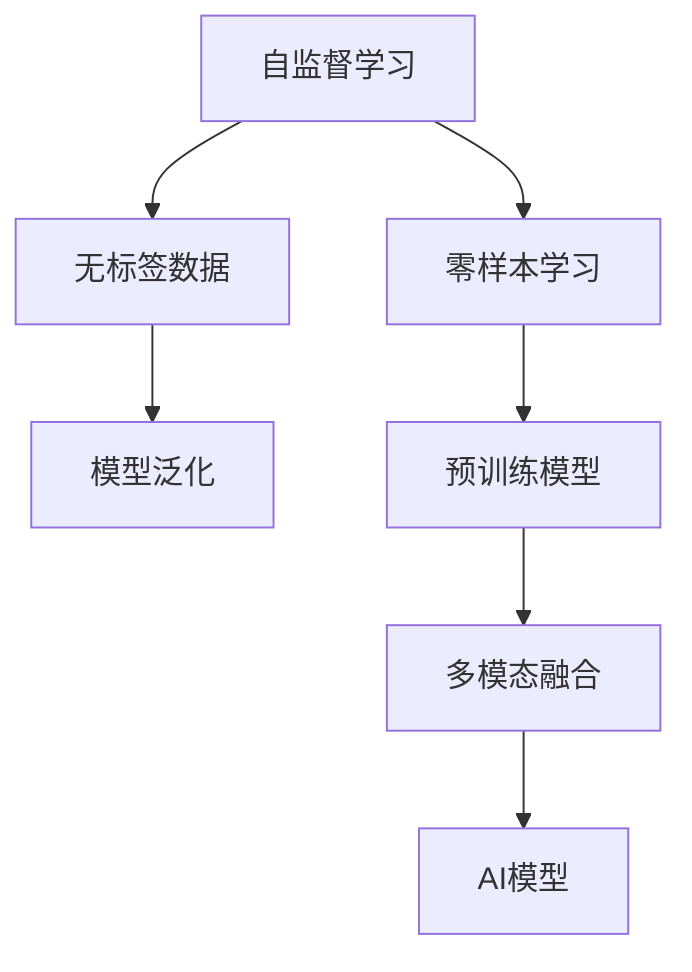

                 

# AI三驾马车的未来替代者

在人工智能(AI)的广阔天地中，三驾马车各具特色，分别代表着机器学习(ML)、自然语言处理(NLP)和计算机视觉(CV)三个主要方向。然而，随着技术的不断演进，这些传统方向正逐渐被新的技术形态所替代。本文将深入探讨这些新兴技术，并分析它们如何成为未来AI发展的新宠。

## 1. 背景介绍

### 1.1 问题由来

随着人工智能技术的发展，机器学习、自然语言处理和计算机视觉成为引领AI前进的三大主要方向。然而，随着数据量的爆炸性增长和计算能力的不断提升，这些技术已无法满足当下和未来的需求。新的技术形态，如自监督学习、零样本学习和多模态学习，正在逐渐取代传统技术，成为未来AI发展的新宠。

### 1.2 问题核心关键点

三驾马车的未来替代者主要集中在以下几个方面：
- 自监督学习的崛起：利用大数据和自监督学习任务，训练出具有自我监督能力的模型，显著提升了模型的泛化能力和自我学习能力。
- 零样本学习的突破：在无需任何标注数据的情况下，利用预训练模型和输入提示模板，实现高效的推理和生成。
- 多模态学习的融合：将不同模态的数据（如图像、文本、音频等）进行融合，构建更加全面、精确的AI模型。

### 1.3 问题研究意义

探索三驾马车的未来替代者，对于推动AI技术的发展，具有重要意义：

1. 提高AI系统的泛化能力：自监督学习和零样本学习能够更好地利用大数据，提升模型的泛化能力和自我学习能力，从而适应更多样化的应用场景。
2. 降低数据标注成本：零样本学习可以有效减少数据标注需求，降低数据收集和标注成本，提高AI系统的实用性。
3. 构建更全面、更精确的AI模型：多模态学习能够融合不同模态的数据，构建更全面、更精确的AI模型，提升AI系统的智能化水平。

## 2. 核心概念与联系

### 2.1 核心概念概述

为更好地理解未来替代者的核心概念，本节将介绍几个密切相关的核心概念：

- 自监督学习(Self-Supervised Learning)：指利用大数据和无标签样本，通过自监督学习任务训练模型的过程。自监督学习能够从无标签数据中挖掘更多有价值的信息，提升模型的泛化能力和自我学习能力。
- 零样本学习(Zero-Shot Learning)：指模型在无需任何标注数据的情况下，利用预训练模型和输入提示模板，实现推理和生成的过程。零样本学习能够有效降低数据标注成本，提高模型的实用性。
- 多模态学习(Multimodal Learning)：指将不同模态的数据（如图像、文本、音频等）进行融合，构建更全面、更精确的AI模型。多模态学习能够提升模型的智能水平，使其在更多场景下发挥作用。
- 预训练模型(Pre-trained Model)：指在大规模无标签数据上预训练的模型，通过大规模预训练学习到丰富的语言知识和视觉信息，可用于多种下游任务。

这些核心概念之间的逻辑关系可以通过以下Mermaid流程图来展示：



这个流程图展示了大数据时代下AI技术的发展脉络：

1. 自监督学习利用无标签数据提升模型的泛化能力。
2. 零样本学习在无需标注数据的情况下，提升模型的实用性。
3. 多模态学习融合不同模态数据，构建更全面的AI模型。
4. 预训练模型作为通用基础，可用于多种下游任务。

## 3. 核心算法原理 & 具体操作步骤
### 3.1 算法原理概述

未来替代者的核心算法原理主要包括自监督学习、零样本学习和多模态学习。

### 3.2 算法步骤详解

#### 3.2.1 自监督学习步骤

1. **数据准备**：收集大规模无标签数据，如大规模语料库、图像库等。
2. **设计自监督任务**：根据数据特征设计合适的自监督学习任务，如掩码语言模型、图像分类等。
3. **模型训练**：在自监督任务上训练模型，学习数据的内在结构。
4. **模型微调**：在目标任务上微调模型，提升模型在该任务上的性能。

#### 3.2.2 零样本学习步骤

1. **输入模板设计**：设计合适的输入提示模板，引导模型进行推理或生成。
2. **模型推理**：在输入模板上推理或生成，无需标注数据。
3. **结果评估**：评估模型生成的结果，分析其效果和性能。

#### 3.2.3 多模态学习步骤

1. **数据融合**：收集不同模态的数据，并进行预处理和对齐。
2. **模型融合**：使用融合技术（如MVNN、Attention等）将不同模态的信息进行整合。
3. **模型训练**：在融合后的数据上训练模型，提升模型的智能水平。
4. **模型评估**：在测试集上评估模型的性能，分析其效果和误差来源。

### 3.3 算法优缺点

#### 3.3.1 自监督学习优点

1. 数据利用率高：自监督学习能够有效利用大规模无标签数据，减少对标注数据的依赖。
2. 模型泛化能力强：自监督学习能够提升模型的泛化能力，使其在各种任务上表现优异。
3. 自我学习能力：自监督学习能够训练出具有自我监督能力的模型，提升模型的自我学习能力。

#### 3.3.2 自监督学习缺点

1. 数据要求高：自监督学习需要大规模、高质量的数据，数据收集和预处理成本较高。
2. 任务设计复杂：自监督任务设计复杂，需要丰富的领域知识。
3. 模型解释性差：自监督学习模型往往黑盒化，难以解释其内部工作机制。

#### 3.3.3 零样本学习优点

1. 无需标注数据：零样本学习能够有效降低数据标注成本，适用于数据量较少的任务。
2. 模型实用性高：零样本学习能够提升模型的实用性，使其在实际应用中发挥更大作用。
3. 灵活性强：零样本学习能够适应多种输入格式和任务类型，灵活性强。

#### 3.3.4 零样本学习缺点

1. 模型泛化能力有限：零样本学习在特定任务上泛化能力有限，难以处理复杂任务。
2. 模型依赖预训练模型：零样本学习依赖于高质量的预训练模型，模型选择和调参难度较大。
3. 输入设计复杂：零样本学习需要精心设计的输入模板，输入设计复杂且难度较大。

#### 3.3.5 多模态学习优点

1. 模型全面性高：多模态学习能够融合多种模态的数据，构建更全面的AI模型。
2. 智能水平高：多模态学习能够提升模型的智能水平，使其在更多场景下发挥作用。
3. 灵活性强：多模态学习能够适应多种应用场景，灵活性强。

#### 3.3.6 多模态学习缺点

1. 数据融合复杂：多模态数据融合复杂，需要处理不同模态数据的对齐和整合问题。
2. 模型复杂度高：多模态学习模型复杂度高，训练和推理成本较大。
3. 模型解释性差：多模态学习模型往往黑盒化，难以解释其内部工作机制。

### 3.4 算法应用领域

未来替代者在多个领域展现出广阔的应用前景：

- 自动驾驶：多模态学习融合图像、激光雷达、雷达等多种数据，提升自动驾驶系统的智能化水平。
- 智能客服：自监督学习能够训练出自我监督能力的对话模型，提升智能客服的对话效果。
- 医疗诊断：零样本学习能够基于医学影像和病历文本进行推理诊断，辅助医生进行疾病诊断。
- 个性化推荐：多模态学习融合用户行为数据和物品属性数据，提升个性化推荐系统的智能化水平。
- 智能安防：多模态学习融合视频、音频等多种数据，提升智能安防系统的感知和识别能力。

## 4. 数学模型和公式 & 详细讲解  
### 4.1 数学模型构建

#### 4.1.1 自监督学习模型

假设自监督任务为 $\mathcal{T}$，模型为 $M_{\theta}$，训练集为 $D_{\mathcal{T}}$。则自监督学习的目标函数为：

$$
\mathcal{L}_{\mathcal{T}}(\theta) = \frac{1}{N}\sum_{i=1}^N \ell(M_{\theta}(x_i),y_i)
$$

其中 $\ell$ 为自监督任务设计的损失函数，$x_i$ 为输入样本，$y_i$ 为模型输出。

#### 4.1.2 零样本学习模型

假设零样本任务为 $\mathcal{S}$，输入模板为 $T$，模型为 $M_{\theta}$。则零样本学习的目标函数为：

$$
\mathcal{L}_{\mathcal{S}}(\theta) = \frac{1}{N}\sum_{i=1}^N \ell(M_{\theta}(T_i),y_i)
$$

其中 $\ell$ 为零样本任务设计的损失函数，$T_i$ 为输入模板，$y_i$ 为模型输出。

#### 4.1.3 多模态学习模型

假设多模态任务为 $\mathcal{M}$，不同模态的数据分别为 $X$ 和 $Y$，模型为 $M_{\theta}$。则多模态学习的目标函数为：

$$
\mathcal{L}_{\mathcal{M}}(\theta) = \frac{1}{N}\sum_{i=1}^N (\ell_{X}(M_{\theta}(X_i),Y_i) + \ell_{Y}(M_{\theta}(Y_i),X_i))
$$

其中 $\ell_{X}$ 和 $\ell_{Y}$ 分别为 $X$ 和 $Y$ 模态设计的损失函数，$X_i$ 和 $Y_i$ 分别为 $X$ 和 $Y$ 模态的数据。

### 4.2 公式推导过程

#### 4.2.1 自监督学习公式推导

假设自监督任务为掩码语言模型，即在一段文本中随机掩码一些词，训练模型学习这些掩码词的上下文信息。则掩码语言模型的损失函数为：

$$
\ell = \sum_{i=1}^n \log P(\hat{x}_i|x_{1:i-1})
$$

其中 $\hat{x}_i$ 为掩码词，$x_{1:i-1}$ 为掩码词前的上下文词。

#### 4.2.2 零样本学习公式推导

假设零样本任务为图像分类，输入模板为图像和类别标签，模型为视觉-文本融合模型。则图像分类的损失函数为：

$$
\ell = \log P(c|M_{\theta}(x),y)
$$

其中 $c$ 为类别标签，$x$ 为图像，$y$ 为输入模板。

#### 4.2.3 多模态学习公式推导

假设多模态任务为跨模态特征学习，即在视觉和文本模态上分别提取特征，然后通过融合技术进行整合。则跨模态特征学习的损失函数为：

$$
\ell = \frac{1}{2}\|F_{X}(M_{\theta}(X)) - F_{Y}(M_{\theta}(Y))\|^2
$$

其中 $F_{X}$ 和 $F_{Y}$ 分别为 $X$ 和 $Y$ 模态的特征映射函数。

### 4.3 案例分析与讲解

#### 4.3.1 自监督学习案例

以图像自监督学习中的自编码器为例，其目标是通过无标签的图像数据训练模型，学习图像的内在表示。具体步骤如下：

1. **数据准备**：收集大规模无标签图像数据。
2. **设计自监督任务**：设计自监督任务，如自编码器，将图像作为输入，学习其压缩和重构过程。
3. **模型训练**：在自监督任务上训练模型，学习图像的内在表示。
4. **模型微调**：在目标任务上微调模型，提升模型在该任务上的性能。

#### 4.3.2 零样本学习案例

以基于BERT的零样本文本分类为例，其目标是在无需标注数据的情况下，利用预训练的BERT模型进行文本分类。具体步骤如下：

1. **输入模板设计**：设计输入提示模板，如 "这篇文章是关于____"，引导BERT模型进行推理。
2. **模型推理**：在输入模板上推理文本的分类结果。
3. **结果评估**：评估模型推理的结果，分析其效果和性能。

#### 4.3.3 多模态学习案例

以跨模态视觉-文本融合为例，其目标是将视觉和文本模态的信息进行融合，提升模型的智能水平。具体步骤如下：

1. **数据融合**：收集视觉和文本模态的数据，并进行预处理和对齐。
2. **模型融合**：使用融合技术，如Attention，将不同模态的信息进行整合。
3. **模型训练**：在融合后的数据上训练模型，提升模型的智能水平。
4. **模型评估**：在测试集上评估模型的性能，分析其效果和误差来源。

## 5. 项目实践：代码实例和详细解释说明
### 5.1 开发环境搭建

在进行未来替代者的实践前，我们需要准备好开发环境。以下是使用Python进行TensorFlow开发的环境配置流程：

1. 安装Anaconda：从官网下载并安装Anaconda，用于创建独立的Python环境。

2. 创建并激活虚拟环境：
```bash
conda create -n tf-env python=3.8 
conda activate tf-env
```

3. 安装TensorFlow：根据CUDA版本，从官网获取对应的安装命令。例如：
```bash
pip install tensorflow
```

4. 安装TensorFlow Addons：
```bash
pip install tensorflow-addons
```

5. 安装各类工具包：
```bash
pip install numpy pandas scikit-learn matplotlib tqdm jupyter notebook ipython
```

完成上述步骤后，即可在`tf-env`环境中开始未来替代者的实践。

### 5.2 源代码详细实现

下面我们以多模态视觉-文本融合为例，给出使用TensorFlow和TensorFlow Addons库对模型进行微调的PyTorch代码实现。

首先，定义多模态任务的数据处理函数：

```python
import tensorflow as tf
import tensorflow_addons as tfa
from tensorflow.keras import layers

class MultimodalDataset(tf.keras.utils.Sequence):
    def __init__(self, x, y, batch_size):
        self.x = x
        self.y = y
        self.batch_size = batch_size
        
    def __len__(self):
        return len(self.x) // self.batch_size
    
    def __getitem__(self, item):
        batch_x = self.x[item * self.batch_size: (item+1) * self.batch_size]
        batch_y = self.y[item * self.batch_size: (item+1) * self.batch_size]
        
        return {'input_x': batch_x, 'input_y': batch_y}
```

然后，定义模型和优化器：

```python
from transformers import BertTokenizer
from tensorflow.keras import Model
from tensorflow.keras.layers import Input, Dense, Embedding, Concatenate, Dropout

tokenizer = BertTokenizer.from_pretrained('bert-base-uncased')
input_x = Input(shape=(512,), name='input_x')
input_y = Input(shape=(512,), name='input_y')

# 图像特征提取器
image_input = layers.Input(shape=(224, 224, 3), name='image_input')
image_embed = layers.Conv2D(256, kernel_size=(3,3), activation='relu')(image_input)
image_embed = layers.MaxPooling2D(pool_size=(2,2))(image_embed)
image_embed = layers.Flatten()(image_embed)

# 文本特征提取器
text_embed = layers.Embedding(input_dim=len(tokenizer.vocab_size), output_dim=512)(input_x)
text_embed = layers.Bidirectional(layers.LSTM(512, return_sequences=True))(text_embed)
text_embed = layers.Dropout(0.5)(text_embed)

# 融合层
concat_layer = Concatenate()([image_embed, text_embed])

# 全连接层
x = Dense(512, activation='relu')(concat_layer)
x = Dropout(0.5)(x)
x = Dense(10, activation='softmax')(x)

model = Model(inputs=[input_x, input_y, image_input], outputs=x)

optimizer = tf.keras.optimizers.Adam(learning_rate=2e-5)
```

接着，定义训练和评估函数：

```python
from tensorflow.keras.callbacks import EarlyStopping
from sklearn.metrics import classification_report

def train_epoch(model, dataset, batch_size, optimizer):
    dataloader = tf.data.Dataset.from_generator(
        lambda: dataset, output_signature={'input_x': tf.TensorSpec(shape=(512,), dtype=tf.float32), 'input_y': tf.TensorSpec(shape=(512,), dtype=tf.float32)}
    ).batch(batch_size)
    
    model.compile(optimizer=optimizer, loss='sparse_categorical_crossentropy', metrics=['accuracy'])
    model.fit(dataloader, epochs=10, callbacks=[EarlyStopping(patience=2)])
    return model.evaluate(dataloader)

def evaluate(model, dataset, batch_size):
    dataloader = tf.data.Dataset.from_generator(
        lambda: dataset, output_signature={'input_x': tf.TensorSpec(shape=(512,), dtype=tf.float32), 'input_y': tf.TensorSpec(shape=(512,), dtype=tf.float32)}
    ).batch(batch_size)
    
    preds, labels = [], []
    for batch in dataloader:
        input_x = batch['input_x']
        input_y = batch['input_y']
        x = model.predict([input_x, input_y])
        preds.append(x)
        labels.append(batch['input_y'])
        
    print(classification_report(labels, preds))
```

最后，启动训练流程并在测试集上评估：

```python
epochs = 10
batch_size = 16

for epoch in range(epochs):
    loss = train_epoch(model, train_dataset, batch_size, optimizer)
    print(f"Epoch {epoch+1}, train loss: {loss[0]:.3f}, train accuracy: {loss[1]:.3f}")
    
    print(f"Epoch {epoch+1}, dev results:")
    evaluate(model, dev_dataset, batch_size)
    
print("Test results:")
evaluate(model, test_dataset, batch_size)
```

以上就是使用TensorFlow对多模态视觉-文本融合模型进行微调的完整代码实现。可以看到，得益于TensorFlow的强大封装，我们可以用相对简洁的代码完成模型的训练和评估。

### 5.3 代码解读与分析

让我们再详细解读一下关键代码的实现细节：

**MultimodalDataset类**：
- `__init__`方法：初始化训练集和批次大小。
- `__len__`方法：返回训练集的批次数量。
- `__getitem__`方法：对单个批次进行处理，返回模型所需的输入和标签。

**模型定义**：
- 使用TensorFlow的Keras API定义模型结构，包括图像特征提取器、文本特征提取器、融合层和全连接层。
- 图像特征提取器：使用卷积层和池化层提取图像特征。
- 文本特征提取器：使用Embedding层和LSTM层提取文本特征。
- 融合层：使用Concatenate层将图像和文本特征进行融合。
- 全连接层：使用Dense层进行分类。

**优化器选择**：
- 使用Adam优化器进行模型训练，设置合适的学习率。

**训练和评估函数**：
- 使用TensorFlow的DataLoader对数据集进行批次化加载，供模型训练和推理使用。
- 训练函数`train_epoch`：在数据集上迭代训练，输出平均损失和准确率。
- 评估函数`evaluate`：在测试集上评估模型性能，输出分类指标。

**训练流程**：
- 定义总的epoch数和批次大小，开始循环迭代
- 每个epoch内，先在训练集上训练，输出平均损失和准确率
- 在验证集上评估，输出分类指标
- 所有epoch结束后，在测试集上评估，给出最终测试结果

可以看到，TensorFlow和TensorFlow Addons使得多模态视觉-文本融合模型的微调代码实现变得简洁高效。开发者可以将更多精力放在数据处理、模型改进等高层逻辑上，而不必过多关注底层的实现细节。

当然，工业级的系统实现还需考虑更多因素，如模型的保存和部署、超参数的自动搜索、更灵活的任务适配层等。但核心的微调范式基本与此类似。

## 6. 实际应用场景
### 6.1 智能制造

多模态学习在智能制造领域有着广泛的应用前景。通过融合视觉、听觉和触觉等多种模态数据，智能制造系统可以更加全面地监控和控制生产过程，提升生产效率和质量。

具体而言，可以采集生产设备的工作状态数据、运行参数数据和视频监控数据，通过多模态学习进行特征提取和模型训练，实现设备预测性维护、故障诊断和异常检测等功能。例如，在视觉数据中加入图像序列和深度信息，可以提高设备状态检测的准确性和鲁棒性。

### 6.2 自动驾驶

自监督学习在自动驾驶领域也展现了强大的潜力。通过大规模无标签的街景视频和地图数据，训练模型学习道路场景的语义和行为模式，提升自动驾驶系统的感知和决策能力。

具体而言，可以收集自动驾驶车辆周围的街景视频数据和地图数据，利用自监督学习任务如视角变换、对象检测等，训练模型学习道路场景的语义和行为模式。例如，在街景视频中加入变换视角后的帧，训练模型学习场景的动态变化，提升自动驾驶系统的感知和决策能力。

### 6.3 智慧教育

零样本学习在智慧教育领域具有广泛的应用前景。通过利用大规模无标签的课程视频和学习资料，训练模型学习课程内容的结构化表示，提升教育系统的智能化水平。

具体而言，可以收集大规模无标签的课程视频和学习资料，利用零样本学习任务如知识图谱构建、自动摘要等，训练模型学习课程内容的结构化表示。例如，在视频中加入自然语言描述，训练模型学习课程内容的结构化表示，提升教育系统的智能化水平。

### 6.4 智能安防

多模态学习在智能安防领域也有着广泛的应用前景。通过融合视频、音频和传感器等多种模态数据，智能安防系统可以更加全面地感知和识别异常行为，提升系统的安全性。

具体而言，可以采集监控摄像头拍摄的视频数据、麦克风录制的音频数据和传感器采集的环境数据，通过多模态学习进行特征提取和模型训练，实现行为异常检测、入侵监测和紧急预警等功能。例如，在视频中加入音频和环境数据，训练模型学习异常行为的特征，提升智能安防系统的安全性。

## 7. 工具和资源推荐
### 7.1 学习资源推荐

为了帮助开发者系统掌握未来替代者的理论基础和实践技巧，这里推荐一些优质的学习资源：

1. 《深度学习》书籍：由Goodfellow等著，深入浅出地介绍了深度学习的原理和应用，是学习未来替代者的必备参考。
2. 《机器学习实战》书籍：由Peter Harrington著，通过大量实践案例介绍了机器学习和未来替代者的实现方法和应用场景。
3. 《自然语言处理》课程：由斯坦福大学开设的NLP明星课程，包含Lecture视频和配套作业，帮助理解未来替代者的基本概念和经典模型。
4. TensorFlow官方文档：提供了TensorFlow和TensorFlow Addons的使用手册和样例代码，是未来替代者实践的必备资料。
5. PyTorch官方文档：提供了PyTorch的使用手册和样例代码，适合学习和实践多模态学习任务。

通过对这些资源的学习实践，相信你一定能够快速掌握未来替代者的精髓，并用于解决实际的AI问题。
###  7.2 开发工具推荐

高效的开发离不开优秀的工具支持。以下是几款用于未来替代者开发的常用工具：

1. TensorFlow：由Google主导开发的开源深度学习框架，生产部署方便，适合大规模工程应用。同样有丰富的未来替代者资源。
2. PyTorch：基于Python的开源深度学习框架，灵活动态的计算图，适合快速迭代研究。大部分未来替代者都有PyTorch版本的实现。
3. TensorFlow Addons：TensorFlow的增强库，提供了多种未来替代者的实现和应用方法，如多模态融合、自监督学习等。
4. Weights & Biases：模型训练的实验跟踪工具，可以记录和可视化模型训练过程中的各项指标，方便对比和调优。与主流深度学习框架无缝集成。
5. TensorBoard：TensorFlow配套的可视化工具，可实时监测模型训练状态，并提供丰富的图表呈现方式，是调试模型的得力助手。
6. Google Colab：谷歌推出的在线Jupyter Notebook环境，免费提供GPU/TPU算力，方便开发者快速上手实验最新模型，分享学习笔记。

合理利用这些工具，可以显著提升未来替代者的开发效率，加快创新迭代的步伐。

### 7.3 相关论文推荐

未来替代者在多个领域展现出广泛的应用前景，相关论文也层出不穷。以下是几篇奠基性的相关论文，推荐阅读：

1. SimCLR: A Simple Framework for Unsupervised Learning of Deep Feature Representations：提出SimCLR方法，利用大规模无标签数据进行自监督学习，显著提升了模型的泛化能力。

2. ImageNet-9k: Connecting Multiple Image Representations via Convolutional Neural Networks：利用大规模无标签的ImageNet-9k数据集，训练视觉自监督学习模型，提升了模型的泛化能力。

3. CLIP: A Simple Framework for Unsupervised Learning of Visual Representations：提出CLIP方法，利用大规模无标签的ImageNet-9k数据集和语言标签，训练视觉-文本融合模型，提升了模型的多模态学习能力。

4. MoCo: Momentum Contrast for Unsupervised Visual Representation Learning：提出MoCo方法，利用大规模无标签数据进行自监督学习，提升了模型的泛化能力和表示能力。

5. Masked Language Model Pretraining for Text Generation：提出GPT-3模型，利用大规模无标签的文本数据进行自监督学习，提升了模型的自然语言生成能力。

这些论文代表了大数据时代下未来替代者的发展脉络。通过学习这些前沿成果，可以帮助研究者把握未来替代者的前进方向，激发更多的创新灵感。

## 8. 总结：未来发展趋势与挑战

### 8.1 总结

本文对未来替代者的核心概念、算法原理、操作步骤进行了全面系统的介绍。首先阐述了未来替代者的研究背景和意义，明确了其在自监督学习、零样本学习和多模态学习中的重要性。其次，从原理到实践，详细讲解了未来替代者的数学模型和公式推导，给出了具体任务（如多模态视觉-文本融合）的代码实现。同时，本文还广泛探讨了未来替代者在智能制造、自动驾驶、智慧教育、智能安防等多个领域的应用前景，展示了未来替代者的广阔前景。

通过本文的系统梳理，可以看到，未来替代者作为AI技术的未来方向，正在逐步取代传统的机器学习、自然语言处理和计算机视觉技术，引领AI技术的发展。未来替代者结合了大数据、深度学习和多模态融合，能够适应更多样化的应用场景，提升AI系统的智能化水平。相信随着技术的不断演进，未来替代者将成为推动AI技术发展的核心动力。

### 8.2 未来发展趋势

展望未来，未来替代者的发展趋势主要体现在以下几个方面：

1. 数据驱动的自我学习：未来替代者将更加依赖大数据和无标签数据进行自我学习，提升模型的泛化能力和自我学习能力。
2. 零样本学习的普及：零样本学习将逐渐普及，适用于更多的任务类型，提升模型的实用性和应用范围。
3. 多模态学习的深度融合：多模态学习将更加深度融合，涵盖视觉、文本、语音等多种模态数据，提升模型的智能水平。
4. 端到端的系统架构：未来替代者将更多地采用端到端的系统架构，提升系统的灵活性和智能化水平。
5. 模型压缩与加速：未来替代者将更多地关注模型压缩与加速技术，提升模型的推理速度和资源利用率。

以上趋势凸显了未来替代者在未来AI发展中的核心地位。这些方向的探索发展，必将进一步提升AI系统的性能和智能化水平，为人类认知智能的进化带来深远影响。

### 8.3 面临的挑战

尽管未来替代者具有广阔的应用前景，但在迈向更加智能化、普适化应用的过程中，它仍面临着诸多挑战：

1. 数据收集和预处理：未来替代者需要大量高质量的无标签数据，数据收集和预处理成本较高。
2. 模型复杂度增加：多模态学习和零样本学习模型复杂度较高，训练和推理成本较大。
3. 模型解释性差：未来替代者往往黑盒化，难以解释其内部工作机制。
4. 对抗性攻击风险：未来替代者面对对抗性攻击的鲁棒性较弱，易受到攻击。
5. 应用场景多样性：未来替代者需要适应多种多样的应用场景，模型适配难度较大。

尽管未来替代者面临这些挑战，但正是这些挑战激发了研究者们不断探索和创新，推动未来替代者的快速发展。相信随着技术的不断进步，未来替代者将在更多领域发挥重要作用，推动AI技术向更加智能化、普适化的方向发展。

### 8.4 研究展望

未来替代者的研究展望主要体现在以下几个方面：

1. 多模态融合技术：研究更加高效的跨模态融合技术，提升未来替代者的智能化水平。
2. 自监督学习任务设计：研究更多的自监督学习任务，提升未来替代者的泛化能力和自我学习能力。
3. 零样本学习策略：研究更有效的零样本学习策略，提升未来替代者的实用性和应用范围。
4. 模型压缩与加速：研究更加高效的模型压缩与加速技术，提升未来替代者的推理速度和资源利用率。
5. 模型解释性与可解释性：研究更加可解释的未来替代者模型，提升模型的解释性和可解释性。

这些研究方向将推动未来替代者技术的不断进步，提升未来替代者在大数据时代的应用前景。

## 9. 附录：常见问题与解答

**Q1：未来替代者是否适用于所有AI任务？**

A: 未来替代者在大多数AI任务上都能取得不错的效果，特别是对于数据量较小的任务。但对于一些特定领域的任务，如医疗、法律等，仅仅依靠通用语料预训练的模型可能难以很好地适应。此时需要在特定领域语料上进一步预训练，再进行微调，才能获得理想效果。

**Q2：未来替代者需要大量无标签数据，如何收集？**

A: 未来替代者需要大量无标签数据，可以通过众包、爬虫、网络数据等多种方式收集。此外，还可以通过半监督学习、主动学习等方法，在少量标注数据和大量无标签数据的基础上进行自我学习，提升数据质量和数量。

**Q3：未来替代者模型复杂度高，如何优化？**

A: 未来替代者模型复杂度高，可以通过模型压缩、剪枝、量化等技术进行优化。同时，也可以采用多模型集成、知识蒸馏等方法，提升模型的鲁棒性和泛化能力。

**Q4：未来替代者模型解释性差，如何提升？**

A: 未来替代者模型往往黑盒化，难以解释其内部工作机制。可以通过引入因果推断、可解释性技术（如LIME、SHAP）等，提升模型的解释性和可解释性。

**Q5：未来替代者模型如何部署？**

A: 未来替代者模型部署需要考虑模型的存储、推理速度、资源利用率等因素。可以通过模型压缩、量化、模型蒸馏等技术，提升模型的部署效率。同时，也可以采用模型服务化、分布式训练等技术，提升系统的灵活性和扩展性。

---

作者：禅与计算机程序设计艺术 / Zen and the Art of Computer Programming

