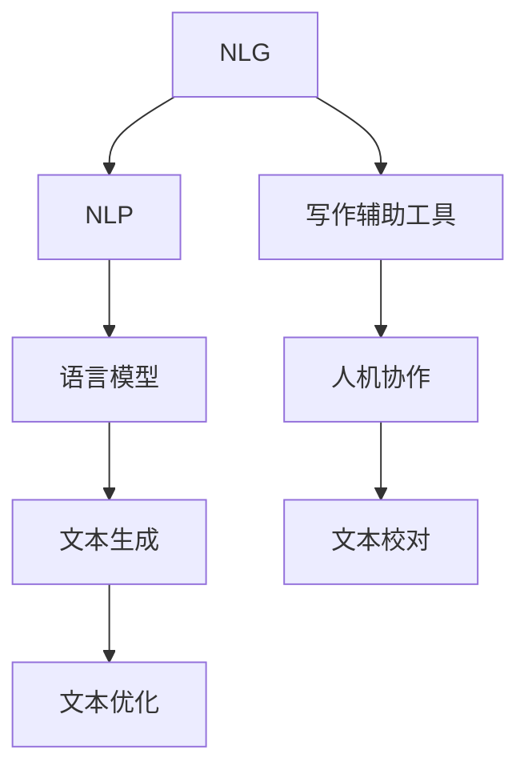

                 

# AI与人类写作的协同：增强而非替代

> 关键词：人工智能,自然语言生成(NLG),写作辅助工具,人机协作,语言模型,自然语言处理(NLP)

## 1. 背景介绍

### 1.1 问题由来
随着人工智能技术的发展，自然语言生成(NLG)技术在写作辅助领域得到了广泛应用。语言模型、预训练模型等技术已经可以生成流畅、连贯的文本内容，帮助人类完成各类文本创作任务。然而，尽管这些技术在自动化和效率上取得了巨大突破，但人类写作的创意性和独特性仍然不可替代。人类作者可以基于情感、常识、语境等复杂信息进行深度思考和创造，生成具有个性化和独创性的内容。

在当今信息爆炸的时代，人工智能与人类写作的协同变得愈发重要。一方面，AI可以借助强大的文本生成能力，辅助人类完成枯燥、重复的写作任务，减轻创作负担；另一方面，人类作家则可以通过AI的辅助，提升创作效率，发掘更多创意灵感，创造出更富有表现力和感染力的作品。

### 1.2 问题核心关键点
AI与人类写作协同的核心在于如何实现以下目标：
1. **增强而非替代**：保持人类作家的独特风格和创意性，避免机器生成文本对人类创作产生负面影响。
2. **高效而非低效**：利用AI的强大文本生成能力，大幅提升写作效率，加速内容产出。
3. **精准而非泛泛**：通过语义理解、情感分析等技术，精准匹配用户需求，生成高质量文本内容。
4. **动态而非静态**：根据用户反馈和环境变化，动态调整生成策略，持续提升AI辅助写作的效果。
5. **个性化而非通用化**：根据用户的偏好和风格，定制化生成文本，提供更符合用户需求的写作支持。

## 2. 核心概念与联系

### 2.1 核心概念概述

为了更好地理解AI与人类写作的协同，本节将介绍几个密切相关的核心概念：

- **自然语言生成(NLG)**：指利用人工智能技术，将结构化数据转换为自然语言文本的过程。NLG可以应用于文本创作、摘要生成、对话系统等领域。
- **自然语言处理(NLP)**：指利用计算机技术，处理、分析和生成自然语言文本的过程。NLP涉及语言模型、文本分类、情感分析等多个子领域。
- **写作辅助工具**：指利用AI技术辅助人类完成写作任务的各类软件工具，如文本编辑器、写作助手、翻译工具等。
- **人机协作**：指AI与人类之间通过技术手段实现相互配合和协作的过程。在写作领域，人机协作旨在提升创作效率和质量，发掘更多创意。
- **语言模型**：指用于预测文本序列的概率模型，通过学习大量语料数据，可以生成连贯、自然的文本内容。

这些核心概念之间的逻辑关系可以通过以下Mermaid流程图来展示：



这个流程图展示了核心概念之间的联系：

1. NLG技术通过NLP技术，处理和分析文本数据，生成自然语言文本。
2. 语言模型是NLG的重要基础，通过预测文本序列，生成连贯的自然语言。
3. 写作辅助工具利用NLG和NLP技术，辅助人类完成写作任务。
4. 人机协作通过各种工具和技术手段，实现AI与人类之间的有效合作。
5. 文本生成和优化通过NLG和语言模型技术，提升文本质量。
6. 文本校对通过NLP技术，确保文本内容的准确性和规范性。

## 3. 核心算法原理 & 具体操作步骤
### 3.1 算法原理概述

AI与人类写作协同的算法原理主要涉及自然语言生成(NLG)和自然语言处理(NLP)两个方面。其核心思想是通过深度学习模型和优化算法，将预训练语言模型与人类写作进行结合，生成高质量的文本内容。

### 3.2 算法步骤详解

基于自然语言生成(NLG)的AI与人类写作协同过程一般包括以下几个关键步骤：

**Step 1: 准备数据和模型**
- 收集和标注适合写作辅助任务的文本数据，如新闻报道、小说、学术论文等。
- 选择合适的预训练语言模型，如GPT-3、BERT等，作为初始化参数。

**Step 2: 添加任务适配层**
- 设计合适的任务适配层，如分类器、生成器、转换器等，用于处理不同写作任务。
- 根据任务类型，设置相应的损失函数和优化算法。

**Step 3: 设置微调超参数**
- 选择合适的学习率、批大小、迭代轮数等超参数，并进行初始设置。
- 设置正则化技术，如L2正则、Dropout、Early Stopping等。

**Step 4: 执行微调训练**
- 使用数据集对模型进行微调训练，逐步优化模型参数。
- 周期性在验证集上评估模型性能，根据性能指标调整超参数。

**Step 5: 文本生成与优化**
- 利用微调后的模型生成文本，并根据用户反馈和需求进行优化。
- 结合人类作家的创意，对AI生成的文本进行二次创作和润色。

**Step 6: 文本校对与审核**
- 使用语言模型和NLP技术对生成的文本进行校对，确保语法、拼写等规范性。
- 进行人工审核，确保内容的准确性和符合用户需求。

### 3.3 算法优缺点

基于自然语言生成的AI与人类写作协同方法具有以下优点：
1. 自动化写作：利用AI强大的文本生成能力，快速完成大量写作任务。
2. 提升效率：大幅提升文本创作的速度，降低创作成本。
3. 增强创新：提供丰富的文本生成策略和创意灵感，辅助人类创作更多高质量文本。
4. 个性化定制：根据用户需求和偏好，生成定制化文本，满足个性化创作需求。

同时，该方法也存在一些局限性：
1. 依赖标注数据：需要高质量的标注数据来训练模型，获取标注数据成本较高。
2. 可解释性不足：生成的文本内容难以解释其背后的生成机制，缺乏透明性。
3. 缺乏创意：生成的文本可能缺乏独特性和个性化，难以完全替代人类创意。
4. 依赖模型质量：模型质量对生成效果有直接影响，模型偏差可能影响生成内容的质量。

尽管存在这些局限性，但基于自然语言生成的AI与人类写作协同方法仍是大规模写作任务和创意写作的强有力工具。未来相关研究的重点在于如何进一步降低对标注数据的依赖，提高模型的可解释性，同时兼顾创意性和准确性。

### 3.4 算法应用领域

基于自然语言生成的AI与人类写作协同方法在多个领域得到了广泛应用，例如：

- **新闻报道**：利用AI生成新闻报道草稿，辅助记者快速撰写新闻稿件。
- **学术论文**：通过AI生成文献综述和数据分析，辅助科研人员撰写学术论文。
- **小说创作**：利用AI生成小说情节和大纲，辅助作家创作更丰富的故事情节。
- **社交媒体**：通过AI生成新闻摘要和社交媒体帖子，提升内容生产和传播效率。
- **产品说明**：利用AI生成产品描述和用户手册，提高产品信息传递的准确性和规范性。
- **广告文案**：通过AI生成广告文案和推广内容，提升广告点击率和转化率。

除了这些具体应用外，AI与人类写作的协同还在教育、娱乐、健康等领域发挥着重要作用。随着预训练模型和微调方法的不断进步，相信AI与人类写作协同的潜力将进一步释放，推动更多行业实现智能化转型。

## 4. 数学模型和公式 & 详细讲解 & 举例说明

### 4.1 数学模型构建

本节将使用数学语言对基于自然语言生成(NLG)的AI与人类写作协同过程进行更加严格的刻画。

记预训练语言模型为 $M_{\theta}$，其中 $\theta$ 为预训练得到的模型参数。假设写作任务为 $T$，训练集为 $D=\{(x_i,y_i)\}_{i=1}^N$，其中 $x_i$ 为输入文本，$y_i$ 为生成文本。

定义模型 $M_{\theta}$ 在输入 $x_i$ 上的损失函数为 $\ell(M_{\theta}(x_i),y_i)$，则在数据集 $D$ 上的经验风险为：

$$
\mathcal{L}(\theta) = \frac{1}{N} \sum_{i=1}^N \ell(M_{\theta}(x_i),y_i)
$$

微调的优化目标是最小化经验风险，即找到最优参数：

$$
\theta^* = \mathop{\arg\min}_{\theta} \mathcal{L}(\theta)
$$

在实践中，我们通常使用基于梯度的优化算法（如SGD、Adam等）来近似求解上述最优化问题。设 $\eta$ 为学习率，$\lambda$ 为正则化系数，则参数的更新公式为：

$$
\theta \leftarrow \theta - \eta \nabla_{\theta}\mathcal{L}(\theta) - \eta\lambda\theta
$$

其中 $\nabla_{\theta}\mathcal{L}(\theta)$ 为损失函数对参数 $\theta$ 的梯度，可通过反向传播算法高效计算。

### 4.2 公式推导过程

以下我们以新闻报道生成任务为例，推导交叉熵损失函数及其梯度的计算公式。

假设模型 $M_{\theta}$ 在输入 $x_i$ 上的输出为 $\hat{y}=M_{\theta}(x_i) \in [0,1]$，表示样本属于新闻报道的概率。真实标签 $y_i \in \{0,1\}$。则二分类交叉熵损失函数定义为：

$$
\ell(M_{\theta}(x_i),y_i) = -[y_i\log \hat{y} + (1-y_i)\log (1-\hat{y})]
$$

将其代入经验风险公式，得：

$$
\mathcal{L}(\theta) = -\frac{1}{N}\sum_{i=1}^N [y_i\log M_{\theta}(x_i)+(1-y_i)\log(1-M_{\theta}(x_i))]
$$

根据链式法则，损失函数对参数 $\theta_k$ 的梯度为：

$$
\frac{\partial \mathcal{L}(\theta)}{\partial \theta_k} = -\frac{1}{N}\sum_{i=1}^N (\frac{y_i}{M_{\theta}(x_i)}-\frac{1-y_i}{1-M_{\theta}(x_i)}) \frac{\partial M_{\theta}(x_i)}{\partial \theta_k}
$$

其中 $\frac{\partial M_{\theta}(x_i)}{\partial \theta_k}$ 可进一步递归展开，利用自动微分技术完成计算。

在得到损失函数的梯度后，即可带入参数更新公式，完成模型的迭代优化。重复上述过程直至收敛，最终得到适应写作任务的最优模型参数 $\theta^*$。

### 4.3 案例分析与讲解

考虑一个基于语言模型的新闻报道生成任务，利用微调后的BERT模型作为基础语言模型。具体步骤如下：

1. **数据预处理**：将新闻报道文本转换为BertTokenizer可以处理的格式。
2. **模型选择与初始化**：选择BERT作为预训练模型，初始化模型参数。
3. **任务适配层设计**：设计新闻报道分类器，用于评估生成文本与实际报道的相似度。
4. **微调超参数设置**：设定学习率为2e-5，批大小为16，迭代轮数为5。
5. **微调训练**：在训练集上进行微调，周期性在验证集上评估模型性能。
6. **文本生成与优化**：利用微调后的模型生成新闻报道，根据人工审核和用户反馈进行调整。

### 5. 项目实践：代码实例和详细解释说明
### 5.1 开发环境搭建

在进行基于自然语言生成(NLG)的AI与人类写作协同实践前，我们需要准备好开发环境。以下是使用Python进行PyTorch开发的环境配置流程：

1. 安装Anaconda：从官网下载并安装Anaconda，用于创建独立的Python环境。

2. 创建并激活虚拟环境：
```bash
conda create -n pytorch-env python=3.8 
conda activate pytorch-env
```

3. 安装PyTorch：根据CUDA版本，从官网获取对应的安装命令。例如：
```bash
conda install pytorch torchvision torchaudio cudatoolkit=11.1 -c pytorch -c conda-forge
```

4. 安装Transformers库：
```bash
pip install transformers
```

5. 安装各类工具包：
```bash
pip install numpy pandas scikit-learn matplotlib tqdm jupyter notebook ipython
```

完成上述步骤后，即可在`pytorch-env`环境中开始基于自然语言生成(NLG)的AI与人类写作协同实践。

### 5.2 源代码详细实现

下面我们以新闻报道生成任务为例，给出使用Transformers库对BERT模型进行微调的PyTorch代码实现。

首先，定义任务的数据处理函数：

```python
from transformers import BertTokenizer
from torch.utils.data import Dataset
import torch

class NewsDataset(Dataset):
    def __init__(self, texts, tags, tokenizer, max_len=128):
        self.texts = texts
        self.tags = tags
        self.tokenizer = tokenizer
        self.max_len = max_len
        
    def __len__(self):
        return len(self.texts)
    
    def __getitem__(self, item):
        text = self.texts[item]
        tags = self.tags[item]
        
        encoding = self.tokenizer(text, return_tensors='pt', max_length=self.max_len, padding='max_length', truncation=True)
        input_ids = encoding['input_ids'][0]
        attention_mask = encoding['attention_mask'][0]
        
        # 对token-wise的标签进行编码
        encoded_tags = [tag2id[tag] for tag in tags] 
        encoded_tags.extend([tag2id['O']] * (self.max_len - len(encoded_tags)))
        labels = torch.tensor(encoded_tags, dtype=torch.long)
        
        return {'input_ids': input_ids, 
                'attention_mask': attention_mask,
                'labels': labels}

# 标签与id的映射
tag2id = {'O': 0, 'B-NEWS': 1, 'I-NEWS': 2}
id2tag = {v: k for k, v in tag2id.items()}

# 创建dataset
tokenizer = BertTokenizer.from_pretrained('bert-base-cased')

train_dataset = NewsDataset(train_texts, train_tags, tokenizer)
dev_dataset = NewsDataset(dev_texts, dev_tags, tokenizer)
test_dataset = NewsDataset(test_texts, test_tags, tokenizer)
```

然后，定义模型和优化器：

```python
from transformers import BertForTokenClassification, AdamW

model = BertForTokenClassification.from_pretrained('bert-base-cased', num_labels=len(tag2id))

optimizer = AdamW(model.parameters(), lr=2e-5)
```

接着，定义训练和评估函数：

```python
from torch.utils.data import DataLoader
from tqdm import tqdm
from sklearn.metrics import classification_report

device = torch.device('cuda') if torch.cuda.is_available() else torch.device('cpu')
model.to(device)

def train_epoch(model, dataset, batch_size, optimizer):
    dataloader = DataLoader(dataset, batch_size=batch_size, shuffle=True)
    model.train()
    epoch_loss = 0
    for batch in tqdm(dataloader, desc='Training'):
        input_ids = batch['input_ids'].to(device)
        attention_mask = batch['attention_mask'].to(device)
        labels = batch['labels'].to(device)
        model.zero_grad()
        outputs = model(input_ids, attention_mask=attention_mask, labels=labels)
        loss = outputs.loss
        epoch_loss += loss.item()
        loss.backward()
        optimizer.step()
    return epoch_loss / len(dataloader)

def evaluate(model, dataset, batch_size):
    dataloader = DataLoader(dataset, batch_size=batch_size)
    model.eval()
    preds, labels = [], []
    with torch.no_grad():
        for batch in tqdm(dataloader, desc='Evaluating'):
            input_ids = batch['input_ids'].to(device)
            attention_mask = batch['attention_mask'].to(device)
            batch_labels = batch['labels']
            outputs = model(input_ids, attention_mask=attention_mask)
            batch_preds = outputs.logits.argmax(dim=2).to('cpu').tolist()
            batch_labels = batch_labels.to('cpu').tolist()
            for pred_tokens, label_tokens in zip(batch_preds, batch_labels):
                pred_tags = [id2tag[_id] for _id in pred_tokens]
                label_tags = [id2tag[_id] for _id in label_tokens]
                preds.append(pred_tags[:len(label_tags)])
                labels.append(label_tags)
                
    print(classification_report(labels, preds))
```

最后，启动训练流程并在测试集上评估：

```python
epochs = 5
batch_size = 16

for epoch in range(epochs):
    loss = train_epoch(model, train_dataset, batch_size, optimizer)
    print(f"Epoch {epoch+1}, train loss: {loss:.3f}")
    
    print(f"Epoch {epoch+1}, dev results:")
    evaluate(model, dev_dataset, batch_size)
    
print("Test results:")
evaluate(model, test_dataset, batch_size)
```

以上就是使用PyTorch对BERT进行新闻报道生成任务微调的完整代码实现。可以看到，得益于Transformers库的强大封装，我们可以用相对简洁的代码完成BERT模型的加载和微调。

### 5.3 代码解读与分析

让我们再详细解读一下关键代码的实现细节：

**NewsDataset类**：
- `__init__`方法：初始化文本、标签、分词器等关键组件。
- `__len__`方法：返回数据集的样本数量。
- `__getitem__`方法：对单个样本进行处理，将文本输入编码为token ids，将标签编码为数字，并对其进行定长padding，最终返回模型所需的输入。

**tag2id和id2tag字典**：
- 定义了标签与数字id之间的映射关系，用于将token-wise的预测结果解码回真实的标签。

**训练和评估函数**：
- 使用PyTorch的DataLoader对数据集进行批次化加载，供模型训练和推理使用。
- 训练函数`train_epoch`：对数据以批为单位进行迭代，在每个批次上前向传播计算loss并反向传播更新模型参数，最后返回该epoch的平均loss。
- 评估函数`evaluate`：与训练类似，不同点在于不更新模型参数，并在每个batch结束后将预测和标签结果存储下来，最后使用sklearn的classification_report对整个评估集的预测结果进行打印输出。

**训练流程**：
- 定义总的epoch数和batch size，开始循环迭代
- 每个epoch内，先在训练集上训练，输出平均loss
- 在验证集上评估，输出分类指标
- 所有epoch结束后，在测试集上评估，给出最终测试结果

可以看到，PyTorch配合Transformers库使得BERT微调的代码实现变得简洁高效。开发者可以将更多精力放在数据处理、模型改进等高层逻辑上，而不必过多关注底层的实现细节。

当然，工业级的系统实现还需考虑更多因素，如模型的保存和部署、超参数的自动搜索、更灵活的任务适配层等。但核心的微调范式基本与此类似。

## 6. 实际应用场景
### 6.1 新闻报道生成

基于大语言模型微调的写作辅助工具，可以广泛应用于新闻报道的自动生成。传统新闻报道撰写往往需要耗费大量时间进行资料搜集和文字润色，效率低下。使用微调后的语言模型，可以快速生成新闻报道草稿，辅助记者快速撰写新闻稿件。

在技术实现上，可以收集各类新闻报道数据，标注其内容类型（如政治、经济、社会等）和关键词。在此基础上对预训练语言模型进行微调，使其能够自动生成新闻报道的标题、导语和正文。利用微调后的模型，新闻编辑可以在短时间内生成多篇新闻报道草稿，大幅提升新闻创作效率。

### 6.2 学术论文撰写

大语言模型在学术论文撰写中同样大有用武之地。预训练语言模型通常具备强大的语义理解能力和语言生成能力，可以辅助科研人员撰写高质量的学术论文。

具体而言，科研人员可以收集和标注大量学术论文数据，将摘要、关键词、方法、结果等关键内容作为监督信号，对预训练模型进行微调。微调后的模型能够生成完整的学术论文框架，包括标题、摘要、引言、实验、结论等部分。此外，模型还能提供各类生成策略，帮助科研人员发现新观点、优化论证结构、提升写作质量。

### 6.3 社交媒体内容创作

社交媒体内容的创作需要大量创意和时效性，机器生成的方法难以满足这些需求。但利用微调后的语言模型，可以生成各种类型的社交媒体内容，如新闻摘要、搞笑段子、生活小贴士等，提升内容创作效率。

在实践中，可以将社交媒体数据作为微调数据，训练出适配特定风格的语言模型。微调后的模型能够根据用户输入的话题或情感，生成符合用户喜好的社交媒体内容。通过多轮人机交互，AI可以不断学习用户偏好，提供更个性化的内容创作服务。

### 6.4 未来应用展望

随着自然语言生成(NLG)技术的发展，基于大语言模型的AI与人类写作协同将进一步拓展其应用领域，为更多行业带来智能化写作支持。

在智慧教育领域，AI可以辅助教师撰写教学大纲、生成习题答案，提升教学质量。在智慧医疗领域，AI可以帮助医生撰写病历、生成医学报告，减轻医疗文档创作负担。在文化娱乐领域，AI可以辅助编剧编写剧本、创作歌词，提升作品创作效率和质量。

此外，在工业设计、法律文书、政府报告等众多领域，基于大语言模型的AI与人类写作协同也将发挥重要作用。随着技术的不断进步，AI与人类写作的协同将更加深入，为更多行业带来变革性影响。

## 7. 工具和资源推荐
### 7.1 学习资源推荐

为了帮助开发者系统掌握自然语言生成(NLG)的理论基础和实践技巧，这里推荐一些优质的学习资源：

1. 《自然语言处理综述》系列博文：由自然语言处理领域的权威专家撰写，涵盖NLP基础知识和前沿技术。

2. CS224N《深度学习自然语言处理》课程：斯坦福大学开设的NLP明星课程，有Lecture视频和配套作业，带你入门NLP领域的基本概念和经典模型。

3. 《Sequence to Sequence Learning with Neural Networks》书籍：自然语言生成的经典教材，详细介绍了序列到序列模型的原理和实现。

4. 《Transformer from The Inside Out》书籍：深度学习领域的经典书籍，深入浅出地讲解了Transformer模型的工作原理和应用。

5. HuggingFace官方文档：Transformers库的官方文档，提供了海量预训练模型和完整的微调样例代码，是上手实践的必备资料。

通过对这些资源的学习实践，相信你一定能够快速掌握自然语言生成(NLG)的精髓，并用于解决实际的NLP问题。
###  7.2 开发工具推荐

高效的开发离不开优秀的工具支持。以下是几款用于自然语言生成(NLG)开发的常用工具：

1. PyTorch：基于Python的开源深度学习框架，灵活动态的计算图，适合快速迭代研究。大部分预训练语言模型都有PyTorch版本的实现。

2. TensorFlow：由Google主导开发的开源深度学习框架，生产部署方便，适合大规模工程应用。同样有丰富的预训练语言模型资源。

3. Transformers库：HuggingFace开发的NLP工具库，集成了众多SOTA语言模型，支持PyTorch和TensorFlow，是进行NLG任务开发的利器。

4. Weights & Biases：模型训练的实验跟踪工具，可以记录和可视化模型训练过程中的各项指标，方便对比和调优。与主流深度学习框架无缝集成。

5. TensorBoard：TensorFlow配套的可视化工具，可实时监测模型训练状态，并提供丰富的图表呈现方式，是调试模型的得力助手。

6. Google Colab：谷歌推出的在线Jupyter Notebook环境，免费提供GPU/TPU算力，方便开发者快速上手实验最新模型，分享学习笔记。

合理利用这些工具，可以显著提升自然语言生成(NLG)任务的开发效率，加快创新迭代的步伐。

### 7.3 相关论文推荐

自然语言生成(NLG)技术的发展源于学界的持续研究。以下是几篇奠基性的相关论文，推荐阅读：

1. Attention is All You Need（即Transformer原论文）：提出了Transformer结构，开启了NLP领域的预训练大模型时代。

2. Generating Sentences from a Corpus（GPT-2论文）：展示了大规模语言模型的强大zero-shot学习能力，引发了对于通用人工智能的新一轮思考。

3. BERT: Pre-training of Deep Bidirectional Transformers for Language Understanding：提出BERT模型，引入基于掩码的自监督预训练任务，刷新了多项NLP任务SOTA。

4. Sequence to Sequence Learning with Neural Networks：提出了Seq2Seq模型，广泛应用于机器翻译、摘要生成等自然语言处理任务。

5. Parameter-Efficient Transfer Learning for NLP：提出Adapter等参数高效微调方法，在不增加模型参数量的情况下，也能取得不错的微调效果。

6. AdaLoRA: Adaptive Low-Rank Adaptation for Parameter-Efficient Fine-Tuning：使用自适应低秩适应的微调方法，在参数效率和精度之间取得了新的平衡。

这些论文代表了大语言生成(NLG)技术的发展脉络。通过学习这些前沿成果，可以帮助研究者把握学科前进方向，激发更多的创新灵感。

## 8. 总结：未来发展趋势与挑战

### 8.1 总结

本文对基于自然语言生成(NLG)的AI与人类写作协同方法进行了全面系统的介绍。首先阐述了NLG技术在写作辅助领域的独特价值和应用前景，明确了如何实现AI与人类写作的协同，实现增强而非替代的目标。其次，从原理到实践，详细讲解了自然语言生成(NLG)的数学原理和关键步骤，给出了微调任务开发的完整代码实例。同时，本文还广泛探讨了NLG方法在新闻报道、学术论文、社交媒体等多个领域的应用前景，展示了NLG范式的巨大潜力。此外，本文精选了NLG技术的各类学习资源，力求为读者提供全方位的技术指引。

通过本文的系统梳理，可以看到，基于自然语言生成(NLG)的AI与人类写作协同技术正在成为写作领域的重要范式，极大地拓展了预训练语言模型的应用边界，催生了更多的落地场景。得益于大规模语料的预训练，NLG技术在自动化和效率上取得了巨大突破，辅助人类完成大量写作任务。未来，伴随NLG模型的不断演进，相信AI与人类写作的协同将进一步深化，推动更多行业实现智能化转型。

### 8.2 未来发展趋势

展望未来，自然语言生成(NLG)技术将呈现以下几个发展趋势：

1. 模型规模持续增大。随着算力成本的下降和数据规模的扩张，预训练语言模型的参数量还将持续增长。超大批次的训练和推理也可能遇到显存不足的问题。因此需要采用一些资源优化技术，如梯度积累、混合精度训练、模型并行等，来突破硬件瓶颈。同时，模型的存储和读取也可能占用大量时间和空间，需要采用模型压缩、稀疏化存储等方法进行优化。

2. 微调方法日趋多样。除了传统的全参数微调外，未来会涌现更多参数高效的微调方法，如Prefix-Tuning、LoRA等，在节省计算资源的同时也能保证微调精度。

3. 持续学习成为常态。随着数据分布的不断变化，NLG模型也需要持续学习新知识以保持性能。如何在不遗忘原有知识的同时，高效吸收新样本信息，将成为重要的研究课题。

4. 标注样本需求降低。受启发于提示学习(Prompt-based Learning)的思路，未来的NLG方法将更好地利用大模型的语言理解能力，通过更加巧妙的任务描述，在更少的标注样本上也能实现理想的微调效果。

5. 少样本学习取得突破。当前的NLG模型在标注数据不足的情况下，效果往往不如人意。未来可能会通过更先进的学习范式，如半监督学习、自监督学习等，进一步降低对标注数据的依赖。

6. 多模态NLG崛起。当前的NLG主要聚焦于纯文本数据，未来会进一步拓展到图像、视频、语音等多模态数据微调。多模态信息的融合，将显著提升语言模型对现实世界的理解和建模能力。

7. 通用NLG模型出现。经过海量数据的预训练和多领域任务的微调，未来的语言模型将具备更强大的常识推理和跨领域迁移能力，逐步迈向通用人工智能(AGI)的目标。

以上趋势凸显了自然语言生成(NLG)技术的广阔前景。这些方向的探索发展，必将进一步提升NLG系统的性能和应用范围，为人工智能技术落地应用提供新的路径。

### 8.3 面临的挑战

尽管自然语言生成(NLG)技术已经取得了瞩目成就，但在迈向更加智能化、普适化应用的过程中，它仍面临着诸多挑战：

1. 标注成本瓶颈。尽管NLG技术在自动化和效率上取得了巨大突破，但对标注数据的需求依然较高。如何进一步降低微调对标注样本的依赖，将是一大难题。

2. 模型鲁棒性不足。当前NLG模型面对域外数据时，泛化性能往往大打折扣。对于测试样本的微小扰动，NLG模型的预测也容易发生波动。如何提高NLG模型的鲁棒性，避免灾难性遗忘，还需要更多理论和实践的积累。

3. 推理效率有待提高。大规模语言模型虽然精度高，但在实际部署时往往面临推理速度慢、内存占用大等效率问题。如何在保证性能的同时，简化模型结构，提升推理速度，优化资源占用，将是重要的优化方向。

4. 可解释性不足。当前的NLG模型更像是"黑盒"系统，难以解释其内部工作机制和决策逻辑。对于医疗、金融等高风险应用，算法的可解释性和可审计性尤为重要。如何赋予NLG模型更强的可解释性，将是亟待攻克的难题。

5. 安全性有待保障。预训练语言模型难免会学习到有偏见、有害的信息，通过NLG传递到下游任务，产生误导性、歧视性的输出，给实际应用带来安全隐患。如何从数据和算法层面消除模型偏见，避免恶意用途，确保输出的安全性，也将是重要的研究课题。

6. 知识整合能力不足。现有的NLG模型往往局限于任务内数据，难以灵活吸收和运用更广泛的先验知识。如何让NLG过程更好地与外部知识库、规则库等专家知识结合，形成更加全面、准确的信息整合能力，还有很大的想象空间。

正视NLG面临的这些挑战，积极应对并寻求突破，将是NLG模型迈向成熟的必由之路。相信随着学界和产业界的共同努力，这些挑战终将一一被克服，NLG技术必将在构建安全、可靠、可解释、可控的智能系统铺平道路。

### 8.4 未来突破

面对自然语言生成(NLG)所面临的种种挑战，未来的研究需要在以下几个方面寻求新的突破：

1. 探索无监督和半监督NLG方法。摆脱对大规模标注数据的依赖，利用自监督学习、主动学习等无监督和半监督范式，最大限度利用非结构化数据，实现更加灵活高效的NLG。

2. 研究参数高效和计算高效的NLG范式。开发更加参数高效的NLG方法，在固定大部分预训练参数的同时，只更新极少量的任务相关参数。同时优化NLG模型的计算图，减少前向传播和反向传播的资源消耗，实现更加轻量级、实时性的部署。

3. 引入更多先验知识。将符号化的先验知识，如知识图谱、逻辑规则等，与神经网络模型进行巧妙融合，引导NLG过程学习更准确、合理的语言模型。同时加强不同模态数据的整合，实现视觉、语音等多模态信息与文本信息的协同建模。

4. 结合因果分析和博弈论工具。将因果分析方法引入NLG模型，识别出模型决策的关键特征，增强输出解释的因果性和逻辑性。借助博弈论工具刻画人机交互过程，主动探索并规避模型的脆弱点，提高系统稳定性。

5. 纳入伦理道德约束。在模型训练目标中引入伦理导向的评估指标，过滤和惩罚有偏见、有害的输出倾向。同时加强人工干预和审核，建立模型行为的监管机制，确保输出符合人类价值观和伦理道德。

这些研究方向的探索，必将引领自然语言生成(NLG)技术迈向更高的台阶，为构建安全、可靠、可解释、可控的智能系统铺平道路。面向未来，NLG技术还需要与其他人工智能技术进行更深入的融合，如知识表示、因果推理、强化学习等，多路径协同发力，共同推动自然语言理解和智能交互系统的进步。只有勇于创新、敢于突破，才能不断拓展NLG模型的边界，让智能技术更好地造福人类社会。

## 9. 附录：常见问题与解答

**Q1：自然语言生成(NLG)是否会替代人类写作？**

A: 自然语言生成(NLG)技术虽然自动化程度高、效率高，但在情感表达、个性化创作等方面仍难以完全替代人类作家。人类作家可以通过情感共鸣、深度思考、独特视角等创作出更加丰富、富有表现力的作品。因此，NLG应视为辅助工具，而非替代手段。

**Q2：NLG模型如何保证生成的文本质量？**

A: NLG模型的质量主要取决于数据、模型和训练方法。良好的标注数据是训练高质量NLG模型的基础。合适的模型结构和优化策略也能显著提升模型性能。此外，后处理技术如文本校对、人工审核等，也对生成文本的规范性和准确性有重要影响。

**Q3：NLG技术如何处理多领域、多语言的文本生成任务？**

A: 多领域、多语言的文本生成任务需要综合考虑不同领域和语言的特点，设计适应性强的NLG模型。可以使用多语言预训练模型，通过微调生成特定领域的文本内容。此外，可以通过多领域的数据集训练，增强模型在不同领域上的泛化能力。

**Q4：如何降低NLG对标注数据的依赖？**

A: 降低NLG对标注数据的依赖可以通过以下方法：
1. 数据增强：利用文本转换技术，如回译、改写、补全等，扩充数据集。
2. 自监督学习：利用未标注数据，通过预测任务学习语言模型。
3. 主动学习：在已有标注数据的基础上，利用未标注数据主动选择学习样本。
4. 对抗生成网络(GAN)：利用生成对抗网络，生成伪标注数据。

**Q5：NLG技术在实际应用中需要注意哪些问题？**

A: 在实际应用中，NLG技术需要注意以下问题：
1. 数据隐私：确保生成的文本不泄露用户隐私，保护数据安全。
2. 版权问题：生成的文本需要遵守版权法律，避免侵犯知识产权。
3. 伦理道德：确保生成的文本内容符合伦理道德标准，避免负面影响。
4. 鲁棒性：生成的文本需要具备鲁棒性，避免在噪声干扰下产生错误。
5. 公平性：确保生成的文本不带有偏见，避免歧视性内容。

合理利用这些工具，可以显著提升自然语言生成(NLG)任务的开发效率，加快创新迭代的步伐。

综上所述，自然语言生成(NLG)技术在写作辅助领域具有广阔的应用前景。通过结合人工智能和大数据技术，NLG技术不仅能提升文本创作效率，还能辅助人类作家发掘更多创意灵感，创作出更具表现力的作品。然而，NLG技术仍面临诸多挑战，需要不断优化和创新，才能真正实现与人类写作的协同，推动智能化写作的进步。

---

作者：禅与计算机程序设计艺术 / Zen and the Art of Computer Programming

