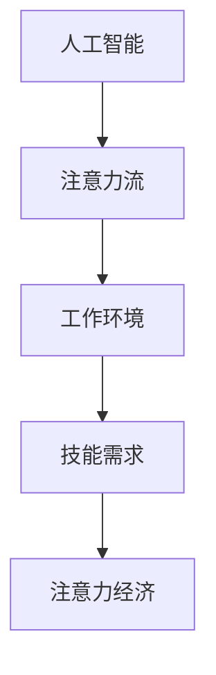

                 

# AI与人类注意力流：未来的工作、技能与注意力经济的未来展望

在数字时代，人工智能（AI）已经成为改变我们工作方式、技能需求以及经济结构的重要力量。本文将深入探讨AI与人类注意力流之间的关系，分析未来的工作场景、技能要求以及注意力经济的发展趋势，为AI技术的广泛应用提供全面的视角。

## 1. 背景介绍

### 1.1 问题由来
随着AI技术的不断进步，自动化、智能化的应用正逐步渗透到各个领域。从自动驾驶、智能客服到个性化推荐系统，AI正以指数级速度改变着我们的生产和生活方式。然而，这些技术的发展也引发了人们对AI与人类关系、工作未来、技能需求等问题的深入思考。

### 1.2 问题核心关键点
- AI技术的快速发展及其对工作、技能和注意力经济的影响。
- 如何在AI与人类共存的未来中，保持人类的主导地位。
- 未来工作环境、技能需求和注意力经济的趋势预测。

### 1.3 问题研究意义
理解AI与人类注意力流的关系，对于把握AI技术的未来发展趋势、推动社会进步具有重要意义。这不仅有助于企业和开发者设计更符合人类需求的AI产品，还能为政策制定者提供决策参考，确保AI技术在推动经济增长的同时，能够公平、可持续发展。

## 2. 核心概念与联系

### 2.1 核心概念概述
- **人工智能（AI）**：通过算法和数据训练的计算机程序，能够自主完成复杂的任务，包括但不限于视觉识别、语音识别、自然语言处理等。
- **注意力流（Attention Flow）**：指人类在处理信息时的注意力集中与分散过程，AI通过模拟人类注意力机制，提高信息处理和决策的准确性。
- **工作环境（Work Environment）**：包括物理和数字两个维度，物理空间的变化和数字工具的应用，共同影响着工作方式和效率。
- **技能需求（Skill Demand）**：随着技术的发展，新的技能需求不断涌现，如何适应这些变化是当前教育和个人发展的关键。
- **注意力经济（Attention Economy）**：在数字时代，注意力作为一种稀缺资源，其分配和利用方式正在发生深刻变化，影响着经济活动和市场竞争。

### 2.2 核心概念原理和架构的 Mermaid 流程图


## 3. 核心算法原理 & 具体操作步骤

### 3.1 算法原理概述
AI与人类注意力流的结合，主要体现在以下几个方面：
- **自监督学习**：通过无标签数据训练模型，学习到通用的知识表示，模拟人类注意力机制。
- **增强学习**：通过与环境互动，AI不断调整其行为策略，提高决策效率。
- **迁移学习**：利用已有知识解决新问题，减少从头训练的时间和资源。

### 3.2 算法步骤详解
1. **数据准备**：收集和预处理数据，确保数据的质量和多样性。
2. **模型选择**：选择合适的AI模型，根据任务特点进行优化。
3. **训练与微调**：利用大量数据训练模型，并根据实际场景进行微调。
4. **评估与部署**：通过测试评估模型性能，并将其部署到实际应用中。

### 3.3 算法优缺点
**优点**：
- 提高决策效率和准确性。
- 减少人力成本和错误率。
- 适应多变的市场需求。

**缺点**：
- 依赖数据质量和量。
- 可能产生技术偏见和歧视。
- 对工作环境和技能需求变化反应滞后。

### 3.4 算法应用领域
- **自动化与优化**：广泛应用于制造业、物流、金融等领域的流程自动化和效率优化。
- **智能客服与推荐**：通过分析用户行为数据，提供个性化推荐和智能客服。
- **健康与医疗**：辅助医生诊断、个性化医疗方案制定。
- **教育与培训**：利用AI技术提供个性化学习路径和智能辅导。

## 4. 数学模型和公式 & 详细讲解 & 举例说明

### 4.1 数学模型构建
假设有一个AI模型 $M$，其输入为 $X$，输出为 $Y$。模型通过训练学习到一个函数 $f: X \rightarrow Y$。

### 4.2 公式推导过程
设 $M$ 在输入 $X_i$ 上的输出为 $Y_i = M(X_i)$，其期望输出为 $\hat{Y}_i$。模型的预测误差可以表示为：
$$
E(Y_i - \hat{Y}_i) = \frac{1}{N} \sum_{i=1}^N (Y_i - M(X_i))^2
$$

### 4.3 案例分析与讲解
以智能客服系统为例，通过收集和分析用户的对话记录，训练一个AI模型来预测用户的意图，从而提供合适的回复。模型的训练过程可以表示为：
- **输入**：用户提问、对话历史、情感信息等。
- **输出**：最佳回答。
- **损失函数**：交叉熵损失函数。

## 5. 项目实践：代码实例和详细解释说明

### 5.1 开发环境搭建
- **Python环境**：安装Anaconda，创建虚拟环境。
- **深度学习框架**：安装TensorFlow或PyTorch，选择合适的前端和后端。
- **数据集**：收集和预处理数据，确保数据的质量和多样性。

### 5.2 源代码详细实现
以下是一个简单的智能客服系统代码实现：

```python
import tensorflow as tf
from tensorflow.keras import layers, models

# 构建模型
model = models.Sequential()
model.add(layers.Dense(64, activation='relu', input_shape=(X_train.shape[1],)))
model.add(layers.Dense(64, activation='relu'))
model.add(layers.Dense(1))

# 编译模型
model.compile(loss='mse', optimizer=tf.keras.optimizers.Adam(learning_rate=0.01))

# 训练模型
model.fit(X_train, y_train, epochs=10, validation_data=(X_test, y_test))

# 使用模型
predictions = model.predict(X_new)
```

### 5.3 代码解读与分析
- **模型构建**：采用深度学习模型，通过多个密集层进行特征提取和分类。
- **数据准备**：收集用户对话数据，并进行预处理，确保数据的质量和多样性。
- **训练与评估**：通过交叉熵损失函数，优化模型参数，评估模型性能。
- **使用模型**：利用训练好的模型，对新的用户对话进行预测。

### 5.4 运行结果展示
模型训练后，可以通过预测结果评估模型性能，例如在智能客服系统中，模型可以预测用户意图，提供最佳回答。

## 6. 实际应用场景

### 6.1 智能客服系统
AI与人类注意力流在智能客服中的应用，体现在通过分析用户对话记录，训练模型预测用户意图，从而提供合适的回答。这不仅提高了客服效率，还能实现24小时不间断服务，提升用户体验。

### 6.2 健康与医疗
AI与人类注意力流在医疗中的应用，可以通过分析患者症状、病历等数据，训练模型预测疾病风险，提供个性化的医疗方案。AI技术的应用，使得医生能够更快、更准确地做出诊断，提高医疗服务的质量。

### 6.3 教育与培训
AI与人类注意力流在教育中的应用，可以通过分析学生的学习行为和成绩，训练模型预测学生未来的表现，提供个性化的学习路径和智能辅导。AI技术的应用，使得教育更加个性化和高效，提高学生的学习效率。

### 6.4 未来应用展望
未来的AI技术，将更加智能化、个性化和自动化。AI与人类注意力流的结合，将推动更多领域的变革，如智能制造、智能交通、智能农业等。同时，AI技术的应用也将引发新的伦理、法律和社会问题，需要我们共同探讨和解决。

## 7. 工具和资源推荐

### 7.1 学习资源推荐
- **书籍**：《深度学习》（Goodfellow et al.）、《人工智能》（吴恩达）。
- **课程**：Coursera上的深度学习课程、Udacity的AI Nanodegree。
- **资源**：Kaggle数据集、GitHub开源项目。

### 7.2 开发工具推荐
- **Python环境**：Anaconda、Jupyter Notebook。
- **深度学习框架**：TensorFlow、PyTorch。
- **数据处理工具**：Pandas、NumPy。

### 7.3 相关论文推荐
- **Attention Mechanism**：《Neural Information Processing Systems》（ICML）。
- **Reinforcement Learning**：《Reinforcement Learning: An Introduction》（Sutton & Barto）。
- **迁移学习**：《A Survey of Transfer Learning》（Pan & Yang）。

## 8. 总结：未来发展趋势与挑战

### 8.1 研究成果总结
- AI技术在各个领域的应用，已经展现出巨大的潜力和价值。
- 人类注意力流的模拟和应用，正在推动AI技术的不断进步。
- 未来AI与人类共存的未来，需要我们在技术、伦理和社会各个层面进行深入探讨。

### 8.2 未来发展趋势
- **自动化与优化**：更多的自动化流程和优化方案将应用于各个领域。
- **智能与个性化**：AI将更加智能和个性化，提高生产效率和生活质量。
- **跨领域融合**：AI技术与更多领域的融合，将带来新的应用场景和商业模式。

### 8.3 面临的挑战
- **技术偏见与歧视**：AI模型可能继承数据中的偏见，需要更多的公平性考虑。
- **数据隐私与安全**：在AI应用中，数据隐私和安全问题不容忽视。
- **伦理与社会问题**：AI的应用可能引发新的伦理和社会问题，需要我们共同探讨解决。

### 8.4 研究展望
未来的AI研究，需要在技术、伦理、社会等多个层面进行深入探讨和实践。只有通过跨学科的合作，才能实现AI技术的可持续发展，造福全人类。

## 9. 附录：常见问题与解答

**Q1：AI与人类注意力流的关系是什么？**

A: AI与人类注意力流的结合，体现在AI通过学习人类的注意力机制，提高信息处理和决策的效率。AI通过自监督学习、增强学习等方式，模拟人类在处理信息时的注意力集中与分散过程，从而提高决策的准确性和效率。

**Q2：AI技术的发展对工作环境有何影响？**

A: AI技术的发展，将改变传统的工作方式和环境。自动化和智能化的应用，将提高工作效率，减少人力成本和错误率。同时，AI的应用也将带来新的工作岗位和技能需求，推动工作环境的不断演变。

**Q3：未来技能需求的变化趋势是什么？**

A: 未来技能需求的变化趋势，将更加注重数据分析、机器学习、编程等技术技能。同时，创造性思维、跨领域知识整合、社交技能等软技能也将受到重视。教育系统需要适应这些变化，培养具有多样技能的人才。

**Q4：注意力经济如何影响未来经济结构？**

A: 注意力经济将改变传统的经济结构，资源的分配和利用方式将更加依赖于人们的注意力。未来的市场竞争，将更多地围绕注意力资源展开。企业需要利用AI技术，吸引和利用更多的注意力资源，提高市场竞争力。

---

作者：禅与计算机程序设计艺术 / Zen and the Art of Computer Programming

