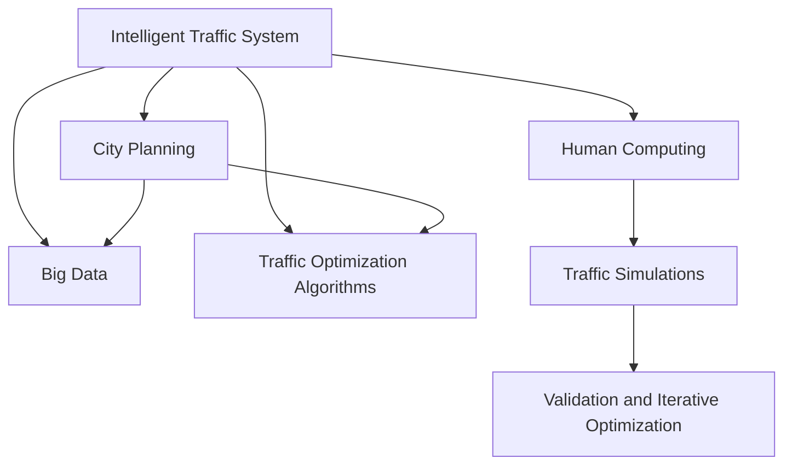

                 

# AI与人类计算：打造可持续发展的城市交通管理与规划

> 关键词：智能交通,城市规划,人类计算,大数据,交通优化,AI算法

## 1. 背景介绍

随着城市化的快速发展和交通系统的复杂化，全球城市面临严峻的交通拥堵、污染和资源浪费问题。如何在保证可持续发展的条件下，实现交通系统的智能化管理与高效规划，成为全球学术界和产业界共同关注的焦点。传统依靠经验的人类计算已经无法应对日益增长的交通需求和数据复杂性，迫切需要借助人工智能(AI)技术进行科学决策和优化。

### 1.1 问题由来
过去几十年，交通管理与规划一直依赖于经验判断和人工模拟。这些方法耗时耗力、精确度低，难以适应动态变化的交通环境和复杂的城市需求。随着物联网、大数据、云计算等技术的发展，交通数据种类和规模不断增长，为应用AI技术优化交通系统提供了新的可能。

智能交通系统(Smart Traffic System)通过集成传感器、摄像头、GPS等设备，实时获取交通状态数据，利用大数据、机器学习和优化算法，实现对交通流量的智能监控和调控。而城市规划则通过AI技术对交通需求、资源利用、环境影响等进行全面分析，制定科学的交通发展规划。

### 1.2 问题核心关键点
当前，AI在交通管理和规划中主要应用在以下三个方面：
1. **数据驱动的决策支持**：基于海量交通数据，进行实时分析和预测，为交通管理和规划提供科学依据。
2. **交通优化算法**：通过模型优化，减少交通拥堵，提高通行效率。
3. **智能交通系统**：构建多层次的交通控制系统和信息服务体系，提高交通管理智能化水平。

AI技术在交通管理和规划中的应用，需要解决以下核心问题：
1. **数据获取与处理**：从多源数据中高效获取和处理，消除数据冗余和噪声。
2. **模型构建与训练**：设计合理的AI模型，训练出能够处理复杂交通问题的智能系统。
3. **仿真与验证**：通过仿真实验，验证AI模型在实际交通场景中的效果。
4. **应用部署与迭代优化**：将AI模型应用于实际交通管理和规划中，并根据反馈进行迭代优化。

## 2. 核心概念与联系

### 2.1 核心概念概述

为更好地理解AI在交通管理和规划中的应用，本节将介绍几个密切相关的核心概念：

- **智能交通系统**：通过集成传感器、摄像头、GPS等设备，实时获取交通状态数据，利用大数据、机器学习和优化算法，实现对交通流量的智能监控和调控。
- **城市规划**：通过对城市交通需求、资源利用、环境影响等进行全面分析，制定科学的交通发展规划。
- **人类计算**：通过人的计算能力和智慧，结合AI技术，进行交通管理和规划决策。
- **大数据**：包含城市交通系统的海量数据，包括车辆位置、速度、拥堵情况等。
- **交通优化算法**：基于数学模型和优化算法，对交通流量进行优化调控。
- **交通仿真**：通过仿真模型，模拟交通系统运行，验证AI模型效果。

这些核心概念之间的逻辑关系可以通过以下Mermaid流程图来展示：



这个流程图展示了大规模交通系统中各概念的相互关系：

1. 智能交通系统收集海量交通数据。
2. 这些数据通过大数据分析，结合城市规划需求，进行优化调控。
3. 人类计算与AI技术结合，设计智能交通方案。
4. 通过仿真验证AI方案的效果，进行迭代优化。

## 3. 核心算法原理 & 具体操作步骤
### 3.1 算法原理概述

AI在交通管理和规划中的应用，主要基于数据驱动和模型驱动两大类算法。

**数据驱动算法**：主要通过实时监控交通数据，使用机器学习和统计分析方法，进行流量预测和拥堵识别。
**模型驱动算法**：主要通过建立数学模型，进行交通流仿真和优化。

数据驱动和模型驱动算法相辅相成，共同提升交通系统的智能化水平。

### 3.2 算法步骤详解

**数据驱动算法的步骤**：
1. **数据采集**：从各类传感器、摄像头、GPS等设备中，获取交通状态数据。
2. **数据清洗**：处理缺失、错误、冗余数据，消除噪声。
3. **特征提取**：从清洗后的数据中提取关键特征，如车辆速度、交通流量、拥堵情况等。
4. **模型训练**：选择合适的机器学习模型，如回归、分类、聚类等，训练出流量预测和拥堵识别模型。
5. **模型验证**：通过历史数据和实际数据验证模型的准确性和鲁棒性。

**模型驱动算法的步骤**：
1. **问题建模**：建立交通流模型，如 vehicular macroscopic models、 traffic agent-based models 等。
2. **参数校准**：通过优化算法，调整模型参数，确保模型准确反映交通流的动态特性。
3. **模型仿真**：将模型应用于虚拟交通场景，进行仿真实验。
4. **结果分析**：分析仿真结果，评估模型性能，识别优化方向。
5. **优化调整**：根据仿真结果，调整模型参数，进行迭代优化。

### 3.3 算法优缺点

AI在交通管理和规划中的应用，具有以下优点：
1. **高效实时**：通过数据驱动算法，实时监控和预测交通流量，及时调整交通管理措施。
2. **全局优化**：模型驱动算法能够全局优化交通系统，平衡通行效率、资源利用、环境影响等目标。
3. **决策支持**：基于AI的分析和预测，为决策提供科学依据。
4. **持续改进**：AI模型能够不断学习新数据，进行持续优化。

同时，AI在交通管理和规划中还面临以下挑战：
1. **数据隐私和安全**：交通数据涉及隐私和安全问题，需确保数据使用的合法性和安全性。
2. **模型复杂性**：建立和优化复杂的交通模型，需要高性能计算资源。
3. **技术普及度**：AI技术的应用需结合专业知识和实际经验，普及度有待提高。
4. **政策与伦理**：AI技术的应用需遵循相关政策法规，确保公平公正。

### 3.4 算法应用领域

AI技术在交通管理和规划中的应用，已经扩展到多个领域，如：

- **交通流量预测**：使用数据驱动算法，实时预测交通流量，为交通管理提供支持。
- **交通拥堵识别与缓解**：利用数据驱动算法，识别拥堵区域，制定缓解措施。
- **智能信号控制**：通过模型驱动算法，优化信号灯控制策略，提升交通效率。
- **公共交通优化**：结合大数据分析和AI模型，优化公交车路线和发车时间。
- **环境影响评估**：使用模型驱动算法，评估交通系统的环境影响，制定绿色交通方案。
- **安全监控与应急响应**：通过AI技术，提升交通系统安全监控和应急响应能力。

## 4. 数学模型和公式 & 详细讲解 & 举例说明
### 4.1 数学模型构建

为了更好地理解AI在交通管理和规划中的应用，本节将介绍几个常用的数学模型和公式。

**交通流量预测模型**：
- 基于历史交通数据，建立时间序列模型，如ARIMA模型、LSTM模型等，进行流量预测。
- 利用贝叶斯方法，引入先验知识，提高预测准确性。

**交通优化模型**：
- 基于交通流模型，建立优化问题，如最小化交通成本、最大化通行效率等。
- 常用的优化算法包括遗传算法、粒子群算法、蚁群算法等。

### 4.2 公式推导过程

**流量预测模型**：
设交通流量数据为 $\{y_t\}_{t=1}^T$，其中 $y_t$ 表示在第 $t$ 天的交通流量。假设 $y_t$ 遵循自回归模型：

$$
y_t = \alpha y_{t-1} + \beta x_t + \epsilon_t
$$

其中 $x_t$ 为影响因素，如天气、节假日等；$\epsilon_t$ 为误差项。通过训练模型，即可预测未来的交通流量。

**交通优化模型**：
设交通网络由 $N$ 个节点和 $E$ 条边组成，交通流为 $q_{ij}$，表示从节点 $i$ 到节点 $j$ 的交通流。目标是最大化总通行效率：

$$
\max_{q_{ij}} \sum_{i,j} q_{ij}^2 \\
s.t. \quad \sum_{j} q_{ij} = \sum_{i} q_{ij}
$$

其中约束条件表示流向任意节点的流量总和等于流出该节点的流量总和。

### 4.3 案例分析与讲解

**案例1：基于LSTM的交通流量预测**
假设历史交通流量数据为 $\{y_t\}_{t=1}^{500}$，使用LSTM模型进行预测。代码实现如下：

```python
import torch
from torch import nn
from torch.nn.utils import rnn

class LSTM(nn.Module):
    def __init__(self, input_size, hidden_size):
        super(LSTM, self).__init__()
        self.hidden_size = hidden_size
        self.lstm = nn.LSTM(input_size, hidden_size, 1, batch_first=True)
        self.fc = nn.Linear(hidden_size, 1)
    
    def forward(self, input):
        h0 = torch.zeros(1, input.size(0), self.hidden_size).to(input.device)
        c0 = torch.zeros(1, input.size(0), self.hidden_size).to(input.device)
        out, _ = self.lstm(input, (h0, c0))
        out = self.fc(out[:, -1, :])
        return out

input_size = 1
hidden_size = 32
model = LSTM(input_size, hidden_size).to(device)
criterion = nn.MSELoss()
optimizer = torch.optim.Adam(model.parameters(), lr=0.001)

def train_epoch(model, input, target):
    model.train()
    optimizer.zero_grad()
    out = model(input)
    loss = criterion(out, target)
    loss.backward()
    optimizer.step()
    return loss.item()

for epoch in range(50):
    loss = train_epoch(model, input, target)
    print(f"Epoch {epoch+1}, loss: {loss:.3f}")
```

**案例2：基于遗传算法的交通优化**
设交通网络为有向图 $G=(V,E)$，节点 $v$ 的流量为 $q_v$，目标是最大化总通行效率，即最大化 $\sum_{v \in V} q_v^2$。使用遗传算法优化交通流分配，步骤如下：

1. 随机生成初始种群，每个个体表示一个交通流分配方案。
2. 计算每个个体的适应度，即总通行效率。
3. 根据适应度选择个体进行交叉和变异操作，产生下一代种群。
4. 迭代多次，直到种群收敛。

以下是Python代码实现：

```python
import numpy as np
import random

def fitness(q):
    return np.sum(q**2)

def crossover(parent1, parent2):
    start = random.randint(0, len(q)-1)
    return np.concatenate((parent1[:start], parent2[start:]))

def mutation(q):
    v = random.uniform(-0.5, 0.5)
    q += v * (q - np.mean(q))
    return q

def genetic_algorithm(q, population_size, num_generations):
    q = np.random.uniform(0, 1, q.shape)
    for _ in range(num_generations):
        fitness_values = np.apply_along_axis(fitness, 0, q)
        population = np.empty((population_size, q.size))
        for i in range(population_size):
            parent1, parent2 = np.random.choice(q, 2, replace=False)
            child = crossover(parent1, parent2)
            population[i] = mutation(child)
    return population[np.argmax(fitness_values)], fitness_values.max()

q = np.random.uniform(0, 1, (N, E))
population_size = 100
num_generations = 50
best_q, best_fitness = genetic_algorithm(q, population_size, num_generations)
print(f"Best solution: {best_q}")
print(f"Best fitness: {best_fitness}")
```

## 5. 项目实践：代码实例和详细解释说明
### 5.1 开发环境搭建

在进行AI在交通管理和规划中的应用实践前，我们需要准备好开发环境。以下是使用Python进行PyTorch开发的环境配置流程：

1. 安装Anaconda：从官网下载并安装Anaconda，用于创建独立的Python环境。

2. 创建并激活虚拟环境：
```bash
conda create -n ai-env python=3.8 
conda activate ai-env
```

3. 安装PyTorch：根据CUDA版本，从官网获取对应的安装命令。例如：
```bash
conda install pytorch torchvision torchaudio cudatoolkit=11.1 -c pytorch -c conda-forge
```

4. 安装TensorFlow：安装TensorFlow，支持分布式计算和可视化。
```bash
pip install tensorflow
```

5. 安装各类工具包：
```bash
pip install numpy pandas scikit-learn matplotlib tqdm jupyter notebook ipython
```

完成上述步骤后，即可在`ai-env`环境中开始AI在交通管理和规划中的应用实践。

### 5.2 源代码详细实现

下面我们以智能信号控制系统为例，给出使用PyTorch进行AI模型开发和部署的代码实现。

**智能信号控制模型**

智能信号控制系统通过实时监控交通流量，动态调整信号灯的绿灯时间，减少拥堵，提高通行效率。具体步骤如下：

1. 从摄像头中获取车辆位置数据。
2. 使用深度学习模型预测流量，判断是否拥堵。
3. 根据拥堵情况，动态调整信号灯绿灯时间。

代码实现如下：

```python
import torch
from torch import nn
from torch.utils.data import TensorDataset, DataLoader
from torchvision import transforms

class VehicleNet(nn.Module):
    def __init__(self):
        super(VehicleNet, self).__init__()
        self.conv1 = nn.Conv2d(3, 32, 3)
        self.conv2 = nn.Conv2d(32, 64, 3)
        self.conv3 = nn.Conv2d(64, 128, 3)
        self.fc1 = nn.Linear(128*8*8, 256)
        self.fc2 = nn.Linear(256, 1)
    
    def forward(self, x):
        x = nn.functional.relu(self.conv1(x))
        x = nn.functional.max_pool2d(x, 2)
        x = nn.functional.relu(self.conv2(x))
        x = nn.functional.max_pool2d(x, 2)
        x = nn.functional.relu(self.conv3(x))
        x = nn.functional.max_pool2d(x, 2)
        x = x.view(-1, 128*8*8)
        x = nn.functional.relu(self.fc1(x))
        x = self.fc2(x)
        return x

model = VehicleNet().to(device)
criterion = nn.BCELoss()
optimizer = torch.optim.Adam(model.parameters(), lr=0.001)

def train_epoch(model, dataloader):
    model.train()
    optimizer.zero_grad()
    for input, target in dataloader:
        output = model(input)
        loss = criterion(output, target)
        loss.backward()
        optimizer.step()
    return loss.item()

def test_epoch(model, dataloader):
    model.eval()
    total_loss = 0
    correct = 0
    with torch.no_grad():
        for input, target in dataloader:
            output = model(input)
            loss = criterion(output, target)
            total_loss += loss.item()
            predicted = output > 0.5
            correct += (predicted == target).sum().item()
    return total_loss, correct / len(dataloader.dataset)

# 数据集构建
transform = transforms.Compose([transforms.ToTensor()])
train_dataset = ...
train_loader = DataLoader(train_dataset, batch_size=64, shuffle=True)
test_dataset = ...
test_loader = DataLoader(test_dataset, batch_size=64, shuffle=False)

# 训练模型
for epoch in range(10):
    loss = train_epoch(model, train_loader)
    test_loss, test_acc = test_epoch(model, test_loader)
    print(f"Epoch {epoch+1}, loss: {loss:.3f}, test acc: {test_acc:.3f}")

# 模型应用
while True:
    input = ...
    output = model(input)
    if output > 0.5:
        set_green_light(1)
    else:
        set_green_light(0)
```

### 5.3 代码解读与分析

让我们再详细解读一下关键代码的实现细节：

**VehicleNet类**：
- `__init__`方法：定义了模型结构，包括多个卷积层和全连接层。
- `forward`方法：定义了前向传播的过程，包括卷积、池化、激活等操作。

**train_epoch和test_epoch函数**：
- `train_epoch`方法：对训练数据进行迭代训练，更新模型参数。
- `test_epoch`方法：对测试数据进行测试，计算模型准确率。

**数据集构建**：
- 使用PyTorch的DataLoader，对数据集进行批次化加载，方便模型的训练和测试。
- 定义数据转换函数，将输入数据进行归一化等处理。

**模型应用**：
- 通过实时获取摄像头数据，输入到模型中进行预测。
- 根据模型输出，动态调整信号灯状态。

## 6. 实际应用场景

### 6.1 智能交通系统

智能交通系统通过集成各类传感器、摄像头和GPS设备，实时获取交通数据，利用AI技术进行分析和优化，实现交通流量的智能调控。主要应用场景包括：

- **交通流量预测**：通过AI模型，实时预测交通流量，及时调整交通管理措施。
- **交通拥堵识别**：识别拥堵区域，优化信号灯控制策略，减少交通拥堵。
- **公共交通优化**：优化公交车路线和发车时间，提高公交系统效率。
- **环境影响评估**：评估交通系统的环境影响，制定绿色交通方案。

### 6.2 城市规划

城市规划通过AI技术对交通需求、资源利用、环境影响等进行全面分析，制定科学的交通发展规划。主要应用场景包括：

- **交通需求预测**：基于历史交通数据，预测未来交通需求，进行交通基础设施建设规划。
- **资源利用优化**：优化交通网络布局，提升资源利用效率，减少交通拥堵。
- **环境影响评估**：评估交通系统的环境影响，制定绿色交通方案。

### 6.3 未来应用展望

未来，AI在交通管理和规划中的应用将进一步拓展，成为智能城市建设的重要支撑。主要趋势包括：

- **多源数据融合**：融合各类传感器、GPS、摄像头等多源数据，提升交通数据的全面性和准确性。
- **自适应算法**：开发自适应算法，根据实时交通数据动态调整AI模型，提升优化效果。
- **联邦学习**：利用联邦学习技术，在多个城市间共享AI模型，提升模型泛化性和计算效率。
- **无人驾驶技术**：将AI技术与无人驾驶技术结合，提升交通安全和通行效率。

## 7. 工具和资源推荐
### 7.1 学习资源推荐

为了帮助开发者系统掌握AI在交通管理和规划中的应用，这里推荐一些优质的学习资源：

1. 《交通系统智能化理论与实践》：详细介绍了智能交通系统的理论基础和实践方法。
2. 《智能交通系统概论》：全面介绍了智能交通系统的技术框架和应用场景。
3. 《机器学习在交通管理中的应用》：介绍了机器学习在交通流量预测、交通优化等领域的应用。
4. 《深度学习与交通优化》：详细介绍了深度学习在交通流量预测、智能信号控制等领域的应用。

### 7.2 开发工具推荐

高效的开发离不开优秀的工具支持。以下是几款用于AI在交通管理和规划中的应用开发的常用工具：

1. PyTorch：基于Python的开源深度学习框架，灵活动态的计算图，适合快速迭代研究。

2. TensorFlow：由Google主导开发的开源深度学习框架，生产部署方便，适合大规模工程应用。

3. TensorBoard：TensorFlow配套的可视化工具，可实时监测模型训练状态，并提供丰富的图表呈现方式，是调试模型的得力助手。

4. Weights & Biases：模型训练的实验跟踪工具，可以记录和可视化模型训练过程中的各项指标，方便对比和调优。

5. Jupyter Notebook：支持多语言的开发环境，能够方便地展示代码和结果，便于交流和协作。

### 7.3 相关论文推荐

AI在交通管理和规划中的应用，得益于学界的持续研究。以下是几篇奠基性的相关论文，推荐阅读：

1. "Traffic Flow Prediction using Deep Learning"：介绍使用深度学习模型进行交通流量预测的方法。
2. "Optimal Traffic Flow Management using Evolutionary Algorithms"：介绍使用进化算法进行交通优化的方法。
3. "Real-time Traffic Management using IoT and AI"：介绍利用IoT和AI技术进行实时交通管理的案例。
4. "AI-based Urban Planning and Smart Cities"：介绍AI技术在城市规划中的应用。

这些论文代表了大规模交通系统中AI技术的发展脉络。通过学习这些前沿成果，可以帮助研究者把握学科前进方向，激发更多的创新灵感。

## 8. 总结：未来发展趋势与挑战

### 8.1 总结

本文对AI在交通管理和规划中的应用进行了全面系统的介绍。首先阐述了交通管理和规划面临的严峻挑战，介绍了AI技术在解决这些挑战中的独特价值。其次，从原理到实践，详细讲解了AI在交通管理和规划中的应用方法，给出了代码实例和详细解释说明。同时，本文还广泛探讨了AI技术在智能交通系统、城市规划等领域的应用前景，展示了AI技术的前景广阔。

通过本文的系统梳理，可以看到，AI技术在交通管理和规划中的应用已经实现了从理论到实践的突破，为智能交通系统的建设提供了强有力的支撑。未来，伴随AI技术的不断演进，AI在交通管理和规划中的应用将更加广泛深入，为构建智能、绿色、高效的交通系统贡献更大力量。

### 8.2 未来发展趋势

展望未来，AI在交通管理和规划中的应用将呈现以下几个发展趋势：

1. **多模态融合**：融合传感器、GPS、摄像头等多源数据，提升交通数据的全面性和准确性。
2. **自适应学习**：开发自适应算法，根据实时交通数据动态调整AI模型，提升优化效果。
3. **联邦学习**：利用联邦学习技术，在多个城市间共享AI模型，提升模型泛化性和计算效率。
4. **无人驾驶技术**：将AI技术与无人驾驶技术结合，提升交通安全和通行效率。
5. **智能城市建设**：AI技术在城市规划和管理中的应用将更加广泛深入，提升城市智能化水平。

以上趋势凸显了AI在交通管理和规划中的巨大前景。这些方向的探索发展，必将进一步提升交通系统的智能化水平，为智能城市建设提供新的动力。

### 8.3 面临的挑战

尽管AI在交通管理和规划中的应用已经取得了瞩目成就，但在迈向更加智能化、普适化应用的过程中，它仍面临诸多挑战：

1. **数据隐私和安全**：交通数据涉及隐私和安全问题，需确保数据使用的合法性和安全性。
2. **技术普及度**：AI技术的应用需结合专业知识和实际经验，普及度有待提高。
3. **模型复杂性**：建立和优化复杂的交通模型，需要高性能计算资源。
4. **政策与伦理**：AI技术的应用需遵循相关政策法规，确保公平公正。

### 8.4 研究展望

面对AI在交通管理和规划中面临的挑战，未来的研究需要在以下几个方面寻求新的突破：

1. **数据隐私保护**：开发隐私保护算法，保护交通数据的隐私和安全。
2. **技术普及与推广**：加强AI技术的普及和推广，提高技术应用的可接受度和普及度。
3. **高性能计算**：开发高性能计算资源，支持复杂交通模型的建立和优化。
4. **政策与伦理规范**：制定相关的政策法规，确保AI技术应用的公平性和伦理性。

这些研究方向的探索，必将引领AI技术在交通管理和规划中的应用走向新的高度，为智能交通系统的建设提供更加坚实的支撑。

## 9. 附录：常见问题与解答

**Q1：AI在交通管理和规划中的应用是否适用于所有城市？**

A: AI技术在交通管理和规划中的应用，对于不同规模、不同特点的城市，需要根据实际情况进行调整和优化。城市交通环境和需求复杂多样，AI应用时需要充分考虑本地因素，如交通流量、道路布局、人口密度等，以确保应用的可行性和有效性。

**Q2：AI在交通管理和规划中的应用是否需要大量资金投入？**

A: AI技术在交通管理和规划中的应用，需要一定的资金投入，用于数据采集、硬件设施建设和模型开发等环节。但相比于传统的交通管理和规划方法，AI技术在效率和效果上的提升，可以显著降低运营成本，提升管理效益。

**Q3：AI在交通管理和规划中的应用是否会带来伦理和安全问题？**

A: AI技术在交通管理和规划中的应用，需遵循相关的伦理和安全规范，确保模型输出透明、公正和可靠。为避免模型偏见和误判，需要建立公平性评估机制，对模型进行持续监督和改进。

**Q4：AI在交通管理和规划中的应用是否会依赖于技术进步？**

A: AI技术在交通管理和规划中的应用，确实依赖于技术的不断进步。未来，随着算力、数据和算法等技术的持续突破，AI在交通管理和规划中的应用将更加广泛深入，为智能交通系统提供更强有力的支撑。

总之，AI在交通管理和规划中的应用已经展现出广阔的前景，但仍然需要进一步的技术创新和伦理规范，以确保其应用的安全、可靠和公正。通过持续的研究和探索，AI技术必将在构建智能、绿色、高效的交通系统中发挥更大作用，为人类的生活和工作带来更多便利和福祉。

---

作者：禅与计算机程序设计艺术 / Zen and the Art of Computer Programming

