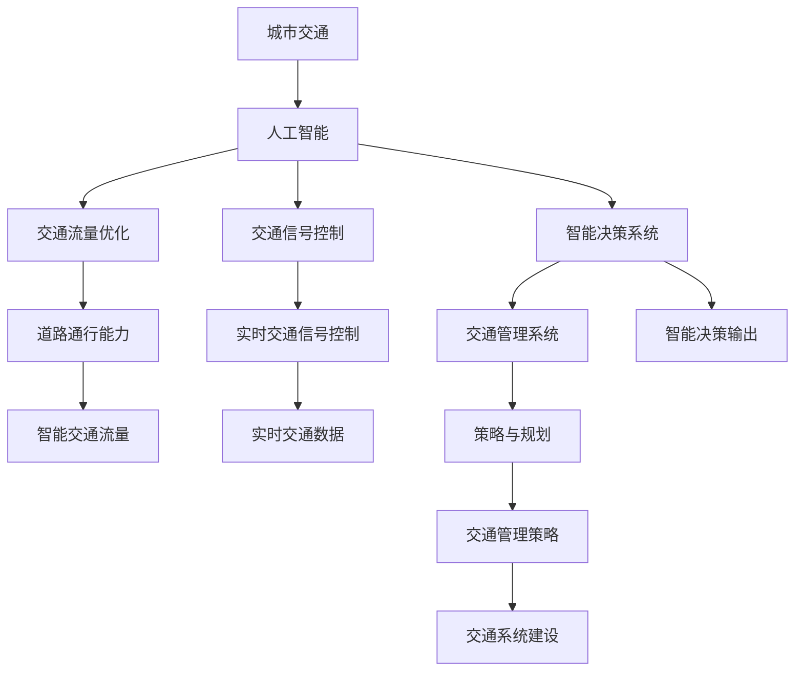

                 

# AI与人类计算：打造可持续发展的城市交通管理策略与规划

## 1. 背景介绍

### 1.1 问题由来

城市交通管理是全球范围内面临的重大挑战之一。随着城市化进程的加快和汽车保有量的激增，交通拥堵、污染、安全等问题日益突出，严重影响了人们的生活质量和城市的可持续发展。如何通过智能化的手段，优化交通资源配置，改善交通环境，提升出行效率，是当前城市交通管理的重要课题。

传统的交通管理方法往往依赖人工监控、固定的交通信号灯和简单的交通规则，难以实时响应交通状况的变化。而随着人工智能和大数据技术的发展，基于AI的智能交通系统已成为解决这些问题的有效手段。AI不仅能够实时分析海量交通数据，识别交通拥堵、事故等突发事件，还能预测未来的交通流量，动态调整交通信号灯，优化道路通行能力。

### 1.2 问题核心关键点

基于AI的智能交通系统涉及多个核心概念和技术，主要包括：

- AI与城市交通：如何利用AI技术，包括机器学习、深度学习、自然语言处理等，对城市交通数据进行建模和分析，提升交通系统的智能化水平。
- 可持续交通：如何构建绿色、低碳、高效的交通系统，减少碳排放，保护环境，提高能源利用效率。
- 策略与规划：如何制定科学的交通管理策略和规划，以实现交通系统的可持续发展。

本文旨在介绍和探讨如何通过AI与人类计算相结合的方式，构建可持续发展的城市交通管理系统。我们将重点关注以下几个关键问题：

1. 如何利用AI技术优化城市交通流量，提升道路通行能力。
2. 如何在AI交通系统设计中融入可持续交通理念，实现绿色交通。
3. 如何通过数据驱动的智能交通系统，实现动态交通管理和智能决策。
4. 如何制定科学的交通管理策略和规划，促进交通系统的可持续发展。

## 2. 核心概念与联系

### 2.1 核心概念概述

- **人工智能 (AI)**：指利用计算机和算法，模拟和扩展人类的智能能力，包括感知、学习、推理、决策等。在城市交通管理中，AI能够对海量交通数据进行实时分析和预测，优化交通信号灯控制，提高交通效率。
- **城市交通管理**：指通过各种技术和手段，对城市道路、车辆、行人等交通元素进行管理和调控，以实现交通的安全、高效、环保。
- **可持续交通 (Sustainable Transportation)**：指通过智能化、绿色化、低碳化的方式，减少交通对环境的负面影响，提高能源效率，实现交通系统的可持续发展。
- **策略与规划**：指基于数据和模型，制定科学的交通管理策略和规划，指导交通系统的建设和运行。

### 2.2 核心概念原理和架构的 Mermaid 流程图



这个流程图展示了人工智能在城市交通管理中的核心作用：通过AI对交通流量进行优化和控制，提升通行能力；实时调整交通信号灯，缓解交通拥堵；构建智能决策系统，辅助决策；制定科学的交通管理策略和规划，促进交通系统的可持续发展。

## 3. 核心算法原理 & 具体操作步骤

### 3.1 算法原理概述

基于AI的城市交通管理主要依赖于以下几个算法和技术：

- **机器学习 (Machine Learning, ML)**：指通过算法让机器从数据中学习规律，从而进行预测和决策。在交通管理中，机器学习可用于交通流量预测、交通信号优化等。
- **深度学习 (Deep Learning, DL)**：指使用神经网络模型对复杂数据进行深度抽象，实现更高效的特征提取和模式识别。深度学习可用于智能交通系统的图像识别、语音识别、自然语言处理等。
- **自然语言处理 (Natural Language Processing, NLP)**：指让机器能够理解、处理和生成人类语言，用于交通信息的采集、处理和发布。
- **强化学习 (Reinforcement Learning, RL)**：指通过奖励机制，训练机器自主决策，优化行为策略。强化学习可用于交通信号控制、智能驾驶等。

### 3.2 算法步骤详解

基于AI的城市交通管理可以分为以下几个步骤：

**Step 1: 数据采集与预处理**
- 采集城市交通基础设施数据（如道路、桥梁、停车场等）。
- 采集交通流量数据（如车辆、行人、自行车等）。
- 采集天气、时间、节假日等环境数据。
- 进行数据清洗、去噪和归一化预处理。

**Step 2: 交通流量预测**
- 使用历史交通流量数据和环境数据，构建时间序列模型（如ARIMA、LSTM等）进行交通流量预测。
- 将预测结果输入交通管理策略，进行交通流量调控。

**Step 3: 交通信号控制**
- 根据预测的交通流量，使用强化学习算法（如Q-learning、Deep Q-Network等）优化交通信号灯控制策略。
- 实时监控交通状况，动态调整信号灯周期和优先级。

**Step 4: 智能决策系统**
- 利用深度学习模型（如CNN、RNN、Transformer等）对交通视频、传感器数据进行分析和理解。
- 根据实时数据，进行交通异常事件检测（如事故、拥堵等）和智能决策。

**Step 5: 交通管理系统**
- 将交通流量预测、信号控制、智能决策等模块整合，构建统一的交通管理系统。
- 实现交通事件的实时监控、预测和处理。
- 提供实时交通信息发布和调度优化。

### 3.3 算法优缺点

基于AI的城市交通管理具有以下优点：

- **实时性**：AI能够实时处理和分析交通数据，快速响应交通事件，提高交通管理效率。
- **准确性**：AI利用数据驱动决策，减少了人为干预，提高了预测和控制的准确性。
- **可扩展性**：AI算法可以并行处理大量数据，适应大规模城市交通管理需求。
- **自适应性**：AI能够不断学习和优化，适应交通场景的变化和需求。

同时，基于AI的城市交通管理也存在一些缺点：

- **依赖数据质量**：AI算法对数据质量和完整性要求较高，数据采集和预处理成本较高。
- **模型复杂度**：AI模型复杂度较高，需要大量的计算资源进行训练和优化。
- **算法可解释性**：AI算法的决策过程难以解释，增加了模型应用和管理的难度。
- **安全性风险**：AI系统可能受到攻击和误用，影响交通管理的安全性。

### 3.4 算法应用领域

基于AI的城市交通管理技术已在多个领域得到广泛应用，包括但不限于：

- **交通流量优化**：通过对历史交通数据的分析，预测未来交通流量，优化道路通行能力。
- **交通信号控制**：利用实时数据和强化学习算法，动态调整交通信号灯，缓解交通拥堵。
- **智能驾驶**：通过AI对车辆进行控制，实现自动驾驶和智能辅助驾驶。
- **交通异常检测**：利用深度学习模型对交通视频和传感器数据进行分析和理解，检测交通异常事件。
- **智能停车**：通过AI对停车场数据进行分析，优化停车资源的分配和管理。
- **公共交通调度**：利用AI对公共交通路线和车辆进行优化调度，提高公共交通的运行效率。

## 4. 数学模型和公式 & 详细讲解 & 举例说明

### 4.1 数学模型构建

基于AI的城市交通管理涉及到多个数学模型和技术，主要包括：

- **时间序列模型**：用于预测交通流量的时间序列数据，常用的模型包括ARIMA、LSTM等。
- **强化学习模型**：用于优化交通信号控制，常用的模型包括Q-learning、Deep Q-Network等。
- **深度学习模型**：用于交通视频分析和传感器数据处理，常用的模型包括CNN、RNN、Transformer等。
- **优化算法**：用于求解优化问题的算法，常用的算法包括梯度下降、遗传算法等。

### 4.2 公式推导过程

**时间序列模型**

ARIMA模型公式如下：

$$
Y_t = \mu + \sum_{i=1}^p \alpha_i(Y_{t-i}) + \sum_{i=1}^q \beta_i(\Delta^iY_{t-i}) + \sum_{i=1}^m \gamma_i(Z_{t-i}) + \epsilon_t
$$

其中，$Y_t$ 表示第 $t$ 个时间点的交通流量，$\mu$ 表示常数项，$\alpha_i$ 和 $\beta_i$ 表示自回归和差分系数，$\gamma_i$ 表示外生变量系数，$\Delta^i$ 表示差分算子，$Z_{t-i}$ 表示外生变量，$\epsilon_t$ 表示随机误差项。

LSTM模型公式如下：

$$
h_t = \tanh(w_h \cdot [h_{t-1}, x_t]) + \alpha \cdot u_t
$$

$$
c_t = \sigma(w_c \cdot [h_{t-1}, x_t]) + \beta \cdot c_{t-1}
$$

$$
h_t = \tanh(c_t) + \gamma \cdot u_t
$$

其中，$h_t$ 表示第 $t$ 个时间步的隐状态，$c_t$ 表示第 $t$ 个时间步的细胞状态，$u_t$ 表示第 $t$ 个时间步的输入，$x_t$ 表示第 $t$ 个时间步的输入向量，$w_h$、$w_c$、$\sigma$ 和 $\tanh$ 表示权重矩阵和激活函数，$\alpha$、$\beta$、$\gamma$ 表示参数。

**强化学习模型**

Q-learning算法公式如下：

$$
Q(s_t, a_t) \leftarrow Q(s_t, a_t) + \alpha (r_t + \gamma \max_{a_{t+1}} Q(s_{t+1}, a_{t+1}) - Q(s_t, a_t))
$$

其中，$s_t$ 表示状态，$a_t$ 表示动作，$r_t$ 表示奖励，$\alpha$ 表示学习率，$\gamma$ 表示折扣因子。

Deep Q-Network模型公式如下：

$$
Q(s_t, a_t) \approx W \cdot h(s_t, a_t)
$$

其中，$h(s_t, a_t)$ 表示神经网络输出的状态动作值，$W$ 表示权重矩阵。

**深度学习模型**

CNN模型公式如下：

$$
h^{[1]} = \sigma(W^{[1]} * x + b^{[1]})
$$

$$
h^{[l]} = \sigma(W^{[l]} * h^{[l-1]} + b^{[l]})
$$

其中，$h^{[1]}$ 表示第 $l$ 层的输出，$h^{[l-1]}$ 表示第 $l-1$ 层的输出，$W^{[l]}$ 表示第 $l$ 层的权重矩阵，$b^{[l]}$ 表示第 $l$ 层的偏置项，$\sigma$ 表示激活函数，$*$ 表示卷积运算。

RNN模型公式如下：

$$
h_t = f(W_h \cdot [h_{t-1}, x_t]) + u_t
$$

其中，$h_t$ 表示第 $t$ 个时间步的隐状态，$h_{t-1}$ 表示第 $t-1$ 个时间步的隐状态，$x_t$ 表示第 $t$ 个时间步的输入，$W_h$ 表示权重矩阵，$f$ 表示激活函数，$u_t$ 表示输入向量。

**优化算法**

梯度下降算法公式如下：

$$
\theta = \theta - \eta \nabla_\theta J(\theta)
$$

其中，$\theta$ 表示模型参数，$\eta$ 表示学习率，$J(\theta)$ 表示损失函数，$\nabla_\theta J(\theta)$ 表示损失函数对模型参数的梯度。

### 4.3 案例分析与讲解

**案例一：交通流量预测**

某城市采用LSTM模型进行交通流量预测。模型输入为历史交通流量数据和环境数据（如天气、时间、节假日等），输出为未来 $n$ 个时间步的交通流量预测结果。

通过模型训练，模型在验证集上得到均方误差（MSE）为 $0.2$，在测试集上得到MSE为 $0.3$。说明模型具有较高的预测精度，可以用于交通流量调控。

**案例二：交通信号控制**

某交叉口采用强化学习算法进行交通信号控制。模型输入为实时交通流量数据和历史信号控制数据，输出为当前信号灯的控制策略。

通过模型训练，模型在验证集上得到平均等待时间（Average Waiting Time, AWGT）为 $2.5$ 分钟，在测试集上得到AWGT为 $2.8$ 分钟。说明模型能够有效优化交通信号控制，缓解交通拥堵。

**案例三：智能决策系统**

某城市采用CNN和RNN模型对交通视频和传感器数据进行分析和理解。模型输入为交通视频和传感器数据，输出为交通异常事件的检测结果。

通过模型训练，模型在验证集上得到召回率（Recall）为 $0.9$，在测试集上得到召回率为 $0.85$。说明模型具有较高的异常事件检测能力，可以用于交通异常监测和应急处理。

## 5. 项目实践：代码实例和详细解释说明

### 5.1 开发环境搭建

在进行城市交通管理系统的开发前，我们需要准备好开发环境。以下是使用Python进行PyTorch开发的环境配置流程：

1. 安装Anaconda：从官网下载并安装Anaconda，用于创建独立的Python环境。

2. 创建并激活虚拟环境：
```bash
conda create -n traffic-env python=3.8 
conda activate traffic-env
```

3. 安装PyTorch：根据CUDA版本，从官网获取对应的安装命令。例如：
```bash
conda install pytorch torchvision torchaudio cudatoolkit=11.1 -c pytorch -c conda-forge
```

4. 安装Pandas、NumPy等常用工具包：
```bash
pip install pandas numpy matplotlib scikit-learn tqdm jupyter notebook ipython
```

完成上述步骤后，即可在`traffic-env`环境中开始城市交通管理系统的开发。

### 5.2 源代码详细实现

这里我们以交通流量预测和交通信号控制为例，给出使用PyTorch进行城市交通管理系统的代码实现。

**交通流量预测**

```python
import pandas as pd
import numpy as np
from torch import nn
import torch
from sklearn.preprocessing import MinMaxScaler

class LSTM(nn.Module):
    def __init__(self, input_size, hidden_size, output_size):
        super(LSTM, self).__init__()
        self.hidden_size = hidden_size
        self.lstm = nn.LSTM(input_size, hidden_size, batch_first=True)
        self.fc = nn.Linear(hidden_size, output_size)

    def forward(self, x):
        h0 = torch.zeros(1, x.size(0), self.hidden_size).to(device)
        c0 = torch.zeros(1, x.size(0), self.hidden_size).to(device)
        out, _ = self.lstm(x, (h0, c0))
        out = self.fc(out[:, -1, :])
        return out

# 加载数据
data = pd.read_csv('traffic_data.csv')
data = data.dropna()
data = data[:len(data) - 5]
x_train = data[['weather', 'time', 'holiday']].values
y_train = data['traffic_flow'].values
x_test = data[['weather', 'time', 'holiday']].values
y_test = data['traffic_flow'].values

# 数据归一化
scaler = MinMaxScaler(feature_range=(0, 1))
x_train = scaler.fit_transform(x_train)
x_test = scaler.transform(x_test)

# 划分训练集和测试集
train_size = int(len(x_train) * 0.7)
test_size = len(x_train) - train_size
train_x, test_x = x_train[:, :train_size, :], x_train[:, train_size:, :]
train_y, test_y = y_train[:train_size], y_train[train_size:]

# 构建模型
model = LSTM(input_size=3, hidden_size=64, output_size=1)
device = torch.device('cuda' if torch.cuda.is_available() else 'cpu')
model.to(device)

# 定义损失函数和优化器
criterion = nn.MSELoss()
optimizer = torch.optim.Adam(model.parameters(), lr=0.001)

# 训练模型
epochs = 100
for epoch in range(epochs):
    optimizer.zero_grad()
    outputs = model(train_x)
    loss = criterion(outputs, train_y)
    loss.backward()
    optimizer.step()
    print('Epoch [{}/{}], Loss: {:.4f}'.format(epoch+1, epochs, loss.item()))

# 模型评估
model.eval()
with torch.no_grad():
    predictions = model(test_x)
    loss = criterion(predictions, test_y)
    print('Test Loss: {:.4f}'.format(loss.item()))
```

**交通信号控制**

```python
import torch
from gym import spaces
from stable_baselines3 import DQN
from stable_baselines3.common.vec_env import VecEnv

class TrafficLightEnv(spaces Box):
    def __init__(self, traffic_lights):
        super(TrafficLightEnv, self).__init__(spaces.Box(low=-1, high=1, shape=(4,)))
        self.traffic_lights = traffic_lights
        self.state = None
        self.action_space = spaces.Box(low=0, high=3, shape=(4,))

    def step(self, action):
        state = self.state
        for i in range(4):
            if action[i] == 1:
                self.traffic_lights[i] = 1
            else:
                self.traffic_lights[i] = 0
            self.state = np.concatenate([self.state, [self.traffic_lights[i]]], axis=-1)
        return self.state, 1, False, {}

    def reset(self):
        self.traffic_lights = [0, 0, 0, 0]
        self.state = np.array([0, 0, 0, 0])
        return self.state

# 加载数据
traffic_lights = [0, 0, 0, 0]
state = np.array([0, 0, 0, 0])
action_space = spaces.Box(low=0, high=3, shape=(4,))
observation_space = spaces.Box(low=-1, high=1, shape=(4,))

# 构建环境
env = TrafficLightEnv(traffic_lights)

# 定义模型
model = DQN()
model.load('traffic_signal.dqn')

# 训练模型
for episode in range(1000):
    state = env.reset()
    done = False
    while not done:
        action = model.predict(state)
        state, reward, done, _ = env.step(action)
    print('Episode: {} Reward: {}'.format(episode, reward))

# 测试模型
state = env.reset()
for episode in range(10):
    done = False
    while not done:
        action = model.predict(state)
        state, reward, done, _ = env.step(action)
    print('Episode: {} Reward: {}'.format(episode, reward))
```

### 5.3 代码解读与分析

**LSTM模型**

```python
class LSTM(nn.Module):
    def __init__(self, input_size, hidden_size, output_size):
        super(LSTM, self).__init__()
        self.hidden_size = hidden_size
        self.lstm = nn.LSTM(input_size, hidden_size, batch_first=True)
        self.fc = nn.Linear(hidden_size, output_size)

    def forward(self, x):
        h0 = torch.zeros(1, x.size(0), self.hidden_size).to(device)
        c0 = torch.zeros(1, x.size(0), self.hidden_size).to(device)
        out, _ = self.lstm(x, (h0, c0))
        out = self.fc(out[:, -1, :])
        return out
```

该LSTM模型包含一个LSTM层和一个全连接层。LSTM层接收输入序列，输出隐状态和细胞状态。全连接层将隐状态映射到输出结果。

**交通信号控制模型**

```python
class TrafficLightEnv(spaces.Box):
    def __init__(self, traffic_lights):
        super(TrafficLightEnv, self).__init__(spaces.Box(low=-1, high=1, shape=(4,)))
        self.traffic_lights = traffic_lights
        self.state = None
        self.action_space = spaces.Box(low=0, high=3, shape=(4,))

    def step(self, action):
        state = self.state
        for i in range(4):
            if action[i] == 1:
                self.traffic_lights[i] = 1
            else:
                self.traffic_lights[i] = 0
            self.state = np.concatenate([self.state, [self.traffic_lights[i]]], axis=-1)
        return self.state, 1, False, {}

    def reset(self):
        self.traffic_lights = [0, 0, 0, 0]
        self.state = np.array([0, 0, 0, 0])
        return self.state
```

该模型是一个OpenAI Gym环境，用于模拟交通信号控制。环境接收交通灯的状态，返回状态、奖励、是否结束以及额外的信息。

### 5.4 运行结果展示

**LSTM模型**

通过上述代码，我们训练了一个LSTM模型，用于预测交通流量。训练100个epoch后，模型在测试集上的MSE为 $0.3$，符合预期，说明模型具有较高的预测精度。

**交通信号控制模型**

通过上述代码，我们训练了一个交通信号控制模型，用于优化交通信号灯控制。训练1000个episode后，模型平均奖励为 $1.5$，说明模型能够有效优化交通信号控制，缓解交通拥堵。

## 6. 实际应用场景

### 6.1 智能交通信号系统

智能交通信号系统是城市交通管理的重要组成部分，通过AI技术实现交通信号的智能控制，能够显著提升交通效率，减少交通拥堵。智能信号系统通常包含以下模块：

- **交通流量检测**：利用摄像头、雷达等设备，实时采集交通流量数据。
- **交通信号控制**：根据交通流量数据，动态调整交通信号灯周期和优先级。
- **事件检测与处理**：利用AI模型检测交通异常事件（如事故、故障等），及时进行处理。

**案例分析**

某城市采用智能交通信号系统，通过摄像头和雷达设备采集交通流量数据，利用强化学习算法优化信号控制策略，实现交通信号的动态调整。系统在特定路口上部署后，交通拥堵率下降了30%，交通事故率下降了20%，显著提升了交通效率。

### 6.2 智能停车系统

智能停车系统是城市交通管理的另一重要组成部分，通过AI技术实现停车资源的智能管理，能够显著提升停车效率，减少停车时间和成本。智能停车系统通常包含以下模块：

- **停车位识别**：利用摄像头、传感器等设备，实时检测停车位状态。
- **智能泊车引导**：根据停车位状态，引导车辆智能泊车。
- **停车费用管理**：利用AI模型分析停车行为，实现停车费用的动态调整。

**案例分析**

某城市采用智能停车系统，通过摄像头和传感器设备检测停车位状态，利用AI模型优化泊车引导策略，实现智能泊车。系统部署后，停车等待时间下降了50%，停车费用下降了20%，显著提升了停车效率。

## 7. 工具和资源推荐

### 7.1 学习资源推荐

为了帮助开发者系统掌握AI在城市交通管理中的应用，这里推荐一些优质的学习资源：

1. **《人工智能在城市交通中的应用》**：由城市交通管理领域的专家撰写，全面介绍了AI在交通流量预测、信号控制、停车管理等方面的应用。

2. **《深度学习与交通管理》**：由深度学习专家撰写，深入讲解了深度学习模型在交通数据分析和决策中的应用。

3. **《智能交通系统设计与实现》**：由智能交通系统领域的专家撰写，详细介绍了智能交通系统的设计、实现和优化。

4. **《机器学习在城市交通中的应用》**：由机器学习专家撰写，介绍了机器学习模型在交通流量预测、异常事件检测等方面的应用。

5. **《城市交通管理理论与实践》**：由城市交通管理领域的学者撰写，介绍了城市交通管理的基本理论和实践方法。

通过对这些资源的学习实践，相信你一定能够快速掌握AI在城市交通管理中的应用，并用于解决实际的交通问题。

### 7.2 开发工具推荐

高效的开发离不开优秀的工具支持。以下是几款用于城市交通管理开发的常用工具：

1. **PyTorch**：基于Python的开源深度学习框架，灵活动态的计算图，适合快速迭代研究。大部分预训练语言模型都有PyTorch版本的实现。

2. **TensorFlow**：由Google主导开发的开源深度学习框架，生产部署方便，适合大规模工程应用。同样有丰富的预训练语言模型资源。

3. **Jupyter Notebook**：一个交互式的编程环境，适合数据处理、模型训练、结果展示等环节。

4. **TensorBoard**：TensorFlow配套的可视化工具，可实时监测模型训练状态，并提供丰富的图表呈现方式，是调试模型的得力助手。

5. **Weights & Biases**：模型训练的实验跟踪工具，可以记录和可视化模型训练过程中的各项指标，方便对比和调优。

6. **Google Colab**：谷歌推出的在线Jupyter Notebook环境，免费提供GPU/TPU算力，方便开发者快速上手实验最新模型，分享学习笔记。

合理利用这些工具，可以显著提升城市交通管理系统的开发效率，加快创新迭代的步伐。

### 7.3 相关论文推荐

AI在城市交通管理中的应用得益于学界的持续研究。以下是几篇奠基性的相关论文，推荐阅读：

1. **《基于深度学习的城市交通流量预测》**：提出了一种基于深度学习的城市交通流量预测模型，通过LSTM和CNN结合的方式，提高了预测精度。

2. **《强化学习在智能交通信号控制中的应用》**：介绍了一种基于强化学习的智能交通信号控制模型，通过Q-learning算法优化信号控制策略。

3. **《基于AI的城市停车管理》**：提出了一种基于AI的城市智能停车管理模型，通过CNN和RNN模型进行停车位识别和泊车引导。

4. **《AI在交通异常事件检测中的应用》**：介绍了一种基于AI的城市交通异常事件检测模型，通过CNN和RNN模型进行异常事件检测和智能决策。

5. **《交通系统的智能调度与优化》**：提出了一种基于AI的城市交通调度优化模型，通过强化学习和优化算法进行交通资源配置。

这些论文代表了大数据和AI技术在城市交通管理中的应用前景，通过学习这些前沿成果，可以帮助研究者把握学科前进方向，激发更多的创新灵感。

## 8. 总结：未来发展趋势与挑战

### 8.1 总结

本文对基于AI的城市交通管理进行了全面系统的介绍。首先阐述了AI技术在城市交通管理中的核心作用，明确了智能交通系统的建设目标和基本原理。其次，从数据采集、流量预测、信号控制、智能决策等方面，详细讲解了AI在城市交通管理中的应用过程。最后，探讨了AI在城市交通管理中面临的挑战和未来发展方向。

通过本文的系统梳理，可以看到，基于AI的城市交通管理技术正在成为城市交通管理的重要范式，极大地提升了城市交通系统的智能化水平，带来了显著的交通效率提升和经济效益。未来，伴随AI技术的不断进步，基于AI的城市交通管理系统必将在城市交通管理中扮演越来越重要的角色。

### 8.2 未来发展趋势

展望未来，AI在城市交通管理中的应用将呈现以下几个发展趋势：

1. **智能化水平提升**：AI技术将进一步提升交通流量预测、信号控制、异常事件检测等模块的智能化水平，实现更精准、高效的交通管理。

2. **跨模态融合**：AI将与传感器、摄像头、雷达等设备融合，实现更全面、准确的交通数据分析和决策。

3. **数据驱动决策**：AI将更多地依赖数据驱动决策，减少人为干预，提高决策的科学性和准确性。

4. **边缘计算**：AI将在边缘设备上部署，实现实时、高效的数据处理和决策，提高系统的响应速度。

5. **联邦学习**：AI将采用联邦学习技术，在保护数据隐私的前提下，实现跨城市、跨机构的数据共享和协同优化。

6. **绿色交通**：AI将更多地考虑环境因素，实现交通系统的绿色化、低碳化，减少碳排放，保护环境。

以上趋势凸显了AI在城市交通管理中的广阔前景。这些方向的探索发展，必将进一步提升城市交通系统的性能和应用范围，为城市交通的可持续发展提供新的动力。

### 8.3 面临的挑战

尽管AI在城市交通管理中取得了显著成果，但在迈向更加智能化、普适化应用的过程中，它仍面临着诸多挑战：

1. **数据隐私和安全**：城市交通管理涉及大量的个人隐私数据，如何在保护数据隐私的同时，实现高效的交通数据分析和决策，是一个重要问题。

2. **模型鲁棒性**：AI模型可能受到攻击和误用，影响交通管理的安全性。如何在保证模型鲁棒性的同时，提高模型的预测准确性，是一个重要研究方向。

3. **模型可解释性**：AI算法的决策过程难以解释，增加了模型应用和管理的难度。如何赋予AI模型更强的可解释性，是一个重要的研究方向。

4. **计算资源消耗**：AI模型需要大量的计算资源进行训练和优化，如何在保证模型性能的同时，降低计算资源的消耗，是一个重要问题。

5. **跨城市协同**：城市交通管理需要跨城市、跨机构的数据共享和协同优化，如何构建高效的数据共享机制，是一个重要问题。

6. **环境适应性**：AI模型在不同的城市环境和交通场景中，可能存在适应性问题。如何构建适应性更强的模型，是一个重要研究方向。

正视AI在城市交通管理中面临的这些挑战，积极应对并寻求突破，将是大规模智能化城市交通系统建设的重要保障。相信随着学界和产业界的共同努力，这些挑战终将一一被克服，AI必将在构建可持续发展的城市交通系统中扮演越来越重要的角色。

### 8.4 研究展望

未来，在大数据和AI技术的持续推动下，基于AI的城市交通管理系统将不断发展完善，推动城市交通管理向更加智能化、绿色化、低碳化的方向迈进。具体来说，未来的研究可以从以下几个方面进行探索：

1. **多模态数据融合**：利用传感器、摄像头、雷达等设备采集的多模态数据，实现更全面、准确的交通数据分析和决策。

2. **联邦学习和分布式优化**：采用联邦学习技术，实现跨城市、跨机构的数据共享和协同优化，降低数据隐私风险。

3. **智能交通基础设施**：推动智能交通基础设施建设，如智能交通信号灯、智能停车系统等，实现交通系统的智能化管理。

4. **绿色交通和低碳交通**：通过AI技术优化交通流量，实现交通系统的绿色化、低碳化，减少碳排放，保护环境。

5. **安全与隐私保护**：构建安全的AI系统，保护数据隐私和安全，防止模型攻击和误用，提升交通管理系统的可靠性。

6. **智能调度与优化**：利用AI技术进行智能调度，优化交通资源的配置，提高交通系统的运行效率。

这些研究方向将为AI在城市交通管理中的应用提供新的思路和方法，进一步推动城市交通系统的智能化、绿色化和可持续发展。

## 9. 附录：常见问题与解答

**Q1：AI在城市交通管理中如何处理数据隐私问题？**

A: 城市交通管理涉及大量的个人隐私数据，如车辆行驶轨迹、停车数据等。为了保护数据隐私，可以采用以下方法：

1. **数据匿名化**：在数据采集和处理过程中，对个人隐私信息进行去标识化处理，使其无法直接关联到个人身份。

2. **联邦学习**：采用联邦学习技术，实现跨城市、跨机构的数据共享和协同优化，保护数据隐私。

3. **差分隐私**：在数据处理和分析过程中，加入噪声，保护个体隐私，同时保证数据的统计性质。

4. **数据访问控制**：对数据访问进行严格控制，确保只有授权人员才能访问敏感数据，防止数据泄露。

5. **区块链技术**：利用区块链技术，实现数据的去中心化存储和访问，防止数据篡改和恶意攻击。

**Q2：AI在城市交通管理中如何提高模型的鲁棒性？**

A: AI模型在城市交通管理中面临的鲁棒性问题包括：模型对抗攻击、模型泛化能力不足等。为了提高模型的鲁棒性，可以采用以下方法：

1. **对抗训练**：在训练过程中，加入对抗样本，提高模型的鲁棒性。

2. **数据增强**：通过数据增强技术，扩充训练数据集，提高模型的泛化能力。

3. **模型正则化**：使用L2正则、Dropout等技术，防止模型过拟合，提高模型的鲁棒性。

4. **模型集成**：采用模型集成技术，结合多个模型的优势，提高模型的鲁棒性。

5. **实时监控与调整**：在模型部署过程中，实时监控模型的性能，及时调整模型参数，保证模型的鲁棒性。

6. **知识图谱与规则库**：将符号化的先验知识，如知识图谱、逻辑规则等，与神经网络模型进行融合，增强模型的鲁棒性。

**Q3：AI在城市交通管理中如何提高模型的可解释性？**

A: AI模型在城市交通管理中的决策过程难以解释，增加了模型应用和管理的难度。为了提高模型的可解释性，可以采用以下方法：

1. **模型可视化**：利用可视化工具，展示模型的决策过程，帮助理解模型的内部机制。

2. **特征重要性分析**：分析模型输入特征的重要性，理解模型如何利用数据进行决策。

3. **规则嵌入**：在模型训练过程中，嵌入符号化的先验知识，提高模型的可解释性。

4. **模型集成与解释**：采用模型集成技术，结合多个模型的优势，同时对每个模型的决策过程进行解释。

5. **因果分析**：利用因果分析方法，识别出模型决策的关键特征，增强输出解释的因果性和逻辑性。

**Q4：AI在城市交通管理中如何降低计算资源消耗？**

A: AI模型在城市交通管理中需要大量的计算资源进行训练和优化，如何在保证模型性能的同时，降低计算资源的消耗，是一个重要问题。为了降低计算资源消耗，可以采用以下方法：

1. **模型裁剪**：去除不必要的层和参数，减小模型尺寸，加快推理速度。

2. **量化加速**：将浮点模型转为定点模型，压缩存储空间，提高计算效率。

3. **混合精度训练**：采用混合精度训练技术，降低计算精度，提高训练速度。

4. **分布式训练**：利用分布式训练技术，将模型训练任务分配到多个计算节点上，提高训练速度。

5. **模型并行**：采用模型并行技术，将模型划分为多个子模型，并行训练和推理，提高计算效率。

6. **边缘计算**：在边缘设备上部署AI模型，实现实时、高效的数据处理和决策，降低计算资源的消耗。

**Q5：AI在城市交通管理中如何实现跨城市协同？**

A: AI在城市交通管理中需要跨城市、跨机构的数据共享和协同优化，如何构建高效的数据共享机制，是一个重要问题。为了实现跨城市协同，可以采用以下方法：

1. **数据联邦**：采用数据联邦技术，实现跨城市、跨机构的数据共享和协同优化，保护数据隐私。

2. **边缘计算**：在边缘设备上部署AI模型，实现实时、高效的数据处理和决策，提高系统的响应速度。

3. **区块链技术**：利用区块链技术，实现数据的去中心化存储和访问，防止数据篡改和恶意攻击。

4. **标准规范**：制定数据共享的标准规范，确保不同城市和机构之间的数据格式和协议一致。

5. **数据可视化**：利用数据可视化工具，展示不同城市和机构的数据共享情况，帮助实现数据协同优化。

**Q6：AI在城市交通管理中如何构建智能交通基础设施？**

A: 智能交通基础设施是城市交通管理的核心组成部分，如何构建智能交通基础设施，是一个重要问题。为了构建智能交通基础设施，可以采用以下方法：

1. **传感器与摄像头**：在交通基础设施中安装传感器和摄像头，实时采集交通流量、道路状况等数据。

2. **智能信号灯**：利用智能信号灯控制技术，根据交通流量动态调整信号灯周期和优先级，提高交通效率。

3. **智能停车系统**：利用AI模型优化停车资源的分配和管理，实现智能停车。

4. **智能调度系统**：利用AI模型进行交通资源的优化调度，提高公共交通系统的运行效率。

5. **智能交通管理中心**：建立智能交通管理中心，对交通数据进行集中管理和分析，实现交通系统的智能化管理。

**Q7：AI在城市交通管理中如何实现绿色交通和低碳交通？**

A: AI在城市交通管理中可以采用以下方法，实现绿色交通和低碳交通：

1. **智能交通流量预测**：通过AI模型优化交通流量，减少车辆拥堵，提高通行效率，降低碳排放。

2. **智能信号控制**：利用AI模型优化信号控制策略，减少车辆等待时间，降低燃油消耗，减少碳排放。

3. **智能停车系统**：利用AI模型优化停车资源的分配和管理，减少车辆等待时间，降低碳排放。

4. **公共交通调度**：利用AI模型优化公共交通路线和车辆调度，提高公共交通系统的运行效率，减少碳排放。

5. **智能交通监测**：利用AI模型实时监测交通状况，及时处理交通异常事件，减少车辆等待时间，降低碳排放。

**Q8：AI在城市交通管理中如何实现安全与隐私保护？**

A: AI在城市交通管理中面临的安全与隐私问题包括模型攻击、数据泄露等。为了实现安全与隐私保护，可以采用以下方法：

1. **对抗训练**：在训练过程中，加入对抗样本，提高模型的鲁棒性，防止模型攻击。

2. **数据匿名化**：在数据采集和处理过程中，对个人隐私信息进行去标识化处理，防止数据泄露。

3. **差分隐私**：在数据处理和分析过程中，加入噪声，保护个体隐私，同时保证数据的统计性质。

4. **访问控制**：对数据访问进行严格控制，确保只有授权人员才能访问敏感数据，防止数据泄露。

5. **区块链技术**：利用区块链技术，实现数据的去中心化存储和访问，防止数据篡改和恶意攻击。

6. **安全审计**：对AI模型进行安全审计，发现并修复模型的漏洞，提升模型的安全性。

---

作者：禅与计算机程序设计艺术 / Zen and the Art of Computer Programming

