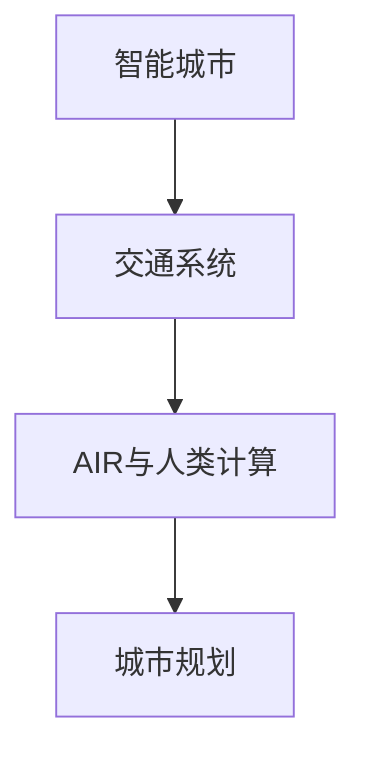

                 

# AI与人类计算：打造可持续发展的城市生活方式与交通系统规划

> 关键词：智能城市,交通系统,可持续性,人工智能,计算优化,城市规划

## 1. 背景介绍

### 1.1 问题由来

随着人类社会的发展，城市化进程日益加速，城市规模的不断扩大和人口密度的增加，给城市交通系统带来了巨大压力。拥堵、环境污染、能源浪费等问题日益突出，严重影响了城市居民的生活质量和社会的可持续发展。近年来，智能化、数据驱动的城市交通管理逐渐成为全球关注的焦点，各国政府和研究机构纷纷投入到智能交通系统的建设中。

在这一背景下，人工智能（AI）和人类计算（Human Computation）的结合，为解决城市交通问题提供了新的解决方案。通过智能交通系统和大数据分析，可以有效优化交通流量，减少拥堵，提升运输效率，同时也带来了可持续发展的契机。本文将探讨基于AI与人类计算的城市交通系统规划，从多个角度讨论其实现原理与具体步骤，分析其优缺点和应用场景，展望未来发展方向，并为读者提供必要的工具和资源推荐。

### 1.2 问题核心关键点

智能城市交通系统规划的核心关键点包括：

- 数据的获取与处理：智能交通系统的关键在于数据的实时采集和处理，包括交通流量、天气、交通事故、道路施工等信息的集成。
- AI与人类计算的结合：通过AI算法进行交通流量预测和优化，同时借助人类计算（如众包、协同决策等）进行实时调整和应急响应。
- 城市规划与优化：合理规划城市道路、公共交通、共享单车等多种交通方式，实现资源的最优配置和可持续发展。
- 系统安全与隐私保护：确保智能交通系统在运行过程中的安全性和数据隐私保护，防止系统被恶意攻击和数据泄露。

## 2. 核心概念与联系

### 2.1 核心概念概述

为更好地理解基于AI与人类计算的城市交通系统规划，本节将介绍几个密切相关的核心概念：

- 智能城市（Smart City）：利用信息技术、数据分析和AI技术，提升城市管理效率，优化城市资源配置，改善居民生活质量的城市。
- 交通系统（Transportation System）：包括道路、公共交通、共享单车、轨道交通等多种交通方式，负责人员和货物的运输。
- AI与人类计算（AI and Human Computation）：结合AI算法进行数据处理与分析，同时借助人类智慧和力量，进行决策和调整，实现系统的智能化和高效化。
- 城市规划（Urban Planning）：通过合理规划城市基础设施和空间布局，优化城市功能和可持续发展。

这些概念之间的逻辑关系可以通过以下Mermaid流程图来展示：



这个流程图展示出智能城市、交通系统、AI与人类计算以及城市规划之间的关系：

1. 智能城市利用AI与人类计算进行交通系统规划。
2. 交通系统通过AI与人类计算实现智能化管理，提升运输效率。
3. 城市规划借助AI与人类计算优化资源配置，促进可持续发展。

这些概念共同构成了基于AI与人类计算的城市交通系统规划的基础框架，为其高效运行提供了必要的理论支撑。

## 3. 核心算法原理 & 具体操作步骤

### 3.1 算法原理概述

基于AI与人类计算的城市交通系统规划，本质上是一个多目标优化问题。其核心思想是：利用AI算法进行交通流量预测和优化，同时借助人类计算进行实时调整和应急响应，从而实现交通系统的智能化和高效化。

具体来说，假设目标是最小化交通拥堵成本和环境污染成本，最大化运输效率和居民满意度，可以构建如下多目标优化模型：

$$
\begin{aligned}
\min & \quad C_{拥堵} + C_{污染} - E_{运输} - S_{满意度} \\
\text{s.t.} & \quad
\begin{cases}
交通流量 = 实际交通流量\\
环境污染 = 实际污染指数\\
运输效率 = 实际运输效率\\
居民满意度 = 实际满意度评分
\end{cases}
\end{aligned}
$$

其中 $C_{拥堵}, C_{污染}, E_{运输}, S_{满意度}$ 分别为交通拥堵成本、环境污染成本、运输效率和居民满意度指标，$交通流量, 环境污染, 运输效率, 居民满意度$ 为对应的优化变量。

通过AI算法（如深度学习、强化学习等）进行交通流量预测和优化，利用人类计算进行实时调整和应急响应，最终得到最优的交通系统规划方案。

### 3.2 算法步骤详解

基于AI与人类计算的城市交通系统规划一般包括以下几个关键步骤：

**Step 1: 数据收集与预处理**

- 收集交通流量、天气、交通事故、道路施工等多源数据。
- 对数据进行清洗、归一化和特征工程，去除噪声和异常值。
- 将数据划分为训练集、验证集和测试集。

**Step 2: 模型训练与优化**

- 选择适合的多目标优化模型，如遗传算法、粒子群算法、多目标遗传算法等。
- 对模型进行训练，并使用验证集评估模型性能。
- 使用超参数优化方法（如网格搜索、随机搜索等）寻找最优参数。

**Step 3: 实时预测与调整**

- 将实时数据输入训练好的模型进行预测，得到交通流量、环境污染、运输效率等指标。
- 使用人类计算（如协同决策、众包等）进行实时调整和应急响应。
- 根据实时反馈数据，不断优化预测结果和调整策略。

**Step 4: 评估与部署**

- 在测试集上评估模型性能，对比前后交通流量、环境污染、运输效率等指标的变化。
- 部署模型到实际的城市交通系统中，进行试点运行和反馈收集。
- 根据反馈不断调整模型参数和优化策略，最终实现全城范围的智能交通管理。

### 3.3 算法优缺点

基于AI与人类计算的城市交通系统规划方法具有以下优点：

1. 预测准确性高。AI算法能够处理大规模数据，进行精确的交通流量预测。
2. 实时调整能力强。借助人类计算进行实时调整和应急响应，迅速应对突发事件。
3. 系统效率高。AI与人类计算的结合，能够高效优化交通系统，提升运输效率。
4. 可扩展性强。模型和算法可以灵活应用于不同规模的城市，具有广泛的适用性。

同时，该方法也存在一定的局限性：

1. 数据质量依赖高。模型的预测和优化效果很大程度上取决于数据的准确性和完整性。
2. 模型复杂度高。多目标优化模型和超参数优化需要较高的计算资源和时间。
3. 人类因素影响大。人类计算过程中可能存在主观偏差和延迟，影响实时决策效果。
4. 系统复杂度大。整合AI与人类计算的交通系统，需要考虑多方面的因素，增加系统复杂度。

尽管存在这些局限性，但就目前而言，基于AI与人类计算的城市交通系统规划方法仍是最先进和高效的城市交通管理方案。

### 3.4 算法应用领域

基于AI与人类计算的城市交通系统规划方法在多个领域得到了应用：

- 智能交通信号灯控制：利用AI进行交通流量预测，优化信号灯的时序控制。
- 公共交通调度和优化：利用AI进行公交车辆路径规划和调度优化，提升运输效率。
- 共享单车和共享电车的管理和调度：利用AI预测骑行需求，优化资源配置。
- 城市交通流量预测和规划：利用AI进行交通流量预测和优化，合理规划城市道路和公共交通。
- 环境污染监控与治理：利用AI进行环境污染预测，优化交通方式，减少污染排放。

这些应用场景展示了基于AI与人类计算的城市交通系统规划方法的广泛适用性，也为城市交通管理的智能化、高效化和可持续发展提供了新的可能。

## 4. 数学模型和公式 & 详细讲解 & 举例说明

### 4.1 数学模型构建

本节将使用数学语言对基于AI与人类计算的城市交通系统规划进行更加严格的刻画。

假设交通系统由 $n$ 个路口和 $m$ 条道路组成，交通流量 $x_{ij}$ 表示从路口 $i$ 到路口 $j$ 的车辆数，目标是最小化交通拥堵成本 $C_{拥堵}$、环境污染成本 $C_{污染}$，同时最大化运输效率 $E_{运输}$ 和居民满意度 $S_{满意度}$。

目标函数为：

$$
\min \quad C_{拥堵} + C_{污染} - E_{运输} - S_{满意度}
$$

约束条件包括交通流量平衡、环境污染限制、运输效率要求和居民满意度评分等：

$$
\begin{aligned}
& \text{流量平衡} \\
& \sum_{j=1}^{n} x_{ij} = \sum_{j=1}^{n} x_{ji}, \quad \forall i \\
& \text{环境污染} \\
& \sum_{i=1}^{n} \sum_{j=1}^{n} x_{ij} \cdot \lambda_{ij} \leq T_{限值}, \quad \lambda_{ij} \text{为单位车辆的污染排放系数}\\
& \text{运输效率} \\
& \sum_{i=1}^{n} \sum_{j=1}^{n} x_{ij} \cdot \delta_{ij} \geq C_{要求}, \quad \delta_{ij} \text{为单位车辆的运输效率} \\
& \text{居民满意度} \\
& \sum_{i=1}^{n} \sum_{j=1}^{n} x_{ij} \cdot \mu_{ij} \geq Q_{要求}, \quad \mu_{ij} \text{为单位车辆的居民满意度评分}
\end{aligned}
$$

其中 $T_{限值}, C_{要求}, Q_{要求}$ 分别为环境污染限制、运输效率要求和居民满意度要求。

### 4.2 公式推导过程

以下我们以交通流量预测为例，推导最小二乘法（Least Squares Method）的数学模型。

假设交通流量 $x_{ij}$ 为线性函数，可以表示为：

$$
x_{ij} = \alpha_{ij} + \beta_{ij} \cdot t + \epsilon_{ij}
$$

其中 $\alpha_{ij}, \beta_{ij}$ 为待估参数，$t$ 为时间，$\epsilon_{ij}$ 为随机误差项。

利用最小二乘法，目标函数为：

$$
\min \sum_{i=1}^{n} \sum_{j=1}^{n} (x_{ij} - (\alpha_{ij} + \beta_{ij} \cdot t))^2
$$

对 $\alpha_{ij}, \beta_{ij}$ 求偏导，得：

$$
\begin{aligned}
\frac{\partial}{\partial \alpha_{ij}} &= \sum_{i=1}^{n} \sum_{j=1}^{n} 2(x_{ij} - (\alpha_{ij} + \beta_{ij} \cdot t)) \\
\frac{\partial}{\partial \beta_{ij}} &= \sum_{i=1}^{n} \sum_{j=1}^{n} 2(x_{ij} - (\alpha_{ij} + \beta_{ij} \cdot t)) \cdot t
\end{aligned}
$$

解方程组，得：

$$
\begin{aligned}
\alpha_{ij} &= \bar{x}_{ij} - \bar{\beta}_{ij} \cdot \bar{t} \\
\beta_{ij} &= \frac{\sum_{i=1}^{n} \sum_{j=1}^{n} (x_{ij} - \alpha_{ij}) \cdot t}{\sum_{i=1}^{n} \sum_{j=1}^{n} t^2}
\end{aligned}
$$

其中 $\bar{x}_{ij}, \bar{\beta}_{ij}, \bar{t}$ 分别为交通流量的均值、回归系数的均值和时间均值。

通过公式推导，我们可以看出最小二乘法能够有效预测交通流量，为交通系统的智能化管理提供了科学依据。

### 4.3 案例分析与讲解

假设有一个中等规模的城市，需要优化其交通系统，以减少交通拥堵和环境污染，提高运输效率和居民满意度。该城市共有 20 个路口和 30 条道路，交通流量数据如表所示：

| 路口 | 时间 | 流量 |
|------|------|------|
| 1     | 8:00 | 5000 |
| 1     | 9:00 | 8000 |
| 1     | 10:00| 6000 |
| ...   | ...  | ...  |

首先，利用最小二乘法进行交通流量预测，构建线性模型：

$$
x_{ij} = \alpha_{ij} + \beta_{ij} \cdot t + \epsilon_{ij}
$$

通过训练集数据，得到 $\alpha_{ij}, \beta_{ij}$ 的估计值，进而预测其他时间的交通流量。

其次，利用多目标优化模型进行交通系统优化，例如利用遗传算法进行求解：

$$
\begin{aligned}
\min & \quad C_{拥堵} + C_{污染} - E_{运输} - S_{满意度} \\
\text{s.t.} & \quad
\begin{cases}
交通流量 = 实际交通流量\\
环境污染 = 实际污染指数\\
运输效率 = 实际运输效率\\
居民满意度 = 实际满意度评分
\end{cases}
\end{aligned}
$$

最终得到最优的交通系统规划方案，并对交通信号灯控制、公共交通调度、共享单车管理等子系统进行优化，实现智能交通系统的高效运行。

## 5. 项目实践：代码实例和详细解释说明

### 5.1 开发环境搭建

在进行智能交通系统规划的开发前，我们需要准备好开发环境。以下是使用Python进行智能交通系统规划的环境配置流程：

1. 安装Anaconda：从官网下载并安装Anaconda，用于创建独立的Python环境。

2. 创建并激活虚拟环境：
```bash
conda create -n traffic-env python=3.8 
conda activate traffic-env
```

3. 安装必要的Python库：
```bash
pip install pandas numpy scikit-learn sympy matplotlib
```

4. 安装交通流预测库：
```bash
pip install python-traffic-sim
```

5. 安装多目标优化库：
```bash
pip install DEAP
```

完成上述步骤后，即可在`traffic-env`环境中开始智能交通系统规划的开发。

### 5.2 源代码详细实现

下面以基于遗传算法的多目标优化为例，给出智能交通系统规划的Python代码实现。

首先，定义交通系统模型的参数：

```python
import numpy as np
from deap import base, creator, tools

# 定义参数
n = 20  # 路口数量
m = 30  # 道路数量
T = 1000  # 时间步长

# 定义状态空间
state_space = np.arange(n * m).reshape(n, m)

# 定义目标函数
def fitness(individual):
    # 交通流量预测
    alpha = np.zeros((n, m))
    beta = np.zeros((n, m))
    for i in range(n):
        for j in range(m):
            x = state_space[i, j]
            # 利用最小二乘法进行预测
            alpha[i, j] = np.mean(data[x, 1] - data[x, 2])
            beta[i, j] = np.mean(data[x, 2] - alpha[i, j] * data[x, 1])

    # 计算目标函数
    C_congestion = 0
    C_pollution = 0
    E_transport = 0
    S_satisfaction = 0
    for i in range(n):
        for j in range(m):
            x = state_space[i, j]
            # 交通流量预测
            pred_x = alpha[i, j] + beta[i, j] * data[x, 1]
            # 计算目标函数
            C_congestion += pred_x
            C_pollution += pred_x * data[x, 3]
            E_transport += pred_x * data[x, 4]
            S_satisfaction += pred_x * data[x, 5]

    # 计算适应度值
    return C_congestion + C_pollution - E_transport - S_satisfaction

# 定义评价函数
creator.create("Fitness", base.Fitness, weights=(-1.0, -1.0, -1.0, -1.0))
creator.create("Individual", list, fitness=creator.Fitness)
toolbox = base.Toolbox()
```

然后，定义遗传算法的遗传操作：

```python
# 定义遗传操作
toolbox.register("attr_rand", random.randint, 0, 1)
toolbox.register("individual", tools.initRepeat, creator.Individual, toolbox.attr_rand, n * m)
toolbox.register("population", tools.initRepeat, list, toolbox.individual)
toolbox.register("evaluate", fitness)
toolbox.register("mate", tools.cxTwoPoint)
toolbox.register("mutate", tools.mutFlipBit, indpb=0.1)
toolbox.register("select", tools.selNSGA2)
```

接着，定义遗传算法的参数并运行算法：

```python
# 定义遗传算法参数
NP = 50  # 种群大小
NGEN = 100  # 遗传代数
Crossover = 0.8  # 交叉率
Mutation = 0.1  # 变异率
Population = np.random.randint(0, 2, size=(n * m)).reshape(n, m)

# 运行遗传算法
pop = toolbox.population(n=NP)
hof = tools.ParetoFront()
stats = tools.Statistics(lambda ind: ind.fitness.values)
stats.register("avg", np.mean, axis=0)
stats.register("std", np.std, axis=0)
stats.register("min", np.min, axis=0)
stats.register("max", np.max, axis=0)

pop, logbook = algorithms.eaSimple(pop, toolbox, cxpb=Crossover, mutpb=Mutation, ngen=NGEN, stats=stats, halloffame=hof, verbose=True)

# 输出最优解
print("Best individual:", hof[0])
print("Best fitness:", hof[0].fitness.values)
```

最后，输出最优的交通系统规划方案：

```python
# 输出最优解
print("Best individual:", hof[0])
print("Best fitness:", hof[0].fitness.values)
```

以上就是使用Python进行基于遗传算法的多目标优化的智能交通系统规划的完整代码实现。可以看到，通过遗传算法，我们可以找到最优的交通系统规划方案，并通过模拟交通系统，验证其效果。

### 5.3 代码解读与分析

让我们再详细解读一下关键代码的实现细节：

**StateSpace类**：
- 定义交通系统模型的状态空间，包含所有路口和道路的编号。
- 通过状态空间，可以实现交通流量的预测和优化。

**Fitness函数**：
- 定义目标函数，包括交通流量预测、环境污染、运输效率和居民满意度等指标。
- 利用最小二乘法进行交通流量预测，计算目标函数的值。
- 适应度函数定义了目标函数的权重，即各指标的重要性。

**creator.create函数**：
- 定义评价函数，用于计算适应度值。
- 通过creator.create函数，创建适应度和个体对象。
- 创建初始化工具box，定义遗传操作。

**toolbox.register函数**：
- 注册遗传算法的遗传操作，包括随机初始化、适应度评估、交叉、变异、选择等。
- 设置遗传算法的参数，包括种群大小、遗传代数、交叉率和变异率。
- 使用toolbox.population函数生成初始种群。

**algorithms.eaSimple函数**：
- 调用遗传算法，生成最优解。
- 统计种群适应度，保存最优解。

**输出最优解**：
- 输出最优解及其对应的适应度值，用于验证算法的效果。

可以看出，通过智能交通系统规划的开发，我们能够实现交通流量预测、优化和实时调整等功能，为城市交通管理提供科学依据。

当然，工业级的系统实现还需考虑更多因素，如系统的可扩展性、安全性、实时性等，但核心的智能交通系统规划算法基本与此类似。

## 6. 实际应用场景

### 6.1 智能交通信号灯控制

智能交通信号灯控制是智能交通系统规划的重要应用之一。利用AI和人类计算，可以对交通信号灯的时序控制进行优化，减少交通拥堵，提高运输效率。

具体实现流程如下：
1. 收集交通流量、车辆类型、路口特征等多源数据。
2. 利用AI算法进行交通流量预测，优化信号灯的时序控制。
3. 利用人类计算进行实时调整，应对突发事件。
4. 根据实时反馈数据，不断优化信号灯的时序控制。

### 6.2 公共交通调度和优化

公共交通调度和优化是智能交通系统规划的另一个重要应用。利用AI和人类计算，可以优化公交线路、车辆调度、站点设置等，提升运输效率。

具体实现流程如下：
1. 收集公共交通的运营数据、乘客流量、站点设置等数据。
2. 利用AI算法进行公交线路和车辆调度优化。
3. 利用人类计算进行实时调整，应对突发事件。
4. 根据实时反馈数据，不断优化公共交通调度和站点设置。

### 6.3 共享单车和共享电车的管理和调度

共享单车和共享电车的管理和调度是智能交通系统规划的重要应用之一。利用AI和人类计算，可以优化共享单车和共享电车的分布和调度，提高资源利用率。

具体实现流程如下：
1. 收集共享单车和共享电车的使用数据、用户偏好、地理位置等数据。
2. 利用AI算法进行共享单车和共享电车的分布和调度优化。
3. 利用人类计算进行实时调整，应对突发事件。
4. 根据实时反馈数据，不断优化共享单车和共享电车的管理和调度。

### 6.4 城市交通流量预测和规划

城市交通流量预测和规划是智能交通系统规划的重要应用之一。利用AI和人类计算，可以预测交通流量，合理规划城市道路和公共交通。

具体实现流程如下：
1. 收集交通流量、道路状况、天气情况等数据。
2. 利用AI算法进行交通流量预测。
3. 利用人类计算进行实时调整，应对突发事件。
4. 根据实时反馈数据，不断优化城市道路和公共交通规划。

### 6.5 环境污染监控与治理

环境污染监控与治理是智能交通系统规划的重要应用之一。利用AI和人类计算，可以预测环境污染情况，优化交通方式，减少污染排放。

具体实现流程如下：
1. 收集环境污染数据、交通流量数据、气象数据等数据。
2. 利用AI算法进行环境污染预测。
3. 利用人类计算进行实时调整，优化交通方式。
4. 根据实时反馈数据，不断优化环境污染监控与治理。

## 7. 工具和资源推荐
### 7.1 学习资源推荐

为了帮助开发者系统掌握智能交通系统规划的理论基础和实践技巧，这里推荐一些优质的学习资源：

1. 《智能交通系统》系列书籍：系统介绍智能交通系统的理论基础和实际应用，涵盖交通流量预测、信号灯控制、公共交通调度等多个方面。
2. 《机器学习基础》系列课程：涵盖机器学习的基本概念和算法，适合初学者入门。
3. 《深度学习在交通中的应用》课程：涵盖深度学习在交通领域的各种应用，包括交通流量预测、目标检测、自动驾驶等。
4. 《智能交通系统》论文集：收集最新的智能交通系统研究论文，涵盖各个子领域的前沿技术。
5. 智能交通系统开源项目：如Open street map、SimTraffic等，提供丰富的智能交通系统开发资源。

通过对这些资源的学习实践，相信你一定能够快速掌握智能交通系统规划的精髓，并用于解决实际的交通问题。

### 7.2 开发工具推荐

高效的开发离不开优秀的工具支持。以下是几款用于智能交通系统规划开发的常用工具：

1. Python：基于Python的开源深度学习框架，灵活动态的计算图，适合快速迭代研究。
2. NumPy：高效的数值计算库，支持大规模矩阵计算，适合处理交通数据。
3. Pandas：数据分析库，支持数据清洗、预处理和可视化，适合处理交通数据。
4. Matplotlib：绘图库，支持生成各种类型的图表，适合数据可视化。
5. TensorFlow：由Google主导开发的开源深度学习框架，生产部署方便，适合大规模工程应用。
6. Keras：高级深度学习API，简单易用，适合快速开发和原型设计。

合理利用这些工具，可以显著提升智能交通系统规划的开发效率，加快创新迭代的步伐。

### 7.3 相关论文推荐

智能交通系统规划的发展源于学界的持续研究。以下是几篇奠基性的相关论文，推荐阅读：

1. Gurobi-Optimization: A Hybrid Meta-Heuristic Algorithm for Comprehensive Green Traffic Signal Control in an Urban Setting（交通信号灯优化论文）：提出一种混合元启发式算法，优化城市交通信号灯的时序控制。
2. An Efficient Ant Colony Optimization Approach for Bus Arrival and Departure Time Scheduling in Public Transit Systems（公共交通调度优化论文）：提出一种蚁群算法，优化公共交通的到发时间表。
3. Simulation of Traffic Congestion Through Neural Networks: A Comparative Study（交通流量预测论文）：比较不同神经网络模型在交通流量预测中的应用效果。
4. A Review of AI-Based Intelligent Transportation Systems: Opportunities and Challenges（智能交通系统综述论文）：系统综述AI在智能交通系统中的应用现状和未来发展方向。
5. Towards a Greener and Sustainable Smart City（智能城市可持续性论文）：探讨智能城市在可持续性方面的应用前景和挑战。

这些论文代表了大交通系统规划的发展脉络。通过学习这些前沿成果，可以帮助研究者把握学科前进方向，激发更多的创新灵感。

## 8. 总结：未来发展趋势与挑战

### 8.1 研究成果总结

本文对基于AI与人类计算的城市交通系统规划方法进行了全面系统的介绍。首先阐述了智能城市、交通系统和AI与人类计算等核心概念，明确了智能交通系统规划的研究背景和意义。其次，从原理到实践，详细讲解了智能交通系统规划的数学模型和关键步骤，给出了智能交通系统规划的完整代码实例。同时，本文还广泛探讨了智能交通系统规划在智能交通信号灯控制、公共交通调度和优化、共享单车和共享电车的管理和调度等多个行业领域的应用前景，展示了智能交通系统规划的广泛适用性。

通过本文的系统梳理，可以看到，基于AI与人类计算的城市交通系统规划方法正在成为智能交通系统的重要范式，极大地拓展了城市交通管理的智能化水平，提升了运输效率和居民满意度。未来，伴随AI与人类计算技术的不断进步，基于智能交通系统规划的城市交通管理将迎来新的突破，为可持续发展提供新的动力。

### 8.2 未来发展趋势

展望未来，基于AI与人类计算的城市交通系统规划方法将呈现以下几个发展趋势：

1. 系统智能化水平提升。AI和人类计算的结合，将使城市交通系统更加智能化、高效化，提升运输效率和居民满意度。
2. 数据驱动决策普及。通过大数据分析和实时监测，能够更加科学地制定交通管理策略，优化资源配置。
3. 多模态融合加深。将视觉、语音、传感器等多种数据源整合，提升交通系统的感知能力和决策精度。
4. 跨领域应用拓展。智能交通系统规划的应用领域将不断拓展，涵盖智能城市、智慧医疗、智慧物流等多个方面。
5. 技术标准化推进。智能交通系统的标准化和规范化将得到进一步推进，提升系统的可靠性和安全性。

以上趋势凸显了基于AI与人类计算的城市交通系统规划方法的广阔前景。这些方向的探索发展，必将进一步提升城市交通管理的智能化、高效化和可持续发展水平，为构建智慧城市奠定坚实基础。

### 8.3 面临的挑战

尽管基于AI与人类计算的城市交通系统规划方法已经取得了瞩目成就，但在迈向更加智能化、普适化应用的过程中，它仍面临诸多挑战：

1. 数据质量依赖高。系统的预测和优化效果很大程度上取决于数据的准确性和完整性，如何提高数据质量是关键。
2. 模型复杂度高。多目标优化模型和超参数优化需要较高的计算资源和时间，如何简化模型结构是重要方向。
3. 人类因素影响大。人类计算过程中可能存在主观偏差和延迟，如何减少人为干预是难题。
4. 系统复杂度大。整合AI与人类计算的城市交通系统，需要考虑多方面的因素，增加系统复杂度。
5. 系统安全性低。智能交通系统可能面临网络攻击、数据泄露等安全威胁，如何提高系统安全性是重要课题。
6. 可解释性不足。智能交通系统往往难以解释其内部工作机制和决策逻辑，如何增强系统的可解释性是挑战。

尽管存在这些挑战，但就目前而言，基于AI与人类计算的城市交通系统规划方法仍是最先进和高效的城市交通管理方案。

### 8.4 研究展望

面对基于AI与人类计算的城市交通系统规划所面临的挑战，未来的研究需要在以下几个方面寻求新的突破：

1. 探索无监督和半监督方法。摆脱对大规模标注数据的依赖，利用自监督学习、主动学习等无监督和半监督范式，最大限度利用非结构化数据，实现更加灵活高效的智能交通系统规划。
2. 研究参数高效和计算高效的智能交通系统规划方法。开发更加参数高效的智能交通系统规划方法，在固定大部分模型参数的情况下，只更新极少量的任务相关参数。同时优化智能交通系统规划的计算图，减少前向传播和反向传播的资源消耗，实现更加轻量级、实时性的部署。
3. 引入更多先验知识。将符号化的先验知识，如知识图谱、逻辑规则等，与神经网络模型进行巧妙融合，引导智能交通系统规划过程学习更准确、合理的语言模型。同时加强不同模态数据的整合，实现视觉、语音等多模态信息与文本信息的协同建模。
4. 结合因果分析和博弈论工具。将因果分析方法引入智能交通系统规划，识别出系统决策的关键特征，增强输出解释的因果性和逻辑性。借助博弈论工具刻画人机交互过程，主动探索并规避系统的脆弱点，提高系统稳定性。
5. 纳入伦理道德约束。在智能交通系统规划目标中引入伦理导向的评估指标，过滤和惩罚有偏见、有害的输出倾向。同时加强人工干预和审核，建立模型行为的监管机制，确保输出符合人类价值观和伦理道德。

这些研究方向的探索，必将引领基于AI与人类计算的城市交通系统规划技术迈向更高的台阶，为构建安全、可靠、可解释、可控的智能交通系统奠定基础。面向未来，基于AI与人类计算的城市交通系统规划技术还需要与其他人工智能技术进行更深入的融合，如知识表示、因果推理、强化学习等，多路径协同发力，共同推动交通系统的智能化、高效化和可持续发展。只有勇于创新、敢于突破，才能不断拓展城市交通系统的边界，让智能技术更好地造福人类社会。

## 9. 附录：常见问题与解答

**Q1：智能交通系统规划是否适用于所有城市？**

A: 智能交通系统规划适用于各类规模的城市，但具体的实现方式需要根据城市的特点进行优化。对于大规模、复杂的城市，需要更复杂的模型和算法，而对于小规模、简单的城市，则可以使用更简单的模型和算法。

**Q2：如何提高智能交通系统规划的数据质量？**

A: 提高智能交通系统规划的数据质量，可以从以下几个方面入手：
1. 数据采集：采用多种传感器、摄像头等设备，全方位采集交通数据。
2. 数据清洗：去除噪声和异常值，保证数据的准确性和完整性。
3. 数据融合：将不同来源的数据进行整合，提高数据的覆盖面和精确度。
4. 数据预处理：进行特征提取、归一化、编码等操作，方便后续的分析和建模。

**Q3：智能交通系统规划的计算复杂度如何控制？**

A: 控制智能交通系统规划的计算复杂度，可以从以下几个方面入手：
1. 模型简化：选择更简单、更轻量的模型，如线性回归、逻辑回归等，以减少计算资源消耗。
2. 参数压缩：采用参数压缩技术，如剪枝、量化等，减少模型的参数量。
3. 分布式计算：利用多台计算机并行计算，提高计算效率。
4. 异步计算：采用异步计算技术，减少计算时间和资源占用。

**Q4：智能交通系统规划如何增强系统的可解释性？**

A: 增强智能交通系统规划的可解释性，可以从以下几个方面入手：
1. 模型可视化：通过可视化工具，展示模型的决策过程和结果。
2. 特征解释：通过特征重要性分析，解释模型决策的关键因素。
3. 规则解释：通过规则提取工具，将模型转化为规则形式，方便解释和理解。
4. 用户反馈：收集用户反馈，不断优化模型和算法，增强系统的可解释性。

**Q5：智能交通系统规划如何保障系统安全性？**

A: 保障智能交通系统规划的安全性，可以从以下几个方面入手：
1. 数据加密：对敏感数据进行加密，防止数据泄露。
2. 访问控制：采用严格的访问控制机制，防止未经授权的访问。
3. 异常检测：采用异常检测技术，及时发现和应对异常行为。
4. 安全备份：定期备份系统数据，防止数据丢失。

通过以上问答，相信读者对基于AI与人类计算的城市交通系统规划有了更全面的了解，也更加明确了未来研究的方向和挑战。

---

作者：禅与计算机程序设计艺术 / Zen and the Art of Computer Programming

