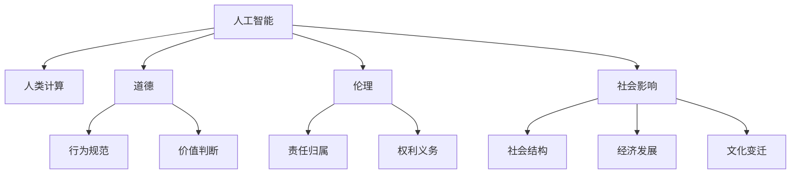

                 

## 1. 背景介绍

随着人工智能技术的飞速发展，人类计算的方式正在经历一场深刻变革。从早期的图灵机、布尔代数，到现代的神经网络、深度学习，人类通过编程计算问题的历史正走向一个新纪元。人工智能(AI)的崛起，不仅带来了前所未有的计算能力提升，也引发了广泛而深远的道德、伦理和社会影响。

### 1.1 研究背景

AI技术的迅猛发展，让计算不再仅限于传统的人类智力范畴。从机器视觉到自然语言处理，从自动驾驶到医疗诊断，AI技术渗透到社会的各个角落。这一变化一方面极大提升了生产效率和生活质量，另一方面也带来了一系列复杂的道德、伦理和社会问题。

#### 1.1.1 计算能力的提升
计算能力的大幅提升，使得AI能够处理更为复杂的数据集和任务，如大规模自然语言处理、高分辨率图像识别、实时语音交互等。AI的强大能力，不仅使得人类在信息获取、决策辅助、娱乐休闲等方面享受到更多的便利，还促使工业、医疗、教育等行业发生深远变革。

#### 1.1.2 道德和伦理问题
AI技术的广泛应用，使得道德和伦理问题凸显。如自动驾驶中的决策伦理问题、医疗诊断中的责任归属问题、在线广告中的隐私保护问题等。这些问题不仅涉及技术本身的合理性，还触及人类社会的基本价值观和行为规范。

#### 1.1.3 社会影响
AI技术的发展，也对社会产生了深远影响。就业市场的变化、财富分配的不平等、社会治理的复杂化等问题，都需要我们深入思考和应对。AI技术引发的社会变革，既带来了巨大的机遇，也带来了诸多挑战。

### 1.2 研究意义
研究AI与人类计算的道德、伦理和社会影响，具有重要的理论意义和实践价值。首先，通过深入研究AI技术的特性和应用场景，可以揭示其对人类社会的潜在影响，为相关政策制定提供科学依据。其次，揭示AI技术的优势和局限，有助于指导人工智能技术健康、有序、可持续的发展。最后，通过探讨AI技术的伦理和道德问题，有助于推动全社会对技术应用形成更加共识和规范。

## 2. 核心概念与联系

### 2.1 核心概念概述

为了更深入理解AI与人类计算的道德、伦理和社会影响，我们需要首先明确一些关键概念：

- **人工智能**：利用算法和数据，通过计算能力解决人类问题的技术。包括机器学习、深度学习、强化学习等多种形式。
- **人类计算**：指人类利用计算资源，通过算法和逻辑，解决复杂问题的过程。涵盖了从数学计算到系统设计，从科学研究到日常决策的广泛应用。
- **道德**：指人们行为规范和价值判断的标准，涉及善与恶、公正与不公正等基本问题。
- **伦理**：指人们处理社会关系的基本原则和规范，包括个人责任、集体权利、社会义务等。
- **社会影响**：指AI技术对社会结构、经济、文化等各方面的广泛影响。

这些概念相互关联，共同构成了AI与人类计算的复杂生态系统。只有全面理解这些概念，才能准确把握AI技术带来的变化和挑战。

### 2.2 核心概念原理和架构的 Mermaid 流程图



该图表展示了人工智能与人类计算、道德、伦理和社会影响的相互关系。人工智能作为计算的工具，通过提升人类计算能力，影响人类的行为规范和价值判断，同时对社会结构、经济发展和文化变迁产生深远影响。

## 3. 核心算法原理 & 具体操作步骤

### 3.1 算法原理概述

AI与人类计算的道德、伦理和社会影响，主要体现在算法设计和应用的全过程中。通过深入理解算法的原理，我们可以更好地揭示其带来的潜在问题，并提出相应的解决方案。

### 3.2 算法步骤详解

#### 3.2.1 算法设计
AI算法的设计，需要遵循一定的伦理和道德原则。例如，在设计自动驾驶算法时，需要考虑如何避免伤害无辜乘客和行人的道德难题。在设计医疗诊断算法时，需要考虑如何保证诊断结果的准确性和隐私保护。

#### 3.2.2 算法实现
AI算法的实现，需要考虑计算资源的优化和算法效率的提升。例如，在设计自然语言处理模型时，需要考虑模型参数的数量和计算复杂度。在设计图像识别模型时，需要考虑模型的响应速度和准确率。

#### 3.2.3 算法评估
AI算法的评估，需要考虑多个指标，如模型的准确性、公平性、透明性和安全性等。例如，在设计人脸识别系统时，需要评估其是否存在偏见，是否侵犯个人隐私，是否容易受到攻击等。

#### 3.2.4 算法应用
AI算法的应用，需要考虑其对社会的影响。例如，在设计在线广告系统时，需要考虑如何保护用户的隐私权和选择权，如何避免广告内容的误导和干扰。

### 3.3 算法优缺点

#### 3.3.1 优点
AI算法具有计算能力强、适应性广、自动化程度高等优点。它能够处理大规模复杂数据，提供高效和精准的决策支持，提升生产效率和生活质量。

#### 3.3.2 缺点
AI算法也存在一些局限性，如数据依赖性高、模型透明性差、决策过程不可解释等。它可能受到数据质量和算法偏见的影响，存在一定的黑箱问题。

### 3.4 算法应用领域

#### 3.4.1 医疗诊断
AI算法在医疗诊断中的应用，提高了疾病的诊断准确性和效率，但也带来了隐私保护和责任归属等道德问题。例如，如何保护患者的隐私数据，如何界定医疗事故的责任等。

#### 3.4.2 自动驾驶
自动驾驶技术的发展，极大地提升了交通效率和安全，但也面临道德和伦理问题。如自动驾驶车辆在紧急情况下的决策选择，如何平衡乘客和行人的利益等。

#### 3.4.3 金融分析
AI算法在金融领域的应用，帮助机构进行风险评估和市场预测，但也可能加剧市场不稳定性，引发道德风险。例如，如何避免金融欺诈，如何处理数据不平衡等问题。

#### 3.4.4 教育个性化
AI算法在教育领域的应用，提供了个性化的学习方案，但也可能加剧教育不平等。例如，如何确保教育资源的公平分配，如何保护学生的隐私权等。

## 4. 数学模型和公式 & 详细讲解 & 举例说明

### 4.1 数学模型构建

AI算法的设计和实现，通常需要构建数学模型。这些模型可以是线性回归、逻辑回归、神经网络、深度学习等形式。以线性回归模型为例，其数学模型可以表示为：

$$
y = \theta_0 + \sum_{i=1}^n \theta_i x_i
$$

其中，$y$ 为输出，$x_i$ 为输入变量，$\theta$ 为模型参数。

### 4.2 公式推导过程

#### 4.2.1 线性回归
线性回归模型的推导过程如下：

1. 设定目标函数：$L(\theta) = \frac{1}{2m} \sum_{i=1}^m (y_i - \theta_0 - \sum_{i=1}^n \theta_i x_i)^2$
2. 使用梯度下降算法，求解目标函数的最小值。具体步骤如下：
   - 计算梯度：$\nabla_{\theta} L(\theta) = \frac{1}{m} \sum_{i=1}^m -(y_i - \theta_0 - \sum_{i=1}^n \theta_i x_i) x_i$
   - 更新参数：$\theta_{t+1} = \theta_t - \alpha \nabla_{\theta} L(\theta_t)$

#### 4.2.2 神经网络
神经网络的数学模型可以表示为：

$$
y = \sigma(\sum_{i=1}^n w_i x_i + b)
$$

其中，$y$ 为输出，$x_i$ 为输入变量，$w_i$ 为权重，$b$ 为偏置，$\sigma$ 为激活函数。

神经网络模型的推导过程较为复杂，涉及前向传播、反向传播和梯度下降等算法。其核心思想是通过不断调整权重和偏置，最小化模型输出与真实标签之间的误差。

### 4.3 案例分析与讲解

#### 4.3.1 线性回归应用
线性回归模型可以用于预测房价。假设已知房屋面积$x_i$和价格$y_i$的数据，可以使用线性回归模型预测新房屋的价格。

1. 收集数据：$(x_i, y_i)$
2. 构建模型：$y = \theta_0 + \sum_{i=1}^n \theta_i x_i$
3. 训练模型：使用梯度下降算法，最小化损失函数
4. 预测价格：给定新房屋面积$x$，计算$y$

#### 4.3.2 神经网络应用
神经网络模型可以用于图像识别。假设已知一组图片和其对应的标签，可以使用神经网络模型预测新图片的标签。

1. 收集数据：$(x_i, y_i)$
2. 构建模型：$y = \sigma(\sum_{i=1}^n w_i x_i + b)$
3. 训练模型：使用梯度下降算法，最小化损失函数
4. 预测标签：给定新图片$x$，计算$y$

## 5. 项目实践：代码实例和详细解释说明

### 5.1 开发环境搭建

为了更好地进行AI算法的设计和实现，需要搭建合适的开发环境。以下是基于Python的开发环境搭建流程：

1. 安装Python：选择合适版本的Python，如3.8或3.9。
2. 安装必要的库：如NumPy、Pandas、Scikit-Learn等。
3. 配置开发工具：如Jupyter Notebook、PyCharm等。
4. 创建虚拟环境：使用Python的虚拟环境功能，隔离开发项目和全局环境。

### 5.2 源代码详细实现

#### 5.2.1 线性回归
以下是使用Python和NumPy实现线性回归模型的代码：

```python
import numpy as np

def linear_regression(X, y):
    theta = np.zeros((X.shape[1] + 1, 1))
    alpha = 0.01
    m = X.shape[0]
    for i in range(100):
        gradients = (1 / m) * np.dot(X.T, (y - np.dot(X, theta))) 
        theta = theta - alpha * gradients
    return theta
```

该代码实现了线性回归模型的训练过程，使用梯度下降算法最小化损失函数。

#### 5.2.2 神经网络
以下是使用Python和TensorFlow实现神经网络的代码：

```python
import tensorflow as tf

def neural_network(x):
    n_input = x.shape[1]
    n_output = 1
    n_hidden = 4
    
    weights = {
        'hidden': tf.Variable(tf.random.normal([n_input, n_hidden])),
        'output': tf.Variable(tf.random.normal([n_hidden, n_output]))
    }
    
    biases = {
        'hidden': tf.Variable(tf.random.normal([n_hidden])),
        'output': tf.Variable(tf.random.normal([n_output]))
    }
    
    layer_1 = tf.nn.relu(tf.add(tf.matmul(x, weights['hidden']), biases['hidden']))
    output = tf.add(tf.matmul(layer_1, weights['output']), biases['output'])
    
    return output
```

该代码实现了一个简单的神经网络模型，包含一个隐藏层和一个输出层。

### 5.3 代码解读与分析

#### 5.3.1 线性回归
线性回归模型的代码实现相对简单，主要包括以下几个步骤：
1. 初始化模型参数$\theta$。
2. 使用梯度下降算法，更新模型参数。
3. 重复迭代，直到损失函数收敛。
4. 返回最终模型参数$\theta$。

#### 5.3.2 神经网络
神经网络模型的代码实现较为复杂，主要包括以下几个步骤：
1. 定义模型参数$weights$和$biases$。
2. 使用激活函数$\sigma$计算隐藏层的输出。
3. 计算输出层的输出。
4. 返回最终模型输出。

### 5.4 运行结果展示

#### 5.4.1 线性回归
以下是使用线性回归模型预测房价的代码：

```python
import pandas as pd
from sklearn.model_selection import train_test_split

# 加载数据
data = pd.read_csv('housing.csv')
X = data[['Age', 'BldgType', 'TotalBsmtSF']]  # 选择影响房价的因素
y = data['SalePrice']  # 房价标签

# 划分训练集和测试集
X_train, X_test, y_train, y_test = train_test_split(X, y, test_size=0.2)

# 训练模型
theta = linear_regression(X_train, y_train)

# 预测房价
new_house = pd.DataFrame({'Age': [18.5], 'BldgType': 'AL', 'TotalBsmtSF': [100]})
y_pred = np.dot(new_house, theta)
print(f"预测房价：{y_pred:.2f}")
```

该代码使用线性回归模型预测新房屋的价格。

#### 5.4.2 神经网络
以下是使用神经网络模型识别手写数字的代码：

```python
import matplotlib.pyplot as plt
from tensorflow.keras.datasets import mnist
from tensorflow.keras.models import Sequential
from tensorflow.keras.layers import Dense, Flatten, Conv2D, MaxPooling2D

# 加载数据
(X_train, y_train), (X_test, y_test) = mnist.load_data()
X_train = X_train.reshape(-1, 28, 28, 1)
X_test = X_test.reshape(-1, 28, 28, 1)

# 构建模型
model = Sequential([
    Conv2D(32, kernel_size=(3, 3), activation='relu', input_shape=(28, 28, 1)),
    MaxPooling2D(pool_size=(2, 2)),
    Flatten(),
    Dense(10, activation='softmax')
])

# 训练模型
model.compile(optimizer='adam', loss='sparse_categorical_crossentropy', metrics=['accuracy'])
model.fit(X_train, y_train, epochs=5, batch_size=64)

# 评估模型
model.evaluate(X_test, y_test)

# 预测数字
predictions = model.predict(X_test[0].reshape(1, 28, 28, 1))
print(f"预测数字：{np.argmax(predictions)}")
```

该代码使用神经网络模型识别手写数字。

## 6. 实际应用场景

### 6.1 医疗诊断
AI算法在医疗诊断中的应用，极大提高了疾病的诊断准确性和效率。例如，AI算法可以分析患者的CT或MRI图像，辅助医生进行诊断。但是，AI算法的应用也带来了隐私保护和责任归属等道德问题。如何保护患者的隐私数据，如何界定医疗事故的责任，是AI在医疗领域应用需要解决的重要问题。

### 6.2 自动驾驶
自动驾驶技术的发展，极大地提升了交通效率和安全。但是，自动驾驶车辆在紧急情况下的决策选择，也带来了道德和伦理问题。例如，如何在自动驾驶车辆面临事故时，平衡乘客和行人的利益，是一个复杂的道德难题。

### 6.3 金融分析
AI算法在金融领域的应用，帮助机构进行风险评估和市场预测。但是，AI算法的应用也可能加剧市场不稳定性，引发道德风险。例如，如何避免金融欺诈，如何处理数据不平衡等问题，是AI在金融领域应用需要解决的重要问题。

### 6.4 未来应用展望

#### 6.4.1 伦理性算法
未来，伦理性算法将是一个重要研究方向。伦理性算法不仅需要考虑算法的计算效率和性能，还需要考虑其道德和伦理影响。例如，如何在设计AI算法时，考虑算法的公平性、透明性和安全性，是一个重要的研究方向。

#### 6.4.2 人工智能治理
人工智能治理是一个复杂的系统工程，涉及法律、伦理、技术等多个方面。未来，需要建立健全的人工智能治理体系，规范AI技术的应用，保护社会的公平和正义。例如，如何制定AI技术的法律法规，如何建立AI技术的伦理标准，是一个重要的研究方向。

#### 6.4.3 社会影响评估
未来，需要对AI技术对社会的影响进行全面评估。例如，如何评估AI技术对就业市场的影响，如何评估AI技术对教育公平的影响，是一个重要的研究方向。

## 7. 工具和资源推荐

### 7.1 学习资源推荐

#### 7.1.1 在线课程
1. Coursera上的《Machine Learning》课程（由Andrew Ng教授主讲）。
2. edX上的《Artificial Intelligence Fundamentals with Python》课程。
3. Udacity上的《Deep Learning》纳米学位课程。

#### 7.1.2 书籍
1. 《深度学习》（Ian Goodfellow、Yoshua Bengio、Aaron Courville著）。
2. 《Python深度学习》（Francois Chollet著）。
3. 《统计学习方法》（李航著）。

#### 7.1.3 博客和论文
1. 《机器学习之美》系列文章（李沐著）。
2. 《深度学习理论与实践》系列文章（周志华等著）。
3. 《Few-Shot Learning for Image Recognition》（Google论文）。

### 7.2 开发工具推荐

#### 7.2.1 Python环境
1. Anaconda：提供一个Python发行版，包含各种科学计算库和工具。
2. Jupyter Notebook：一个交互式编程环境，支持多种编程语言和数据处理工具。
3. PyCharm：一个全功能的IDE，支持Python、Java等多种编程语言。

#### 7.2.2 数据处理库
1. NumPy：一个Python科学计算库，提供高效的数组运算和矩阵计算。
2. Pandas：一个数据分析库，提供灵活的数据处理和分析工具。
3. Matplotlib：一个数据可视化库，支持多种图表绘制。

#### 7.2.3 机器学习库
1. Scikit-Learn：一个Python机器学习库，提供多种机器学习算法和工具。
2. TensorFlow：一个深度学习框架，支持分布式计算和多种模型。
3. Keras：一个高级深度学习框架，提供简单易用的API和模型构建工具。

### 7.3 相关论文推荐

#### 7.3.1 经典论文
1. 《A Theory of Mind-Action Systems》（John Searle）。
2. 《Human-Computer Interaction》（Douglas Engelbart）。
3. 《Artificial Intelligence: A Modern Approach》（Stuart Russell、Peter Norvig）。

#### 7.3.2 前沿论文
1. 《Fairness-aware Deep Learning》（Bolukbasi et al.）。
2. 《Explainable AI: Integrating Explanation into Deep Learning Models》（Guo et al.）。
3. 《Ethical Considerations in AI Systems》（Fei-Fei Li）。

## 8. 总结：未来发展趋势与挑战

### 8.1 研究成果总结

AI与人类计算的道德、伦理和社会影响是一个复杂而深远的话题。本文通过深入探讨，揭示了AI技术带来的多方面变化和挑战。主要研究成果如下：
1. AI技术在医疗、金融、教育等领域的广泛应用，极大提升了生产效率和生活质量。
2. AI技术的应用也带来了隐私保护、责任归属、公平性等伦理问题。
3. AI技术的社会影响评估，是一个亟待解决的复杂问题。

### 8.2 未来发展趋势

未来，AI技术的发展将进一步深化其在各个领域的应用。以下是一些可能的未来趋势：

#### 8.2.1 伦理性算法
伦理性算法将是一个重要研究方向。未来的AI算法不仅要考虑计算效率和性能，还需要考虑其道德和伦理影响。例如，如何设计公平、透明、安全的AI算法，是一个重要的研究方向。

#### 8.2.2 人工智能治理
未来，需要建立健全的人工智能治理体系，规范AI技术的应用。例如，如何制定AI技术的法律法规，如何建立AI技术的伦理标准，是一个重要的研究方向。

#### 8.2.3 社会影响评估
未来，需要对AI技术对社会的影响进行全面评估。例如，如何评估AI技术对就业市场的影响，如何评估AI技术对教育公平的影响，是一个重要的研究方向。

### 8.3 面临的挑战

未来，AI技术的发展仍面临诸多挑战：

#### 8.3.1 数据依赖性
AI技术的开发和应用，高度依赖于数据质量。如何获取高质量、多样化的数据，是一个重要的挑战。

#### 8.3.2 公平性和透明性
AI算法的公平性和透明性问题，需要引起高度重视。如何设计公平、透明、安全的AI算法，是一个重要的研究方向。

#### 8.3.3 伦理和社会影响
AI技术的应用，需要考虑其伦理和社会影响。如何建立健全的AI治理体系，保护社会的公平和正义，是一个重要的研究方向。

### 8.4 研究展望

未来，AI技术的研究方向将更加多样化，涉及伦理性算法、人工智能治理、社会影响评估等多个方面。以下是一些可能的未来研究方向：

#### 8.4.1 伦理性算法
如何设计公平、透明、安全的AI算法，是一个重要的研究方向。例如，如何在设计AI算法时，考虑算法的公平性、透明性和安全性，是一个重要的研究方向。

#### 8.4.2 人工智能治理
未来，需要建立健全的人工智能治理体系，规范AI技术的应用。例如，如何制定AI技术的法律法规，如何建立AI技术的伦理标准，是一个重要的研究方向。

#### 8.4.3 社会影响评估
未来，需要对AI技术对社会的影响进行全面评估。例如，如何评估AI技术对就业市场的影响，如何评估AI技术对教育公平的影响，是一个重要的研究方向。

## 9. 附录：常见问题与解答

### 9.1 Q1: AI技术的道德和伦理问题主要有哪些？

A1: AI技术的道德和伦理问题主要包括以下几个方面：
1. 隐私保护：AI系统需要大量数据进行训练，如何保护用户的隐私数据，是一个重要的问题。
2. 决策透明性：AI系统的决策过程往往难以解释，如何提高系统的透明性，是一个重要的研究方向。
3. 公平性：AI系统可能存在偏见，如何确保系统的公平性，是一个重要的研究方向。
4. 责任归属：AI系统在错误决策时，如何界定责任归属，是一个复杂的问题。

### 9.2 Q2: 如何设计公平的AI算法？

A2: 设计公平的AI算法，需要考虑以下几个方面：
1. 数据公平性：确保训练数据的多样性和代表性，避免数据偏差。
2. 算法公平性：在算法设计中考虑公平性，如使用公平性约束等。
3. 结果公平性：评估AI系统的输出结果，确保不同群体的公平性。
4. 透明性：提高系统的透明性，使决策过程可解释和可审查。

### 9.3 Q3: AI技术对社会的影响主要有哪些？

A3: AI技术对社会的影响主要包括以下几个方面：
1. 就业市场变化：AI技术可能取代某些工作，但也可能创造新的就业机会。
2. 经济影响：AI技术可以提高生产效率，但也可能引发市场不稳定性。
3. 社会治理：AI技术可以辅助社会治理，但也可能引发新的社会问题。

### 9.4 Q4: 如何建立健全的AI治理体系？

A4: 建立健全的AI治理体系，需要考虑以下几个方面：
1. 法律法规：制定AI技术的法律法规，规范AI技术的应用。
2. 伦理标准：制定AI技术的伦理标准，确保AI技术的道德性。
3. 公众参与：让公众参与AI技术的讨论和决策，提高AI技术的透明度和可信度。
4. 国际合作：加强国际合作，共同应对AI技术带来的全球性问题。

作者：禅与计算机程序设计艺术 / Zen and the Art of Computer Programming

