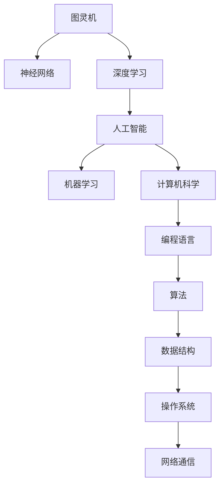

                 

# AI与计算机历史的对比

> 关键词：人工智能,计算机历史,机器学习,神经网络,深度学习,逻辑电路,图灵机,计算机科学的起源,人工智能的发展阶段

## 1. 背景介绍

### 1.1 问题由来

人工智能（AI）与计算机科学密不可分，二者的历史和发展路径既有交集也有分离。本文将从AI与计算机历史的角度，对比它们的起源、发展、成熟和未来趋势。

### 1.2 问题核心关键点

- 人工智能的起源：包括早期逻辑电路理论、图灵机理论、神经网络理论。
- 计算机科学的起源：包括冯·诺依曼计算机结构、算机语言、操作系统、网络通信技术等。
- AI与计算机科学的发展：包括人工智能的发展阶段、机器学习、深度学习、大数据、云计算等技术。
- AI与计算机科学的未来：包括AI伦理、智能控制、机器人学、脑机接口等前沿领域。

## 2. 核心概念与联系

### 2.1 核心概念概述

- 人工智能（Artificial Intelligence, AI）：通过计算机模拟人类智能，包括学习、推理、感知、自适应、优化等能力。
- 计算机科学（Computer Science）：研究计算机的硬件、软件和应用系统，包括编程语言、算法、数据结构、操作系统、网络等。
- 图灵机（Turing Machine）：由图灵提出的抽象计算机模型，定义了计算机可以执行的所有任务。
- 神经网络（Neural Network）：模拟人类大脑神经元之间连接的计算模型，用于解决复杂的非线性问题。
- 深度学习（Deep Learning）：使用多层次神经网络，通过大量数据训练，实现图像识别、语音识别、自然语言处理等任务。

这些概念之间存在紧密的联系：

- 计算机科学是人工智能的基础，提供了实现智能算法所需的计算平台和工具。
- 人工智能依赖于计算机科学的硬件和软件技术，尤其是高效算法和处理大量数据的机器。
- 神经网络和深度学习是人工智能的核心算法，使计算机可以模拟人类大脑的复杂结构，进行高级认知处理。

### 2.2 核心概念原理和架构的 Mermaid 流程图(Mermaid 流程节点中不要有括号、逗号等特殊字符)



## 3. 核心算法原理 & 具体操作步骤

### 3.1 算法原理概述

人工智能的算法原理主要基于计算机科学中的算法和数据结构，包括搜索算法、排序算法、图算法、线性代数、概率统计等。深度学习是人工智能的核心算法，主要基于神经网络和反向传播算法。

### 3.2 算法步骤详解

1. **数据预处理**：包括数据清洗、特征提取、标准化等步骤。
2. **模型构建**：选择合适的神经网络结构，如卷积神经网络（CNN）、循环神经网络（RNN）、长短期记忆网络（LSTM）等。
3. **训练模型**：使用大量标注数据训练模型，通过反向传播算法优化模型参数，提高模型精度。
4. **模型评估**：使用验证集评估模型性能，调整超参数，提高泛化能力。
5. **模型部署**：将训练好的模型部署到生产环境，进行实时预测或推理。

### 3.3 算法优缺点

**优点**：
- 算法复杂性高，可以处理复杂的非线性问题。
- 深度学习模型具有很强的泛化能力，适用于多种任务。
- 计算机科学提供高效计算平台，加速模型训练和推理。

**缺点**：
- 数据需求量大，标注成本高。
- 模型参数多，训练时间长。
- 模型复杂性高，难以解释和调试。

### 3.4 算法应用领域

- 图像识别、语音识别、自然语言处理、推荐系统、医疗诊断、金融分析等。

## 4. 数学模型和公式 & 详细讲解 & 举例说明

### 4.1 数学模型构建

人工智能算法通常基于以下数学模型：

- **线性回归**：用于预测连续变量的模型。公式为：
  $$
  y = \theta_0 + \theta_1 x_1 + \theta_2 x_2 + \ldots + \theta_n x_n
  $$

- **逻辑回归**：用于分类问题的模型。公式为：
  $$
  \hat{y} = \frac{1}{1 + e^{-\theta^T x}} 
  $$

- **神经网络**：用于非线性问题的模型。公式为：
  $$
  y = \sum_{i=1}^n w_i a_i(x) + b
  $$
  其中 $a_i(x)$ 为激活函数，如 sigmoid 或 ReLU。

### 4.2 公式推导过程

- **线性回归**：通过最小化均方误差（MSE）来优化模型参数：
  $$
  \min_{\theta} \frac{1}{2m} \sum_{i=1}^m (h_\theta(x^{(i)}) - y^{(i)})^2
  $$

- **逻辑回归**：使用交叉熵损失函数来优化模型参数：
  $$
  \min_{\theta} \frac{1}{m} \sum_{i=1}^m L(y^{(i)}, h_\theta(x^{(i)}))
  $$

- **神经网络**：通过反向传播算法来更新权重：
  $$
  \frac{\partial L}{\partial w_j} = \frac{\partial L}{\partial a_k} \frac{\partial a_k}{\partial z_j} \frac{\partial z_j}{\partial w_j}
  $$

### 4.3 案例分析与讲解

- **手写数字识别**：使用卷积神经网络，通过 MNIST 数据集进行训练。模型结构如下：
  - **输入层**：输入图片，大小为 $28 \times 28 \times 1$。
  - **卷积层**：使用 $5 \times 5$ 的卷积核，步长为 $1$，使用 ReLU 激活函数。
  - **池化层**：使用 $2 \times 2$ 的最大池化操作，步长为 $2$。
  - **全连接层**：连接池化层的输出，使用 Softmax 激活函数，输出 10 个类别的概率。

## 5. 项目实践：代码实例和详细解释说明

### 5.1 开发环境搭建

1. **安装 Python**：确保 Python 版本为 3.6 或以上。
2. **安装 TensorFlow**：使用 pip 安装 TensorFlow，如：
   ```
   pip install tensorflow
   ```
3. **安装 Keras**：使用 pip 安装 Keras，如：
   ```
   pip install keras
   ```

### 5.2 源代码详细实现

```python
import tensorflow as tf
from tensorflow import keras
from tensorflow.keras import layers

# 加载 MNIST 数据集
mnist = keras.datasets.mnist
(train_images, train_labels), (test_images, test_labels) = mnist.load_data()

# 数据预处理
train_images = train_images.reshape((60000, 28, 28, 1))
train_images = train_images / 255.0
test_images = test_images.reshape((10000, 28, 28, 1))
test_images = test_images / 255.0

# 定义卷积神经网络模型
model = keras.Sequential([
    layers.Conv2D(32, (3, 3), activation='relu', input_shape=(28, 28, 1)),
    layers.MaxPooling2D((2, 2)),
    layers.Conv2D(64, (3, 3), activation='relu'),
    layers.MaxPooling2D((2, 2)),
    layers.Flatten(),
    layers.Dense(10, activation='softmax')
])

# 编译模型
model.compile(optimizer='adam',
              loss='sparse_categorical_crossentropy',
              metrics=['accuracy'])

# 训练模型
model.fit(train_images, train_labels, epochs=5, batch_size=64)

# 评估模型
test_loss, test_acc = model.evaluate(test_images, test_labels)
print('Test accuracy:', test_acc)
```

### 5.3 代码解读与分析

- **数据预处理**：将原始图像数据归一化到 0 到 1 之间。
- **模型定义**：使用 `Sequential` 定义卷积神经网络，包含卷积层、池化层和全连接层。
- **模型编译**：使用 Adam 优化器和交叉熵损失函数进行模型编译。
- **模型训练**：使用训练集进行 5 轮训练，每轮 64 个样本。
- **模型评估**：使用测试集进行模型评估，输出准确率。

## 6. 实际应用场景

### 6.4 未来应用展望

- **人工智能伦理**：讨论 AI 伦理问题，如数据隐私、算法透明性、道德责任等。
- **智能控制**：开发智能控制系统，用于工业自动化、无人驾驶等领域。
- **机器人学**：开发智能机器人，用于家庭服务、医疗辅助等场景。
- **脑机接口**：开发脑机接口技术，实现人机交互。

## 7. 工具和资源推荐

### 7.1 学习资源推荐

1. **Coursera AI 课程**：包括 Andrew Ng 的 Machine Learning 课程和 CS231n 深度学习课程。
2. **Deep Learning Specialization**：由 Andrew Ng 设计的深度学习专项课程，涵盖深度学习基础和应用。
3. **《深度学习》教材**：由 Ian Goodfellow、Yoshua Bengio 和 Aaron Courville 合著的权威教材，详细介绍了深度学习理论和方法。

### 7.2 开发工具推荐

1. **TensorFlow**：Google 开发的深度学习框架，支持分布式计算和 GPU 加速。
2. **PyTorch**：Facebook 开发的深度学习框架，易于使用和调试。
3. **Keras**：高层次的深度学习 API，易于上手和集成。

### 7.3 相关论文推荐

1. **《神经网络与深度学习》（Ian Goodfellow 等）**：介绍深度学习算法和应用。
2. **《深度学习》（Ian Goodfellow 等）**：深入讲解深度学习理论和算法。
3. **《计算机科学的崛起》（Alonzo Church 等）**：介绍计算机科学的历史和发展。

## 8. 总结：未来发展趋势与挑战

### 8.1 研究成果总结

人工智能与计算机科学已经走过了几十年的发展历程，取得了许多重要的成果，包括机器学习、深度学习、计算机视觉、自然语言处理、智能控制等领域。未来，AI 和计算机科学将继续融合发展，推动智能社会的建设。

### 8.2 未来发展趋势

- **多模态 AI**：结合视觉、听觉、触觉等不同模态的数据，实现更全面的人机交互。
- **联邦学习**：在分布式环境中进行模型训练，保护数据隐私。
- **自适应 AI**：通过在线学习，不断适应环境变化，提高智能系统的鲁棒性。
- **量子计算**：利用量子计算的优势，加速 AI 算法训练和推理。

### 8.3 面临的挑战

- **数据隐私和安全**：保护用户隐私和数据安全，防止数据泄露和滥用。
- **算法透明性**：提高 AI 算法的透明性，增强公众信任。
- **伦理道德**：确保 AI 系统的道德和伦理合规性，避免滥用和伤害。
- **资源效率**：提高 AI 系统的资源效率，降低计算成本。

### 8.4 研究展望

- **人类增强**：开发增强人类的智能技术，提升认知能力和生活质量。
- **社会公正**：确保 AI 技术的应用公平性，消除偏见和不平等。
- **人机协同**：推动人机协同系统的发展，实现人机协作和互助。

## 9. 附录：常见问题与解答

**Q1：AI 与计算机科学的区别是什么？**

A: AI 主要关注计算机模拟人类智能，而计算机科学主要关注计算机的硬件、软件和应用系统。AI 是计算机科学的一个应用领域。

**Q2：如何学习 AI 和计算机科学？**

A: 学习 AI 和计算机科学需要掌握数学基础、编程技能、数据结构和算法知识。可以参考相关的在线课程和教材，进行系统学习。

**Q3：AI 和计算机科学未来的发展方向是什么？**

A: AI 和计算机科学未来的发展方向包括多模态 AI、联邦学习、自适应 AI、量子计算等。这些方向将推动智能社会的建设。

**Q4：AI 和计算机科学面临的挑战是什么？**

A: AI 和计算机科学面临的挑战包括数据隐私和安全、算法透明性、伦理道德、资源效率等。需要多方协作，共同应对这些挑战。

**Q5：AI 和计算机科学有哪些成功应用？**

A: AI 和计算机科学有许多成功应用，如自动驾驶、语音识别、智能推荐、医疗诊断等。这些应用正在改变人类的生产生活方式。

---

作者：禅与计算机程序设计艺术 / Zen and the Art of Computer Programming

