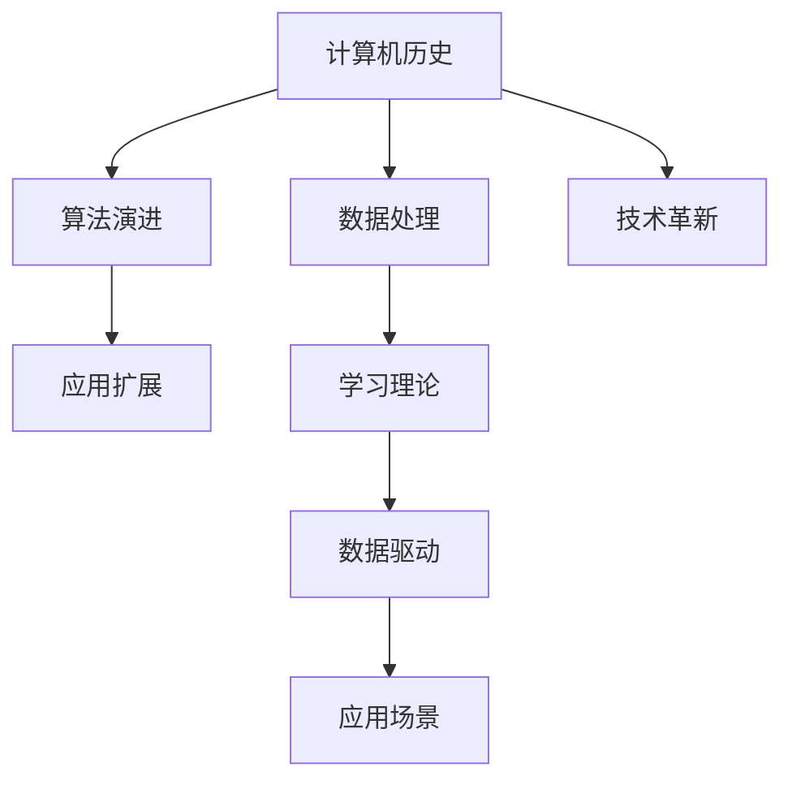

                 

# AI与计算机历史的对比分析

> 关键词：人工智能, 计算机历史, 算法, 数据, 学习理论, 应用场景, 未来发展

## 1. 背景介绍

### 1.1 计算机历史概述

计算机历史可以追溯到20世纪初的机械计算器，到1940年代的第一台电子计算机。从那以后，计算机的计算能力和应用范围发生了巨大的变化。电子计算机的出现，使得数据处理和模拟复杂系统成为可能，为各种新兴领域的产生和发展提供了基础。

### 1.2 AI的发展历程

人工智能(AI)一词首次出现于1956年的达特茅斯会议上，标志着AI正式成为一个独立的学科领域。早期AI的研究主要集中于知识表示和推理，后来逐渐扩展到机器学习、自然语言处理、计算机视觉、机器人学等方向。现代AI的核心思想是通过算法和数据实现机器的智能行为，其中机器学习是AI的核心部分。

## 2. 核心概念与联系

### 2.1 核心概念概述

- 计算机历史：从早期的机械计算到现代的电子计算机，计算机的历史是一段技术演进和应用扩展的历程。
- AI：一种模拟人类智能行为的学科领域，核心思想是通过算法和数据实现机器的智能。
- 算法：解决问题的具体步骤和规则，是AI和计算机历史共有的重要组成部分。
- 数据：AI依赖大量数据进行训练，而计算机历史中，数据也是推动技术进步的关键因素。
- 学习理论：AI中机器学习理论的基础，而计算机历史中数据处理和模型建立都基于学习理论。
- 应用场景：AI广泛应用于各种场景，而计算机历史中技术的应用也从最初的数据处理逐步扩展到今天的大数据、云计算、物联网、智能制造等多个领域。

### 2.2 核心概念原理和架构的 Mermaid 流程图



### 2.3 核心概念之间的联系

AI和计算机历史之间有着紧密的联系，主要体现在以下几个方面：

- 技术基础：早期的计算机历史为AI提供了技术基础。计算机硬件的发展，如CPU、GPU等，为AI算法的实现提供了硬件支持。
- 数据驱动：计算机历史中的数据处理和分析为AI的数据驱动型算法提供了范例。
- 学习理论：计算机历史中的学习理论，如梯度下降算法等，被广泛应用于AI中的机器学习算法中。
- 应用拓展：计算机历史中的技术应用拓展了AI的应用场景。AI技术被应用于金融、医疗、教育等众多领域。

## 3. 核心算法原理 & 具体操作步骤

### 3.1 算法原理概述

AI算法分为监督学习、无监督学习和强化学习等几大类。其中，监督学习是指在已知输入和输出之间存在对应关系的情况下，通过训练数据使模型学习输入到输出的映射关系。无监督学习则是模型在没有明确标签的情况下，通过寻找数据中的模式和结构进行学习。强化学习则是通过奖励机制，使模型在交互中不断改进策略，以达到最优决策。

计算机历史中，数据处理和算法演进同样是核心的内容。早期的计算机历史中，数据处理的重点是计算和存储，算法则以逻辑门和布尔运算为主。现代计算机历史中，数据处理逐渐向大数据和深度学习方向发展，算法则更加复杂多样。

### 3.2 算法步骤详解

AI算法的步骤包括：

- 数据收集与预处理：收集有标注的数据，进行数据清洗和标准化。
- 模型构建：选择合适的模型结构，如神经网络、决策树、支持向量机等。
- 模型训练：通过训练数据对模型进行优化，最小化损失函数。
- 模型评估：在验证集上评估模型性能，如准确率、召回率、F1值等。
- 模型应用：在测试集上测试模型性能，并应用于实际问题中。

计算机历史中的算法步骤包括：

- 硬件选择与设计：根据应用需求选择合适的硬件，并进行设计。
- 电路设计：通过电路设计和逻辑门设计实现计算功能。
- 程序开发：使用汇编语言或高级语言进行程序开发。
- 调试与优化：通过调试和优化程序，提高计算效率和准确性。
- 应用实现：将程序集成到实际应用中，实现计算功能。

### 3.3 算法优缺点

AI算法的主要优点包括：

- 高效性：通过算法自动化处理大量数据，效率高。
- 适应性强：能够适应各种复杂的问题，泛化能力强。
- 可扩展性：模型结构可扩展，算法可以用于各种应用场景。

AI算法的主要缺点包括：

- 数据依赖：需要大量的标注数据进行训练，数据收集成本高。
- 模型复杂性：复杂的模型需要大量的计算资源进行训练和优化。
- 数据隐私问题：大量数据收集和使用过程中，涉及数据隐私和安全问题。

计算机历史中的算法优缺点包括：

- 高效性：早期的计算速度快，但计算能力有限。
- 可扩展性：早期的硬件可扩展性差，需要大量物理空间。
- 成本高：早期计算机成本高昂，仅限于高端应用。

### 3.4 算法应用领域

AI算法广泛应用于各种领域，包括自然语言处理、图像识别、语音识别、推荐系统等。计算机历史中的算法应用则涵盖了计算、通信、控制、计算机辅助设计等方向。

## 4. 数学模型和公式 & 详细讲解 & 举例说明

### 4.1 数学模型构建

AI中的数学模型主要涉及概率模型和统计模型。概率模型包括高斯分布、泊松分布等，用于描述数据分布。统计模型包括回归模型、分类模型等，用于描述数据和输出之间的关系。

计算机历史中的数学模型主要涉及逻辑门、布尔运算、加减乘除等基础运算模型，以及控制流模型、数据存储模型等。

### 4.2 公式推导过程

以线性回归模型为例，假设输入为$x$，输出为$y$，模型为$y = \theta_0 + \theta_1 x$，其中$\theta_0, \theta_1$为模型参数。

根据最小二乘法，求解模型参数的公式为：

$$
\theta = (X^T X)^{-1} X^T y
$$

其中$X$为输入矩阵，$y$为输出向量。

### 4.3 案例分析与讲解

以自然语言处理(NLP)为例，NLP中的文本分类任务可以通过逻辑回归模型实现。给定一组文本和对应的分类标签，模型通过学习文本特征和标签之间的映射关系，实现文本分类。在NLP中，常用的特征提取方法包括词袋模型、TF-IDF、Word2Vec等。

## 5. 项目实践：代码实例和详细解释说明

### 5.1 开发环境搭建

开发环境搭建需要考虑以下几个方面：

- 操作系统：选择Windows、Linux或Mac OS等操作系统。
- 编程语言：选择Python、Java、C++等语言。
- 开发工具：选择IDE（如PyCharm、Visual Studio、Xcode等）。
- 数据集：选择公开数据集，如MNIST、CIFAR-10、IMDB等。

### 5.2 源代码详细实现

以Python为例，下面是一个简单的线性回归模型的代码实现：

```python
import numpy as np

def linear_regression(X, y):
    theta = np.linalg.inv(X.T @ X) @ X.T @ y
    return theta

X = np.array([[1, 2], [2, 3], [3, 4]])
y = np.array([2, 3, 4])
theta = linear_regression(X, y)
print(theta)
```

### 5.3 代码解读与分析

该代码实现了一个简单的线性回归模型，使用最小二乘法求解模型参数。其中，$X$为输入矩阵，$y$为输出向量，$\theta$为模型参数。

## 6. 实际应用场景

### 6.1 计算机在各个领域的实际应用

计算机的实际应用场景包括：

- 数据处理：如数据库管理、数据挖掘、数据可视化等。
- 科学计算：如数值模拟、金融计算、气象预测等。
- 人工智能：如机器学习、自然语言处理、计算机视觉等。
- 工业控制：如工业自动化、机器人控制、智能制造等。
- 医疗健康：如电子病历、医学影像、基因组学等。

### 6.2 AI在各个领域的实际应用

AI的实际应用场景包括：

- 智能交通：如自动驾驶、智能交通管理、交通预测等。
- 智能医疗：如医学影像分析、健康管理、医疗决策支持等。
- 智能制造：如工业机器人、智能质检、供应链优化等。
- 智能客服：如聊天机器人、语音助手、情感分析等。
- 智能推荐：如个性化推荐、广告投放、内容推荐等。

### 6.3 未来应用展望

未来，AI和计算机技术的融合将更加紧密。计算机硬件的发展将为AI提供更强大的计算能力，而AI算法的发展将为计算机提供更智能的应用场景。同时，AI技术的普及将推动各行业的数字化转型，带来更多的创新应用。

## 7. 工具和资源推荐

### 7.1 学习资源推荐

1. 《人工智能导论》：清华大学出版社，作者周志华。
2. 《计算机体系结构》：机械工业出版社，作者唐泽等。
3. 《深度学习》：人民邮电出版社，作者Ian Goodfellow等。
4. 《机器学习》：清华大学出版社，作者周志华。
5. 《数据科学与机器学习实战》：机械工业出版社，作者张清宇等。

### 7.2 开发工具推荐

1. PyCharm：一款流行的Python开发工具。
2. Visual Studio：一款流行的Windows开发工具。
3. Xcode：一款流行的Mac OS开发工具。
4. TensorFlow：谷歌开发的深度学习框架。
5. PyTorch：Facebook开发的深度学习框架。

### 7.3 相关论文推荐

1. 《神经网络的理论基础》：作者Geoffrey Hinton等。
2. 《深度学习：概念与应用》：作者Ian Goodfellow等。
3. 《计算机体系结构：量化研究》：作者David A. Patterson等。
4. 《人工智能与人类未来》：作者Ray Kurzweil。
5. 《机器学习：理论与算法》：作者Tom Mitchell。

## 8. 总结：未来发展趋势与挑战

### 8.1 研究成果总结

AI和计算机历史在算法、数据、学习理论等方面有诸多共同之处。AI算法的发展离不开计算机硬件的支持，而计算机技术的发展同样离不开AI算法的驱动。

### 8.2 未来发展趋势

未来，AI和计算机技术的发展趋势将更加紧密。计算机硬件的演进将为AI提供更强大的计算能力，AI算法的发展将为计算机提供更智能的应用场景。同时，AI技术的普及将推动各行业的数字化转型，带来更多的创新应用。

### 8.3 面临的挑战

未来发展面临的挑战包括：

- 数据隐私问题：大量数据收集和使用过程中，涉及数据隐私和安全问题。
- 计算资源限制：复杂的AI模型需要大量的计算资源进行训练和优化。
- 算法透明性问题：AI算法的决策过程缺乏透明性，难以解释其内部工作机制和决策逻辑。

### 8.4 研究展望

未来，需要进一步研究如何提高AI算法的透明性和可解释性，保护数据隐私，优化计算资源使用，推动AI技术的可持续发展。

## 9. 附录：常见问题与解答

**Q1: 计算机历史和AI的关系是什么？**

A: 计算机历史为AI提供了技术基础，早期的计算机历史为AI的算法演进和应用拓展提供了基础。

**Q2: AI算法的优缺点是什么？**

A: AI算法的主要优点包括高效性、适应性强、可扩展性强。缺点包括数据依赖、模型复杂、数据隐私问题。

**Q3: 未来AI和计算机技术的融合将如何发展？**

A: 未来AI和计算机技术的融合将更加紧密，计算机硬件的发展将为AI提供更强大的计算能力，AI算法的发展将为计算机提供更智能的应用场景。

---

作者：禅与计算机程序设计艺术 / Zen and the Art of Computer Programming

