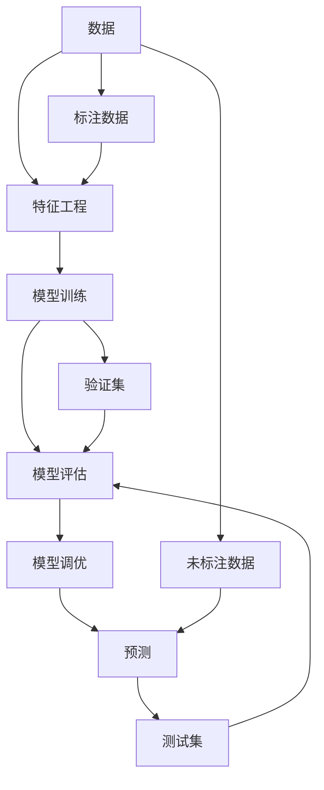

                 

# AI人工智能 Agent：使用监督学习进行预测

> 关键词：人工智能,监督学习,预测,模型训练,特征工程,深度学习,模型评估,模型调优

## 1. 背景介绍

在当今信息爆炸的时代，人工智能(AI)正在迅速渗透到各行各业，为人类社会带来了巨大的变革。从自动驾驶、智能客服到智能制造，AI在各个领域的成功应用都离不开一个关键技术：监督学习(Supervised Learning)。

监督学习是指利用已有标注数据训练模型，使其能够对新的、未标注数据进行预测的技术。在AI领域，监督学习尤为重要，因为它可以使得机器在经过一定的训练后，具备对未知数据的预测能力，从而实现从数据中学习规律，进行智能决策。

本文将深入探讨监督学习在AI预测中的运用，帮助读者理解如何设计、训练、评估和优化监督学习模型，以实现高效的预测任务。我们还将详细介绍监督学习在实际应用中的具体案例，探讨其在未来发展的趋势和面临的挑战。

## 2. 核心概念与联系

### 2.1 核心概念概述

为更好地理解监督学习在AI预测中的应用，本节将介绍几个关键概念：

- 监督学习(Supervised Learning)：利用标注数据训练模型，使其能够对未知数据进行预测。监督学习模型在训练过程中，会根据真实标签和模型预测结果之间的差异进行调整，以最小化预测误差。

- 预测(Prediction)：监督学习模型的核心目标，即通过对已知样本的训练，学习样本特征与目标标签之间的映射关系，从而对新的、未标注样本进行预测。

- 模型训练(Model Training)：通过反复迭代训练数据，调整模型参数，使得模型能够更好地预测目标变量。

- 特征工程(Feature Engineering)：在数据预处理阶段，对原始数据进行加工，提取更有用的特征，以提高模型的预测性能。

- 模型评估(Model Evaluation)：通过验证集和测试集对训练好的模型进行评估，判断其预测效果是否达到预期。

- 模型调优(Model Tuning)：在模型评估后，通过调整模型结构、参数和学习率等，进一步优化模型性能，以获得更高的预测准确率。

- 集成学习(Ensemble Learning)：通过结合多个模型的预测结果，提高模型的泛化能力和预测精度。

这些核心概念共同构成了监督学习模型在AI预测中的基本框架，理解它们之间的关系，有助于更好地应用监督学习进行预测任务。

### 2.2 核心概念原理和架构的 Mermaid 流程图



以上流程图展示了监督学习在AI预测中的主要流程：从数据预处理，到模型训练，再到模型评估和调优，最终完成预测。标注数据作为训练样本，未标注数据作为测试样本，模型通过反复迭代训练数据，逐步提升预测能力，最终输出预测结果。

## 3. 核心算法原理 & 具体操作步骤

### 3.1 算法原理概述

监督学习预测的核心原理是通过训练集中的标注数据，学习模型参数，使得模型能够对未标注数据进行准确预测。其数学基础是统计学习理论，通过最大化目标函数（通常是损失函数）来优化模型参数，使预测值尽可能接近真实标签。

常见的监督学习算法包括线性回归、逻辑回归、决策树、随机森林、神经网络等。这些算法虽然形式不同，但都可以概括为：

1. 数据预处理：对原始数据进行清洗、归一化、特征提取等处理，提取有意义的特征。
2. 模型训练：通过训练数据集，学习模型参数，使得模型能够拟合训练数据。
3. 模型评估：通过验证集对模型进行评估，判断其预测效果是否达到预期。
4. 模型调优：根据模型评估结果，调整模型参数和学习率，进一步提升模型性能。
5. 预测：利用训练好的模型对未标注数据进行预测。

### 3.2 算法步骤详解

以神经网络为例，下面详细介绍其预测步骤：

**Step 1: 数据预处理**

- 数据清洗：去除缺失值、异常值等无用数据，保证数据质量。
- 特征提取：通过统计、变换等方法，提取有意义的特征。
- 数据标准化：对特征进行归一化或标准化处理，避免特征值数量级不同影响训练效果。

**Step 2: 模型训练**

- 选择合适的神经网络结构：如全连接网络、卷积神经网络（CNN）、循环神经网络（RNN）等。
- 设定损失函数：如均方误差（MSE）、交叉熵损失（Cross-Entropy Loss）等，用于衡量预测值与真实标签之间的差异。
- 设置优化器：如随机梯度下降（SGD）、Adam、Adagrad等，用于更新模型参数。
- 设定学习率：学习率决定每次参数更新的幅度，需要根据模型和数据特点进行调整。

**Step 3: 模型评估**

- 划分训练集、验证集和测试集：通常将数据集分为70%-80%训练集，15%-20%验证集，5%-10%测试集。
- 在验证集上进行评估：利用验证集评估模型的预测性能，如准确率、召回率、F1值等指标。
- 调整模型参数：根据验证集评估结果，调整模型结构或参数，如增加或减少神经元个数、调整学习率等。

**Step 4: 模型调优**

- 超参数调优：调整模型超参数，如批量大小、迭代次数、正则化系数等，以提升模型性能。
- 集成学习：将多个模型的预测结果进行组合，如投票、加权平均等，提高预测准确率。
- 模型融合：将多个模型的输出进行融合，如使用Stacking等方法，进一步提升模型性能。

**Step 5: 预测**

- 利用训练好的模型对新数据进行预测：将新数据输入模型，输出预测结果。

### 3.3 算法优缺点

监督学习预测的优点包括：

1. 可解释性高：监督学习模型一般具有较好的可解释性，能够通过特征重要度、权重系数等手段理解模型决策过程。
2. 适用广泛：监督学习模型适用于各种类型的预测任务，如分类、回归、序列预测等。
3. 训练效率高：监督学习模型通常采用随机梯度下降等高效的优化算法，训练效率高。

然而，监督学习预测也存在一些缺点：

1. 依赖标注数据：监督学习模型的训练需要大量的标注数据，获取高质量标注数据的成本较高。
2. 数据分布偏差：如果训练数据和测试数据分布差异较大，模型泛化能力可能受到限制。
3. 过拟合风险：如果模型过于复杂，或者训练数据不足，可能导致模型过拟合，预测效果不佳。

### 3.4 算法应用领域

监督学习预测在各个领域都有广泛应用，以下是几个典型案例：

- 金融预测：利用历史交易数据，对股票价格、汇率等进行预测。
- 医疗预测：利用患者病历数据，预测疾病发展趋势、治疗效果等。
- 智能推荐：利用用户行为数据，预测用户兴趣、推荐商品等。
- 图像识别：利用标注数据集，训练图像识别模型，识别物体、场景等。
- 自然语言处理：利用文本标注数据，训练语言模型，进行情感分析、文本分类等。

## 4. 数学模型和公式 & 详细讲解 & 举例说明

### 4.1 数学模型构建

监督学习预测的数学模型通常可以表示为：

$$ y = f(x; \theta) $$

其中 $y$ 为预测结果，$x$ 为输入特征，$f(\cdot)$ 为模型函数，$\theta$ 为模型参数。

以线性回归为例，模型函数可以表示为：

$$ y = \theta_0 + \theta_1 x_1 + \theta_2 x_2 + \cdots + \theta_n x_n $$

其中 $\theta_0, \theta_1, \theta_2, \cdots, \theta_n$ 为模型参数，$x_1, x_2, \cdots, x_n$ 为输入特征。

### 4.2 公式推导过程

以线性回归为例，推导损失函数及梯度公式：

**损失函数**：

$$ L = \frac{1}{2m} \sum_{i=1}^m (y_i - (\theta_0 + \theta_1 x_{i1} + \theta_2 x_{i2} + \cdots + \theta_n x_{in}))^2 $$

其中 $m$ 为样本数量，$(y_i, x_{i1}, x_{i2}, \cdots, x_{in})$ 为第 $i$ 个样本的标签和特征向量。

**梯度公式**：

$$ \frac{\partial L}{\partial \theta_j} = \frac{1}{m} \sum_{i=1}^m (y_i - (\theta_0 + \theta_1 x_{i1} + \theta_2 x_{i2} + \cdots + \theta_n x_{in})) x_{ij} $$

其中 $j$ 为特征维度，$x_{ij}$ 为第 $i$ 个样本的第 $j$ 个特征。

### 4.3 案例分析与讲解

**案例一：房价预测**

假设我们要预测一个小区的房价，已知数据集包含房屋面积、地理位置、房屋类型等信息，以及房价标签。我们可以通过数据预处理、模型训练、模型评估等步骤，建立线性回归模型进行房价预测。

**步骤一：数据预处理**

- 清洗数据：去除缺失值、异常值。
- 特征提取：提取房屋面积、地理位置、房屋类型等特征。
- 数据标准化：对特征进行标准化处理，避免数据分布差异影响训练效果。

**步骤二：模型训练**

- 设定损失函数：均方误差（MSE）。
- 设置优化器：随机梯度下降（SGD）。
- 设定学习率：0.01。
- 训练模型：使用训练数据集进行模型训练，迭代多次更新模型参数。

**步骤三：模型评估**

- 划分验证集：将数据集划分为训练集和验证集。
- 评估模型：在验证集上计算预测结果与真实标签之间的MSE，判断模型性能。
- 调整参数：根据验证集评估结果，调整学习率、正则化系数等超参数。

**步骤四：模型调优**

- 超参数调优：调整学习率、正则化系数等超参数，进一步提升模型性能。
- 集成学习：将多个模型的预测结果进行组合，提高预测准确率。

**步骤五：预测**

- 利用训练好的模型对新数据进行预测：将新数据输入模型，输出预测房价。

## 5. 项目实践：代码实例和详细解释说明

### 5.1 开发环境搭建

在进行监督学习预测实践前，我们需要准备好开发环境。以下是使用Python进行TensorFlow开发的环境配置流程：

1. 安装Anaconda：从官网下载并安装Anaconda，用于创建独立的Python环境。

2. 创建并激活虚拟环境：
```bash
conda create -n tf-env python=3.8 
conda activate tf-env
```

3. 安装TensorFlow：根据CUDA版本，从官网获取对应的安装命令。例如：
```bash
conda install tensorflow -c conda-forge
```

4. 安装Scikit-learn：
```bash
pip install scikit-learn
```

5. 安装各类工具包：
```bash
pip install numpy pandas matplotlib seaborn
```

完成上述步骤后，即可在`tf-env`环境中开始监督学习预测实践。

### 5.2 源代码详细实现

这里我们以房价预测为例，给出使用TensorFlow进行监督学习的代码实现。

首先，定义数据预处理函数：

```python
import pandas as pd
import numpy as np
from sklearn.model_selection import train_test_split
from sklearn.preprocessing import StandardScaler

def load_data(file_path):
    data = pd.read_csv(file_path)
    data = data.dropna()
    data = data.drop(columns=['id'])
    X = data.drop(columns=['price'])
    y = data['price']
    X_train, X_val, y_train, y_val = train_test_split(X, y, test_size=0.2, random_state=42)
    X_train = StandardScaler().fit_transform(X_train)
    X_val = StandardScaler().fit_transform(X_val)
    return X_train, y_train, X_val, y_val

X_train, y_train, X_val, y_val = load_data('data.csv')
```

然后，定义模型结构：

```python
import tensorflow as tf
from tensorflow.keras import layers

def build_model(input_dim, output_dim):
    model = tf.keras.Sequential([
        layers.Dense(64, activation='relu', input_shape=(input_dim,)),
        layers.Dense(64, activation='relu'),
        layers.Dense(output_dim, activation='linear')
    ])
    return model

input_dim = X_train.shape[1]
output_dim = 1
model = build_model(input_dim, output_dim)
```

接着，定义模型训练函数：

```python
def train_model(model, X_train, y_train, X_val, y_val, epochs=100, batch_size=32):
    model.compile(loss='mse', optimizer='adam', metrics=['mse'])
    history = model.fit(X_train, y_train, epochs=epochs, batch_size=batch_size, validation_data=(X_val, y_val))
    return model, history

model, history = train_model(model, X_train, y_train, X_val, y_val, epochs=100, batch_size=32)
```

最后，进行模型评估和预测：

```python
def evaluate_model(model, X_val, y_val):
    mse = model.evaluate(X_val, y_val, verbose=0)
    print(f'Mean Squared Error on validation set: {mse:.4f}')

evaluate_model(model, X_val, y_val)
```

```python
def predict房价(model, X_test):
    X_test = StandardScaler().fit_transform(X_test)
    y_pred = model.predict(X_test)
    y_pred = np.squeeze(y_pred)
    return y_pred

X_test = np.loadtxt('test.csv', delimiter=',').T
y_pred = predict房价(model, X_test)
```

以上就是使用TensorFlow进行监督学习预测的完整代码实现。可以看到，借助TensorFlow的高效API，可以轻松搭建和训练模型，实现监督学习预测。

### 5.3 代码解读与分析

让我们再详细解读一下关键代码的实现细节：

**load_data函数**：
- 读取数据集
- 清洗数据：去除缺失值、异常值
- 提取特征：将数据分为输入特征和标签
- 数据标准化：对特征进行标准化处理
- 划分数据集：划分训练集、验证集和测试集

**build_model函数**：
- 定义模型结构：使用全连接网络
- 定义激活函数：ReLU激活函数

**train_model函数**：
- 定义损失函数：均方误差（MSE）
- 定义优化器：Adam优化器
- 定义评价指标：均方误差（MSE）
- 训练模型：使用训练数据集进行模型训练，验证集评估模型性能
- 返回训练结果：模型和训练历史

**evaluate_model函数**：
- 评估模型：在验证集上计算均方误差（MSE）

**predict房价函数**：
- 对测试数据进行标准化处理
- 利用训练好的模型进行预测
- 返回预测结果

可以看到，以上代码实现了从数据预处理、模型训练、模型评估到预测的完整流程，可以帮助读者系统掌握监督学习预测的核心实现。

## 6. 实际应用场景

### 6.1 金融预测

在金融领域，利用监督学习预测市场趋势、股票价格等具有重要意义。通过收集历史交易数据，建立金融预测模型，可以帮助投资者制定更好的投资策略，规避风险。

**案例一：股票价格预测**

假设我们要预测某只股票的价格，已知数据集包含历史股价、成交量、财务报表等信息，以及股价标签。我们可以通过数据预处理、模型训练、模型评估等步骤，建立线性回归模型进行股票价格预测。

**步骤一：数据预处理**

- 清洗数据：去除缺失值、异常值。
- 特征提取：提取股价、成交量、财务报表等特征。
- 数据标准化：对特征进行标准化处理，避免数据分布差异影响训练效果。

**步骤二：模型训练**

- 设定损失函数：均方误差（MSE）。
- 设置优化器：随机梯度下降（SGD）。
- 设定学习率：0.01。
- 训练模型：使用训练数据集进行模型训练，迭代多次更新模型参数。

**步骤三：模型评估**

- 划分验证集：将数据集划分为训练集和验证集。
- 评估模型：在验证集上计算预测结果与真实标签之间的MSE，判断模型性能。
- 调整参数：根据验证集评估结果，调整学习率、正则化系数等超参数。

**步骤四：模型调优**

- 超参数调优：调整学习率、正则化系数等超参数，进一步提升模型性能。
- 集成学习：将多个模型的预测结果进行组合，提高预测准确率。

**步骤五：预测**

- 利用训练好的模型对新数据进行预测：将新数据输入模型，输出预测股价。

### 6.2 医疗预测

在医疗领域，利用监督学习预测疾病发展趋势、治疗效果等具有重要意义。通过收集患者病历数据，建立医疗预测模型，可以帮助医生制定更好的诊疗方案，提升医疗水平。

**案例二：疾病预测**

假设我们要预测某位患者的某种疾病是否发作，已知数据集包含患者的生理指标、生活习惯、家族病史等信息，以及疾病标签。我们可以通过数据预处理、模型训练、模型评估等步骤，建立逻辑回归模型进行疾病预测。

**步骤一：数据预处理**

- 清洗数据：去除缺失值、异常值。
- 特征提取：提取生理指标、生活习惯、家族病史等特征。
- 数据标准化：对特征进行标准化处理，避免数据分布差异影响训练效果。

**步骤二：模型训练**

- 设定损失函数：交叉熵损失（Cross-Entropy Loss）。
- 设置优化器：随机梯度下降（SGD）。
- 设定学习率：0.01。
- 训练模型：使用训练数据集进行模型训练，迭代多次更新模型参数。

**步骤三：模型评估**

- 划分验证集：将数据集划分为训练集和验证集。
- 评估模型：在验证集上计算预测结果与真实标签之间的交叉熵损失，判断模型性能。
- 调整参数：根据验证集评估结果，调整学习率、正则化系数等超参数。

**步骤四：模型调优**

- 超参数调优：调整学习率、正则化系数等超参数，进一步提升模型性能。
- 集成学习：将多个模型的预测结果进行组合，提高预测准确率。

**步骤五：预测**

- 利用训练好的模型对新数据进行预测：将新数据输入模型，输出预测疾病是否发作。

## 7. 工具和资源推荐

### 7.1 学习资源推荐

为了帮助开发者系统掌握监督学习预测的理论基础和实践技巧，这里推荐一些优质的学习资源：

1. 《机器学习》（周志华）：经典教材，系统介绍了机器学习的基本概念和算法。
2. Coursera《机器学习》课程：由斯坦福大学教授Andrew Ng主讲，涵盖机器学习的基本概念和算法，适合初学者和进阶学习者。
3. Udacity《深度学习》课程：涵盖深度学习的基本概念和算法，适合有编程基础的学习者。
4. Kaggle竞赛：参加Kaggle竞赛，实战练习监督学习预测模型，提升实践能力。

通过对这些资源的学习实践，相信你一定能够快速掌握监督学习预测的精髓，并用于解决实际的预测问题。

### 7.2 开发工具推荐

高效的开发离不开优秀的工具支持。以下是几款用于监督学习预测开发的常用工具：

1. TensorFlow：由Google主导开发的深度学习框架，功能强大，适合大规模工程应用。
2. Scikit-learn：基于Python的机器学习库，提供了丰富的监督学习算法和数据预处理工具。
3. PyTorch：由Facebook开发的深度学习框架，灵活高效，适合快速迭代研究。
4. Jupyter Notebook：免费的交互式编程环境，支持多种语言和库，适合数据科学和机器学习开发。
5. Weights & Biases：模型训练的实验跟踪工具，可以记录和可视化模型训练过程中的各项指标，方便对比和调优。
6. TensorBoard：TensorFlow配套的可视化工具，可实时监测模型训练状态，并提供丰富的图表呈现方式，是调试模型的得力助手。

合理利用这些工具，可以显著提升监督学习预测的开发效率，加快创新迭代的步伐。

### 7.3 相关论文推荐

监督学习预测的发展离不开学界的持续研究。以下是几篇奠基性的相关论文，推荐阅读：

1. 《监督学习》（Tom Mitchell）：经典教材，系统介绍了监督学习的理论基础和算法。
2. 《深度学习》（Ian Goodfellow、Yoshua Bengio、Aaron Courville）：系统介绍了深度学习的理论基础和算法，包含监督学习预测的内容。
3. 《集成学习》（Gareth James、 Daniela Witten、Trevor Hastie、Robert Tibshirani）：系统介绍了集成学习的理论基础和算法。
4. 《神经网络与深度学习》（Michael Nielsen）：介绍了神经网络的基本概念和算法，适合初学者学习。
5. 《机器学习实战》（Peter Harrington）：通过实际案例，介绍了机器学习的基本概念和算法，适合实践学习。

这些论文代表了大模型微调技术的发展脉络。通过学习这些前沿成果，可以帮助研究者把握学科前进方向，激发更多的创新灵感。

## 8. 总结：未来发展趋势与挑战

### 8.1 总结

本文对监督学习在AI预测中的应用进行了全面系统的介绍。首先阐述了监督学习的基本概念和原理，明确了其在使用中的核心流程和步骤。其次，通过几个典型案例，展示了监督学习在实际应用中的广泛应用。最后，探讨了监督学习预测在金融、医疗等领域的具体实现。

通过本文的系统梳理，可以看到，监督学习预测在各个领域都有广泛应用，具有重要的实际价值。未来，伴随模型的不断优化和算法的多样化，监督学习预测将进一步提升预测精度和应用范围，为各行业带来新的变革。

### 8.2 未来发展趋势

展望未来，监督学习预测将呈现以下几个发展趋势：

1. 模型复杂度增加。随着深度学习的发展，越来越多的复杂模型如卷积神经网络（CNN）、循环神经网络（RNN）、深度信念网络（DBN）等被应用于预测任务。
2. 数据量增大。随着大数据技术的普及，越来越多的数据被收集和利用，数据量的增大将进一步提升预测模型的精度和泛化能力。
3. 多模态学习。未来的预测模型将不仅考虑单一模态（如文本、图像）的数据，而是将多模态数据进行融合，提升预测模型的综合性能。
4. 自动特征工程。未来的预测模型将自动进行特征选择和提取，不需要人工干预，提升模型的自动化程度。
5. 实时预测。未来的预测模型将具有实时预测能力，能够即时响应实时数据，提供更高效的预测服务。

这些趋势将使得监督学习预测在各个领域的应用更加广泛和深入，带来更多的创新和变革。

### 8.3 面临的挑战

尽管监督学习预测已经取得了瞩目成就，但在迈向更加智能化、普适化应用的过程中，它仍面临诸多挑战：

1. 数据质量问题。数据标注和数据清洗是一个耗时耗力的过程，数据的准确性和完整性直接影响预测模型的性能。
2. 模型复杂度。复杂模型需要更多的计算资源和时间，对硬件和软件环境的要求较高。
3. 过拟合风险。当模型过于复杂，或者训练数据不足时，可能导致模型过拟合，预测效果不佳。
4. 可解释性不足。大多数预测模型难以解释其内部工作机制和决策逻辑，对于需要透明度的领域（如医疗、金融），模型的可解释性尤为重要。
5. 模型安全问题。预测模型可能被恶意利用，导致误导性输出，影响用户体验和决策。

### 8.4 研究展望

面对监督学习预测所面临的挑战，未来的研究需要在以下几个方面寻求新的突破：

1. 数据质量提升。研究如何高效、准确地标注和清洗数据，提升数据的可利用性。
2. 模型简化。研究如何简化复杂模型，提高模型训练和推理的效率。
3. 可解释性提升。研究如何增强模型的可解释性，提供透明的决策逻辑。
4. 模型安全保护。研究如何保护模型免受恶意攻击，确保模型的安全性。
5. 多模态学习。研究如何有效地融合多模态数据，提升预测模型的综合性能。

这些研究方向将使得监督学习预测在各个领域的应用更加全面和深入，带来更多的创新和变革。相信通过不断的研究和实践，监督学习预测将更加智能、可靠、可解释、可控，为各行业带来新的价值。

## 9. 附录：常见问题与解答

**Q1：监督学习预测是否适用于所有数据类型？**

A: 监督学习预测适用于各种类型的数据，包括数值型数据、文本型数据、图像型数据等。不同类型的数据需要采用不同的预处理方法，如数值型数据需要标准化处理，文本型数据需要进行分词、向量化等处理，图像型数据需要进行特征提取等。

**Q2：监督学习预测需要多少数据？**

A: 监督学习预测需要足够数量的标注数据，一般建议标注数据量至少为样本总数的一半。数据量太少容易导致过拟合，影响模型泛化能力。

**Q3：如何选择合适的超参数？**

A: 超参数的选择需要根据具体任务和数据特点进行调整。一般建议采用网格搜索或随机搜索的方式，尝试不同的超参数组合，选择性能最优的模型。

**Q4：模型训练过程中的注意事项？**

A: 在模型训练过程中，需要注意以下事项：
1. 学习率的设置：学习率过大会导致模型震荡，过小会导致训练速度慢。一般建议采用学习率衰减策略。
2. 正则化技术：如L2正则、Dropout等，可以有效防止过拟合。
3. 训练过程中的监控：实时监控模型训练状态，及时发现和解决异常情况。

**Q5：模型评估过程中需要注意哪些问题？**

A: 在模型评估过程中，需要注意以下问题：
1. 数据集的划分：划分训练集、验证集和测试集，验证集用于模型评估，测试集用于模型泛化性能评估。
2. 评估指标的选择：选择合适的评估指标，如准确率、召回率、F1值等。
3. 模型调优：根据评估结果，调整模型参数和超参数，进一步提升模型性能。

---

作者：禅与计算机程序设计艺术 / Zen and the Art of Computer Programming

