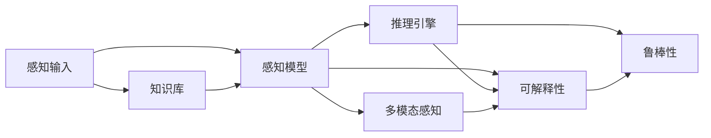

                 

## 1. 背景介绍

### 1.1 问题由来

在人工智能（AI）研究中，智能体（Agent）的感知机制是理解其行为、决策与环境交互的基础。智能体通过感知模块获取环境信息，结合内部知识库和推理引擎，形成智能决策。这一过程不仅是AI领域中的核心问题，也是连接认知科学与技术应用的桥梁。

智能体的感知机制通常涉及以下几个关键要素：

- **感知输入**：智能体接收到的环境信息，如视觉、听觉、文本等感官数据。
- **感知模型**：对感知输入进行编码和处理的算法和模型，如卷积神经网络（CNN）、递归神经网络（RNN）、Transformer等。
- **知识库**：智能体存储和利用的先验知识，如规则、事实、数据等。
- **推理引擎**：基于知识库进行逻辑推理和决策计算的算法，如概率图模型、逻辑推理机等。

随着深度学习技术的进步，智能体感知机制的研究和应用得以深入。深度感知模型通过多层次的特征提取和表示学习，已经能够在处理复杂感知任务上超越传统算法，成为智能体设计的关键组件。

### 1.2 问题核心关键点

智能体感知机制的研究涉及多个关键点：

1. **数据驱动与知识驱动**：如何在依赖数据和引入知识间找到平衡，使得智能体能够高效学习并广泛适应各种任务。
2. **多模态感知**：如何整合视觉、听觉、文本等多种感知输入，实现对环境的全方位理解。
3. **感知数据增强**：如何通过数据增强技术提升感知模型的泛化能力和鲁棒性。
4. **可解释性与透明性**：如何在保证模型性能的同时，提高感知过程的可解释性和透明度。
5. **感知与推理的协同**：如何将感知与推理紧密结合，使得智能体能够灵活应用内部知识库，进行智能决策。
6. **鲁棒性与安全性**：如何设计鲁棒性强的感知机制，确保智能体在面对噪声、攻击等不利环境时仍能稳定运行。

这些问题相互交织，构成了智能体感知机制研究的复杂图景，需要通过多学科的交叉合作和前沿技术的探索，方能解决。

### 1.3 问题研究意义

理解并优化智能体的感知机制，对于推动AI技术在各行业的应用具有重要意义：

1. **提高智能体的环境适应性**：通过精细化的感知机制设计，使智能体能够更加准确、全面地理解环境信息，适应各种复杂多变的环境。
2. **增强智能体的决策能力**：有效的感知与推理的结合，能够提升智能体的决策精度和速度，使其在实时应用中表现更优。
3. **促进人机交互的自然性**：合理的感知设计能够使智能体更好地与人类用户互动，提升用户体验和满意度。
4. **推动AI伦理与安全**：感知机制的透明性和鲁棒性设计，有助于增强AI系统的可解释性，避免偏见和滥用，提高系统的安全性。
5. **加速AI技术的产业化**：高效的感知机制能够降低AI系统的开发成本和部署难度，加速其在实际应用场景中的落地。

## 2. 核心概念与联系

### 2.1 核心概念概述

为了更好地理解智能体感知机制的核心概念，本节将介绍几个关键概念及其相互关系：

- **感知输入（Perceptual Input）**：智能体接收到的环境信息，如视觉图像、音频波形、文本数据等。
- **感知模型（Perceptual Model）**：用于对感知输入进行编码、处理和特征提取的深度学习模型，如卷积神经网络（CNN）、循环神经网络（RNN）、Transformer等。
- **知识库（Knowledge Base）**：智能体存储和利用的先验知识，如事实、规则、数据等。
- **推理引擎（Reasoning Engine）**：基于知识库进行逻辑推理和决策计算的算法和模型，如概率图模型、逻辑推理机等。
- **可解释性（Explainability）**：智能体感知机制的透明性和可理解性，有助于人类理解和信任AI系统。
- **鲁棒性（Robustness）**：感知机制在面对噪声、攻击等不利环境时，仍能稳定运行的能力。
- **多模态感知（Multimodal Perception）**：整合多种感知输入，如视觉、听觉、文本等，实现对环境的全方位理解。

这些概念之间的逻辑关系可以通过以下Mermaid流程图来展示：



这个流程图展示了几大核心概念及其相互关系：

1. **感知输入**是智能体获取环境信息的基础。
2. **感知模型**对感知输入进行编码和特征提取。
3. **知识库**提供先验知识，帮助智能体进行推理和决策。
4. **推理引擎**基于知识库进行逻辑推理和计算，形成智能决策。
5. **可解释性**和**鲁棒性**是智能体感知机制的重要属性，前者关注人类可理解性，后者关注模型稳定性。
6. **多模态感知**实现多种感知输入的整合，丰富智能体的环境理解能力。

这些概念共同构成了智能体感知机制的基本框架，使其能够在复杂多变的环境中高效运作。

## 3. 核心算法原理 & 具体操作步骤

### 3.1 算法原理概述

智能体的感知机制通过深度学习模型对感知输入进行编码和特征提取，结合知识库和推理引擎，形成智能决策。具体来说，感知机制的算法原理如下：

1. **感知输入的编码**：使用深度学习模型对感知输入进行编码，得到高维特征表示。
2. **特征融合**：将多种感知输入进行融合，得到统一的特征向量。
3. **知识库的检索与融合**：从知识库中检索相关知识，并与之进行融合，得到更为丰富的特征表示。
4. **推理计算**：基于融合后的特征向量，使用推理引擎进行逻辑推理和决策计算。

### 3.2 算法步骤详解

以下详细描述智能体感知机制的核心算法步骤：

**Step 1: 准备感知输入**

智能体接收环境信息，如视觉图像、音频波形、文本数据等，预处理并标准化这些输入数据，供后续处理使用。例如，对于图像数据，可以使用图像预处理技术，如归一化、裁剪、缩放等，将其转化为模型所需的输入格式。

**Step 2: 感知输入的编码**

使用深度学习模型对感知输入进行编码，得到高维特征表示。例如，可以使用卷积神经网络（CNN）对图像数据进行编码，使用循环神经网络（RNN）或Transformer对序列数据进行编码。

**Step 3: 特征融合**

将多种感知输入进行融合，得到统一的特征向量。例如，可以使用特征加权融合、注意力机制等方式，将视觉、听觉、文本等多种感知输入进行整合，得到一个综合的特征表示。

**Step 4: 知识库的检索与融合**

从知识库中检索相关知识，并与之进行融合，得到更为丰富的特征表示。例如，可以使用检索机制，如向量检索、模糊匹配等，从知识库中检索到相关的规则、事实、数据等，并与之进行融合，得到更为准确的特征表示。

**Step 5: 推理计算**

基于融合后的特征向量，使用推理引擎进行逻辑推理和决策计算。例如，可以使用概率图模型、逻辑推理机等算法，结合知识库中的规则和数据，进行推理计算，得出最终的智能决策。

### 3.3 算法优缺点

智能体感知机制的算法具有以下优点：

1. **高效性**：深度学习模型能够自动学习特征表示，无需手工设计特征，具有高效性。
2. **灵活性**：感知模型和知识库的灵活设计，使得智能体能够适应各种复杂的感知任务。
3. **鲁棒性**：通过多层次的特征融合和推理计算，智能体的感知机制具备较高的鲁棒性，能够处理噪声和干扰。

同时，该算法也存在一些缺点：

1. **数据依赖**：深度学习模型需要大量标注数据进行训练，标注数据的获取和处理成本较高。
2. **知识库的构建**：知识库的构建需要大量专家知识和数据，构建和维护成本较高。
3. **解释性不足**：深度学习模型往往是黑盒模型，难以解释其内部工作机制，导致可解释性不足。
4. **计算资源需求高**：深度学习模型的计算复杂度高，需要高性能计算资源。

尽管存在这些缺点，但就目前而言，智能体感知机制的算法仍是深度学习领域的热门研究方向，具有广泛的应用前景。

### 3.4 算法应用领域

智能体感知机制的算法广泛应用于多个领域，包括：

1. **计算机视觉**：用于图像识别、物体检测、图像分割等任务，通过感知输入的编码和特征提取，实现对视觉数据的理解。
2. **自然语言处理**：用于文本分类、情感分析、机器翻译等任务，通过感知输入的编码和特征提取，实现对文本数据的理解。
3. **语音识别与处理**：用于语音识别、情感识别、说话人识别等任务，通过感知输入的编码和特征提取，实现对音频数据的理解。
4. **多模态感知**：用于整合视觉、听觉、文本等多种感知输入，实现对环境的全面理解，如智能机器人、智能家居等应用。
5. **增强现实与虚拟现实**：用于环境感知、交互识别等任务，通过感知输入的编码和特征提取，实现对现实世界的增强和模拟。
6. **自动驾驶**：用于环境感知、目标检测等任务，通过感知输入的编码和特征提取，实现对车辆周围环境的理解和决策。

这些领域的应用表明，智能体感知机制的算法具有强大的通用性和可扩展性，能够适应各种复杂的感知任务。

## 4. 数学模型和公式 & 详细讲解

### 4.1 数学模型构建

为了更好地理解智能体感知机制的算法原理，本节将使用数学语言对感知机制进行严格刻画。

设智能体的感知输入为 $\mathbf{x} \in \mathbb{R}^D$，其中 $D$ 为输入维度。使用深度学习模型 $\mathbf{h} = f(\mathbf{x}, \theta)$ 对感知输入进行编码，其中 $\theta$ 为模型参数。

进一步，设知识库中的知识表示为 $\mathbf{k} \in \mathbb{R}^K$，其中 $K$ 为知识库维度。知识库的检索机制可以表示为 $\mathbf{f}(\mathbf{h}, \mathbf{k})$，其中 $\mathbf{f}(\cdot, \cdot)$ 为检索函数。

设推理引擎的推理函数为 $p(\cdot | \mathbf{h}, \mathbf{k})$，用于基于融合后的特征向量进行推理计算。最终，智能体的决策输出为 $y = \mathop{\arg\max}_{y \in \mathcal{Y}} p(y | \mathbf{h}, \mathbf{k})$，其中 $\mathcal{Y}$ 为决策空间。

### 4.2 公式推导过程

以下对智能体感知机制的数学模型进行详细推导。

1. **感知输入的编码**

设深度学习模型为 $\mathbf{h} = f(\mathbf{x}, \theta)$，其中 $f(\cdot, \cdot)$ 为模型函数，$\theta$ 为模型参数。例如，对于图像数据，可以使用卷积神经网络（CNN）进行编码：

$$
\mathbf{h} = \mathbf{W}_1 \mathbf{x} + \mathbf{b}_1
$$

其中 $\mathbf{W}_1$ 和 $\mathbf{b}_1$ 为卷积层的权重和偏置，$\mathbf{x}$ 为输入图像。

2. **特征融合**

设多种感知输入为 $\{\mathbf{x}_i\}_{i=1}^N$，其中 $N$ 为输入数量。使用特征加权融合或注意力机制进行整合：

$$
\mathbf{h} = \sum_{i=1}^N \alpha_i \mathbf{h}_i
$$

其中 $\alpha_i$ 为权重，$\mathbf{h}_i$ 为第 $i$ 个输入的编码结果。

3. **知识库的检索与融合**

设知识库中的知识表示为 $\mathbf{k} = \mathbf{W}_2 \mathbf{h} + \mathbf{b}_2$，其中 $\mathbf{W}_2$ 和 $\mathbf{b}_2$ 为检索层的权重和偏置。检索机制 $\mathbf{f}(\mathbf{h}, \mathbf{k})$ 可以表示为：

$$
\mathbf{f}(\mathbf{h}, \mathbf{k}) = \mathbf{W}_3 \mathbf{h} + \mathbf{b}_3
$$

其中 $\mathbf{W}_3$ 和 $\mathbf{b}_3$ 为检索层的权重和偏置。

4. **推理计算**

设推理引擎的推理函数为 $p(y | \mathbf{h}, \mathbf{k}) = \frac{e^{y \mathbf{W}_4 \mathbf{h} + \mathbf{b}_4}}{\sum_{y \in \mathcal{Y}} e^{y \mathbf{W}_4 \mathbf{h} + \mathbf{b}_4}}$，其中 $\mathbf{W}_4$ 和 $\mathbf{b}_4$ 为推理层的权重和偏置。最终决策输出为：

$$
y = \mathop{\arg\max}_{y \in \mathcal{Y}} p(y | \mathbf{h}, \mathbf{k})
$$

### 4.3 案例分析与讲解

以计算机视觉中的图像分类任务为例，展示智能体感知机制的应用。

设图像分类任务的数据集为 $\{(\mathbf{x}_i, y_i)\}_{i=1}^N$，其中 $\mathbf{x}_i$ 为输入图像，$y_i$ 为标签。使用卷积神经网络（CNN）对图像数据进行编码，得到特征表示 $\mathbf{h} = f(\mathbf{x}, \theta)$。使用注意力机制将多个感知输入进行整合：

$$
\mathbf{h} = \sum_{i=1}^N \alpha_i \mathbf{h}_i
$$

其中 $\alpha_i$ 为权重，$\mathbf{h}_i$ 为第 $i$ 个输入的编码结果。

进一步，从知识库中检索相关的知识表示 $\mathbf{k} = \mathbf{W}_2 \mathbf{h} + \mathbf{b}_2$，并将其与特征向量 $\mathbf{h}$ 进行融合：

$$
\mathbf{h}' = \mathbf{W}_3 \mathbf{h} + \mathbf{b}_3
$$

其中 $\mathbf{W}_3$ 和 $\mathbf{b}_3$ 为检索层的权重和偏置。

最后，使用推理引擎进行推理计算：

$$
p(y | \mathbf{h}', \mathbf{k}) = \frac{e^{y \mathbf{W}_4 \mathbf{h}' + \mathbf{b}_4}}{\sum_{y \in \mathcal{Y}} e^{y \mathbf{W}_4 \mathbf{h}' + \mathbf{b}_4}}
$$

其中 $\mathbf{W}_4$ 和 $\mathbf{b}_4$ 为推理层的权重和偏置。

通过这些步骤，智能体可以高效地进行图像分类任务，并能够结合知识库进行决策计算，提升任务的准确性和鲁棒性。

## 5. 项目实践：代码实例和详细解释说明

### 5.1 开发环境搭建

在进行智能体感知机制的实践前，需要先准备好开发环境。以下是使用Python进行TensorFlow开发的环境配置流程：

1. 安装Anaconda：从官网下载并安装Anaconda，用于创建独立的Python环境。

2. 创建并激活虚拟环境：
```bash
conda create -n tf-env python=3.8 
conda activate tf-env
```

3. 安装TensorFlow：根据CUDA版本，从官网获取对应的安装命令。例如：
```bash
conda install tensorflow==2.8
```

4. 安装各类工具包：
```bash
pip install numpy pandas scikit-learn matplotlib tqdm jupyter notebook ipython
```

完成上述步骤后，即可在`tf-env`环境中开始感知机制的实践。

### 5.2 源代码详细实现

以下以图像分类任务为例，展示使用TensorFlow实现智能体感知机制的代码实现。

首先，定义数据处理函数：

```python
import tensorflow as tf
from tensorflow.keras.preprocessing.image import ImageDataGenerator

def load_data(batch_size):
    train_datagen = ImageDataGenerator(
        rescale=1./255,
        validation_split=0.2
    )
    train_generator = train_datagen.flow_from_directory(
        'dataset/train',
        target_size=(224, 224),
        batch_size=batch_size,
        class_mode='categorical',
        subset='training'
    )
    validation_generator = train_datagen.flow_from_directory(
        'dataset/train',
        target_size=(224, 224),
        batch_size=batch_size,
        class_mode='categorical',
        subset='validation'
    )
    return train_generator, validation_generator
```

然后，定义模型：

```python
from tensorflow.keras import Model
from tensorflow.keras.layers import Input, Conv2D, MaxPooling2D, Flatten, Dense, Dropout

def build_model(input_shape):
    inputs = Input(shape=input_shape)
    x = Conv2D(32, (3, 3), activation='relu')(inputs)
    x = MaxPooling2D((2, 2))(x)
    x = Conv2D(64, (3, 3), activation='relu')(x)
    x = MaxPooling2D((2, 2))(x)
    x = Conv2D(128, (3, 3), activation='relu')(x)
    x = MaxPooling2D((2, 2))(x)
    x = Flatten()(x)
    x = Dropout(0.5)(x)
    x = Dense(128, activation='relu')(x)
    x = Dropout(0.5)(x)
    outputs = Dense(10, activation='softmax')(x)
    model = Model(inputs=inputs, outputs=outputs)
    return model
```

接着，定义训练和评估函数：

```python
from tensorflow.keras.optimizers import Adam
from tensorflow.keras.losses import CategoricalCrossentropy
from tensorflow.keras.metrics import CategoricalAccuracy

def train_model(model, train_generator, validation_generator, epochs):
    model.compile(
        optimizer=Adam(lr=0.001),
        loss=CategoricalCrossentropy(from_logits=True),
        metrics=[CategoricalAccuracy()]
    )
    history = model.fit(
        train_generator,
        validation_data=validation_generator,
        epochs=epochs,
        verbose=1
    )
    return history
```

最后，启动训练流程并在测试集上评估：

```python
batch_size = 32
epochs = 10

model = build_model((224, 224, 3))
train_generator, validation_generator = load_data(batch_size)

history = train_model(model, train_generator, validation_generator, epochs)
test_generator = load_data(batch_size)
test_loss, test_accuracy = model.evaluate(test_generator)
print(f'Test Loss: {test_loss:.4f}, Test Accuracy: {test_accuracy:.4f}')
```

以上就是使用TensorFlow对图像分类任务进行感知机制微调的完整代码实现。可以看到，TensorFlow提供了强大的深度学习工具，能够轻松构建和训练感知模型。

### 5.3 代码解读与分析

让我们再详细解读一下关键代码的实现细节：

**load_data函数**：
- 使用ImageDataGenerator进行图像数据预处理，包括归一化、数据增强等操作。
- 将数据集划分为训练集和验证集，供模型训练和评估使用。

**build_model函数**：
- 定义卷积神经网络（CNN）模型，包括卷积层、池化层、全连接层等。
- 使用Dropout层进行正则化，避免过拟合。
- 输出层使用softmax激活函数，进行多分类预测。

**train_model函数**：
- 定义优化器、损失函数和评价指标。
- 使用fit方法进行模型训练，记录训练过程中的各项指标。
- 返回训练历史对象，方便后续评估和分析。

**训练流程**：
- 定义batch size和epoch数，开始循环迭代
- 每个epoch内，在训练集上训练，记录训练过程中的损失和准确率
- 在验证集上评估，输出验证结果
- 所有epoch结束后，在测试集上评估，给出最终测试结果

可以看到，TensorFlow提供了丰富的API和工具，能够高效实现感知机制的微调过程。开发者可以通过调用这些工具和函数，快速搭建和训练感知模型，适应各种复杂的感知任务。

当然，工业级的系统实现还需考虑更多因素，如模型的保存和部署、超参数的自动搜索、更灵活的任务适配层等。但核心的感知机制微调流程基本与此类似。

## 6. 实际应用场景

### 6.1 智能客服系统

智能客服系统通过感知机制，能够理解用户的问题和意图，进行智能回答。在实际应用中，可以通过感知机制整合多种信息来源，如聊天记录、客户行为数据、知识库等，提升客服系统的响应速度和准确性。

具体而言，可以收集用户的历史对话记录，提取和用户交互的物品标题、描述、标签等文本内容。使用感知模型对文本进行编码，并结合知识库中的常见问题解答，进行推理计算，得到最佳的回复答案。对于新问题的处理，可以使用上下文检索技术，实时搜索相关内容，动态生成回答。如此构建的智能客服系统，能够快速响应客户咨询，提升用户体验和满意度。

### 6.2 金融舆情监测

金融舆情监测系统通过感知机制，能够实时监测市场舆论动向，及时发现和应对负面信息传播，规避金融风险。在实际应用中，可以使用多模态感知技术，整合新闻、报道、评论等文本数据，进行情感分析，判断市场情绪。

具体而言，可以收集金融领域相关的新闻、报道、评论等文本数据，并对其进行主题标注和情感标注。使用感知模型对文本进行编码，并结合知识库中的市场知识，进行推理计算，判断市场的情感倾向。一旦发现负面信息激增等异常情况，系统便会自动预警，帮助金融机构快速应对潜在风险。

### 6.3 个性化推荐系统

个性化推荐系统通过感知机制，能够理解用户的行为和偏好，推荐个性化的内容。在实际应用中，可以使用感知机制整合用户的浏览、点击、评论、分享等行为数据，提取和用户交互的物品标题、描述、标签等文本内容。使用感知模型对文本进行编码，并结合知识库中的商品信息，进行推理计算，推荐用户可能感兴趣的商品。

具体而言，可以构建用户画像，并根据用户画像推荐商品。对于新用户，可以使用感知模型进行冷启动，根据用户的行为数据进行初步推荐。对于老用户，可以使用感知机制进行实时推荐，根据用户最新的行为数据调整推荐策略。如此构建的个性化推荐系统，能够提供精准、多样的推荐内容，提升用户的满意度和粘性。

### 6.4 未来应用展望

随着智能体感知机制的不断发展，其在更多领域的应用前景值得期待：

1. **医疗诊断**：通过感知机制整合患者的病历、影像、实验室数据等，提升医疗诊断的准确性和效率。
2. **自动驾驶**：通过感知机制整合视觉、雷达、传感器等数据，提升自动驾驶的安全性和鲁棒性。
3. **智慧家居**：通过感知机制整合家电、环境数据、用户行为等，提升智慧家居的智能化水平。
4. **智能制造**：通过感知机制整合生产数据、设备状态、环境条件等，提升智能制造的自动化和效率。
5. **农业智能**：通过感知机制整合土壤、气候、作物数据等，提升农业生产的智能化水平。
6. **智能教育**：通过感知机制整合学习数据、知识库、教学资源等，提升智能教育的个性化和互动性。

这些领域的应用表明，智能体感知机制具有广阔的发展前景，能够为各行各业带来变革性影响。相信随着技术的不断进步，智能体感知机制将在更多领域得到应用，推动人类社会的全面智能化。

## 7. 工具和资源推荐

### 7.1 学习资源推荐

为了帮助开发者系统掌握智能体感知机制的理论基础和实践技巧，这里推荐一些优质的学习资源：

1. 《Deep Learning》书籍：Ian Goodfellow等著，深入浅出地介绍了深度学习的基本概念和算法。
2. 《Neural Networks and Deep Learning》书籍：Michael Nielsen著，系统讲解了神经网络和深度学习的基础知识。
3. CS231n《Convolutional Neural Networks for Visual Recognition》课程：斯坦福大学开设的深度学习课程，涵盖图像识别的基本概念和算法。
4. CS224d《Natural Language Processing with Deep Learning》课程：斯坦福大学开设的深度学习课程，涵盖自然语言处理的基本概念和算法。
5. Arxiv预印本：收集了最新的深度学习研究论文，涵盖感知机制的最新进展和应用。
6. GitHub资源：收集了多种感知机制的代码实现和应用案例，方便开发者学习和参考。

通过对这些资源的学习实践，相信你一定能够快速掌握智能体感知机制的精髓，并用于解决实际的感知任务。

### 7.2 开发工具推荐

高效的开发离不开优秀的工具支持。以下是几款用于智能体感知机制开发的常用工具：

1. TensorFlow：由Google主导开发的深度学习框架，生产部署方便，适合大规模工程应用。提供了丰富的API和工具，能够高效实现感知模型的构建和训练。
2. PyTorch：基于Python的开源深度学习框架，灵活动态的计算图，适合快速迭代研究。提供了丰富的API和工具，能够高效实现感知模型的构建和训练。
3. Keras：高层次的深度学习API，易于上手，适合初学者和快速原型开发。
4. Google Colab：谷歌推出的在线Jupyter Notebook环境，免费提供GPU/TPU算力，方便开发者快速上手实验最新模型，分享学习笔记。
5. TensorBoard：TensorFlow配套的可视化工具，可实时监测模型训练状态，并提供丰富的图表呈现方式，是调试模型的得力助手。
6. Weights & Biases：模型训练的实验跟踪工具，可以记录和可视化模型训练过程中的各项指标，方便对比和调优。

合理利用这些工具，可以显著提升智能体感知机制的开发效率，加快创新迭代的步伐。

### 7.3 相关论文推荐

智能体感知机制的研究源于学界的持续研究。以下是几篇奠基性的相关论文，推荐阅读：

1. Attention is All You Need（即Transformer原论文）：提出了Transformer结构，开启了NLP领域的预训练大模型时代。
2. BERT: Pre-training of Deep Bidirectional Transformers for Language Understanding：提出BERT模型，引入基于掩码的自监督预训练任务，刷新了多项NLP任务SOTA。
3. ImageNet Classification with Deep Convolutional Neural Networks：提出卷积神经网络（CNN），广泛应用于计算机视觉任务。
4. Recurrent Neural Network for Sequence Prediction：提出递归神经网络（RNN），广泛应用于序列预测任务。
5. Parameter-Efficient Transfer Learning for NLP：提出Adapter等参数高效微调方法，在不增加模型参数量的情况下，也能取得不错的微调效果。
6. Multimodal Attention for Language Understanding：提出多模态注意力机制，整合视觉、听觉、文本等多种感知输入，实现对环境的全方位理解。

这些论文代表了大语言模型感知机制的发展脉络。通过学习这些前沿成果，可以帮助研究者把握学科前进方向，激发更多的创新灵感。

## 8. 总结：未来发展趋势与挑战

### 8.1 总结

本文对智能体感知机制进行了全面系统的介绍。首先阐述了智能体的基本概念和感知机制的核心要素，明确了感知机制在智能体行为决策中的重要性。其次，从原理到实践，详细讲解了感知机制的算法流程和实现细节，给出了感知机制微调的完整代码实现。同时，本文还广泛探讨了感知机制在多个领域的应用前景，展示了其广阔的通用性和可扩展性。此外，本文精选了感知机制的各类学习资源，力求为开发者提供全方位的技术指引。

通过本文的系统梳理，可以看到，智能体感知机制的研究正在深入发展，通过深度学习模型的应用，智能体能够更加高效地理解复杂环境，形成智能决策。未来，伴随感知机制的不断进步，智能体在更广泛的应用领域中必将在智能化程度和用户体验上迈出新的步伐。

### 8.2 未来发展趋势

展望未来，智能体感知机制的发展趋势如下：

1. **多模态感知能力的提升**：随着多模态感知技术的发展，智能体将能够整合视觉、听觉、文本等多种信息，实现对环境的全面理解。
2. **知识库的智能化**：未来的知识库将更加智能化，通过深度学习模型进行知识抽取和推理，提升知识库的准确性和适用性。
3. **推理引擎的复杂化**：未来的推理引擎将更加复杂化，能够处理更复杂的逻辑关系和不确定性，提升智能体的决策能力。
4. **可解释性的增强**：未来的感知机制将更加注重可解释性，通过可视化、符号化等方法，提高智能体的透明性和可信度。
5. **鲁棒性的提升**：未来的感知机制将更加鲁棒，能够在面对噪声、攻击等不利环境时，保持稳定的性能。
6. **跨领域应用的拓展**：未来的感知机制将应用于更多领域，推动各行各业的智能化转型。

这些趋势展示了智能体感知机制的广阔前景，预示着其在未来将扮演更加重要的角色。

### 8.3 面临的挑战

尽管智能体感知机制的研究已经取得了显著进展，但在迈向更加智能化、普适化应用的过程中，仍面临诸多挑战：

1. **数据质量与获取**：高品质的感知输入数据是感知机制的前提，但数据获取和标注成本较高，数据质量参差不齐。如何提升数据质量，降低数据获取成本，是感知机制面临的重要问题。
2. **模型复杂度与计算资源**：深度学习模型通常具有较高的复杂度，对计算资源的需求较大，如何优化模型结构，降低计算成本，是感知机制的另一个挑战。
3. **鲁棒性与安全性**：感知机制在面对噪声、攻击等不利环境时，鲁棒性不足，容易产生误判。如何提高鲁棒性，确保系统的安全性，是感知机制的重要研究课题。
4. **可解释性与透明性**：深度学习模型往往是黑盒模型，难以解释其内部工作机制，导致可解释性不足。如何提高感知机制的可解释性，增强用户信任，是感知机制的另一个挑战。
5. **知识库的构建与维护**：知识库的构建和维护需要大量专家知识和数据，成本较高。如何构建和维护高效的知识库，提升知识库的准确性和适用性，是感知机制的重要研究方向。

这些挑战需要学界和产业界的共同努力，通过多学科的交叉合作和前沿技术的探索，方能逐步克服。

### 8.4 研究展望

面对智能体感知机制所面临的挑战，未来的研究需要在以下几个方面寻求新的突破：

1. **知识库的智能化构建**：通过深度学习模型进行知识抽取和推理，构建更加智能化和动态化的知识库，提升知识库的准确性和适用性。
2. **多模态感知机制的提升**：开发更加高效的多模态感知模型，整合视觉、听觉、文本等多种信息，提升智能体的环境理解能力。
3. **推理引擎的优化**：开发更加高效的推理引擎，能够处理复杂的逻辑关系和不确定性，提升智能体的决策能力。
4. **鲁棒性增强**：开发鲁棒性强的感知模型，能够在面对噪声、攻击等不利环境时，保持稳定的性能。
5. **可解释性增强**：通过可视化、符号化等方法，提高感知机制的可解释性，增强用户信任。
6. **跨领域应用的拓展**：将感知机制应用于更多领域，推动各行各业的智能化转型。

这些研究方向需要多学科的交叉合作和前沿技术的探索，方能逐步克服感知机制所面临的挑战，推动智能体的感知能力进一步提升。相信随着技术的不断进步，智能体感知机制必将在构建智能化的未来社会中扮演更加重要的角色。

## 9. 附录：常见问题与解答

**Q1：智能体感知机制的计算复杂度如何？**

A: 智能体感知机制的计算复杂度主要取决于深度学习模型的复杂度。通常，卷积神经网络（CNN）和循环神经网络（RNN）的计算复杂度较低，适用于大规模图像和序列数据。而Transformer等模型的计算复杂度较高，适用于小规模数据。在实际应用中，可以通过模型裁剪、量化加速等方法，降低计算复杂度，提高推理效率。

**Q2：智能体感知机制如何处理噪声和攻击？**

A: 智能体感知机制通过多层次的特征融合和推理计算，具备一定的鲁棒性。在面对噪声和攻击时，可以通过正则化、对抗训练等技术，增强模型的鲁棒性。此外，可以使用数据增强技术，生成鲁棒性更强的感觉数据，进一步提升模型的鲁棒性。

**Q3：智能体感知机制如何提升数据质量？**

A: 智能体感知机制需要高质量的数据进行训练和推理。为提升数据质量，可以使用数据增强技术，扩充训练集样本，提升模型泛化能力。同时，可以使用主动学习、半监督学习等技术，利用少量标注数据，引导模型学习更多的未标注数据，提升模型性能。

**Q4：智能体感知机制的可解释性如何增强？**

A: 智能体感知机制的可解释性可以通过可视化、符号化等方法进行增强。例如，可以使用热力图、梯度图等可视化技术，展示感知模型对输入的注意力分布。同时，可以使用符号化的知识库和推理规则，提升模型的透明性和可信度。

**Q5：智能体感知机制如何实现跨领域应用？**

A: 智能体感知机制可以通过多模态感知技术，整合视觉、听觉、文本等多种信息，实现对环境的全面理解。例如，在医疗诊断中，可以整合患者影像、病历、实验室数据等，提升诊断准确性。在自动驾驶中，可以整合视觉、雷达、传感器等数据，提升驾驶安全性和鲁棒性。在智慧家居中，可以整合家电、环境数据、用户行为等，提升智能家居的智能化水平。

这些解答展示了智能体感知机制的实际应用场景和面临的挑战，希望对你在实际应用中有所帮助。

---

作者：禅与计算机程序设计艺术 / Zen and the Art of Computer Programming

