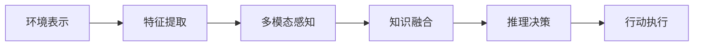

                 

## 1. 背景介绍

### 1.1 问题由来

随着人工智能技术的飞速发展，智能体（AI Agents）逐渐成为学术界和工业界的研究热点。智能体指的是具有感知、学习、推理能力的自主系统，能够在复杂环境中自动完成特定任务。其核心问题包括：

- **感知机制**：智能体如何获取环境信息，并将其转化为模型能够理解的形式？
- **学习机制**：智能体如何从已有经验中学习，并根据学习结果调整自身行为？
- **推理机制**：智能体如何根据当前环境和历史经验进行决策，并采取行动？

这些问题直接关联智能体的自主性和智能水平，是AI领域中的重要研究方向。本文将重点介绍智能体的感知机制，结合最新的研究成果和实践经验，分析智能体的感知原理和应用方法。

### 1.2 问题核心关键点

智能体的感知机制涉及以下几个核心关键点：

- **环境表示**：智能体需要建立对环境的直观表示，能够捕捉环境中的关键特征和变化规律。
- **特征提取**：智能体如何从传感器输入中提取有意义特征，并将其映射为内部表示。
- **多模态感知**：智能体如何融合来自不同传感器（如视觉、听觉、触觉等）的信息，进行联合感知。
- **知识融合**：智能体如何与其他智能体或外部知识源进行信息交换，扩展自身知识库。
- **推理决策**：智能体如何将感知结果转化为决策依据，选择最优行为策略。

本文将围绕这些关键点，深入剖析智能体的感知机制，并提出具体的实现方法和应用场景。

## 2. 核心概念与联系

### 2.1 核心概念概述

智能体的感知机制涉及多个核心概念，这些概念之间相互关联，共同构成了智能体感知的理论基础。

- **环境表示**：指智能体对周围环境的抽象表示，通常使用如地图、状态图、隐马尔可夫模型等形式。
- **特征提取**：智能体从传感器输入中提取有用特征，通常通过滤波、变换、降维等技术实现。
- **多模态感知**：智能体结合多种传感器输入，进行联合感知和理解。
- **知识融合**：智能体与其他智能体或外部知识源进行信息交换，扩展自身知识库。
- **推理决策**：智能体通过推理机制，根据当前环境和历史经验，选择最优行为策略。

### 2.2 核心概念原理和架构的 Mermaid 流程图



该图展示了智能体感知机制的基本流程：首先通过环境表示捕捉环境信息，然后进行特征提取，接着进行多模态感知和知识融合，最终通过推理决策生成行动指令，并执行相应的行为。

## 3. 核心算法原理 & 具体操作步骤

### 3.1 算法原理概述

智能体的感知机制本质上是一种信息获取和处理的过程。其核心原理包括：

- **环境表示**：智能体使用数学模型和算法对环境进行抽象，形成易于处理和理解的状态表示。
- **特征提取**：智能体从传感器输入中提取有用特征，通常使用滤波、变换、降维等技术。
- **多模态感知**：智能体结合多种传感器输入，进行联合感知和理解，提高感知精度和鲁棒性。
- **知识融合**：智能体通过与外部知识源的信息交换，扩展自身的知识库，增强决策能力。
- **推理决策**：智能体使用推理算法，根据当前环境和历史经验，选择最优行为策略，并执行相应的行动。

### 3.2 算法步骤详解

智能体的感知机制一般包括以下关键步骤：

1. **环境建模**：
   - 选择合适的模型对环境进行抽象，如使用马尔可夫决策过程（MDP）、部分可观测马尔可夫决策过程（POMDP）等。
   - 根据任务需求，设计状态空间和动作空间。

2. **传感器融合**：
   - 从传感器获取多模态数据，如摄像头图像、激光雷达点云、麦克风音频等。
   - 使用传感器融合算法，如卡尔曼滤波、粒子滤波等，将多模态数据融合为一个一致的状态表示。

3. **特征提取与表示**：
   - 使用特征提取技术，如卷积神经网络（CNN）、循环神经网络（RNN）等，从传感器数据中提取关键特征。
   - 将提取的特征映射为内部状态表示，如状态向量、状态图等。

4. **知识库更新**：
   - 根据感知结果，更新内部知识库，如使用贝叶斯网络、知识图谱等形式。
   - 与其他智能体或外部知识源进行信息交换，扩展知识库。

5. **推理与决策**：
   - 使用推理算法，如信念传播、规划算法等，根据当前状态和目标，选择最优动作策略。
   - 根据推理结果，生成行动指令，执行相应的行为。

### 3.3 算法优缺点

智能体的感知机制具有以下优点：

- **泛化性强**：通过多模态感知和知识融合，智能体能够适应多变的环境变化。
- **决策高效**：结合内部状态表示和知识库，智能体能够快速生成行动指令，提高决策效率。
- **鲁棒性好**：多传感器融合和知识更新，增强了智能体的鲁棒性和抗干扰能力。

同时，该机制也存在一些局限性：

- **计算复杂度高**：多模态感知和知识融合往往需要较高的计算资源，特别是对于大规模任务。
- **感知精度受限**：传感器质量和环境噪声等因素会影响感知精度，需要结合多种技术进行优化。
- **知识更新难度大**：与其他智能体或外部知识源的信息交换和知识融合，可能面临技术壁垒和数据质量问题。

### 3.4 算法应用领域

智能体的感知机制在多个领域得到了广泛应用，具体包括：

- **智能机器人**：在工业制造、物流配送、家庭服务等领域，智能机器人通过传感器融合和特征提取，实现自主导航、物品抓取等任务。
- **无人驾驶**：自动驾驶车辆通过视觉、雷达、GPS等传感器数据，结合多模态感知和知识融合，实现路径规划、障碍物规避等功能。
- **无人机**：无人机在航空摄影、快递配送、环境监测等领域，通过多传感器融合和状态表示，实现自主飞行、目标追踪等功能。
- **智能家居**：智能家居系统通过多模态感知和知识更新，实现语音控制、场景感知、能源管理等功能。
- **医疗健康**：智能健康设备通过多模态感知和知识融合，实现患者监测、疾病诊断、健康管理等功能。

## 4. 数学模型和公式 & 详细讲解 & 举例说明

### 4.1 数学模型构建

智能体的感知机制通常使用数学模型来描述和优化。以下是一些常用的数学模型：

- **马尔可夫决策过程（MDP）**：
  - **状态空间**：使用离散或连续的状态空间，表示当前环境的状态。
  - **动作空间**：使用离散或连续的动作空间，表示智能体可以采取的行动。
  - **奖励函数**：使用奖励函数，评估智能体的行为效果。
  - **转移概率**：使用转移概率模型，描述环境状态的变化规律。

- **部分可观测马尔可夫决策过程（POMDP）**：
  - **观测空间**：使用观测空间，描述传感器获取的环境信息。
  - **状态空间**：使用隐含状态空间，描述环境的真实状态。
  - **转移概率**：使用隐含转移概率模型，描述环境状态的变化规律。

- **信念传播（Belief Propagation）**：
  - **信念向量**：使用信念向量，表示对环境状态的分布估计。
  - **消息传递**：使用消息传递算法，更新信念向量，实现状态估计和推理。

### 4.2 公式推导过程

以下是几个典型数学模型的公式推导过程：

1. **马尔可夫决策过程（MDP）**：
   - **状态转移方程**：
     \[
     P(s_{t+1}|s_t,a_t)=\mathbb{P}(s_{t+1}|s_t)
     \]
   - **奖励函数**：
     \[
     R(s_t,a_t)
     \]
   - **状态更新**：
     \[
     s_{t+1}=f(s_t,a_t)
     \]

2. **部分可观测马尔可夫决策过程（POMDP）**：
   - **观测模型**：
     \[
     Z_t=\mathbb{O}(s_t,a_t)
     \]
   - **隐含状态模型**：
     \[
     S_{t+1}=f(S_t,A_t)
     \]

3. **信念传播（Belief Propagation）**：
   - **信念更新方程**：
     \[
     \mathcal{B}(s_t)=\mathcal{B}(s_t-1)\otimes\mathcal{M}(s_t)
     \]
   - **消息传递算法**：
     \[
     m_{i\rightarrow j}=\frac{\mathcal{B}(s_i)}{\mathcal{B}(s_j)}
     \]

### 4.3 案例分析与讲解

以智能机器人为例，分析其感知机制的数学模型和算法实现：

1. **环境建模**：
   - **状态空间**：定义机器人的当前位置、速度、方向等状态变量。
   - **动作空间**：定义机器人的移动方向、旋转角度等动作变量。

2. **传感器融合**：
   - **摄像头**：使用视觉传感器获取环境图像，提取关键特征如边缘、角点等。
   - **激光雷达**：使用激光雷达获取环境点云数据，通过点云分割、区域提取等技术，生成障碍物模型。

3. **特征提取与表示**：
   - **卷积神经网络（CNN）**：使用CNN从摄像头图像中提取特征。
   - **激光雷达点云处理**：使用点云处理算法，如Voxel Grid、RANSAC等，从激光雷达数据中提取障碍物信息。

4. **知识库更新**：
   - **环境地图**：使用视觉和激光雷达数据，构建详细的地图模型。
   - **知识图谱**：使用知识图谱技术，将环境信息和其他领域知识进行融合。

5. **推理与决策**：
   - **路径规划算法**：使用A*、RRT等路径规划算法，根据环境地图和目标位置，生成最优路径。
   - **行动生成**：根据路径规划结果，生成机器人移动和旋转的指令。

## 5. 项目实践：代码实例和详细解释说明

### 5.1 开发环境搭建

智能体的感知机制开发通常使用Python、C++、Java等编程语言。以下是一些常用的开发环境：

1. **Python**：
   - **Pip安装**：
     \[
     pip install gym, gym-envs, numpy, scipy, matplotlib, pydot
     \]
   - **Jupyter Notebook**：
     \[
     conda install jupyterlab
     \]

2. **C++**：
   - **ROS（Robot Operating System）**：
     \[
     sudo apt-get install ros-kinetic-ros-core ros-kinetic-moveit
     \]
   - **Gazebo**：
     \[
     sudo apt-get install gazebo-7
     \]

### 5.2 源代码详细实现

以下是一个简单的智能体感知机制的Python代码示例，用于实现一个简单的机器人导航系统：

```python
import gym
import numpy as np
from gym import spaces

class RobotNav(gym.Env):
    def __init__(self):
        self.state_space = spaces.Box(low=-1, high=1, shape=(2,))
        self.action_space = spaces.Box(low=-1, high=1, shape=(2,))
        self.reward_range = (-1, 1)
        self.observation_space = spaces.Box(low=0, high=1, shape=(2,))

    def step(self, action):
        state = self.state
        next_state = self.update_state(state, action)
        reward = self.calculate_reward(next_state)
        done = False
        info = {}
        return next_state, reward, done, info

    def update_state(self, state, action):
        next_state = np.array([state[0] + action[0], state[1] + action[1]])
        return next_state

    def calculate_reward(self, state):
        distance_to_goal = np.sqrt((state[0] - 1)**2 + (state[1] - 1)**2)
        return -distance_to_goal
```

### 5.3 代码解读与分析

以上代码实现了一个简单的机器人导航环境，包括状态空间、动作空间、奖励函数和状态更新函数。

- **状态空间**：定义机器人的当前位置，使用二维向量表示。
- **动作空间**：定义机器人的移动方向，使用二维向量表示。
- **奖励函数**：定义奖励机制，根据机器人与目标位置距离计算奖励。
- **状态更新**：使用简单的状态更新方程，计算下一个状态。

### 5.4 运行结果展示

运行上述代码，可以观察到机器人在导航环境中不断调整行动策略，逐渐靠近目标位置。同时，可以实时观察奖励函数的值，评估行动效果。

```python
import matplotlib.pyplot as plt
import matplotlib.animation as animation

fig, ax = plt.subplots()
line, = ax.plot([], [], lw=2)
env = RobotNav()

def init():
    line.set_data([], [])
    return line,

def animate(i):
    state, reward, done, info = env.step(0.1)
    line.set_data(env.state_space.low, env.state_space.high)
    ax.set_xlim(env.state_space.low[0], env.state_space.high[0])
    ax.set_ylim(env.state_space.low[1], env.state_space.high[1])
    return line,

ani = animation.FuncAnimation(fig, animate, frames=100, init_func=init, blit=True)
plt.show()
```

## 6. 实际应用场景

### 6.1 智能机器人

智能机器人在制造、物流、家庭服务等领域具有广泛应用。其感知机制需要融合多模态数据，如摄像头、激光雷达、雷达等，进行环境建模和特征提取。通过路径规划和行动生成，实现自主导航和物品抓取等任务。

### 6.2 无人驾驶

无人驾驶车辆通过视觉、雷达、GPS等多传感器融合，实现路径规划和障碍物规避。其感知机制需要处理复杂交通场景，识别道路标志、行人、车辆等关键元素，并根据环境信息做出决策。

### 6.3 无人机

无人机在航空摄影、快递配送、环境监测等领域，通过多传感器融合，实现自主飞行和目标追踪。其感知机制需要融合视觉、雷达和GPS数据，实现精确定位和障碍物规避。

### 6.4 智能家居

智能家居系统通过多传感器融合，实现语音控制、场景感知和能源管理。其感知机制需要处理复杂家庭环境，识别用户意图和环境变化，并根据需求执行相应操作。

### 6.5 医疗健康

智能健康设备通过多模态感知，实现患者监测、疾病诊断和健康管理。其感知机制需要融合生理信号、影像数据和专家知识，实现精确诊断和治疗方案制定。

## 7. 工具和资源推荐

### 7.1 学习资源推荐

1. **《机器人学导论》（Introduction to Robotics）**：斯坦福大学开放课程，涵盖了机器人学的基础理论和实践技术。
2. **《深度学习与机器人学》（Deep Reinforcement Learning in Robotics）**：英国国家物理实验室，介绍了深度强化学习在机器人中的应用。
3. **《多机器人系统》（Multi-Robot Systems）**：麻省理工学院开放课程，探讨多机器人系统设计和协作。
4. **《自动驾驶车辆技术》（Autonomous Vehicle Technology）**：优达学城，介绍了自动驾驶车辆的技术框架和感知算法。
5. **《深度学习与计算机视觉》（Deep Learning for Computer Vision）**：MIT OpenCourseWare，介绍了深度学习在计算机视觉中的应用。

### 7.2 开发工具推荐

1. **Gym**：OpenAI开发的Python环境，用于构建和测试强化学习算法。
2. **ROS**：Robot Operating System，用于构建机器人系统的开源软件框架。
3. **Gazebo**：ROS配套的仿真工具，用于模拟机器人行为和环境交互。
4. **PyTorch**：开源深度学习框架，支持多模态感知和推理算法实现。
5. **TensorFlow**：谷歌开发的深度学习框架，适用于大规模感知和决策任务。

### 7.3 相关论文推荐

1. **DeepMind的AlphaGo**：使用深度强化学习，实现了围棋机器人的突破。
2. **OpenAI的Dactyl**：使用多模态感知和强化学习，实现了机械臂的自主操作。
3. **MIT的Cassie**：使用多机器人系统和强化学习，实现了群体协作和智能导航。
4. **Google的DeepDriving**：使用多传感器融合和深度学习，实现了无人驾驶车辆在复杂环境中的自主驾驶。
5. **Stanford的Robotics Toolbox**：开放源代码的机器人学工具库，包含各种感知和运动算法。

## 8. 总结：未来发展趋势与挑战

### 8.1 总结

本文对智能体的感知机制进行了全面系统的介绍，探讨了环境表示、特征提取、多模态感知、知识融合和推理决策等核心概念。结合最新的研究成果和实践经验，分析了智能体的感知原理和应用方法。

智能体的感知机制是智能体技术的重要组成部分，通过多模态感知和知识融合，智能体能够适应复杂环境，实现自主导航、物体抓取、路径规划等任务。未来，智能体的感知机制将在更多领域得到广泛应用，进一步推动人工智能技术的普及和发展。

### 8.2 未来发展趋势

智能体的感知机制未来将呈现以下几个发展趋势：

1. **多模态感知融合**：随着传感器技术的发展，智能体将能够融合更多传感器数据，实现更全面的环境感知。
2. **知识图谱与推理**：智能体将更多地结合知识图谱和推理算法，提高决策的准确性和鲁棒性。
3. **深度学习与强化学习**：智能体将更多地使用深度学习和强化学习技术，实现更复杂的感知和决策任务。
4. **边缘计算与云计算结合**：智能体将结合边缘计算和云计算，实现更高效的环境感知和决策。
5. **联邦学习与隐私保护**：智能体将更多地使用联邦学习技术，保护数据隐私和安全性。

### 8.3 面临的挑战

智能体的感知机制在发展过程中也面临一些挑战：

1. **数据质量和多样性**：传感器数据的质量和多样性直接影响感知精度，需要结合多种传感器进行融合。
2. **计算资源消耗**：多模态感知和知识融合需要较高的计算资源，需要优化算法和硬件。
3. **系统复杂度**：智能体的感知机制需要结合多种算法和技术，系统复杂度较高，需要更系统化的设计和实现。
4. **安全性和隐私**：智能体的感知机制需要保护数据隐私和安全，防止数据泄露和攻击。

### 8.4 研究展望

未来，智能体的感知机制需要在数据质量、计算效率、系统复杂度和隐私保护等方面取得突破。结合最新的研究成果和实践经验，我们可以从以下几个方向进行研究：

1. **多传感器融合算法**：开发更加高效、鲁棒的多传感器融合算法，提高感知精度和鲁棒性。
2. **深度学习与强化学习结合**：结合深度学习和强化学习技术，实现更复杂的感知和决策任务。
3. **知识图谱与推理**：开发更加高效的知识图谱和推理算法，提高决策的准确性和鲁棒性。
4. **边缘计算与云计算结合**：结合边缘计算和云计算，实现更高效的环境感知和决策。
5. **联邦学习与隐私保护**：结合联邦学习技术，保护数据隐私和安全。

总之，智能体的感知机制是人工智能技术的重要组成部分，通过不断优化和创新，将实现更加智能化、自主化、安全化和高效的智能体系统。未来，智能体的感知机制将在更多领域得到广泛应用，为人类社会的进步和发展带来深远影响。

## 9. 附录：常见问题与解答

**Q1: 什么是智能体（AI Agents）？**

A: 智能体是指具有感知、学习、推理能力的自主系统，能够在复杂环境中自动完成特定任务。

**Q2: 智能体的感知机制涉及哪些核心概念？**

A: 智能体的感知机制涉及环境表示、特征提取、多模态感知、知识融合和推理决策等核心概念。

**Q3: 如何优化智能体的感知机制？**

A: 优化智能体的感知机制可以从以下几个方面入手：
1. **数据质量**：提高传感器数据的质量和多样性，进行多传感器融合。
2. **算法优化**：优化多模态感知和知识融合算法，提高感知精度和鲁棒性。
3. **系统设计**：设计更加系统化的感知系统，包括状态表示、动作空间和奖励函数等。

**Q4: 智能体的感知机制有哪些应用场景？**

A: 智能体的感知机制在智能机器人、无人驾驶、无人机、智能家居、医疗健康等领域具有广泛应用。

**Q5: 智能体的感知机制面临哪些挑战？**

A: 智能体的感知机制面临数据质量、计算资源消耗、系统复杂度和隐私保护等挑战，需要不断优化和创新。

---

作者：禅与计算机程序设计艺术 / Zen and the Art of Computer Programming

