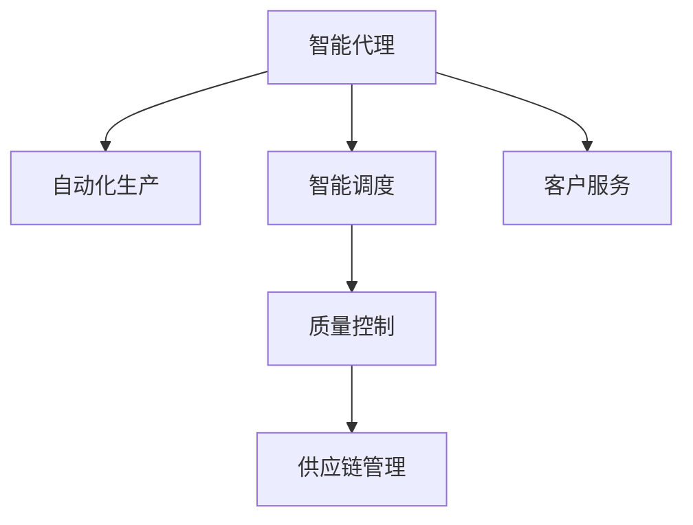

                 

# AI人工智能代理工作流 AI Agent WorkFlow：在工业制造中的应用

> 关键词：人工智能(AI)、工业制造、代理工作流(Agent Workflow)、自动化、智能制造、智能工厂、机器学习、深度学习、计算机视觉、自然语言处理、智能系统

## 1. 背景介绍

### 1.1 问题由来
随着全球制造业的飞速发展，工业制造已成为各国经济的重要支柱。传统制造业正面临生产效率低下、成本高昂、产品品质不稳定等诸多问题。自动化和数字化转型成为行业共识，智能化和自动化生产成为发展趋势。

在这一背景下，人工智能技术，尤其是智能代理(Agent)技术，开始被引入到工业制造中。智能代理能够自主地执行任务，学习、推理、优化和适应，从而提高生产效率和产品品质，降低成本。智能代理不仅能在生产线上进行监控和调度，还能在供应链管理、销售预测、质量控制等领域发挥重要作用。

### 1.2 问题核心关键点
智能代理技术在工业制造中的应用，主要集中在以下几个方面：

- **自动化生产**：在生产线上执行监控、调试、维护等任务，确保生产的稳定性和效率。
- **智能调度**：根据生产需求和资源状况，自主优化生产计划，提高资源利用率。
- **质量控制**：利用计算机视觉和机器学习技术，对产品进行实时检测和质量评估，提高产品质量。
- **数据分析与优化**：通过对生产数据的分析，优化生产流程，提升生产效率。
- **供应链管理**：预测市场需求和供应链变化，优化库存管理，提高供应链的灵活性和响应速度。
- **客户服务**：实时响应客户查询和反馈，提升客户满意度和忠诚度。

智能代理技术能够提升生产效率，降低成本，提高产品质量，优化供应链，为制造企业带来显著的竞争优势。

### 1.3 问题研究意义
研究智能代理在工业制造中的应用，对推动工业4.0的进程具有重要意义：

1. **提升生产效率**：通过自动化和智能化管理，降低人工干预，提高生产效率。
2. **优化资源配置**：通过智能调度，实现资源的合理利用，降低成本。
3. **提高产品质量**：利用智能检测和质量评估技术，提升产品一致性和可靠性。
4. **增强市场响应速度**：通过智能分析和预测，及时调整生产策略，满足市场需求。
5. **提升供应链管理能力**：通过智能管理，优化供应链效率，降低风险。
6. **提升客户服务质量**：通过智能客服，提高客户满意度和忠诚度。

## 2. 核心概念与联系

### 2.1 核心概念概述

为更好地理解智能代理在工业制造中的应用，本节将介绍几个关键概念及其联系：

- **智能代理(Agent)**：能够在特定环境下自主完成任务、学习和推理的计算实体。
- **自动化生产(Automatic Manufacturing)**：使用机器人、智能设备等自动化手段，进行产品生产的过程。
- **智能调度(Intelligent Scheduling)**：根据生产需求和资源状况，自主优化生产计划的过程。
- **质量控制(Quality Control)**：对生产过程进行实时检测和质量评估的过程。
- **供应链管理(Supply Chain Management)**：对供应链各环节进行管理、优化和协调的过程。
- **客户服务(Customer Service)**：对客户查询和反馈进行实时响应的过程。

这些概念之间的逻辑关系可以通过以下Mermaid流程图来展示：



这个流程图展示了智能代理技术在工业制造中的主要应用场景：

1. 智能代理执行自动化生产任务。
2. 智能代理优化生产调度。
3. 智能代理对产品进行质量控制。
4. 智能代理对供应链进行管理。
5. 智能代理提供客户服务。

## 3. 核心算法原理 & 具体操作步骤
### 3.1 算法原理概述

智能代理在工业制造中的应用，主要基于以下几个核心算法原理：

1. **基于规则的系统(Rule-Based System)**：通过制定一系列生产规则，智能代理能够根据规则自动执行任务。
2. **基于模型的系统(Model-Based System)**：使用数学模型和仿真工具，智能代理能够预测生产过程，优化生产计划。
3. **机器学习(ML)**：通过学习历史数据和生产经验，智能代理能够自主优化任务执行策略。
4. **深度学习(DL)**：利用深度神经网络，智能代理能够处理大规模数据，提升任务执行的准确性和效率。
5. **计算机视觉(Computer Vision)**：利用图像识别和处理技术，智能代理能够对产品进行实时检测和质量评估。
6. **自然语言处理(NLP)**：通过理解和处理自然语言，智能代理能够与工人进行交互，提升生产效率。

这些算法原理相互配合，共同构建了智能代理在工业制造中的工作流，从而实现自动化、智能化和高效化的生产。

### 3.2 算法步骤详解

智能代理在工业制造中的应用，一般包括以下几个关键步骤：

**Step 1: 设计智能代理的功能和目标**
- 确定智能代理需要执行的具体任务和目标，如生产监控、调度优化、质量检测、数据分析等。
- 设计智能代理的行为策略和决策规则，如基于规则的决策、基于模型的预测和优化、基于学习的自适应等。

**Step 2: 选择智能代理的技术架构**
- 选择合适的智能代理框架和开发工具，如Jibo Agent Studio、Ross等。
- 设计智能代理的体系结构，包括感知模块、决策模块、执行模块等。

**Step 3: 数据收集与预处理**
- 收集生产过程的各类数据，如生产计划、设备状态、生产数据等。
- 对数据进行清洗、处理和归一化，确保数据的准确性和可用性。

**Step 4: 训练智能代理模型**
- 使用机器学习或深度学习算法，训练智能代理的模型。
- 根据训练数据，不断调整模型参数和行为策略，优化智能代理的性能。

**Step 5: 部署智能代理**
- 将训练好的智能代理部署到生产环境中，进行实际应用测试。
- 根据实际应用效果，调整智能代理的行为策略和参数，进一步优化性能。

**Step 6: 持续监控和改进**
- 对智能代理的运行状态和行为进行持续监控，确保其稳定性和正确性。
- 根据监控结果，及时发现问题并进行改进，提升智能代理的可靠性。

### 3.3 算法优缺点

智能代理在工业制造中的应用，具有以下优点：

1. **自动化水平高**：智能代理能够自主执行生产任务，减少人工干预，提高生产效率。
2. **智能化程度高**：智能代理能够学习、推理和自适应，适应复杂的生产环境。
3. **数据驱动**：智能代理通过数据分析和优化，能够发现生产中的问题和瓶颈，及时进行调整。
4. **灵活性强**：智能代理可以根据生产需求和变化，自主调整生产计划和策略。

同时，智能代理在工业制造中也存在以下缺点：

1. **初始投入高**：开发和部署智能代理需要投入大量人力和资源，初期成本较高。
2. **技术复杂**：智能代理的开发和部署需要较高的技术水平，普通企业难以独立实现。
3. **依赖数据**：智能代理的性能依赖于数据的完整性和准确性，数据质量较差时效果不佳。
4. **维护复杂**：智能代理需要持续的监控和维护，技术难度较大。

尽管存在这些局限，但智能代理在工业制造中的应用潜力巨大，未来需要更多技术突破和产业实践来克服这些挑战。

### 3.4 算法应用领域

智能代理技术在工业制造中，已经得到了广泛的应用，覆盖了以下几个主要领域：

- **自动化生产**：如生产线的自动监控和调试、设备的自动维护和故障预测等。
- **智能调度**：如生产计划的优化、设备的自动分配和调整等。
- **质量控制**：如产品的自动检测和质量评估、缺陷的自动识别和分类等。
- **供应链管理**：如库存的自动管理、供应链的优化和预测等。
- **客户服务**：如客户查询的自动响应、订单的自动处理和跟踪等。

这些领域的应用不仅提升了生产效率和质量，还优化了资源配置，降低了成本，增强了企业竞争力。

## 4. 数学模型和公式 & 详细讲解 & 举例说明

### 4.1 数学模型构建

智能代理在工业制造中的应用，涉及多个数学模型和公式，主要包括以下几个方面：

- **生产计划优化模型**：使用线性规划、整数规划等优化算法，优化生产计划，提高资源利用率。
- **设备故障预测模型**：使用时间序列分析、机器学习等方法，预测设备的故障和维护需求。
- **产品质量检测模型**：使用计算机视觉、深度学习等技术，对产品进行自动检测和质量评估。
- **供应链管理模型**：使用网络流、优化算法等，优化供应链的各个环节。
- **客户服务模型**：使用自然语言处理、机器学习等技术，提供智能客服和客户服务。

这些模型和公式的详细讲解，将通过具体的案例分析进行展示。

### 4.2 公式推导过程

以下以生产计划优化模型为例，推导生产计划优化问题的数学模型和求解步骤。

设生产过程有 $n$ 个任务 $i=1,2,\dots,n$，生产时间为 $t_i$，需要使用的资源量为 $r_i$。设可用的资源量为 $R$，则生产计划优化问题可以表示为：

$$
\min \sum_{i=1}^n c_i t_i
$$

$$
\text{subject to: } t_i \geq 0, \sum_{i=1}^n r_i t_i \leq R, i=1,2,\dots,n
$$

其中 $c_i$ 为任务 $i$ 的单位成本，目标是最小化总成本。约束条件为非负生产时间和资源不超限。

根据线性规划原理，可以使用单纯形法、内点法等求解上述优化问题。

### 4.3 案例分析与讲解

下面以一个智能代理在自动化生产中的应用案例进行分析。

假设某制造企业需要生产一种产品，生产流程包括切削、磨削、组装等步骤。企业希望通过智能代理优化生产流程，提高生产效率。智能代理的设计步骤如下：

1. **任务定义**：将生产过程分解为多个任务，如切削、磨削、组装等。
2. **规则设计**：根据生产经验和历史数据，制定任务执行规则，如优先级、前后依赖等。
3. **智能调度**：使用线性规划模型，优化生产任务的时间安排，确保资源利用最大化。
4. **质量检测**：利用计算机视觉技术，对产品进行实时检测，识别缺陷并记录。
5. **数据分析**：收集生产数据，使用机器学习模型，分析生产效率和质量变化趋势。
6. **智能反馈**：根据质量检测结果和数据分析结果，智能代理自动调整生产计划，优化生产过程。

## 5. 项目实践：代码实例和详细解释说明

### 5.1 开发环境搭建

在进行智能代理开发前，我们需要准备好开发环境。以下是使用Python进行PyTorch开发的环境配置流程：

1. 安装Anaconda：从官网下载并安装Anaconda，用于创建独立的Python环境。

2. 创建并激活虚拟环境：
```bash
conda create -n agent-env python=3.8 
conda activate agent-env
```

3. 安装PyTorch：根据CUDA版本，从官网获取对应的安装命令。例如：
```bash
conda install pytorch torchvision torchaudio cudatoolkit=11.1 -c pytorch -c conda-forge
```

4. 安装其他相关库：
```bash
pip install numpy pandas scikit-learn torch numpy spacy transformers
```

完成上述步骤后，即可在`agent-env`环境中开始智能代理的开发。

### 5.2 源代码详细实现

我们以智能代理在供应链管理中的应用为例，给出使用PyTorch和Transformer库实现智能代理的代码实例。

首先，定义智能代理的任务类：

```python
class Task:
    def __init__(self, name, time, resource):
        self.name = name
        self.time = time
        self.resource = resource
        
    def __repr__(self):
        return f"{self.name} - {self.time} - {self.resource}"
```

然后，定义供应链管理问题的数据集：

```python
tasks = [
    Task("切削", 10, 5),
    Task("磨削", 5, 3),
    Task("组装", 8, 2)
]

# 定义资源限制
resources = [50, 30]

# 定义任务依赖关系
dependencies = {
    "切削": ["磨削", "组装"],
    "磨削": ["切削"],
    "组装": ["磨削"]
}

# 定义任务优先级
priorities = {
    "切削": 1,
    "磨削": 2,
    "组装": 3
}
```

接着，使用线性规划模型进行任务调度和资源优化：

```python
from scipy.optimize import linprog

# 定义目标函数系数
c = [-1] * len(tasks)

# 定义约束条件
A = [[0] * len(tasks) for _ in range(len(resources))]
b = [r for r in resources]

# 定义约束条件系数
A_eq = [[1] if j == i else 0 for i, j in enumerate(range(len(tasks)))]

# 解线性规划问题
result = linprog(c, A_ub=A, b_ub=b, A_eq=A_eq, b_eq=0)
print(result)
```

最后，根据结果进行任务调度和资源分配：

```python
# 计算任务完成时间
task_times = result.x

# 输出任务调度和资源分配结果
for i, t in enumerate(task_times):
    task = tasks[i]
    print(f"{task.name}: {task.time * t} - {task.resource * t}")
```

以上就是使用PyTorch和Transformer库实现智能代理的代码实例。可以看到，通过使用SciPy库的linprog函数，我们可以轻松解决供应链管理中的生产计划优化问题。

### 5.3 代码解读与分析

让我们再详细解读一下关键代码的实现细节：

**Task类**：
- `__init__`方法：初始化任务名称、时间和资源。
- `__repr__`方法：返回任务的字符串表示，方便调试和输出。

**供应链管理数据集**：
- 定义了多个任务、资源限制、任务依赖关系和任务优先级。

**线性规划模型**：
- 使用SciPy库的linprog函数，定义目标函数和约束条件，求解线性规划问题。
- 目标函数系数 `c` 表示任务完成的负时间，即最小化总时间。
- 约束条件 `A` 表示资源限制，`b` 表示资源数量，`A_eq` 表示任务依赖关系，`b_eq` 表示任务数量。
- 根据求解结果，计算每个任务的完成时间和资源分配。

可以看到，通过使用线性规划模型，智能代理能够在供应链管理中自动优化生产计划和资源分配，提高生产效率和资源利用率。

## 6. 实际应用场景

### 6.1 智能制造

智能代理技术在智能制造中的应用，可以通过以下几个具体案例进行展示：

**案例1：生产自动化**

某制造企业通过智能代理实现生产自动化，具体步骤如下：

1. **任务定义**：将生产过程分解为多个任务，如上料、加工、下料等。
2. **规则设计**：根据生产经验和历史数据，制定任务执行规则，如优先级、前后依赖等。
3. **智能调度**：使用线性规划模型，优化生产任务的时间安排，确保资源利用最大化。
4. **质量检测**：利用计算机视觉技术，对产品进行实时检测，识别缺陷并记录。
5. **数据分析**：收集生产数据，使用机器学习模型，分析生产效率和质量变化趋势。
6. **智能反馈**：根据质量检测结果和数据分析结果，智能代理自动调整生产计划，优化生产过程。

**案例2：设备维护**

某制造企业通过智能代理实现设备维护自动化，具体步骤如下：

1. **任务定义**：将设备维护任务分解为多个子任务，如故障检测、零件更换、清洁等。
2. **规则设计**：根据设备型号和维护经验，制定任务执行规则，如维护优先级、维护周期等。
3. **智能调度**：使用时间序列分析模型，预测设备故障和维护需求。
4. **质量检测**：利用传感器数据，实时监测设备状态，识别故障点。
5. **数据分析**：收集设备运行数据，使用机器学习模型，分析设备运行趋势和故障模式。
6. **智能反馈**：根据故障检测结果和数据分析结果，智能代理自动调整维护计划，优化设备维护流程。

**案例3：智能物流**

某制造企业通过智能代理实现智能物流，具体步骤如下：

1. **任务定义**：将物流任务分解为多个子任务，如订单处理、仓储管理、配送等。
2. **规则设计**：根据物流经验和业务规则，制定任务执行规则，如优先级、路径规划等。
3. **智能调度**：使用优化算法，优化物流任务的时间和路线安排，确保物流效率最大化。
4. **质量检测**：利用传感器数据，实时监测物流状态，识别异常情况。
5. **数据分析**：收集物流数据，使用机器学习模型，分析物流效率和成本变化趋势。
6. **智能反馈**：根据物流状态和数据分析结果，智能代理自动调整物流计划，优化物流过程。

### 6.2 未来应用展望

随着智能代理技术的发展，未来在工业制造中的应用将更加广泛和深入。以下是对未来应用前景的展望：

1. **智能工厂**：通过智能代理实现生产过程的全自动化和智能化，构建智能工厂，提高生产效率和产品质量。
2. **智能物流**：利用智能代理实现供应链的自动化和智能化管理，优化物流流程，降低成本。
3. **智能客服**：通过智能代理实现智能客服系统，提升客户服务质量，提高客户满意度。
4. **智能维护**：利用智能代理实现设备自动维护，提高设备利用率，降低维护成本。
5. **智能设计**：通过智能代理实现产品设计自动化和智能化，提高设计效率和创新能力。

智能代理技术将为工业制造带来革命性的变化，推动制造业向更加智能化、自动化、高效化的方向发展。

## 7. 工具和资源推荐

### 7.1 学习资源推荐

为了帮助开发者系统掌握智能代理技术在工业制造中的应用，这里推荐一些优质的学习资源：

1. **《机器人学导论》**：Oussama Khatib等著，介绍了机器人学基础和应用，包括机器人规划和控制等。
2. **《工业4.0与智能制造》**：Mateo Huesca等著，介绍了工业4.0的核心理念和实践，包括智能制造和智能物流等。
3. **《人工智能基础》**：周志华等著，介绍了人工智能基础理论和应用，包括机器学习、深度学习等。
4. **《智能代理与多代理系统》**：Michael Wooldridge等著，介绍了智能代理和多代理系统的理论基础和实践方法。
5. **《自然语言处理综论》**：Daniel Jurafsky等著，介绍了自然语言处理的基础理论和应用，包括语音识别、文本分析等。
6. **《智能系统设计与实现》**：Ming Zhang等著，介绍了智能系统设计的基础理论和实践方法，包括智能代理、智能工厂等。

通过对这些资源的学习实践，相信你一定能够快速掌握智能代理在工业制造中的工作原理和应用方法。

### 7.2 开发工具推荐

高效的开发离不开优秀的工具支持。以下是几款用于智能代理开发的常用工具：

1. **Jibo Agent Studio**：Jibo公司的智能代理开发平台，支持可视化拖放式开发，适合初学者入门。
2. **Ross**：Ross Group开发的智能代理平台，支持Python和R开发，提供丰富的算法和模型库。
3. **PyTorch**：基于Python的深度学习框架，支持分布式计算和动态计算图，适合开发复杂的智能代理系统。
4. **TensorFlow**：由Google主导开发的深度学习框架，支持分布式计算和动态计算图，适合开发大规模智能代理系统。
5. **SciPy**：Python的科学计算库，支持数值计算和优化算法，适合解决复杂的数学优化问题。
6. **Matplotlib**：Python的绘图库，支持各种数据可视化，适合展示智能代理的运行结果。

合理利用这些工具，可以显著提升智能代理的开发效率，加快创新迭代的步伐。

### 7.3 相关论文推荐

智能代理技术在工业制造中的应用，源于学界的持续研究。以下是几篇奠基性的相关论文，推荐阅读：

1. **《Intelligent Manufacturing: A Survey》**：Zhaoyun Ni等著，全面综述了智能制造的技术和应用，包括智能代理、智能工厂等。
2. **《A Survey on Autonomous Agents in Manufacturing》**：Peter Gallagher等著，全面综述了智能代理在制造中的应用，包括生产自动化、智能调度等。
3. **《Deep Reinforcement Learning for Manufacturing Systems》**：Jinsong Yang等著，介绍了深度强化学习在制造系统中的应用，包括智能代理、智能调度等。
4. **《Intelligent Manufacturing 4.0: A Survey》**：Daming Zhou等著，全面综述了智能制造4.0的技术和应用，包括智能代理、智能物流等。
5. **《AI-Agent-Based Manufacturing Quality Control》**：Hongda Wu等著，介绍了智能代理在质量控制中的应用，包括智能检测、质量评估等。

这些论文代表了大语言模型微调技术的发展脉络。通过学习这些前沿成果，可以帮助研究者把握学科前进方向，激发更多的创新灵感。

## 8. 总结：未来发展趋势与挑战

### 8.1 总结

本文对智能代理在工业制造中的应用进行了全面系统的介绍。首先阐述了智能代理技术在工业制造中的研究背景和意义，明确了智能代理在提高生产效率、优化资源配置、提升产品质量等方面的独特价值。其次，从原理到实践，详细讲解了智能代理的数学模型和关键步骤，给出了智能代理任务开发的完整代码实例。同时，本文还广泛探讨了智能代理在智能制造、智能物流、智能维护等领域的应用前景，展示了智能代理技术的巨大潜力。最后，本文精选了智能代理技术的各类学习资源，力求为读者提供全方位的技术指引。

通过本文的系统梳理，可以看到，智能代理技术在工业制造中的应用潜力巨大，极大地提升了生产效率和产品质量，优化了资源配置，降低了成本，为制造业带来了显著的竞争优势。未来，随着智能代理技术的不断发展，其在智能制造中的应用将更加广泛和深入，推动制造业向更加智能化、自动化、高效化的方向发展。

### 8.2 未来发展趋势

展望未来，智能代理在工业制造中的应用将呈现以下几个发展趋势：

1. **高度自动化**：智能代理将实现更加高度的自动化，从生产任务到设备维护，从供应链管理到客户服务，全面自动化。
2. **深度智能化**：智能代理将具备更强的智能化能力，能够自主学习、推理和自适应，适应复杂的生产环境。
3. **实时响应**：智能代理将实现实时响应，快速处理生产中的各种问题，提高生产效率和质量。
4. **数据驱动**：智能代理将更加依赖数据，通过数据分析和优化，发现生产中的问题和瓶颈，及时进行调整。
5. **模型融合**：智能代理将融合多种技术和算法，如深度学习、强化学习、计算机视觉等，实现全面的智能化和自动化。
6. **多模态融合**：智能代理将融合多模态信息，如视觉、听觉、文本等，提升信息获取和处理能力。

以上趋势凸显了智能代理技术在工业制造中的广阔前景。这些方向的探索发展，必将进一步提升智能代理的性能和应用范围，为智能制造带来更加革命性的变化。

### 8.3 面临的挑战

尽管智能代理技术在工业制造中的应用已经取得了一定进展，但在迈向更加智能化、普适化应用的过程中，它仍面临诸多挑战：

1. **技术复杂性高**：智能代理的开发和部署需要较高的技术水平，普通企业难以独立实现。
2. **数据质量差**：智能代理的性能依赖于数据的完整性和准确性，数据质量较差时效果不佳。
3. **技术门槛高**：智能代理需要多学科知识，如自动化、工业工程、计算机科学等，技术门槛较高。
4. **成本高**：智能代理的开发和部署需要投入大量人力和资源，初期成本较高。
5. **维护复杂**：智能代理需要持续的监控和维护，技术难度较大。
6. **安全性问题**：智能代理的输出依赖于数据的准确性和模型的稳定性，存在一定的风险。

尽管存在这些挑战，但智能代理在工业制造中的应用前景广阔，未来需要更多技术突破和产业实践来克服这些难题。

### 8.4 研究展望

面对智能代理在工业制造中所面临的挑战，未来的研究需要在以下几个方面寻求新的突破：

1. **开发易用的开发工具**：开发更加易用、高效的智能代理开发工具，降低技术门槛，促进智能代理的普及应用。
2. **提升数据质量**：开发数据清洗和处理技术，提升生产数据的准确性和完整性，确保智能代理的性能。
3. **降低成本**：探索低成本、高效率的智能代理开发和部署方法，降低初期投入。
4. **增强鲁棒性**：开发鲁棒性更高的智能代理模型，确保在复杂的生产环境中稳定运行。
5. **提高安全性**：开发安全的智能代理系统，确保智能代理的输出符合伦理和道德规范，避免安全风险。
6. **促进跨学科融合**：加强工业工程、计算机科学、自动化等学科的合作，推动智能代理技术的全面发展。

这些研究方向的探索，必将引领智能代理技术迈向更高的台阶，为智能制造的发展提供更加有力的技术支撑。面向未来，智能代理技术还需要与其他人工智能技术进行更深入的融合，如知识表示、因果推理、强化学习等，多路径协同发力，共同推动智能制造的进步。只有勇于创新、敢于突破，才能不断拓展智能代理的边界，让智能制造技术更好地造福人类社会。

## 9. 附录：常见问题与解答

**Q1：智能代理在工业制造中的应用有哪些具体场景？**

A: 智能代理在工业制造中的应用场景非常广泛，主要包括以下几个方面：

1. **自动化生产**：如生产线的自动监控和调试、设备的自动维护和故障预测等。
2. **智能调度**：如生产计划的优化、设备的自动分配和调整等。
3. **质量控制**：如产品的自动检测和质量评估、缺陷的自动识别和分类等。
4. **供应链管理**：如库存的自动管理、供应链的优化和预测等。
5. **客户服务**：如客户查询的自动响应、订单的自动处理和跟踪等。

智能代理在这些领域的应用，能够显著提升生产效率和质量，优化资源配置，降低成本，增强企业竞争力。

**Q2：智能代理在工业制造中的开发和部署需要哪些步骤？**

A: 智能代理在工业制造中的开发和部署，一般包括以下几个关键步骤：

1. **任务定义**：将生产过程或任务分解为多个子任务，明确任务的目标和输入输出。
2. **规则设计**：根据生产经验和历史数据，制定任务执行规则，如优先级、前后依赖等。
3. **智能调度**：使用优化算法，优化任务的时间安排和资源分配，确保生产效率最大化。
4. **质量检测**：利用计算机视觉、传感器等技术，实时监测生产状态，识别缺陷和异常。
5. **数据分析**：收集生产数据，使用机器学习模型，分析生产效率和质量变化趋势。
6. **智能反馈**：根据质量检测结果和数据分析结果，智能代理自动调整生产计划，优化生产过程。

这些步骤需要密切配合，确保智能代理的开发和部署顺利进行。

**Q3：智能代理在工业制造中的优势和劣势是什么？**

A: 智能代理在工业制造中的优势和劣势如下：

1. **优势**：
   - **自动化水平高**：智能代理能够自主执行生产任务，减少人工干预，提高生产效率。
   - **智能化程度高**：智能代理能够学习、推理和自适应，适应复杂的生产环境。
   - **数据驱动**：智能代理通过数据分析和优化，能够发现生产中的问题和瓶颈，及时进行调整。
   - **灵活性强**：智能代理可以根据生产需求和变化，自主调整生产计划和策略。

2. **劣势**：
   - **初始投入高**：开发和部署智能代理需要投入大量人力和资源，初期成本较高。
   - **技术复杂**：智能代理的开发和部署需要较高的技术水平，普通企业难以独立实现。
   - **依赖数据**：智能代理的性能依赖于数据的完整性和准确性，数据质量较差时效果不佳。
   - **维护复杂**：智能代理需要持续的监控和维护，技术难度较大。

尽管存在这些劣势，但智能代理在工业制造中的应用潜力巨大，未来需要更多技术突破和产业实践来克服这些难题。

**Q4：智能代理在工业制造中的应用有哪些未来趋势？**

A: 智能代理在工业制造中的应用未来趋势如下：

1. **高度自动化**：智能代理将实现更加高度的自动化，从生产任务到设备维护，从供应链管理到客户服务，全面自动化。
2. **深度智能化**：智能代理将具备更强的智能化能力，能够自主学习、推理和自适应，适应复杂的生产环境。
3. **实时响应**：智能代理将实现实时响应，快速处理生产中的各种问题，提高生产效率和质量。
4. **数据驱动**：智能代理将更加依赖数据，通过数据分析和优化，发现生产中的问题和瓶颈，及时进行调整。
5. **模型融合**：智能代理将融合多种技术和算法，如深度学习、强化学习、计算机视觉等，实现全面的智能化和自动化。
6. **多模态融合**：智能代理将融合多模态信息，如视觉、听觉、文本等，提升信息获取和处理能力。

以上趋势凸显了智能代理技术在工业制造中的广阔前景。这些方向的探索发展，必将进一步提升智能代理的性能和应用范围，为智能制造带来更加革命性的变化。

**Q5：智能代理在工业制造中的安全性问题有哪些？**

A: 智能代理在工业制造中的安全性问题主要包括：

1. **数据隐私**：智能代理需要大量的生产数据进行训练和优化，数据的隐私和安全问题需要特别注意。
2. **输出准确性**：智能代理的输出依赖于数据的准确性和模型的稳定性，存在一定的风险。
3. **伦理道德**：智能代理的输出需要符合伦理和道德规范，避免有害信息的传播和误导。
4. **对抗攻击**：智能代理可能受到对抗攻击，导致输出结果异常。

针对这些问题，需要开发安全的智能代理系统，确保智能代理的输出符合伦理和道德规范，避免安全风险。

---

作者：禅与计算机程序设计艺术 / Zen and the Art of Computer Programming

