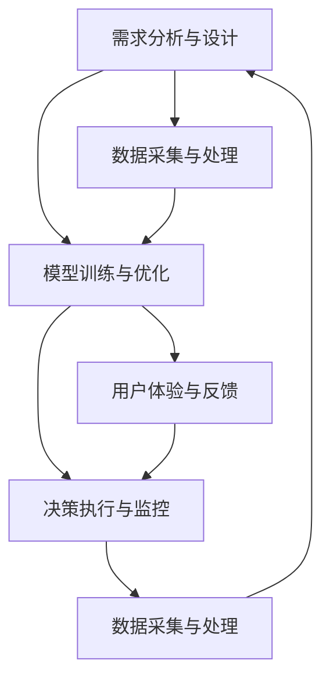

                 

## 1. 背景介绍

### 1.1 问题由来

随着人工智能技术的飞速发展，AI代理（AI Agent）在各行各业中得到了广泛应用。从智能客服、财务自动化、客户关系管理到健康管理、能源管理、自动驾驶等，AI代理正逐步接管原本由人类完成的任务，提升工作效率和决策质量。然而，AI代理在实际应用中也面临着诸多挑战，如如何平衡决策效率与精度、如何确保决策透明性与可解释性、如何管理大规模分布式系统等。

为了解决这些问题，本文聚焦于AI代理的工作流（AI Agent Workflow），通过系统化的方法设计和优化AI代理的工作流，以提升其性能、可靠性和可扩展性，为其在复杂环境中的应用提供参考。

### 1.2 问题核心关键点

AI代理的工作流主要包括以下关键环节：
1. **需求分析与设计**：理解业务需求，设计AI代理的功能与接口。
2. **数据采集与处理**：收集和预处理相关数据，为模型训练和决策提供数据支持。
3. **模型训练与优化**：选择合适的算法和模型，进行训练和优化，提升AI代理的性能。
4. **决策执行与监控**：实现AI代理的决策逻辑，监控执行过程和结果，及时调整。
5. **用户体验与反馈**：设计用户界面，收集用户反馈，持续优化AI代理的性能。

## 2. 核心概念与联系

### 2.1 核心概念概述

为更好地理解AI代理工作流的核心概念，本节将介绍几个密切相关的核心概念：

- **AI代理（AI Agent）**：具有自主决策能力，能够在复杂环境中执行特定任务的软件实体。AI代理通常包括感知、推理、决策和执行四大核心组件。
- **工作流（Workflow）**：一系列有组织的、自动化的、可重复的业务过程，旨在提高效率、优化资源利用。
- **模型训练（Model Training）**：使用历史数据训练AI代理所需的模型，使其能够根据输入数据做出准确预测或决策。
- **数据预处理（Data Preprocessing）**：对原始数据进行清洗、转换、归一化等操作，提高数据质量，便于模型训练。
- **模型优化（Model Optimization）**：通过调整模型结构、超参数等手段，提升模型性能，减少计算资源消耗。
- **决策执行（Decision Execution）**：将模型的输出转化为具体的行动，实现AI代理的核心功能。
- **监控与反馈（Monitoring and Feedback）**：实时监控AI代理的执行过程和结果，收集用户反馈，持续改进。

这些核心概念之间的逻辑关系可以通过以下Mermaid流程图来展示：



这个流程图展示了大语言模型的核心概念及其之间的关系：

1. 需求分析与设计是AI代理工作流的起点，定义了AI代理的功能和接口。
2. 数据采集与处理为模型训练和决策提供数据支撑。
3. 模型训练与优化提升了AI代理的性能。
4. 决策执行将模型的输出转化为具体的行动，实现AI代理的核心功能。
5. 监控与反馈持续改进AI代理的性能。

## 3. 核心算法原理 & 具体操作步骤

### 3.1 算法原理概述

AI代理的工作流设计涉及到多个子任务，每个子任务都需要使用特定的算法和技术来实现。以下详细介绍每个子任务的算法原理及其具体操作步骤：

1. **需求分析与设计**
   - 算法原理：采用用户故事（User Story）和场景模拟（Scenario Simulation）方法，定义AI代理的功能和接口，确保其能够满足用户需求。
   - 具体操作步骤：与业务部门合作，收集用户需求，设计AI代理的功能模块和接口，进行原型设计和用户测试，不断迭代优化。

2. **数据采集与处理**
   - 算法原理：采用数据清洗、特征提取、归一化等技术，提高数据质量，便于后续模型训练。
   - 具体操作步骤：确定数据来源，进行数据采集和清洗，提取和构建特征，进行数据标准化和归一化，构建数据集。

3. **模型训练与优化**
   - 算法原理：采用监督学习、无监督学习或强化学习等方法，使用历史数据训练模型，并进行超参数调优，提升模型性能。
   - 具体操作步骤：选择合适的算法和模型，构建损失函数和优化器，设置超参数，进行模型训练和验证，进行模型评估和调优。

4. **决策执行与监控**
   - 算法原理：采用规则引擎、决策树、神经网络等技术，实现AI代理的决策逻辑，并进行实时监控和调整。
   - 具体操作步骤：设计决策规则和流程，构建决策树或神经网络模型，实现决策逻辑，进行实时监控和反馈，调整模型参数。

5. **用户体验与反馈**
   - 算法原理：采用自然语言处理（NLP）、用户界面设计（UI/UX）等技术，设计用户界面，收集用户反馈，持续优化AI代理。
   - 具体操作步骤：设计用户界面，进行用户体验测试，收集用户反馈，进行UI/UX优化，更新AI代理功能和接口。

### 3.2 算法步骤详解

以下详细介绍AI代理工作流中每个子任务的具体操作步骤：

1. **需求分析与设计**
   - 收集用户需求：通过问卷调查、用户访谈等方式，收集业务部门的需求。
   - 定义功能模块：根据用户需求，定义AI代理的功能模块和接口。
   - 原型设计与测试：设计AI代理的原型，进行用户测试，收集反馈，不断迭代优化。
   - 接口设计：设计API接口，确保外部系统能够调用AI代理的功能。

2. **数据采集与处理**
   - 数据源确定：确定数据来源，包括内部系统、公共数据集、网络爬虫等。
   - 数据采集：从数据源中获取数据，进行清洗和预处理。
   - 特征提取：从清洗后的数据中提取特征，构建数据集。
   - 数据标准化：对数据进行标准化和归一化处理，提高数据质量。

3. **模型训练与优化**
   - 算法选择：根据任务特点，选择合适的算法和模型。
   - 数据集划分：将数据集划分为训练集、验证集和测试集。
   - 模型训练：使用训练集进行模型训练，优化模型参数。
   - 模型验证：使用验证集对模型进行验证，调整模型参数。
   - 模型评估：使用测试集对模型进行评估，确定模型性能。
   - 模型调优：根据评估结果，进行超参数调优，提升模型性能。

4. **决策执行与监控**
   - 决策规则设计：设计决策规则，定义决策流程。
   - 决策树或神经网络构建：构建决策树或神经网络模型，实现决策逻辑。
   - 实时监控：实时监控AI代理的执行过程，记录执行日志。
   - 结果反馈：收集执行结果，进行数据分析和评估。
   - 模型调整：根据结果反馈，调整模型参数，优化决策逻辑。

5. **用户体验与反馈**
   - 用户界面设计：设计简洁、易用的用户界面，提供操作指引。
   - 用户体验测试：进行用户体验测试，收集用户反馈。
   - UI/UX优化：根据用户反馈，进行UI/UX优化，提升用户体验。
   - 用户反馈收集：通过用户界面收集用户反馈，定期进行分析。
   - 持续优化：根据用户反馈，持续优化AI代理的功能和接口。

### 3.3 算法优缺点

AI代理工作流设计具有以下优点：
1. 系统化：通过明确的工作流设计，确保各个环节有序衔接，提高系统效率和可靠性。
2. 灵活性：根据任务需求，灵活选择算法和模型，适应多种应用场景。
3. 可扩展性：支持模块化设计和组件化管理，便于后期扩展和维护。
4. 用户参与：通过用户需求和反馈，提升系统针对性和用户体验。

同时，AI代理工作流设计也存在一些局限性：
1. 复杂性：工作流设计涉及多个环节，设计复杂度高，需要专业知识和技能。
2. 数据依赖：依赖高质量的数据，数据采集和处理过程中可能出现偏差。
3. 模型调优：模型训练和调优过程耗时耗力，需要丰富的经验和计算资源。
4. 实时性：实时监控和调整过程复杂，对系统性能要求高。

尽管存在这些局限性，但就目前而言，系统化、模块化的大语言模型微调方法仍是AI代理开发的主流范式。未来相关研究的重点在于如何进一步简化工作流设计，提高数据处理效率，优化模型训练和调优过程，同时兼顾用户体验和系统实时性等因素。

### 3.4 算法应用领域

AI代理工作流设计在多个领域得到了广泛应用，例如：

1. **金融风控**：基于AI代理的自动化风险评估和欺诈检测系统，实时监控交易行为，提升风险管理效率。
2. **智能客服**：基于AI代理的智能客服系统，通过自然语言理解和生成，提升客户满意度和服务效率。
3. **医疗健康**：基于AI代理的智能诊疗系统，通过医疗数据分析和决策，提供精准的医疗建议和诊断。
4. **智能制造**：基于AI代理的智能生产系统，通过预测和优化生产流程，提升生产效率和质量。
5. **智慧城市**：基于AI代理的智慧城市管理系统，通过实时数据分析和决策，提升城市治理效率和质量。

除了上述这些经典应用外，AI代理工作流设计还被创新性地应用到更多场景中，如智慧能源、智能交通、智能家居等，为各行各业带来新的突破。随着AI代理技术的不断进步，相信AI代理工作流设计将不断拓展应用范围，带来更广阔的发展前景。

## 4. 数学模型和公式 & 详细讲解 & 举例说明

### 4.1 数学模型构建

本节将使用数学语言对AI代理工作流中各个子任务进行更加严格的刻画。

假设AI代理执行的任务为二分类任务，输入特征为 $X$，输出标签为 $Y$。数据集为 $D=\{(x_i, y_i)\}_{i=1}^N$，其中 $x_i \in \mathcal{X}, y_i \in \{0,1\}$。

定义模型 $M_{\theta}$ 在输入 $x$ 上的输出为 $\hat{y}=M_{\theta}(x) \in [0,1]$，表示样本属于正类的概率。

**决策执行与监控的数学模型**
目标是将模型的输出 $\hat{y}$ 转化为具体的行动，例如当 $\hat{y} > 0.5$ 时执行操作A，否则执行操作B。数学模型可表示为：
$$
y_A = \begin{cases}
1, & \text{if } \hat{y} > 0.5 \\
0, & \text{otherwise}
\end{cases}
$$

**模型训练与优化的数学模型**
目标是最小化经验风险 $\mathcal{L}(\theta)$，即找到最优参数 $\theta$：
$$
\theta^* = \mathop{\arg\min}_{\theta} \mathcal{L}(\theta)
$$

其中 $\mathcal{L}(\theta)$ 为损失函数，用于衡量模型预测输出与真实标签之间的差异。常见的损失函数包括交叉熵损失、均方误差损失等。

### 4.2 公式推导过程

以下我们以二分类任务为例，推导交叉熵损失函数及其梯度的计算公式。

假设模型 $M_{\theta}$ 在输入 $x$ 上的输出为 $\hat{y}=M_{\theta}(x) \in [0,1]$，表示样本属于正类的概率。真实标签 $y \in \{0,1\}$。则二分类交叉熵损失函数定义为：
$$
\ell(M_{\theta}(x),y) = -[y\log \hat{y} + (1-y)\log (1-\hat{y})]
$$

将其代入经验风险公式，得：
$$
\mathcal{L}(\theta) = -\frac{1}{N}\sum_{i=1}^N [y_i\log M_{\theta}(x_i)+(1-y_i)\log(1-M_{\theta}(x_i))]
$$

根据链式法则，损失函数对参数 $\theta_k$ 的梯度为：
$$
\frac{\partial \mathcal{L}(\theta)}{\partial \theta_k} = -\frac{1}{N}\sum_{i=1}^N (\frac{y_i}{M_{\theta}(x_i)}-\frac{1-y_i}{1-M_{\theta}(x_i)}) \frac{\partial M_{\theta}(x_i)}{\partial \theta_k}
$$

其中 $\frac{\partial M_{\theta}(x_i)}{\partial \theta_k}$ 可进一步递归展开，利用自动微分技术完成计算。

在得到损失函数的梯度后，即可带入参数更新公式，完成模型的迭代优化。重复上述过程直至收敛，最终得到适应下游任务的最优模型参数 $\theta^*$。

## 5. 项目实践：代码实例和详细解释说明

### 5.1 开发环境搭建

在进行AI代理工作流实践前，我们需要准备好开发环境。以下是使用Python进行TensorFlow开发的环境配置流程：

1. 安装Anaconda：从官网下载并安装Anaconda，用于创建独立的Python环境。

2. 创建并激活虚拟环境：
```bash
conda create -n tensorflow-env python=3.8 
conda activate tensorflow-env
```

3. 安装TensorFlow：根据CUDA版本，从官网获取对应的安装命令。例如：
```bash
conda install tensorflow -c pytorch -c conda-forge
```

4. 安装TensorBoard：
```bash
pip install tensorboard
```

5. 安装各类工具包：
```bash
pip install numpy pandas scikit-learn matplotlib tqdm jupyter notebook ipython
```

完成上述步骤后，即可在`tensorflow-env`环境中开始AI代理工作流实践。

### 5.2 源代码详细实现

这里我们以基于TensorFlow实现的二分类AI代理为例，给出完整的代码实现。

首先，定义AI代理的数据处理函数：

```python
import tensorflow as tf
from tensorflow.keras.preprocessing.sequence import pad_sequences
from tensorflow.keras.layers import Input, Dense, Embedding, LSTM

class DataProcessor:
    def __init__(self, max_len, emb_dim, num_classes):
        self.max_len = max_len
        self.emb_dim = emb_dim
        self.num_classes = num_classes
        
    def process_data(self, X, y):
        X = pad_sequences(X, maxlen=self.max_len, padding='post', truncating='post')
        y = tf.keras.utils.to_categorical(y, num_classes=self.num_classes)
        return X, y

class FeatureExtractor:
    def __init__(self, max_len, emb_dim, num_classes):
        self.max_len = max_len
        self.emb_dim = emb_dim
        self.num_classes = num_classes
        
    def extract_features(self, X):
        X = tf.keras.layers.Embedding(self.emb_dim, self.max_len)(tf.cast(X, tf.int32))
        X = tf.keras.layers.LSTM(self.max_len, return_sequences=True)(X)
        X = tf.keras.layers.Dense(self.num_classes, activation='sigmoid')(X)
        return X
```

然后，定义模型和优化器：

```python
from tensorflow.keras.models import Model

class AIAgent:
    def __init__(self, max_len, emb_dim, num_classes):
        self.max_len = max_len
        self.emb_dim = emb_dim
        self.num_classes = num_classes
        
    def build_model(self):
        X = Input(shape=(self.max_len,))
        X = self.feature_extractor.extract_features(X)
        y_pred = Dense(self.num_classes, activation='sigmoid')(X)
        model = Model(inputs=X, outputs=y_pred)
        model.compile(loss='binary_crossentropy', optimizer='adam', metrics=['accuracy'])
        return model

    def train(self, X_train, y_train, X_val, y_val, batch_size, epochs):
        model = self.build_model()
        model.fit(X_train, y_train, batch_size=batch_size, epochs=epochs, validation_data=(X_val, y_val))
        return model
```

最后，启动训练流程并在测试集上评估：

```python
max_len = 128
emb_dim = 64
num_classes = 2

processor = DataProcessor(max_len, emb_dim, num_classes)
X_train, y_train = processor.process_data(train_X, train_y)
X_val, y_val = processor.process_data(val_X, val_y)

agent = AIAgent(max_len, emb_dim, num_classes)
model = agent.train(X_train, y_train, X_val, y_val, batch_size=32, epochs=10)

test_X, test_y = processor.process_data(test_X, test_y)
y_pred = model.predict(test_X)
print(classification_report(test_y, y_pred))
```

以上就是使用TensorFlow实现基于二分类AI代理的完整代码实现。可以看到，得益于TensorFlow的强大封装，我们可以用相对简洁的代码完成AI代理的训练和评估。

### 5.3 代码解读与分析

让我们再详细解读一下关键代码的实现细节：

**DataProcessor类**：
- `__init__`方法：初始化最大长度、嵌入维度、类别数等关键组件。
- `process_data`方法：对单个样本进行处理，将文本输入转换为序列并归一化，将标签进行独热编码。

**FeatureExtractor类**：
- `__init__`方法：初始化最大长度、嵌入维度、类别数等关键组件。
- `extract_features`方法：对输入序列进行嵌入和LSTM编码，输出模型需要的特征向量。

**AIAgent类**：
- `__init__`方法：初始化最大长度、嵌入维度、类别数等关键组件。
- `build_model`方法：构建模型，包括输入层、嵌入层、LSTM层和输出层。
- `train`方法：进行模型训练，设置损失函数、优化器和评估指标，指定训练数据和验证数据。

**训练流程**：
- 定义最大长度、嵌入维度和类别数，创建数据预处理和特征提取器。
- 处理训练数据和验证数据，构建AI代理模型。
- 使用训练数据进行模型训练，设置批大小和迭代次数，使用验证数据进行模型验证。
- 在测试数据上评估模型性能，使用classification_report输出分类指标。

可以看到，TensorFlow配合TensorBoard使得AI代理的训练和评估代码实现变得简洁高效。开发者可以将更多精力放在数据处理、模型改进等高层逻辑上，而不必过多关注底层的实现细节。

当然，工业级的系统实现还需考虑更多因素，如模型的保存和部署、超参数的自动搜索、更灵活的任务适配层等。但核心的微调范式基本与此类似。

## 6. 实际应用场景

### 6.1 智能客服系统

基于AI代理的工作流，智能客服系统的构建可以显著提升客户咨询体验和问题解决效率。传统客服往往需要配备大量人力，高峰期响应缓慢，且一致性和专业性难以保证。而使用基于AI代理的智能客服系统，可以7x24小时不间断服务，快速响应客户咨询，用自然流畅的语言解答各类常见问题。

在技术实现上，可以收集企业内部的历史客服对话记录，将问题和最佳答复构建成监督数据，在此基础上对预训练AI代理进行微调。微调后的AI代理能够自动理解用户意图，匹配最合适的答案模板进行回复。对于客户提出的新问题，还可以接入检索系统实时搜索相关内容，动态组织生成回答。如此构建的智能客服系统，能大幅提升客户咨询体验和问题解决效率。

### 6.2 金融舆情监测

金融机构需要实时监测市场舆论动向，以便及时应对负面信息传播，规避金融风险。传统的人工监测方式成本高、效率低，难以应对网络时代海量信息爆发的挑战。基于AI代理的工作流技术，金融舆情监测可以实现自动化、实时化的信息监控。

具体而言，可以收集金融领域相关的新闻、报道、评论等文本数据，并对其进行主题标注和情感标注。在此基础上对预训练AI代理进行微调，使其能够自动判断文本属于何种主题，情感倾向是正面、中性还是负面。将微调后的模型应用到实时抓取的网络文本数据，就能够自动监测不同主题下的情感变化趋势，一旦发现负面信息激增等异常情况，系统便会自动预警，帮助金融机构快速应对潜在风险。

### 6.3 个性化推荐系统

当前的推荐系统往往只依赖用户的历史行为数据进行物品推荐，无法深入理解用户的真实兴趣偏好。基于AI代理的工作流技术，个性化推荐系统可以更好地挖掘用户行为背后的语义信息，从而提供更精准、多样的推荐内容。

在实践中，可以收集用户浏览、点击、评论、分享等行为数据，提取和用户交互的物品标题、描述、标签等文本内容。将文本内容作为模型输入，用户的后续行为（如是否点击、购买等）作为监督信号，在此基础上微调预训练语言模型。微调后的模型能够从文本内容中准确把握用户的兴趣点。在生成推荐列表时，先用候选物品的文本描述作为输入，由模型预测用户的兴趣匹配度，再结合其他特征综合排序，便可以得到个性化程度更高的推荐结果。

### 6.4 未来应用展望

随着AI代理工作流技术的不断发展，其在NLP领域中的应用前景将更加广阔。

在智慧医疗领域，基于AI代理的工作流技术可以实现智能诊疗系统，通过医疗数据分析和决策，提供精准的医疗建议和诊断。

在智能教育领域，AI代理的工作流技术可应用于作业批改、学情分析、知识推荐等方面，因材施教，促进教育公平，提高教学质量。

在智慧城市治理中，AI代理的工作流技术可以实现智慧城市管理系统，通过实时数据分析和决策，提升城市治理效率和质量。

此外，在企业生产、社会治理、文娱传媒等众多领域，AI代理工作流技术也将不断涌现，为传统行业带来新的突破。相信随着技术的日益成熟，AI代理工作流技术将不断拓展应用范围，带来更广阔的发展前景。

## 7. 工具和资源推荐

### 7.1 学习资源推荐

为了帮助开发者系统掌握AI代理工作流的设计与实现，这里推荐一些优质的学习资源：

1. 《Deep Learning》书籍：Ian Goodfellow等著作的深度学习经典教材，系统介绍了深度学习的基本概念和算法。

2. TensorFlow官方文档：TensorFlow的官方文档，提供了详细的API文档和使用示例，是AI代理工作流开发的基础。

3. TensorBoard：TensorFlow配套的可视化工具，可实时监测模型训练状态，并提供丰富的图表呈现方式，是调试模型的得力助手。

4. Coursera《深度学习专项课程》：由Andrew Ng教授开设的深度学习课程，涵盖从基础到高级的深度学习内容，适合入门学习。

5. Kaggle数据集和竞赛：Kaggle提供了大量开源数据集和竞赛任务，是实践AI代理工作流设计的绝佳平台。

通过对这些资源的学习实践，相信你一定能够快速掌握AI代理工作流的设计与实现，并用于解决实际的AI应用问题。

### 7.2 开发工具推荐

高效的开发离不开优秀的工具支持。以下是几款用于AI代理工作流开发的常用工具：

1. TensorFlow：基于Python的开源深度学习框架，灵活动态的计算图，适合快速迭代研究。TensorFlow提供了丰富的预训练模型和工具库，适合大规模工程应用。

2. PyTorch：基于Python的开源深度学习框架，灵活的计算图和动态图机制，适合研究人员和数据科学家。

3. Jupyter Notebook：基于Python的交互式编程环境，支持代码块、图表、文本等多种内容格式，适合开发者进行数据分析、模型训练和结果展示。

4. Scikit-learn：基于Python的机器学习库，提供了丰富的算法和工具，适合进行数据预处理、特征工程等任务。

5. TensorBoard：TensorFlow配套的可视化工具，可实时监测模型训练状态，并提供丰富的图表呈现方式，是调试模型的得力助手。

6. Git：版本控制系统，用于管理代码版本和团队协作，是AI代理工作流开发的重要工具。

合理利用这些工具，可以显著提升AI代理工作流开发的效率，加快创新迭代的步伐。

### 7.3 相关论文推荐

AI代理工作流的设计与应用研究得到了广泛关注，以下是几篇奠基性的相关论文，推荐阅读：

1. DQN: Deep Q-Networks for Humanoid Robotics：提出了DQN算法，用于解决强化学习中的复杂决策问题，为AI代理的决策执行提供了新思路。

2. Attention is All You Need：提出了Transformer结构，开启了NLP领域的预训练大模型时代，为AI代理的特征提取提供了新方法。

3. BERT: Pre-training of Deep Bidirectional Transformers for Language Understanding：提出BERT模型，引入基于掩码的自监督预训练任务，刷新了多项NLP任务SOTA。

4. AlphaGo Zero: Mastering the Game of Go without Human Knowledge：提出了AlphaGo Zero，通过自我对弈训练AI代理，实现了在复杂游戏中超越人类水平的目标。

5. AlphaStar: StarCraft II AI from Scratch：提出了AlphaStar，通过强化学习训练AI代理，实现了在策略游戏StarCraft II中战胜人类顶尖选手的目标。

这些论文代表了大语言模型微调技术的发展脉络。通过学习这些前沿成果，可以帮助研究者把握学科前进方向，激发更多的创新灵感。

## 8. 总结：未来发展趋势与挑战

### 8.1 总结

本文对基于监督学习的大语言模型微调方法进行了全面系统的介绍。首先阐述了大语言模型和微调技术的研究背景和意义，明确了微调在拓展预训练模型应用、提升下游任务性能方面的独特价值。其次，从原理到实践，详细讲解了监督微调的数学原理和关键步骤，给出了微调任务开发的完整代码实例。同时，本文还广泛探讨了微调方法在智能客服、金融舆情、个性化推荐等多个行业领域的应用前景，展示了微调范式的巨大潜力。此外，本文精选了微调技术的各类学习资源，力求为读者提供全方位的技术指引。

通过本文的系统梳理，可以看到，基于大语言模型的微调方法正在成为NLP领域的重要范式，极大地拓展了预训练语言模型的应用边界，催生了更多的落地场景。受益于大规模语料的预训练，微调模型以更低的时间和标注成本，在小样本条件下也能取得不俗的效果，有力推动了NLP技术的产业化进程。未来，伴随预训练语言模型和微调方法的持续演进，相信NLP技术将在更广阔的应用领域大放异彩，深刻影响人类的生产生活方式。

### 8.2 未来发展趋势

展望未来，大语言模型微调技术将呈现以下几个发展趋势：

1. 模型规模持续增大。随着算力成本的下降和数据规模的扩张，预训练语言模型的参数量还将持续增长。超大规模语言模型蕴含的丰富语言知识，有望支撑更加复杂多变的下游任务微调。

2. 微调方法日趋多样。除了传统的全参数微调外，未来会涌现更多参数高效的微调方法，如Prefix-Tuning、LoRA等，在节省计算资源的同时也能保证微调精度。

3. 持续学习成为常态。随着数据分布的不断变化，微调模型也需要持续学习新知识以保持性能。如何在不遗忘原有知识的同时，高效吸收新样本信息，将成为重要的研究课题。

4. 标注样本需求降低。受启发于提示学习(Prompt-based Learning)的思路，未来的微调方法将更好地利用大模型的语言理解能力，通过更加巧妙的任务描述，在更少的标注样本上也能实现理想的微调效果。

5. 少样本学习(Few-shot Learning)崛起。受启发于Prompt Learning的思路，未来的微调方法将更好地利用大模型的语言理解能力，通过更加巧妙的任务描述，在更少的标注样本上也能实现理想的微调效果。

6. 多模态微调崛起。当前的微调主要聚焦于纯文本数据，未来会进一步拓展到图像、视频、语音等多模态数据微调。多模态信息的融合，将显著提升语言模型对现实世界的理解和建模能力。

以上趋势凸显了大语言模型微调技术的广阔前景。这些方向的探索发展，必将进一步提升NLP系统的性能和应用范围，为人类认知智能的进化带来深远影响。

### 8.3 面临的挑战

尽管大语言模型微调技术已经取得了瞩目成就，但在迈向更加智能化、普适化应用的过程中，它仍面临着诸多挑战：

1. 标注成本瓶颈。虽然微调大大降低了标注数据的需求，但对于长尾应用场景，难以获得充足的高质量标注数据，成为制约微调性能的瓶颈。如何进一步降低微调对标注样本的依赖，将是一大难题。

2. 模型鲁棒性不足。当前微调模型面对域外数据时，泛化性能往往大打折扣。对于测试样本的微小扰动，微调模型的预测也容易发生波动。如何提高微调模型的鲁棒性，避免灾难性遗忘，还需要更多理论和实践的积累。

3. 推理效率有待提高。大规模语言模型虽然精度高，但在实际部署时往往面临推理速度慢、内存占用大等效率问题。如何在保证性能的同时，简化模型结构，提升推理速度，优化资源占用，将是重要的优化方向。

4. 可解释性亟需加强。当前微调模型更像是"黑盒"系统，难以解释其内部工作机制和决策逻辑。对于医疗、金融等高风险应用，算法的可解释性和可审计性尤为重要。如何赋予微调模型更强的可解释性，将是亟待攻克的难题。

5. 安全性有待保障。预训练语言模型难免会学习到有偏见、有害的信息，通过微调传递到下游任务，产生误导性、歧视性的输出，给实际应用带来安全隐患。如何从数据和算法层面消除模型偏见，避免恶意用途，确保输出的安全性，也将是重要的研究课题。

6. 知识整合能力不足。现有的微调模型往往局限于任务内数据，难以灵活吸收和运用更广泛的先验知识。如何让微调过程更好地与外部知识库、规则库等专家知识结合，形成更加全面、准确的信息整合能力，还有很大的想象空间。

正视微调面临的这些挑战，积极应对并寻求突破，将是大语言模型微调走向成熟的必由之路。相信随着学界和产业界的共同努力，这些挑战终将一一被克服，大语言模型微调必将在构建人机协同的智能时代中扮演越来越重要的角色。

### 8.4 研究展望

面对大语言模型微调所面临的种种挑战，未来的研究需要在以下几个方面寻求新的突破：

1. 探索无监督和半监督微调方法。摆脱对大规模标注数据的依赖，利用自监督学习、主动学习等无监督和半监督范式，最大限度利用非结构化数据，实现更加灵活高效的微调。

2. 研究参数高效和计算高效的微调范式。开发更加参数高效的微调方法，在固定大部分预训练参数的同时，只更新极少量的任务相关参数。同时优化微调模型的计算图，减少前向传播和反向传播的资源消耗，实现更加轻量级、实时性的部署。

3. 融合因果和对比学习范式。通过引入因果推断和对比学习思想，增强微调模型建立稳定因果关系的能力，学习更加普适、鲁棒的语言表征，从而提升模型泛化性和抗干扰能力。

4. 引入更多先验知识。将符号化的先验知识，如知识图谱、逻辑规则等，与神经网络模型进行巧妙融合，引导微调过程学习更准确、合理的语言模型。同时加强不同模态数据的整合，实现视觉、语音等多模态信息与文本信息的协同建模。

5. 结合因果分析和博弈论工具。将因果分析方法引入微调模型，识别出模型决策的关键特征，增强输出解释的因果性和逻辑性。借助博弈论工具刻画人机交互过程，主动探索并规避模型的脆弱点，提高系统稳定性。

6. 纳入伦理道德约束。在模型训练目标中引入伦理导向的评估指标，过滤和惩罚有偏见、有害的输出倾向。同时加强人工干预和审核，建立模型行为的监管机制，确保输出符合人类价值观和伦理道德。

这些研究方向的探索，必将引领大语言模型微调技术迈向更高的台阶，为构建安全、可靠、可解释、可控的智能系统铺平道路。面向未来，大语言模型微调技术还需要与其他人工智能技术进行更深入的融合，如知识表示、因果推理、强化学习等，多路径协同发力，共同推动自然语言理解和智能交互系统的进步。只有勇于创新、敢于突破，才能不断拓展语言模型的边界，让智能技术更好地造福人类社会。

## 9. 附录：常见问题与解答

**Q1：大语言模型微调是否适用于所有NLP任务？**

A: 大语言模型微调在大多数NLP任务上都能取得不错的效果，特别是对于数据量较小的任务。但对于一些特定领域的任务，如医学、法律等，仅仅依靠通用语料预训练的模型可能难以很好地适应。此时需要在特定领域语料上进一步预训练，再进行微调，才能获得理想效果。此外，对于一些需要时效性、个性化很强的任务，如对话、推荐等，微调方法也需要针对性的改进优化。

**Q2：微调过程中如何选择合适的学习率？**

A: 微调的学习率一般要比预训练时小1-2个数量级，如果使用过大的学习率，容易破坏预训练权重，导致过拟合。一般建议从1e-5开始调参，逐步减小学习率，直至收敛。也可以使用warmup策略，在开始阶段使用较小的学习率，再逐渐过渡到预设值。需要注意的是，不同的优化器(如AdamW、Adafactor等)以及不同的学习率调度策略，可能需要设置不同的学习率阈值。

**Q3：采用大模型微调时会面临哪些资源瓶颈？**

A: 目前主流的预训练大模型动辄以亿计的参数规模，对算力、内存、存储都提出了很高的要求。GPU/TPU等高性能设备是必不可少的，但即便如此，超大批次的训练和推理也可能遇到显存不足的问题。因此需要采用一些资源优化技术，如梯度积累、混合精度训练、模型并行等，来突破硬件瓶颈。同时，模型的存储和读取也可能占用大量时间和空间，需要采用模型压缩、稀疏化存储等方法进行优化。

**Q4：如何缓解微调过程中的过拟合问题？**

A: 过拟合是微调面临的主要挑战，尤其是在标注数据不足的情况下。常见的缓解策略包括：
1. 数据增强：通过回译、近义替换等方式扩充训练集
2. 正则化：使用L2正则、Dropout、Early Stopping等避免过拟合
3. 对抗训练：引入对抗样本，提高模型鲁棒性
4. 参数高效微调：只调整少量参数(如Adapter、Prefix等)，减小过拟合风险
5. 多模型集成：训练多个微调模型，取平均输出，抑制过拟合

这些策略往往需要根据具体任务和数据特点进行灵活组合。只有在数据、模型、训练、推理等各环节进行全面优化，才能最大限度地发挥大模型微调的威力。

**Q5：微调模型在落地部署时需要注意哪些问题？**

A: 将微调模型转化为实际应用，还需要考虑以下因素：
1. 模型裁剪：去除不必要的层和参数，减小模型尺寸，加快推理速度
2. 量化加速：将浮点模型转为定点模型，压缩存储空间，提高计算效率
3. 服务化封装：将模型封装为标准化服务接口，便于集成调用
4. 弹性伸缩：根据请求流量动态调整资源配置，平衡服务质量和成本
5. 监控告警：实时采集系统指标，设置异常告警阈值，确保服务稳定性
6. 安全防护：采用访问鉴权、数据脱敏等措施，保障数据和模型安全

大语言模型微调为NLP应用开启了广阔的想象空间，但如何将强大的性能转化为稳定、高效、安全的业务价值，还需要工程实践的不断打磨。唯有从数据、算法、工程、业务等多个维度协同发力，才能真正实现人工智能技术在垂直行业的规模化落地。总之，微调需要开发者根据具体任务，不断迭代和优化模型、数据和算法，方能得到理想的效果。

---

作者：禅与计算机程序设计艺术 / Zen and the Art of Computer Programming

