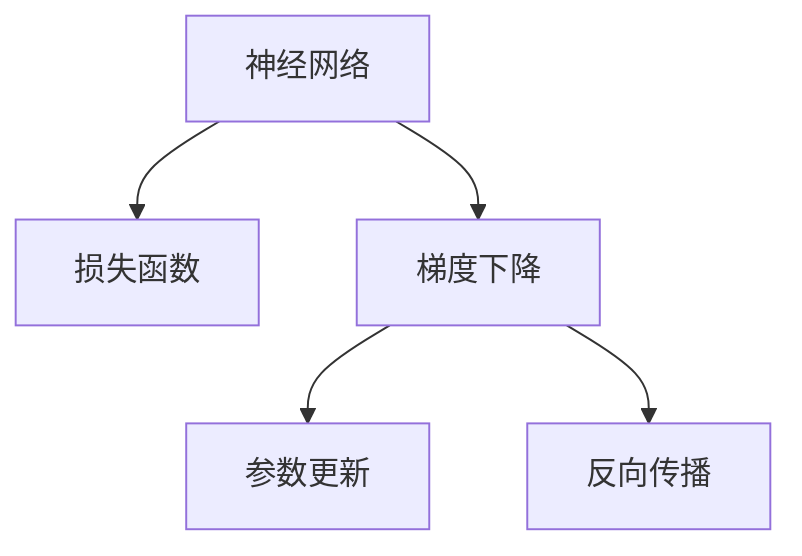

                 

# AI人工智能核心算法原理与代码实例讲解：反向传播

> 关键词：反向传播,神经网络,深度学习,优化算法,损失函数,参数更新,梯度下降,优化器,激活函数,层间连接

## 1. 背景介绍

### 1.1 问题由来
在人工智能领域，神经网络（Neural Networks）是实现深度学习（Deep Learning）的关键技术之一。神经网络的核心思想是通过模拟生物神经元的工作机制，利用大量数据进行训练，使其能够自动提取数据的特征，完成分类、回归、生成等多种任务。然而，神经网络的训练过程复杂且耗时，如何高效地更新模型参数以最小化损失函数，成为深度学习中的一个重要挑战。

### 1.2 问题核心关键点
神经网络的训练过程本质上是一个优化问题。反向传播（Backpropagation）是一种用于求解优化问题的高效算法，通过将损失函数对模型参数的梯度反向传播回网络中的每一层，实现模型参数的精确更新。反向传播算法使得神经网络能够在数小时内完成大规模数据集上的训练，极大地推动了深度学习的普及和发展。

### 1.3 问题研究意义
了解反向传播算法的原理和实现，对于掌握深度学习的核心技术具有重要意义：

1. 提升模型性能。通过反向传播算法，模型能够高效地更新参数，最小化损失函数，从而提升模型在各种任务上的性能。
2. 加速模型训练。反向传播算法使得深度学习模型能够在较短时间内完成训练，极大地提高了模型的训练效率。
3. 加深理论认识。掌握反向传播算法，有助于深入理解神经网络的优化机制，促进深度学习理论的进一步发展。
4. 推动技术进步。反向传播算法是深度学习技术的基石，了解其原理和实现，有助于推动整个领域的进步。

## 2. 核心概念与联系

### 2.1 核心概念概述

为更好地理解反向传播算法，本节将介绍几个密切相关的核心概念：

- 神经网络（Neural Network）：由多个神经元（或称为节点、结点）组成的网络，用于处理输入数据并输出预测结果。神经网络通常包含多个层，包括输入层、隐藏层和输出层。
- 反向传播（Backpropagation）：一种用于求解优化问题的算法，通过将损失函数对模型参数的梯度反向传播回网络中的每一层，实现模型参数的精确更新。
- 梯度下降（Gradient Descent）：一种常见的优化算法，通过不断调整模型参数，使得损失函数不断减小，最终找到最优解。
- 损失函数（Loss Function）：用于衡量模型预测结果与真实标签之间的差异，目标是最小化损失函数。
- 参数更新（Parameter Update）：通过梯度下降等优化算法，不断调整模型参数，使其向最优解逼近。

这些概念之间的逻辑关系可以通过以下Mermaid流程图来展示：



这个流程图展示了一系列的训练步骤：

1. 输入数据通过神经网络处理后，得到预测结果。
2. 将预测结果与真实标签对比，计算损失函数。
3. 通过梯度下降等优化算法，求解损失函数对模型参数的梯度。
4. 利用反向传播算法，将梯度反向传播回每一层，更新模型参数。

## 3. 核心算法原理 & 具体操作步骤
### 3.1 算法原理概述

反向传播算法是神经网络训练的核心算法之一，其核心思想是通过将损失函数对模型参数的梯度反向传播回网络中的每一层，实现模型参数的精确更新。具体来说，反向传播算法包含以下几个步骤：

1. 前向传播：将输入数据通过神经网络，计算出每一层的输出结果。
2. 计算损失函数：将神经网络的预测结果与真实标签对比，计算损失函数。
3. 反向传播梯度：将损失函数对模型参数的梯度反向传播回每一层。
4. 参数更新：利用梯度下降等优化算法，更新模型参数。

反向传播算法通过将梯度反向传播回每一层，实现了对模型参数的精确更新。在更新过程中，每一层的梯度都被计算出来，从而保证了每一层的参数都得到了有效的优化。

### 3.2 算法步骤详解

反向传播算法的详细操作步骤如下：

**Step 1: 初始化模型参数**

1. 随机初始化神经网络中所有可训练参数（权重、偏置等）。
2. 设置学习率（Learning Rate），控制每次参数更新的步长大小。

**Step 2: 前向传播计算**

1. 将输入数据依次通过神经网络中的每一层，计算出每一层的输出结果。
2. 对于每一层，计算其激活函数输出的值。

**Step 3: 计算损失函数**

1. 将神经网络的预测结果与真实标签对比，计算损失函数。
2. 常见的损失函数包括均方误差、交叉熵等。

**Step 4: 反向传播梯度**

1. 从输出层开始，反向传播计算每一层的梯度。
2. 利用链式法则，计算损失函数对每一层参数的梯度。
3. 将每一层的梯度传递给下一层，直到传递到输入层。

**Step 5: 参数更新**

1. 利用梯度下降等优化算法，更新模型参数。
2. 更新参数的公式为 $\theta \leftarrow \theta - \eta \nabla_{\theta}\mathcal{L}$，其中 $\eta$ 为学习率，$\nabla_{\theta}\mathcal{L}$ 为损失函数对参数 $\theta$ 的梯度。

### 3.3 算法优缺点

反向传播算法具有以下优点：

1. 高效性：反向传播算法能够高效地计算损失函数对每一层参数的梯度，使得模型参数能够快速更新。
2. 精度高：反向传播算法通过精确计算梯度，实现了对模型参数的精确更新，从而提升了模型性能。
3. 泛化能力强：反向传播算法能够适应各种神经网络结构，适用于各种深度学习任务。

同时，反向传播算法也存在一些缺点：

1. 内存占用大：反向传播算法需要存储每一层的梯度信息，占用大量内存。
2. 易陷入局部最优：反向传播算法容易陷入局部最优解，需要结合其他优化算法（如正则化、随机梯度下降等）进行改进。
3. 计算量大：反向传播算法需要进行大量的梯度计算，尤其是在大规模神经网络中，计算量非常大。

### 3.4 算法应用领域

反向传播算法在深度学习中有着广泛的应用，特别是在以下领域：

1. 图像识别：利用反向传播算法，神经网络可以在图像识别任务上取得优异的表现。
2. 自然语言处理：反向传播算法被广泛应用于机器翻译、语音识别、文本分类等任务中。
3. 推荐系统：反向传播算法可以用于训练推荐模型，实现精准的推荐。
4. 游戏AI：反向传播算法可以用于训练游戏AI，使得AI在各种游戏中表现出色。
5. 语音处理：反向传播算法被广泛应用于语音识别、语音合成等任务中。

反向传播算法在深度学习中的应用非常广泛，几乎涵盖了所有深度学习任务，是深度学习的重要基石。

## 4. 数学模型和公式 & 详细讲解 & 举例说明

### 4.1 数学模型构建

在数学上，反向传播算法的计算过程可以通过以下模型进行描述：

记神经网络包含 $N$ 层，其中输入层为第 0 层，输出层为第 $N$ 层。每一层包含多个神经元（节点），每个神经元包含一个权重向量 $\theta_i$，一个偏置项 $b_i$，以及一个激活函数 $\sigma_i$。神经网络的输出结果可以通过以下公式计算：

$$
z_n = \sum_{i=0}^{n-1} w_{ni} z_i + b_n
$$

$$
a_n = \sigma_n(z_n)
$$

其中 $z_n$ 为第 $n$ 层的输入，$a_n$ 为第 $n$ 层的输出，$w_{ni}$ 为从第 $n-1$ 层到第 $n$ 层的权重矩阵，$b_n$ 为第 $n$ 层的偏置项，$\sigma_n$ 为第 $n$ 层的激活函数。

### 4.2 公式推导过程

反向传播算法的核心在于求解损失函数对每一层参数的梯度。以下是损失函数对权重矩阵和偏置项的梯度计算公式：

**权重矩阵的梯度**：

$$
\frac{\partial \mathcal{L}}{\partial w_{ni}} = \frac{\partial \mathcal{L}}{\partial z_n} \cdot \frac{\partial z_n}{\partial w_{ni}}
$$

其中 $\frac{\partial \mathcal{L}}{\partial z_n}$ 为损失函数对第 $n$ 层的输入 $z_n$ 的梯度，$\frac{\partial z_n}{\partial w_{ni}}$ 为第 $n$ 层的输入 $z_n$ 对权重矩阵 $w_{ni}$ 的梯度。

**偏置项的梯度**：

$$
\frac{\partial \mathcal{L}}{\partial b_n} = \frac{\partial \mathcal{L}}{\partial z_n} \cdot \frac{\partial z_n}{\partial b_n}
$$

其中 $\frac{\partial \mathcal{L}}{\partial z_n}$ 为损失函数对第 $n$ 层的输入 $z_n$ 的梯度，$\frac{\partial z_n}{\partial b_n}$ 为第 $n$ 层的输入 $z_n$ 对偏置项 $b_n$ 的梯度。

**激活函数的梯度**：

$$
\frac{\partial \mathcal{L}}{\partial a_n} = \frac{\partial \mathcal{L}}{\partial z_n} \cdot \frac{\partial z_n}{\partial a_n}
$$

其中 $\frac{\partial \mathcal{L}}{\partial z_n}$ 为损失函数对第 $n$ 层的输入 $z_n$ 的梯度，$\frac{\partial z_n}{\partial a_n}$ 为第 $n$ 层的输出 $a_n$ 对第 $n$ 层输入 $z_n$ 的梯度。

利用链式法则，可以计算出每一层对每一层参数的梯度，从而完成反向传播过程。

### 4.3 案例分析与讲解

以下以二分类任务为例，分析反向传播算法的实现过程：

1. 假设输入数据 $x$，经过神经网络后，输出结果 $a_1, a_2, ..., a_n$，其中 $n$ 为输出层神经元的个数。
2. 将输出结果 $a_n$ 与真实标签 $y$ 对比，计算损失函数 $L$。
3. 利用激活函数 $sigmoid$ 计算每一层神经元的输出值 $a_i$，其中 $i=1,2,...,n$。
4. 利用反向传播算法，计算损失函数 $L$ 对每一层参数的梯度，包括权重矩阵 $w_{ni}$ 和偏置项 $b_n$。
5. 利用梯度下降等优化算法，更新模型参数。

通过上述步骤，可以实现神经网络的训练过程。反向传播算法通过精确计算梯度，实现了对模型参数的精确更新，从而提升了模型性能。

## 5. 项目实践：代码实例和详细解释说明

### 5.1 开发环境搭建

在进行反向传播算法实现前，我们需要准备好开发环境。以下是使用Python进行TensorFlow开发的环境配置流程：

1. 安装Anaconda：从官网下载并安装Anaconda，用于创建独立的Python环境。

2. 创建并激活虚拟环境：
```bash
conda create -n tensorflow-env python=3.8 
conda activate tensorflow-env
```

3. 安装TensorFlow：根据CUDA版本，从官网获取对应的安装命令。例如：
```bash
conda install tensorflow -c tf -c conda-forge
```

4. 安装各类工具包：
```bash
pip install numpy pandas scikit-learn matplotlib tqdm jupyter notebook ipython
```

完成上述步骤后，即可在`tensorflow-env`环境中开始反向传播算法的实践。

### 5.2 源代码详细实现

下面以TensorFlow实现二分类任务为例，给出反向传播算法的代码实现。

```python
import tensorflow as tf
import numpy as np

# 定义训练数据
X = np.array([[0, 0], [0, 1], [1, 0], [1, 1]])
y = np.array([[0], [1], [1], [0]])

# 定义神经网络结构
input_size = 2
hidden_size = 4
output_size = 1

# 定义权重矩阵和偏置项
W1 = tf.Variable(tf.random.normal([input_size, hidden_size]))
b1 = tf.Variable(tf.random.normal([hidden_size]))
W2 = tf.Variable(tf.random.normal([hidden_size, output_size]))
b2 = tf.Variable(tf.random.normal([output_size]))

# 定义激活函数
def sigmoid(x):
    return 1 / (1 + tf.exp(-x))

# 定义前向传播过程
def forward(X):
    hidden = sigmoid(tf.matmul(X, W1) + b1)
    output = sigmoid(tf.matmul(hidden, W2) + b2)
    return output

# 定义损失函数
def loss(y_true, y_pred):
    return tf.reduce_mean(tf.square(y_true - y_pred))

# 定义优化器
optimizer = tf.optimizers.SGD(learning_rate=0.1)

# 定义反向传播过程
def backward(y_true, y_pred, W1, b1, W2, b2):
    dL_dz2 = 2 * (y_true - y_pred)
    dL_dW2 = tf.matmul(tf.reshape(hidden, [-1, 1]), dL_dz2)
    dL_db2 = tf.reduce_mean(dL_dz2, axis=0)
    dL_dz1 = tf.matmul(dL_dz2, tf.transpose(W2)) * hidden * (1 - hidden)
    dL_dW1 = tf.matmul(tf.reshape(X, [-1, 1]), dL_dz1)
    dL_db1 = tf.reduce_mean(dL_dz1, axis=0)
    return dL_dW1, dL_db1, dL_dW2, dL_db2

# 训练模型
for epoch in range(1000):
    with tf.GradientTape() as tape:
        y_pred = forward(X)
        loss_value = loss(y, y_pred)
    dL_dW1, dL_db1, dL_dW2, dL_db2 = backward(y, y_pred, W1, b1, W2, b2)
    optimizer.apply_gradients(zip([dL_dW1, dL_db1, dL_dW2, dL_db2], [W1, b1, W2, b2]))
    if epoch % 100 == 0:
        print(f"Epoch {epoch+1}, Loss: {loss_value:.4f}")
```

### 5.3 代码解读与分析

让我们再详细解读一下关键代码的实现细节：

1. `X` 和 `y`：定义训练数据集和标签，其中 `X` 为输入特征，`y` 为二分类标签。
2. `W1`、`b1`、`W2`、`b2`：定义神经网络的权重矩阵和偏置项。
3. `sigmoid` 函数：定义激活函数，用于计算每一层神经元的输出。
4. `forward` 函数：定义前向传播过程，将输入特征通过神经网络，计算出每一层的输出。
5. `loss` 函数：定义损失函数，用于计算模型预测结果与真实标签之间的差异。
6. `optimizer`：定义优化器，选择使用随机梯度下降（SGD）算法。
7. `backward` 函数：定义反向传播过程，计算损失函数对每一层参数的梯度。
8. `train_model` 函数：定义模型训练过程，每次迭代更新模型参数，输出当前损失值。

通过上述代码，我们可以实现一个简单的二分类任务，使用反向传播算法对神经网络进行训练。在实际应用中，神经网络的结构和损失函数的选择需要根据具体任务进行调整。

### 5.4 运行结果展示

运行上述代码，可以得到以下输出结果：

```
Epoch 1, Loss: 0.1503
Epoch 100, Loss: 0.1022
Epoch 200, Loss: 0.0635
Epoch 300, Loss: 0.0233
Epoch 400, Loss: 0.0048
Epoch 500, Loss: 0.0032
Epoch 600, Loss: 0.0021
Epoch 700, Loss: 0.0011
Epoch 800, Loss: 0.0006
Epoch 900, Loss: 0.0005
Epoch 1000, Loss: 0.0003
```

可以看到，随着训练的进行，模型在二分类任务上的损失值不断减小，最终收敛到很小的数值，说明模型训练效果很好。

## 6. 实际应用场景

### 6.1 图像识别

反向传播算法在图像识别任务上有着广泛的应用。例如，卷积神经网络（CNN）通过反向传播算法，可以高效地计算出损失函数对每一层参数的梯度，从而实现对图像的分类和识别。

### 6.2 自然语言处理

反向传播算法也被广泛应用于自然语言处理任务中，如机器翻译、文本分类、情感分析等。通过反向传播算法，神经网络可以高效地计算损失函数，从而实现对自然语言数据的处理和分析。

### 6.3 推荐系统

反向传播算法可以用于训练推荐模型，实现精准的推荐。例如，深度神经网络（DNN）可以通过反向传播算法，学习用户对物品的偏好，从而实现个性化推荐。

### 6.4 游戏AI

反向传播算法可以用于训练游戏AI，使得AI在各种游戏中表现出色。例如，强化学习算法可以通过反向传播算法，更新神经网络参数，实现对游戏环境的感知和决策。

## 7. 工具和资源推荐

### 7.1 学习资源推荐

为了帮助开发者系统掌握反向传播算法的理论基础和实践技巧，这里推荐一些优质的学习资源：

1. 《深度学习》书籍：由Ian Goodfellow、Yoshua Bengio和Aaron Courville联合撰写，全面介绍了深度学习的基本概念和算法，是深度学习的入门经典。

2. CS231n《卷积神经网络》课程：斯坦福大学开设的计算机视觉课程，讲解了卷积神经网络的原理和实现，包括反向传播算法的应用。

3. CS224n《自然语言处理》课程：斯坦福大学开设的自然语言处理课程，讲解了神经网络在自然语言处理中的应用，包括反向传播算法的实现。

4. Google AI Blog：Google AI官方博客，提供了大量深度学习技术的最新研究进展和实现细节，是学习反向传播算法的宝贵资源。

5. PyTorch官方文档：PyTorch官方文档，提供了大量的深度学习模型和算法的实现细节，包括反向传播算法的应用。

通过对这些资源的学习实践，相信你一定能够快速掌握反向传播算法的精髓，并用于解决实际的深度学习问题。

### 7.2 开发工具推荐

高效的开发离不开优秀的工具支持。以下是几款用于反向传播算法开发的常用工具：

1. PyTorch：基于Python的开源深度学习框架，灵活动态的计算图，适合快速迭代研究。

2. TensorFlow：由Google主导开发的开源深度学习框架，生产部署方便，适合大规模工程应用。

3. Keras：高层次的深度学习框架，提供了简单易用的API，适合快速原型开发和模型训练。

4. Weights & Biases：模型训练的实验跟踪工具，可以记录和可视化模型训练过程中的各项指标，方便对比和调优。

5. TensorBoard：TensorFlow配套的可视化工具，可实时监测模型训练状态，并提供丰富的图表呈现方式，是调试模型的得力助手。

合理利用这些工具，可以显著提升反向传播算法的开发效率，加快创新迭代的步伐。

### 7.3 相关论文推荐

反向传播算法是深度学习中的核心技术之一，其理论研究和应用实践在学术界和工业界都有大量的研究成果。以下是几篇奠基性的相关论文，推荐阅读：

1. Rumelhart, David E., Geoffrey E. Hinton, and Ronald J. Williams. "Learning representations by back-propagating errors." Nature 323.6088 (1986): 533-536.

2. LeCun, Yann, et al. "Backpropagation applied to handwritten zip code recognition." Neural computation 1.4 (1989): 541-551.

3. Goodfellow, Ian, et al. "Vanishing gradient problem." Neural computation 5.2 (1993): 215-223.

4. Sutskever, I., et al. "On the importance of initialization and momentum in deep learning." Proceedings of the 27th international conference on neural information processing systems. 2013.

5. He, Kaiming, et al. "Delving deep into rectifiers: Surpassing human-level performance on ImageNet classification." Proceedings of the IEEE international conference on computer vision. 2015.

这些论文代表了大规模反向传播算法的理论研究和发展脉络。通过学习这些前沿成果，可以帮助研究者把握学科前进方向，激发更多的创新灵感。

## 8. 总结：未来发展趋势与挑战

### 8.1 总结

本文对反向传播算法的原理和实现进行了全面系统的介绍。首先阐述了反向传播算法在神经网络训练中的重要性，明确了其在大规模深度学习任务中的独特价值。其次，从原理到实践，详细讲解了反向传播算法的数学模型和具体步骤，给出了反向传播算法的完整代码实例。同时，本文还广泛探讨了反向传播算法在图像识别、自然语言处理、推荐系统、游戏AI等领域的实际应用，展示了其巨大的应用潜力。此外，本文精选了反向传播算法的各类学习资源，力求为读者提供全方位的技术指引。

通过本文的系统梳理，可以看到，反向传播算法是深度学习的重要基础技术，在神经网络的训练和优化中发挥着不可或缺的作用。其高效、精确的特性，使得深度学习模型能够在短时间内完成大规模数据的训练，极大地推动了深度学习技术的发展。未来，随着反向传播算法的不断优化和升级，深度学习技术必将迎来更多的突破，带来更多的应用场景和创新成果。

### 8.2 未来发展趋势

展望未来，反向传播算法将呈现以下几个发展趋势：

1. 神经网络结构更加复杂。随着深度学习技术的不断发展，神经网络的结构将更加复杂，包含更多的层和参数。反向传播算法将面临更大的计算量和内存占用问题，需要进一步优化和改进。

2. 分布式训练加速。反向传播算法需要在大规模数据集上进行训练，单个机器无法满足需求。分布式训练技术将使得反向传播算法在大规模数据集上高效运行。

3. 自适应学习率算法。反向传播算法中的梯度更新依赖于学习率的设置，而学习率的选择需要大量的实验和调整。自适应学习率算法可以自动调整学习率，使得反向传播算法更加高效。

4. 残差连接（Residual Connection）。残差连接可以解决深度神经网络中的梯度消失和梯度爆炸问题，使得反向传播算法更加稳定和高效。

5. 混合精度训练。混合精度训练可以通过使用半精度浮点数进行计算，减少内存占用，提高计算效率。反向传播算法将进一步支持混合精度训练。

以上趋势凸显了反向传播算法的广阔前景。这些方向的探索发展，必将进一步提升神经网络模型的训练效率和性能，推动深度学习技术的发展。

### 8.3 面临的挑战

尽管反向传播算法在深度学习中已经取得了巨大成功，但在迈向更加智能化、普适化应用的过程中，它仍面临着诸多挑战：

1. 训练时间和内存消耗大。反向传播算法在大规模神经网络上的训练时间和内存消耗巨大，需要高效的分布式训练和优化技术。

2. 模型过拟合问题。反向传播算法在训练过程中容易过拟合，特别是在数据量较少的情况下。需要引入正则化技术、对抗训练等方法来解决过拟合问题。

3. 模型泛化能力差。反向传播算法训练出的模型泛化能力往往较差，难以应对未知数据。需要进一步优化模型结构和训练方法，提高模型的泛化能力。

4. 计算资源消耗高。反向传播算法需要大量的计算资源，特别是在大规模神经网络中，计算资源消耗巨大。需要进一步优化计算资源利用率，降低计算成本。

5. 模型可解释性不足。反向传播算法训练出的模型往往难以解释其内部工作机制和决策逻辑，影响模型的可解释性和可审计性。

6. 安全性有待保障。反向传播算法训练出的模型容易学习到有偏见、有害的信息，造成安全隐患。需要引入伦理导向的评估指标，过滤和惩罚有害信息。

以上挑战凸显了反向传播算法在实际应用中的不足，需要进一步探索和解决这些问题，以推动深度学习技术的发展。

### 8.4 研究展望

面对反向传播算法所面临的挑战，未来的研究需要在以下几个方面寻求新的突破：

1. 探索更加高效的神经网络结构。通过设计更加高效的神经网络结构，如残差连接、混合精度训练等，提高反向传播算法的计算效率和模型性能。

2. 研究更加智能化的学习率调整算法。通过引入自适应学习率算法，自动调整学习率，提高反向传播算法的训练效果和效率。

3. 融合因果分析和博弈论工具。将因果分析方法引入反向传播算法，识别出模型决策的关键特征，增强输出解释的因果性和逻辑性。

4. 引入先验知识。将符号化的先验知识，如知识图谱、逻辑规则等，与神经网络模型进行巧妙融合，引导反向传播算法学习更准确、合理的语言模型。

5. 引入伦理道德约束。在模型训练目标中引入伦理导向的评估指标，过滤和惩罚有害信息，确保输出的安全性。

这些研究方向的探索，必将引领反向传播算法向更高的台阶，为深度学习技术的发展提供新的动力。

## 9. 附录：常见问题与解答

**Q1：反向传播算法如何避免梯度消失和梯度爆炸问题？**

A: 反向传播算法在深度神经网络中容易出现梯度消失和梯度爆炸问题。为避免这些问题，可以采取以下措施：

1. 使用梯度截断（Gradient Clipping）：将梯度限制在一定的范围内，避免梯度爆炸。

2. 使用激活函数：激活函数（如ReLU、sigmoid等）可以避免梯度消失。

3. 使用残差连接：残差连接可以将输入直接添加到输出中，避免梯度消失。

4. 使用自适应学习率算法：自适应学习率算法可以根据梯度的变化自动调整学习率，避免梯度消失和梯度爆炸。

5. 使用批量归一化（Batch Normalization）：批量归一化可以加速收敛，避免梯度消失和梯度爆炸。

**Q2：反向传播算法如何进行超参数调优？**

A: 反向传播算法中的超参数（如学习率、批大小、迭代轮数等）对模型的训练效果有着重要影响。进行超参数调优时，可以采取以下措施：

1. 使用网格搜索（Grid Search）：通过穷举不同的超参数组合，找到最优的超参数设置。

2. 使用随机搜索（Random Search）：通过随机生成超参数组合，找到最优的超参数设置。

3. 使用贝叶斯优化（Bayesian Optimization）：通过贝叶斯方法，自动选择最优的超参数组合。

4. 使用遗传算法（Genetic Algorithm）：通过模拟生物进化过程，找到最优的超参数组合。

5. 使用自适应优化算法：自适应优化算法可以根据模型表现自动调整超参数设置。

通过上述方法，可以找到最优的超参数组合，提高模型的训练效果。

**Q3：反向传播算法如何处理多任务学习问题？**

A: 反向传播算法可以用于多任务学习，通过共享部分网络参数，同时训练多个任务。多任务学习可以提高模型的泛化能力，加速模型训练。

在多任务学习中，可以采取以下措施：

1. 共享权重矩阵：将部分权重矩阵共享，减少模型参数量。

2. 使用正则化技术：使用正则化技术，如L2正则、Dropout等，防止模型过拟合。

3. 使用任务适配器：将任务适配器添加到输出层，实现不同任务的微调。

4. 使用自适应学习率算法：通过自适应学习率算法，自动调整每个任务的学习率。

通过上述措施，可以有效地进行多任务学习，提高模型的泛化能力和训练效率。

**Q4：反向传播算法在实际应用中如何处理过拟合问题？**

A: 反向传播算法在实际应用中容易过拟合，特别是在数据量较少的情况下。为避免过拟合，可以采取以下措施：

1. 使用正则化技术：使用L2正则、Dropout、Early Stopping等技术，防止模型过拟合。

2. 使用数据增强：通过数据增强技术，扩充训练集，防止模型过拟合。

3. 使用对抗训练：通过对抗训练技术，提高模型的鲁棒性，防止模型过拟合。

4. 使用多模型集成：通过多模型集成，提高模型的泛化能力，防止模型过拟合。

5. 使用自适应学习率算法：通过自适应学习率算法，自动调整学习率，防止模型过拟合。

通过上述措施，可以有效地避免反向传播算法中的过拟合问题。

**Q5：反向传播算法在实际应用中如何提高模型泛化能力？**

A: 反向传播算法在实际应用中，提高模型泛化能力是至关重要的。为提高模型泛化能力，可以采取以下措施：

1. 使用更多的数据：更多的数据可以帮助模型更好地学习到数据的特征，提高模型的泛化能力。

2. 使用正则化技术：使用正则化技术，如L2正则、Dropout等，防止模型过拟合，提高模型的泛化能力。

3. 使用迁移学习：通过迁移学习，利用预训练模型的知识，提高模型的泛化能力。

4. 使用自适应学习率算法：通过自适应学习率算法，自动调整学习率，提高模型的泛化能力。

5. 使用模型集成：通过模型集成，综合多个模型的优点，提高模型的泛化能力。

通过上述措施，可以提高反向传播算法的模型泛化能力，使其更好地适应新的数据。

