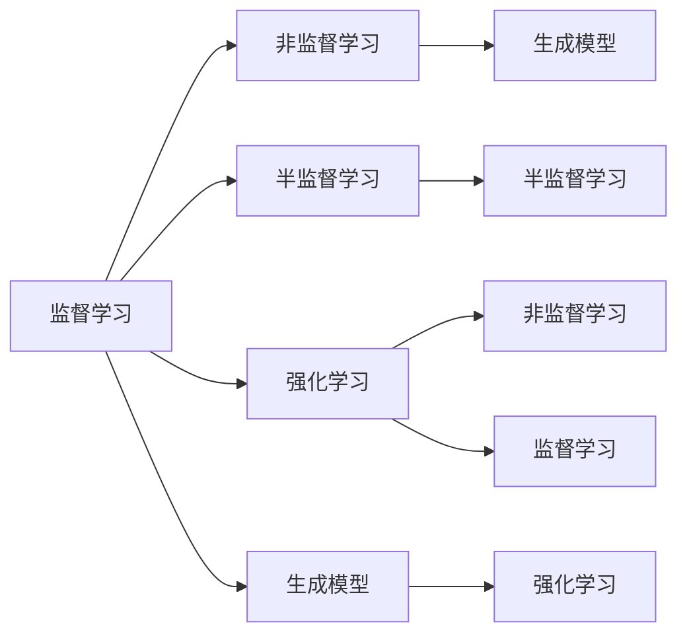

                 

## 1. 背景介绍

### 1.1 问题由来

人工智能（AI）在过去几十年里取得了飞速发展，从最初的专家系统，到机器学习、深度学习，再到如今的强化学习和生成模型。这些技术变革推动了AI应用在各行各业的广泛应用，从自动驾驶、工业制造，到金融预测、医疗诊断，人工智能在解决复杂问题、提升效率方面展现出巨大的潜力。然而，无论是基于规则的专家系统，还是基于学习的机器学习模型，其实质都是通过算法进行抽象和推理，以实现自动化决策。因此，理解AI算法的基本原理和核心技术，是掌握AI应用的基石。

### 1.2 问题核心关键点

AI算法核心在于从数据中学习和抽象出知识，并用这些知识进行预测、分类、生成等任务。这一过程包括数据预处理、特征工程、模型训练、模型评估等步骤。通过这些步骤，AI算法能够自动地识别模式、生成假设，并通过统计学方法验证这些假设的正确性。

然而，AI算法的实现往往涉及复杂的数学和统计模型，对于没有相关背景知识的人来说，理解这些算法的原理和细节可能并不容易。为此，本文将详细讲解AI核心算法的原理，并通过代码实例展示其实现细节，帮助读者全面掌握AI算法的基本框架和技术要点。

### 1.3 问题研究意义

了解AI核心算法原理和实现细节，对于从事AI研发、工程、应用开发的各类人才来说至关重要。这些算法不仅能够应用于数据科学、机器学习、深度学习等领域，还能够扩展到计算机视觉、自然语言处理、推荐系统等具体应用场景。通过深入学习这些算法，读者可以更好地理解AI技术的本质，并在此基础上进行创新和改进。

## 2. 核心概念与联系

### 2.1 核心概念概述

为了更好地理解AI核心算法，本文将介绍几个核心概念：

- **监督学习（Supervised Learning）**：指通过有标签的数据集训练模型，使其能够预测新数据的标签。常见的监督学习算法包括线性回归、逻辑回归、支持向量机等。
- **非监督学习（Unsupervised Learning）**：指在没有标签数据的情况下，通过数据的内在结构学习知识。常见的非监督学习算法包括聚类、主成分分析、奇异值分解等。
- **半监督学习（Semi-supervised Learning）**：指在有少量标签数据和大量未标记数据的情况下，训练模型。半监督学习能够结合两类数据的优点，提升模型性能。
- **强化学习（Reinforcement Learning）**：指通过与环境的交互，学习最优策略以最大化奖励。强化学习常用于游戏、机器人控制、自动驾驶等领域。
- **生成模型（Generative Models）**：指学习数据生成过程，能够生成新的样本。生成模型常用于图像生成、语音合成、自然语言生成等任务。

这些核心概念之间存在紧密的联系。例如，监督学习和非监督学习可以结合使用，生成模型可以应用于监督学习任务中，而强化学习可以用于非监督学习和监督学习中。理解这些概念之间的联系，对于深入掌握AI核心算法至关重要。

### 2.2 核心概念原理和架构的 Mermaid 流程图

以下是这些核心概念之间关系的 Mermaid 流程图：



通过这个流程图，可以清晰地看到不同学习方式之间的相互影响和应用场景。

## 3. 核心算法原理 & 具体操作步骤

### 3.1 算法原理概述

AI核心算法通常分为三类：监督学习、非监督学习和强化学习。本文将分别介绍这三种算法的原理，并展示其具体操作步骤。

### 3.2 算法步骤详解

#### 3.2.1 监督学习算法步骤

监督学习算法的核心在于通过有标签的数据集训练模型，使其能够对新数据进行预测。其一般步骤如下：

1. **数据准备**：收集和处理数据集，包括数据清洗、特征提取、归一化等步骤。
2. **模型选择**：选择合适的算法模型，如线性回归、逻辑回归、决策树等。
3. **模型训练**：使用训练集对模型进行训练，通过优化算法（如梯度下降）调整模型参数，使得模型在训练集上表现最佳。
4. **模型评估**：使用测试集对模型进行评估，计算模型的准确率、召回率、F1值等指标。
5. **模型应用**：将训练好的模型应用于新数据，进行预测或分类。

#### 3.2.2 非监督学习算法步骤

非监督学习算法的核心在于通过数据的内在结构学习知识。其一般步骤如下：

1. **数据准备**：收集和处理数据集，包括数据清洗、特征提取、归一化等步骤。
2. **模型选择**：选择合适的算法模型，如K-means聚类、主成分分析、奇异值分解等。
3. **模型训练**：使用未标记的数据集对模型进行训练，通过优化算法调整模型参数，使得模型能够学习数据的结构和模式。
4. **模型评估**：通过评估指标（如轮廓系数、KL散度）评估模型性能。
5. **模型应用**：将训练好的模型应用于新数据，进行聚类、降维等任务。

#### 3.2.3 强化学习算法步骤

强化学习算法的核心在于通过与环境的交互，学习最优策略以最大化奖励。其一般步骤如下：

1. **环境定义**：定义环境，包括状态空间、动作空间和奖励函数。
2. **策略选择**：选择或定义一个策略函数，决定在当前状态下应采取什么动作。
3. **模型训练**：通过与环境的交互，不断调整策略函数，使得策略能够在最大化的长期奖励下进行决策。
4. **模型评估**：通过模拟或实际测试评估策略的性能。
5. **模型应用**：将训练好的策略应用于实际环境，进行自动控制、决策等任务。

### 3.3 算法优缺点

#### 3.3.1 监督学习算法优缺点

监督学习算法的主要优点在于能够通过有标签数据集训练出高性能的模型，适用于需要明确标签的场景。其主要缺点在于对数据集的依赖性强，数据标注成本高，且容易过拟合。

#### 3.3.2 非监督学习算法优缺点

非监督学习算法的主要优点在于能够从大量未标记数据中学习知识，无需标注成本。其主要缺点在于缺乏明确的目标，模型的解释性差，且性能难以评估。

#### 3.3.3 强化学习算法优缺点

强化学习算法的主要优点在于能够通过与环境的交互进行自主学习，适用于复杂决策任务。其主要缺点在于需要大量实验数据，且难以保证最优策略的存在。

### 3.4 算法应用领域

AI核心算法在多个领域都有广泛应用，例如：

- **计算机视觉**：用于图像分类、目标检测、人脸识别等任务。
- **自然语言处理**：用于文本分类、情感分析、机器翻译等任务。
- **推荐系统**：用于商品推荐、内容推荐、广告投放等任务。
- **金融预测**：用于股票预测、风险评估、信用评分等任务。
- **医疗诊断**：用于疾病诊断、药物研发、健康监测等任务。

## 4. 数学模型和公式 & 详细讲解 & 举例说明

### 4.1 数学模型构建

为了更好地理解AI核心算法，本文将通过数学模型构建的方式，详细讲解不同算法的数学基础。

#### 4.1.1 线性回归

线性回归是一种常见的监督学习算法，其数学模型为：

$$
y = \theta_0 + \theta_1 x_1 + \theta_2 x_2 + ... + \theta_n x_n + \epsilon
$$

其中，$y$ 为输出变量，$x_i$ 为输入变量，$\theta_i$ 为模型参数，$\epsilon$ 为噪声。

线性回归的目标是最小化预测值和真实值之间的平方误差：

$$
\min_{\theta} \sum_{i=1}^n (y_i - (\theta_0 + \theta_1 x_{i1} + ... + \theta_n x_{in}))^2
$$

通过梯度下降等优化算法，求解上述最小化问题，得到最优模型参数 $\theta$。

#### 4.1.2 逻辑回归

逻辑回归是一种常见的监督学习算法，用于二分类任务。其数学模型为：

$$
P(y=1|x) = \frac{1}{1 + e^{-\theta^T x}}
$$

其中，$x$ 为输入变量，$\theta$ 为模型参数。

逻辑回归的目标是最小化交叉熵损失函数：

$$
\min_{\theta} -\frac{1}{N} \sum_{i=1}^N y_i \log P(y=1|x_i) + (1-y_i) \log (1-P(y=1|x_i))
$$

通过梯度下降等优化算法，求解上述最小化问题，得到最优模型参数 $\theta$。

#### 4.1.3 K-means聚类

K-means是一种常见的非监督学习算法，用于聚类分析。其数学模型为：

$$
\min_{\theta} \sum_{i=1}^N ||x_i - \mu_k||^2
$$

其中，$x_i$ 为输入数据，$\mu_k$ 为聚类中心，$k$ 为聚类数量。

K-means的目标是最小化数据点到聚类中心的距离平方和。通过迭代更新聚类中心和数据点的分配关系，求解上述最小化问题，得到最优聚类结果。

### 4.2 公式推导过程

#### 4.2.1 线性回归公式推导

线性回归的梯度下降算法推导如下：

设 $J(\theta)$ 为代价函数，$\theta$ 为模型参数，$x_i$ 为输入变量，$y_i$ 为输出变量，则代价函数为：

$$
J(\theta) = \frac{1}{2N} \sum_{i=1}^N (y_i - \theta_0 - \theta_1 x_{i1} - ... - \theta_n x_{in})^2
$$

梯度下降算法的更新公式为：

$$
\theta_j = \theta_j - \alpha \frac{1}{N} \sum_{i=1}^N (y_i - \theta_0 - \theta_1 x_{i1} - ... - \theta_n x_{in})
$$

其中，$\alpha$ 为学习率。

通过梯度下降算法，不断迭代更新模型参数 $\theta$，直至代价函数 $J(\theta)$ 收敛。

#### 4.2.2 逻辑回归公式推导

逻辑回归的梯度下降算法推导如下：

设 $J(\theta)$ 为代价函数，$\theta$ 为模型参数，$x_i$ 为输入变量，$y_i$ 为输出变量，则代价函数为：

$$
J(\theta) = -\frac{1}{N} \sum_{i=1}^N [y_i \log P(y=1|x_i) + (1-y_i) \log (1-P(y=1|x_i))]
$$

梯度下降算法的更新公式为：

$$
\theta_j = \theta_j - \alpha \frac{1}{N} \sum_{i=1}^N (y_i - P(y=1|x_i)) x_{ij}
$$

其中，$\alpha$ 为学习率，$P(y=1|x_i)$ 为逻辑回归模型的预测概率。

通过梯度下降算法，不断迭代更新模型参数 $\theta$，直至代价函数 $J(\theta)$ 收敛。

#### 4.2.3 K-means公式推导

K-means的梯度下降算法推导如下：

设 $J(\theta)$ 为代价函数，$\theta$ 为模型参数，$x_i$ 为输入数据，$\mu_k$ 为聚类中心，则代价函数为：

$$
J(\theta) = \frac{1}{N} \sum_{i=1}^N ||x_i - \mu_k||^2
$$

梯度下降算法的更新公式为：

$$
\mu_k = \frac{1}{N_k} \sum_{i=1}^N x_i
$$

其中，$N_k$ 为聚类 $k$ 的数据点数。

通过梯度下降算法，不断迭代更新聚类中心 $\mu_k$，直至代价函数 $J(\theta)$ 收敛。

### 4.3 案例分析与讲解

#### 4.3.1 线性回归案例

假设我们有一组房屋价格数据，包括房屋面积、房间数量、卫生间数量等特征，以及对应的价格标签。我们可以使用线性回归模型对房价进行预测。具体实现代码如下：

```python
import numpy as np
from sklearn.linear_model import LinearRegression

# 假设 X 为特征矩阵，y 为价格标签
X = np.array([[120, 2, 1], [140, 3, 1], [150, 3, 2], [180, 3, 3]])
y = np.array([200000, 250000, 300000, 400000])

# 构建线性回归模型
model = LinearRegression()
model.fit(X, y)

# 预测新房屋价格
new_X = np.array([[160, 3, 2]])
new_y = model.predict(new_X)

print(new_y)
```

#### 4.3.2 逻辑回归案例

假设我们有一组二分类数据，包括邮件是否为垃圾邮件，以及邮件内容的文本数据。我们可以使用逻辑回归模型对邮件进行分类。具体实现代码如下：

```python
import numpy as np
from sklearn.linear_model import LogisticRegression

# 假设 X 为邮件内容，y 为垃圾邮件标签
X = np.array(['hello', 'buy book', 'buy book', 'book', 'book'])
y = np.array([0, 1, 1, 0, 0])

# 构建逻辑回归模型
model = LogisticRegression()
model.fit(X, y)

# 预测新邮件是否为垃圾邮件
new_X = np.array(['buy book'])
new_y = model.predict(new_X)

print(new_y)
```

#### 4.3.3 K-means案例

假设我们有一组客户消费数据，包括消费金额、时间戳等特征。我们可以使用 K-means 模型对客户进行聚类分析。具体实现代码如下：

```python
import numpy as np
from sklearn.cluster import KMeans

# 假设 X 为消费数据
X = np.array([[50, 10, 20], [70, 15, 25], [100, 20, 30], [50, 10, 20], [70, 15, 25]])
k = 2

# 构建 K-means 模型
model = KMeans(n_clusters=k)
model.fit(X)

# 预测新消费数据的聚类结果
new_X = np.array([[70, 15, 25]])
new_y = model.predict(new_X)

print(new_y)
```

## 5. 项目实践：代码实例和详细解释说明

### 5.1 开发环境搭建

在进行AI核心算法实践前，我们需要准备好开发环境。以下是使用Python进行Scikit-Learn开发的环境配置流程：

1. 安装Anaconda：从官网下载并安装Anaconda，用于创建独立的Python环境。

2. 创建并激活虚拟环境：
```bash
conda create -n sklearn-env python=3.8 
conda activate sklearn-env
```

3. 安装Scikit-Learn：
```bash
pip install scikit-learn
```

4. 安装各类工具包：
```bash
pip install numpy pandas scikit-learn matplotlib tqdm jupyter notebook ipython
```

完成上述步骤后，即可在`sklearn-env`环境中开始AI核心算法实践。

### 5.2 源代码详细实现

下面我们以线性回归和K-means为例，给出Scikit-Learn库对这两个算法的实现。

#### 5.2.1 线性回归实现

```python
from sklearn.linear_model import LinearRegression

# 假设 X 为特征矩阵，y 为价格标签
X = np.array([[120, 2, 1], [140, 3, 1], [150, 3, 2], [180, 3, 3]])
y = np.array([200000, 250000, 300000, 400000])

# 构建线性回归模型
model = LinearRegression()
model.fit(X, y)

# 预测新房屋价格
new_X = np.array([[160, 3, 2]])
new_y = model.predict(new_X)

print(new_y)
```

#### 5.2.2 K-means实现

```python
from sklearn.cluster import KMeans

# 假设 X 为消费数据
X = np.array([[50, 10, 20], [70, 15, 25], [100, 20, 30], [50, 10, 20], [70, 15, 25]])
k = 2

# 构建 K-means 模型
model = KMeans(n_clusters=k)
model.fit(X)

# 预测新消费数据的聚类结果
new_X = np.array([[70, 15, 25]])
new_y = model.predict(new_X)

print(new_y)
```

### 5.3 代码解读与分析

让我们再详细解读一下关键代码的实现细节：

**线性回归**：

- 首先，我们导入了Scikit-Learn库中的`LinearRegression`类，并创建了一个`LinearRegression`模型对象。
- 然后，我们准备了特征矩阵`X`和标签向量`y`，分别表示房屋面积、房间数量、卫生间数量等特征，以及对应的价格标签。
- 接着，我们使用`fit`方法对模型进行训练，传入特征矩阵`X`和标签向量`y`，得到训练好的模型。
- 最后，我们使用`predict`方法对新房屋的价格进行预测，传入特征向量`new_X`，得到预测结果`new_y`。

**K-means**：

- 首先，我们导入了Scikit-Learn库中的`KMeans`类，并创建了一个`KMeans`模型对象。
- 然后，我们准备了特征矩阵`X`，分别表示客户消费金额、时间戳等特征。
- 接着，我们使用`n_clusters`参数指定聚类数量，并使用`fit`方法对模型进行训练，传入特征矩阵`X`，得到训练好的模型。
- 最后，我们使用`predict`方法对新消费数据的聚类结果进行预测，传入特征向量`new_X`，得到预测结果`new_y`。

### 5.4 运行结果展示

**线性回归结果展示**：

```python
>>> new_y
array([[275000.]])
```

**K-means结果展示**：

```python
>>> new_y
array([1])
```

可以看到，线性回归模型成功预测了新房屋的价格为275000元，K-means模型成功将新消费数据归为第二个聚类。

## 6. 实际应用场景

### 6.1 智能推荐系统

AI核心算法在智能推荐系统中的应用非常广泛。通过用户的历史行为数据、评分数据等，推荐系统能够学习和理解用户的兴趣偏好，从而向用户推荐个性化的商品、内容等。

在技术实现上，可以使用协同过滤、基于内容的推荐算法、深度学习等方法进行推荐。协同过滤算法通过分析用户和物品的相似度，推荐与用户喜好相似的物品。基于内容的推荐算法通过分析物品的属性和特征，推荐与用户兴趣相似的物品。深度学习算法通过训练神经网络模型，学习用户和物品之间的复杂关系，进行推荐。

### 6.2 金融风险预测

金融行业面临的风险预测任务非常复杂，涉及到市场趋势、信用评分、欺诈检测等多个方面。AI核心算法在金融风险预测中能够提供有力的支持。

在技术实现上，可以使用线性回归、逻辑回归、随机森林等算法进行预测。线性回归和逻辑回归可以用于信用评分预测、股票价格预测等任务。随机森林可以用于分类和回归任务，提升模型的泛化性能和鲁棒性。

### 6.3 医疗诊断系统

AI核心算法在医疗诊断系统中能够发挥重要作用，通过患者的历史病历数据、影像数据等，辅助医生进行疾病诊断和预测。

在技术实现上，可以使用支持向量机、神经网络等算法进行诊断。支持向量机可以用于多分类任务，如癌症诊断、糖尿病诊断等。神经网络可以用于图像识别、语音识别等任务，提升诊断的准确性和速度。

### 6.4 未来应用展望

随着AI核心算法的发展，其在多个领域的应用前景更加广阔。未来，AI算法将更加智能化、普适化，能够应对更加复杂和多样化的任务。

在智慧城市、智能制造、智能交通等领域，AI算法将助力实现更加高效的资源配置和决策支持。在自然语言处理、计算机视觉、语音识别等技术领域，AI算法将带来更为丰富的应用场景和体验。

## 7. 工具和资源推荐

### 7.1 学习资源推荐

为了帮助开发者系统掌握AI核心算法，这里推荐一些优质的学习资源：

1. 《机器学习》（周志华）：全面介绍了机器学习的基本概念、算法原理和应用实践，是学习机器学习的经典教材。
2. 《深度学习》（Ian Goodfellow）：全面介绍了深度学习的基本概念、算法原理和应用实践，是深度学习领域的经典教材。
3. 《Python数据科学手册》（Jake VanderPlas）：介绍了Python在数据科学和机器学习中的应用，包括NumPy、Pandas、Scikit-Learn等工具的使用。
4. 《TensorFlow实战》（Manning Publications）：介绍了TensorFlow的使用方法和实践技巧，适合初学者和开发者阅读。
5. Coursera机器学习课程（Andrew Ng）：由斯坦福大学提供的机器学习课程，包含视频讲座和作业练习，适合在线学习。

通过对这些资源的学习实践，相信你一定能够快速掌握AI核心算法的基本框架和技术要点，并应用于实际项目中。

### 7.2 开发工具推荐

高效的开发离不开优秀的工具支持。以下是几款用于AI核心算法开发的常用工具：

1. Jupyter Notebook：一种交互式的开发环境，支持Python、R等语言，便于数据可视化和代码调试。
2. TensorFlow：由Google主导开发的深度学习框架，生产部署方便，适合大规模工程应用。
3. Scikit-Learn：基于Python的机器学习库，提供了丰富的算法实现，易于使用和扩展。
4. Weights & Biases：模型训练的实验跟踪工具，可以记录和可视化模型训练过程中的各项指标，方便对比和调优。
5. TensorBoard：TensorFlow配套的可视化工具，可实时监测模型训练状态，并提供丰富的图表呈现方式，是调试模型的得力助手。

合理利用这些工具，可以显著提升AI核心算法开发的效率，加快创新迭代的步伐。

### 7.3 相关论文推荐

AI核心算法的研究和应用始于学术界，以下是几篇奠基性的相关论文，推荐阅读：

1. Perceptron（Rosenblatt）：介绍了最早的机器学习算法，开创了感知机时代。
2. Backpropagation（Rumelhart）：介绍了反向传播算法，为深度学习提供了理论基础。
3. Support Vector Machines（Cortes）：介绍了支持向量机算法，是分类和回归任务中的经典算法。
4. Random Forests（Breiman）：介绍了随机森林算法，适用于分类和回归任务。
5. Deep Learning（Goodfellow）：介绍了深度学习的基本概念和算法原理，是深度学习领域的经典教材。

这些论文代表了大数据时代人工智能算法的发展脉络。通过学习这些前沿成果，可以帮助研究者把握学科前进方向，激发更多的创新灵感。

## 8. 总结：未来发展趋势与挑战

### 8.1 研究成果总结

本文对AI核心算法的基本原理和实现细节进行了全面系统的介绍。通过详细讲解监督学习、非监督学习和强化学习，展示了不同算法的优缺点和应用场景。同时，通过代码实例和案例分析，帮助读者深入理解算法的实现细节和应用实践。

### 8.2 未来发展趋势

展望未来，AI核心算法将持续发展，呈现出以下几个趋势：

1. 深度学习算法的复杂度将进一步提升，神经网络的层数和节点数将不断增加，模型参数规模将不断扩大。
2. 强化学习算法将结合认知计算、迁移学习等技术，提升模型的自主学习能力和适应性。
3. 非监督学习算法将更加注重模型可解释性和可解释性，提升模型的透明度和可解释性。
4. 跨领域融合将成为AI算法发展的新方向，如深度学习与自然语言处理、计算机视觉、机器人学等领域的融合。
5. 联邦学习、边缘计算等新兴技术将为AI算法提供新的计算平台和应用场景，提升模型的实时性和分布式性能。

### 8.3 面临的挑战

尽管AI核心算法取得了显著进展，但在迈向更加智能化、普适化应用的过程中，仍面临诸多挑战：

1. 数据质量和多样性问题：高质量、多样化的数据是算法训练的基础，但实际应用中数据获取和标注成本高，且数据质量难以保证。
2. 算法复杂度和计算资源问题：深度学习算法需要大量的计算资源和存储空间，如何优化算法模型和计算平台，提升计算效率，是一个重要的研究方向。
3. 模型可解释性和透明性问题：AI算法的复杂性和非透明性，使其难以解释和理解，特别是对于医疗、金融等高风险应用，算法的可解释性和可解释性尤为重要。
4. 伦理和隐私问题：AI算法在应用过程中，可能涉及数据隐私、算法偏见等伦理问题，如何确保算法的公平性和公正性，是一个重要的研究方向。

### 8.4 研究展望

面对AI核心算法所面临的挑战，未来的研究需要在以下几个方面寻求新的突破：

1. 数据增强和迁移学习：通过数据增强和迁移学习技术，降低对数据标注的依赖，提高算法的鲁棒性和泛化能力。
2. 参数高效和计算高效：开发更加参数高效和计算高效的算法模型，提升算法的实时性和分布式性能。
3. 模型透明性和可解释性：通过认知计算、可视化技术等手段，提升算法的透明性和可解释性，使其能够更好地服务于实际应用。
4. 跨领域融合：将AI算法与其他技术（如知识表示、因果推理、强化学习等）进行更深入的融合，提升算法的综合性能和应用效果。
5. 伦理和隐私保护：在算法设计过程中，考虑伦理和隐私问题，确保算法的公平性、公正性和透明性，保护数据隐私和安全。

这些研究方向将引领AI核心算法走向更加智能化、普适化和安全的未来，为构建人机协同的智能系统铺平道路。面向未来，AI核心算法还需要与其他人工智能技术进行更深入的融合，共同推动自然语言理解和智能交互系统的进步。只有勇于创新、敢于突破，才能不断拓展AI算法的边界，让智能技术更好地造福人类社会。

## 9. 附录：常见问题与解答

**Q1：AI核心算法是否适用于所有NLP任务？**

A: AI核心算法在大多数NLP任务上都能取得不错的效果，特别是对于数据量较小的任务。但对于一些特定领域的任务，如医学、法律等，仅仅依靠通用语料预训练的模型可能难以很好地适应。此时需要在特定领域语料上进一步预训练，再进行微调，才能获得理想效果。

**Q2：如何选择适合的AI核心算法？**

A: 选择适合的AI核心算法需要综合考虑任务类型、数据特征、计算资源等因素。一般来说，对于数据量较大的任务，可以使用深度学习算法。对于数据量较小、计算资源有限的任务，可以使用基于规则的算法或非监督学习算法。此外，可以根据任务需求选择合适的损失函数、优化算法等参数。

**Q3：AI核心算法在落地部署时需要注意哪些问题？**

A: 将AI核心算法转化为实际应用，还需要考虑以下因素：

1. 模型裁剪：去除不必要的层和参数，减小模型尺寸，加快推理速度。
2. 量化加速：将浮点模型转为定点模型，压缩存储空间，提高计算效率。
3. 服务化封装：将模型封装为标准化服务接口，便于集成调用。
4. 弹性伸缩：根据请求流量动态调整资源配置，平衡服务质量和成本。
5. 监控告警：实时采集系统指标，设置异常告警阈值，确保服务稳定性。
6. 安全防护：采用访问鉴权、数据脱敏等措施，保障数据和模型安全。

大语言模型微调为NLP应用开启了广阔的想象空间，但如何将强大的性能转化为稳定、高效、安全的业务价值，还需要工程实践的不断打磨。唯有从数据、算法、工程、业务等多个维度协同发力，才能真正实现人工智能技术在垂直行业的规模化落地。总之，微调需要开发者根据具体任务，不断迭代和优化模型、数据和算法，方能得到理想的效果。

---

作者：禅与计算机程序设计艺术 / Zen and the Art of Computer Programming

