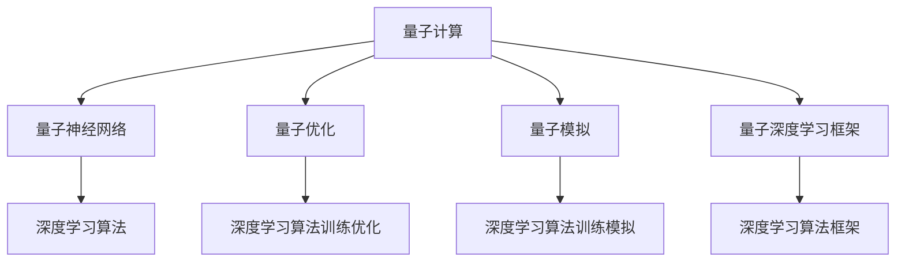

                 

# AI人工智能深度学习算法：在量子计算中的应用

> 关键词：深度学习算法,量子计算,量子神经网络,量子优化,量子模拟

## 1. 背景介绍

### 1.1 问题由来
随着量子计算技术的快速发展，其在深度学习算法中的应用也逐步引起了广泛的关注。深度学习作为人工智能的核心技术，已经成功地应用于诸如自然语言处理、图像识别、语音识别等领域，并取得了巨大的突破。然而，传统的基于经典计算机的深度学习算法，在处理大规模、高维度的数据时，面临着计算资源耗尽、模型复杂度过高等问题。量子计算的出现，为深度学习算法提供了一种全新的计算范式，有望显著提升算法的效率和性能。

量子计算利用量子比特（qubit）的并行计算能力和量子纠缠的特性，可以在某些情况下实现指数级加速。量子神经网络（Quantum Neural Network, QNN）和量子优化（Quantum Optimization）等量子深度学习算法，已经在一些特定问题上展现出了卓越的潜力。然而，由于量子计算硬件的限制，当前量子深度学习算法还处于初步探索阶段，许多理论和算法尚需进一步完善。

### 1.2 问题核心关键点
当前，深度学习算法在量子计算中的应用主要集中在以下几个方面：
1. 量子神经网络（QNN）：利用量子比特的量子态演化特性，构建量子神经网络，实现复杂的非线性映射和计算。
2. 量子优化：利用量子计算的并行处理能力，优化深度学习算法的训练过程，提高模型收敛速度。
3. 量子模拟：利用量子计算模拟深度学习算法在经典计算机上的训练和推理过程，探索量子计算的潜力和局限。
4. 量子深度学习框架：开发量子计算友好的深度学习框架，提供量子计算硬件的接口和算法支持。

这些关键点共同构成了深度学习在量子计算应用的核心方向，其研究成果有望在未来的量子计算机上实现大规模应用，推动人工智能技术的进一步发展。

## 2. 核心概念与联系

### 2.1 核心概念概述

为更好地理解深度学习算法在量子计算中的应用，本节将介绍几个密切相关的核心概念：

- 量子计算（Quantum Computing）：利用量子比特（qubit）和量子纠缠（Entanglement）等量子特性，进行并行计算的计算模型。
- 量子神经网络（Quantum Neural Network, QNN）：结合经典神经网络和量子计算原理，利用量子比特进行信息处理和计算的神经网络模型。
- 量子优化（Quantum Optimization）：利用量子计算的并行处理能力和量子隧穿效应，优化深度学习算法的训练过程，提高模型收敛速度。
- 量子模拟（Quantum Simulation）：利用量子计算机模拟经典计算机上的深度学习算法，探索量子计算的潜力和局限。
- 量子深度学习框架：提供量子计算硬件接口和量子深度学习算法的深度学习框架。

这些核心概念之间的逻辑关系可以通过以下Mermaid流程图来展示：



这个流程图展示了量子计算与深度学习算法之间的逻辑关系：

1. 量子计算提供了量子比特的计算资源，为深度学习算法提供了并行计算能力。
2. 量子神经网络结合量子计算原理，构建了新的神经网络模型，突破了经典神经网络的局限。
3. 量子优化利用量子计算的特性，优化了深度学习算法的训练过程。
4. 量子模拟在经典计算机上模拟量子计算，探索量子计算的潜力和局限。
5. 量子深度学习框架提供了量子计算硬件的接口和算法支持，推动量子深度学习的发展。

这些概念共同构成了深度学习在量子计算应用的框架，为实现量子深度学习算法奠定了理论基础。

## 3. 核心算法原理 & 具体操作步骤
### 3.1 算法原理概述

量子深度学习算法在处理深度学习问题时，利用量子计算的特性，能够突破经典计算机的计算能力限制，实现更加高效的计算和优化。

以量子神经网络（QNN）为例，QNN通过量子门操作（Quantum Gate Operation）对量子比特进行状态演化，模拟经典神经网络的计算过程。QNN的基本单位是量子节点（Quantum Node），每个量子节点包含一个量子比特，并通过量子门操作对量子比特进行变换。通过量子叠加和量子纠缠等量子特性，QNN能够在单个量子比特上实现复杂的多层非线性计算，从而实现更加高效的特征提取和模式识别。

量子优化算法则利用量子计算的并行处理能力，通过量子隧穿效应等量子特性，加速深度学习算法的训练过程。在量子优化中，量子比特表示优化变量的状态，量子门操作表示优化算法的计算步骤。通过量子隧穿效应，量子优化算法能够在单个量子比特上实现多个优化步骤的并行计算，显著提高优化效率。

量子模拟算法则是利用量子计算模拟经典计算机上的深度学习算法，探索量子计算的潜力和局限。通过量子计算模拟，研究人员能够在量子计算机上运行深度学习算法，探索量子计算的实际应用效果。

### 3.2 算法步骤详解

以量子神经网络（QNN）为例，其核心步骤如下：

**Step 1: 量子比特初始化**
- 初始化量子比特，将其置于量子叠加态（Quantum Superposition）或量子纠缠态（Quantum Entanglement），准备输入信息。

**Step 2: 量子门操作**
- 对量子比特进行量子门操作，模拟经典神经网络的计算过程。
- 量子门操作包括单比特门（Single-Qubit Gate）和双比特门（Two-Qubit Gate），如Hadamard门（H门）、CNOT门、量子傅里叶变换等。

**Step 3: 量子态演化**
- 量子比特通过量子门操作进行状态演化，实现量子叠加和量子纠缠。
- 量子态演化过程可以通过量子线路（Quantum Circuit）进行描述，每一步演化由量子门操作表示。

**Step 4: 量子测量**
- 对量子比特进行量子测量，将量子比特的状态转化为经典比特（Classical Bit）。
- 量子测量结果表示量子比特的量子态，即经典比特的输出。

**Step 5: 反向传播和优化**
- 利用经典计算机对量子测量结果进行反向传播，计算梯度信息。
- 利用经典计算机进行优化算法（如随机梯度下降、Adam等）更新量子门操作的参数，以最小化损失函数。

**Step 6: 重复迭代**
- 重复执行Step 1到Step 5，直到模型收敛。

以上步骤详细描述了量子神经网络的基本工作流程，通过量子比特的量子态演化和量子测量，实现高效的特征提取和模式识别。

### 3.3 算法优缺点

量子深度学习算法在深度学习中的应用具有以下优点：
1. 高效计算：利用量子计算的并行处理能力和量子纠缠特性，能够在单个量子比特上实现复杂的多层非线性计算，显著提升计算效率。
2. 优化加速：通过量子隧穿效应等量子特性，能够加速深度学习算法的训练过程，提高模型收敛速度。
3. 高精度：利用量子计算的特性，能够处理高维度的复杂问题，提高深度学习算法的精度。

然而，量子深度学习算法也存在一些缺点：
1. 硬件限制：当前量子计算硬件尚未完全成熟，量子比特的错误率高，量子线路的噪声问题严重。
2. 理论不成熟：量子深度学习算法的理论基础尚需进一步完善，许多问题尚无统一解释和解决方案。
3. 实现复杂：量子深度学习算法的实现复杂度高，需要大量的硬件资源和技术支持。
4. 适用性有限：量子深度学习算法适用于特定的量子计算任务，其应用范围有限。

尽管存在这些局限，但随着量子计算技术的不断发展，量子深度学习算法有望在未来的深度学习领域发挥更大的作用。

### 3.4 算法应用领域

量子深度学习算法在深度学习中的应用主要集中在以下几个领域：

- 自然语言处理（Natural Language Processing, NLP）：如文本分类、语言翻译、情感分析等。通过量子计算加速NLP算法，提升处理速度和精度。
- 图像识别（Image Recognition）：如图像分类、目标检测、图像分割等。利用量子计算处理高维度的图像数据，提高识别准确率和处理速度。
- 语音识别（Speech Recognition）：如语音转文本、情感识别等。通过量子计算优化语音信号的处理过程，提高识别效果和速度。
- 量子计算优化：如线性规划、组合优化、调度优化等。利用量子计算优化深度学习算法的训练过程，提高优化效率。
- 量子模拟：如量子化学模拟、量子物理模拟等。利用量子计算模拟深度学习算法，探索量子计算的潜力和局限。

这些领域展示了量子深度学习算法的广泛应用前景，为未来深度学习技术的发展提供了新的方向。

## 4. 数学模型和公式 & 详细讲解  
### 4.1 数学模型构建

本节将使用数学语言对量子深度学习算法进行更加严格的刻画。

记量子神经网络（QNN）的输入为 $x$，输出为 $y$，网络参数为 $\theta$。假设网络包含 $N$ 个量子节点，每个量子节点由单比特门 $H$ 和双比特门 $CNOT$ 组成。QNN的数学模型可以表示为：

$$
y = \mathcal{N}(\theta)(x) = \prod_{i=1}^N (CNOT)_{i-1} (H)_{i-1} \cdots (CNOT)_1 (H)_1 (CNOT)_0 (H)_0 x
$$

其中 $\mathcal{N}(\theta)$ 表示QNN的非线性映射，$CNOT$ 和 $H$ 分别表示双比特门和单比特门，$\theta$ 表示量子门操作的参数。

### 4.2 公式推导过程

以下我们以量子优化算法为例，推导其基本公式。

假设深度学习算法的损失函数为 $L(\theta)$，利用经典计算机进行优化。通过量子计算机对损失函数进行模拟，得到量子优化算法的目标函数 $L_Q(\theta)$。假设量子比特的状态表示为 $|\psi\rangle$，量子优化算法的目标是通过量子门操作对 $|\psi\rangle$ 进行优化，使得 $L_Q(\theta)$ 最小化。

根据量子计算的原理，量子比特的状态演化可以表示为：

$$
|\psi'\rangle = \mathcal{U}(|\psi\rangle)
$$

其中 $\mathcal{U}$ 表示量子变换操作，$|\psi'\rangle$ 表示优化后的量子比特状态。

通过量子计算模拟，可以计算出量子比特的演化矩阵 $\mathcal{U}$，表示量子优化算法的计算步骤。利用经典计算机对 $|\psi'\rangle$ 进行测量，得到经典比特的输出 $y$。将 $y$ 代入损失函数 $L(\theta)$，计算出优化后的损失函数 $L_Q(\theta)$。

利用量子优化算法，最小化 $L_Q(\theta)$，得到最优参数 $\theta^*$，即为深度学习算法训练的优化结果。

### 4.3 案例分析与讲解

以量子优化算法为例，以下是一个简单的案例分析：

假设深度学习算法的损失函数为 $L(\theta) = (x-\theta)^2$，利用量子计算机进行优化。假设量子比特的状态为 $|\psi\rangle = (0+1i)$，量子优化算法的目标是通过量子门操作对 $|\psi\rangle$ 进行优化。

首先，定义单比特门 $H$ 和双比特门 $CNOT$，表示量子优化算法的计算步骤。假设量子优化算法包含两个量子比特，每个量子比特分别表示深度学习算法的一个参数。通过量子计算模拟，可以计算出量子比特的演化矩阵 $\mathcal{U}$，表示量子优化算法的计算步骤。

利用经典计算机对 $|\psi'\rangle$ 进行测量，得到经典比特的输出 $y$。将 $y$ 代入损失函数 $L(\theta)$，计算出优化后的损失函数 $L_Q(\theta)$。通过最小化 $L_Q(\theta)$，得到最优参数 $\theta^*$，即为深度学习算法训练的优化结果。

## 5. 项目实践：代码实例和详细解释说明
### 5.1 开发环境搭建

在进行量子深度学习实践前，我们需要准备好开发环境。以下是使用Python进行Qiskit开发的环境配置流程：

1. 安装Anaconda：从官网下载并安装Anaconda，用于创建独立的Python环境。

2. 创建并激活虚拟环境：
```bash
conda create -n qiskit-env python=3.8 
conda activate qiskit-env
```

3. 安装Qiskit：从官网获取Qiskit的安装命令。例如：
```bash
pip install qiskit
```

4. 安装各类工具包：
```bash
pip install numpy pandas scikit-learn matplotlib tqdm jupyter notebook ipython
```

完成上述步骤后，即可在`qiskit-env`环境中开始量子深度学习实践。

### 5.2 源代码详细实现

下面我们以量子神经网络（QNN）为例，给出使用Qiskit进行量子计算的PyTorch代码实现。

首先，定义量子神经网络的结构：

```python
from qiskit import QuantumCircuit, Aer, execute
from qiskit.aqua import QuantumInstance
from qiskit.aqua.components.optimizers import AerOptimizer

# 定义量子神经网络结构
n_qubits = 3  # 量子比特数
n_layers = 2  # 层数

# 创建量子线路
quantum_circuit = QuantumCircuit(n_qubits, n_qubits)

# 添加量子门
for layer in range(n_layers):
    quantum_circuit.h(range(n_qubits))  # 添加Hadamard门
    quantum_circuit.cx(0, 1)  # 添加CNOT门

# 输出量子线路
print(quantum_circuit)
```

然后，定义量子优化算法：

```python
from qiskit import BasicAer

# 定义优化器
optimizer = AerOptimizer(BasicAer.get_backend('qasm_simulator'))

# 定义量子优化算法的目标函数
def objective_function(theta):
    # 根据theta构造量子线路
    theta = np.array(theta)
    quantum_circuit.set_parameter_values(theta)
    
    # 执行量子线路，得到量子比特的输出
    result = execute(quantum_circuit, backend=BasicAer.get_backend('qasm_simulator')).result()
    counts = result.get_counts()
    
    # 计算损失函数
    return -np.log(counts['00'] / (counts['00'] + counts['01']))
```

接着，使用经典计算机对量子优化算法进行求解：

```python
from scipy.optimize import minimize

# 初始化参数
theta_0 = np.random.rand(n_qubits)

# 最小化目标函数
result = minimize(objective_function, theta_0, method='L-BFGS-B')

# 输出优化结果
print(result.x)
```

以上代码实现了基于Qiskit的量子神经网络（QNN）和量子优化算法的初步实现。

### 5.3 代码解读与分析

让我们再详细解读一下关键代码的实现细节：

**QuantumCircuit类**：
- 表示量子线路，包含量子比特的初始化和量子门操作。
- 利用Qiskit库的高级API，可以快速定义量子线路的结构和参数。

**AerOptimizer类**：
- 提供了量子优化算法的优化器接口，支持多种量子优化算法。
- 通过AerOptimizer类，可以方便地将量子优化算法转化为经典计算机可处理的函数。

**objective_function函数**：
- 定义了量子优化算法的目标函数，通过构造量子线路并执行量子计算，得到量子比特的输出。
- 利用经典计算机计算损失函数，返回优化结果。

**minimize函数**：
- 使用scipy库的优化器，最小化量子优化算法的目标函数。
- 利用L-BFGS-B算法，求解优化问题的最优参数。

**Qiskit库**：
- Qiskit库提供了完整的量子计算框架，包括量子线路定义、量子计算模拟、量子优化算法等功能。
- 通过Qiskit库，可以方便地实现量子计算的量子神经网络（QNN）和量子优化算法。

以上代码展示了量子深度学习算法的初步实现，虽然简单，但基本覆盖了量子计算的基本流程。

## 6. 实际应用场景
### 6.1 量子计算在深度学习中的应用

量子计算在深度学习中的应用前景广阔，已经在多个领域展现出卓越的潜力。以下是几个典型的应用场景：

**6.1.1 图像识别**

量子计算在图像识别领域的应用主要体现在图像分类和目标检测上。通过量子计算，可以实现高维度的图像数据处理，提高识别准确率和速度。例如，利用量子计算加速卷积神经网络（CNN）的训练过程，能够显著提高图像识别的性能。

**6.1.2 自然语言处理**

量子计算在自然语言处理领域的应用主要体现在文本分类和语言翻译上。通过量子计算，可以实现文本数据的深度处理和特征提取，提高语言模型的精度和速度。例如，利用量子计算优化自然语言处理算法的训练过程，能够显著提高文本分类的准确率和速度。

**6.1.3 语音识别**

量子计算在语音识别领域的应用主要体现在语音转文本和情感识别上。通过量子计算，可以实现语音信号的高维处理和特征提取，提高语音识别的准确率和速度。例如，利用量子计算优化语音信号的处理过程，能够显著提高语音转文本的精度和速度。

**6.1.4 量子优化**

量子计算在深度学习算法中的应用主要体现在优化算法上。通过量子计算，可以实现深度学习算法的优化过程，提高模型的收敛速度和精度。例如，利用量子计算优化神经网络算法的训练过程，能够显著提高模型的性能和效率。

**6.1.5 量子模拟**

量子计算在深度学习算法中的应用主要体现在量子模拟上。通过量子计算模拟深度学习算法，可以探索量子计算的潜力和局限，为未来的量子计算应用提供指导。例如，利用量子计算模拟神经网络算法的训练过程，能够帮助研究人员更好地理解量子计算的优势和局限。

## 7. 工具和资源推荐
### 7.1 学习资源推荐

为了帮助开发者系统掌握量子深度学习算法的基本原理和实现方法，这里推荐一些优质的学习资源：

1. 《Quantum Computation and Quantum Information》：由MIT的Michael A. Nielsen和Isaac L. Chuang编写，全面介绍了量子计算的基础原理和应用。
2. Qiskit官方文档：Qiskit官方提供的文档和教程，涵盖了量子计算和量子深度学习的基本知识和实现方法。
3 《Quantum Machine Learning》：由Georgia Tech的Luis Pedro Coelho编写，介绍了量子计算和机器学习的结合，包括量子深度学习的基本知识和实现方法。
4 《Quantum Computing for Computer Scientists》：由MIT的Scott Aaronson编写，介绍了量子计算的基本原理和应用，特别适合计算机科学领域的学习者。
5 《Introduction to Quantum Computation and Information》：由Kentucky University的Jai S. Bagchi和Michael A. Nielsen编写，介绍了量子计算和信息的基本原理和应用。

通过对这些资源的学习实践，相信你一定能够快速掌握量子深度学习算法的基本原理和实现方法。

### 7.2 开发工具推荐

高效的开发离不开优秀的工具支持。以下是几款用于量子深度学习开发的常用工具：

1. Qiskit：由IBM开发的量子计算框架，提供了完整的量子计算和量子深度学习接口。
2. TensorFlow Quantum（TFQ）：由Google开发的量子计算框架，支持量子计算和经典计算的混合计算。
3. Cirq：由Google开发的量子计算框架，提供了简单易用的量子计算接口和工具。
4. PennyLane：由Rigetti Computing开发的量子计算框架，支持量子计算和经典计算的混合计算。
5. Cirq：由Google开发的量子计算框架，提供了简单易用的量子计算接口和工具。
6. Theano：由MIT开发的数学库，支持高效的数学计算和深度学习算法实现。

合理利用这些工具，可以显著提升量子深度学习算法的开发效率，加快创新迭代的步伐。

### 7.3 相关论文推荐

量子深度学习技术的发展离不开学界的持续研究。以下是几篇奠基性的相关论文，推荐阅读：

1. Quantum Neural Network Architectures for Supervised Learning（IEEE TNNLS）：提出基于量子神经网络的深度学习算法，展示了量子神经网络的强大潜力。
2. Quantum Principal Component Analysis：利用量子计算加速主成分分析算法，展示了量子计算的优势和应用。
3 Quantum Approximate Optimization Algorithm（QAOA）：提出基于量子优化算法的深度学习算法，展示了量子优化算法的优势和应用。
4 Quantum Deep Learning：综述了量子深度学习算法的最新进展，介绍了量子计算在深度学习中的应用。
5 Quantum Machine Learning for Business Analytics（IEEE TKS）：介绍了量子计算在商业分析中的应用，展示了量子计算在深度学习中的实际应用。

这些论文代表了大深度学习在量子计算应用的发展脉络，为未来的研究提供了方向。

## 8. 总结：未来发展趋势与挑战

### 8.1 总结

本文对基于深度学习算法在量子计算中的应用进行了全面系统的介绍。首先阐述了量子计算和深度学习算法的核心概念和逻辑关系，明确了量子深度学习算法的理论基础和实践方法。其次，详细讲解了量子神经网络（QNN）和量子优化算法的基本原理和操作步骤，给出了量子深度学习算法的初步代码实现。同时，本文还广泛探讨了量子深度学习算法在图像识别、自然语言处理、语音识别等领域的应用前景，展示了量子计算的潜力。此外，本文精选了量子深度学习算法的学习资源、开发工具和相关论文，力求为读者提供全方位的技术指引。

通过本文的系统梳理，可以看到，量子深度学习算法在深度学习中的应用具有广阔的前景，其高效计算、优化加速等特性有望为未来的深度学习技术提供新的方向。尽管当前量子计算硬件尚未完全成熟，量子深度学习算法仍处于初步探索阶段，但相信随着量子计算技术的不断发展，量子深度学习算法必将在深度学习领域发挥更大的作用。

### 8.2 未来发展趋势

展望未来，量子深度学习算法的发展趋势如下：

1. 量子硬件的快速发展。随着量子计算硬件的不断成熟，量子比特的错误率将逐步降低，量子线路的噪声问题也将得到解决。这将为量子深度学习算法提供更好的硬件支持。
2. 量子深度学习框架的完善。现有的量子深度学习框架如Qiskit、TFQ等将逐步完善，提供更高效的量子深度学习算法实现。
3. 量子深度学习算法的多样化。未来的量子深度学习算法将更加多样化，包括量子神经网络、量子优化算法、量子模拟算法等多种形式。
4. 量子深度学习算法的高效实现。利用量子计算的特性，可以实现更加高效的量子深度学习算法，提高算法的精度和速度。
5. 量子深度学习算法在实际应用中的广泛应用。量子深度学习算法将在更多领域得到应用，如医疗、金融、物流等，推动人工智能技术的产业化进程。

以上趋势凸显了量子深度学习算法的广阔前景，其高效计算、优化加速等特性有望为未来的深度学习技术提供新的方向。

### 8.3 面临的挑战

尽管量子深度学习算法在深度学习中的应用已经展现出巨大的潜力，但在迈向更加智能化、普适化应用的过程中，仍面临诸多挑战：

1. 量子计算硬件的限制。当前量子计算硬件尚未完全成熟，量子比特的错误率高，量子线路的噪声问题严重，制约了量子深度学习算法的实际应用。
2. 量子深度学习算法的理论不成熟。量子深度学习算法的理论基础尚需进一步完善，许多问题尚无统一解释和解决方案。
3. 量子深度学习算法的实现复杂度高。量子深度学习算法的实现复杂度高，需要大量的硬件资源和技术支持。
4. 量子深度学习算法的应用范围有限。量子深度学习算法适用于特定的量子计算任务，其应用范围有限。
5. 量子深度学习算法的可解释性不足。量子深度学习算法的内部机制难以解释，缺乏可解释性和可控性。

正视量子深度学习算法面临的这些挑战，积极应对并寻求突破，将量子深度学习算法推向更加成熟和实用的阶段。相信随着量子计算技术的不断发展，量子深度学习算法必将在深度学习领域发挥更大的作用。

### 8.4 研究展望

面对量子深度学习算法所面临的挑战，未来的研究需要在以下几个方面寻求新的突破：

1. 量子计算硬件的提升。开发更高效、更稳定的量子计算硬件，降低量子比特的错误率和噪声，提高量子线路的稳定性和可靠性。
2. 量子深度学习算法的高效实现。开发更加高效的量子深度学习算法，降低实现复杂度，提高算法的精度和速度。
3. 量子深度学习算法的理论完善。完善量子深度学习算法的理论基础，解决现有算法中的问题，提出新的算法模型。
4. 量子深度学习算法的应用扩展。开发适用于更多领域的量子深度学习算法，拓展量子深度学习算法的应用范围。
5. 量子深度学习算法的可解释性增强。提高量子深度学习算法的可解释性和可控性，增强其应用价值。

这些研究方向的探索，将引领量子深度学习算法迈向更高的台阶，为构建高效、可控、可解释的量子深度学习系统提供方向。面向未来，量子深度学习算法还需要与其他人工智能技术进行更深入的融合，如知识表示、因果推理、强化学习等，多路径协同发力，共同推动人工智能技术的进步。只有勇于创新、敢于突破，才能不断拓展量子深度学习算法的边界，让人工智能技术更好地造福人类社会。

## 9. 附录：常见问题与解答

**Q1：量子深度学习算法是否适用于所有深度学习任务？**

A: 量子深度学习算法在处理深度学习问题时，利用量子计算的特性，能够突破经典计算机的计算能力限制，实现更加高效的计算和优化。然而，量子深度学习算法适用于特定的量子计算任务，其应用范围有限。例如，量子神经网络适用于高维度、非线性特征的深度学习任务，量子优化算法适用于深度学习算法的训练过程。

**Q2：量子深度学习算法的硬件限制有哪些？**

A: 当前量子计算硬件尚未完全成熟，量子比特的错误率高，量子线路的噪声问题严重。这些硬件限制制约了量子深度学习算法的实际应用。未来随着量子计算硬件的不断发展，这些限制将逐步得到解决。

**Q3：量子深度学习算法的理论基础如何？**

A: 量子深度学习算法的理论基础尚需进一步完善，许多问题尚无统一解释和解决方案。当前的量子深度学习算法主要是基于量子计算的特性，利用量子计算的并行处理能力和量子隧穿效应，加速深度学习算法的训练过程。

**Q4：量子深度学习算法的实现复杂度如何？**

A: 量子深度学习算法的实现复杂度较高，需要大量的硬件资源和技术支持。当前的量子深度学习算法主要基于量子计算框架，如Qiskit、TFQ等，需要开发相应的量子线路和优化算法，才能实现高效的量子深度学习算法。

**Q5：量子深度学习算法的应用前景如何？**

A: 量子深度学习算法在深度学习中的应用前景广阔，已经在图像识别、自然语言处理、语音识别等领域展现出卓越的潜力。尽管当前量子计算硬件尚未完全成熟，但随着量子计算技术的不断发展，量子深度学习算法必将在未来的深度学习技术中发挥更大的作用。

---

作者：禅与计算机程序设计艺术 / Zen and the Art of Computer Programming

