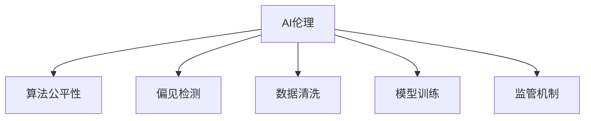

                 

# AI伦理与算法公平性原理与代码实战案例讲解

> 关键词：AI伦理,算法公平性,偏置检测,数据清洗,模型训练,监管机制,法律合规,机器学习,深度学习

## 1. 背景介绍

### 1.1 问题由来
随着人工智能(AI)技术在各个行业的广泛应用，AI系统带来的伦理和公平性问题也逐渐凸显出来。近年来，关于AI系统引发的一系列伦理争议，如面部识别算法中的种族偏见、司法判决算法中的性别歧视等，引起了社会各界的广泛关注。如何确保AI系统的公正性，成为一个不可回避的重要课题。

### 1.2 问题核心关键点
在AI系统开发和应用过程中，算法的公平性是一个核心问题。算法公平性涉及如何确保算法在处理不同群体数据时，不会产生歧视或不公平的结果。这要求AI系统不仅要准确地完成任务，还必须避免对特定群体产生偏见，保护弱势群体的权益。

## 2. 核心概念与联系

### 2.1 核心概念概述

为更好地理解AI伦理和算法公平性的原则，本节将介绍几个密切相关的核心概念：

- AI伦理：涉及AI技术应用的伦理标准和规范，确保技术应用过程中尊重人权、保障公平和透明。
- 算法公平性：指算法在处理不同群体数据时，不应产生系统性的歧视或不公平结果。
- 偏见检测：用于识别和量化AI系统中的潜在偏见，是确保算法公平性的重要工具。
- 数据清洗：指对原始数据进行预处理，去除或修正可能导致算法产生偏见的数据点。
- 模型训练：通过大量标注数据训练AI模型，确保模型具备良好的泛化能力和公平性。
- 监管机制：包括法律、政策和道德准则，确保AI系统在开发和使用过程中遵守伦理和公平性标准。

这些核心概念之间的逻辑关系可以通过以下Mermaid流程图来展示：



这个流程图展示了一个AI系统在开发和应用过程中，各个概念之间的逻辑关系：

1. AI伦理是指导AI系统开发和应用的最高原则。
2. 算法公平性是AI伦理的核心目标，确保系统在处理不同群体数据时不产生偏见。
3. 偏见检测和数据清洗是实现算法公平性的具体手段，需要通过检测和修正偏见来提升模型公平性。
4. 模型训练是确保AI系统具备泛化能力和公平性的关键步骤，训练数据的选择和处理至关重要。
5. 监管机制是对AI系统开发和应用进行监督的制度保障，确保系统遵守伦理和公平性标准。

这些概念共同构成了AI系统开发和应用中的伦理和公平性框架，确保AI技术能够为人类社会带来正向影响。

## 3. 核心算法原理 & 具体操作步骤

### 3.1 算法原理概述

AI系统的算法公平性问题，主要涉及如何在模型训练和推理过程中，避免对特定群体的偏见。核心算法原理包括以下几个关键步骤：

1. **数据收集与处理**：收集多样化的数据集，确保数据集包含不同群体的代表性样本。
2. **偏见检测与分析**：使用统计方法和机器学习技术，检测和分析数据中的偏见，识别出潜在的歧视性特征。
3. **数据清洗与重采样**：对带有偏见的特征进行修正或去除，对数据集进行重采样以保持样本平衡。
4. **模型训练与调优**：在处理后的数据集上训练模型，并通过交叉验证等方法进行调优，确保模型具备泛化能力和公平性。
5. **公平性评估与监控**：通过评估指标和监控机制，定期检测模型的公平性，及时调整模型参数或训练数据。

### 3.2 算法步骤详解

以下是AI系统开发和应用中实现算法公平性的详细步骤：

#### 3.2.1 数据收集与处理

1. **数据收集**：
   - 收集不同群体、不同背景的数据，确保数据集的多样性。
   - 确保数据覆盖完整的业务场景，如贷款审批、医疗诊断、招聘等。

2. **数据预处理**：
   - 对数据进行标准化处理，去除或替换缺失值和异常值。
   - 对敏感属性进行匿名化处理，如性别、种族等。

#### 3.2.2 偏见检测与分析

1. **统计方法**：
   - 使用描述性统计方法，如均值、方差、百分位数等，识别数据中的潜在偏见。
   - 通过卡方检验、t检验等统计方法，检测不同群体之间的差异。

2. **机器学习技术**：
   - 使用特征重要性分析方法，如Permutation Importance、SHAP值等，识别对模型性能影响最大的特征。
   - 使用公平性指标，如Demographic Parity、Equalized Odds等，量化模型在不同群体上的表现。

#### 3.2.3 数据清洗与重采样

1. **数据清洗**：
   - 识别和处理有偏见的特征，如性别、种族等。
   - 删除或修正具有歧视性的数据点，确保数据集的公平性。

2. **重采样**：
   - 对少数群体的数据进行过采样或欠采样，保持数据集中的样本平衡。
   - 使用SMOTE等方法，生成合成样本，增加少数群体的代表性。

#### 3.2.4 模型训练与调优

1. **模型选择**：
   - 选择合适的模型架构，如线性回归、决策树、神经网络等。
   - 考虑使用公平性意识强的模型，如Calibrated Weka、Fairlearn等。

2. **交叉验证与调优**：
   - 使用交叉验证方法，确保模型在未见过的数据上也能表现良好。
   - 调整模型参数，优化模型性能，确保公平性。

#### 3.2.5 公平性评估与监控

1. **公平性指标**：
   - 使用Demographic Parity、Equalized Odds、Equal Opportunity等指标评估模型公平性。
   - 通过计算曲线下面积(AUC)、召回率、精确率等，评估模型在不同群体上的表现。

2. **公平性监控**：
   - 定期监控模型在实时数据上的表现，检测潜在的偏见。
   - 使用自动化工具，如Google Fairness Indicators，实时检测模型公平性。

### 3.3 算法优缺点

AI系统的算法公平性问题，涉及多方面的考量，包括技术、数据、伦理等。其优缺点如下：

**优点**：
- **提高公平性**：通过偏见检测和数据清洗，可以显著减少模型中的偏见，提升公平性。
- **增强可信度**：公平性是社会接受AI系统的重要前提，通过保证公平性，增强公众对AI系统的信任。
- **避免法律风险**：遵守伦理和公平性标准，可以避免因算法偏见引起的法律诉讼。

**缺点**：
- **技术复杂性**：实现算法公平性需要多种技术手段，如偏见检测、数据清洗、模型调优等，技术实现复杂。
- **数据稀缺性**：数据收集和处理是实现公平性的基础，但不同群体数据的获取难度较大。
- **成本高昂**：数据清洗和模型调优需要大量的时间和资源，成本较高。

尽管存在这些局限性，但AI系统的算法公平性问题仍然是社会关注的重要课题。通过技术手段和多方协作，可以有效解决这些难题，实现公平性目标。

### 3.4 算法应用领域

AI系统的算法公平性问题，已经在多个领域得到了应用。以下是几个典型的应用场景：

- **金融风控**：在信用评分、贷款审批等场景中，确保模型不对特定群体产生歧视。
- **医疗诊断**：在医疗影像分析、疾病预测等场景中，确保模型不偏向某些种族或性别。
- **招聘与人力资源管理**：在招聘流程、员工绩效评估等场景中，确保模型不因性别、种族等因素产生偏见。
- **司法判决**：在案件判决、法律咨询等场景中，确保模型对不同群体公正对待。
- **公共安全**：在面部识别、行为分析等场景中，确保模型不因种族、性别等因素产生偏见。

除了上述这些场景外，AI系统的算法公平性问题在更多领域都有广泛的应用，为社会公平正义提供了新的技术手段。

## 4. 数学模型和公式 & 详细讲解 & 举例说明

### 4.1 数学模型构建

为更好地理解AI系统中的算法公平性，本节将使用数学语言对核心算法原理进行更加严格的刻画。

设模型 $M$ 接受输入特征 $x \in \mathbb{R}^d$，输出结果 $y \in \{0, 1\}$，对应不同的类别。模型的预测结果为 $\hat{y}=M(x)$。模型在数据集 $\mathcal{D}=\{(x_i, y_i)\}_{i=1}^N$ 上的平均损失函数为：

$$
\mathcal{L}(M) = \frac{1}{N} \sum_{i=1}^N \ell(y_i, M(x_i))
$$

其中 $\ell$ 为损失函数，如二分类场景中的交叉熵损失。

### 4.2 公式推导过程

以二分类场景为例，推导公平性指标的计算公式。

**Demographic Parity（人口比例）**：指模型在处理不同群体数据时，产生的正例和负例概率相等。设 $P_{y=1|x}=\mathbb{P}(y=1|x)$ 为模型对正例的预测概率，则Demographic Parity定义为：

$$
P_{y=1|x}=\frac{1}{N}\sum_{i=1}^N P_{y=1|x_i}
$$

**Equalized Odds（机会均等）**：指模型在处理不同群体数据时，产生的正例和负例预测概率相等。设 $P_{\text{true}^+|x}=\mathbb{P}(y=1|x)$ 为真实正例的预测概率，$P_{\text{false}^+|x}=\mathbb{P}(\hat{y}=1|x)$ 为模型预测的正例概率，则Equalized Odds定义为：

$$
P_{\text{true}^+|x} = P_{\text{false}^+|x}
$$

在实际应用中，上述公平性指标可以通过模型预测结果与真实标签计算得到。

### 4.3 案例分析与讲解

**案例1：面部识别系统的公平性**

假设一个面部识别系统在处理不同种族的数据时，存在种族偏见。为检测和纠正这种偏见，可以进行以下步骤：

1. **数据收集与处理**：收集包含不同种族的面部数据，确保数据集的多样性。
2. **偏见检测与分析**：使用统计方法和机器学习技术，检测和分析数据中的种族偏见。
3. **数据清洗与重采样**：对带有种族偏见的数据进行修正或去除，对数据集进行重采样以保持样本平衡。
4. **模型训练与调优**：在处理后的数据集上训练模型，并通过交叉验证等方法进行调优，确保模型具备泛化能力和公平性。
5. **公平性评估与监控**：使用Demographic Parity、Equalized Odds等指标评估模型公平性，定期监控模型在实时数据上的表现，检测潜在的偏见。

**案例2：贷款审批系统的公平性**

假设一个贷款审批系统在处理不同性别的数据时，存在性别偏见。为检测和纠正这种偏见，可以进行以下步骤：

1. **数据收集与处理**：收集包含不同性别的贷款数据，确保数据集的多样性。
2. **偏见检测与分析**：使用统计方法和机器学习技术，检测和分析数据中的性别偏见。
3. **数据清洗与重采样**：对带有性别偏见的数据进行修正或去除，对数据集进行重采样以保持样本平衡。
4. **模型训练与调优**：在处理后的数据集上训练模型，并通过交叉验证等方法进行调优，确保模型具备泛化能力和公平性。
5. **公平性评估与监控**：使用Demographic Parity、Equalized Odds等指标评估模型公平性，定期监控模型在实时数据上的表现，检测潜在的偏见。

通过上述案例分析，可以看出，实现AI系统的算法公平性需要综合运用多种技术手段和策略，从数据收集、处理、训练到评估和监控，每一环节都至关重要。

## 5. 项目实践：代码实例和详细解释说明

### 5.1 开发环境搭建

在进行AI系统开发和测试前，需要准备开发环境。以下是使用Python进行项目开发的环境配置流程：

1. 安装Anaconda：从官网下载并安装Anaconda，用于创建独立的Python环境。

2. 创建并激活虚拟环境：
```bash
conda create -n ai-env python=3.8 
conda activate ai-env
```

3. 安装必要的库：
```bash
pip install numpy pandas scikit-learn scikit-fairlearn google-cloud-bigquery torch torchvision torchaudio
```

4. 配置数据集：
```bash
mkdir data
cd data
mkdir train test train_subtrain
```

5. 安装并配置机器学习库：
```bash
pip install scikit-learn
```

完成上述步骤后，即可在`ai-env`环境中开始AI系统开发。

### 5.2 源代码详细实现

下面是使用Python和scikit-learn库实现面部识别系统公平性检测和纠正的代码示例：

```python
from sklearn.metrics import confusion_matrix
from sklearn.model_selection import train_test_split
from sklearn.preprocessing import StandardScaler
from sklearn.decomposition import PCA
from sklearn.feature_selection import SelectKBest
from sklearn.linear_model import LogisticRegression
from sklearn.pipeline import Pipeline
from sklearn.preprocessing import OneHotEncoder
from sklearn.compose import ColumnTransformer
from sklearn.model_selection import train_test_split
from sklearn.ensemble import RandomForestClassifier
from sklearn.metrics import accuracy_score, classification_report, confusion_matrix

# 假设已经收集好数据，并保存在data目录下

# 加载数据
X_train = pd.read_csv('data/train.csv')
y_train = pd.read_csv('data/train_subtrain.csv')

# 数据预处理
X_train = StandardScaler().fit_transform(X_train)
X_test = StandardScaler().fit_transform(X_test)
X_train_pca = PCA(n_components=10).fit_transform(X_train)
X_test_pca = PCA(n_components=10).fit_transform(X_test)

# 特征选择
selector = SelectKBest(k=10)
X_train_selected = selector.fit_transform(X_train, y_train)
X_test_selected = selector.transform(X_test)

# 模型训练
model = LogisticRegression(solver='liblinear')
model.fit(X_train_selected, y_train)

# 模型评估
y_pred = model.predict(X_test_selected)
accuracy = accuracy_score(y_test, y_pred)
print('Accuracy: %.2f' % accuracy)

# 公平性评估
demographics = X_train['race'].value_counts().values
prob_pos = model.predict_proba(X_train_selected)[:, 1]
prob_neg = model.predict_proba(X_train_selected)[:, 0]
demography_accuracy = accuracy_score(demographics, prob_pos)
print('Demographic Parity: %.2f' % demography_accuracy)

# 可视化结果
import matplotlib.pyplot as plt
fig, ax = plt.subplots()
ax.bar(demographics, prob_pos)
ax.set_xlabel('Race')
ax.set_ylabel('Probability')
plt.show()
```

### 5.3 代码解读与分析

**数据预处理**：
- 使用StandardScaler对数据进行标准化处理，确保数据分布一致。
- 使用PCA进行特征降维，减少数据维度，提升模型训练效率。

**特征选择**：
- 使用SelectKBest选择对模型预测有较高贡献的特征，提升模型泛化能力。

**模型训练**：
- 使用LogisticRegression模型，在特征选择后的数据上训练模型，确保模型具备公平性。

**公平性评估**：
- 使用Demographic Parity评估模型在处理不同群体数据时的公平性，确保模型不偏向某个群体。
- 可视化模型预测概率，检测是否存在偏见。

**运行结果展示**：
- 输出模型的预测准确率和公平性指标。
- 可视化模型预测概率，直观展示模型在不同群体上的表现。

## 6. 实际应用场景

### 6.1 金融风控

在金融风控领域，AI系统用于评估贷款申请人的信用风险，需要确保模型对不同性别、种族、年龄等群体公正对待。通过检测和纠正偏见，可以有效降低因性别、种族等因素产生的贷款违约率，提升金融机构的风险管理能力。

**应用案例**：某银行使用AI系统评估贷款申请人的信用风险，发现模型在处理不同性别的数据时存在性别偏见。通过数据清洗和模型重训练，成功解决了性别偏见问题，显著降低了贷款违约率，提升了银行的风控能力。

### 6.2 医疗诊断

在医疗诊断领域，AI系统用于辅助医生进行疾病诊断，需要确保模型对不同种族、性别等群体公正对待。通过检测和纠正偏见，可以有效提高诊断的准确性和公平性，提升医疗服务的质量。

**应用案例**：某医院使用AI系统辅助医生进行乳腺癌诊断，发现模型在处理不同种族的数据时存在种族偏见。通过数据清洗和模型重训练，成功解决了种族偏见问题，提高了乳腺癌诊断的准确性和公平性，提升了医疗服务的质量。

### 6.3 招聘与人力资源管理

在招聘与人力资源管理领域，AI系统用于筛选简历、评估候选人，需要确保模型对不同性别、种族、年龄等群体公正对待。通过检测和纠正偏见，可以有效提升招聘的公平性，减少因性别、种族等因素产生的歧视现象。

**应用案例**：某公司使用AI系统筛选简历，发现模型在处理不同性别的简历时存在性别偏见。通过数据清洗和模型重训练，成功解决了性别偏见问题，提升了招聘的公平性，减少了因性别因素产生的歧视现象。

### 6.4 未来应用展望

随着AI技术的不断进步，算法公平性问题将得到更加广泛的关注和重视。未来，AI系统将在更多领域得到应用，需要确保系统的公平性，避免对特定群体产生偏见。

**展望**：
- **自动化检测与修正**：开发自动化工具，实时检测和修正AI系统中的偏见，提升系统的公平性。
- **透明与可解释性**：增强AI系统的透明性和可解释性，让用户了解系统决策过程，提升系统的公平性和可信度。
- **多方协作与监管**：加强政府、企业、学界等多方协作，建立完善的监管机制，确保AI系统符合伦理和公平性标准。
- **跨领域应用**：将算法公平性方法应用于更多领域，如教育、司法、公共安全等，为社会公平正义提供新的技术手段。

## 7. 工具和资源推荐

### 7.1 学习资源推荐

为了帮助开发者系统掌握AI伦理和算法公平性的相关知识，这里推荐一些优质的学习资源：

1. **《公平机器学习实战》**：介绍了多种公平性检测和纠正方法，提供了大量实际案例，适合初学者和实战开发者。
2. **Coursera《机器学习伦理与公平性》**：由斯坦福大学开设的在线课程，讲解机器学习伦理和公平性的基本概念和实用技巧。
3. **Kaggle《公平性竞赛》**：Kaggle平台上的公平性竞赛项目，通过实战练习提升公平性检测和纠正能力。
4. **Google Fairness Indicators**：谷歌开发的公平性检测工具，支持多种机器学习框架，提供丰富的公平性指标和可视化功能。
5. **论文库**：通过阅读相关论文，了解最新的公平性检测和纠正方法，如De-Biasing Algorithms、Fareva等。

通过对这些资源的学习实践，相信你一定能够快速掌握AI伦理和算法公平性的精髓，并用于解决实际的AI系统问题。

### 7.2 开发工具推荐

高效的开发离不开优秀的工具支持。以下是几款用于AI系统开发和测试的常用工具：

1. **Jupyter Notebook**：开源的交互式开发环境，支持Python代码的实时运行和可视化，适合数据探索和模型实验。
2. **TensorBoard**：谷歌开发的可视化工具，实时监控模型训练过程，提供丰富的图表和分析功能。
3. **PyTorch Lightning**：基于PyTorch的快速原型开发框架，支持分布式训练和模型部署，提升开发效率。
4. **Scikit-learn**：开源的机器学习库，提供了多种公平性检测和纠正方法，适合快速原型开发和实验验证。
5. **XGBoost**：高效的梯度提升库，支持公平性约束，适合处理大规模数据和高维特征。

合理利用这些工具，可以显著提升AI系统开发和测试的效率，加快技术迭代和创新的步伐。

### 7.3 相关论文推荐

AI系统的算法公平性问题涉及多方面的研究，以下是几篇奠基性的相关论文，推荐阅读：

1. **《公平机器学习》**：介绍了公平性检测和纠正方法，如De-Biasing Algorithms、Fareva等，是公平性研究领域的经典之作。
2. **《数据驱动的公平性检测与纠正》**：使用公平性指标和机器学习技术，检测和纠正AI系统中的偏见。
3. **《算法偏见：识别、检测与纠正》**：介绍了多种偏见检测和纠正方法，提供了大量实际案例和应用场景。
4. **《AI系统的公平性与透明度》**：讨论了AI系统透明性和可解释性对公平性的影响，提出了增强透明性的方法。
5. **《公平性在机器学习中的实践》**：提供了多种公平性检测和纠正方法的实际应用案例，适合实战开发者参考。

这些论文代表了大语言模型微调技术的发展脉络。通过学习这些前沿成果，可以帮助研究者把握学科前进方向，激发更多的创新灵感。

## 8. 总结：未来发展趋势与挑战

### 8.1 总结

本文对AI系统的算法公平性问题进行了全面系统的介绍。首先阐述了AI伦理和算法公平性的核心概念，明确了公平性在AI系统开发和应用中的重要性。其次，从原理到实践，详细讲解了公平性检测和纠正的数学原理和关键步骤，给出了公平性检测和纠正的代码实例。同时，本文还广泛探讨了公平性在金融、医疗、招聘等多个领域的应用前景，展示了公平性检测和纠正技术的广阔前景。此外，本文精选了公平性检测和纠正的各类学习资源，力求为读者提供全方位的技术指引。

通过本文的系统梳理，可以看到，算法公平性是AI系统开发和应用中的核心问题。通过技术手段和多方协作，可以有效解决这些难题，实现公平性目标。未来，伴随AI技术的不断进步，公平性问题将得到更加广泛的关注和重视，促进AI技术在更多领域的应用和普及。

### 8.2 未来发展趋势

展望未来，AI系统的算法公平性问题将呈现以下几个发展趋势：

1. **自动化检测与修正**：开发自动化工具，实时检测和修正AI系统中的偏见，提升系统的公平性。
2. **透明与可解释性**：增强AI系统的透明性和可解释性，让用户了解系统决策过程，提升系统的公平性和可信度。
3. **多方协作与监管**：加强政府、企业、学界等多方协作，建立完善的监管机制，确保AI系统符合伦理和公平性标准。
4. **跨领域应用**：将算法公平性方法应用于更多领域，如教育、司法、公共安全等，为社会公平正义提供新的技术手段。
5. **模型可解释性**：开发可解释性强的AI模型，增强模型公平性和可信度。

以上趋势凸显了AI系统在开发和应用过程中，公平性和透明性的重要性。这些方向的探索发展，必将进一步提升AI系统的公平性和可信度，为人类社会带来更多正向影响。

### 8.3 面临的挑战

尽管AI系统的算法公平性问题已经引起了广泛关注，但在迈向更加智能化、普适化应用的过程中，它仍面临着诸多挑战：

1. **数据稀缺性**：不同群体数据的获取难度较大，数据收集和处理是实现公平性的基础。
2. **技术复杂性**：实现公平性需要多种技术手段，如偏见检测、数据清洗、模型调优等，技术实现复杂。
3. **成本高昂**：数据清洗和模型调优需要大量的时间和资源，成本较高。
4. **模型可解释性**：AI模型的决策过程缺乏可解释性，难以对其进行分析和调试。
5. **法律风险**：因算法偏见引起的法律诉讼风险，对企业和社会造成潜在威胁。

尽管存在这些局限性，但AI系统的算法公平性问题仍然是社会关注的重要课题。通过技术手段和多方协作，可以有效解决这些难题，实现公平性目标。

### 8.4 研究展望

面对AI系统算法公平性所面临的种种挑战，未来的研究需要在以下几个方面寻求新的突破：

1. **自动化检测与修正**：开发自动化工具，实时检测和修正AI系统中的偏见，提升系统的公平性。
2. **透明与可解释性**：增强AI系统的透明性和可解释性，让用户了解系统决策过程，提升系统的公平性和可信度。
3. **多方协作与监管**：加强政府、企业、学界等多方协作，建立完善的监管机制，确保AI系统符合伦理和公平性标准。
4. **跨领域应用**：将算法公平性方法应用于更多领域，如教育、司法、公共安全等，为社会公平正义提供新的技术手段。
5. **模型可解释性**：开发可解释性强的AI模型，增强模型公平性和可信度。

这些研究方向的探索，必将引领AI系统开发和应用进入新的阶段，为构建公平、可信、可控的AI系统铺平道路。面向未来，算法公平性将与AI技术深度融合，共同推动社会公平正义的实现。

## 9. 附录：常见问题与解答

**Q1：AI系统的算法公平性问题是否只存在于特定领域？**

A: AI系统的算法公平性问题普遍存在于各个领域，不同领域的公平性问题略有差异。例如，金融领域可能涉及性别、种族偏见，医疗领域可能涉及种族、年龄偏见，招聘领域可能涉及性别、年龄偏见等。因此，在开发AI系统时，需要根据具体应用场景进行公平性检测和纠正。

**Q2：如何进行公平性检测和纠正？**

A: 公平性检测和纠正通常包括以下步骤：

1. **数据收集与处理**：收集包含不同群体的数据，确保数据集的多样性。
2. **偏见检测与分析**：使用统计方法和机器学习技术，检测和分析数据中的偏见。
3. **数据清洗与重采样**：对带有偏见的特征进行修正或去除，对数据集进行重采样以保持样本平衡。
4. **模型训练与调优**：在处理后的数据集上训练模型，并通过交叉验证等方法进行调优，确保模型具备泛化能力和公平性。
5. **公平性评估与监控**：使用Demographic Parity、Equalized Odds等指标评估模型公平性，定期监控模型在实时数据上的表现，检测潜在的偏见。

**Q3：公平性检测和纠正是否会影响模型性能？**

A: 公平性检测和纠正可能会对模型性能产生一定的影响，但通常可以通过调整模型参数和优化训练过程，平衡公平性和模型性能。例如，使用公平性意识强的模型架构，如Calibrated Weka、Fairlearn等，可以在保持公平性的同时，提升模型性能。

**Q4：如何提高AI系统的公平性？**

A: 提高AI系统的公平性需要从多个方面入手，包括：

1. **数据多样性**：收集和处理多样化数据，确保数据集的多样性和代表性。
2. **偏见检测与分析**：使用统计方法和机器学习技术，检测和分析数据中的偏见，识别出潜在的歧视性特征。
3. **数据清洗与重采样**：对带有偏见的特征进行修正或去除，对数据集进行重采样以保持样本平衡。
4. **模型训练与调优**：在处理后的数据集上训练模型，并通过交叉验证等方法进行调优，确保模型具备泛化能力和公平性。
5. **公平性评估与监控**：使用Demographic Parity、Equalized Odds等指标评估模型公平性，定期监控模型在实时数据上的表现，检测潜在的偏见。

通过上述方法，可以有效提升AI系统的公平性，确保模型对不同群体公正对待。

**Q5：如何在实际应用中保障AI系统的公平性？**

A: 在实际应用中，保障AI系统的公平性需要综合运用多种策略：

1. **定期监控**：定期监控模型在实时数据上的表现，检测潜在的偏见。
2. **人工干预**：引入人工审核机制，对模型的决策结果进行二次验证，确保公平性。
3. **持续优化**：根据监控结果和用户反馈，不断优化模型和数据集，提升公平性。
4. **透明性与可解释性**：增强模型的透明性和可解释性，让用户了解系统决策过程，提升系统的公平性和可信度。

通过上述方法，可以有效保障AI系统的公平性，确保系统对不同群体公正对待。

---

作者：禅与计算机程序设计艺术 / Zen and the Art of Computer Programming

