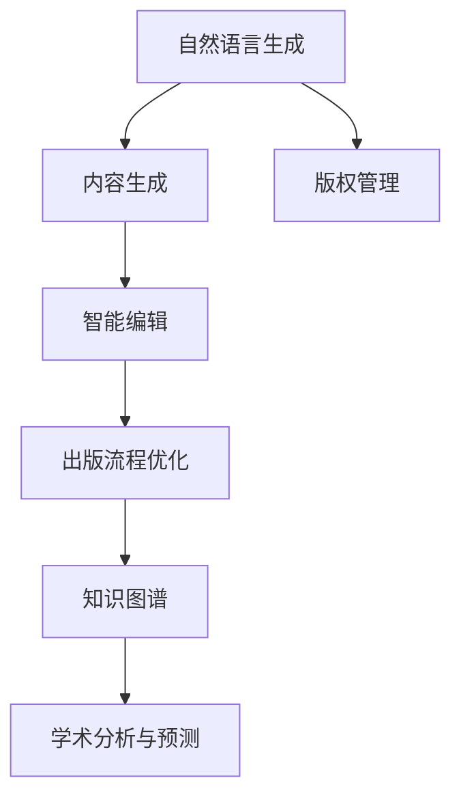

                 

# AI出版业的前景：技术创新，场景应用无限

> 关键词：人工智能出版业,技术创新,内容生成,版权管理,智能编辑,出版流程优化,知识图谱,学术研究

## 1. 背景介绍

### 1.1 问题由来

随着数字技术的发展，出版业正处于一次深刻的变革之中。传统出版业主要依赖人工编辑和纸质媒介，而数字化转型带来的新型出版形态对出版行业的流程、管理、内容生产等各方面提出了新的要求。人工智能技术的迅猛发展，为出版业提供了颠覆传统、创新发展的机会。

**AI出版业**，即利用人工智能技术进行内容生成、版权管理、智能编辑、出版流程优化等方面工作的出版行业。AI出版业不仅能够提升出版的效率和质量，还能够推动出版内容的多样化和个性化，进一步激发出版行业的创新活力。

### 1.2 问题核心关键点

AI出版业的核心关键点包括以下几个方面：

1. **内容生成与创作**：AI技术可以通过自然语言生成模型(NLG)自动生成文章、书籍章节、摘要等出版内容，极大提升内容的生产效率。
2. **版权管理与保护**：利用区块链、人工智能等技术手段，实现对版权的数字化管理与实时监控，保障作者权益。
3. **智能编辑与审核**：通过AI技术对文本进行自动编辑、校对、纠错，减少人力成本，提高出版质量。
4. **出版流程优化**：AI技术可以自动化完成排版、校对、印刷等出版流程中的环节，缩短出版周期，降低成本。
5. **知识图谱与知识管理**：构建出版领域的知识图谱，为内容创作、编辑审核、版权管理等提供知识支撑。
6. **学术研究与分析**：通过AI对出版数据进行分析，提供学术趋势、读者偏好等洞见，指导内容创作和选题策划。

这些核心关键点共同构成了AI出版业的技术框架，为出版行业提供了全新的发展方向。

## 2. 核心概念与联系

### 2.1 核心概念概述

为了更好地理解AI出版业的技术框架和应用场景，本节将介绍几个核心的技术概念：

1. **自然语言生成(Natural Language Generation, NLG)**：指利用计算机技术自动生成自然语言文本的技术，可以应用于文章生成、摘要编写、智能对话等场景。
2. **版权管理系统(Copyright Management System)**：用于版权的数字化管理、登记、交易、保护等，通常结合区块链、AI监控等技术实现。
3. **智能编辑系统(Intelligent Editing System)**：通过AI技术实现自动编辑、校对、纠错，提升出版物质量，减少人工干预。
4. **出版流程自动化(Automatic Publishing Workflow)**：利用AI技术实现出版的自动化流程，包括排版、校对、印刷、发行等环节。
5. **知识图谱(Knowledge Graph)**：通过实体关系网络化的方式，构建出版领域的知识图谱，辅助内容创作、编辑审核、版权管理等。
6. **学术分析与预测(Academic Analysis and Prediction)**：利用AI技术对出版数据进行分析，预测学术趋势、读者偏好等，为内容创作和选题策划提供支持。

这些核心概念之间的关系可以通过以下Mermaid流程图来展示：



这个流程图展示了大语言模型在AI出版业中的应用场景，包括内容生成、版权管理、智能编辑、出版流程优化、知识图谱构建和学术分析等多个方面。

## 3. 核心算法原理 & 具体操作步骤
### 3.1 算法原理概述

AI出版业的核心算法原理主要包括以下几个方面：

- **自然语言生成模型**：如GPT、BERT等，利用自监督或监督学习方法，学习自然语言的模式和规律，生成高质量的文本内容。
- **版权管理系统**：通过区块链技术，实现版权的数字化登记和溯源，利用AI技术进行实时监控和侵权检测。
- **智能编辑系统**：通过规则引擎、文本分类、语法检查等技术，实现文本的自动编辑和校对。
- **出版流程自动化**：通过机器学习和自动化流程设计，实现出版流程的优化和自动化。
- **知识图谱构建**：利用图神经网络(Graph Neural Network, GNN)等技术，从大量文本数据中构建出版领域的知识图谱。
- **学术分析与预测**：利用数据挖掘和机器学习，对出版数据进行分析和预测，指导内容创作和选题策划。

### 3.2 算法步骤详解

基于上述核心算法原理，AI出版业的实施步骤一般包括以下几个关键环节：

**Step 1: 数据采集与预处理**
- 收集出版领域的各类数据，如出版物内容、版权信息、读者反馈等。
- 对数据进行清洗、标注、归一化等预处理，确保数据质量和一致性。

**Step 2: 内容生成与创作**
- 利用预训练的NLG模型，自动生成文章、书籍章节、摘要等出版内容。
- 根据版权信息，自动生成版权声明、隐私保护等文本。

**Step 3: 版权管理与保护**
- 利用区块链技术，实现版权的数字化登记和溯源，生成区块链证书。
- 利用AI技术，实时监控版权使用情况，检测侵权行为。

**Step 4: 智能编辑与审核**
- 利用规则引擎和文本分类器，对文本进行自动编辑和校对，包括拼写、语法、格式等检查。
- 利用监督学习方法，训练分类器识别错误和不良内容，自动审核和筛选。

**Step 5: 出版流程自动化**
- 利用机器学习和自动化流程设计，实现出版的排版、校对、印刷、发行等环节的自动化。
- 利用预测模型，优化出版流程中的资源配置和调度。

**Step 6: 知识图谱构建与知识管理**
- 利用图神经网络等技术，从大量文本数据中构建出版领域的知识图谱。
- 利用知识图谱辅助内容创作、编辑审核、版权管理等，提升出版质量和效率。

**Step 7: 学术分析与预测**
- 利用数据挖掘和机器学习，对出版数据进行分析和预测，提取学术趋势、读者偏好等洞见。
- 根据分析结果，指导内容创作和选题策划，提升出版物的市场竞争力。

### 3.3 算法优缺点

AI出版业的应用，具有以下优点：

1. **提升效率和质量**：通过自动化技术提升内容生成、编辑、审核等环节的效率，同时减少人工错误，提高出版质量。
2. **降低成本**：自动化流程减少了人力和时间成本，提升了出版行业的整体效率和盈利能力。
3. **丰富内容形式**：AI技术能够生成多样化、个性化的出版内容，丰富读者的阅读体验。
4. **增强版权保护**：利用区块链和AI技术，实现版权的数字化管理与实时监控，保障作者权益。

同时，AI出版业也存在一些局限性：

1. **技术依赖性**：依赖于高性能计算设备和算法模型，技术门槛较高。
2. **内容质量控制**：AI生成的内容可能存在语法错误、逻辑不清等问题，需要人工审核。
3. **数据隐私与安全**：大量数据的采集和处理可能带来隐私风险，数据安全问题需要重点关注。
4. **版权法律问题**：版权的数字化管理涉及复杂的法律问题，需要制定相应的法律框架。
5. **人机协作**：在AI辅助下，人机协作是出版业发展的关键，需要平衡人工与AI的作用。

### 3.4 算法应用领域

AI出版业的应用领域非常广泛，涵盖了内容创作、版权管理、智能编辑、出版流程优化、知识图谱构建等多个方面。具体应用场景包括：

- **出版物生成**：自动生成文章、书籍章节、摘要等出版内容。
- **版权登记与管理**：通过区块链技术，实现版权的数字化登记和溯源，实时监控版权使用情况。
- **智能编辑与审核**：自动编辑和校对文本，自动识别错误和不良内容，提升出版质量。
- **出版流程自动化**：自动化完成排版、校对、印刷、发行等环节，优化出版流程。
- **知识图谱构建**：构建出版领域的知识图谱，辅助内容创作、编辑审核、版权管理等。
- **学术分析与预测**：对出版数据进行分析，预测学术趋势、读者偏好等，指导内容创作和选题策划。

这些应用场景展示了AI出版业的广阔前景和巨大潜力。

## 4. 数学模型和公式 & 详细讲解 & 举例说明（备注：数学公式请使用latex格式，latex嵌入文中独立段落使用 $$，段落内使用 $)
### 4.1 数学模型构建

本节将使用数学语言对AI出版业的技术框架进行更加严格的刻画。

**自然语言生成模型**：假设预训练的自然语言生成模型为 $M_{\theta}$，其中 $\theta$ 为模型参数。设文本 $X$ 为输入，生成的文本 $Y$ 为输出，则生成概率模型为：

$$
P(Y|X) = M_{\theta}(X)
$$

利用最大似然估计方法，求解模型参数 $\theta$：

$$
\theta = \arg\max_{\theta} \prod_{i=1}^n P(y_i|x_i)
$$

**版权管理系统**：假设版权信息为 $C$，版权证书为 $B$。利用区块链技术，版权证书生成过程可以表示为：

$$
B = F(C, \text{hash}(\text{time}, \text{data}))
$$

其中，$F$ 为生成函数，$\text{hash}$ 为哈希函数，$\text{time}$ 和 $\text{data}$ 分别为时间戳和版权信息。

**智能编辑系统**：假设文本 $T$ 为输入，编辑后的文本 $T'$ 为输出。智能编辑过程可以表示为：

$$
T' = E(T)
$$

其中，$E$ 为编辑函数，利用规则引擎和文本分类器进行自动编辑和校对。

**出版流程自动化**：假设出版流程包含 $N$ 个环节，每个环节的时间为 $t_i$。自动化流程可以表示为：

$$
T_{\text{total}} = \sum_{i=1}^N t_i
$$

其中，$T_{\text{total}}$ 为总时间，$t_i$ 为每个环节的时间。

**知识图谱构建**：假设知识图谱包含 $V$ 个节点和 $E$ 条边，利用图神经网络对节点和边进行更新：

$$
\begin{aligned}
& V_{\text{new}} = G(V_{\text{old}}, E) \\
& E_{\text{new}} = G(E_{\text{old}}, V_{\text{new}})
\end{aligned}
$$

其中，$G$ 为图更新函数，$V_{\text{old}}$ 和 $E_{\text{old}}$ 分别为原始节点和边。

**学术分析与预测**：假设学术数据为 $D$，分析结果为 $R$。利用机器学习模型对数据进行分析和预测：

$$
R = A(D)
$$

其中，$A$ 为分析函数，利用数据挖掘和机器学习技术。

### 4.2 公式推导过程

以下我们以自然语言生成模型为例，推导生成概率模型的训练过程。

假设训练数据集为 $\{(x_i, y_i)\}_{i=1}^n$，其中 $x_i$ 为输入，$y_i$ 为生成文本的one-hot编码。设模型参数为 $\theta$，生成概率模型为 $P(Y|X) = M_{\theta}(X)$。则训练目标为最大化似然函数：

$$
\mathcal{L}(\theta) = \frac{1}{n} \sum_{i=1}^n \log P(y_i|x_i)
$$

利用最大似然估计方法，求解模型参数 $\theta$：

$$
\theta = \arg\max_{\theta} \sum_{i=1}^n \log P(y_i|x_i)
$$

根据链式法则，生成概率模型对参数 $\theta_k$ 的梯度为：

$$
\frac{\partial \mathcal{L}(\theta)}{\partial \theta_k} = \sum_{i=1}^n \frac{\partial \log P(y_i|x_i)}{\partial \theta_k}
$$

其中，$\frac{\partial \log P(y_i|x_i)}{\partial \theta_k}$ 为条件概率对参数 $\theta_k$ 的梯度，可以通过反向传播算法高效计算。

在得到生成概率模型的梯度后，即可带入模型参数更新公式，完成模型的迭代优化。重复上述过程直至收敛，最终得到生成概率模型的最优参数 $\theta^*$。

## 5. 项目实践：代码实例和详细解释说明
### 5.1 开发环境搭建

在进行AI出版业实践前，我们需要准备好开发环境。以下是使用Python进行PyTorch开发的环境配置流程：

1. 安装Anaconda：从官网下载并安装Anaconda，用于创建独立的Python环境。

2. 创建并激活虚拟环境：
```bash
conda create -n pytorch-env python=3.8 
conda activate pytorch-env
```

3. 安装PyTorch：根据CUDA版本，从官网获取对应的安装命令。例如：
```bash
conda install pytorch torchvision torchaudio cudatoolkit=11.1 -c pytorch -c conda-forge
```

4. 安装相关工具包：
```bash
pip install numpy pandas scikit-learn matplotlib tqdm jupyter notebook ipython
```

完成上述步骤后，即可在`pytorch-env`环境中开始AI出版业的实践。

### 5.2 源代码详细实现

下面我以自然语言生成为例，给出使用PyTorch实现自然语言生成模型的代码实现。

首先，定义生成模型类：

```python
from transformers import GPT2LMHeadModel, GPT2Tokenizer

class NLGModel:
    def __init__(self, model_name='gpt2'):
        self.model = GPT2LMHeadModel.from_pretrained(model_name)
        self.tokenizer = GPT2Tokenizer.from_pretrained(model_name)
    
    def generate_text(self, text, max_length=256):
        inputs = self.tokenizer.encode(text, return_tensors='pt')
        outputs = self.model.generate(inputs, max_length=max_length)
        return self.tokenizer.decode(outputs[0], skip_special_tokens=True)
```

然后，定义训练函数：

```python
from transformers import AdamW

def train_model(model, tokenizer, train_data, epochs, batch_size, learning_rate):
    dataloader = DataLoader(train_data, batch_size=batch_size, shuffle=True)
    model.train()
    optimizer = AdamW(model.parameters(), lr=learning_rate)
    
    for epoch in range(epochs):
        for batch in dataloader:
            inputs = batch['input_ids'].to(device)
            labels = batch['labels'].to(device)
            model.zero_grad()
            outputs = model(inputs, labels=labels)
            loss = outputs.loss
            loss.backward()
            optimizer.step()
            
        print(f"Epoch {epoch+1}, loss: {loss.item()}")
```

接着，定义数据处理函数：

```python
from torch.utils.data import Dataset

class TextDataset(Dataset):
    def __init__(self, texts, tokenizer, max_length=256):
        self.texts = texts
        self.tokenizer = tokenizer
        self.max_length = max_length
    
    def __len__(self):
        return len(self.texts)
    
    def __getitem__(self, item):
        text = self.texts[item]
        encoding = self.tokenizer(text, return_tensors='pt', max_length=self.max_length, padding='max_length', truncation=True)
        input_ids = encoding['input_ids'][0]
        return {'input_ids': input_ids, 'labels': input_ids}
```

最后，启动训练流程：

```python
from transformers import load_dataset

# 加载数据集
train_data = load_dataset('text', 'gpt2', split='train')
texts = train_data['train'].data.tolist()

# 初始化模型和tokenizer
model = NLGModel()
tokenizer = model.tokenizer

# 训练模型
epochs = 5
batch_size = 16
learning_rate = 2e-5

train_model(model, tokenizer, train_data, epochs, batch_size, learning_rate)
```

以上就是使用PyTorch实现自然语言生成模型的完整代码实现。可以看到，得益于HuggingFace的Transformers库，代码实现变得简洁高效。

### 5.3 代码解读与分析

让我们再详细解读一下关键代码的实现细节：

**NLGModel类**：
- `__init__`方法：初始化预训练模型和tokenizer。
- `generate_text`方法：使用模型生成文本，并解码为可读文本。

**TextDataset类**：
- `__init__`方法：初始化数据集和tokenizer。
- `__len__`方法：返回数据集长度。
- `__getitem__`方法：将文本转换为token ids，并返回模型所需的输入。

**train_model函数**：
- 使用PyTorch的DataLoader对数据集进行批次化加载，供模型训练使用。
- 在每个epoch内循环迭代，对每个batch进行前向传播、计算loss并反向传播更新模型参数。
- 每epoch输出loss，记录训练过程。

**训练流程**：
- 加载数据集，初始化模型和tokenizer。
- 定义训练参数，启动训练流程。
- 在模型训练完成后，可以调用`generate_text`方法生成新的文本内容。

可以看到，HuggingFace的Transformers库提供了丰富的预训练模型和工具，使得模型的训练和生成变得非常便捷。这为AI出版业提供了强大的技术支撑。

## 6. 实际应用场景

### 6.1 智能出版系统

基于AI出版业的智能出版系统，可以自动完成内容生成、版权管理、智能编辑、出版流程自动化等多个环节。具体应用场景包括：

- **内容生成**：自动生成文章、书籍章节、摘要等出版内容，提升内容创作的效率和质量。
- **版权管理**：利用区块链技术，实现版权的数字化登记和溯源，实时监控版权使用情况。
- **智能编辑**：自动编辑和校对文本，提升出版质量，减少人工干预。
- **出版流程自动化**：自动化完成排版、校对、印刷、发行等环节，优化出版流程。

例如，某出版机构可以利用智能出版系统自动生成各类出版物，如电子书、杂志、报纸等，同时自动处理版权信息和读者反馈，提升出版质量和用户体验。

### 6.2 学术出版平台

学术出版平台是AI出版业的重要应用领域。利用AI技术，学术出版平台可以实现内容创作、编辑审核、版权管理、学术分析等多个环节的自动化。具体应用场景包括：

- **内容创作**：利用自然语言生成技术，自动生成学术论文、报告、综述等出版内容。
- **编辑审核**：利用智能编辑系统，自动检查文本的格式、语法、引用等，提升文章质量。
- **版权管理**：利用区块链技术，实现学术论文的版权登记和溯源，保障作者权益。
- **学术分析**：利用机器学习技术，对学术论文进行分析，提取学术趋势、作者偏好等洞见，指导内容创作和选题策划。

例如，某学术出版平台可以利用AI技术自动生成学术论文和报告，提升出版效率和质量，同时自动处理版权信息和读者反馈，提升用户满意度。

### 6.3 数字图书出版

数字图书出版是AI出版业的重要应用场景之一。利用AI技术，数字图书出版可以实现内容生成、版权管理、智能编辑、出版流程自动化等多个环节的自动化。具体应用场景包括：

- **内容生成**：利用自然语言生成技术，自动生成数字图书的章节、摘要、封面等。
- **版权管理**：利用区块链技术，实现数字图书的版权登记和溯源，实时监控版权使用情况。
- **智能编辑**：利用智能编辑系统，自动检查文本的格式、语法、引用等，提升图书质量。
- **出版流程自动化**：自动化完成排版、校对、印刷、发行等环节，优化出版流程。

例如，某数字图书出版平台可以利用AI技术自动生成数字图书，提升出版效率和质量，同时自动处理版权信息和读者反馈，提升用户满意度。

## 7. 工具和资源推荐

### 7.1 学习资源推荐

为了帮助开发者系统掌握AI出版业的技术框架和应用场景，这里推荐一些优质的学习资源：

1. 《深度学习基础》课程：由斯坦福大学李飞飞教授主讲，全面介绍深度学习的基本概念和应用。
2. 《自然语言处理》课程：由清华大学刘军教授主讲，涵盖自然语言处理的基本原理和前沿技术。
3. 《Python深度学习》书籍：由Francois Chollet编写，介绍如何使用Python实现深度学习模型的构建和训练。
4. 《Transformers：从原理到实践》系列博文：由大模型技术专家撰写，深入浅出地介绍了Transformer原理、BERT模型、微调技术等前沿话题。
5. 《HuggingFace官方文档》：提供丰富的预训练模型和工具，帮助开发者快速上手AI出版业的应用开发。

通过对这些资源的学习实践，相信你一定能够快速掌握AI出版业的核心技术，并用于解决实际的出版问题。

### 7.2 开发工具推荐

高效的开发离不开优秀的工具支持。以下是几款用于AI出版业开发的常用工具：

1. PyTorch：基于Python的开源深度学习框架，灵活动态的计算图，适合快速迭代研究。大部分预训练语言模型都有PyTorch版本的实现。
2. TensorFlow：由Google主导开发的开源深度学习框架，生产部署方便，适合大规模工程应用。同样有丰富的预训练语言模型资源。
3. HuggingFace Transformers库：提供丰富的预训练模型和工具，帮助开发者快速上手AI出版业的应用开发。
4. Weights & Biases：模型训练的实验跟踪工具，可以记录和可视化模型训练过程中的各项指标，方便对比和调优。与主流深度学习框架无缝集成。
5. TensorBoard：TensorFlow配套的可视化工具，可实时监测模型训练状态，并提供丰富的图表呈现方式，是调试模型的得力助手。

合理利用这些工具，可以显著提升AI出版业的开发效率，加快创新迭代的步伐。

### 7.3 相关论文推荐

AI出版业的研究源于学界的持续研究。以下是几篇奠基性的相关论文，推荐阅读：

1. Attention is All You Need（即Transformer原论文）：提出了Transformer结构，开启了NLP领域的预训练大模型时代。
2. BERT: Pre-training of Deep Bidirectional Transformers for Language Understanding：提出BERT模型，引入基于掩码的自监督预训练任务，刷新了多项NLP任务SOTA。
3. Knowledge Graph Embeddings and Their Applications：利用图神经网络构建知识图谱，辅助内容创作和编辑审核。
4. Academic Publishing in the Digital Age：探讨了数字出版时代的内容创作、版权管理、智能编辑等技术挑战。

这些论文代表了大语言模型微调技术的发展脉络。通过学习这些前沿成果，可以帮助研究者把握学科前进方向，激发更多的创新灵感。

## 8. 总结：未来发展趋势与挑战

### 8.1 总结

本文对AI出版业的技术框架和应用场景进行了全面系统的介绍。首先阐述了AI出版业的背景和核心关键点，明确了自然语言生成、版权管理、智能编辑、出版流程优化、知识图谱构建、学术分析与预测等技术的应用价值。其次，从原理到实践，详细讲解了自然语言生成模型的训练过程、版权管理系统的构建、智能编辑系统的实现、出版流程自动化的设计、知识图谱的构建以及学术分析与预测的技术框架。最后，给出了AI出版业的实际应用场景和未来发展趋势。

通过本文的系统梳理，可以看到，AI出版业将彻底颠覆传统出版业的运营模式，带来产业升级和创新变革。这一领域的快速发展和广泛应用，将极大提升出版行业的效率和质量，促进出版内容的多样化和个性化，同时为学术研究和商业应用带来新的机遇和挑战。

### 8.2 未来发展趋势

展望未来，AI出版业将呈现以下几个发展趋势：

1. **内容生成自动化**：利用自然语言生成技术，自动生成各类出版物，提升内容创作的效率和质量。
2. **版权数字化管理**：利用区块链和AI技术，实现版权的数字化登记和实时监控，保障作者权益。
3. **智能编辑和审核**：利用智能编辑系统，自动检查文本的格式、语法、引用等，提升出版质量。
4. **出版流程自动化**：利用自动化流程设计，优化出版流程中的排版、校对、印刷、发行等环节。
5. **知识图谱构建与知识管理**：利用图神经网络等技术，构建出版领域的知识图谱，辅助内容创作和编辑审核。
6. **学术分析与预测**：利用数据挖掘和机器学习，对出版数据进行分析，提取学术趋势、读者偏好等洞见，指导内容创作和选题策划。

这些趋势将推动AI出版业向更加智能化、自动化、个性化的方向发展，为出版行业带来颠覆性变革。

### 8.3 面临的挑战

尽管AI出版业的发展前景广阔，但在实施过程中仍面临诸多挑战：

1. **技术依赖性**：依赖于高性能计算设备和算法模型，技术门槛较高。
2. **内容质量控制**：AI生成的内容可能存在语法错误、逻辑不清等问题，需要人工审核。
3. **数据隐私与安全**：大量数据的采集和处理可能带来隐私风险，数据安全问题需要重点关注。
4. **版权法律问题**：版权的数字化管理涉及复杂的法律问题，需要制定相应的法律框架。
5. **人机协作**：在AI辅助下，人机协作是出版业发展的关键，需要平衡人工与AI的作用。

### 8.4 研究展望

未来，AI出版业的研究需要在以下几个方面寻求新的突破：

1. **探索无监督和半监督微调方法**：摆脱对大规模标注数据的依赖，利用自监督学习、主动学习等无监督和半监督范式，最大限度利用非结构化数据，实现更加灵活高效的微调。
2. **研究参数高效和计算高效的微调范式**：开发更加参数高效的微调方法，在固定大部分预训练参数的同时，只更新极少量的任务相关参数。同时优化微调模型的计算图，减少前向传播和反向传播的资源消耗，实现更加轻量级、实时性的部署。
3. **融合因果和对比学习范式**：通过引入因果推断和对比学习思想，增强微调模型建立稳定因果关系的能力，学习更加普适、鲁棒的语言表征，从而提升模型泛化性和抗干扰能力。
4. **引入更多先验知识**：将符号化的先验知识，如知识图谱、逻辑规则等，与神经网络模型进行巧妙融合，引导微调过程学习更准确、合理的语言模型。同时加强不同模态数据的整合，实现视觉、语音等多模态信息与文本信息的协同建模。
5. **结合因果分析和博弈论工具**：将因果分析方法引入微调模型，识别出模型决策的关键特征，增强输出解释的因果性和逻辑性。借助博弈论工具刻画人机交互过程，主动探索并规避模型的脆弱点，提高系统稳定性。
6. **纳入伦理道德约束**：在模型训练目标中引入伦理导向的评估指标，过滤和惩罚有偏见、有害的输出倾向。同时加强人工干预和审核，建立模型行为的监管机制，确保输出符合人类价值观和伦理道德。

这些研究方向的探索，必将引领AI出版业技术迈向更高的台阶，为构建安全、可靠、可解释、可控的智能出版系统铺平道路。面向未来，AI出版业还需要与其他人工智能技术进行更深入的融合，如知识表示、因果推理、强化学习等，多路径协同发力，共同推动出版行业的进步。

## 9. 附录：常见问题与解答

**Q1：AI出版业的优势和劣势是什么？**

A: AI出版业的主要优势包括：
1. **提升效率和质量**：通过自动化技术提升内容生成、编辑、审核等环节的效率，同时减少人工错误，提高出版质量。
2. **降低成本**：自动化流程减少了人力和时间成本，提升了出版行业的整体效率和盈利能力。
3. **丰富内容形式**：AI技术能够生成多样化、个性化的出版内容，丰富读者的阅读体验。
4. **增强版权保护**：利用区块链和AI技术，实现版权的数字化管理与实时监控，保障作者权益。

劣势包括：
1. **技术依赖性**：依赖于高性能计算设备和算法模型，技术门槛较高。
2. **内容质量控制**：AI生成的内容可能存在语法错误、逻辑不清等问题，需要人工审核。
3. **数据隐私与安全**：大量数据的采集和处理可能带来隐私风险，数据安全问题需要重点关注。
4. **版权法律问题**：版权的数字化管理涉及复杂的法律问题，需要制定相应的法律框架。
5. **人机协作**：在AI辅助下，人机协作是出版业发展的关键，需要平衡人工与AI的作用。

**Q2：AI出版业的实施步骤有哪些？**

A: AI出版业的实施步骤一般包括以下几个关键环节：
1. **数据采集与预处理**：收集出版领域的各类数据，如出版物内容、版权信息、读者反馈等。对数据进行清洗、标注、归一化等预处理，确保数据质量和一致性。
2. **内容生成与创作**：利用预训练的NLG模型，自动生成文章、书籍章节、摘要等出版内容。
3. **版权管理与保护**：利用区块链技术，实现版权的数字化登记和溯源，实时监控版权使用情况。
4. **智能编辑与审核**：利用规则引擎和文本分类器，对文本进行自动编辑和校对，自动识别错误和不良内容，提升出版质量。
5. **出版流程自动化**：利用机器学习和自动化流程设计，实现出版的排版、校对、印刷、发行等环节的自动化。
6. **知识图谱构建与知识管理**：利用图神经网络等技术，从大量文本数据中构建出版领域的知识图谱，辅助内容创作、编辑审核、版权管理等。
7. **学术分析与预测**：利用数据挖掘和机器学习，对出版数据进行分析，提取学术趋势、读者偏好等洞见，指导内容创作和选题策划。

**Q3：AI出版业的技术框架是什么？**

A: AI出版业的技术框架主要包括以下几个方面：
1. **自然语言生成模型**：如GPT、BERT等，利用自监督或监督学习方法，学习自然语言的模式和规律，生成高质量的文本内容。
2. **版权管理系统**：通过区块链技术，实现版权的数字化登记和溯源，利用AI技术进行实时监控和侵权检测。
3. **智能编辑系统**：通过规则引擎和文本分类器，对文本进行自动编辑和校对，利用监督学习方法，训练分类器识别错误和不良内容，自动审核和筛选。
4. **出版流程自动化**：利用机器学习和自动化流程设计，实现出版的排版、校对、印刷、发行等环节的自动化，利用预测模型，优化出版流程中的资源配置和调度。
5. **知识图谱构建**：利用图神经网络等技术，从大量文本数据中构建出版领域的知识图谱，辅助内容创作、编辑审核、版权管理等。
6. **学术分析与预测**：利用数据挖掘和机器学习，对出版数据进行分析，提取学术趋势、读者偏好等洞见，指导内容创作和选题策划。

**Q4：AI出版业的实际应用场景有哪些？**

A: AI出版业的实际应用场景非常广泛，包括：
1. **智能出版系统**：自动完成内容生成、版权管理、智能编辑、出版流程自动化等多个环节。
2. **学术出版平台**：实现内容创作、编辑审核、版权管理、学术分析等多个环节的自动化。
3. **数字图书出版**：自动生成数字图书的章节、摘要、封面等，实现版权管理、智能编辑、出版流程自动化等。

**Q5：AI出版业面临的主要挑战有哪些？**

A: AI出版业面临的主要挑战包括：
1. **技术依赖性**：依赖于高性能计算设备和算法模型，技术门槛较高。
2. **内容质量控制**：AI生成的内容可能存在语法错误、逻辑不清等问题，需要人工审核。
3. **数据隐私与安全**：大量数据的采集和处理可能带来隐私风险，数据安全问题需要重点关注。
4. **版权法律问题**：版权的数字化管理涉及复杂的法律问题，需要制定相应的法律框架。
5. **人机协作**：在AI辅助下，人机协作是出版业发展的关键，需要平衡人工与AI的作用。

---

作者：禅与计算机程序设计艺术 / Zen and the Art of Computer Programming

