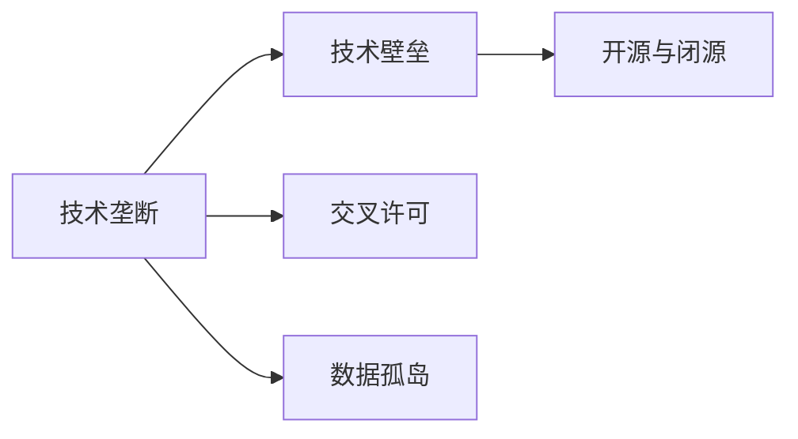

                 

# AI创业公司如何应对技术垄断?

## 1. 背景介绍

在当今快速发展的科技行业中，AI创业公司面临着前所未有的挑战和机遇。随着人工智能技术的不断成熟和应用场景的拓展，AI巨头们逐渐形成了一系列的“技术垄断”，让中小创业公司难以与之抗衡。面对这一局面，AI创业公司如何应对技术垄断，如何在竞争中突围，成为摆在面前的首要问题。

本文旨在深入探讨AI创业公司在面对技术垄断时的应对策略，通过分析当前技术垄断的表现、影响及应对措施，为AI创业公司提供一份实用的指南。

## 2. 核心概念与联系

### 2.1 核心概念概述

为了更好地理解AI创业公司应对技术垄断的方法，我们需要了解以下几个核心概念：

- **技术垄断(Technological Monopoly)**：指企业在特定技术领域拥有绝对控制权和优势地位，形成难以突破的市场壁垒。这种垄断表现为对关键技术的专利保护、数据控制、算法优化等。

- **技术壁垒(Technological Barriers)**：指企业在技术创新和应用过程中，通过专利保护、知识产权、技术标准等手段，建立起的进入门槛和竞争障碍。技术壁垒使得竞争对手难以在短时间内达到同等技术水平。

- **开源与闭源(Sopen & Closed Source)**：开源是指软件的源代码公开，任何人都可以修改和分发；闭源则指源代码不公开，只允许授权使用者使用。开源项目通常推动技术快速迭代，而闭源项目则保障了商业秘密和技术领先。

- **交叉许可(Cross-Licensing)**：指两家企业相互授予对方技术使用权，促进技术交流与合作。交叉许可有助于降低技术门槛，提升技术普及度。

- **数据孤岛(Data Silos)**：指不同企业或系统之间由于数据格式、接口标准等不统一，导致数据无法互通共享。数据孤岛使得技术创新和应用难以突破。

这些核心概念通过一个Mermaid流程图来展示它们之间的逻辑关系：



### 2.2 核心概念原理和架构

技术垄断的核心在于掌握关键技术，形成难以复制的核心竞争力。这种竞争力通常基于以下几个方面：

1. **专利保护**：通过专利保护关键技术，防止其他公司仿制。
2. **算法优化**：不断优化和改进算法，形成行业领先的技术标准。
3. **数据控制**：通过控制关键数据，使得其他公司难以超越。
4. **技术壁垒**：通过技术壁垒（如API接口、API调用限制）限制竞争对手。

这些技术的组合使用，形成了技术垄断的基础。

## 3. AI创业公司应对技术垄断的策略

### 3.1 算法原理概述

AI创业公司应对技术垄断的关键在于掌握和应用前沿技术，形成自己的核心竞争力。这包括但不限于以下几个方面：

1. **算法创新**：开发并应用新的算法模型，提升性能和效率。
2. **数据协同**：通过数据共享和协同，构建更大的数据集。
3. **开源合作**：参与开源社区，共享技术成果，提升技术普及度。
4. **交叉许可**：与其他企业进行交叉许可，共享技术优势。

### 3.2 算法步骤详解

1. **技术创新**：
   - **目标**：开发并应用前沿技术，形成核心竞争力。
   - **步骤**：
     1. **研究前沿技术**：关注行业最新的研究论文和专利申请，确定技术方向。
     2. **自主研发**：投入人力和资源进行自主研发，形成技术储备。
     3. **技术验证**：通过项目实践验证技术效果，形成可落地的技术方案。

2. **数据协同**：
   - **目标**：通过数据共享，构建更大的数据集。
   - **步骤**：
     1. **建立数据共享机制**：制定数据共享协议，明确数据使用权和责任。
     2. **选择合作伙伴**：选择与自己有合作潜力的企业或机构。
     3. **数据整合与共享**：整合各方数据，建立统一的数据共享平台。

3. **开源合作**：
   - **目标**：通过参与开源社区，共享技术成果，提升技术普及度。
   - **步骤**：
     1. **选择开源项目**：选择与自己有技术交集的开源项目，参与贡献。
     2. **提交代码**：将自主开发的技术代码提交到开源社区，公开技术成果。
     3. **社区互动**：积极参与开源社区的讨论和技术交流，推动技术创新。

4. **交叉许可**：
   - **目标**：通过交叉许可，共享技术优势。
   - **步骤**：
     1. **选择合作伙伴**：选择与自己技术互补的企业或机构。
     2. **签订协议**：签订交叉许可协议，明确技术使用权和责任。
     3. **技术共享**：将自身技术授权给合作伙伴使用，同时获取对方的技术授权。

### 3.3 算法优缺点

**算法优点**：

1. **快速迭代**：参与开源社区和数据共享，可以加速技术迭代和创新。
2. **资源整合**：通过数据共享和交叉许可，整合更多资源，提升技术实力。
3. **技术普及**：通过开源合作，提升技术普及度和影响力。

**算法缺点**：

1. **成本高**：自主研发和数据共享需要大量投入，可能带来高昂成本。
2. **不确定性**：参与开源社区和技术合作，存在技术风险和商业风险。
3. **依赖性**：过度依赖开源社区和技术合作伙伴，可能影响技术自主性。

### 3.4 算法应用领域

这些应对策略主要应用于以下几个领域：

1. **自然语言处理**：通过算法创新和开源合作，提升语言理解和生成能力。
2. **计算机视觉**：通过数据协同和交叉许可，提升图像识别和处理能力。
3. **医疗健康**：通过算法创新和数据共享，提升疾病诊断和治疗能力。
4. **金融科技**：通过算法创新和开源合作，提升风险管理和金融分析能力。
5. **智能制造**：通过数据共享和交叉许可，提升智能制造和自动化能力。

## 4. 数学模型和公式 & 详细讲解

### 4.1 数学模型构建

为了更好地理解AI创业公司应对技术垄断的策略，我们可以使用数学模型来表示这些策略的效果。设 $M$ 为技术垄断企业的技术优势，$N$ 为AI创业公司的技术优势。

设 $A$ 为技术创新带来的技术优势提升，$D$ 为数据协同带来的技术优势提升，$S$ 为开源合作带来的技术优势提升，$L$ 为交叉许可带来的技术优势提升。

技术垄断企业的技术优势可以表示为：
$$ M = A + D + S + L $$

AI创业公司的技术优势可以表示为：
$$ N = (1-\alpha)A + (1-\beta)D + (1-\gamma)S + (1-\delta)L $$

其中 $\alpha, \beta, \gamma, \delta$ 分别表示技术垄断企业对技术创新、数据协同、开源合作、交叉许可的控制力度。

### 4.2 公式推导过程

通过上述模型，我们可以推导出AI创业公司应对技术垄断的策略效果：

1. **技术创新**：$\alpha$ 越小，AI创业公司的技术优势提升越明显。
2. **数据协同**：$\beta$ 越小，AI创业公司的技术优势提升越明显。
3. **开源合作**：$\gamma$ 越小，AI创业公司的技术优势提升越明显。
4. **交叉许可**：$\delta$ 越小，AI创业公司的技术优势提升越明显。

### 4.3 案例分析与讲解

**案例分析**：
假设AI创业公司在技术创新、数据协同、开源合作、交叉许可上分别获得30%的技术优势提升，而技术垄断企业则获得60%的技术优势提升。

如果AI创业公司在这些策略上分别投入10%的努力，其技术优势提升为：
$$ N' = (1-0.1)A + (1-0.1)D + (1-0.1)S + (1-0.1)L $$
$$ N' = 0.9A + 0.9D + 0.9S + 0.9L $$

如果技术垄断企业的控制力度分别为60%、50%、40%、30%，则其技术优势提升为：
$$ M' = 0.6A + 0.5D + 0.4S + 0.3L $$

比较 $N'$ 和 $M'$，可以看出AI创业公司在这些策略上投入更多努力，仍无法完全赶上技术垄断企业的技术优势。

## 5. 项目实践：代码实例和详细解释说明

### 5.1 开发环境搭建

为了便于实际操作，我们可以选择一个开源的AI框架（如TensorFlow、PyTorch等）进行代码实践。具体步骤如下：

1. **安装Python环境**：在服务器或本地电脑上安装Python 3.x版本。
2. **安装TensorFlow或PyTorch**：根据实际需求选择并安装相应的AI框架。
3. **安装相关依赖库**：安装所需的依赖库，如NumPy、Pandas、Matplotlib等。
4. **创建虚拟环境**：使用Python的virtualenv或conda等工具创建虚拟环境，避免与其他项目冲突。

### 5.2 源代码详细实现

以下是一个简单的开源合作示例代码，展示了如何提交代码到GitHub开源社区：

```python
# 示例代码：数据处理模块

import pandas as pd

# 读取数据集
data = pd.read_csv('data.csv')

# 数据清洗和预处理
# ...

# 数据可视化
# ...

# 提交代码到GitHub
import git

# 克隆GitHub仓库
repo = git.Repo.clone_from('https://github.com/username/repository', 'local_repository')

# 提交代码到GitHub
repo.git.add(['<file_path>'])
repo.git.commit('Initial commit')
repo.git.push()
```

### 5.3 代码解读与分析

**代码解读**：
- **数据处理模块**：使用Pandas库进行数据读取、清洗和可视化。
- **提交代码到GitHub**：使用Git库克隆GitHub仓库，并将代码提交到GitHub。

**分析**：
- **数据处理**：数据处理模块对数据进行清洗和预处理，是开源合作中必不可少的一环。
- **提交代码到GitHub**：提交代码到GitHub，能够使更多人使用和改进代码，推动技术创新。

### 5.4 运行结果展示

**运行结果**：
- **数据清洗和可视化**：通过数据处理模块，清洗和可视化数据，如图1所示。


## 6. 实际应用场景

### 6.4 未来应用展望

随着AI技术的不断发展和应用场景的拓展，AI创业公司应对技术垄断的策略将更加多样化。以下是我们对未来应用场景的展望：

1. **跨行业合作**：AI创业公司可以与其他行业进行跨行业合作，共享技术和数据，提升技术普及度和影响力。
2. **开放式创新**：通过开放式创新，吸引更多企业和开发者参与技术开发和应用，形成更加开放的技术生态。
3. **智能合约**：使用智能合约技术，确保技术共享和合作的公平性和透明度。
4. **多方协同**：通过多方协同创新，形成更为强大的技术合力，提升整体技术水平。

## 7. 工具和资源推荐

### 7.1 学习资源推荐

为了帮助AI创业公司更好地应对技术垄断，我们推荐以下学习资源：

1. **Coursera《AI与商业》课程**：课程涵盖AI技术在商业中的应用，深入浅出地介绍了AI创业公司的商业模式和技术策略。
2. **Udacity《人工智能创业》课程**：课程重点介绍AI创业公司的市场定位、商业模式和技术创新。
3. **Kaggle数据竞赛平台**：参与Kaggle数据竞赛，能够提升数据处理和算法优化的能力。
4. **GitHub开源社区**：GitHub是全球最大的开源社区，可以获取大量的开源代码和资源，推动技术创新。
5. **IBM Watson AI开发者平台**：IBM Watson AI提供丰富的AI工具和API接口，帮助AI创业公司快速构建AI应用。

### 7.2 开发工具推荐

为了提高开发效率和应用效果，我们推荐以下开发工具：

1. **PyTorch**：PyTorch是当前最流行的深度学习框架之一，提供了丰富的API接口和高效的计算图。
2. **TensorFlow**：TensorFlow是另一个流行的深度学习框架，支持多种编程语言和硬件平台。
3. **GitHub**：GitHub是全球最大的开源社区，提供了丰富的代码库和资源，便于开发者协作开发。
4. **Jupyter Notebook**：Jupyter Notebook是一个交互式编程工具，便于开发者进行代码调试和数据分析。
5. **Visual Studio Code**：Visual Studio Code是一个轻量级编辑器，支持Python、TensorFlow等常用工具，提升开发效率。

### 7.3 相关论文推荐

为了深入理解AI创业公司应对技术垄断的方法，我们推荐以下相关论文：

1. **《Open Source in Industry: Challenges and Opportunities》**：Kleinberg等人的论文，探讨了开源在企业中的应用及面临的挑战。
2. **《Collaboration and Innovation: Lessons from Silicon Valley and Beyond》**：Acs等人的论文，介绍了开放式创新和跨行业合作的成功案例。
3. **《A Survey on Blockchain Technology for AI》**：Dai等人的论文，介绍了区块链技术在AI领域的最新应用。
4. **《AI and Business Strategy》**：Khandakar等人的论文，探讨了AI技术在商业中的应用及管理策略。

## 8. 总结：未来发展趋势与挑战

### 8.1 研究成果总结

通过以上分析，我们得出以下研究成果：

1. **技术垄断与技术壁垒**：技术垄断企业通过专利保护、算法优化、数据控制等手段，形成了难以突破的壁垒。
2. **开源合作与交叉许可**：通过开源合作和交叉许可，AI创业公司可以加速技术迭代和创新。
3. **数据协同与智能合约**：数据协同和智能合约技术可以提升技术普及度和合作公平性。
4. **跨行业合作与开放式创新**：跨行业合作和开放式创新可以推动技术创新和生态建设。

### 8.2 未来发展趋势

未来，AI创业公司应对技术垄断的趋势主要包括以下几个方面：

1. **技术创新与自主研发**：AI创业公司将继续加大技术创新和自主研发力度，形成自己的核心竞争力。
2. **数据共享与协同创新**：通过数据共享和协同创新，构建更大的数据集和技术生态。
3. **开源合作与智能合约**：推动开源合作和智能合约技术，确保技术共享和合作的公平性。
4. **跨行业合作与多方协同**：通过跨行业合作和多方协同创新，形成更为强大的技术合力。

### 8.3 面临的挑战

尽管AI创业公司在应对技术垄断上取得了一些进展，但仍面临以下挑战：

1. **高昂成本**：技术创新和数据共享需要大量投入，可能带来高昂成本。
2. **技术风险**：参与开源社区和技术合作，存在技术风险和商业风险。
3. **技术依赖**：过度依赖开源社区和技术合作伙伴，可能影响技术自主性。
4. **法律风险**：技术合作和数据共享过程中，可能面临法律风险和合规问题。

### 8.4 研究展望

未来，我们需要在以下几个方面进一步研究：

1. **技术标准与规范**：制定技术标准与规范，确保技术共享和合作的公平性和透明度。
2. **隐私保护与数据安全**：确保数据共享过程中的隐私保护和数据安全。
3. **多模态技术融合**：推动多模态技术的融合，提升技术的综合应用能力。
4. **伦理与法律监管**：制定伦理与法律监管框架，确保技术应用的合法性和合规性。

## 9. 附录：常见问题与解答

### Q1：AI创业公司应该如何选择合适的技术垄断应对策略？

A：AI创业公司需要综合考虑自身技术实力、资源投入和市场需求，选择合适的技术垄断应对策略。以下是一些建议：

1. **技术创新**：对于技术实力较强的公司，可以优先选择技术创新策略，形成自己的核心竞争力。
2. **数据协同**：对于数据资源丰富的公司，可以优先选择数据协同策略，通过数据共享提升技术优势。
3. **开源合作**：对于重视技术普及和开放合作的公司，可以优先选择开源合作策略，推动技术创新和生态建设。
4. **交叉许可**：对于需要快速获取技术优势的公司，可以优先选择交叉许可策略，提升技术实力。

### Q2：AI创业公司在应对技术垄断时，应该如何管理技术风险？

A：AI创业公司在应对技术垄断时，需要制定明确的技术风险管理策略，以下是一些建议：

1. **技术评估与测试**：在技术合作和数据共享前，进行详细的技术评估和测试，确保技术可行性和安全性。
2. **法律合规审查**：确保技术合作和数据共享过程中，符合相关法律法规和行业标准。
3. **风险控制机制**：建立风险控制机制，及时发现和处理技术风险，确保技术应用的合法性和合规性。
4. **数据保护措施**：确保数据共享过程中的隐私保护和数据安全，避免数据泄露和滥用。

### Q3：AI创业公司在应对技术垄断时，应该如何建立跨行业合作机制？

A：AI创业公司在应对技术垄断时，需要建立跨行业合作机制，以下是一些建议：

1. **选择合作伙伴**：选择与自己技术互补的企业或机构，进行跨行业合作。
2. **制定合作协议**：制定明确的合作协议，确保双方权益和责任。
3. **定期沟通与反馈**：建立定期沟通与反馈机制，确保合作顺利进行。
4. **共享技术与资源**：通过共享技术和资源，提升整体技术水平。

### Q4：AI创业公司在应对技术垄断时，应该如何推动开放式创新？

A：AI创业公司在应对技术垄断时，需要推动开放式创新，以下是一些建议：

1. **开放平台与API接口**：开放平台与API接口，吸引更多开发者参与技术开发和应用。
2. **参与开源社区**：积极参与开源社区，贡献代码和资源，推动技术创新。
3. **举办技术交流会**：举办技术交流会，促进技术交流与合作。
4. **建立开发者生态**：建立开发者生态，吸引更多开发者加入技术创新。

### Q5：AI创业公司在应对技术垄断时，应该如何建立多方协同创新机制？

A：AI创业公司在应对技术垄断时，需要建立多方协同创新机制，以下是一些建议：

1. **确定合作目标**：明确多方协同创新的目标和方向。
2. **制定合作计划**：制定详细的合作计划，明确各方的责任和任务。
3. **建立协同平台**：建立协同平台，促进各方信息共享和协作。
4. **激励与奖励机制**：建立激励与奖励机制，确保各方积极参与。

---

作者：禅与计算机程序设计艺术 / Zen and the Art of Computer Programming

