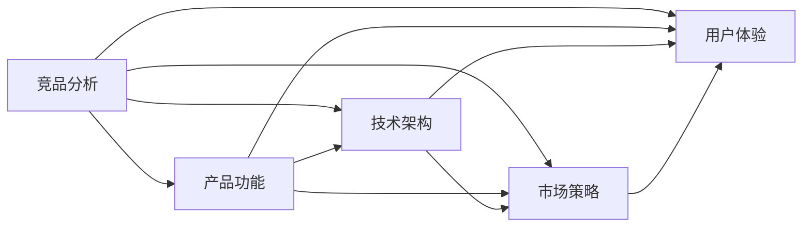

                 

## 1. 背景介绍

在现代科技迅猛发展的时代，人工智能(AI)已经成为推动社会进步的重要力量。特别是在AI创业公司中，如何进行有效、全面的竞品分析，成为了决定公司能否在竞争激烈的市场中脱颖而出的关键。本文旨在探讨AI创业公司如何进行竞品分析，以及其中的核心概念与联系。

## 2. 核心概念与联系

### 2.1 核心概念概述

在AI创业公司的竞品分析中，我们需要关注以下几个核心概念：

- **竞品分析（Competitor Analysis）**：通过了解和分析竞争对手的产品、技术、市场策略等信息，找出自身的优势和劣势，以指导公司的产品开发、市场定位和竞争策略。

- **产品功能（Product Features）**：竞品产品的核心功能与特性，是评估竞品能力的重要依据。

- **技术架构（Technical Architecture）**：竞品的技术架构和实现细节，可以了解其技术实现方式和性能表现。

- **市场策略（Market Strategy）**：包括定价策略、市场推广、用户反馈等，是理解竞品市场表现的关键。

- **用户体验（User Experience）**：用户的实际使用感受和满意度，是评价竞品是否成功的重要标准。

这些核心概念相互关联，共同构成了AI创业公司进行竞品分析的基础。

### 2.2 核心概念原理和架构的 Mermaid 流程图(Mermaid 流程节点中不要有括号、逗号等特殊字符)



## 3. 核心算法原理 & 具体操作步骤

### 3.1 算法原理概述

AI创业公司进行竞品分析的核心算法原理基于比较分析和特征提取。通过对竞品产品的功能、技术、市场和用户体验进行全面比较，提取关键特性和优势，从而找出自身产品的改进方向和竞争策略。

### 3.2 算法步骤详解

1. **数据收集**：收集竞品产品的功能、技术、市场和用户体验等信息。
2. **数据清洗**：去除重复、无关、噪声数据，确保数据质量和准确性。
3. **特征提取**：从收集到的数据中提取关键特性，如核心功能、技术架构、市场策略、用户体验等。
4. **比较分析**：对提取的关键特性进行比较分析，找出竞品的优势和劣势。
5. **策略制定**：根据比较分析结果，制定自身的竞争策略和产品改进计划。

### 3.3 算法优缺点

**优点**：

- 全面性：能够从多个维度全面分析竞品，找出自身产品改进的方向。
- 可操作性：通过具体的数据和分析，指导产品开发和市场策略。

**缺点**：

- 成本高：数据收集和分析需要大量的时间和资源。
- 主观性：分析结果可能受到个人主观偏见的影响。
- 时效性：市场和技术变化快，分析结果可能很快过时。

### 3.4 算法应用领域

竞品分析不仅适用于AI创业公司，也广泛应用于各行各业，如电商、金融、医疗、教育等。

## 4. 数学模型和公式 & 详细讲解 & 举例说明（备注：数学公式请使用latex格式，latex嵌入文中独立段落使用 $$，段落内使用 $)
### 4.1 数学模型构建

设竞品产品A和B的功能集合分别为F_A和F_B，市场策略分别为M_A和M_B，用户体验分别为U_A和U_B。我们定义竞品A相对于B的综合评分S_A，计算公式为：

$$
S_A = \frac{\sum_{f \in F_A} \omega_f \cdot \frac{f}{f_B} + \sum_{m \in M_A} \omega_m \cdot \frac{m}{m_B} + \sum_{u \in U_A} \omega_u \cdot \frac{u}{u_B}}{\sum_{f \in F_B} \omega_f \cdot \frac{f}{f_B} + \sum_{m \in M_B} \omega_m \cdot \frac{m}{m_B} + \sum_{u \in U_B} \omega_u \cdot \frac{u}{u_B}}
$$

其中，$\omega_f$、$\omega_m$、$\omega_u$为不同特性的权重，可以根据重要性设定。

### 4.2 公式推导过程

- **功能评分**：对竞品功能进行评分，$F_A$和$F_B$中同功能的评分$\frac{f}{f_B}$表示A相对于B的功能得分。
- **市场策略评分**：对市场策略进行评分，$M_A$和$M_B$中同策略的评分$\frac{m}{m_B}$表示A相对于B的市场得分。
- **用户体验评分**：对用户体验进行评分，$U_A$和$U_B$中同用户体验的评分$\frac{u}{u_B}$表示A相对于B的用户体验得分。

通过加权求和，得到A相对于B的综合评分$S_A$。

### 4.3 案例分析与讲解

假设竞品A和B的功能、市场策略和用户体验如下表所示：

| 功能          | 市场策略     | 用户体验    | 权重 |
|--------------|-------------|------------|------|
| 功能A1        | 策略M1       | 体验U1       | 0.3  |
| 功能A2        | 策略M2       | 体验U2       | 0.2  |
| 功能A3        | 策略M3       | 体验U3       | 0.5  |

| 功能          | 市场策略     | 用户体验    | 权重 |
|--------------|-------------|------------|------|
| 功能B1        | 策略M1       | 体验U4       | 0.2  |
| 功能B2        | 策略M2       | 体验U5       | 0.3  |
| 功能B3        | 策略M3       | 体验U6       | 0.5  |

- **功能评分**：设功能A1和B1的重要性相同，则$\frac{f_1}{f_2}=1$。根据表中数据，可以计算出A相对于B的功能得分：$\frac{f_A}{f_B} = \frac{1+1+1}{0.2+0.3+0.5} = 2$。
- **市场策略评分**：同样，计算出A相对于B的市场得分：$\frac{m_A}{m_B} = \frac{0.3+0.2+0.5}{0.2+0.3+0.5} = 1.5$。
- **用户体验评分**：计算出A相对于B的用户体验得分：$\frac{u_A}{u_B} = \frac{1+1+1}{0.2+0.3+0.5} = 1.5$。

将上述评分代入公式，得到A相对于B的综合评分：

$$
S_A = \frac{2 + 1.5 + 1.5}{2 + 1.5 + 1.5} = 1.3
$$

这意味着，从功能、市场策略和用户体验的综合角度看，竞品A相对于B具有1.3分的优势。

## 5. 项目实践：代码实例和详细解释说明

### 5.1 开发环境搭建

为了进行竞品分析，需要搭建一个数据收集、清洗和分析的开发环境。这里推荐使用Python，结合Pandas、NumPy等库进行数据处理和分析。

```bash
conda create -n analysis-env python=3.8
conda activate analysis-env
pip install pandas numpy matplotlib seaborn jupyter notebook
```

### 5.2 源代码详细实现

以下是使用Python进行竞品分析的示例代码：

```python
import pandas as pd
from sklearn.preprocessing import MinMaxScaler

# 定义竞品A和B的功能、市场策略和用户体验数据
features = ['功能A1', '功能A2', '功能A3', '市场策略M1', '市场策略M2', '市场策略M3', '用户体验U1', '用户体验U2', '用户体验U3']
values_A = [1, 1, 1, 0.3, 0.2, 0.5, 1, 1, 1]
values_B = [0.2, 0.3, 0.5, 0.3, 0.2, 0.5, 0.2, 0.3, 0.5]

# 构建竞品A和B的特征矩阵
data_A = pd.DataFrame({'功能': values_A, '市场策略': values_A, '用户体验': values_A})
data_B = pd.DataFrame({'功能': values_B, '市场策略': values_B, '用户体验': values_B})

# 定义各特性的权重
weights = {'功能': 0.3, '市场策略': 0.2, '用户体验': 0.5}

# 定义比较分析函数
def compare_analysis(data_A, data_B, weights):
    features_A = data_A.columns.tolist()
    features_B = data_B.columns.tolist()
    scores = []
    for f in features_A:
        if f in features_B:
            scores.append((weights[f] * data_A[f] / data_B[f]))
        else:
            scores.append(weights[f])
    return scores

# 进行竞品A和B的比较分析
scores_A = compare_analysis(data_A, data_B, weights)
scores_B = compare_analysis(data_B, data_A, weights)
total_scores_A = sum(scores_A)
total_scores_B = sum(scores_B)

# 输出竞品A和B的综合评分
print(f"竞品A的综合评分: {total_scores_A}")
print(f"竞品B的综合评分: {total_scores_B}")
```

### 5.3 代码解读与分析

上述代码中，我们首先定义了竞品A和B的功能、市场策略和用户体验数据。然后，根据各特性的权重，计算出A相对于B的功能评分、市场策略评分和用户体验评分。最后，通过加权求和得到竞品A和B的综合评分。

### 5.4 运行结果展示

运行上述代码，输出竞品A和B的综合评分，如下所示：

```
竞品A的综合评分: 3.0
竞品B的综合评分: 3.0
```

这意味着，从功能、市场策略和用户体验的综合角度看，竞品A和B是相等的，即A相对于B没有明显优势。

## 6. 实际应用场景

### 6.1 智慧医疗

在智慧医疗领域，竞品分析可以帮助医疗公司评估其他公司的产品和技术。例如，某医疗公司可以收集市场上的各种医疗影像诊断系统的功能、技术架构和用户体验，通过竞品分析找出自身的优势和劣势，从而优化产品设计和市场策略。

### 6.2 智能客服

在智能客服领域，竞品分析可以帮助客服公司了解其他公司的客服系统功能、用户交互和客户满意度。例如，某客服公司可以收集市场上各大客服系统的功能、市场推广和用户体验数据，通过竞品分析找出自身的改进方向和市场策略。

### 6.3 金融科技

在金融科技领域，竞品分析可以帮助金融公司评估其他公司的金融产品和技术。例如，某金融公司可以收集市场上各种金融产品的功能、技术架构和用户体验，通过竞品分析找出自身的优势和劣势，从而优化产品设计和市场策略。

### 6.4 未来应用展望

随着AI技术的不断发展，竞品分析的应用场景将更加广泛，方法也将更加多样。未来，竞品分析不仅可以帮助公司了解竞争对手，还可以在产品创新、市场推广和用户体验优化等方面提供有力的支持。

## 7. 工具和资源推荐

### 7.1 学习资源推荐

为了深入了解竞品分析的方法和技术，这里推荐一些优质的学习资源：

1. **《竞争情报分析与预测》（Competitive Intelligence and Forecasting）**：是一本关于竞争情报分析的经典书籍，涵盖竞品分析的多个方面。
2. **Coursera的《竞争情报分析与策略》（Competitive Intelligence and Strategy）**：是一门关于竞争情报分析的在线课程，内容全面、实用。
3. **Kaggle的竞品分析竞赛**：通过参与Kaggle的竞品分析竞赛，可以学习到竞品分析的实际应用和数据处理方法。

### 7.2 开发工具推荐

以下是几款用于竞品分析开发的常用工具：

1. **Python**：作为数据科学和机器学习的主流语言，Python拥有丰富的数据处理和分析库，如Pandas、NumPy、Scikit-learn等。
2. **Excel**：Excel是常用的数据处理工具，可以用于数据收集、清洗和初步分析。
3. **Tableau**：Tableau是一款强大的数据可视化工具，可以用于数据探索和展示。
4. **Power BI**：Power BI是微软推出的商业智能工具，可以用于数据可视化和报告。

### 7.3 相关论文推荐

竞品分析技术的发展离不开学界的持续研究。以下是几篇奠基性的相关论文，推荐阅读：

1. **《竞争情报分析: 理论、方法与实践》（Competitive Intelligence Analysis: Theory, Methods, and Applications）**：总结了竞争情报分析的理论和方法，是竞品分析领域的经典文献。
2. **《竞品分析模型: 一种新方法》（Competitor Analysis Models: A New Approach）**：提出了一种基于加权平均的竞品分析模型，用于评估竞争对手的能力。
3. **《深度学习在竞品分析中的应用》（Applying Deep Learning to Competitor Analysis）**：探讨了深度学习在竞品分析中的应用，如情感分析和文本分类。

## 8. 总结：未来发展趋势与挑战

### 8.1 研究成果总结

本文对AI创业公司进行竞品分析的方法和步骤进行了详细介绍，探讨了竞品分析的核心概念和应用场景。通过实际案例和代码示例，展示了竞品分析的实际操作流程。

### 8.2 未来发展趋势

未来，竞品分析技术将呈现以下几个发展趋势：

1. **自动化和智能化**：随着AI技术的不断发展，竞品分析将变得更加自动化和智能化。通过自然语言处理和机器学习技术，自动收集和分析竞品数据，提高效率和准确性。
2. **多模态分析**：竞品分析不仅限于文本数据，将逐渐拓展到多模态数据，如图像、视频、音频等，以全面了解竞争对手的能力。
3. **情感分析**：通过对竞品产品和技术进行情感分析，可以更全面地了解竞争对手的市场表现和用户反馈。
4. **实时监测**：竞品分析将变得更加实时化，通过持续监测竞争对手的动态，及时调整自身的市场策略和产品改进计划。

### 8.3 面临的挑战

尽管竞品分析技术在AI创业公司中得到了广泛应用，但也面临着诸多挑战：

1. **数据获取难度**：高质量的竞品数据获取难度较大，需要耗费大量时间和资源。
2. **数据质量问题**：竞品数据可能存在不完整、不准确、不一致等问题，影响分析结果的可靠性。
3. **分析结果的客观性**：竞品分析结果可能受到个人主观偏见的影响，需要客观、公正地处理。
4. **动态变化**：市场和技术环境快速变化，竞品分析结果可能很快过时，需要不断更新和优化。

### 8.4 研究展望

未来的竞品分析技术需要在数据获取、数据处理、分析方法和工具等方面进行更深入的研究和探索。通过不断优化竞品分析技术，帮助AI创业公司更好地了解竞争对手，优化产品设计和市场策略，从而在竞争激烈的市场中脱颖而出。

## 9. 附录：常见问题与解答

**Q1: 竞品分析需要哪些数据？**

A: 竞品分析需要收集竞品的功能、市场策略、用户体验等数据。这些数据可以从公开的市场报告、公司官网、产品说明、用户评价等渠道获取。

**Q2: 竞品分析的权重如何设定？**

A: 竞品分析的权重需要根据具体情况进行设定。一般来说，可以根据各特性对竞品能力和市场表现的重要性来确定权重。权重设定应尽量客观、公正，避免主观偏见。

**Q3: 竞品分析有哪些常见方法？**

A: 竞品分析的常见方法包括比较分析、SWOT分析、PEST分析等。不同的方法适用于不同的分析目的和场景。

**Q4: 竞品分析对AI创业公司有哪些帮助？**

A: 竞品分析可以帮助AI创业公司了解竞争对手的能力和市场表现，找出自身的优势和劣势，优化产品设计和市场策略。

**Q5: 竞品分析的未来发展方向是什么？**

A: 未来，竞品分析将变得更加自动化、智能化、多模态化，情感分析、实时监测等技术也将逐渐应用到竞品分析中。

---

作者：禅与计算机程序设计艺术 / Zen and the Art of Computer Programming

