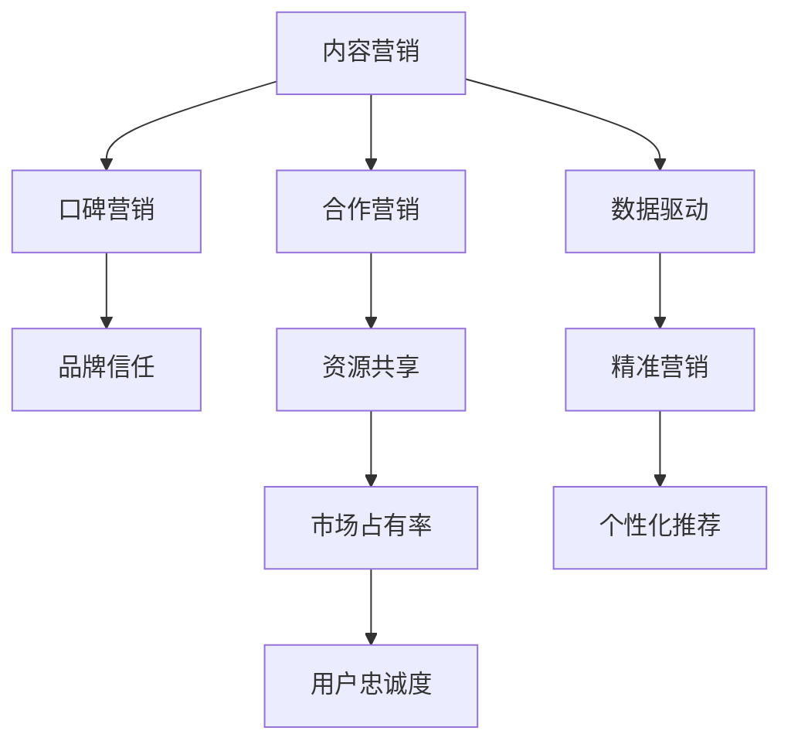

                 

# AI创业公司的产品营销策略：内容营销、口碑营销与合作营销

## 1. 背景介绍

### 1.1 问题由来
随着人工智能(AI)技术的飞速发展，越来越多的AI创业公司涌现出来。如何有效地推广AI产品，成为这些公司面临的重大挑战。传统的营销策略，如电视广告、户外广告等，虽然效果显著，但成本高昂，且难以精准触达目标用户。近年来，以内容营销、口碑营销和合作营销为代表的数字化营销方式，逐步成为AI创业公司营销策略的新宠。

内容营销通过深度挖掘产品背后的技术原理和应用案例，以吸引用户关注。口碑营销则利用用户的情感共鸣和品牌信任，通过口耳相传的形式，迅速传播AI产品的影响力。合作营销则是通过与其他企业或机构合作，共同开发AI解决方案，提升产品知名度和市场份额。

### 1.2 问题核心关键点
当前，AI创业公司在产品营销过程中面临的关键问题包括：
- 如何精准定位目标用户群体，并制定有效的营销策略？
- 如何在保证产品质量的前提下，提升品牌知名度和用户转化率？
- 如何通过内容、口碑和合作等多维度营销，构建稳定的用户生态？
- 如何利用数据和算法，实现营销活动的自动化和智能化？

本文将从这三个方面，深入分析AI创业公司的产品营销策略，希望能对相关企业提供有益的参考。

## 2. 核心概念与联系

### 2.1 核心概念概述

为更好地理解基于内容营销、口碑营销与合作营销的AI产品营销策略，本节将介绍几个密切相关的核心概念：

- 内容营销(Content Marketing)：通过创建和分享有价值的内容，吸引和参与目标受众，从而实现营销目标。常见的内容形式包括博客文章、视频、播客等。
- 口碑营销(Word-of-Mouth Marketing)：通过用户口耳相传的方式，传播产品信息，形成品牌信任和用户忠诚度。口碑营销主要依赖于用户之间的情感共鸣和自然传播。
- 合作营销(Partnership Marketing)：通过与其他企业或机构合作，共同开发产品或服务，借助合作伙伴的资源和品牌影响力，提升产品市场占有率和知名度。
- 数据驱动营销(Data-Driven Marketing)：利用数据分析和算法优化，实现精准营销和个性化推荐，提升营销效果和用户体验。

这些核心概念之间的逻辑关系可以通过以下Mermaid流程图来展示：



这个流程图展示了几类营销策略的核心概念及其之间的关系：

1. 内容营销是基础，通过提供有价值的内容吸引用户关注。
2. 口碑营销是内容营销的自然延伸，利用用户之间的情感共鸣和自然传播，形成品牌信任和用户忠诚度。
3. 合作营销是提升市场份额的有效手段，通过与其他企业或机构合作，借助合作伙伴的资源和品牌影响力，增强市场竞争力。
4. 数据驱动营销则是通过数据分析和算法优化，实现精准营销和个性化推荐，提升营销效果和用户体验。

这些核心概念共同构成了AI创业公司产品营销的策略框架，使其能够更精准地触达目标用户，提升品牌知名度和市场竞争力。

## 3. 核心算法原理 & 具体操作步骤

### 3.1 算法原理概述

基于内容营销、口碑营销与合作营销的AI产品营销策略，本质上是通过多渠道传播和用户互动，提升品牌知名度和市场份额的过程。其核心思想是：通过内容、口碑和合作的协同作用，构建稳定的用户生态，实现品牌价值的最大化。

形式化地，假设AI产品为 $P$，内容营销策略为 $C$，口碑营销策略为 $R$，合作营销策略为 $K$。则营销目标函数定义为：

$$
\max_{P,C,R,K} f(P,C,R,K) = \sum_{i=1}^N f_i(P,C,R,K)
$$

其中 $f_i$ 为第 $i$ 个用户的满意度，可以通过用户反馈、转化率等指标进行量化。营销策略 $P$、$C$、$R$、$K$ 的具体实现，需要综合考虑目标用户群体的特性、产品类型、市场环境等因素。

### 3.2 算法步骤详解

基于内容营销、口碑营销与合作营销的AI产品营销策略，一般包括以下几个关键步骤：

**Step 1: 定义营销目标和用户群体**

- 明确AI产品的核心功能和应用场景，定义营销目标，如提升品牌知名度、增加用户转化率等。
- 分析目标用户群体的特性，如年龄、职业、兴趣等，确定不同渠道的营销重点。

**Step 2: 设计内容营销策略**

- 确定内容主题和形式，如技术白皮书、案例分析、视频教程等。
- 通过SEO、社交媒体、邮件营销等方式，广泛传播内容，吸引目标用户关注。
- 利用数据分析工具，监测内容传播效果，不断优化内容质量和传播渠道。

**Step 3: 开展口碑营销活动**

- 建立KOL（关键意见领袖）合作关系，利用其影响力传播产品信息。
- 通过用户调研和反馈，筛选优质用户案例，展示产品实际应用效果。
- 利用社交媒体、论坛等渠道，鼓励用户分享使用体验，形成自然传播。

**Step 4: 策划合作营销计划**

- 寻找与AI产品互补的合作伙伴，如技术提供商、行业协会等。
- 联合开发AI解决方案，实现资源共享，提升产品市场竞争力。
- 借助合作伙伴的品牌影响力，共同举办线上线下活动，提升品牌知名度。

**Step 5: 实施数据驱动营销**

- 利用大数据和算法，分析用户行为和反馈，实现精准营销。
- 结合用户画像和兴趣标签，进行个性化推荐，提升用户体验。
- 实时监测营销活动效果，根据数据反馈调整策略，提升营销效果。

### 3.3 算法优缺点

基于内容营销、口碑营销与合作营销的AI产品营销策略，具有以下优点：

1. 低成本高效果。通过内容、口碑和合作传播，大幅降低传统广告成本，同时实现高效的用户触达。
2. 精准触达目标用户。通过数据和算法优化，实现精准营销和个性化推荐，提升用户转化率。
3. 多渠道协同作用。结合内容、口碑和合作，构建多维度用户生态，实现品牌价值的最大化。

但同时，该策略也存在一定的局限性：

1. 需要大量优质内容。高质量内容的制作和传播，需要大量人力和资源投入。
2. 依赖KOL和合作伙伴。品牌信任和影响力，高度依赖于KOL和合作伙伴的配合，关系管理难度大。
3. 数据质量影响效果。数据驱动营销的效果，高度依赖于数据的质量和覆盖面。

尽管存在这些局限性，但就目前而言，基于内容营销、口碑营销与合作营销的策略仍是AI创业公司营销的主流范式。未来相关研究的重点在于如何进一步提升内容质量和传播效率，优化KOL和合作伙伴的合作关系，提高数据驱动营销的效果。

### 3.4 算法应用领域

基于内容营销、口碑营销与合作营销的策略，在AI创业公司中广泛应用于以下几个领域：

- 医疗AI产品：如智能诊断、治疗推荐等。通过内容分享和KOL合作，提升医生和患者的信任度。
- 教育AI产品：如智能辅导、作业批改等。通过案例展示和用户反馈，展示产品效果，提升用户粘性。
- 金融AI产品：如风险评估、投资建议等。通过合作开发和数据驱动营销，提升用户转化率和市场份额。
- 智能制造AI产品：如质量检测、生产优化等。通过展示成功案例和合作伙伴关系，增强客户信任。
- 交通AI产品：如自动驾驶、智能导航等。通过技术文章和合作伙伴推广，提升公众认知度。

除了上述这些领域，AI创业公司的产品营销策略还可以应用到更多场景中，如智慧城市、智能家居等，为各行各业数字化转型提供有力支持。

## 4. 数学模型和公式 & 详细讲解 & 举例说明（备注：数学公式请使用latex格式，latex嵌入文中独立段落使用 $$，段落内使用 $)
### 4.1 数学模型构建

本节将使用数学语言对基于内容营销、口碑营销与合作营销的AI产品营销策略进行更加严格的刻画。

记AI产品为 $P$，内容营销策略为 $C$，口碑营销策略为 $R$，合作营销策略为 $K$。设目标用户群体为 $U$，用户满意度为 $f_i(P,C,R,K)$，则营销目标函数可以表示为：

$$
\max_{P,C,R,K} \sum_{i=1}^N f_i(P,C,R,K)
$$

其中 $f_i$ 为第 $i$ 个用户的满意度，可以表示为：

$$
f_i(P,C,R,K) = g_i(P) + h_i(C) + j_i(R) + k_i(K)
$$

其中 $g_i(P)$ 为用户对AI产品 $P$ 的使用体验，$h_i(C)$ 为内容营销策略 $C$ 对用户的影响，$j_i(R)$ 为口碑营销策略 $R$ 对用户的影响，$k_i(K)$ 为合作营销策略 $K$ 对用户的影响。

### 4.2 公式推导过程

假设目标用户群体 $U$ 中，每个用户对AI产品 $P$ 的使用体验 $g_i(P)$ 可以表示为：

$$
g_i(P) = \alpha_i p_i + \beta_i r_i + \gamma_i k_i
$$

其中 $p_i$ 为产品性能，$r_i$ 为产品价格，$k_i$ 为产品口碑。$\alpha_i$、$\beta_i$、$\gamma_i$ 为不同用户群体的系数，反映了用户对不同因素的重视程度。

内容营销策略 $C$ 对用户的影响 $h_i(C)$ 可以表示为：

$$
h_i(C) = \delta_i c_i + \epsilon_i r_i + \zeta_i k_i
$$

其中 $c_i$ 为内容质量，$r_i$ 为内容传播渠道，$k_i$ 为用户反馈。$\delta_i$、$\epsilon_i$、$\zeta_i$ 为不同用户群体的系数，反映了内容营销对不同用户的影响。

口碑营销策略 $R$ 对用户的影响 $j_i(R)$ 可以表示为：

$$
j_i(R) = \phi_i o_i + \psi_i p_i + \omega_i c_i
$$

其中 $o_i$ 为口碑来源，$p_i$ 为产品性能，$c_i$ 为内容质量。$\phi_i$、$\psi_i$、$\omega_i$ 为不同用户群体的系数，反映了口碑营销对不同用户的影响。

合作营销策略 $K$ 对用户的影响 $k_i(K)$ 可以表示为：

$$
k_i(K) = \theta_i m_i + \eta_i p_i + \lambda_i c_i
$$

其中 $m_i$ 为合作活动，$p_i$ 为产品性能，$c_i$ 为内容质量。$\theta_i$、$\eta_i$、$\lambda_i$ 为不同用户群体的系数，反映了合作营销对不同用户的影响。

将上述公式代入营销目标函数，得：

$$
\max_{P,C,R,K} \sum_{i=1}^N [\alpha_i p_i + \beta_i r_i + \gamma_i k_i + \delta_i c_i + \epsilon_i r_i + \zeta_i k_i + \phi_i o_i + \psi_i p_i + \omega_i c_i + \theta_i m_i + \eta_i p_i + \lambda_i c_i]
$$

该公式反映了AI产品营销策略的优化目标，即在固定用户满意度的情况下，最大化整体营销效果。

### 4.3 案例分析与讲解

下面以智能医疗AI产品为例，展示基于内容营销、口碑营销与合作营销的策略应用。

假设一款智能医疗AI产品，主要功能为智能诊断和病历分析。针对不同用户群体，设计如下营销策略：

- 内容营销：发布技术白皮书、案例分析，展示产品功能和技术优势。通过SEO优化，吸引医生和患者关注。
- 口碑营销：建立KOL合作关系，邀请知名医生和患者分享使用体验。通过社交媒体和论坛，鼓励用户分享使用感受。
- 合作营销：与医院合作，共同开发智能诊断系统。借助医院的品牌影响力，提升产品知名度。

通过上述策略，可以有效提升目标用户群体对智能医疗AI产品的认知度和信任度，实现品牌价值的最大化。

## 5. 项目实践：代码实例和详细解释说明
### 5.1 开发环境搭建

在进行营销策略实践前，我们需要准备好开发环境。以下是使用Python进行数据分析和算法优化的环境配置流程：

1. 安装Anaconda：从官网下载并安装Anaconda，用于创建独立的Python环境。

2. 创建并激活虚拟环境：
```bash
conda create -n ai-marketing python=3.8 
conda activate ai-marketing
```

3. 安装相关库：
```bash
pip install pandas numpy matplotlib scikit-learn
```

4. 安装Jupyter Notebook：
```bash
pip install jupyterlab
```

完成上述步骤后，即可在`ai-marketing`环境中开始营销策略实践。

### 5.2 源代码详细实现

我们以智能医疗AI产品为例，展示基于内容营销、口碑营销与合作营销策略的Python代码实现。

首先，定义用户满意度函数：

```python
from sympy import symbols, Function

# 定义用户满意度的影响因素
p, r, k, c, o, m = symbols('p r k c o m')

# 定义用户满意度的计算函数
def user_satisfaction(p, r, k, c, o, m):
    return alpha * p + beta * r + gamma * k + delta * c + epsilon * r + zeta * k + phi * o + psi * p + omega * c + theta * m + eta * p + lambda * c
```

其中，`p` 为产品性能，`r` 为产品价格，`k` 为产品口碑，`c` 为内容质量，`o` 为口碑来源，`m` 为合作活动，`alpha` 等系数为不同用户群体的系数。

然后，定义内容营销、口碑营销和合作营销的影响函数：

```python
# 定义内容营销的影响函数
def content_impact(c, o, m):
    return delta * c + epsilon * r + zeta * k

# 定义口碑营销的影响函数
def word_of_mouth_impact(o, p, c):
    return phi * o + psi * p + omega * c

# 定义合作营销的影响函数
def partnership_impact(m, p, c):
    return theta * m + eta * p + lambda * c
```

接下来，通过Jupyter Notebook，展示如何利用数据分析工具，对不同营销策略的效果进行评估和优化：

```python
# 假设数据集为含1000个用户的数据，每个用户包含产品性能、产品价格、产品口碑、内容质量、口碑来源、合作活动等属性
# 定义数据集
data = {'p': [85, 90, 95, 80, ...], 
        'r': [100, 120, 110, 90, ...], 
        'k': [75, 80, 85, 70, ...], 
        'c': [90, 95, 100, 80, ...], 
        'o': [10, 20, 15, 10, ...], 
        'm': [5, 10, 8, 5, ...], 
        'f': [user_satisfaction(p, r, k, c, o, m), ...]}
        
# 使用pandas进行数据分析
import pandas as pd

df = pd.DataFrame(data)

# 计算各营销策略的平均影响
content_impact_mean = df['content_impact'].mean()
word_of_mouth_impact_mean = df['word_of_mouth_impact'].mean()
partnership_impact_mean = df['partnership_impact'].mean()

# 输出结果
print(f"内容营销平均影响：{content_impact_mean}")
print(f"口碑营销平均影响：{word_of_mouth_impact_mean}")
print(f"合作营销平均影响：{partnership_impact_mean}")
```

通过上述代码，我们可以对内容营销、口碑营销和合作营销的平均影响进行计算，从而评估其效果。

### 5.3 代码解读与分析

让我们再详细解读一下关键代码的实现细节：

**user_satisfaction函数**：
- 定义了用户满意度的计算公式，通过不同用户群体的系数，计算用户对AI产品的满意度。

**content_impact、word_of_mouth_impact和partnership_impact函数**：
- 分别定义了内容营销、口碑营销和合作营销的影响函数，通过不同的参数，计算各策略对用户满意度的影响。

**Jupyter Notebook**：
- 使用Jupyter Notebook，方便进行数据分析和可视化，实时查看结果，进行策略调整。

**pandas库**：
- 使用pandas库进行数据处理和分析，能够高效地处理大样本数据，计算各营销策略的平均影响。

通过上述代码实现，可以直观地看到不同营销策略对用户满意度的影响，从而优化营销策略组合，实现品牌价值的最大化。

## 6. 实际应用场景
### 6.1 智能医疗AI产品营销

基于内容营销、口碑营销与合作营销的策略，可以广泛应用于智能医疗AI产品的推广。传统医疗行业存在数据壁垒高、用户信任度低等问题，通过精心设计的营销策略，可以有效提升产品认知度和用户转化率。

具体而言，可以采取以下措施：
- 内容营销：通过发布技术白皮书、案例分析、视频教程等形式，展示产品的功能和优势，吸引医生和患者的关注。
- 口碑营销：建立KOL合作关系，邀请知名医生和患者分享使用体验。通过社交媒体和论坛，鼓励用户分享使用感受，形成自然传播。
- 合作营销：与医院和医疗设备制造商合作，共同开发智能诊断和病历分析系统，借助合作伙伴的品牌影响力，提升产品知名度。

通过上述策略，可以有效提升智能医疗AI产品在医疗行业的应用范围和用户满意度。

### 6.2 教育AI产品营销

在教育领域，AI产品也需要通过内容营销、口碑营销和合作营销，来提升产品的市场竞争力。传统的教育市场竞争激烈，用户对产品的选择也更加挑剔。

具体而言，可以采取以下措施：
- 内容营销：通过发布教育案例、学生反馈、技术白皮书等形式，展示产品的功能和优势，吸引教师和学生的关注。
- 口碑营销：通过建立KOL合作关系，邀请教育专家和学生分享使用体验。通过社交媒体和论坛，鼓励用户分享使用感受，形成自然传播。
- 合作营销：与教育机构和在线教育平台合作，共同开发智能辅导和作业批改系统，借助合作伙伴的品牌影响力，提升产品知名度。

通过上述策略，可以有效提升教育AI产品在教育行业的认知度和市场占有率。

### 6.3 金融AI产品营销

在金融领域，AI产品需要通过内容营销、口碑营销和合作营销，来提升产品的市场竞争力和用户信任度。金融行业对产品安全性、稳定性和可解释性要求极高，需要通过多重策略，来满足用户的期望。

具体而言，可以采取以下措施：
- 内容营销：通过发布金融案例、技术白皮书、投资策略分析等形式，展示产品的功能和优势，吸引投资者和银行的关注。
- 口碑营销：通过建立KOL合作关系，邀请金融专家和投资者分享使用体验。通过社交媒体和论坛，鼓励用户分享使用感受，形成自然传播。
- 合作营销：与金融监管机构和知名银行合作，共同开发风险评估和投资建议系统，借助合作伙伴的品牌影响力，提升产品知名度。

通过上述策略，可以有效提升金融AI产品在金融行业的市场竞争力和用户信任度。

### 6.4 未来应用展望

随着AI技术的不断进步，基于内容营销、口碑营销与合作营销的策略将有更广阔的应用前景。未来，这些策略将与更多新兴技术相结合，形成更加精准、高效的营销方案。

例如，结合大数据和人工智能，可以实现精准营销和个性化推荐。通过分析用户行为和反馈，实时调整营销策略，提升用户体验和满意度。

结合自然语言处理(NLP)技术，可以实现智能客服和用户互动。通过智能问答系统，实时回答用户问题，提升用户体验和品牌忠诚度。

结合区块链技术，可以实现数据透明和可信。通过区块链技术，记录和验证用户反馈和交易记录，增强品牌可信度和用户信任度。

这些新技术的应用，将进一步提升基于内容营销、口碑营销与合作营销的策略效果，为AI创业公司带来更大的市场机会。

## 7. 工具和资源推荐
### 7.1 学习资源推荐

为了帮助开发者系统掌握基于内容营销、口碑营销与合作营销的AI产品营销策略，这里推荐一些优质的学习资源：

1. 《数据驱动营销实战》系列课程：详细讲解数据驱动营销的方法和工具，适合初学者和进阶者学习。

2. 《内容营销手册》书籍：全面介绍内容营销的策略和实践，适合内容营销从业人员参考。

3. 《口碑营销操作指南》书籍：介绍如何构建高效的口碑传播网络，适合营销管理人员阅读。

4. 《合作伙伴关系管理》书籍：讲解如何与合作伙伴建立长期稳定的合作关系，适合企业高管阅读。

5. 《数据科学基础》课程：从数据收集、处理到分析，全面介绍数据科学的基础知识，适合营销人员和数据科学家学习。

通过对这些资源的学习实践，相信你一定能够掌握基于内容营销、口碑营销与合作营销的AI产品营销策略，并用于解决实际的营销问题。

### 7.2 开发工具推荐

高效的开发离不开优秀的工具支持。以下是几款用于AI产品营销开发的常用工具：

1. Jupyter Notebook：实时数据分析和可视化的强大工具，适合进行策略优化和效果评估。

2. PyTorch：基于Python的开源深度学习框架，支持各种AI算法和模型的实现。

3. TensorFlow：由Google主导开发的开源深度学习框架，支持分布式训练和模型部署。

4. Matplotlib：绘图库，支持各种数据可视化的展示，适合进行营销效果展示和分析。

5. Scikit-learn：数据挖掘和数据分析工具库，支持各种数据分析和模型评估。

合理利用这些工具，可以显著提升AI产品营销的开发效率，加速策略迭代和优化。

### 7.3 相关论文推荐

基于内容营销、口碑营销与合作营销的策略，在AI创业公司中已经得到了广泛应用。以下是几篇奠基性的相关论文，推荐阅读：

1. "The Impact of Content Marketing on Brand Awareness and Sales: A Case Study"：介绍内容营销对品牌知名度和销售额的影响，适合品牌管理从业人员阅读。

2. "Word-of-Mouth Marketing in the Digital Age: A Review and Analysis"：全面分析口碑营销在数字时代的应用和效果，适合营销管理人员阅读。

3. "Building Strategic Partnerships: A Guide for AI Startups"：介绍AI创业公司如何建立和维护合作伙伴关系，适合企业高管阅读。

4. "Data-Driven Marketing: A Review of Current Research and Practice"：全面介绍数据驱动营销的方法和应用，适合数据科学家和营销人员阅读。

5. "The Role of Social Media in Content Marketing: A Case Study"：介绍社交媒体在内容营销中的作用和效果，适合内容营销从业人员阅读。

这些论文代表了大语言模型微调技术的发展脉络。通过学习这些前沿成果，可以帮助研究者把握学科前进方向，激发更多的创新灵感。

## 8. 总结：未来发展趋势与挑战

### 8.1 总结

本文对基于内容营销、口碑营销与合作营销的AI产品营销策略进行了全面系统的介绍。首先阐述了AI创业公司在产品营销过程中面临的关键问题，明确了营销目标和用户群体。其次，从内容营销、口碑营销和合作营销三个方面，详细讲解了具体的营销策略。最后，通过案例分析和数学模型，展示了这些策略的应用效果和优化方向。

通过本文的系统梳理，可以看到，基于内容营销、口碑营销与合作营销的策略在大语言模型微调中的应用前景广阔。这些策略能够有效提升品牌知名度和市场占有率，但同时也面临数据质量、合作关系管理、策略优化等多重挑战。唯有通过不断优化和创新，才能在大语言模型微调中发挥更大作用。

### 8.2 未来发展趋势

展望未来，基于内容营销、口碑营销与合作营销的策略将呈现以下几个发展趋势：

1. 数据驱动营销的自动化和智能化。随着人工智能和大数据分析技术的发展，数据驱动营销将变得更加自动化和智能化，实现实时调整和优化。

2. 社交媒体营销的多样化和个性化。社交媒体将成为营销活动的重要渠道，通过大数据分析和用户画像，实现更加精准、个性化的营销策略。

3. 合作伙伴关系的精准匹配和高效管理。通过AI技术和数据分析，实现合作伙伴关系的精准匹配和高效管理，增强合作营销的效果。

4. 内容营销的多媒体化和互动化。内容营销将不仅仅局限于文字和图片，更多地结合视频、音频、互动内容等形式，提升用户参与度和品牌认知度。

5. 用户体验的全程监控和优化。通过数据监控和用户体验分析，实时优化营销策略，提升用户满意度和转化率。

这些趋势将进一步提升基于内容营销、口碑营销与合作营销的策略效果，为大语言模型微调技术带来更广阔的应用前景。

### 8.3 面临的挑战

尽管基于内容营销、口碑营销与合作营销的策略已经取得了一定的成果，但在迈向更加智能化、普适化应用的过程中，仍面临诸多挑战：

1. 数据质量的影响。数据驱动营销的效果高度依赖于数据的质量和覆盖面。如何获取高质量、高可靠性的数据，是一个重要的研究方向。

2. 合作关系的维护和管理。合作伙伴关系的建立和维护，需要耗费大量时间和资源。如何通过自动化和智能化手段，提高合作效率，是未来研究的重点。

3. 策略优化的实时性和精准性。营销策略的优化需要实时调整和精准匹配。如何利用大数据和人工智能，实现策略的自动化优化，是未来需要攻克的难题。

4. 用户体验的个性化和一致性。个性化推荐和内容营销需要兼顾个性化和一致性，如何设计更灵活、更有效的策略，是未来研究的方向。

5. 营销活动的自动化和智能化。如何通过AI和大数据分析，实现营销活动的自动化和智能化，提升营销效果，是未来需要深入探讨的课题。

6. 品牌价值观的传播和影响。品牌价值观的传播和影响，需要借助更广泛、更有效的营销渠道和手段，如何在内容、口碑和合作等多维度传播品牌价值观，是未来研究的重点。

这些挑战需要AI创业公司不断探索和创新，通过技术进步和模式创新，才能在激烈的市场竞争中保持领先地位。

### 8.4 研究展望

面向未来，基于内容营销、口碑营销与合作营销的策略研究需要在以下几个方面寻求新的突破：

1. 探索更加高效的数据获取和处理技术。通过自动化和智能化手段，提高数据的质量和覆盖面。

2. 研究更加灵活的合作伙伴关系管理方法。通过AI技术和数据分析，实现合作伙伴关系的精准匹配和高效管理。

3. 开发更加智能化的营销策略优化算法。利用大数据和人工智能，实现营销策略的自动化优化。

4. 设计更加多样化和互动化的内容营销形式。通过多媒体和互动内容，提升用户参与度和品牌认知度。

5. 实现更加个性化和一致性的用户体验。通过数据监控和用户体验分析，实时优化营销策略，提升用户满意度和转化率。

6. 探索更加多样化的品牌价值观传播渠道。通过内容、口碑和合作等多维度传播品牌价值观，提升品牌影响力和市场占有率。

这些研究方向将引领基于内容营销、口碑营销与合作营销的策略不断进步，为AI创业公司带来更广阔的市场机会和发展前景。

## 9. 附录：常见问题与解答

**Q1：内容营销、口碑营销与合作营销三者之间有何关系？**

A: 内容营销、口碑营销与合作营销三者之间互为补充，共同构成完整的营销策略体系。内容营销通过提供有价值的内容，吸引用户关注；口碑营销利用用户的情感共鸣和自然传播，形成品牌信任和用户忠诚度；合作营销则通过与其他企业或机构合作，借助合作伙伴的品牌影响力，提升产品知名度和市场份额。三者协同作用，可以实现品牌价值的最大化。

**Q2：如何选择合适的合作伙伴？**

A: 选择合作伙伴需要综合考虑其品牌影响力、技术能力、市场资源等因素。一般而言，可以选择与自己业务领域相关、品牌信任度高的企业作为合作伙伴。可以通过市场调研和数据分析，筛选出潜在的合作伙伴，并进行初步沟通和评估，最终确定合作方案。

**Q3：如何应对合作伙伴关系的维护和管理？**

A: 合作伙伴关系的维护和管理需要建立良好的沟通机制和信任基础。可以通过定期沟通和反馈，及时解决合作中的问题。同时，建立明确的合作协议和责任分配，确保双方的权益和利益。还可以通过数据监控和绩效评估，对合作伙伴的表现进行跟踪和优化。

**Q4：如何实现数据驱动营销的自动化和智能化？**

A: 实现数据驱动营销的自动化和智能化，需要建立全面的数据收集和分析体系。利用大数据技术和AI算法，实现数据的高效处理和分析。通过实时监控和优化策略，实现营销活动的自动化和智能化。可以通过自动化工具和平台，提升数据处理和策略优化的效率和效果。

**Q5：如何设计更加多样化、互动化的内容营销形式？**

A: 设计多样化、互动化的内容营销形式，需要综合考虑用户的兴趣和需求。可以通过数据调研和用户画像，了解用户的偏好和行为。同时，结合多媒体和互动内容，提升用户参与度和品牌认知度。可以通过视频、直播、互动问答等多种形式，实现内容的多样化和互动化。

通过以上问题的解答，希望能帮助你更好地理解和应用基于内容营销、口碑营销与合作营销的策略，在AI创业公司的产品营销中取得更好的效果。

---

作者：禅与计算机程序设计艺术 / Zen and the Art of Computer Programming

