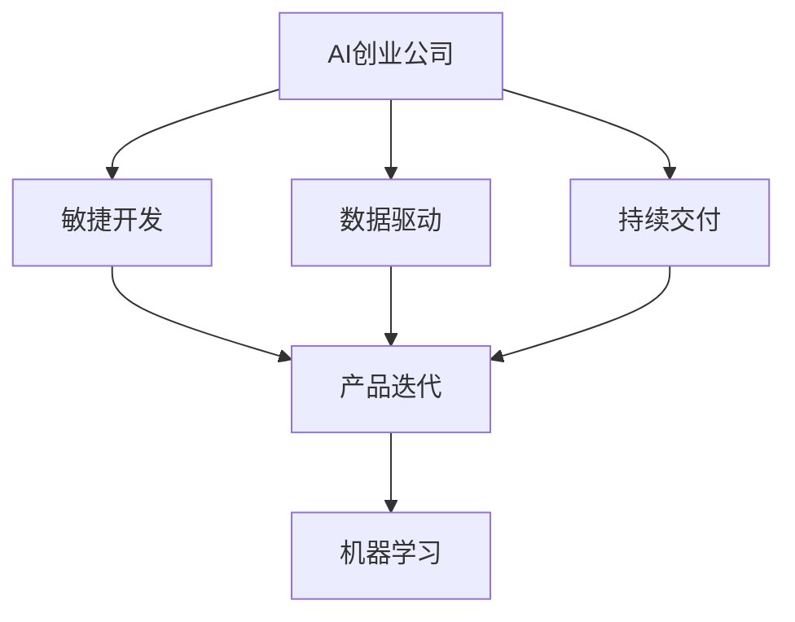

                 

# AI创业公司的产品迭代策略

> 关键词：AI创业公司、产品迭代、敏捷开发、数据驱动、持续交付、机器学习

## 1. 背景介绍

在AI技术的推动下，越来越多的创业公司涌现出来，提供基于AI的产品和服务。然而，构建和维护一个成功的AI产品并不是一件容易的事情，特别是在快速变化的市场上，产品需要不断地迭代更新，以满足用户需求和市场变化。本文将探讨AI创业公司产品迭代策略的核心要素，以及如何通过数据驱动、敏捷开发和持续交付等方法，快速实现产品的迭代和优化。

## 2. 核心概念与联系

### 2.1 核心概念概述

为更好地理解AI创业公司产品迭代策略，本节将介绍几个关键概念：

- AI创业公司：指以AI技术为核心的创业公司，提供基于AI的产品或服务，如智能推荐、智能客服、医疗影像诊断等。
- 产品迭代：指通过不断改进和更新产品的功能、性能和用户体验，来满足用户需求和市场变化的过程。
- 敏捷开发：一种快速、灵活的软件开发方法，强调快速反馈和持续改进，以应对市场变化和用户需求。
- 数据驱动：基于数据收集和分析，决策产品开发方向和优化策略，确保产品符合用户需求和市场趋势。
- 持续交付：通过自动化管道和流程，确保产品质量和稳定性，实现快速、可靠的产品发布。
- 机器学习：利用数据和算法，自动学习和优化产品功能，提高产品性能和用户体验。

这些核心概念之间的逻辑关系可以通过以下Mermaid流程图来展示：



这个流程图展示了AI创业公司的核心概念及其之间的关系：

1. 公司构建基于AI的产品，通过敏捷开发方法快速迭代产品。
2. 数据驱动帮助公司在迭代过程中了解用户需求和市场趋势，并据此优化产品。
3. 持续交付保证产品的快速发布和可靠性，支持不断迭代。
4. 机器学习技术用于自动化产品的优化和提升，进一步增强产品的性能和用户体验。

这些概念共同构成了AI创业公司产品迭代的核心框架，使其能够快速适应市场变化，持续改进产品，提升用户满意度和市场竞争力。

## 3. 核心算法原理 & 具体操作步骤

### 3.1 算法原理概述

AI创业公司的产品迭代策略，本质上是一个基于数据驱动和机器学习的快速迭代过程。其核心思想是：通过敏捷开发方法，快速响应市场变化和用户需求，结合数据驱动的策略，深入了解用户行为和市场趋势，并利用机器学习技术，自动化产品的优化和提升。

形式化地，假设一个AI创业公司有一个正在迭代的产品$P$，通过市场调查和用户反馈收集到的数据集为$D$。产品迭代的目标是最大化用户满意度和市场竞争力，即：

$$
\max_{P} \sum_{i \in D} U_i(P) - C_i(P)
$$

其中，$U_i(P)$为第$i$个用户对产品$P$的满意度，$C_i(P)$为产品$P$对第$i$个用户的成本（如运营成本、维护成本等）。优化目标是最大化所有用户的总满意度减去总成本，确保产品在市场和经济上的成功。

### 3.2 算法步骤详解

基于数据驱动和机器学习的AI创业公司产品迭代过程，一般包括以下几个关键步骤：

**Step 1: 用户需求分析和市场调研**
- 进行用户需求分析，了解目标用户群体的痛点和需求。
- 收集市场数据，分析市场趋势和竞争对手动态。

**Step 2: 敏捷开发和原型设计**
- 通过敏捷开发方法，快速构建产品原型，并根据用户反馈进行迭代优化。
- 设计易于使用和升级的原型，以支持快速迭代和持续改进。

**Step 3: 数据收集和分析**
- 在原型发布后，通过用户行为数据、反馈和市场调查等方式，收集数据。
- 使用数据分析工具，如TensorFlow、PyTorch等，对数据进行深入分析，了解用户行为和市场趋势。

**Step 4: 机器学习模型优化**
- 根据数据分析结果，构建和训练机器学习模型，自动化产品的优化和提升。
- 使用机器学习模型，预测和优化产品功能，提高用户体验和满意度。

**Step 5: 产品发布和迭代**
- 发布优化后的产品版本，收集用户反馈和新需求。
- 根据用户反馈和市场变化，继续迭代优化产品，实现持续交付和快速响应。

### 3.3 算法优缺点

基于数据驱动和机器学习的AI创业公司产品迭代方法具有以下优点：
1. 快速响应市场变化：敏捷开发方法使得产品能够快速迭代，快速适应市场变化和用户需求。
2. 深入理解用户行为：数据驱动帮助公司深入了解用户行为和市场趋势，确保产品符合用户需求。
3. 自动化优化提升：机器学习技术用于自动化产品的优化和提升，减少人力投入。
4. 持续交付可靠产品：持续交付机制确保产品的快速发布和可靠性，支持不断迭代。

同时，该方法也存在一定的局限性：
1. 对数据依赖度高：需要大量的用户行为数据和市场调查数据，才能保证优化策略的有效性。
2. 模型复杂度高：构建和维护机器学习模型需要较高的技术门槛和资源投入。
3. 迭代周期较长：数据收集和模型训练需要一定的时间，迭代周期较长。
4. 模型过拟合风险：数据质量差或标注不充分可能导致模型过拟合，影响优化效果。

尽管存在这些局限性，但就目前而言，基于数据驱动和机器学习的迭代方法仍是目前AI创业公司的主流策略。未来相关研究的重点在于如何进一步降低数据依赖，提高模型效率和优化周期，同时兼顾模型可解释性和伦理安全性等因素。

### 3.4 算法应用领域

基于数据驱动和机器学习的AI创业公司产品迭代方法，在NLP、推荐系统、智能客服、医疗影像诊断等多个领域得到广泛应用。例如：

- 在自然语言处理(NLP)领域，基于用户输入的文本数据，通过机器学习模型，生成自然流畅的回复，提升智能客服的交互体验。
- 在推荐系统领域，根据用户行为数据和偏好，构建推荐模型，推荐个性化内容，提升用户满意度。
- 在智能客服领域，通过机器学习模型，对用户咨询问题进行自动分类和回答，提高客服效率和用户满意度。
- 在医疗影像诊断领域，使用机器学习模型，对医疗影像进行自动标注和分析，辅助医生进行诊断和治疗。

除了上述这些经典应用外，AI创业公司还通过持续迭代和优化，不断拓展AI技术的应用领域，带来更多的创新和突破。

## 4. 数学模型和公式 & 详细讲解 & 举例说明

### 4.1 数学模型构建

本节将使用数学语言对AI创业公司产品迭代过程进行更加严格的刻画。

记产品$P$的满意度函数为$U(P)$，成本函数为$C(P)$，则产品迭代的目标函数为：

$$
\max_{P} \sum_{i \in D} U_i(P) - C_i(P)
$$

其中，$U_i(P)$为第$i$个用户对产品$P$的满意度，$C_i(P)$为产品$P$对第$i$个用户的成本。优化目标是最大化所有用户的总满意度减去总成本，确保产品在市场和经济上的成功。

### 4.2 公式推导过程

以下是推导产品迭代目标函数的过程：

1. 假设用户$i$对产品$P$的满意度为$U_i(P)$，成本为$C_i(P)$。
2. 用户满意度$U_i(P)$可以表示为$U_i(P) = U_i^{base}(P) + \sum_{j=1}^{n} w_jU_i^{j}(P)$，其中$U_i^{base}$为基本满意度，$U_i^{j}(P)$为第$j$个功能的用户满意度，$w_j$为功能权重。
3. 用户成本$C_i(P)$可以表示为$C_i(P) = C_i^{base}(P) + \sum_{j=1}^{n} w_jC_i^{j}(P)$，其中$C_i^{base}$为基本成本，$C_i^{j}(P)$为第$j$个功能的成本，$w_j$为功能权重。
4. 因此，总满意度函数$U(P)$和总成本函数$C(P)$可以表示为：

$$
U(P) = \sum_{i \in D} U_i(P) = \sum_{i \in D} (U_i^{base}(P) + \sum_{j=1}^{n} w_jU_i^{j}(P))
$$

$$
C(P) = \sum_{i \in D} C_i(P) = \sum_{i \in D} (C_i^{base}(P) + \sum_{j=1}^{n} w_jC_i^{j}(P))
$$

5. 根据上述定义，产品迭代的目标函数可以表示为：

$$
\max_{P} \sum_{i \in D} U_i(P) - C_i(P)
$$

其中，$D$为用户数据集。

### 4.3 案例分析与讲解

以下以一个智能推荐系统为例，分析如何通过数据驱动和机器学习实现产品迭代：

假设一个电商网站上的智能推荐系统，旨在为用户推荐商品。系统需要根据用户浏览、购买、评价等行为数据，为用户推荐最符合其兴趣的商品。

1. 用户需求分析和市场调研：通过用户调研和市场分析，了解用户对商品推荐系统的需求和期望。
2. 敏捷开发和原型设计：使用敏捷开发方法，快速构建推荐系统原型，并根据用户反馈进行迭代优化。
3. 数据收集和分析：在原型发布后，通过用户行为数据、反馈和市场调查等方式，收集数据。
4. 机器学习模型优化：使用用户行为数据，构建推荐模型，自动化推荐算法的优化和提升。
5. 产品发布和迭代：发布优化后的推荐系统，收集用户反馈和新需求，继续迭代优化推荐算法，实现持续交付和快速响应。

## 5. 项目实践：代码实例和详细解释说明

### 5.1 开发环境搭建

在进行AI创业公司产品迭代实践前，我们需要准备好开发环境。以下是使用Python进行TensorFlow开发的环境配置流程：

1. 安装Anaconda：从官网下载并安装Anaconda，用于创建独立的Python环境。
2. 创建并激活虚拟环境：
```bash
conda create -n tf-env python=3.8 
conda activate tf-env
```
3. 安装TensorFlow：根据CUDA版本，从官网获取对应的安装命令。例如：
```bash
conda install tensorflow -c conda-forge
```
4. 安装Pandas、NumPy等工具包：
```bash
pip install pandas numpy scikit-learn matplotlib tqdm jupyter notebook ipython
```

完成上述步骤后，即可在`tf-env`环境中开始产品迭代实践。

### 5.2 源代码详细实现

下面我们以一个基于用户行为数据的推荐系统为例，给出使用TensorFlow进行产品迭代的PyTorch代码实现。

首先，定义推荐系统的数据处理函数：

```python
import pandas as pd
from sklearn.preprocessing import LabelEncoder

def process_data(data_path):
    # 读取数据
    df = pd.read_csv(data_path)
    
    # 特征编码
    label_encoder = LabelEncoder()
    df['user_id'] = label_encoder.fit_transform(df['user_id'])
    df['item_id'] = label_encoder.fit_transform(df['item_id'])
    
    # 划分训练集和测试集
    train_data = df.sample(frac=0.8, random_state=42)
    test_data = df.drop(train_data.index)
    
    # 特征工程
    train_data['user_id'] = train_data['user_id'].astype(str)
    train_data['item_id'] = train_data['item_id'].astype(str)
    
    return train_data, test_data
```

然后，定义推荐模型的训练和预测函数：

```python
import tensorflow as tf
from tensorflow.keras.layers import Input, Embedding, Dot, Dense
from tensorflow.keras.models import Model

def train_model(train_data, test_data):
    # 定义输入层
    user_id_input = Input(shape=(1,), name='user_id')
    item_id_input = Input(shape=(1,), name='item_id')
    
    # 定义用户和物品的嵌入层
    user_embedding = Embedding(train_data['user_id'].max()+1, 32, name='user_embedding')(user_id_input)
    item_embedding = Embedding(train_data['item_id'].max()+1, 32, name='item_embedding')(item_id_input)
    
    # 定义点积层
    dot_product = Dot(axes=1)([user_embedding, item_embedding])
    
    # 定义全连接层
    output = Dense(1, activation='sigmoid')(dot_product)
    
    # 定义模型
    model = Model(inputs=[user_id_input, item_id_input], outputs=output)
    
    # 编译模型
    model.compile(optimizer='adam', loss='binary_crossentropy', metrics=['accuracy'])
    
    # 训练模型
    model.fit(x=[train_data['user_id'].values, train_data['item_id'].values],
              y=train_data['label'].values,
              epochs=10,
              batch_size=64,
              validation_data=(test_data['user_id'].values, test_data['item_id'].values, test_data['label'].values))
    
    # 评估模型
    test_loss, test_acc = model.evaluate(x=[test_data['user_id'].values, test_data['item_id'].values],
                                      y=test_data['label'].values)
    print(f'Test loss: {test_loss:.4f}, Test accuracy: {test_acc:.4f}')
    
    return model
```

最后，启动训练流程并在测试集上评估：

```python
train_data, test_data = process_data('data.csv')

model = train_model(train_data, test_data)
```

以上就是使用TensorFlow对推荐系统进行产品迭代的完整代码实现。可以看到，TensorFlow提供了丰富的API和工具，使得推荐系统的构建和优化变得简洁高效。

### 5.3 代码解读与分析

让我们再详细解读一下关键代码的实现细节：

**process_data函数**：
- 读取数据集，并进行特征编码和数据划分。
- 使用LabelEncoder对用户ID和物品ID进行编码，转换为数值型特征。
- 使用train_test_split将数据集划分为训练集和测试集。

**train_model函数**：
- 定义用户ID和物品ID的输入层，使用Embedding层将它们转换为向量表示。
- 使用Dot层计算用户和物品向量表示的点积，得到推荐分数。
- 使用全连接层对推荐分数进行二分类处理，输出预测结果。
- 定义模型，使用adam优化器进行训练，损失函数为二元交叉熵。
- 在训练过程中，使用validation_data参数，在测试集上监控模型性能。
- 训练完成后，评估模型在测试集上的性能，并返回模型对象。

**训练流程**：
- 调用process_data函数，读取并处理数据集。
- 调用train_model函数，训练推荐模型。

可以看到，TensorFlow使得产品迭代的代码实现变得简洁高效，能够快速迭代和优化推荐模型。

当然，工业级的系统实现还需考虑更多因素，如模型保存和部署、超参数调优、多模型集成等。但核心的迭代范式基本与此类似。

## 6. 实际应用场景

### 6.1 智能推荐系统

基于用户行为数据的推荐系统，广泛应用于电商、视频、音乐等领域。通过实时收集和分析用户行为数据，推荐系统可以为用户提供个性化的商品、内容和服务，提高用户体验和满意度。

在技术实现上，可以收集用户浏览、购买、评分等行为数据，构建用户-物品交互图，使用图神经网络等方法进行模型训练和优化，提升推荐效果。同时，可以使用多模型集成、对抗样本生成等技术，进一步增强推荐系统的鲁棒性和公平性。

### 6.2 智能客服系统

基于用户交互数据的智能客服系统，可以自动回答用户咨询，解决用户问题，提高客服效率和用户满意度。通过实时收集和分析用户咨询数据，智能客服系统可以不断优化问答策略，提升回答质量。

在技术实现上，可以使用自然语言处理技术，构建对话模型，自动分析和匹配用户问题，生成自然流畅的回答。同时，可以使用多轮对话技术，实现复杂问题的多轮交互和解答。

### 6.3 智能广告系统

基于用户行为数据的智能广告系统，可以根据用户兴趣和行为特征，精准投放广告，提升广告效果和用户点击率。通过实时收集和分析用户行为数据，智能广告系统可以不断优化广告投放策略，提高广告转化率。

在技术实现上，可以使用用户画像构建技术，对用户进行兴趣标签和行为特征的建模。同时，可以使用多模型集成、A/B测试等技术，优化广告投放效果。

### 6.4 未来应用展望

随着AI技术的不断发展，基于用户行为数据的AI创业公司产品迭代方法将进一步拓展应用领域，带来更多的创新和突破。

在智慧医疗领域，基于用户健康数据的智能诊断系统，可以自动分析和诊断疾病，辅助医生进行诊断和治疗。在金融领域，基于用户行为数据的智能风险评估系统，可以实时监测和评估用户风险，提高风险管理水平。在教育领域，基于学生行为数据的智能学习系统，可以个性化推荐学习内容和资源，提升学习效果。

此外，在更多垂直领域，AI创业公司产品迭代方法将带来更多的创新和应用，为各行各业带来变革性影响。

## 7. 工具和资源推荐

### 7.1 学习资源推荐

为了帮助开发者系统掌握AI创业公司产品迭代理论基础和实践技巧，这里推荐一些优质的学习资源：

1. 《TensorFlow实战Google深度学习》书籍：由Google官方编写，全面介绍了TensorFlow的使用方法和实践案例，适合初学者入门。
2. 《机器学习实战》书籍：由Peter Harrington编写，介绍了多种机器学习算法和实际应用案例，适合入门和进阶学习。
3. 《深度学习入门：基于Python的理论与实现》在线课程：由知名AI专家李宏毅教授主讲，系统讲解深度学习理论和实践，适合系统学习。
4. 《AI产品经理入门与实战》课程：由知名AI产品经理Lisa主讲，讲解AI产品经理的角色定位和实战案例，适合产品经理学习。
5. 《自然语言处理入门与实战》课程：由知名NLP专家李斌教授主讲，讲解NLP理论和实践，适合NLP工程师学习。

通过对这些资源的学习实践，相信你一定能够快速掌握AI创业公司产品迭代的核心方法和技巧。

### 7.2 开发工具推荐

高效的开发离不开优秀的工具支持。以下是几款用于AI创业公司产品迭代开发的常用工具：

1. TensorFlow：由Google主导开发的开源深度学习框架，生产部署方便，适合大规模工程应用。
2. PyTorch：基于Python的开源深度学习框架，灵活动态的计算图，适合快速迭代研究。
3. Jupyter Notebook：开源的交互式开发环境，支持多语言编程和代码共享，适合数据分析和模型训练。
4. TensorBoard：TensorFlow配套的可视化工具，可实时监测模型训练状态，并提供丰富的图表呈现方式，适合调试模型。
5. Weights & Biases：模型训练的实验跟踪工具，可以记录和可视化模型训练过程中的各项指标，适合调优模型。

合理利用这些工具，可以显著提升AI创业公司产品迭代的开发效率，加快创新迭代的步伐。

### 7.3 相关论文推荐

AI创业公司产品迭代技术的发展源于学界的持续研究。以下是几篇奠基性的相关论文，推荐阅读：

1. "TensorFlow: A System for Large-Scale Machine Learning"（TensorFlow论文）：由Google团队撰写，介绍了TensorFlow的设计思想和应用案例，是TensorFlow的重要参考资料。
2. "Practical Recommendation Systems"（推荐系统论文）：由Wang等人撰写，介绍了多种推荐系统的构建和优化方法，是推荐系统的经典论文。
3. "Dialogue Systems"（对话系统论文）：由Li等人撰写，介绍了对话系统的构建和优化方法，是对话系统的经典论文。
4. "Machine Learning in Healthcare"（医疗领域论文）：由McCormick等人撰写，介绍了机器学习在医疗领域的应用和优化方法，是医疗领域的经典论文。

这些论文代表了大语言模型微调技术的发展脉络。通过学习这些前沿成果，可以帮助研究者把握学科前进方向，激发更多的创新灵感。

## 8. 总结：未来发展趋势与挑战

### 8.1 总结

本文对AI创业公司产品迭代策略进行了全面系统的介绍。首先阐述了AI创业公司产品迭代的核心要素，明确了产品迭代在快速响应市场变化、提升用户体验和满意度方面的独特价值。其次，从原理到实践，详细讲解了敏捷开发、数据驱动和持续交付等方法，给出了产品迭代的完整代码实例。同时，本文还广泛探讨了产品迭代方法在智能推荐、智能客服、智能广告等多个领域的应用前景，展示了产品迭代范式的巨大潜力。此外，本文精选了产品迭代技术的各类学习资源，力求为读者提供全方位的技术指引。

通过本文的系统梳理，可以看到，AI创业公司产品迭代策略将基于用户行为数据，通过数据驱动和机器学习技术，实现产品的快速迭代和优化，提升市场竞争力和用户体验。产品迭代需要开发者根据具体任务，不断迭代和优化模型、数据和算法，方能得到理想的效果。

### 8.2 未来发展趋势

展望未来，AI创业公司产品迭代技术将呈现以下几个发展趋势：

1. 数据驱动成为主流：数据驱动将成为产品迭代的主流策略，通过实时数据收集和分析，持续优化产品。
2. 自动化程度提升：自动化模型训练和优化将进一步提高，减少人工干预，提高迭代效率。
3. 跨领域融合：产品迭代将结合跨领域的知识和技术，拓展AI技术的应用领域，带来更多的创新和突破。
4. 多模态数据融合：产品迭代将结合多模态数据（如文本、图像、语音等），实现更全面、更深入的用户分析和推荐。
5. 个性化推荐系统：基于用户行为数据的个性化推荐系统将进一步提升，实现更精准、更个性化的推荐。

以上趋势凸显了AI创业公司产品迭代技术的广阔前景。这些方向的探索发展，必将进一步提升产品的性能和用户体验，为市场带来更多的价值和机会。

### 8.3 面临的挑战

尽管AI创业公司产品迭代技术已经取得了瞩目成就，但在迈向更加智能化、普适化应用的过程中，它仍面临着诸多挑战：

1. 数据质量瓶颈：数据质量差、标注不充分可能导致模型过拟合，影响优化效果。
2. 模型复杂度高：构建和维护复杂模型需要较高的技术门槛和资源投入。
3. 迭代周期较长：数据收集和模型训练需要一定的时间，迭代周期较长。
4. 模型可解释性不足：黑盒模型难以解释其内部工作机制和决策逻辑，影响用户信任和接受度。

尽管存在这些挑战，但就目前而言，基于数据驱动和机器学习的迭代方法仍是目前AI创业公司的主流策略。未来相关研究的重点在于如何进一步降低数据依赖，提高模型效率和优化周期，同时兼顾模型可解释性和伦理安全性等因素。

### 8.4 未来突破

面对AI创业公司产品迭代所面临的种种挑战，未来的研究需要在以下几个方面寻求新的突破：

1. 探索无监督和半监督迭代方法：摆脱对大规模标注数据的依赖，利用自监督学习、主动学习等无监督和半监督范式，最大限度利用非结构化数据，实现更加灵活高效的迭代。
2. 研究参数高效和计算高效的迭代范式：开发更加参数高效的迭代方法，在固定大部分预训练参数的同时，只更新极少量的任务相关参数。同时优化迭代模型的计算图，减少前向传播和反向传播的资源消耗，实现更加轻量级、实时性的部署。
3. 引入因果分析和博弈论工具：将因果分析方法引入迭代模型，识别出模型决策的关键特征，增强输出解释的因果性和逻辑性。借助博弈论工具刻画人机交互过程，主动探索并规避模型的脆弱点，提高系统稳定性。
4. 纳入伦理道德约束：在模型训练目标中引入伦理导向的评估指标，过滤和惩罚有偏见、有害的输出倾向。同时加强人工干预和审核，建立模型行为的监管机制，确保输出符合人类价值观和伦理道德。

这些研究方向的探索，必将引领AI创业公司产品迭代技术迈向更高的台阶，为构建安全、可靠、可解释、可控的智能系统铺平道路。面向未来，AI创业公司产品迭代技术还需要与其他人工智能技术进行更深入的融合，如知识表示、因果推理、强化学习等，多路径协同发力，共同推动人工智能技术在垂直行业的规模化落地。只有勇于创新、敢于突破，才能不断拓展AI技术的应用边界，让智能技术更好地造福人类社会。

## 9. 附录：常见问题与解答

**Q1：AI创业公司如何进行数据收集和处理？**

A: AI创业公司可以通过多种方式进行数据收集，包括：

1. 数据爬虫：从公开数据源（如网站、API等）爬取数据，进行预处理和清洗。
2. 用户行为数据：通过移动应用、网站等平台，实时收集用户行为数据。
3. 市场调查数据：通过问卷调查、用户反馈等方式，收集市场数据和用户需求。
4. 公开数据集：利用公开数据集进行模型训练和验证。

数据处理过程通常包括以下步骤：

1. 数据清洗：去除重复、异常数据，处理缺失值。
2. 特征工程：提取和构造特征，进行特征编码和转换。
3. 数据划分：将数据集划分为训练集、验证集和测试集。
4. 数据增强：通过数据增强技术（如近义替换、回译等），扩充训练集，提升模型泛化能力。

通过系统化的数据收集和处理，AI创业公司能够高效地构建和优化产品。

**Q2：AI创业公司如何进行模型评估和优化？**

A: AI创业公司可以通过多种方式进行模型评估和优化，包括：

1. 数据集划分：将数据集划分为训练集、验证集和测试集，使用验证集监控模型性能，使用测试集评估模型效果。
2. 损失函数：选择适当的损失函数，如交叉熵损失、均方误差损失等，进行模型优化。
3. 正则化技术：使用L2正则、Dropout、Early Stopping等技术，防止模型过拟合。
4. 模型集成：使用多模型集成技术，如Bagging、Boosting等，提升模型泛化能力和稳定性。
5. 超参数调优：使用网格搜索、随机搜索等方法，优化模型超参数，提升模型效果。

模型优化过程中，需要不断迭代和调整模型参数和算法，以适应数据和任务变化，提高模型性能和用户体验。

**Q3：AI创业公司如何进行产品迭代？**

A: AI创业公司进行产品迭代通常包括以下步骤：

1. 用户需求分析：通过市场调研和用户访谈，了解用户需求和期望。
2. 敏捷开发：使用敏捷开发方法，快速构建产品原型，并根据用户反馈进行迭代优化。
3. 数据收集：通过用户行为数据、反馈和市场调查等方式，收集数据。
4. 模型训练：使用收集到的数据，构建和训练机器学习模型，自动化产品优化。
5. 产品发布：发布优化后的产品版本，收集用户反馈和新需求。
6. 持续迭代：根据用户反馈和市场变化，继续迭代优化产品，实现持续交付和快速响应。

通过持续迭代和优化，AI创业公司能够不断提升产品的性能和用户体验，满足用户需求和市场变化。

**Q4：AI创业公司如何进行模型部署和监控？**

A: AI创业公司进行模型部署和监控通常包括以下步骤：

1. 模型裁剪：去除不必要的层和参数，减小模型尺寸，加快推理速度。
2. 量化加速：将浮点模型转为定点模型，压缩存储空间，提高计算效率。
3. 服务化封装：将模型封装为标准化服务接口，便于集成调用。
4. 弹性伸缩：根据请求流量动态调整资源配置，平衡服务质量和成本。
5. 监控告警：实时采集系统指标，设置异常告警阈值，确保服务稳定性。
6. 安全防护：采用访问鉴权、数据脱敏等措施，保障数据和模型安全。

通过系统化的部署和监控，AI创业公司能够保证产品的稳定性和安全性，实现快速迭代和优化。

---

作者：禅与计算机程序设计艺术 / Zen and the Art of Computer Programming

