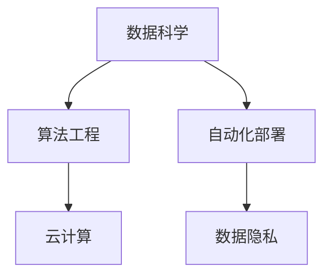

                 

# AI创业公司的机遇:在巨头夹缝中求生存

## 1. 背景介绍

### 1.1 问题由来

随着人工智能技术的飞速发展，AI创业公司面临着前所未有的机遇与挑战。一方面，AI技术在医疗、金融、零售、制造业等多个行业的应用前景广阔，为创业者提供了丰富的商业机会。但另一方面，AI巨头如Google、Amazon、Microsoft等已经积累了大量的数据、算法和人才资源，创业公司要想在这些巨头夹缝中求得生存和发展，必须具备独特的前瞻性、创新性和市场敏锐度。

本文将深入探讨AI创业公司的机遇与挑战，分析其在巨头夹缝中生存和发展的关键因素，并提出一些具体的应对策略。

## 2. 核心概念与联系

### 2.1 核心概念概述

在探讨AI创业公司的发展机会前，我们需要先了解一些核心概念：

- **AI创业公司**：指专注于人工智能技术开发和应用的创业企业，涵盖机器学习、自然语言处理、计算机视觉等多个子领域。
- **数据科学**：利用数据和技术解决实际问题的学科，包括数据收集、处理、分析、可视化等环节。
- **算法工程**：将机器学习算法应用于实际工程问题，包括模型设计、优化、部署等。
- **云计算**：利用互联网基础设施提供计算和存储服务，支持AI模型的训练、推理和应用。
- **自动化部署**：将模型集成到自动化系统中，实现快速响应、无缝集成、持续迭代等功能。
- **数据隐私**：在数据收集、存储、处理和分享过程中，保护用户隐私和数据安全。

这些概念构成了AI创业公司发展的核心框架，涉及从数据科学、算法工程到自动化部署和数据隐私等多个环节。

### 2.2 核心概念原理和架构的 Mermaid 流程图



该流程图展示了AI创业公司发展的基本架构：以数据科学为基础，通过算法工程实现模型创新，利用云计算提供计算资源，最终通过自动化部署实现业务落地，同时确保数据隐私和安全。

## 3. 核心算法原理 & 具体操作步骤

### 3.1 算法原理概述

AI创业公司的核心算法原理主要包括数据科学、算法工程和自动化部署三个方面：

- **数据科学**：涉及数据收集、清洗、处理和分析等环节，旨在从海量数据中提取有价值的信息，为算法工程提供数据支撑。
- **算法工程**：利用机器学习和深度学习算法，对数据进行建模和预测，从而实现业务的自动化和智能化。
- **自动化部署**：将模型集成到自动化系统中，实现模型训练、推理、监控、更新等功能的自动化管理。

### 3.2 算法步骤详解

以下是AI创业公司常用的核心算法步骤：

1. **数据收集**：从各个渠道收集数据，包括公开数据集、互联网爬虫数据、企业内部数据等。
2. **数据清洗与预处理**：去除噪声和缺失数据，对数据进行归一化、标准化等预处理，确保数据质量。
3. **特征工程**：提取和选择对业务目标有帮助的特征，进行特征转换和特征选择，提高模型性能。
4. **模型训练与验证**：选择适当的算法，对数据进行训练和验证，调整模型参数，优化模型性能。
5. **模型部署与监控**：将模型部署到生产环境，实时监控模型性能，定期更新模型。
6. **自动化流水线**：将以上步骤集成到自动化流水线中，实现持续迭代和优化。

### 3.3 算法优缺点

#### 3.3.1 优点

- **快速迭代**：自动化流水线支持快速迭代和模型优化，能够迅速应对市场变化。
- **数据驱动**：基于数据科学的方法，能够实现更准确的业务预测和决策。
- **高效计算**：利用云计算资源，能够实现大规模数据处理和模型训练。

#### 3.3.2 缺点

- **数据质量要求高**：数据质量直接影响模型性能，需要投入大量资源进行数据清洗和处理。
- **算法复杂度高**：机器学习和深度学习算法复杂，需要专业的算法工程师进行设计和调优。
- **资源消耗大**：大规模数据处理和模型训练需要大量计算资源和存储资源，成本较高。

### 3.4 算法应用领域

AI创业公司的算法应用领域广泛，涵盖了医疗、金融、零售、制造等多个行业。以下是一些典型的应用场景：

- **医疗领域**：利用AI技术进行疾病预测、诊断、治疗方案推荐等。
- **金融领域**：利用AI进行风险评估、信用评分、自动化交易等。
- **零售领域**：利用AI进行客户行为分析、个性化推荐、库存管理等。
- **制造领域**：利用AI进行设备预测性维护、质量检测、供应链优化等。

## 4. 数学模型和公式 & 详细讲解 & 举例说明

### 4.1 数学模型构建

在AI创业公司中，常用的数学模型包括线性回归、逻辑回归、决策树、随机森林、神经网络等。以线性回归为例，其数学模型为：

$$ y = \theta_0 + \theta_1x_1 + \theta_2x_2 + ... + \theta_nx_n $$

其中，$y$ 为预测值，$x_i$ 为特征向量，$\theta_i$ 为模型参数。

### 4.2 公式推导过程

线性回归的损失函数为均方误差（MSE）：

$$ L = \frac{1}{2n}\sum_{i=1}^n(y_i - \hat{y}_i)^2 $$

其中，$n$ 为样本数量，$\hat{y}_i$ 为模型预测值。

通过梯度下降算法，求得参数$\theta_i$的更新公式为：

$$ \theta_i \leftarrow \theta_i - \eta\frac{1}{n}\sum_{i=1}^n(x_i - \bar{x})(y_i - \hat{y}_i) $$

其中，$\eta$为学习率，$\bar{x}$为特征向量的均值。

### 4.3 案例分析与讲解

假设有一个电商网站的销售预测模型，目标预测下一个月的销售额。特征包括：上个月的销售额、季节性因素、节假日促销等因素。

- **数据收集**：从电商平台获取销售数据，包括历史销售记录、促销活动、用户行为等。
- **数据清洗与预处理**：清洗缺失数据，对销售数据进行归一化处理。
- **特征工程**：选择与销售相关的特征，如季节性因素、节假日促销等，进行特征转换和特征选择。
- **模型训练与验证**：选择线性回归模型，利用历史数据进行训练和验证，调整模型参数。
- **模型部署与监控**：将模型部署到生产环境，实时监控模型性能，定期更新模型。

## 5. 项目实践：代码实例和详细解释说明

### 5.1 开发环境搭建

以下是Python环境中搭建AI创业公司开发环境的步骤：

1. **安装Python**：从官网下载并安装Python，选择3.x版本。
2. **安装依赖库**：安装常用的依赖库，如numpy、pandas、scikit-learn、tensorflow等。
3. **安装Jupyter Notebook**：使用pip安装Jupyter Notebook，支持Python代码的交互式开发和展示。
4. **安装Git和GitHub**：使用Git进行代码版本控制，从GitHub获取和上传代码。
5. **安装Docker**：使用Docker进行容器化部署，确保代码在生产环境中的稳定性。

### 5.2 源代码详细实现

以下是使用Python实现线性回归模型的示例代码：

```python
import numpy as np
from sklearn.linear_model import LinearRegression

# 构建数据集
X = np.array([[1, 2, 3], [4, 5, 6], [7, 8, 9], [10, 11, 12]])
y = np.array([4, 7, 10, 13])

# 创建模型
model = LinearRegression()

# 训练模型
model.fit(X, y)

# 预测新数据
X_new = np.array([[13, 14, 15]])
y_pred = model.predict(X_new)

print(y_pred)
```

该代码展示了使用线性回归模型进行数据预测的完整流程，包括数据准备、模型训练、预测输出等步骤。

### 5.3 代码解读与分析

- **数据准备**：使用NumPy库构建训练数据集，特征为二维数组X，目标为y。
- **模型创建**：使用Scikit-learn库创建线性回归模型。
- **模型训练**：使用模型fit方法对训练数据进行拟合，调整模型参数。
- **预测输出**：使用模型predict方法对新数据进行预测，得到输出结果。

## 6. 实际应用场景

### 6.1 智能客服

AI创业公司可以利用自然语言处理技术，开发智能客服系统，提升客户服务效率和质量。智能客服系统可以处理常见问题、回答客户咨询、提供个性化服务等功能。

### 6.2 风险评估

金融领域可以利用AI创业公司的风险评估模型，实时监控客户信用状况，进行风险预测和预警。该模型可以分析客户的交易行为、财务状况等数据，预测违约风险。

### 6.3 个性化推荐

零售领域可以利用AI创业公司的个性化推荐模型，根据客户历史行为和偏好，推荐适合的商品和服务。该模型可以分析客户的浏览记录、购买历史等数据，进行推荐。

### 6.4 未来应用展望

未来，AI创业公司将在更多的领域发挥重要作用。例如：

- **医疗领域**：利用AI进行疾病诊断、治疗方案推荐、药物研发等，提升医疗服务的智能化水平。
- **教育领域**：利用AI进行个性化教学、作业批改、学习推荐等，提升教育公平和教学质量。
- **制造领域**：利用AI进行设备预测性维护、质量检测、供应链优化等，提升制造效率和质量。
- **城市治理**：利用AI进行交通管理、环境监测、公共安全等，提升城市管理的智能化水平。

## 7. 工具和资源推荐

### 7.1 学习资源推荐

为了帮助AI创业者掌握相关技能，以下是一些推荐的资源：

1. **机器学习课程**：斯坦福大学、Coursera等平台提供的机器学习和深度学习课程。
2. **AI创业项目**：Kaggle等平台提供的AI创业项目竞赛，帮助创业者积累实战经验。
3. **技术博客**：Medium、Towards Data Science等平台上的技术博客，分享最新AI技术和项目经验。
4. **书籍**：《深度学习》、《机器学习实战》等经典书籍，全面介绍AI技术和应用。
5. **开源框架**：TensorFlow、PyTorch等开源框架，提供丰富的工具和库支持。

### 7.2 开发工具推荐

以下是一些常用的开发工具：

1. **Python**：Python是AI开发的主流语言，支持丰富的第三方库和框架。
2. **Jupyter Notebook**：交互式开发环境，支持代码运行和结果展示。
3. **Git**：版本控制工具，支持代码协作和版本管理。
4. **Docker**：容器化部署工具，确保代码在生产环境中的稳定性。
5. **TensorFlow**：深度学习框架，支持高效的模型训练和推理。

### 7.3 相关论文推荐

以下是一些经典的AI创业公司论文：

1. **《Neural Networks and Deep Learning》**：Deep Learning领域经典书籍，涵盖深度学习算法和应用。
2. **《Reinforcement Learning: An Introduction》**：强化学习领域经典书籍，介绍强化学习算法和应用。
3. **《Advances in Neural Information Processing Systems》**：NIPS大会论文集，展示最新的AI技术和应用。
4. **《Natural Language Processing with Transformers》**：Transformer领域的经典书籍，介绍Transformer结构和应用。
5. **《Hands-On Machine Learning with Scikit-Learn, Keras, and TensorFlow》**：实战型书籍，介绍机器学习和深度学习框架的使用。

## 8. 总结：未来发展趋势与挑战

### 8.1 总结

本文对AI创业公司在巨头夹缝中的生存和发展进行了系统探讨。首先介绍了AI创业公司的背景和核心概念，然后详细讲解了数据科学、算法工程和自动化部署等关键技术。通过具体案例和代码实例，展示了AI创业公司的实际应用场景。最后，推荐了一些学习资源和开发工具，提供了未来发展的展望和挑战。

通过本文的系统梳理，可以看到，AI创业公司在AI巨头夹缝中求生存和发展，需要具备独特的前瞻性、创新性和市场敏锐度。只有在数据科学、算法工程和自动化部署等方面持续优化和创新，才能在竞争激烈的AI市场中脱颖而出。

### 8.2 未来发展趋势

未来，AI创业公司将在更多领域发挥重要作用，主要趋势包括：

1. **技术融合**：AI创业公司将与其他技术（如区块链、物联网、5G等）深度融合，形成跨领域解决方案。
2. **模型集成**：AI创业公司将整合各类算法模型，实现更全面、更准确的业务预测和决策。
3. **数据共享**：AI创业公司将通过数据共享平台，实现数据的多方合作和协作。
4. **自动化运维**：AI创业公司将开发自动化运维工具，实现模型的持续迭代和优化。
5. **市场细分**：AI创业公司将聚焦于特定行业和场景，提供专业的解决方案。

### 8.3 面临的挑战

尽管AI创业公司发展前景广阔，但仍面临诸多挑战：

1. **数据获取和处理**：获取高质量的数据和进行数据清洗是AI创业公司的核心难题。
2. **算法优化**：需要不断优化和调整算法模型，确保模型性能和稳定性。
3. **市场竞争**：在AI巨头夹缝中求生存，需要具备强大的竞争力和市场敏锐度。
4. **技术壁垒**：AI创业公司需要具备强大的技术实力和研发能力，才能持续创新。
5. **伦理和法律**：AI创业公司需要遵守伦理和法律规范，确保技术应用的安全性和公正性。

### 8.4 研究展望

未来，AI创业公司需要在技术、市场和伦理等多个方面进行持续研究和创新。以下是一些研究方向：

1. **模型可解释性**：研究模型的可解释性，提高模型的透明度和可解释性。
2. **数据隐私保护**：研究数据隐私保护技术，确保数据安全和隐私保护。
3. **跨领域应用**：研究跨领域应用技术，提升AI技术在不同场景下的适用性。
4. **可持续发展**：研究AI技术的可持续发展，提升社会效益和环境效益。
5. **人机协同**：研究人机协同技术，提升AI系统的人性化和智能化水平。

总之，AI创业公司需要在技术、市场和伦理等多个方面持续创新和优化，才能在AI巨头夹缝中求生存和发展。只有勇于创新、敢于突破，才能不断拓展AI技术的边界，为社会创造更多价值。

## 9. 附录：常见问题与解答

**Q1: AI创业公司如何获取高质量的数据？**

A: AI创业公司可以通过以下方式获取高质量的数据：

1. **公开数据集**：利用Kaggle、UCI等平台上的公开数据集，获取相关领域的数据。
2. **互联网爬虫**：通过爬虫技术，从互联网获取大量的非结构化数据。
3. **企业内部数据**：利用企业的内部数据，获取企业的业务数据和客户数据。
4. **合作伙伴数据**：与其他企业或机构进行数据共享和合作，获取更多的数据。

**Q2: AI创业公司如何处理数据？**

A: AI创业公司可以通过以下方式处理数据：

1. **数据清洗**：去除数据中的噪声和缺失值，进行数据清洗。
2. **特征工程**：选择和构造对业务目标有帮助的特征，进行特征选择和特征转换。
3. **数据归一化**：对数据进行归一化处理，确保数据在同一尺度上。
4. **数据采样**：对数据进行采样，避免数据过拟合。
5. **数据可视化**：利用数据可视化技术，对数据进行可视化展示，帮助理解和分析数据。

**Q3: AI创业公司如何设计算法模型？**

A: AI创业公司可以通过以下方式设计算法模型：

1. **选择算法**：根据业务目标和数据特点，选择适当的算法模型。
2. **模型训练**：利用数据对模型进行训练，调整模型参数。
3. **模型评估**：利用测试集对模型进行评估，选择最优模型。
4. **模型调优**：对模型进行调优，提高模型性能。
5. **模型部署**：将模型部署到生产环境，进行实时预测和推理。

**Q4: AI创业公司如何实现自动化部署？**

A: AI创业公司可以通过以下方式实现自动化部署：

1. **CI/CD**：使用CI/CD（持续集成/持续部署）工具，实现代码的自动化构建、测试和部署。
2. **自动化流水线**：将模型训练、测试和部署等环节集成到自动化流水线中，实现持续迭代和优化。
3. **容器化部署**：使用Docker等容器化技术，实现模型的稳定部署和扩展。
4. **自动化运维**：开发自动化运维工具，实时监控模型性能，及时发现和解决异常。

**Q5: AI创业公司如何确保数据隐私和安全？**

A: AI创业公司可以通过以下方式确保数据隐私和安全：

1. **数据加密**：对数据进行加密处理，确保数据在传输和存储过程中的安全性。
2. **访问控制**：对数据进行访问控制，确保只有授权人员可以访问数据。
3. **数据脱敏**：对数据进行脱敏处理，去除敏感信息。
4. **隐私保护**：利用隐私保护技术，如差分隐私、联邦学习等，保护用户隐私。
5. **合规审查**：遵守相关的隐私保护法规，如GDPR、CCPA等，确保数据合规。

---

作者：禅与计算机程序设计艺术 / Zen and the Art of Computer Programming

